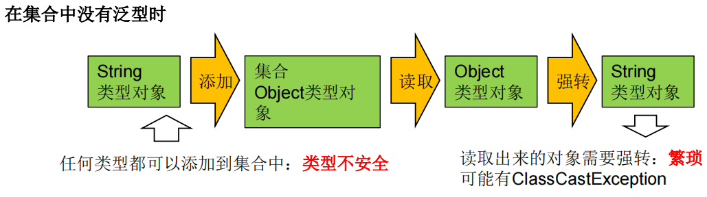
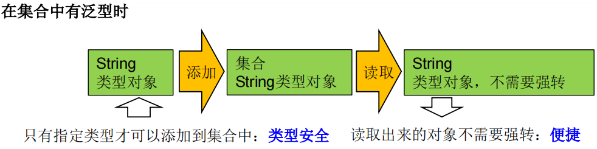

# 泛型

## 概念

泛型，就是允许在定义类、接口时通过一个标识表示类中某个属性的类型或者是某个方法的返回值及参数类型。这个类型参数将在使用时确定

泛型的类型必须是类，不能是基本数据类型

> 从JDK1.5以后，Java引入了“参数化类型（Parameterized type）”的概念，允许我们在创建集合时再指定集合元素的类型，正如：`List<String>`，这表明该List只能保存字符串类型的对象。
>
> JDK1.5改写了集合框架中的全部接口和类，为这些接口、类增加了泛型支持，从而可以在声明集合变量、创建集合对象时传入类型实参

## 为什么要使用泛型？

1. 编译时就会进行类型检查，保证数据的安全
2. 解决获取数据元素时，需要类型强制转换的问题








> Java泛型可以保证如果程序在编译时没有发出警告，运行时就不会产生ClassCastException异常。同时，代码更加简洁、健壮

## 自定义泛型

### 泛型类和泛型接口

1. 泛型类可能有多个参数，此时应将多个参数一起放在尖括号内。比如：`<E1,E2,E3>`
2. 泛型类的构造器如下：`public GenericClass(){}`。而下面是错误的：`public GenericClass<E>(){}`
3. 实例化后，操作原来泛型位置的结构必须与指定的泛型类型一致。
4. 泛型不同的引用不能相互赋值。（int型的ArrayList不能直接赋值给String型的）
5. 泛型如果不指定，将被擦除，泛型对应的类型均按照Object处理，但不等价于Object。经验：泛型要使用一路都用。要不用，一路都不要用。
6. 如果泛型结构是一个接口或抽象类，则不可创建泛型类的对象。
7. 泛型的指定中不能使用基本数据类型，可以使用包装类替换。
8. 在静态方法中不能使用类的泛型。（静态结构早于对象创建）
9. 异常类不能是泛型的
10. 不能使用`new E[]`。但是可以：`E[] elements = (E[])new Object[capacity]`
11. 父类有泛型，子类可以选择保留泛型也可以选择指定泛型类型


### 泛型方法

方法，也可以被泛型化，不管此时定义在其中的类是不是泛型类。

在泛型方法中可以定义泛型参数，此时，参数的类型就是传入数据的类型。

泛型方法的格式：

```
[访问权限] <泛型> 返回类型 方法名([泛型标识 参数名称]) 抛出的异常
```


泛型方法可以是静态的，因为这里的泛型参数是在调用方法时确定的，并非是在实例化类的时候确定的

## 通配符

### 类型通配符`？`

举例：`List<?>` ，`Map<?,?>`；

`List<?>`是`List<String>`、`List<Object>`等各种泛型 List 的父类。

`List<Object>`、`List<String>`两者是并列关系，不具有父子类关系

<br/>

```java
Collection<?> c = new ArrayList<String>();
c.add(new Object()); // 编译时错误，因为我们不知道c的元素类型，我们不能向其中添加对象
```

1. 读取`List<?>`的对象 list 中的元素时，永远是安全的，因为不管 list 的真实类型是什么，它包含的都是 Object
2. 写入 list 中的元素时，不行。（除非添加`null`）


### 通配符上下限

上限 extends：使用时指定的类型必须是继承某个类，或者实现某个接口

下限 super：使用时指定的类型不能小于操作的类


