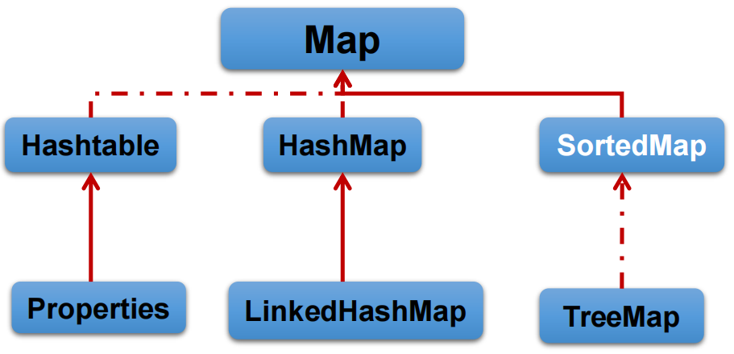

# 集合

## Collection接口

Collection 接口是 List、Set 和 Queue 接口的父接口，该接口里定义的方法既可用于操作 Set 集合，也可用于操作 List 和 Queue 集合

JDK不提供此接口的任何直接实现，而是提供更具体的子接口(如：Set和List)实现

在 Java5 之前，Java 集合会丢失容器中所有对象的数据类型，把所有对象都当成 Object 类型处理；从 JDK 5.0 增加了泛型以后，Java 集合可以记住容器中对象的数据类型。

### 常用方法

| Modifier and Type | Method and Description                                       |
| :---------------- | :----------------------------------------------------------- |
| `boolean`         | `add(E e)`                                                   |
| `boolean`         | `addAll(Collection<? extends E> c)`                          |
| `void`            | `clear()`                                                    |
| `boolean`         | `contains(Object o)`                                         |
| `boolean`         | `containsAll(Collection<?> c)` 比较两个集合的各个元素是否相同 |
| `boolean`         | `equals(Object o)`                                           |
| `int`             | `hashCode()`                                                 |
| `boolean`         | `isEmpty()`                                                  |
| `Iterator<E>`     | `iterator()` 返回迭代器对象，用于集合遍历                    |
| `boolean`         | `remove(Object o)`                                           |
| `boolean`         | `removeAll(Collection<?> c)` 差集                            |
| `boolean`         | `retainAll(Collection<?> c)` 交集                            |
| `int`             | `size()`                                                     |
| `Object[]`        | `toArray()` 转成对象数组                                     |
| `<T> T[]`         | `toArray(T[] a)`                                             |

<br/>

向 Collection 接口的实现类的对象中添加数据 obj 时，要求 obj 所在类重写 `equals` 方法

数组 --> 集合：调用 `Arrays` 类的 `asList` 静态方法

### 迭代器

- 提供一种方法访问一个容器(container)对象中各个元素，而又不需暴露该对象的内部细节。迭代器模式，就是为容器而生

- Iterator 仅用于遍历集合，Iterator 本身并不提供承装对象的能力。如果需要创建 Iterator 对象，则必须有一个被迭代的集合

- 集合对象每次调用iterator()方法都得到一个全新的迭代器对象，默认游标都在集合的第一个元素之前

| Modifier and Type | Method and Description              |
| ----------------- | ----------------------------------- |
| `boolean`         | `hasNext()`                         |
| `E`               | `next()`                            |
| `default void`    | `remove()` 删除迭代器的最后一个元素 |

标准遍历写法：

```java
while(iterator.hasNext()){
	System.out.println(iterator.next());
}
```


移除元素：

```java
Iterator iter = coll.iterator();//回到起点
while(iter.hasNext()){
    Object obj = iter.next();
    if(obj.equals("Tom")){
        iter.remove();
    }
}
```

Iterator 删除集合的元素，是遍历过程中通过迭代器对象的 remove 方法，不是集合对象的remove方法。 

如果还未调用 `next()` 或在上一次调用 `next` 方法之后已经调用了 `remove` 方法，再调用 `remove` 都会报`IllegalStateException`，即调用 `remove` 之前必须先调 `next`，而且必须成对使用

> 移除元素的操作不常使用

### 增强for循环

Java 5.0 提供了 foreach 循环迭代访问 **Collection 和数组**。

遍历操作不需获取Collection或数组的长度，无需使用索引访问元素；底层调用迭代器

<br/>

练习题

```java

String[] str = new String[5];
for (String myStr : str) {
    myStr = "atguigu";
    System.out.println(myStr);
}
for (int i = 0; i < str.length; i++) {
	System.out.println(str[i]);// 输出的全部
} 
```

数组元素不会被修改，因为增强for循环那里是定义了一个临时变量，对临时变量修改值，不会影响原始的数组的值

## List接口

List集合类中**元素有序、且可重复**，集合中的每个元素都有其对应的顺序索引

List容器中的元素都对应一个整数型的序号记载其在容器中的位置，可以根据序号存取容器中的元素

实现类常用的有：ArrayList、LinkedList 和 Vector

### 三个实现类的异同

同：都实现类 List 接口；存储数据的特点相同

不同：

1、ArrayList 是 List 接口的主要实现类；`Object` 数组实现，默认容量10；线程不安全，效率高；1.5倍扩容

2、LinkedList 底层使用双向链表实现；适合插入、删除操作多的；线程不安全

3、Vector 是最古老的实现类；`Object` 数组实现，默认容量10；线程安全，效率低；2倍扩容

### 源码和扩容机制

#### ArrayList扩容

默认1.5倍扩容（`int newCapacity = oldCapacity + (oldCapacity >> 1)`），然后复制元素到新数组（` Arrays.copyOf(elementData, newCapacity)`）

> 建议使用带参数的构造器，避免频繁扩容

<br/>

调用无参构造器：

- JDK7直接创建了一个容量为10的数组；
- JDK8最开始是一个容量是0的空数组，只有第一次调用`add`方法加入新元素的时候才会创建容量为10的空数组，然后把数据放到数组里面。后续添加和扩容和JDK7相同

总结：JDK7类似单例的饿汉模式，JDK8类似懒汉，延迟了数组的创建

> Arrays.asList(…) 方法返回的 List 集合，既不是 ArrayList 实例，也不是 Vector 实例。 Arrays.asList(…) 返回值是一个固定长度的 List 集合

#### Vector源码分析

调用无参构造直接创建了一个容量为10的空数组；扩容的时候，默认扩容为原来的2倍

```java
int newCapacity = oldCapacity + 
    ((capacityIncrement > 0) ? capacityIncrement : oldCapacity);// capacityIncrement默认为0
// 等价于
int newCapacity = oldCapacity * 2;
```


> 基本不用，就算考虑线程安全也不用这个

### 常用方法

List除了从Collection集合继承的方法外，List 集合里添加了一些根据索引来操作集合元素的方法

| Modifier and Type | Method and Description                       |
| :---------------- | :------------------------------------------- |
| `boolean`         | `add(E e)` 增                                |
| `E`               | `remove(int index)` 删                       |
| `E`               | `set(int index, E element)` 改               |
| `E`               | `get(int index)` 查                          |
| `void`            | `add(int index, E element)` 插入             |
| `List<E>`         | `subList(int fromIndex, int toIndex)` 子列表 |


变量方法：迭代器遍历、增强for循环、普通for循环

<br/>

```java
public static void main(String[] args) {
    List list = new ArrayList();
    list.add(1);
    list.add(2);
    list.add(3);
    updateList(list);
    System.out.println(list);
}

private static void updateList(List list) {
    // list.remove(2);// 按照索引删的
    list.remove(new Integer(2));// 按照对象删的
}
```

## Set接口

无序的，不可重复的

Collection的子接口，set接口没有提供额外的方法

判断两个对象是否相同不是使用 `==` 运算符，而是根据 `equals()` 方法

存放在Set容器中的对象，对应的类一定要重写`equals()`和`hashCode(Object obj)`方法，以实现对象相等规则。即：“相等的对象必须具有相等的散列码”

> 无序性：不等于随机性。
>
> 不可重复性：保证添加的元素按照 `equals()` 方法判断时，不能返回true

### HashSet

特点：无序；线程不安全；集合元素可以是 `null`；底层是数组加链表（哈希表）；大多数时候使用 Set 集合时都使用这个实现类

判断两个元素相等：两个对象通过 `hashCode()` 方法比较相等，并且两个对象的 `equals()` 方法返回值也相等

#### 扩容机制

初始容量为 16，当如果使用率超过 0.75，就会扩大容量为原来的 2 倍

#### 添加元素的过程（底层使用HashMap）

1. 先调用该对象的 hashCode() 方法来得到该对象的哈希值，然后根据哈希值，通过散列函数计算该对象在底层数组中的存储位置。
2. 如果该位置没有元素，则添加成功；
3. 如果有元素，则和现有元素比较哈希值
	1. 如果和现有元素哈希值不同，则添加元素；
	2. 如果哈希值相等，会再继续调用 equals 方法。（调用自己的 equals 方法和别人比）
		1. 如果 equals 方法结果为 true，说明元素重复了，添加失败；
		2. 如果为 false，则添加元素。

添加元素时如果有冲突，使用拉链法处理冲突（JDK7 头插法，8 是尾插法，即七上八下）


> 如果两个元素的 equals() 方法返回 true，但它们的 hashCode() 返回值不相等，hashSet 将会把它们存储在不同的位置，但依然可以添加成功

### LinkedHashSet

特点：HashSet 的子类；底层是数组+链表+双向链表，使得元素看起来是以插入顺序保存的；插入性能略低于 HashSet，但在遍历全部元素性能高于HashSet；线程不安全

> 遍历的时候的顺序就是添加的顺序
>
> 与HashSet的不同之处在于，它维护一个遍历其所有条目的双向链表。这个链表定义了迭代顺序，即元素插入到集合中的顺序(插入顺序)。原来只是一个单向链表（只有一个`next`指针），现在又在每个节点上加了2个指针`before`，`after`，用来记录节点的插入顺序（每次新建一个节点的时候都会维护这个双端链表）
>
> 底层使用了LinkedHashMap

### TreeSet（了解即可）

特点：底层是红黑树；可以按照添加对象的指定属性进行排序；默认遍历输出的顺序是自然排序（从小到大）

TreeSet中的数据要求是相同类的对象；

调用构造器的时候可以指定排序规则

```java
public TreeSet(Comparator<? super E> comparator)
```


自然排序：需要实现 `Comparable` 接口。比较的时候看 `compareTo` 的返回值，不是调用  `equals` 方法

定制排序：结合 `Comparator` 使用。比较的标准是 `compare` 方法的返回值

## Map接口

Map 接口和 Collection 接口同级，没有父子关系

### 特点

- 双列数据，存储 key-value 对的数据；
- key 无序的，不可重复的，使用 Set 存储所有的 key （`Set<K> keySet()`）；key 所在的类需要重写`equals`和`hashCode` 方法（以 HashMap 为例）
- value 无序的，可重复的；使用 Collecction 存储所有的 value（`Collection<V> values()`）；values  所在的类需要重写`equals` 方法
- `key-value` 构成了一个 `Entry` 对象，因为 key 的特性，所以也是无序的、不可重复的，也是用 Set 存储（`Set<Map.Entry<K, V>> entrySet()`）

### 实现类



<br/>

- HashMap：Map的主要实现类；线程不安全；可以存储null的key和value
	- LinkedHashMap：保证遍历的时候可以按照添加的顺序实现遍历（在哈希表的基础上添加了一对指针`before, after`）
- TreeMap：保证按照添加的键值对进行排序，使用key的自然排序或者定制排序；底层是红黑树
- Hashtable：古老的实现类；线程安全；不可以存储null的key和value
	- Properties：常用来处理配置文件。key 和 value 都是`String`类型


```java
Properties properties = new Properties();

try(InputStream file =new FileInputStream("jdbc.properties")) {
    properties.load(file);// 加载文件
    String name = properties.getProperty("name");
    String password = properties.getProperty("password");

    System.out.println(name + ", " + password);
}
catch (Exception e){
    e.printStackTrace();
}

/*
* 文件内容如下：
* name=Tom
* password=123456
*/
```


### 常用方法

以 HashMap 为例：

| Modifier and Type     | Method and Description                                       |
| :-------------------- | :----------------------------------------------------------- |
| `boolean`             | `containsKey(Object key)`Returns `true` if this map contains a mapping for the specified key. 查 |
| `boolean`             | `containsValue(Object value)`Returns `true` if this map maps one or more keys to the specified value. 查 |
| `V`                   | `get(Object key)`Returns the value to which the specified key is mapped, or `null` if this map contains no mapping for the key. 查 |
| `V`                   | `getOrDefault(Object key, V defaultValue)`Returns the value to which the specified key is mapped, or `defaultValue` if this map contains no mapping for the key. |
| `boolean`             | `isEmpty()`Returns `true` if this map contains no key-value mappings. |
| `V`                   | `put(K key, V value)`Associates the specified value with the specified key in this map. 增（改） |
| `V`                   | `replace(K key, V value)`Replaces the entry for the specified key only if it is currently mapped to some value. 改（知道 key，不关心原始的 value） |
| `boolean`             | `replace(K key, V oldValue, V newValue)`Replaces the entry for the specified key only if currently mapped to the specified value. 改 |
| `V`                   | `remove(Object key)`Removes the mapping for the specified key from this map if present. 删 |
| `void`                | `clear()` 清空                                               |
| `Set<K>`              | `keySet()`Returns a `Set` view of the keys contained in this map. |
| `Set<Map.Entry<K,V>>` | `entrySet()`Returns a `Set` view of the mappings contained in this map. |
| `Collection<V>`       | `values()`Returns a `Collection` view of the values contained in this map. |


### 面试题

#### 1、HashMap底层源码

jdk7及之前：数组+链表（也就是哈希表，解决冲突的方法是头插法）

jdk8：数组+链表+红黑树

##### JDK 7

`HashMap map = new HashMap()`

- 在实例化之后，底层创建了一个容量是 16 的一维数组 `Entry<K,V>[] table`
- `map.put(key1, value1)`，会先计算 `key1` 的哈希值，然后根据哈希值计算在哈希表中的位置
- 如果该位置没有数据，则直接放；
- 如果有数据，则和链表中的每个节点都比较（键的）哈希值。
	- 如果和链表中每个节点的（键的）哈希值都不同，则使用头插法插入数据
	- 如果哈希值相同，再调用 `key1` 所在类的`equals` 方法比较键是否相同。如果相同则覆盖 `value` 值，如果不同则使用头插法插入数据

> 当HashMap中的元素个数超过`数组大小*loadFactor` （且要存放的位置非空） ， 就会进行数组扩容，扩容时 2 倍扩容

JDK 7u7 源码如下：

```java
// 实例化过程
public HashMap() {
    this(DEFAULT_INITIAL_CAPACITY, DEFAULT_LOAD_FACTOR);// 16, 0.75f
}

public HashMap(int initialCapacity, float loadFactor) {
    /**
    * 省略非关键部分代码
    */

    // Find a power of 2 >= initialCapacity
    int capacity = 1;
    while (capacity < initialCapacity)
        capacity <<= 1;

    this.loadFactor = loadFactor;
    threshold = (int)Math.min(capacity * loadFactor, MAXIMUM_CAPACITY + 1);
    table = new Entry[capacity];// 创建数组
    useAltHashing = sun.misc.VM.isBooted() &&
        (capacity >= Holder.ALTERNATIVE_HASHING_THRESHOLD);
    init();
}
```

```java
// put 过程
public V put(K key, V value) {
    if (key == null)
        return putForNullKey(value);
    int hash = hash(key);// 计算哈希值
    int i = indexFor(hash, table.length);// 计算在哈希表中的位置
    
    // 如果该位置有数据
    for (Entry<K,V> e = table[i]; e != null; e = e.next) {
        Object k;
        if (e.hash == hash && ((k = e.key) == key || key.equals(k))) {
            V oldValue = e.value;
            e.value = value;// 替换原有的值
            e.recordAccess(this);
            return oldValue;
        }
    }

    modCount++;
    addEntry(hash, key, value, i);// 该位置没有数据没有数据直接放置
    return null;
}

void addEntry(int hash, K key, V value, int bucketIndex) {
    if ((size >= threshold) && (null != table[bucketIndex])) {
        resize(2 * table.length);// 2倍扩容
        hash = (null != key) ? hash(key) : 0;
        bucketIndex = indexFor(hash, table.length);
    }

    createEntry(hash, key, value, bucketIndex);
}

   
void createEntry(int hash, K key, V value, int bucketIndex) {
    Entry<K,V> e = table[bucketIndex];
    table[bucketIndex] = new Entry<>(hash, key, value, e);// 头插法
    size++;
}
```


> 最新的JDK 7u80 `new HashMap()` 底层是使用预先创建好的空数组，第一次 `put` 元素的时候才会创建容量为 16 的数组，其余不变

##### JDK8

以 8u201 为例：

不同点：

- `new HashMap()` 底层没有直接创建容量为 16 的数组，第一次 `put` 元素的时候才会创建这个数组
- JDK 8 底层数组是 `Node[]`，并非 `Entry[]` 
- 往链表中插入数据是尾插法
- 当底层数组某一个链表容量大于等于 8，并且底层数组长度大于等于 64，则该位置上的所有数据会改为红黑树存储

> 装载因子：哈希表中元素个数和表大小的比值

## Collections工具类

- 一个操作 Set、List 和 Map 等集合的工具类
- 提供了一系列静态的方法对集合元素进行排序、查询和修改等操作
- 提供了对集合对象设置不可变、对集合对象实现同步控制等方法

### 常用方法

#### 排序

`reverse(List)`：反转 List 中元素的顺序

`shuffle(List)`：对 List 集合元素进行随机排序

`sort(List)`：根据元素的自然顺序对指定 List 集合元素按升序排序

`sort(List, Comparator)`：根据指定的 Comparator 产生的顺序对 List 集合元素进行排序

`swap(List, int, int)`：将指定 list 集合中的 i 处元素和 j 处元素进行交换

#### 查找、替换

`Object max(Collection)`：根据元素的自然顺序，返回给定集合中的最大元素

`Object max(Collection, Comparator`)：根据 Comparator 指定的顺序，返回给定集合中的最大元素

`Object min(Collection)`、`Object min(Collection, Comparator)`

`int frequency(Collection, Object)`：返回指定集合中指定元素的出现次数

`void copy(List dest, List src)`：将src中的内容复制到dest中 

`boolean replaceAll(List list, Object oldVal, Object newVal)`：使用新值替换List 对象的所有旧值

`int binarySearch(List list, Object key, Comparator c)`：二分查找给定 key 的索引（比较器可选）

#### 同步控制

 `synchronizedXxx()` 方法，该方法可使将指定集合**包装成线程同步的**集合，从而可以解决多线程并发访问集合时的线程安全问题

| Modifier and Type | Method and Description |
| :---------------- | :--------------------- |
| `static <T> Collection<T>`       | `synchronizedCollection(Collection<T> c)`Returns a synchronized (thread-safe) collection backed by the specified collection. |
| `static <T> List<T>`             | `synchronizedList(List<T> list)`Returns a synchronized (thread-safe) list backed by the specified list. |
| `static <K,V> Map<K,V>`          | `synchronizedMap(Map<K,V> m)`Returns a synchronized (thread-safe) map backed by the specified map. |
| `static <T> Set<T>`              | `synchronizedSet(Set<T> s)`Returns a synchronized (thread-safe) set backed by the specified set. |
| `static <K,V> SortedMap<K,V>`    | `synchronizedSortedMap(SortedMap<K,V> m)`Returns a synchronized (thread-safe) sorted map backed by the specified sorted map. |
| `static <T> SortedSet<T>`        | `synchronizedSortedSet(SortedSet<T> s)`Returns a synchronized (thread-safe) sorted set backed by the specified sorted set. |
