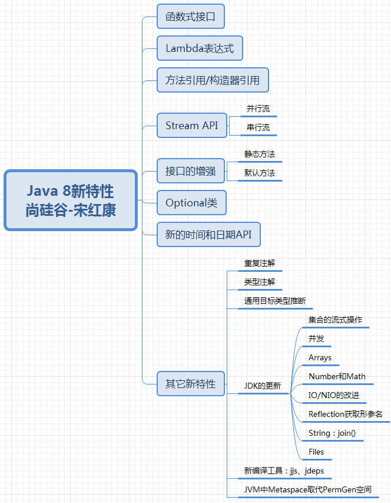

# Java8的新特性




## Lambda表达式

Lambda 是一个匿名函数，我们可以把 Lambda 表达式理解为是一段可以传递的代码（将代码像数据一样进行传递）。使用它可以写出更简洁、更灵活的代码

本质：针对的都是函数式接口，相当于为接口提供了一个接口实现类的实例

对接口的要求：只能有一个抽象方法，这样的方法也被成为函数式接口

> 平时能看的懂即可，不一定非得用

```java
// 匿名内部类
Runnable r1 = new Runnable() {
    @Override
    public void run() {
        System.out.println("Hello world");
    }
};

// 转换为 lambda 表达式
Runnable r1 = () -> System.out.println("Hello world");
```

<br/>

`->`， 该操作符被称为 Lambda 操作符或箭头操作符。它将 Lambda 分为两个部分：

- 左侧：指定了 Lambda 表达式需要的参数列表
- 右侧：指定了 Lambda 体，是抽象方法的实现逻辑，也即Lambda 表达式要执行的功能

<br/>

语法特性：

- 数据类型可以省略，可由编译器推断得出，称为“类型推断”
- 若只有一个参数时，参数的小括号可以省略
- 当方法体只有一条语句时，return 与大括号都可以省略

## 函数式接口

只包含一个抽象方法的接口

可以在一个接口上使用 `@FunctionalInterface` 注解，这样做可以检查它是否是一个函数式接口

在 `java.util.function` 包下定义了Java 8 的丰富的函数式接口

Lambda 表达式就是一个函数式接口的实例

> 函数式接口里面可以有默认方法

```java
// 举例
@FunctionalInterface
public interface Runnable {
    public abstract void run();
}
```

### 四大基本函数式接口

| 函数式接口                     | 参数类型 | 返回类型 | 用途                                                         |
| ------------------------------ | -------- | -------- | ------------------------------------------------------------ |
| `Consumer<T>`<br/>消费型接口   | T        | void     | 对类型为 T 的对象应用操作，包含方法：`void accept(T t)`      |
| `Supplier<T>`<br/>供给型接口   | 无       | T        | 返回类型为 T 的对象，包含方法：`T get()`                     |
| `Function<T,R>`<br/>函数型接口 | T        | R        | 对类型为 T 的对象应用操作，并返回结果。<br/>结果是 R 类型的对象。包含方法：`R apply(T t)` |
| `Predicate<T>`<br/>断定型接口  | T        | boolean  | 确定类型为T的对象是否满足某约束，并返回 boolean 值。<br/>包含方法：`boolean test(T t)` |

## 方法引用

当要传递给Lambda体的操作，已经有实现的方法了，可以使用方法引用！

方法引用可以看做是Lambda表达式深层次的表达。

换句话说，方法引用就是Lambda表达式，也就是函数式接口的一个实例，通过方法的名字来指向一个方法，可以认为是Lambda表达式的一个**语法糖**。

要求：实现接口的抽象方法的参数列表和返回值类型，必须与方法引用的方法的参数列表和返回值类型保持一致

格式：使用操作符 `::` 将类(或对象) 与 方法名分隔开来。

三种主要使用情况： 

`对象::实例方法名`、`类::静态方法名`、`类::非静态方法`

<br/>

举例：

```java
Consumer<String>  c1 = (str) -> System.out.println(str);
c1.accept("Hello world");

// 改造之后
// 方法1: `对象::实例方法名`
Consumer<String>  c1 = System.out::println;// out 是 System 类内部的一个对象
c1.accept("Hello world");

// 方法2: `对象::实例方法名`
PrintStream ps = System.out;
Consumer<String> c1 = ps::println;
c1.accept("Hello world");
```

```java
Comparator<Integer> com = (t1, t2) -> Integer.compare(t1, t2);

// 改成方法引用，`类::静态方法名`
Comparator<Integer> com = Integer::compare;

// 下面这种修改了原始方法返回值的不能使用方法引用
Comparator<Integer> com = (t1, t2) -> -(Integer.compare(t1, t2));// 原始方法结果返回值取反，不能使用方法引用
```

```java
Comparator<String> com = (t1, t2) -> t1.compareTo(t2);

// `类::非静态方法`
Comparator<String> com = String::compareTo;
```

## 构造器引用

格式： `ClassName::new `

与函数式接口相结合，自动与函数式接口中方法兼容。

可以把构造器引用赋值给定义的方法，要求构造器参数列表要与接口中抽象方法的参数列表一致！且方法的返回值即为构造器对应类的对象

```java
Supplier<Date> s = () -> new Date();

// 改造以后
Supplier<Date> s = Date::new;
```

## 数组引用

格式：`type[] :: new`

```java
Function<Integer, Integer[]> fun = new Function<Integer, Integer[]>() {
    @Override
    public Integer[] apply(Integer n) {
        return new Integer[n];
    }
};

// 改造成 lambda 表达式
Function<Integer, Integer[]> fun = (n) -> new Integer[n];

// 改造成数组引用
Function<Integer, Integer[]> fun = Integer[]::new;
```

## Stream

把真正的函数式编程风格引入到 Java 中

Java8 中处理集合的关键抽象概念，可以指定你希望对集合进行的操作，可以执行非常复杂的查找、过滤和映射数据等操作。 

使用Stream API 对集合数据进行操作，就类似于使用 SQL 执行的数据库查询。

可以使用 Stream API 来并行执行操作

<br/>

特点：

- Stream 自己不会存储元素。

- Stream 不会改变源对象。会返回一个持有结果的新 Stream。 

- Stream 操作是延迟执行的。这意味着他们会等到需要结果的时候才执行

### 三步走

（1）创建 Stream。一个数据源（如：集合、数组），获取一个流

（2）中间操作。一个中间操作链，对数据源的数据进行处理

（3）终止操作。一旦执行终止操作，就执行中间操作链，并产生结果。之后，不会再被使用

### 创建 Stream

（1）通过集合

Java8 中的 Collection 接口被扩展，提供了两个获取流的方法： 

`default Stream<E> stream()` : 返回一个顺序流

`default Stream<E> parallelStream() `: 返回一个并行流

（2）通过数组

Java8 中的 Arrays 的静态方法 stream() 可以获取数组流：

`static <T> Stream<T> stream(T[] array)`: 返回一个流

（3）通过 Stream 的 `of` 方法

可以调用Stream类静态方法 of(), 通过显示值创建一个流。它可以接收任意数量的参数。

`public static<T> Stream<T> of(T... values) `: 返回一个流

（4）创建无限流

可以使用静态方法 `Stream.iterate()` 和 `Stream.generate()`，创建无限流。

迭代：`public static<T> Stream<T> iterate(final T seed, final UnaryOperator<T> f) `

生成：`public static<T> Stream<T> generate(Supplier<T> s)`

### Stream中间操作

多个中间操作可以连接起来形成一个流水线，除非流水线上触发终止操作，否则中间操作不会执行任何的处理！而在终止操作时一次性全部处理，称为“惰性求值”

方法基本上都在 `Stream` 接口

<br/>

筛选与切片：

| 方法                  | 描述                                                         |
| --------------------- | ------------------------------------------------------------ |
| `filter(Predicate p)` | 接收 Lambda 表达式， 从流中排除某些元素                      |
| `distinct()`          | 筛选，通过流所生成元素的 hashCode() 和 equals() 去除重复元素 |
| `limit(long maxSize)` | 截断流，使其元素不超过给定数量                               |
| `skip(long n)`        | 跳过元素，返回一个扔掉了前 n 个元素的流。<br/>若流中元素不足 n 个，则返回一个空流。与 limit(n) 互补 |

映射：

| 方法                              | 描述                                                         |
| --------------------------------- | ------------------------------------------------------------ |
| `map(Function f)`                 | 接收一个函数作为参数，该函数会被应用到每个元<br/>素上，并将其映射成一个新的元素 |
| `flatMap(Function f)`             | 接收一个函数作为参数，将流中的每个值都换成另<br/>一个流，然后把所有流连接成一个流 |
| `mapToDouble(ToDoubleFunction f)` | 接收一个函数作为参数，该函数会被应用到每个元<br/>素上，产生一个新的 DoubleStream。 |

排序：

| 方法                      | 描述                               |
| ------------------------- | ---------------------------------- |
| `sorted()`                | 产生一个新流，其中按自然顺序排序   |
| `sorted(Comparator com) ` | 产生一个新流，其中按比较器顺序排序 |

### 终止操作

终端操作会从流的流水线生成结果。其结果可以是任何不是流的值，例如：List、Integer，甚至是 void 。 

流进行了终止操作后，不能再次使用。想再次使用流操作，那就重新创建一个流。

<br/>

匹配与查找：

| 方法                      | 描述                                                         |
| ------------------------- | ------------------------------------------------------------ |
| `allMatch(Predicate p) `  | 检查是否匹配所有元素                                         |
| `anyMatch(Predicate p) `  | 检查是否至少匹配一个元素                                     |
| `noneMatch(Predicate p) ` | 检查是否没有匹配所有元素                                     |
| `findFirst() `            | 返回第一个元素                                               |
| `findAny() `              | 返回当前流中的任意元素                                       |
| `count() `                | 返回流中元素总数                                             |
| `max(Comparator c) `      | 返回流中最大值                                               |
| `min(Comparator c) `      | 返回流中最小值                                               |
| `forEach(Consumer c)`     | 内部迭代(使用 Collection 接口需要用户去做迭代，<br/>称为外部迭代。相反，Stream API 使用内部迭<br/>代——它帮你把迭代做了) |

归约：

| 方法                                | 描述                                                         |
| ----------------------------------- | ------------------------------------------------------------ |
| `reduce(T iden, BinaryOperator b) ` | 可以将流中元素反复结合起来，得到一<br/>个值。返回 T          |
| `reduce(BinaryOperator b) `         | 可以将流中元素反复结合起来，得到一<br/>个值。返回 `Optional<T>` |

收集：

| 方法                   | 描述                                                         |
| ---------------------- | ------------------------------------------------------------ |
| `collect(Collector c)` | 将流转换为其他形式。接收一个 Collector<br/>接口的实现，用于给Stream中元素做汇总<br/>的方法 |

## Optional类

> 了解即可

为了解决空指针异常，Google公司著名的Guava项目引入了Optional类，Guava通过使用检查空值的方式来防止代码污染，它鼓励程序员写更干净的代码。受到Google Guava的启发，Optional类已经成为Java 8类库的一部分。

`Optional<T>` 类(java.util.Optional) 是一个容器类，它可以保存类型T的值，代表这个值存在。或者仅仅保存null，表示这个值不存在。原来用 null 表示一个值不存在，现在 Optional 可以更好的表达这个概念。并且可以避免空指针异常。

Optional类的Javadoc描述如下：这是一个可以为null的容器对象。如果值存在则isPresent()方法会返回true，调用get()方法会返回该对象

<br/>

### 常用方法

创建Optional类对象的方法：

- `Optional.of(T t)` : 创建一个 Optional 实例，t必须非空； 

- `Optional.empty()` : 创建一个空的 Optional 实例

- `Optional.ofNullable(T t)`：t可以为null

判断Optional容器中是否包含对象：

- `boolean isPresent()` : 判断是否包含对象
- `void ifPresent(Consumer<? super T> consumer) `：如果有值，就执行Consumer接口的实现代码，并且该值会作为参数传给它。

获取Optional容器的对象：

- `T get()`: 如果调用对象包含值，返回该值，否则抛异常
- `T orElse(T other) `：如果有值则将其返回，否则返回传入的other对象。
- `T orElseGet(Supplier<? extends T> other)` ：如果有值则将其返回，否则返回由Supplier接口实现提供的对象。
- `T orElseThrow(Supplier<? extends X> exceptionSupplier)` ：如果有值则将其返回，否则抛出由Supplier接口实现提供的异常

```java
public String getGirlName(Boy boy){
    return boy.getGirl().getName();// 对象可能为null
}

// 一般改造
public String getGirlName1(Boy boy){
    if(boy != null){
        Girl girl = boy.getGirl();
        if(girl != null){
            return girl.getName();
        }
    }

    return null;

}

//使用Optional类的getGirlName():
public String getGirlName2(Boy boy){

    Optional<Boy> boyOptional = Optional.ofNullable(boy);
    //此时的boy1一定非空
    Boy boy1 = boyOptional.orElse(new Boy(new Girl("迪丽热巴")));

    Girl girl = boy1.getGirl();

    Optional<Girl> girlOptional = Optional.ofNullable(girl);
    //girl1一定非空
    Girl girl1 = girlOptional.orElse(new Girl("古力娜扎"));

    return girl1.getName();
}
```

