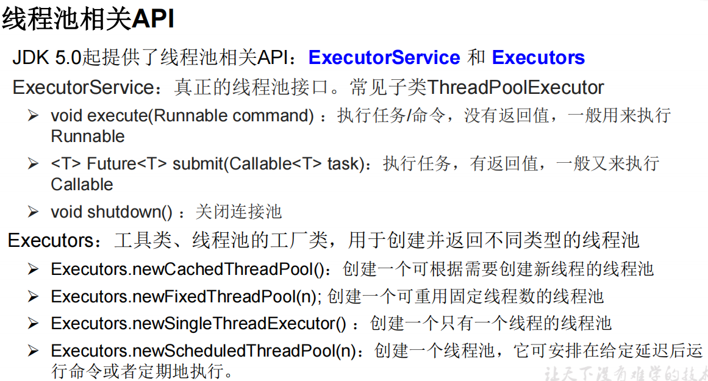

# 多线程

## 线程创建的四种方式

1. 继承`Thread`类，重写`run`方法，写具体的逻辑操作（之后创建子类对象，调用`start`方法）
2. 实现`Runnable`接口，重写`run`方法，将`Runnable`接口的子类对象作为实际参数传递给`Thread`类的构造器中，通过`Thread`类的对象调用`start`方法（用实现的方式好一些，实现的方式没有单继承的局限性，适合处理多个线程需要共享数据的情况）
2. 实现`Callable`接口：可以有返回值；方法可以抛异常；支持泛型的返回值；需要借助`FutureTask`类，比如获取返回结果（JDK 5新增）
2. 使用线程池。提前创建好，用的时候直接取，用完放回池子里。避免频繁创建销毁，可以重复利用；提高响应速度；便于线程管理

### 线程池相关




```java
public ThreadPoolExecutor(int corePoolSize, // 核心线程池大小
                          int maximumPoolSize, // 线程池最大大小
                          long keepAliveTime, // 当线程数大于核心线程池大小时，空闲线程等待新任务的最长时间
                          TimeUnit unit, // keepAliveTime参数的时间单位
                          BlockingQueue<Runnable> workQueue // 等待队列
                         )
```

示例代码：

```java
class NumberThread implements Runnable{

    @Override
    public void run() {
        for (int i = 0; i < 100; i++) {
            if(i % 2 == 0){
                System.out.println(Thread.currentThread().getName() + ": " + i);
            }
        }
    }
}

class NumberThread1 implements Runnable{

    @Override
    public void run() {
        for (int i = 0; i < 100; i++) {
            if(i % 2 != 0){
                System.out.println(Thread.currentThread().getName() + ": " + i);
            }
        }
    }
}

public class ThreadPoolTest {

    public static void main(String[] args) {

        ExecutorService service = Executors.newFixedThreadPool(10);

        // service.submit(); //适合使用Callable
        service.execute(new NumberThread()); // 适合使用Runable
        service.execute(new NumberThread1());
        // 关闭线程池
        service.shutdown();
    }

}
```


### 示例代码

```java
// 实现`Callable`接口的方式

// 1、创建Callable的实现类
class NumThread implements Callable{

    // 2、实现call方法
    @Override
    public Object call() throws Exception {
        int sum = 0;
        for (int i = 0; i < 100; i++) {
            if(i % 2 == 0){
                sum += i;
                System.out.println(i);
            }
        }

        return sum;
    }
}
public class ThreadNew {

    public static void main(String[] args) {
        // 3、创建Callable实现类的对象
        NumThread numThread = new NumThread();
        // 4、把Callable实现类的对象作为参数传递到FutureTask的构造器中，创建FutureTask对象
        FutureTask futureTask = new FutureTask(numThread);
        // 5、将FutureTask对象作为参数传递到Thread类的构造器中，创建Thread类对象，启动start方法
        new Thread(futureTask).start();

        try {
            // get() 的返回值就是FutureTask构造器参数Callable实现类重写的call方法的返回值
            Object o = futureTask.get();
            System.out.println("总和: " + o);
        } catch (InterruptedException e) {
            throw new RuntimeException(e);
        } catch (ExecutionException e) {
            throw new RuntimeException(e);
        }
    }
}
```


> 如果自己手动调用run()方法，那么就只是普通方法，没有启动多线程模式。
>
> run()方法由JVM调用，什么时候调用，执行的过程控制都有操作系统的CPU调度决定。
>
> 想要启动多线程，必须调用start方法。
>
> 一个线程对象只能调用一次start()方法启动，如果重复调用了，则将抛出异常“IllegalThreadStateException”


## 线程同步

只有多个线程操作同一份数据的时候才会考虑线程同步问题

多个线程执行的不稳定性会引起执行结果的不稳定

如果一个线程在操作共享数据的过程中，尚未完成操作，其他的线程也参与进来，操作共享数据。举例如下：


解决方式：**加锁**

### 同步代码块

`synchronized`关键字

```java
synchronized(同步监视器){
    // 需要被同步的代码
}
```

说明：

1. 操作共享数据的代码就是需要被同步的代码（操作系统里面的临界区和临界资源）
2. 同步监视器，俗称，锁。任何一个类的对象都能充当锁，但是多个线程必须用同一把锁。

> 在实现`Runnable`接口创建多线程的方式中，可以考虑`this`充当同步监视器
>
> 在继承`Thread`类创建多线程的方式中，可以考虑当前类的`class`对象充当同步监视器

操作同步代码时，只能有一个线程参与，其他线程等待。相当于一个单线程的过程，效率低一些。

### 同步方法

如果操作共享数据的代码完整声明在一个方法中，不妨将该方法实现为同步的

具体方法：使用`synchronized`关键字修饰方法

同步方法的同步监视器不需要自己显式声明

> 非静态方法的同步监视器是`this`
>
> 静态方法的同步监视器是当前类

### Lock锁

JDK5新增，用于线程同步

`ReentrantLock`：可以选择公平锁

进同步代码块之前加锁(`lock`)，出之后解锁(`unlock`)

1、实例化`ReentrantLock`

2、进同步代码块之前，调用`ReentrantLock`对象的`lock`方法

3、出之后调用`unlock`方法

> 可以结合try...finally语句，把解锁的语句放在`finally`中，保证锁被释放

#### 和`synchronized`的异同

同：解决线程安装

不同：

- `Lock`需要手动加锁并释放，`synchronized`是自动的
- `synchronized`可以用到方法和代码块中，lock只能在方法里用


优先使用顺序：Lock > 同步代码块 > 同步方法

