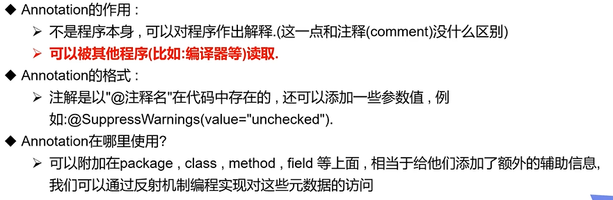
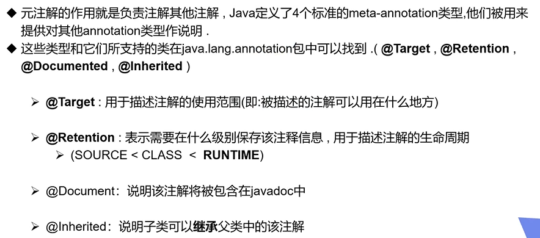
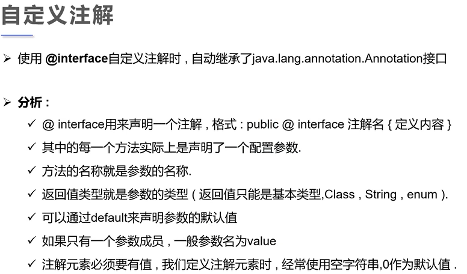
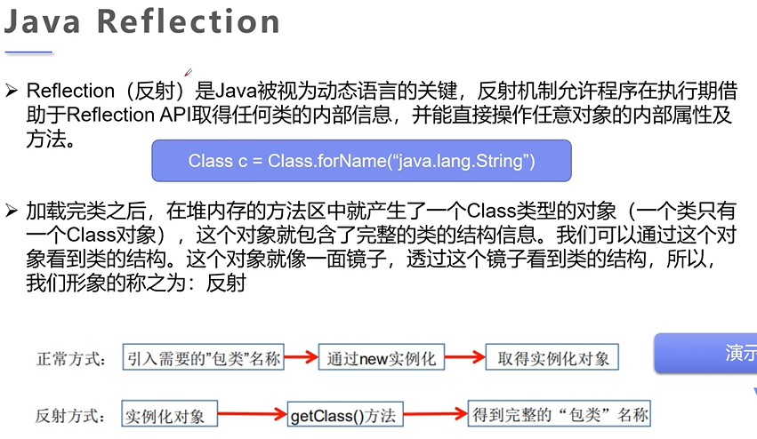

# 注解和反射

[TOC]

框架底层就是用的注解和反射

## 注解（Annotation）

- JDK5.0 引入的一种注释机制

作用：



### 内置注解

```java
@Override-->重写的注释
@Deprecated-->不推荐使用，但是可以使用，或者有更好的方式
@SuppressWarnning-->镇压警告，方法和类都能使用
```

### 元注解



```java
/ 定义一个注解
// Target表示注解的使用范围，如方法上，变量上等，可以传递一个数组
@Target(value = {ElementType.METHOD, ElementType.TYPE})

// Retention表示注解的保留时间，自定义的都是RUNTIME
// 优先级runtime>class>source
@Retention(value = RUNTIME)

// Documented表示是否将我们的注解生成在JAVADOC中
@Documented

// Inherited表示注解可以被子类继承
@Inherited
@interface MyAnnotation{

}
```

**`重点是Target和Retention`**!

### 自定义注解



```java
package com.tcmyxc.annotation;

import java.lang.annotation.ElementType;
import java.lang.annotation.Retention;
import java.lang.annotation.Target;

import static java.lang.annotation.RetentionPolicy.RUNTIME;

// 自定义注解
public class Test03 {
    // 注解如果没有默认值，必须显示赋值，注解赋值不用管顺序，随便来
    @MyAnnotation2(age = 18, name = "徐文祥")
    @MyAnnotation3("大帅哥")
    public void test(){

    }

}

@Target({ElementType.METHOD, ElementType.TYPE})
@Retention(RUNTIME)
@interface MyAnnotation2{
    // 注解的参数：参数类型 + 参数名();
    String name() default "";
    int age() default 0;
    int id() default -1;// 如果默认值是-1，代表找不着

    String[] schools() default {"ZJU", "ZJUNB"};
}

@Target({ElementType.METHOD, ElementType.TYPE})
@Retention(RUNTIME)
@interface MyAnnotation3{
    // 只有一个值，一般都用value，传值的时候可以省略
    String value();
}

```

## 反射（Reflection)

[JAVA反射机制](https://baike.baidu.com/item/JAVA反射机制/6015990)是在运行状态中，对于任意一个类，都能够知道这个类的所有属性和方法；对于任意一个对象，都能够调用它的任意方法和属性；这种动态获取信息以及动态调用对象方法的功能称为java语言的反射机制。



