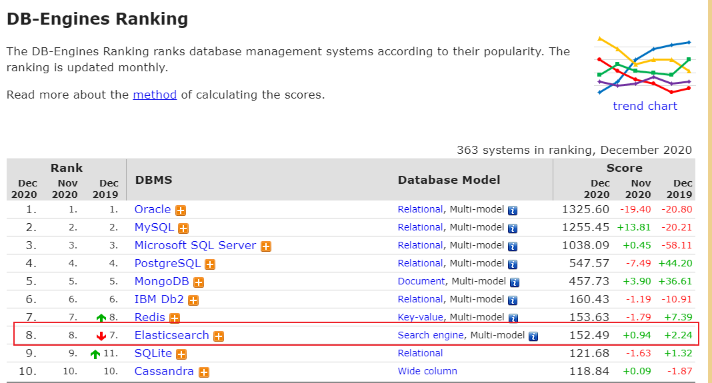
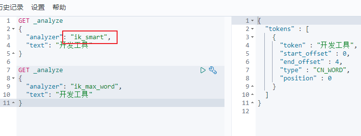
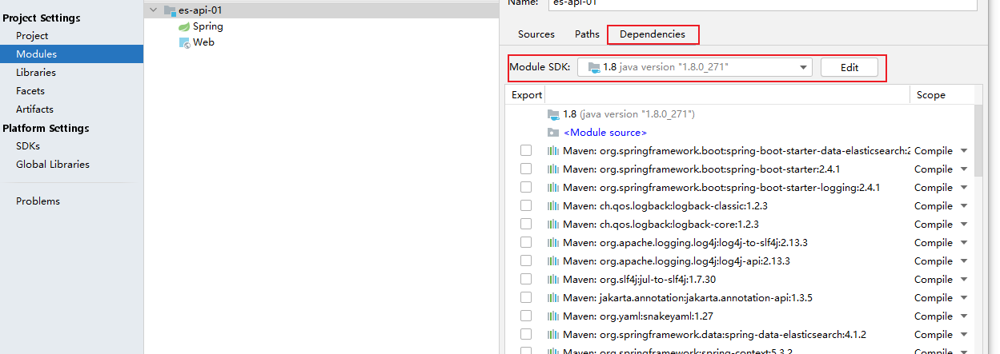
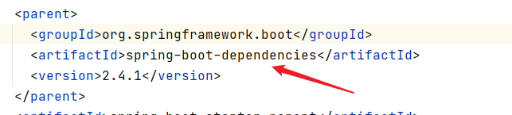

# Elasticsearch

>   百度百科：
>
>   是一个基于[Lucene](https://baike.baidu.com/item/Lucene/6753302)的搜索服务器。提供了一个分布式多用户能力的全文搜索引擎，基于RESTful web接口。
>
>   是一种流行的企业级搜索引擎。用于[云计算](https://baike.baidu.com/item/云计算/9969353)，能够达到实时搜索，稳定，可靠，快速，安装使用方便。
>
>   与名为Logstash的数据收集和日志解析引擎以及名为Kibana的分析和可视化平台一起开发。这三个产品被设计成一个集成解决方案，称为“Elastic Stack”
>
>   支持实时GET请求，适合作为NoSQL数据存储，但缺少[分布式](https://baike.baidu.com/item/分布式/7316617)事务
>
>   
>
>   写入和查询对资源的消耗都很大，如何合理有效地控制资源，既能满足写入和查询的需求，又能满足资源充分利用，这个问题需要考虑
>
>   
>
>   官方介绍：
>
>   Elasticsearch 是一个分布式的开源搜索和分析引擎，适用于所有类型的数据，包括文本、数字、地理空间、结构化和非结构化数据。Elasticsearch 在 Apache Lucene 的基础上开发而成，由 Elasticsearch N.V.（即现在的 Elastic）于 2010 年首次发布。Elasticsearch 以其简单的 REST 风格 API、分布式特性、速度和可扩展性而闻名，是 Elastic Stack 的核心组件；Elastic Stack 是适用于数据采集、充实、存储、分析和可视化的一组开源工具。人们通常将 Elastic Stack 称为 ELK Stack（代指 Elasticsearch、Logstash 和 Kibana），目前 Elastic Stack 包括一系列丰富的轻量型数据采集代理，这些代理统称为 Beats，可用来向 Elasticsearch 发送数据。


分布式、高扩展、高实时的搜索与[数据分析](https://baike.baidu.com/item/数据分析/6577123)引擎





## 实现原理

1、将数据提交到Elasticsearch 数据库中

2、通过分词控制器去将对应的语句分词，将其权重和分词结果一并存入数据

3、当用户搜索数据时候，再根据权重将结果排名，打分，再将返回结果呈现给用户


Solr是一个高性能，采用[Java](https://baike.baidu.com/item/Java/85979)开发，基于Lucene的全文搜索服务器。同时对其进行了扩展，提供了比Lucene更为丰富的查询语言，同时实现了可配置、可扩展并对查询性能进行了优化，并且提供了一个完善的功能管理界面，是一款非常优秀的[全文搜索引擎](https://baike.baidu.com/item/全文搜索引擎)。

主要特性包括：高效、灵活的缓存功能，垂直搜索功能，高亮显示搜索结果，通过索引复制来提高可用性，提供一套强大Data Schema来定义字段，类型和设置[文本分析](https://baike.baidu.com/item/文本分析)，提供基于Web的管理界面等。

## ES和solr的差别

1、当单纯对已有数据进行检索，solr更快；ES建索引快，可用于实时查询

2、当实时建立索引的时候，solr会IO阻塞，查询性能较差，ES这时候优势明显

3、随着数据量的增加，solr的搜索效率会变得更低，es基本无变化

4、solr利用zookeeper进行分布式管理，ES自带分布式协调功能

## 安装


```tex
bin  启动文件
config  配置文件
	log4j2  日志配置文件
	jvm.options  jvm相关配置
	elasticsearch.yml  es配置文件
lib  相关jar包
modules  功能模块
plugins  插件
```

localhost:9200


可视化插件：head（需要解决跨域问题）

### head安装

1、下载解压

2、

```bash
npm install
npm run start
```

3、解决跨域访问问题

```yml
#es配置文件中修改
#开启跨域
http.cors.enabled: true
#允许所有人访问
http.cors.allow-origin: "*"
```

4、127.0.0.1:9100

中文网址：http://127.0.0.1:9100/?lang=zh


>   head当做数据展示工具。查询用Kibana

### Kibana（port: 5601)

Kibana 是一个为 [Logstash](http://www.oschina.net/p/logstash) 和 [ElasticSearch](http://www.oschina.net/p/elasticsearch) 提供的日志分析的 Web 接口。可使用它对日志进行高效的搜索、可视化、分析等各种操作。

版本要和ES一致


我们使用Kibana开发工具进行数据操作


### 汉化

Kibana配置文件

```yml
i18n.locale: "zh-CN"
```


## 基本概念

### 1、Node 与 Cluster

Elastic 本质上是一个分布式数据库，允许多台服务器协同工作，每台服务器可以运行多个 Elastic 实例。

单个 Elastic 实例称为一个节点（node）。一组节点构成一个集群（cluster）。

### 2、 Index

Elastic 会索引所有字段，经过处理后写入一个反向索引（Inverted Index）。查找数据的时候，直接查找该索引。

所以，Elastic 数据管理的顶层单位就叫做 Index（索引）。它是单个数据库的同义词。每个 Index （即数据库）的名字必须是小写。

查看当前节点的所有 Index

```bash
http://localhost:9200/_cat/indices?v
```


### 3、Document

Index 里面单条的记录称为 Document（文档）。许多条 Document 构成了一个 Index。

Document 使用 JSON 格式表示，下面是一个例子。

   ```json
{
    "user": "张三",
    "title": "工程师",
    "desc": "数据库管理"
}
   ```

同一个 Index 里面的 Document，不要求有相同的结构（scheme），但是最好保持相同，这样有利于提高搜索效率。

### 4、Type（移除）

Document 可以分组，比如`weather`这个 Index 里面，可以按城市分组（北京和上海），也可以按气候分组（晴天和雨天）。这种分组就叫做 Type，它是虚拟的逻辑分组，用来过滤 Document。

不同的 Type 应该有相似的结构（schema），举例来说，`id`字段不能在这个组是字符串，在另一个组是数值。这是与关系型数据库的表的[一个区别](https://www.elastic.co/guide/en/elasticsearch/guide/current/mapping.html)。性质完全不同的数据（比如`products`和`logs`）应该存成两个 Index，而不是一个 Index 里面的两个 Type（虽然可以做到）。

列出每个 Index 所包含的 Type。

   ```bash
localhost:9200/_mapping?pretty=true
   ```

根据[规划](https://www.elastic.co/blog/index-type-parent-child-join-now-future-in-elasticsearch)，Elastic 6.x 版只允许每个 Index 包含一个 Type，7.x 版将会彻底移除 Type。


# IK分词器

两种分词策略：

-   ik_max_word：会将文本做最细粒度的拆分
-   ik_smart：会将文本做最粗粒度的拆分

直接放在ES的插件目录下即可，然后重启ES


使用Kibana查看分词结果：




>   有些词汇被过度拆分，需要我们手动加到词典里面，在配置文件中自己加

# REST风格

REST即表述性状态传递（英文：Representational State Transfer，简称REST）是Roy Fielding博士在2000年他的博士论文中提出来的一种[软件架构](https://baike.baidu.com/item/软件架构/7485920)风格。它是一种针对[网络应用](https://baike.baidu.com/item/网络应用/2196523)的设计和开发方式，可以降低开发的复杂性，提高系统的可伸缩性。

REST是设计风格而不是标准


1、创建一个索引

```bash
PUT /索引/类型名/id
{
	请求体
}
```


## SpringBoot

1、找官方文档

https://www.elastic.co/guide/en/elasticsearch/client/index.html


2、找依赖

```xml
<repositories>
    <repository>
        <id>es-snapshots</id>
        <name>elasticsearch snapshot repo</name>
        <url>https://snapshots.elastic.co/maven/</url>
    </repository>
</repositories>
```

3、找对象


高级客户端调低级的，低级的维护线程池

！！！用完一定要关闭

4、分析类中的方法

>   创建项目

1、创建一个空项目

2、新建一个模块，添加相应的依赖

3、配置JDK的版本





>   分析


>   自定义版本依赖，保证和本地一致





```xml
<properties>
    <java.version>1.8</java.version>
    <!--自定义版本依赖，和自己电脑上的一致-->
    <elasticsearch.version>7.10.1</elasticsearch.version>
</properties>
```


>   具体API测试


# 官方说明

## Elasticsearch 的用途是什么？

Elasticsearch 在速度和可扩展性方面都表现出色，而且还能够索引多种类型的内容，这意味着其可用于多种用例：

-   应用程序搜索
-   网站搜索
-   企业搜索
-   日志处理和分析
-   基础设施指标和容器监测
-   应用程序性能监测
-   地理空间数据分析和可视化
-   安全分析
-   业务分析


## Elasticsearch 的工作原理是什么？

原始数据会从多个来源（包括日志、系统指标和网络应用程序）输入到 Elasticsearch 中。*数据采集*指在 Elasticsearch 中进行*索引*之前解析、标准化并充实这些原始数据的过程。这些数据在 Elasticsearch 中索引完成之后，用户便可针对他们的数据运行复杂的查询，并使用聚合来检索自身数据的复杂汇总。在 Kibana 中，用户可以基于自己的数据创建强大的可视化，分享仪表板，并对 Elastic Stack 进行管理。


## Elasticsearch 索引是什么？

Elasticsearch *索引*指相互关联的文档集合。Elasticsearch 会以 **JSON 文档的形式存储数据**。每个文档都会在一组*键*（字段或属性的名称）和它们对应的值（字符串、数字、布尔值、日期、*数值*组、地理位置或其他类型的数据）之间建立联系。

Elasticsearch 使用的是一种名为*倒排索引*的数据结构，这一结构的设计可以允许十分快速地进行全文本搜索。倒排索引会列出在所有文档中出现的每个特有词汇，并且可以找到包含每个词汇的全部文档。

在索引过程中，Elasticsearch 会存储文档并构建倒排索引，这样用户便可以近实时地对文档数据进行搜索。索引过程是在索引 API 中启动的，通过此 API 您既可向特定索引中添加 JSON 文档，也可更改特定索引中的 JSON 文档。


## Logstash 的用途是什么？

Logstash 是 Elastic Stack 的核心产品之一，可用来对数据进行聚合和处理，并将数据发送到 Elasticsearch。Logstash 是一个开源的服务器端**数据处理管道**，允许您在将数据索引到 Elasticsearch 之前同时从多个来源采集数据，并对数据进行充实和转换。


## Kibana 的用途是什么？

Kibana 是一款适用于 Elasticsearch 的**数据可视化和管理工具**，可以提供实时的直方图、线形图、饼状图和地图。Kibana 同时还包括诸如 Canvas 和 Elastic Maps 等高级应用程序；Canvas 允许用户基于自身数据创建定制的动态信息图表，而 Elastic Maps 则可用来对地理空间数据进行可视化。


## 为何使用 Elasticsearch？

**Elasticsearch 很快。** 由于 Elasticsearch 是在 Lucene 基础上构建而成的，所以在全文本搜索方面表现十分出色。Elasticsearch 同时还是一个**近实时的搜索平台**，这意味着从文档索引操作到文档变为可搜索状态之间的延时很短，一般只有一秒。因此，Elasticsearch 非常适用于对时间有严苛要求的用例，例如安全分析和基础设施监测。

**Elasticsearch 具有分布式的本质特征。** Elasticsearch 中存储的文档分布在不同的容器中，这些容器称为*分片*，可以进行复制以提供数据冗余副本，以防发生硬件故障。Elasticsearch 的分布式特性使得它可以扩展至数百台（甚至数千台）服务器，并处理 PB 量级的数据。

**Elasticsearch 包含一系列广泛的功能。** 除了速度、可扩展性和弹性等优势以外，Elasticsearch 还有大量强大的内置功能（例如数据汇总和索引生命周期管理），可以方便用户更加高效地存储和搜索数据。

**Elastic Stack 简化了数据采集、可视化和报告过程。** 通过与 Beats 和 Logstash 进行集成，用户能够在向 Elasticsearch 中索引数据之前轻松地处理数据。同时，Kibana 不仅可针对 Elasticsearch 数据提供实时可视化，同时还提供 UI 以便用户快速访问应用程序性能监测 (APM)、日志和基础设施指标等数据。