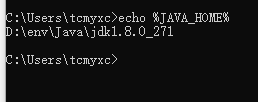
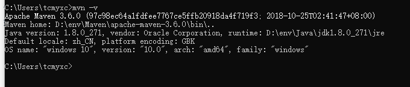
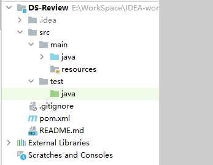
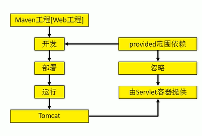
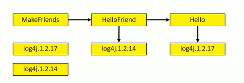
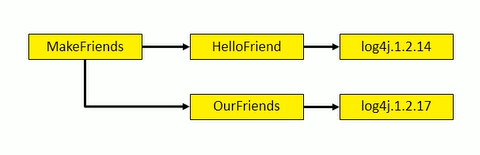
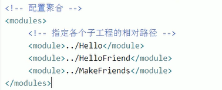
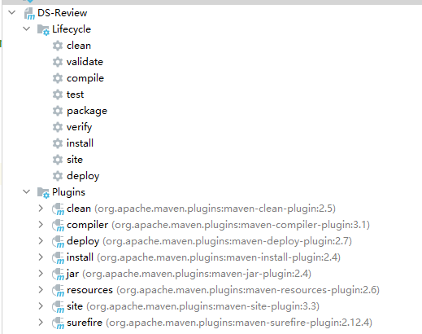

# Maven学习笔记

# 是什么？

服务于Java平台的自动化构建工具

## 何为构建？

- 编译
- 部署
- 搭建

BS项目最终运行的是动态 Web 工程编译的结果，不是这个工程本身

构建过程的各个环节：

1. 清理：清理旧的字节码文件
2. 编译：编译成字节码文件
3. 测试：自动测试
4. 报告：测试程序执行的结果
5. 打包
6. 安装：Maven的特定概念——将打包得到的文件复制到仓库中的指定位置
7. 部署：部署工程到服务器

## 如何安装？

1、检测`JAVA_HOME`环境变量



2、解压Maven压缩包

- 路径需要非中文、无空格

3、配置Maven环境变量

- MAVNE_HOME或者M2_HOME

4、查看



# 核心概念

1. 约定的目录结构
2. POM
3. 坐标
4. 依赖（最重要）
5. 仓库
6. 生命周期/插件/目标
7. 继承
8. 聚合

## 1、目录结构

```tex
Hello
|---src
|	|---main 存放主程序
|	|	|---java 存放Java源文件
|	|	|---resources 存放框架或者其他工具的配置文件
|	|---test 存放测试程序
|   	|---java
|		|---resources
|---pom.xml 核心配置文件
```




**为什么要约定目录结构？**

约定大于配置

配置大于编码

> 静态导入声明从类中导入静态成员，并允许它们在没有类引用的情况下使用。

## 2、常用命令

必须进入 `pom.xml` 的所在目录执行命令

- mvn clean

- mvn compile
- mvn test-compile
- mvn test
- mvn package
- mvn install：安装编译好的工程到Maven仓库
- mvn site：生成站点

编译结果在 `target` 目录

## 3、POM

Project Object Model：项目对象模型

> 核心配置文件

## 4、坐标

可以使用三个坐标在仓库中唯一定位一个项目

1. groupid：公司或组织域名倒叙+项目名
2. artifactid：模块名
3. version：版本

## 5、仓库

**分类：**

本地仓库

远程仓库

- 私服：搭建在局域网里的，为局域网范围内的所有Maven工程服务
- 中央仓库
- 中央仓库的镜像

 

**仓库的内容：**

1. Maven自身需要的插件
2. 第三方框架或者工具的jar包
3. 我们自己开发的Maven工程（mvn install）

> 第一方：JDK
>
> 第二方：我们自己


## 6、依赖

Maven解析依赖的时候会到本地仓库找那些项目依赖的包

### **依赖的范围**：

- compile：对主程序、测试程序都有效，参与打包
- test：只对测试环境有效，不参与打包
- provided：对主程序、测试程序都有效，不参与打包



### **依赖的传递性：**

直接依赖的依赖也会被传到本项目（也不一定都能进来，test 和 provided 不能进来）

好处：不需要在每个模块都声明依赖，可以从别的导入

### **依赖的排除：**

不想要的可以排除

```xml
<exclusions>
    <exclusion>
        <groupId></groupId>
        <artifactId></artifactId>
    </exclusion>
</exclusions>
```


### **依赖的原则：**

作用：解决模块工程之间依赖冲突问题



路径最短优先（选1.2.14）



如果路径相同（先声明的优先）

### **统一管理依赖的版本：**

手动一个个改太麻烦

建议方式：

- 使用 `properties` 标签，标签内使用自定义标签统一声明版本号
- 在需要依赖版本的地方，使用 `${自定义标签名}` 对版本号进行引用

> `properties` 标签，只要需要统一声明的场合，都可以自定义

### 依赖的继承

在父工程中声明依赖，子工程就会继承父工程的依赖

1、创建一个Maven工程，打包的方式为 pom

2、在子工程中声明对父工程的引用

```xml
<parent>
    <!--父工程 坐标-->
    <groupId>...</groupId>
    <artifactId>...</artifactId>
    <version>...</version>
    <relativePath>从当前目录到父项目的 pom.xml 文件的相对路径</relativePath>
</parent>
```

3、在子工程中删除重复内容

4、只需在父工程中声明依赖版本

将父项目中的 dependencies 标签，用 dependencyManagement 标签括起来

> 其实用IDEA，添加子模块也行

### 依赖的聚合

作用：一键安装各个模块工程

配置：把某个工程作为聚合工程，在总的聚合工程中 使用 modules /module 标签组合，指定模块工程的相对路径即可



使用：在聚合工程上使用 `mvn install`

## 7、生命周期

1. 构建环节的顺序不能打乱
2. 每一个生命周期都会从最初的阶段执行



# Web工程的自动部署

使用 `build` 标签，里面进行配置，可以使用 cargo

# 参考文献

> [1]https://www.bilibili.com/video/BV1TW411g7hP