# MyBatis-Plus

官网：https://baomidou.com/

## 简介

MyBatis-Plus（简称 MP）是一个 MyBatis 的增强工具，在 MyBatis 的基础上只做增强不做改变，为简化开发、提高效率而生。

### 特性

- **无侵入**：只做增强不做改变，引入它不会对现有工程产生影响，如丝般顺滑
- **损耗小**：启动即会自动注入基本 CURD，性能基本无损耗，直接面向对象操作
- **强大的 CRUD 操作**：内置通用 Mapper、通用 Service，仅仅通过少量配置即可实现**单表**大部分 CRUD 操作，更有强大的条件构造器，满足各类使用需求
- **支持 Lambda 形式调用**：通过 Lambda 表达式，方便的编写各类查询条件，无需再担心字段写错
- **支持主键自动生成**：支持多达 4 种主键策略（内含分布式唯一 ID 生成器 - Sequence），可自由配置，完美解决主键问题
- **支持 ActiveRecord 模式**：支持 ActiveRecord 形式调用，实体类只需继承 Model 类即可进行强大的 CRUD 操作
- **支持自定义全局通用操作**：支持全局通用方法注入（ Write once, use anywhere ）
- **内置代码生成器**：采用代码或者 Maven 插件可快速生成 Mapper 、 Model 、 Service 、 Controller 层代码，支持模板引擎，更有超多自定义配置等您来使用
- **内置分页插件**：基于 MyBatis 物理分页，开发者无需关心具体操作，配置好插件之后，写分页等同于普通 List 查询
- **分页插件支持多种数据库**：支持 MySQL、MariaDB、Oracle、DB2、H2、HSQL、SQLite、Postgre、SQLServer 等多种数据库
- **内置性能分析插件**：可输出 SQL 语句以及其执行时间，建议开发测试时启用该功能，能快速揪出慢查询
- **内置全局拦截插件**：提供全表 delete 、 update 操作智能分析阻断，也可自定义拦截规则，预防误操作

### 框架结构


## 代码实战

1、添加依赖

```xml
<!-- mybatis-plus -->
<dependency>
    <groupId>com.baomidou</groupId>
    <artifactId>mybatis-plus-boot-starter</artifactId>
    <version>3.5.2</version>
</dependency>

<!-- mysql -->
<dependency>
    <groupId>mysql</groupId>
    <artifactId>mysql-connector-java</artifactId>
    <version>8.0.30</version>
</dependency>

<!--druid-->
<dependency>
    <groupId>com.alibaba</groupId>
    <artifactId>druid-spring-boot-starter</artifactId>
    <version>1.2.4</version>
</dependency>

```


2、在配置文件中添加数据库的相关配置

```yml
# mybatis-plus
mybatis-plus:
  type-aliases-package: com.tcmyxc.pojo
  configuration:
    map-underscore-to-camel-case: true
    default-fetch-size: 100
    default-statement-timeout: 3000
    log-impl: org.apache.ibatis.logging.stdout.StdOutImpl
```


配置数据源

```properties
# datasource
spring.datasource.url=jdbc:mysql://localhost:3306/mybatis_plus?useUnicode=true&characterEncoding=utf-8&allowMultiQueries=true&useSSL=false&serverTimezone=Asia/Shanghai
spring.datasource.username=root
spring.datasource.password=123456
spring.datasource.driver-class-name=com.mysql.cj.jdbc.Driver
spring.datasource.type=com.alibaba.druid.pool.DruidDataSource
spring.datasource.druid.filters=stat
spring.datasource.druid.max-active=1000
spring.datasource.druid.initial-size=100
spring.datasource.druid.max-wait=60000
spring.datasource.druid.min-idle=500
spring.datasource.druid.time-between-eviction-runs-millis=60000
spring.datasource.druid.min-evictable-idle-time-millis=300000
spring.datasource.druid.validation-query=select 'x'
spring.datasource.druid.test-on-borrow=false
spring.datasource.druid.test-while-idle=true
spring.datasource.druid.test-on-return=false
spring.datasource.druid.pool-prepared-statements=true
spring.datasource.druid.max-open-prepared-statements=20
```


3、在 Spring Boot 启动类中添加 `@MapperScan` 注解，扫描 Mapper 文件夹

4、编写实体类

```java
@Data
public class User {
    private Long id;
    private String name;
    private Integer age;
    private String email;
}
```

5、编写 Mapper 接口

```java
public interface UserMapper extends BaseMapper<User> {

}
```

6、测试

```java
@SpringBootTest
public class SampleTest {

    @Autowired
    private UserMapper userMapper;

    @Test
    public void testSelect() {
        System.out.println(("----- selectAll method test ------"));
        // 默认查询所有
        List<User> userList = userMapper.selectList(null);
        userList.forEach(System.out::println);
    }

}
```

## BaseMapper

提供了很多单表操作的基本方法

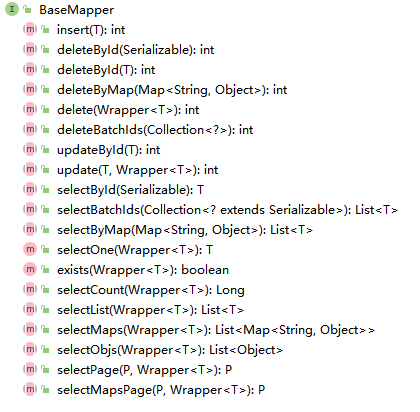


```java

    /**
     * 插入一条记录
     *
     * @param entity 实体对象
     */
    int insert(T entity);

    /**
     * 根据 ID 删除
     *
     * @param id 主键ID
     */
    int deleteById(Serializable id);

    /**
     * 根据实体(ID)删除
     *
     * @param entity 实体对象
     * @since 3.4.4
     */
    int deleteById(T entity);

    /**
     * 根据 columnMap 条件，删除记录
     *
     * @param columnMap 表字段 map 对象
     */
    int deleteByMap(@Param(Constants.COLUMN_MAP) Map<String, Object> columnMap);

    /**
     * 根据 entity 条件，删除记录
     *
     * @param queryWrapper 实体对象封装操作类（可以为 null,里面的 entity 用于生成 where 语句）
     */
    int delete(@Param(Constants.WRAPPER) Wrapper<T> queryWrapper);

    /**
     * 删除（根据ID或实体 批量删除）
     *
     * @param idList 主键ID列表或实体列表(不能为 null 以及 empty)
     */
    int deleteBatchIds(@Param(Constants.COLLECTION) Collection<?> idList);

    /**
     * 根据 ID 修改
     *
     * @param entity 实体对象
     */
    int updateById(@Param(Constants.ENTITY) T entity);

    /**
     * 根据 whereEntity 条件，更新记录
     *
     * @param entity        实体对象 (set 条件值,可以为 null)
     * @param updateWrapper 实体对象封装操作类（可以为 null,里面的 entity 用于生成 where 语句）
     */
    int update(@Param(Constants.ENTITY) T entity, @Param(Constants.WRAPPER) Wrapper<T> updateWrapper);

    /**
     * 根据 ID 查询
     *
     * @param id 主键ID
     */
    T selectById(Serializable id);

    /**
     * 查询（根据ID 批量查询）
     *
     * @param idList 主键ID列表(不能为 null 以及 empty)
     */
    List<T> selectBatchIds(@Param(Constants.COLLECTION) Collection<? extends Serializable> idList);

    /**
     * 查询（根据 columnMap 条件）
     *
     * @param columnMap 表字段 map 对象
     */
    List<T> selectByMap(@Param(Constants.COLUMN_MAP) Map<String, Object> columnMap);

    /**
     * 根据 entity 条件，查询一条记录
     * <p>查询一条记录，例如 qw.last("limit 1") 限制取一条记录, 注意：多条数据会报异常</p>
     *
     * @param queryWrapper 实体对象封装操作类（可以为 null）
     */
    default T selectOne(@Param(Constants.WRAPPER) Wrapper<T> queryWrapper) {
        List<T> ts = this.selectList(queryWrapper);
        if (CollectionUtils.isNotEmpty(ts)) {
            if (ts.size() != 1) {
                throw ExceptionUtils.mpe("One record is expected, but the query result is multiple records");
            }
            return ts.get(0);
        }
        return null;
    }

    /**
     * 根据 Wrapper 条件，判断是否存在记录
     *
     * @param queryWrapper 实体对象封装操作类
     * @return
     */
    default boolean exists(Wrapper<T> queryWrapper) {
        Long count = this.selectCount(queryWrapper);
        return null != count && count > 0;
    }

    /**
     * 根据 Wrapper 条件，查询总记录数
     *
     * @param queryWrapper 实体对象封装操作类（可以为 null）
     */
    Long selectCount(@Param(Constants.WRAPPER) Wrapper<T> queryWrapper);

    /**
     * 根据 entity 条件，查询全部记录
     *
     * @param queryWrapper 实体对象封装操作类（可以为 null）
     */
    List<T> selectList(@Param(Constants.WRAPPER) Wrapper<T> queryWrapper);

    /**
     * 根据 Wrapper 条件，查询全部记录
     *
     * @param queryWrapper 实体对象封装操作类（可以为 null）
     */
    List<Map<String, Object>> selectMaps(@Param(Constants.WRAPPER) Wrapper<T> queryWrapper);

    /**
     * 根据 Wrapper 条件，查询全部记录
     * <p>注意： 只返回第一个字段的值</p>
     *
     * @param queryWrapper 实体对象封装操作类（可以为 null）
     */
    List<Object> selectObjs(@Param(Constants.WRAPPER) Wrapper<T> queryWrapper);

    /**
     * 根据 entity 条件，查询全部记录（并翻页）
     *
     * @param page         分页查询条件（可以为 RowBounds.DEFAULT）
     * @param queryWrapper 实体对象封装操作类（可以为 null）
     */
    <P extends IPage<T>> P selectPage(P page, @Param(Constants.WRAPPER) Wrapper<T> queryWrapper);

    /**
     * 根据 Wrapper 条件，查询全部记录（并翻页）
     *
     * @param page         分页查询条件
     * @param queryWrapper 实体对象封装操作类
     */
    <P extends IPage<Map<String, Object>>> P selectMapsPage(P page, @Param(Constants.WRAPPER) Wrapper<T> queryWrapper);
```

## 自定义SQL语句

跟 MyBatis 一样，不再赘述

## 通用 Service

> https://baomidou.com/pages/49cc81/#service-crud-%E6%8E%A5%E5%8F%A3

- 通用 Service CRUD 封装 [IService](https://gitee.com/baomidou/mybatis-plus/blob/3.0/mybatis-plus-extension/src/main/java/com/baomidou/mybatisplus/extension/service/IService.java) 接口，进一步封装 CRUD 采用 `get 查询单行` `remove 删除` `list 查询集合` `page 分页` 前缀命名方式区分 `Mapper` 层避免混淆，
- 泛型 `T` 为任意实体对象
- 建议如果存在自定义通用 Service 方法的可能，请创建自己的 `IBaseService` 继承 `Mybatis-Plus` 提供的基类
- 对象 `Wrapper` 为 [条件构造器](https://baomidou.com/01.指南/02.核心功能/wrapper.html)


IService 有一个通用的实现类 ServiceImpl

## 常用注解

### TableName

```java
@TableName("真实的表名")// 解决真实表名和实体类名字不一致的问题
```

数据库表名可以通过全局设置解决

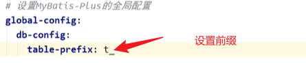


### TableId

```java
@TableId(type = IdType.AUTO)// 指定某个属性为主键；type设置主键策略；value 设置主键字段（数据库中的字段名）
```

AUTO：确保数据库设置了 ID自增，否则无效

ASSIGN_ID：雪花算法。与数据库是否设置主键自增无关

> 也可以在配置文件中全局配置

### TableField

数据库中字段名使用下划线，Java 代码中使用的小驼峰

> mybatis 可以把下划线转为驼峰
>
>  `mybatis.configuration.map-underscore-to-camel-case=true`

mybatis-plus 会把这个特性默认开启

**如果属性名和字段名不一致，就需要这个注解来指定属性对应的字段名**

### TableLogic

逻辑删除，假删除

一般属性名命名为 `isDeleted`

## 条件构造器

Wrapper抽象类及其子类

QueryWrapper：查询、删除、修改

UpdateWrapper：修改

### 使用 QueryWrapper 实现修改功能

```java
int update(T entity, Wrapper<T> wrapper);
```

第一个参数 `entity` 设置数据库中需要修改的字段，第二个参数封装条件（可以使用 QueryWrapper）

> 也就是说，如果传递的实体类的属性值是 `null`，则这些属性不会被修改

```java
// 封装条件
QueryWrapper<User> queryWrapper = new QueryWrapper<>();
queryWrapper.eq("username", "马云");
// 封装实体类需要修改的属性
User user = new User();
user.setAge(24);
user.setEmail(null);
// UPDATE user SET age=? WHERE (username = ?)
userMapper.update(user, queryWrapper);
```

运行截图：

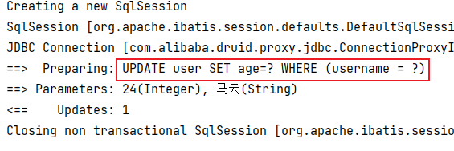


数据库建表语句：

```mysql
CREATE TABLE `user` (
  `id` bigint unsigned NOT NULL AUTO_INCREMENT,
  `username` varchar(255) NOT NULL,
  `password` varchar(255) NOT NULL,
  `age` int DEFAULT '18',
  `email` varchar(64) DEFAULT NULL,
  PRIMARY KEY (`id`)
)
```


### 条件的优先级

lambda 中的条件优先执行

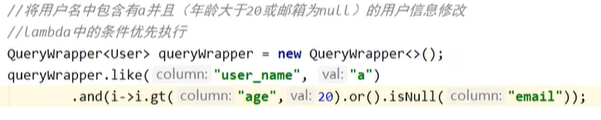


### 组装 SELECT 字句

如果只想查询某些字段，使用这个

```java
// 封装条件
QueryWrapper<User> queryWrapper = new QueryWrapper<>();
// 只查询 "username", "age", "email"
queryWrapper.select("username", "age", "email");
List<Map<String, Object>> maps = userMapper.selectMaps(queryWrapper);
maps.forEach(System.out::println);
```

运行结果：

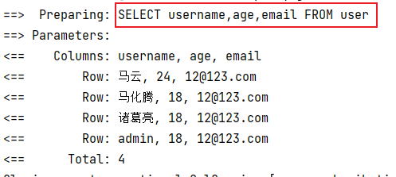


```tex
{age=24, email=12@123.com, username=马云}
{age=18, email=12@123.com, username=马化腾}
{age=18, email=12@123.com, username=诸葛亮}
{age=18, email=12@123.com, username=admin}
```

### 子查询

```mysql
// 查询 id 小于 5 的人信息
QueryWrapper<User> queryWrapper = new QueryWrapper<>();
queryWrapper.inSql("id", "SELECT id FROM USER WHERE id < 5");
// SELECT id,username,password,age,email FROM user WHERE (id IN (SELECT id FROM USER WHERE id < 5))
List<User> users = userMapper.selectList(queryWrapper);
users.forEach(System.out::println);
```

### UpdateWrapper 实现修改功能

UpdateWrapper 有关的 `set` 方法可以设置字段的值

```java
UpdateWrapper<User> updateWrapper = new UpdateWrapper<>();
updateWrapper.like("username", "a");
updateWrapper.set("age", "40");
// UPDATE user SET age=? WHERE (username LIKE ?)
int result = userMapper.update(null, updateWrapper);
System.out.println(result);
```

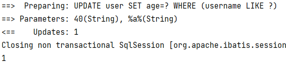

### 模拟开发中组装条件的情况

实际开发中，如果用户输入了这些条件，则应该组装到 sql 语句中，如果是空字符串、空白字符或者 null，则不应该封装

可以使用 MP 提供的工具函数 `StringUtils.isNotBlank`

在 Service 层调用的函数如下：

```java
// 更新 user 表信息
UpdateWrapper<User> updateWrapper = new UpdateWrapper<>();
updateWrapper.eq("id", userId)
    // 设置用户名
    .set(StringUtils.isNotBlank(registerUser.getUsername()), "username", registerUser.getUsername())
    // 设置手机号
    .set(StringUtils.isNotBlank(registerUser.getPhone()), "phone", registerUser.getPhone())
    // 设置邮箱
    .set(StringUtils.isNotBlank(registerUser.getEmail()), "email", registerUser.getEmail());
// 更新数据库
update(updateWrapper);
```

### lambda 形式的条件构造器

可以防止写错数据库中的字段名

```java
String username = "a";
LambdaQueryWrapper<User> queryWrapper = new LambdaQueryWrapper<>();
queryWrapper.like(StringUtils.isNotBlank(username), User::getUsername, username);
List<User> users = userMapper.selectList(queryWrapper);
users.forEach(System.out::println);
```

## 分页插件的配置和使用

分页插件是自带的，只需要配置一下就行

### 配置

```java
@Configuration
@MapperScan("scan.your.mapper.package")
public class MybatisPlusConfig {

    /**
     * 新的分页插件,一缓和二缓遵循mybatis的规则,
     */
    @Bean
    public MybatisPlusInterceptor mybatisPlusInterceptor() {
        MybatisPlusInterceptor interceptor = new MybatisPlusInterceptor();
        // 需要设置数据库类型
        interceptor.addInnerInterceptor(new PaginationInnerInterceptor(DbType.MYSQL));
        return interceptor;
    }
}
```


> Ctrl + H 查看接口或者类的继承关系
>
> Ctrl + P 查看方法参数


测试：

```java
Page<User> userPage = new Page<>(2, 3);
// 查询的结果会直接封装到 userPage 中
userMapper.selectPage(userPage, null);
// System.out.println(userPage);// 是个内存地址
System.out.println(userPage.getPages());
System.out.println(userPage.getRecords());
System.out.println(userPage.getTotal());
System.out.println(userPage.hasNext());
System.out.println(userPage.hasPrevious());
```

输出：

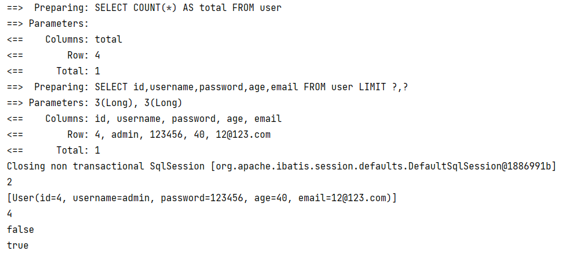

### 自定义分页功能

```java
IPage<UserVo> selectPageVo(IPage<?> page, Integer state);
// or (class MyPage extends Ipage<UserVo>{ private Integer state; })
MyPage selectPageVo(MyPage page);
// or


List<UserVo> selectPageVo(IPage<UserVo> page, Integer state);

<select id="selectPageVo" resultType="xxx.xxx.xxx.UserVo">
    SELECT id,name FROM user WHERE state=#{state}
</select>
```

自定义方法中，第一个参数必须是 `IPage` 的子类对象，后面的参数是查询条件，返回值需要是 `Page` 对象或者 list 集合

> 如果返回类型是 IPage 则入参的 IPage 不能为null
>
> 如果返回类型是 List 则入参的 IPage 可以为 null(为 null 则不分页)


测试:

1、Mapper 接口定义方法

```java
/**
  * 通过年龄查询用户信息并分页
  *
  * @param page mp 提供的分页对象，必须位于第一个参数的位置
  * @param age 查询条件，可多个
  */
Page<User> selectPageVo(Page<User> page, Integer age);
```

2、创建对应的 xml 文件，写 SQL 语句

```java
<?xml version="1.0" encoding="UTF-8"?>
<!DOCTYPE mapper
        PUBLIC "-//mybatis.org//DTD Mapper 3.0//EN"
        "http://mybatis.org/dtd/mybatis-3-mapper.dtd">
<!--namespace=绑定一个对应的Dao/Mapper接口，命名空间需要改成自己的-->
<mapper namespace="com.tcmyxc.mapper.UserMapper">

    <select id="selectPageVo" resultType="map">
        select username, age, email
        from user
        where age > #{age}
    </select>

</mapper>
```

3、查询操作

```java
Page<User> userPage = new Page<>(2, 3);
userMapper.selectPageVo(userPage, 10);
System.out.println(userPage.getRecords());
```

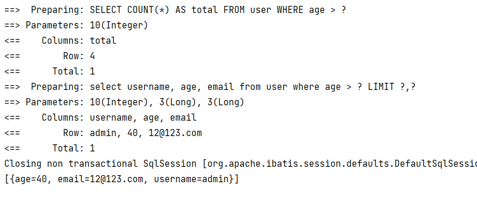

### 乐观锁插件

表中加一个版本号的字段，每次写数据的时候，比一下跟最开始取数据的时候版本号一样不一样，不一样则不修改。如果真的想改，则再次取一下值，然后做修改操作

>当要更新一条记录的时候，希望这条记录没有被别人更新
>
>乐观锁实现方式：
>
>> - 取出记录时，获取当前 version
>> - 更新时，带上这个 version
>> - 执行更新时， set version = newVersion where version = oldVersion
>> - 如果 version 不对，就更新失败

MP 中使用注解即可实现

1、配置文件添加配置

```java
@Bean
public MybatisPlusInterceptor mybatisPlusInterceptor() {
    MybatisPlusInterceptor interceptor = new MybatisPlusInterceptor();
    interceptor.addInnerInterceptor(new OptimisticLockerInnerInterceptor());
    return interceptor;
}
```

2、在实体类的字段上加上 `@Version` 注解

## 通用枚举

如果我们想放在数据库中字段的值是枚举类中某个属性的值

直接操作会报错

```java
@Getter
public enum SexEnum {
    MALE(1, "男"),
    FEMALE(0, "女");

    private Integer sex;
    private String sexName;

    SexEnum(Integer sex, String sexName) {
        this.sex = sex;
        this.sexName = sexName;
    }
}

// 写数据库
User user = new User();
// 如果不做配置，默认放的是枚举值的 name
user.setSex(SexEnum.FEMALE);
user.setUsername("小红");
user.setPassword("12346");
user.setEmail("123@123.com");
user.setAge(33);
userMapper.insert(user);
```


错误信息：

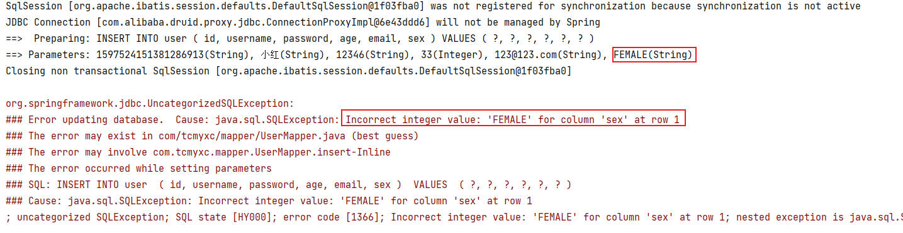


如果想这么干

1、需要在枚举类的属性上加个注解

```java
@Getter
public enum SexEnum {
    MALE(1, "男"),
    FEMALE(0, "女");

    @EnumValue
    private Integer sex;// 想把这个值放到数据库，那就在这个属性上加注解
    private String sexName;

    SexEnum(Integer sex, String sexName) {
        this.sex = sex;
        this.sexName = sexName;
    }
}
```

2、在配置文件中添加配置扫描通用枚举的包

```yml
# 配置
type-enums-package: com.tcmyxc.enums
```


>  最新的版本（3.5.2 之后）已经不需要配置了

运行结果：

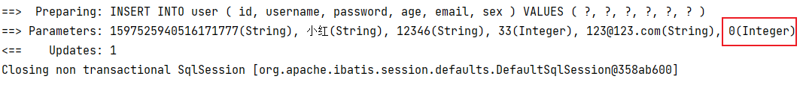

## 代码生成器

1、引入依赖

```xml
<!-- https://mvnrepository.com/artifact/com.baomidou/mybatis-plus-generator -->
<dependency>
    <groupId>com.baomidou</groupId>
    <artifactId>mybatis-plus-generator</artifactId>
    <version>3.5.2</version>
</dependency>

<!-- Freemarker引擎模板 -->
<dependency>
    <groupId>org.freemarker</groupId>
    <artifactId>freemarker</artifactId>
    <version>2.3.31</version>
</dependency>
```

2、使用

**快速生成**

```java
FastAutoGenerator.create("url", "username", "password")
    .globalConfig(builder -> {
        builder.author("baomidou") // 设置作者
            //.enableSwagger() // 开启 swagger 模式
            .fileOverride() // 覆盖已生成文件
            .outputDir("D://"); // 指定输出目录
    })
    .packageConfig(builder -> {
        builder.parent("com.baomidou.mybatisplus.samples.generator") // 设置父包名
            .moduleName("system") // 设置父包模块名
            .pathInfo(Collections.singletonMap(OutputFile.xml, "D://")); // 设置mapperXml生成路径
    })
    .strategyConfig(builder -> {
        builder.addInclude("t_simple") // 设置需要生成的表名
            .addTablePrefix("t_", "c_"); // 设置过滤表前缀
    })
    .templateEngine(new FreemarkerTemplateEngine()) // 使用Freemarker引擎模板，默认的是Velocity引擎模板
    .execute();
```


**交互式生成**

```java
FastAutoGenerator.create(DATA_SOURCE_CONFIG)
    // 全局配置
    .globalConfig((scanner, builder) -> builder.author(scanner.apply("请输入作者名称？")).fileOverride())
    // 包配置
    .packageConfig((scanner, builder) -> builder.parent(scanner.apply("请输入包名？")))
    // 策略配置
    .strategyConfig((scanner, builder) -> builder.addInclude(getTables(scanner.apply("请输入表名，多个英文逗号分隔？所有输入 all")))
                        .controllerBuilder().enableRestStyle().enableHyphenStyle()
                        .entityBuilder().enableLombok().addTableFills(
                                new Column("create_time", FieldFill.INSERT)
                        ).build())
    /*
        模板引擎配置，默认 Velocity 可选模板引擎 Beetl 或 Freemarker
       .templateEngine(new BeetlTemplateEngine())
       .templateEngine(new FreemarkerTemplateEngine())
     */
    .execute();


// 处理 all 情况
protected static List<String> getTables(String tables) {
    return "all".equals(tables) ? Collections.emptyList() : Arrays.asList(tables.split(","));
}
```


## MyBatisX插件

IDEA 的插件

会出现红蓝小鸟

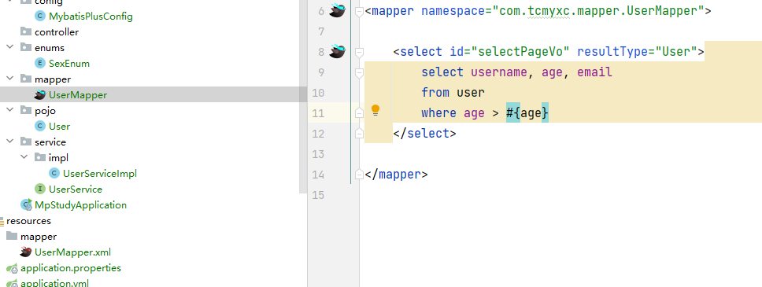


基础使用：可以点击快速定位

### 代码快速生成

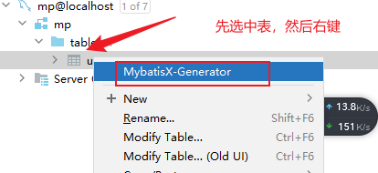


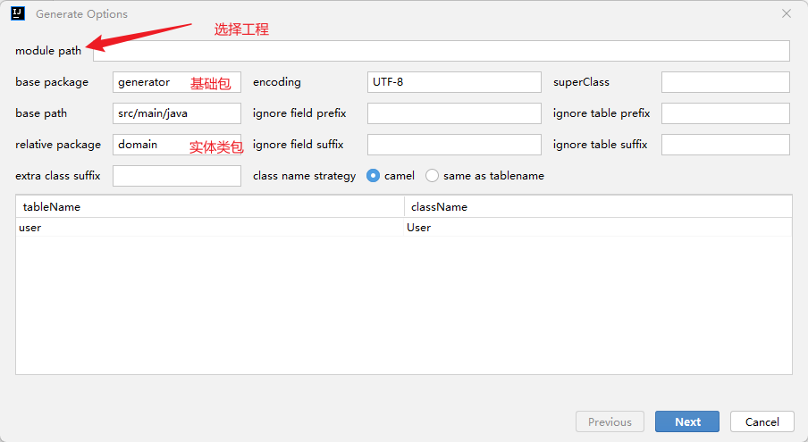


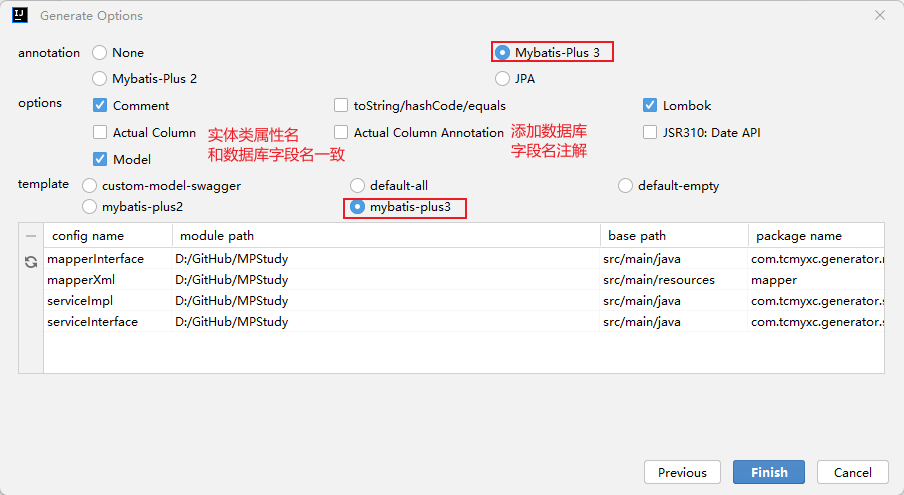


Model：是否生成表对应的实体类


还可以快速生成SQL语句

> Alt + Enter


