# Mybatis-2020-06-02


## 简介

- MyBatis 是一款优秀的**持久层框架**
- 它支持自定义 SQL、存储过程以及高级映射。
- MyBatis 免除了几乎所有的 JDBC 代码以及设置参数和获取结果集的工作。
- MyBatis 可以通过简单的 **XML 或注解**来配置和映射原始类型、接口和 Java POJO（Plain Old Java Objects，普通老式 Java 对象）为数据库中的记录。

中文文档：https://mybatis.org/mybatis-3/zh/getting-started.html


- 每个基于 MyBatis 的应用都是以一个 **SqlSessionFactory** 的实例为核心的。
- SqlSessionFactory 的实例可以通过 **SqlSessionFactoryBuilder** 获得。
- 而 SqlSessionFactoryBuilder 则可以从 XML 配置文件或一个预先配置的 Configuration 实例来构建出 SqlSessionFactory 实例。

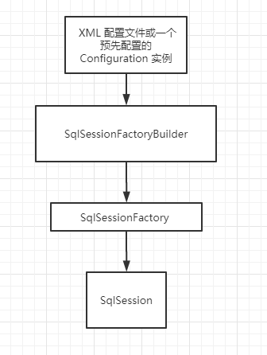

## 搭建环境

### 新建基础数据库

```mysql
create database mybatis;
use mybatis;
create table user(
	id int(20) not null primary key,
	name varchar(30) default null,
	pwd varchar(30) default null
)engine=innodb default charset=utf8;
```

### IDEA项目创建

#### 新建maven项目

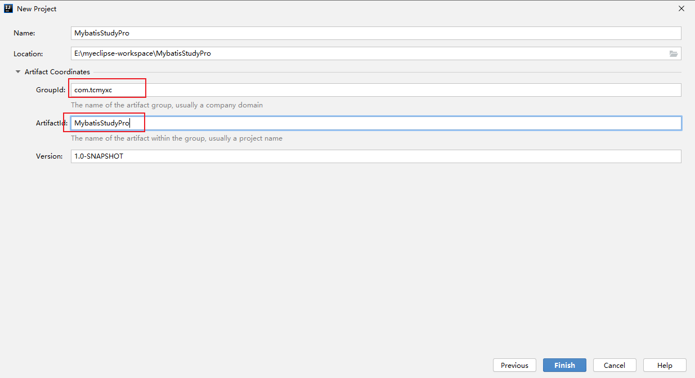

#### 删除src文件夹（将其作为一个父工程）

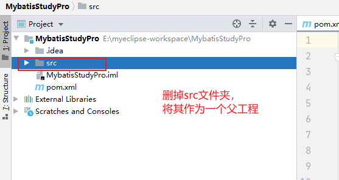

#### 在`pom.xml`文件中添加依赖

依赖去maven仓库找，找个用的人最多的就行。

mybatis依赖

```xml
<!-- https://mvnrepository.com/artifact/org.mybatis/mybatis -->
<dependency>
    <groupId>org.mybatis</groupId>
    <artifactId>mybatis</artifactId>
    <!--版本填自己的-->
    <version>3.5.3</version>
</dependency>
```

较为全面的依赖：

```xml
<!--导入依赖-->
<dependencies>
    <!--mysql驱动-->
    <dependency>
        <groupId>mysql</groupId>
        <artifactId>mysql-connector-java</artifactId>
        <version>8.0.20</version>
    </dependency>
    <!--mybatis-->
    <dependency>
        <groupId>org.mybatis</groupId>
        <artifactId>mybatis</artifactId>
        <version>3.5.2</version>
    </dependency>
    <!--junit-->
    <dependency>
        <groupId>junit</groupId>
        <artifactId>junit</artifactId>
        <version>4.12</version>
        <scope>test</scope>
    </dependency>
</dependencies>
```

配置资源导出，防止资源导出失败，下面这些配置需要放在父工程，如果出现问题，则在相应的子工程也引入即可。

```xml
<!--在build中配置resource，防止资源导出失败-->
<build>
    <resources>
        <resource>
            <directory>src/main/resources</directory>
            <includes>
                <include>**/*.properties</include>
                <include>**/*.xml</include>
            </includes>
            <filtering>true</filtering>
        </resource>
        <resource>
            <directory>src/main/java</directory>
            <includes>
                <include>**/*.properties</include>
                <include>**/*.xml</include>
            </includes>
            <filtering>true</filtering>
        </resource>
    </resources>
</build>
```

#### 新建一个module

#### 在子项目`resources`目录下新建配置文件

- 文件名一般是**mybatis-config.xml**

```xml
<?xml version="1.0" encoding="UTF-8" ?>
<!DOCTYPE configuration
		PUBLIC "-//mybatis.org//DTD Config 3.0//EN"
		"http://mybatis.org/dtd/mybatis-3-config.dtd">
<!--核心配置文件-->
<configuration>
	<!--配置环境，可以配置多个环境，同时可以指定默认环境-->
	<environments default="development">
		<!--开发环境-->
		<environment id="development">
			<transactionManager type="JDBC"/>
			<dataSource type="POOLED">
				<property name="driver" value="com.mysql.jdbc.Driver"/>
				<property name="url" value="jdbc:mysql://localhost:3306/mybatis?useSSL=false&amp;useUnicode=true&amp;characterEncoding=UTF-8&amp;serverTimezone=Asia/Shanghai">
				<property name="username" value="root"/>
				<property name="password" value="123456"/>
			</dataSource>
		</environment>
	</environments>

</configuration>
```

#### 新建一个工具类

```java
package com.tcmyxc.utils;

import org.apache.ibatis.io.Resources;
import org.apache.ibatis.session.SqlSession;
import org.apache.ibatis.session.SqlSessionFactory;
import org.apache.ibatis.session.SqlSessionFactoryBuilder;

import java.io.IOException;
import java.io.InputStream;

// SqlSessionFactory
public class MybatisUtils {

    private static SqlSessionFactory sqlSessionFactory;

    static{
        try {
            // 使用mybatis获取SqlSessionFactory对象
            String resource = "mybatis-config.xml";
            InputStream inputStream = Resources.getResourceAsStream(resource);
            sqlSessionFactory = new SqlSessionFactoryBuilder().build(inputStream);
        } catch (IOException e) {
            e.printStackTrace();
        }
    }

    // 既然有了 SqlSessionFactory，顾名思义，我们可以从中获得 SqlSession 的实例。
    // SqlSession 提供了在数据库执行 SQL 命令所需的所有方法。
    // 你可以通过 SqlSession 实例来直接执行已映射的 SQL 语句
    
    // 获得 SqlSession 的实例
    public static SqlSession getSqlSession(){
        return sqlSessionFactory.openSession();
    }
}
```

#### 编写代码

- 实体类

  ```java
  package com.tcmyxc.pojo;
  
  public class User {
      private int id;
      private String name;
      private String pwd;
  
      public User() {
      }
  
      public User(int id, String name, String pwd) {
          this.id = id;
          this.name = name;
          this.pwd = pwd;
      }
  
      public int getId() {
          return id;
      }
  
      public void setId(int id) {
          this.id = id;
      }
  
      public String getName() {
          return name;
      }
  
      public void setName(String name) {
          this.name = name;
      }
  
      public String getPwd() {
          return pwd;
      }
  
      public void setPwd(String pwd) {
          this.pwd = pwd;
      }
  
      @Override
      public String toString() {
          return "User{" +
                  "id=" + id +
                  ", name='" + name + '\'' +
                  ", pwd='" + pwd + '\'' +
                  '}';
      }
  }
  ```

- DAO接口（DAO，数据库访问对象）

  ```java
  package com.tcmyxc.dao;
  
  import com.tcmyxc.pojo.User;
  
  import java.util.List;
  
  public interface UserDao {
      List<User> getUserList();
  }
  ```

- 接口实现类（由原来的接口实现类转换为mapper配置文件）

  **UserMapper.xml**

  ```xml
  <?xml version="1.0" encoding="UTF-8" ?>
  <!DOCTYPE mapper
  		PUBLIC "-//mybatis.org//DTD Mapper 3.0//EN"
  		"http://mybatis.org/dtd/mybatis-3-mapper.dtd">
  <!--namespace=绑定一个对应的Dao/Mapper接口，命名空间需要改成自己的-->
  <mapper namespace="com.tcmyxc.dao.UserDao">
  	<!--查询语句-->
  	<!--id是接口中的方法名-->
  	<select id="getUserList" resultType="com.tcmyxc.pojo.User">
  		/*这里写具体的SQL语句*/
  		select * from user;
  	</select>
  </mapper>
  ```

#### 测试

注意点：

`org.apache.ibatis.binding.BindingException: Type interface com.tcmyxc.dao.UserDao is not known to the MapperRegistry.`

**MapperRegistry是什么？**

核心配置文件注册**mapper** !

```xml
<!--每一个mapper配置文件都需要在mybatis核心配置文件中注册-->
<mappers>
    <mapper resource="com/tcmyxc/dao/UserMapper.xml"/>
</mappers>
```

- junit测试

```java
package com.tcmyxc.dao;

import com.tcmyxc.pojo.User;
import com.tcmyxc.utils.MybatisUtils;
import org.apache.ibatis.session.SqlSession;
import org.junit.Test;

import java.util.List;

public class UserDaoTest {

    @Test
    public void test(){

        // 获取sqlSession
        SqlSession sqlSession = MybatisUtils.getSqlSession();

        // 执行SQL语句
        // 方式一：使用mapper
        UserDao mapper = sqlSession.getMapper(UserDao.class);
        List<User> userList = mapper.getUserList();

        for (User user : userList) {
            System.out.println(user);
        }

        // 关闭sqlSession
        sqlSession.close();
    }
}
```

## 使用mybatis增删改查（增删改需要提交事务）

- 编写接口
- 编写对应mapper中的sql语句
- 注册mapper.xml文件
- 测试

三个文件依次是接口文件，接口mapper文件，junit测试文件

### 查询

```java
// 根据ID查询用户
User getUserById(int id);
```

```xml
<!--这里#{}里面填写的是getUserById方法的形参-->
<select id="getUserById" parameterType="int" resultType="com.tcmyxc.pojo.User">
    select * from user where id = #{id}
</select>
```

```java
@Test
public void getUserById(){
    // 获取sqlSession
    SqlSession sqlSession = MybatisUtils.getSqlSession();

    // 执行SQL语句
    UserDao mapper = sqlSession.getMapper(UserDao.class);
    User user = mapper.getUserById(1);
    System.out.println(user);

    // 关闭sqlSession
    sqlSession.close();
}
```

### 增加

```java
// 增加用户
//int addUser(int id, String username, String password);傻孩子，插入一个用户，参数就写用户就行
int addUser(User user);
```

```xml
<!--增加用户-->
<!--对象中的属性可以直接取出来，这里#{}里面填写的是User对象的属性（字段）-->
<insert id="addUser" parameterType="com.tcmyxc.pojo.User">
    insert into user(id, name, pwd) values(#{id}, #{name}, #{pwd})
</insert>
```

```java
@Test
public void addUser(){
    // 获取sqlSession
    SqlSession sqlSession = MybatisUtils.getSqlSession();

    // 执行SQL语句
    UserDao mapper = sqlSession.getMapper(UserDao.class);
    mapper.addUser(new User(4, "哈哈哈", "123456"));

    // 提交事务
    sqlSession.commit();

    // 关闭sqlSession
    sqlSession.close();
}
```

### 删除

```xml
<!--删除用户-->
<delete id="delUserById" parameterType="int">
    delete from user where id = #{id}
</delete>
```

### 更新

```xml
<!--修改用户信息-->
<update id="updateUser" parameterType="com.tcmyxc.pojo.User">
    update user set pwd = #{pwd}, name = #{name} where id = #{id}
</update>
```

### 万能的Map

假设，实体类中或者数据库中字段过多，要考虑使用map

野路子，最万能！

```xml
// 万能的map
User getUserById2(Map<String, Object> map);
```

```xml
<!--万能的map-->
<select id="getUserById2" parameterType="map" resultType="com.tcmyxc.pojo.User">
    select * from user where id = #{userId}
</select>
```

```java
@Test
public void getUserById2(){
    SqlSession sqlSession = MybatisUtils.getSqlSession();

    UserDao mapper = sqlSession.getMapper(UserDao.class);

    Map<String, Object> map = new HashMap<>();
    map.put("userId", 1);

    User user = mapper.getUserById2(map);
    System.out.println(user);

    sqlSession.close();
}
```

Map传递参数，直接在sql中取出key即可！

对象传递参数，直接在sql中取对象的属性即可！

只有一个基本参数类型的情况，可以省略**parameterType**

### 模糊查询

```xml
<!--模糊查询-->
<select id="getUserLike" parameterType="String" resultType="com.tcmyxc.pojo.User">
    select * from user where name like #{key}
</select>
```

```java
@Test
public void getUserLike(){
    SqlSession sqlSession = MybatisUtils.getSqlSession();

    UserDao mapper = sqlSession.getMapper(UserDao.class);
    List<User> userList = mapper.getUserLike("%李%");

    for (User user : userList) {
        System.out.println(user);
    }

    sqlSession.close();
}
```

## 配置解析

MyBatis 的配置文件包含了会深深影响 MyBatis 行为的设置和属性信息

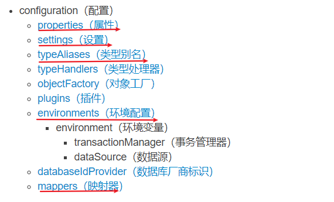

### 环境配置（environments）

- MyBatis 可以配置成适应多种环境
- **尽管可以配置多个环境，但每个 SqlSessionFactory 实例只能选择一种环境。**

**事务管理器（transactionManager）**

在 MyBatis 中有两种类型的事务管理器（也就是 type="[JDBC|MANAGED]"）

**数据源（dataSource）**

dataSource 元素使用标准的 JDBC 数据源接口来配置 JDBC 连接对象的资源。

有三种内建的数据源类型（也就是 type="[UNPOOLED|POOLED|JNDI]"）

### 映射器（mappers）

【`推荐使用resource方式引用`】

告诉 MyBatis 到哪里去找映射文件 

可以使用：

- 相对于类路径的资源引用
- 完全限定资源定位符（包括 `file:///` 形式的 URL）
- 类名和包名

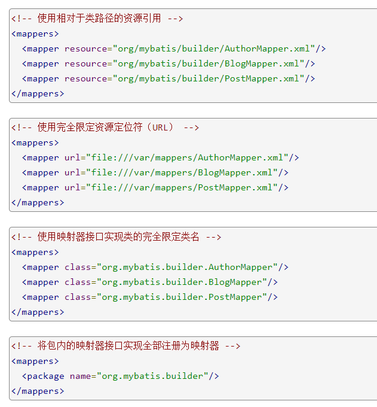

使用class文件和包扫描绑定注册**注意点**：

- 接口和mapper文件必须同名！
- 接口和mapper文件必须在同一个包下！


### 属性（properties）

属性可以在外部进行配置，并可以进行动态替换

优先级：命令行>外部文件>内部

加载机制：

- 首先读取在 properties 元素体内指定的属性。
- 然后根据 properties 元素中的 resource 属性读取类路径下属性文件，或根据 url 属性指定的路径读取属性文件，并覆盖之前读取过的同名属性。
- 最后读取作为方法参数传递的属性，并覆盖之前读取过的同名属性。


使用步骤：

1、先编写一个db.properties

```properties
driver=com.mysql.cj.jdbc.Driver
url=jdbc:mysql://localhost:3306/mybatis?useSSL=false&useUnicode=true&characterEncoding=UTF-8&serverTimezone=Asia/Shanghai
username=root
password=123456
```

2、在核心配置文件中引入

```xml
<!--引入外部配置文件-->
<properties resource="db.properties">
    <property name="username" value="root"/>
</properties>
```

或者根据url引入


【易错点】

**#{}** 是占位符

**$()**是直接字符替换，不安全，有注入风险


### 类型别名（typeAliases）

- 为 Java 类型设置一个缩写名字。
- 它仅用于 XML 配置，意在**降低冗余的全限定类名书写**

```xml
<typeAliases>
    <typeAlias type="com.tcmyxc.pojo.User" alias="User"/>
</typeAliases>
```

```xml
<select id="getUserList" resultType="User">
    select id, name, pwd as password from user
</select>
```

也可以指定一个包名，MyBatis 会在包名下面搜索需要的 Java Bean，比如：

```xml
<typeAliases>
    <package name="com.tcmyxc.pojo"/>
</typeAliases>
```

扫描实体类的包，它的默认别名就是这个类的类名，首字母小写（实际上也可以大写，但推荐小写）！

> 在没有注解的情况下，会使用 Bean 的首字母小写的非限定类名来作为它的别名
>
> ——官方原话


实体类较少，使用第一种。

如果实体类较大，使用第二种。

第二种可以直接定制化，第二种可以使用注解的方式定制名字

```java
@Alias("hello")
public class User {
    private int id;
    private String name;
    private String password;
    ...
```

```xml
<select id="getUserList" resultType="hello">
    select id, name, pwd as password from user
</select>
```

### 设置（settings）


### 生命周期

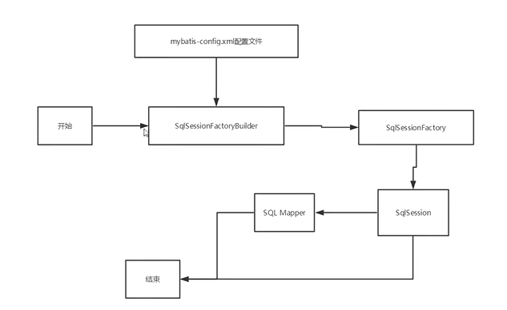


不同作用域和生命周期类别是至关重要的，因为错误的使用会导致非常严重的**并发问题**

**SqlSessionFactoryBuilder**

- 一旦创建了 SqlSessionFactory，就不再需要它了
- 局部变量

**SqlSessionFactory**

- 可以认为是数据库连接池
- SqlSessionFactory 一旦被创建就应该在应用的运行期间一直存在，**没有任何理由丢弃它或重新创建另一个实例**
- 最佳实践是在应用运行期间不要重复创建多次，浪费资源！
- 因此 SqlSessionFactory 的最佳作用域是**应用作用域**
- 最简单的就是使用**单例模式**或者静态单例模式

**SqlSession**

- 连接到连接池的一个请求
- SqlSession 的实例不是线程安全的，因此是不能被共享的，所以它的最佳的作用域是请求或方法作用域
- 用完之后需要赶紧关闭，否则资源被占用

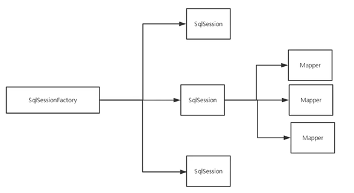


这里面每一个mapper就是一个业务。

## 解决实体类的属性名和数据库字段名不一致的问题

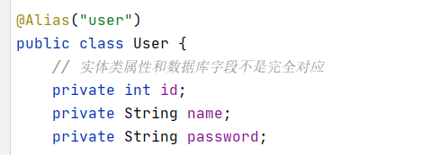

测试结果：


### 解决方案一：起别名

```xml
<select id="getUserList" resultType="user">
    select id, name, pwd as password from user
</select>
```

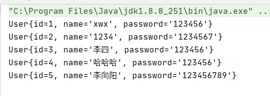

### 方案二：结果集映射

```tex
数据库字段：id name pwd
实体属性值：id name password
```

```xml
<resultMap id="UserMap" type="user">
    <!--property是实体类属性，column是数据库子段-->
    <result property="password" column="pwd"/>
</resultMap>
<select id="getUserList" resultMap="UserMap">
    select * from user
</select>
```

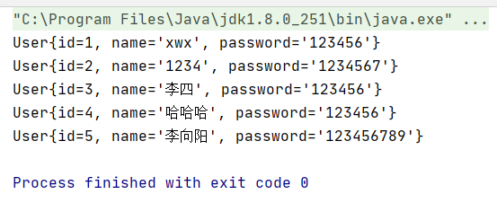

## 日志——log4j

如果数据库操作出现异常，我们需要排错，日志就是最好的助手！

曾经：sout，debug

现在：日志工厂


- SLF4J 
- LOG4J【掌握】 
- LOG4J2 
- JDK_LOGGING
- COMMONS_LOGGING 
- STDOUT_LOGGING【标准日志输出，不需要引包，掌握】 
- NO_LOGGING


### log4j是什么？

- Log4j是[Apache](https://baike.baidu.com/item/Apache/8512995)的一个开源项目
- 使用Log4j，可以控制日志信息输送的目的地是[控制台](https://baike.baidu.com/item/控制台/2438626)、文件、[GUI](https://baike.baidu.com/item/GUI)组件，甚至是套接口服务器、[NT](https://baike.baidu.com/item/NT/3443842)的事件记录器、[UNIX](https://baike.baidu.com/item/UNIX) [Syslog](https://baike.baidu.com/item/Syslog)[守护进程](https://baike.baidu.com/item/守护进程/966835)等
- 可以控制每一条日志的输出格式
- 通过定义每一条日志信息的级别，我们能够更加细致地控制日志的生成过程。
- 这些可以通过一个[配置文件](https://baike.baidu.com/item/配置文件/286550)来灵活地进行配置，而不需要修改应用的代码。


**使用步骤如下：**

### 在`pom.xml`中添加依赖

```xml
<!--log4j-->
<dependency>
    <groupId>log4j</groupId>
    <artifactId>log4j</artifactId>
    <version>1.2.12</version>
</dependency>
```

### 配置`log4j.properties`文件

```properties
### set log levels ###
log4j.rootLogger = DEBUG,Console,File

###  输出到控制台  ###
log4j.appender.Console=org.apache.log4j.ConsoleAppender
log4j.appender.Console.Target=System.out
log4j.appender.Console.Threshold=DEBUG
log4j.appender.Console.layout=org.apache.log4j.PatternLayout
log4j.appender.Console.layout.ConversionPattern=[%d{yy/MM/dd HH:mm:ss:SSS}]-%l:%m%n
​
### 输出到日志文件 ###
log4j.appender.File=org.apache.log4j.RollingFileAppender 
log4j.appender.File.File=./log/app.log
log4j.appender.File.MaxFileSize=10MB
log4j.appender.File.Threshold=DEBUG
log4j.appender.File.layout=org.apache.log4j.PatternLayout
log4j.appender.File.layout.ConversionPattern=[%p][%d{yyyy-MM-dd HH\:mm\:ss,SSS}][%c]%m%n

# 日志输出级别
log4j.logger.org.mybatis=DEBUG
log4j.logger.org.java.sql=DEBUG
log4j.logger.org.java.sql.Statement=DEBUG
log4j.logger.org.java.sql.ResultSet=DEBUG
log4j.logger.org.java.sql.PreparedStatement=DEBUG
```


**其实这就已经配置好了**！！！是不是很惊喜！！！


### 简单使用

1、在要使用log4j的类中导包

2、生成一个日志对象，参数为当前类的class

```java
 static Logger logger = Logger.getLogger(UserMapper.class);

@Test
public void testLog4j(){
    // 三种日志级别
    logger.info("info:进入了testLog4j方法");
    logger.debug("debug:进入了testLog4j方法");
    logger.error("error:进入了testLog4j方法");
}
```


## 分页

**思考：为什么使用分页？**

- 减少数据处理量

### 使用limit分页

1. 新建一个子项目
2. 写核心配置文件
3. 写工具类
4. 写接口
5. 写mapper.xml文件
6. 注册mapper.xml
7. 测试

```mysql
select * from user limit startIndex,pageSize

开始的下标，每页的数量
```

### 使用RowBounds分页

- 不建议在开发中使用

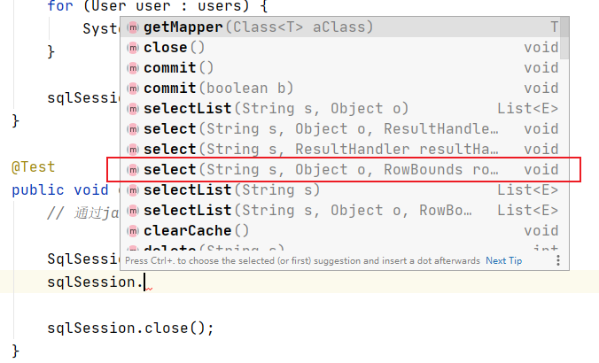


```java
// UserMapper.java
// 使用RowBounds分页，我只要查询就好，分页让java对象去做
@Select("select * from user")
List<User> getUserListByRowBounds();

// 测试类
@Test
public void getUserListByRowBounds(){
    // 通过java代码层面实现分页

    SqlSession sqlSession = MybatisUtils.getSqlSession();
    RowBounds rowBounds = new RowBounds(0, 3);
    List<User> users = sqlSession.selectList("com.tcmyxc.dao.UserMapper.getUserListByRowBounds", null, rowBounds);

    for (User user : users) {
        System.out.println(user);
    }

    sqlSession.close();
}
```

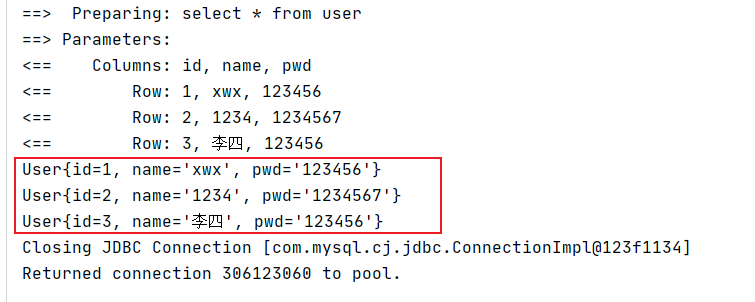


## 使用注解开发

1、注解在接口上实现

2、在核心配置文件绑定接口

3、本质是反射机制实现，底层是动态代理

### 面向接口编程

如果依赖于抽象类来定义行为，往往导致过于复杂的继承关系，而通过接口定义行为能够更有效地分离行为与实现，为代码的维护和修改带来方便。


关于接口的理解：

- 接口从更深层次的理解，应是定义（规范，约束）与实现（名实分离的原则）的分离。
- 接口的本身反映了系统设计人员对系统的抽象理解。
- 接口应有两类：
  - 第一类是对一个个体的抽象，它可对应为一个抽象体(abstract class)；
  - 第二类是对一个个体某一方面的抽象，即形成一个抽象面（interface）；
- 一个体有可能有多个抽象面。
- 抽象体与抽象面是有区别的。


interface在某些地方和abstract有相似的地方，但是采用哪种方式来声明类主要参照以下两点：

- 如果要创建不带任何方法定义和[成员变量](https://baike.baidu.com/item/成员变量)的基类，那么就应该选择接口而不是抽象类。
- 如果知道某个类应该是基类，那么第一个选择的应该是让它成为一个接口，只有在**必须要有方法定义和成员变量**的时候，才应该选择[抽象类](https://baike.baidu.com/item/抽象类)。因为抽象类中允许存在一个或多个被具体实现的方法，只要方法没有被全部实现该类就仍是抽象类。

### 使用过程

#### 新建工具类，实体类

#### 只需要写接口，不需要UserMapper.xml文件

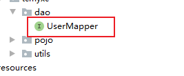

```xml
public interface UserMapper {

    @Select("select * from user")
    List<User> getUserList();
}
```


#### 在核心配置文件`mybatis-config.xml`文件中注册接口（使用类名注册）

```xml
<!--绑定接口-->
<mappers>
    <mapper class="com.tcmyxc.dao.UserMapper"/>
</mappers>
```

#### 测试

```java
@Test
public void getUserList(){
    SqlSession sqlSession = MybatisUtils.getSqlSession();

    UserMapper mapper = sqlSession.getMapper(UserMapper.class);
    List<User> userList = mapper.getUserList();
    for (User user : userList) {
        System.out.println(user);
    }

    sqlSession.close();
}
```

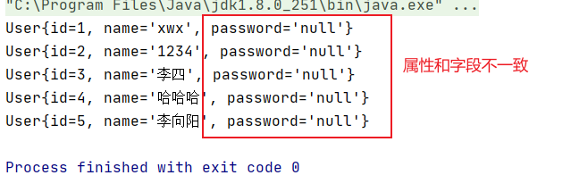

注意错误点：属性和字段不一致的问题比较烦人（可以使用笨方法）


`所以稍微复杂的还是XML来吧`

注意点：

- 简单的sql语句可以使用

- 复杂的还是xml配置文件来

- 对一个接口来说，**可以混用**

  ```xml
  <mappers>
      <mapper class="com.tcmyxc.dao.UserMapper"/>
      <mapper resource="com/tcmyxc/dao/UserMapper.xml"/>
  </mappers>
  ```

- 使用注解来映射简单语句会使代码显得更加简洁，但对于稍微复杂一点的语句，注解不仅力不从心，还会让你本就复杂的 SQL 语句更加混乱不堪。因此，如果你需要做一些很复杂的操作，最好用 XML 来映射语句

-  选择何种方式来配置映射，以及认为是否应该要统一映射语句定义的形式，完全取决于你和你的团队。换句话说，永远不要拘泥于一种方式，你可以很轻松的在基于注解和 XML 的语句映射方式间自由移植和切换

### Mybatis详细执行流程

### 使用注解完成CRUD

我们可以在工具类创建的时候实现自动提交事务！但是**尽量不要自动提交**！

```java
public static SqlSession getSqlSession(){
    // 设置自动提交事务
    return sqlSessionFactory.openSession(true);
}
```


**`@Param("param")注解`问题**

- 基本类型的参数或者String类型，需要加上
- 引用类型不需要加
- 单个基本类型，参数可不写
- 多个参数必须写


参数取的时候取得是注解里面的参数！


几种错误情况：

1、错误1


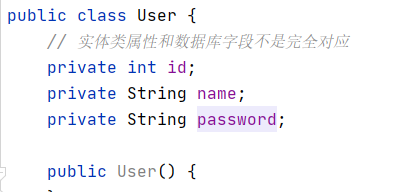


修改成下面即可：


```java
@Test
public void insertUser2(){
    SqlSession sqlSession = MybatisUtils.getSqlSession();
    UserMapper mapper = sqlSession.getMapper(UserMapper.class);
    int res = mapper.insertUser2(new User(11, "哈哈哈", "234t"));
    if(res > 0) {
        System.out.println("插入成功！");
    }

    sqlSession.close();
}
```

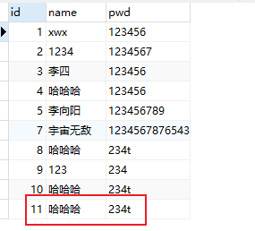

【注意】**我们必须要将接口注册到核心配置文件**

### `#{} 和${}`区别

- `#{} `可以防止SQL注入
- `${} `不安全

> 默认情况下，使用 `#{}` 参数语法时，MyBatis 会创建 `PreparedStatement` 参数占位符，并通过占位符安全地设置参数（就像使用 ? 一样）。 这样做更安全，更迅速，通常也是首选做法
>
>  `${column}` 会被直接替换，用作语句参数是不安全的，会导致潜在的 SQL 注入攻击。因此，要么不允许用户输入这些字段，要么自行转义并检验这些参数。

## 一对多和多对一

一个老师，多个学生

```mysql
create table teacher(
    id int(10) not null,
    name varchar(30) default null,
    primary key(id)    
)engine=innodb default charset=utf8

insert into teacher values (1, '徐老师');

create table student(
    id int(10) not null,
    name varchar(30) default null,
    tid int(10) default null,
    primary key (id),
    foreign key (tid) references teacher (id)
)engine=innodb default charset=utf8

insert into student values (1, '张三', 1);
insert into student values (2, '李四', 1);
insert into student values (3, '王五', 1);
insert into student values (4, '赵六', 1);
insert into student values (5, '秦七', 1);
```

**测试环境搭建：**

1. 建数据库
2. 新建老师，同学实体类
3. 建立mapper接口
4. 建立mapper.xml文件
5. 注册mapper.xml文件
6. 测试


### 查询所有的学生以及学生老师的信息

按照结果处理

```xml
<select id="getStudentList" resultMap="StudentTeacher">
    select s.id as sid, s.name as sname, t.id as tid, t.name as tname
    from student as s, teacher as t
    where s.tid = t.id
</select>

<resultMap id="StudentTeacher" type="Student">
    <result column="sid" property="id"/>
    <result column="sname" property="name"/>
    <association property="teacher" javaType="Teacher">
        <result column="tid" property="id"/>
        <result column="tname" property="name"/>
    </association>
</resultMap>
```


```java
@Test
public void getStudentList(){
    SqlSession sqlSession = MybatisUtils.getSqlSession();

    StudentMapper mapper = sqlSession.getMapper(StudentMapper.class);
    List<Student> studentList = mapper.getStudentList();
    for (Student student : studentList) {
        System.out.println(student);
    }
    sqlSession.close();
}
```


结果：


### 查询老师有多少个学生

```xml
<select id="getTeacher" resultMap="TeacherStudentMap">
    select t.id as tid, t.name as tname, s.id as sid, s.name as sname
    from teacher as t, student as s
    where t.id = s.tid and t.id = #{tid}
</select>

<resultMap id="TeacherStudentMap" type="Teacher">
    <result column="tid" property="id"/>
    <result column="tname" property="name"/>
  <!--
  集合 : collection
  关联 : association

  集合中的泛型用ofType
  -->
    <collection property="students" ofType="Student">
        <result column="sid" property="id"/>
        <result column="sname" property="name"/>
    </collection>
</resultMap>

	<!--
	Teacher{
		id=1,
		name='徐老师',
		students=
			[
			Student{id=1, name='张三', tid=0},
			Student{id=2, name='李四', tid=0},
			Student{id=3, name='王五', tid=0},
			Student{id=4, name='赵六', tid=0},
			Student{id=5, name='秦七', tid=0}
			]
	}
	-->
```


### 小结

1. 关联 - association 【多对一】
2. 集合 - collection 【一对多】
3. javaType 和 ofType
   - javaType 用来指定实体类中属性的类型
   - ofType 用来指定到List或者集合中的 pojo 类型


面试高频：

- MySql引擎
- InnoDB底层原理
- 索引
- 索引优化
- 查询优化


## 动态SQL语句

**根据不同的条件生成不同的SQL语句**

- if
- choose (when, otherwise)
- trim (where, set)
- foreach


### if

有就用，没有就不用

```xml
<select id="findActiveBlogLike"
     resultType="Blog">
  SELECT * FROM BLOG WHERE state = ‘ACTIVE’
  <if test="title != null">
    AND title like #{title}
  </if>
  <if test="author != null and author.name != null">
    AND author_name like #{author.name}
  </if>
</select>
```


### choose、when、otherwise

传入了 “title” 就按 “title” 查找，传入了 “author” 就按 “author” 查找的情形。若两者都没有传入，就返回标记为 featured 的 BLOG

```xml
<select id="findActiveBlogLike"
     resultType="Blog">
  SELECT * FROM BLOG WHERE state = ‘ACTIVE’
  <choose>
    <when test="title != null">
      AND title like #{title}
    </when>
    <when test="author != null and author.name != null">
      AND author_name like #{author.name}
    </when>
    <otherwise>
      AND featured = 1
    </otherwise>
  </choose>
</select>
```


### trim、where、set

*where*元素

```xml
<select id="findActiveBlogLike"
     resultType="Blog">
  SELECT * FROM BLOG
  <where>
    <if test="state != null">
         state = #{state}
    </if>
    <if test="title != null">
        AND title like #{title}
    </if>
    <if test="author != null and author.name != null">
        AND author_name like #{author.name}
    </if>
  </where>
</select>
```


*set* 元素可以用于动态包含需要更新的列，忽略其它不更新的列。比如：

```xml
<update id="updateAuthorIfNecessary">
  update Author
    <set>
      <if test="username != null">username=#{username},</if>
      <if test="password != null">password=#{password},</if>
      <if test="email != null">email=#{email},</if>
      <if test="bio != null">bio=#{bio}</if>
    </set>
  where id=#{id}
</update>
```

这个例子中，*set* 元素会动态地在行首插入 SET 关键字，并会删掉额外的逗号（这些逗号是在使用条件语句给列赋值时引入的）。

### foreach

动态 SQL 的另一个常见使用场景是对集合进行遍历（尤其是在构建 IN 条件语句的时候）。比如：

```xml
<select id="selectPostIn" resultType="domain.blog.Post">
  SELECT *
  FROM POST P
  WHERE ID in
  <foreach item="item" index="index" collection="list"
      open="(" separator="," close=")">
        #{item}
  </foreach>
</select>
```

*foreach* 元素的功能非常强大，它允许你指定一个集合，声明可以在元素体内使用的集合项（item）和索引（index）变量。它也允许你指定开头与结尾的字符串以及集合项迭代之间的分隔符。这个元素也不会错误地添加多余的分隔符，看它多智能！

**提示** 你可以将任何可迭代对象（如 List、Set 等）、Map 对象或者数组对象作为集合参数传递给 *foreach*。当使用可迭代对象或者数组时，index 是当前迭代的序号，item 的值是本次迭代获取到的元素。当使用 Map 对象（或者 Map.Entry 对象的集合）时，index 是键，item 是值。

## 自定义缓存-ehcache

```xml
<!-- https://mvnrepository.com/artifact/org.mybatis.caches/mybatis-ehcache -->
<dependency>
    <groupId>org.mybatis.caches</groupId>
    <artifactId>mybatis-ehcache</artifactId>
    <version>1.1.0</version>
</dependency>
```


ehcache.xml

```xml
<?xml version="1.0" encoding="UTF-8"?>
<ehcache xmlns:xsi="http://www.w3.org/2001/XMLSchema-instance"
xsi:noNamespaceSchemaLocation="http://ehcache.org/ehcache.xsd"
updateCheck="false">

<diskStore path="./tmpdir/Tmp_EhCache"/>

<defaultCache
eternal="false"
maxElementsInMemory="10000"
overflowToDisk="false"
diskPersistent="false"
timeToIdleSeconds="1800"
timeToLiveSeconds="259200"
memoryStoreEvictionPolicy="LRU"/>

<cache
name="cloud_user"
eternal="false"
maxElementsInMemory="5000"
overflowToDisk="false"
diskPersistent="false"
timeToIdleSeconds="1800"
timeToLiveSeconds="1800"
memoryStoreEvictionPolicy="LRU"/>
</ehcache>
```


工作中都是用redis！


## 缓存

默认情况下，只启用了本地的会话缓存，它仅仅对一个会话中的数据进行缓存。 要启用全局的二级缓存，只需要在你的 SQL 映射文件中添加一行：

```xml
<cache/>
```

基本上就是这样。这个简单语句的效果如下:

- 映射语句文件中的所有 select 语句的结果将会被缓存。
- 映射语句文件中的所有 insert、update 和 delete 语句会刷新缓存。
- 缓存会使用最近最少使用算法（LRU, Least Recently Used）算法来清除不需要的缓存。
- 缓存不会定时进行刷新（也就是说，没有刷新间隔）。
- 缓存会保存列表或对象（无论查询方法返回哪种）的 1024 个引用。
- 缓存会被视为读/写缓存，这意味着获取到的对象并不是共享的，可以安全地被调用者修改，而不干扰其他调用者或线程所做的潜在修改。