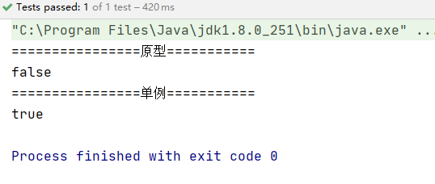

<center><font size="48px"><b>Spring</b></font></center>


# Spring简介

## 简单介绍

◆目的：解决企业应用开发的复杂性

◆功能：使用基本的JavaBean代替EJB，并提供了更多的企业应用功能

◆范围：任何Java应用

Spring是一个轻量级控制反转(IoC)和面向切面(AOP)的容器框架。

- 2002年，Rod Jahnson（音乐学博士）出版的《Expert One-on-One J2EE Design and Development》，第一次出现了Spring的一些核心思想，雏形框架：interface21框架
- 2004年3月24日，Spring框架以interface21框架为基础，经过重新设计，发布了1.0正式版
- Spring理念：使现有的技术更加容易使用，本身是一个大杂烩，整合了现有的技术框架


官网：https://spring.io/projects/spring-framework

官方下载地址：https://repo.spring.io/release/org/springframework/spring/

中文文档：https://www.docs4dev.com/docs/zh/spring-framework/5.1.3.RELEASE/reference

GitHub:https://github.com/spring-projects/spring-framework

Maven:

```xml
<!-- 一般来说，第一个够用了 -->
<!-- https://mvnrepository.com/artifact/org.springframework/spring-webmvc -->
<dependency>
    <groupId>org.springframework</groupId>
    <artifactId>spring-webmvc</artifactId>
    <version>5.2.5.RELEASE</version>
</dependency>

<!-- https://mvnrepository.com/artifact/org.springframework/spring-jdbc -->
<dependency>
    <groupId>org.springframework</groupId>
    <artifactId>spring-jdbc</artifactId>
    <version>5.2.5.RELEASE</version>
</dependency>
```


## 优点

- 一个开源的免费的框架
- 轻量级、非入侵式（集成了Spring之后不会影响原有的项目）的框架
- 控制反转（IOC）、面向切面编程（AOP）
- 支持事务的处理，对框架整合的支持


==Spring是一个轻量级的控制反转（IOC）和面向切面编程(AOP)的框架==

## 组成


## 拓展

现代化的java开发

- Spring Boot
  - 一个快速开发的脚手架
  - 基于Spring Boot可以快速开发单个微服务
  - 约定大于配置
- Spring Cloud
  - Spring Cloud是基于Spring Boot实现的


==多数人都在用，Spring和SpringMVC是最最基础的==


弊端：发展了太久之后，违背了原来的理念！配置十分繁琐

# IOC理论

> 比如说，Class A中用到了Class B的对象b，一般情况下，需要在A的代码中显式的new一个B的对象。
>
> 采用依赖注入技术之后，A的代码只需要定义一个私有的B对象，不需要直接new来获得这个对象，而是通过相关的容器控制程序来将B对象在外部new出来并注入到A类里的引用中。
>
> IOC，我不要去创建了，别人创建好了，我直接拿来用

控制反转：要实现不同的操作，只需要在xml配置文件中修改，**对象让Spring来创建，管理，装配**

## IOC思想的简单解释

传统方法：

1. User接口
2. User实现类
3. UserService接口
4. UserService实现类
5. 用户调用UserService实现类

**上面的方法需要根据用户需求修改源代码，程序员自己去new对象**


革命性变化：让用户选择实现哪个类

```java
// 利用set接口进行动态实现值得注入
public void setUserDao(UserDao userDao) {
	this.userDao = userDao;
}
```

```java
public static void main(String[] args) {

    // 用户实际使用的是业务层，DAO层用户不需要接触
    UserServiceImpl userService = new UserServiceImpl();

    // 让用户选择实现哪一个类（用户主动创建对象）
    userService.setUserDao(new UserOracleImpl());

    userService.getUserService();
}
```


- 使用set注入之后，让用户自己创建对象


**让用户自己去new自己想要的对象，用户选择自己需要的接口**


==**本来程序员控制怎么new对象，现在换成用户自己new对象**==

降低程序耦合性，程序员只需要专注业务实现即可

上面就是IOC的思想！！！

## IOC


# IOC创建对象的方式

1. 使用无参构造创建对象，默认（但是一般满足不了需求，比如一个类有多个属性）

   ```xml
   <bean id="user" class="com.tcmyxc.pojo.User">
       <property name="name" value="徐文祥"/>
   </bean>
   ```

   

2. 假如要使用有参构造创建对象

   1. 下标赋值

   ```xml
   <bean id="user" class="com.tcmyxc.pojo.User">
       <constructor-arg index="0" value="xwx"/>
   </bean>
   ```

   2. 参数类型匹配（不建议用）

   ```xml
   <bean id="user" class="com.tcmyxc.pojo.User">
       <constructor-arg type="java.lang.String" value="xwx"/>
   </bean>
   ```

   3. 使用参数名（建议使用）

   ```xml
   <bean id="user" class="com.tcmyxc.pojo.User">
       <constructor-arg name="name" value="xwx"/>
   </bean>
   ```


自己写Spring的步骤：

1. 创建一个java bean
2. 在配置文件注册bean
3. 从配置文件获取容器
4. 从容器中拿对象


IOC创建对象一次性把注册的bean的对象全部创建，并且只创建一次


# Spring配置

## 别名

```xml
<!--别名-->
	<alias name="user" alias="newUser"/>
```


## bean的配置

```xml
<!--
	id : bean 的唯一标识
	class : bean 对象所对应的全限定名 ： 包名 + 类型
	name : 也是别名，更高级，可以同时取多个别名
	-->
	<bean id="user2" class="com.tcmyxc.pojo.User2" name="user22,user23">
		<property name="name" value="xwx"/>
	</bean>
```


## import

团队开发使用，合并配置文件用的

```xml
<import resource="beans.xml"/>
```


# 依赖注入（Dependency Injection）

依赖注入是IOC的实现


原始博客：https://martinfowler.com/articles/injection.html#InversionOfControl

- 原始的文章（马丁富勒）提出了三种方法：构造函数注入，Setter注入和接口注入
- Spring实现了两种，set注入和构造函数，官方和马丁福勒都提倡构造，但是大家一般喜欢set

本质是set注入，必须有set方法，如果真的没有setf方法，那就只能通过构造函数来注入

依赖：bean 对象的创建依赖于容器

注入：bean 对象中的所有属性，由容器来注入


- 可以混合使用基于构造函数的DI和基于设定值的DI

- 将构造函数用于强制性依赖项并将setter方法或配置方法用于可选依赖性是一个很好的经验法则。

- 可以 在setter方法上使用[@Required](#beans-required-annotation)批注，以使该属性成为必需的依赖项。但是，最好使用带有参数的程序验证的构造函数注入。

- Spring团队通常**提倡构造函数注入**，因为它可以让您将应用程序组件实现为不可变对象，并确保不存在必需的依赖项`null`
- 构造函数注入的组件始终以完全初始化的状态返回到客户端（调用）代码
- Setter注入主要应用于可以在类中分配合理的默认值的可选依赖项。否则，必须在代码使用依赖项的任何地方执行非空检查。setter注入的一个好处是，setter方法可使该类的对象在以后重新配置或重新注入
- `如果第三方类未公开任何setter方法，则构造函数注入可能是DI的唯一可用形式`。


【环境搭建】

1、复杂类型

2、真实测试对象


## 构造器注入

第三大点已经说过

## Set方式注入【重点】

```xml
<bean id="address" class="com.tcmyxc.pojo.Address">
    <property name="address" value="杭州"/>
</bean>

<bean id="student" class="com.tcmyxc.pojo.Student">
    <!--普通注入，value-->
    <property name="name" value="徐文祥"/>

    <!--bean注入，ref-->
    <property name="address" ref="address"/>

    <!--数组注入-->
    <property name="books">
        <array>
            <value>红楼梦</value>
            <value>水浒传</value>
            <value>西游记</value>
            <value>三国演义</value>
        </array>
    </property>

    <!--list注入-->
    <property name="hobbies">
        <list>
            <value>吃饭</value>
            <value>睡觉</value>
            <value>打豆豆</value>
        </list>
    </property>

    <!--map-->
    <property name="card">
        <map>
            <entry key="身份证" value="122525212152525"/>
            <entry key="学生卡" value="122525212152525"/>
        </map>
    </property>

    <!--set-->
    <property name="games">
        <set>
            <value>lol</value>
            <value>碧蓝航线</value>
            <value>阴阳师</value>
        </set>
    </property>

    <!--null-->
    <property name="wife" value=""/>

    <!--properties-->
    <property name="info">
        <props>
            <prop key="性别">男</prop>
            <prop key="学号">3152555666</prop>
        </props>
    </property>
</bean>
```


## 拓展方式

p 命名空间和 c 命名空间

- the p-namespace lets you use the `bean` element’s attributes (instead of nested `<property/>` elements) to describe your property values collaborating beans, or both.
- the c-namespace, introduced in Spring 3.1, allows inlined attributes for configuring the constructor arguments rather then nested `constructor-arg` elements.


```xml
<?xml version="1.0" encoding="UTF-8"?>
<beans xmlns="http://www.springframework.org/schema/beans"
       xmlns:xsi="http://www.w3.org/2001/XMLSchema-instance"
       xmlns:p="http://www.springframework.org/schema/p"
       xmlns:c="http://www.springframework.org/schema/c"
       xsi:schemaLocation="http://www.springframework.org/schema/beans
        https://www.springframework.org/schema/beans/spring-beans.xsd">

	<!--P命名空间 : 就是属性，可以直接注入属性的值，必须有无参构造-->
	<bean id="user" class="com.tcmyxc.pojo.User" p:name="xwx" p:age="24"/>

	<!--C命名空间 : 构造器注入-->
	<bean id="user2" class="com.tcmyxc.pojo.User" c:name="徐文祥" c:age="24"/>

</beans>
```


测试：

```java
@Test
public void test2(){
    ApplicationContext context = new ClassPathXmlApplicationContext("userbean.xml");
    User user = context.getBean("user", User.class);
    System.out.println(user);
    User user2 = context.getBean("user2", User.class);
    System.out.println(user2);
}
```


【注意点】

- 需要导入约束
- P命名空间必须有无参构造
- C命名空间必须有有参构造


## 作用域


### 单例

默认的

```xml
<bean id="user2" class="com.tcmyxc.pojo.User" c:name="徐文祥" c:age="24"/>
```


### 原型模式

每次从容器中get对象，都会创建一个新的出来

```xml
<bean id="user" class="com.tcmyxc.pojo.User" p:name="xwx" p:age="24" scope="prototype"/>
```


测试：

```java
 // 测试作用域：单例以及原型
@Test
public void test3(){
    ApplicationContext context = new ClassPathXmlApplicationContext("userbean.xml");
    System.out.println("================原型===========");
    User user = context.getBean("user", User.class);
    User user2 = context.getBean("user", User.class);
    System.out.println(user.hashCode()==user2.hashCode());

    System.out.println("================单例===========");
    User user3 = context.getBean("user2", User.class);
    User user4 = context.getBean("user2", User.class);
    System.out.println(user3.hashCode()==user4.hashCode());
}
```





### 其他

只能在web开发中使用


# Bean的自动装配

- Spring满足bean依赖的一种方式
- Spring会在上下文中寻找，并自动给bean装配属性


三种装配的方式：

- 在xml文件中显式配置
- 在java中显式配置
- 隐式的自动装配bean【重要】


## 测试环境

一个人有一只猫和一只狗


## byName

```xml
<bean id="cat" class="com.tcmyxc.pojo.Cat"/>
<bean id="dog" class="com.tcmyxc.pojo.Dog"/>

<!--
 byName : 会自动在容器上下文中查找，和自己对象set方法后面的值对应的 beanid 
 byType : 会自动在容器上下文中查找，和自己对象属性相同的 bean 
 -->
<bean id="person" class="com.tcmyxc.pojo.Person" autowire="byName">
    <property name="name" value="徐文祥"/>
</bean>
```


## byType

```xml
<bean class="com.tcmyxc.pojo.Cat"/>
<bean class="com.tcmyxc.pojo.Dog"/>

<!--
 byName : 会自动在容器上下文中查找，和自己对象set方法后面的值对应的 beanid
 byType : 会自动在容器上下文中查找，和自己对象属性相同的 bean
 -->
<bean id="person" class="com.tcmyxc.pojo.Person" autowire="byType">
    <property name="name" value="徐文祥"/>
</bean>
```


小结：

- byName需要所有bean的id唯一，并且这个bean需要和自动注入的属性的set方法的值一致
- byType需要所有bean的class唯一，并且这个bean需要和自动注入的属性的类型一致，可以省略id


## 使用注解实现自动装配

使用注解须知：

- 导入约束

- ==**配置注解的支持**==`<context:annotation-config/>`

  ```xml
  <?xml version="1.0" encoding="UTF-8"?>
  <beans xmlns="http://www.springframework.org/schema/beans"
      xmlns:xsi="http://www.w3.org/2001/XMLSchema-instance"
      xmlns:context="http://www.springframework.org/schema/context"
      xsi:schemaLocation="http://www.springframework.org/schema/beans
          https://www.springframework.org/schema/beans/spring-beans.xsd
          http://www.springframework.org/schema/context
          https://www.springframework.org/schema/context/spring-context.xsd">
  
      <context:annotation-config/>
  
  </beans>
  ```


### @Autowired【大家用的最多】

直接在属性上使用即可，也可以在set方法上使用（构造方法也行，还有一些其他的，不过那些都不重要）

使用Autowired，可以不写set方法，但是这个自动装配的属性必须在IOC容器中存在且符合

科普：

1. 字段上**@Nullable**这个注解一加，说明允许为空
2. 

```java
public @interface Autowired {
    boolean required() default true;
}
```

默认是true，如果显式定义为false，说明属性可以为空


3. 如果环境复杂，自动装配无法通过@Autowired唯一定义，可以结合使用@Qualifier(value="xxx")来指定唯一的bean对象注入

```xml
<bean id="dog11" class="com.tcmyxc.pojo.Dog"/>
<bean id="dog222" class="com.tcmyxc.pojo.Dog"/>
```

```java
@Autowired
@Qualifier(value="dog222")
private Dog dog;
```

4. @Resource也可以自动装配，id和class至少要匹配一个，不然就会报错

   ```java
   @Resource
   private Cat cat;
   ```


@Autowired和@Resource

- 都是自动装配，都可以防止属性字段上
- @Autowired是通过byType实现的，要求这个bean对象必须存在
- @Resource默认byName，如果没有，之后byType，啥都没有就报错


# 使用注解开发

在Spring4之后，想要使用注解开发，必须保证AOP的包被导入了

开启注解支持

【注意】这里的文件名就需要规范起来了，也就是`applicationContext.xml`不然会报找不到主类的错误

```xml
<?xml version="1.0" encoding="UTF-8"?>
<beans xmlns="http://www.springframework.org/schema/beans"
       xmlns:xsi="http://www.w3.org/2001/XMLSchema-instance"
       xmlns:context="http://www.springframework.org/schema/context"
       xsi:schemaLocation="http://www.springframework.org/schema/beans
        https://www.springframework.org/schema/beans/spring-beans.xsd
        http://www.springframework.org/schema/context
        https://www.springframework.org/schema/context/spring-context.xsd">

	<!--开启注解支持-->
	<context:annotation-config/>
  
</beans>
```


1. bean

2. 属性如何注入

   ```java
   @Component
   // 这个注解等价于 <bean id="user" class="com.tcmyxc.pojo.User"/>
   public class User {
   
       //  @Value("徐文祥")放这里也行，就不需要set方法了
       public String name;
       private int age;
   
       @Value("徐文祥")
       public void setName(String name) {
           this.name = name;
       }
   }
   ```

   

3. 衍生的注解（都是组件的意思，和@Component一样，都是说把某个类注册到容器中，只不过在MVC架构不同的层罢了）

   - dao【@Repository】
   - service【@Service】
   - controller【@Controller】

4. 自动装配配置

5. 作用域

   @Scope

   ```java
   @Component
   // 这个注解等价于 <bean id="user" class="com.tcmyxc.pojo.User"/>
   @Scope("singleton")
   public class User {
   
       //  @Value("徐文祥")放这里也行，就不需要set方法了
       public String name;
       private int age;
   
       @Value("徐文祥")
       public void setName(String name) {
           this.name = name;
       }
   }
   ```

   

6. 小结

   - xml与注解
     - xml更万能，适用任何场合，维护方便
     - 注解更简单，但是不是自己的类使用不了，维护复杂

7. 最佳实践

   - xml管理bean，注解只用来属性的注入
   - 使用过程中需要注意：==必须要让注解生效（在配置文件开启注解支持）==

# 基于Java方式配置Spring

完全不使用xml配置，全部放在java代码中搞

Java-configuration 是Spring的一个子项目，在Spring4之后，成为一个核心功能


实体类：

```java
// 意思是把这个类放到容器里，让Spring接管
@Component
public class User {

    private String name;

    public String getName() {
        return name;
    }

    @Value("xwx")
    public void setName(String name) {
        this.name = name;
    }

    @Override
    public String toString() {
        return "User{" +
                "name='" + name + '\'' +
                '}';
    }
}
```


配置类：

```java
@Configuration
// 这个也会被注册到容器中，本身也是一个component
// 等价于xml文件
@ComponentScan("com.tcmyxc.pojo")
public class AppConfig {

    // 注册一个bean，相当于xml文件中的bean标签，方法名是标签的id
    @Bean
    public User user(){
        return new User();
    }
}
```


测试：

```java
public class MyTest {

    public static void main(String[] args) {
        // 如果使用java配置类的方法，那么需要使用 AnnotationConfigApplicationContext
        ApplicationContext context = new AnnotationConfigApplicationContext(AppConfig.class);

        //User user = context.getBean("getUser", User.class);// 方法名就是bean的名字
        //User user = context.getBean("user", User.class);

        // 如果方法名和是类名的小写，下面的也可以
        User user = context.getBean(User.class);

        System.out.println(user.toString());
    }
}
```


截图：


纯java的方式在SpringBoot随处可见


# 代理模式

代理模式是SpringAOP的底层

分类：

- 静态代理
- 动态代理


## 静态代理

好处：

- 代理可以使真实角色更加纯粹，不需要关系公共业务
- 公共的业务交给代理来做，实现了业务的分工
- 公共业务发生拓展的时候，方便集中管理

缺点：

- 一个真实角色会产生一个代理角色，代码量会翻倍，开发的效率会变低


## 加深理解

聊聊AOP


## 动态代理

- 使用反射
- 动态代理和静态代理角色一样
- 动态代理的代理类是动态生成的
- 分为两大类：基于接口，基于类
  - 基于接口：JDK动态代理
  - 基于类：cglib
  - java字节码实现：javasist

> CGLib (Code Generation Library) 是一个强大的,高性能,高质量的Code生成类库。
>
> 它可以在运行期扩展Java类与实现Java接口。
>
> Hibernate用它来实现PO字节码的动态生成。
>
> CGLib 比 Java 的 java.lang.reflect.Proxy 类更强的在于它不仅可以接管接口类的方法，还可以接管普通类的方法。
>
> CGLib 的底层是Java字节码操作框架 —— [ASM](http://www.oschina.net/p/asm)。

需要了解两个类：

Proxy：一个类，代理

- `Proxy`提供了创建动态代理类和实例的静态方法

InvocationHandler：一个接口，调用处理程序，并返回结果


【总结】

好处：

- 静态有的它都有
- 动态代理类代理的是接口，一般对应的是一类业务
- 一个动态代理类可以代理多个类，只要实现了同一个接口


# AOP

## 什么是AOP？

**在运行时，动态地将代码切入到类的指定方法、指定位置上的编程思想就是面向切面的编程。**

一般而言，我们管切入到指定类指定方法的代码片段称为切面，而切入到哪些类、哪些方法则叫切入点。有了AOP，我们就可以把几个类共有的代码，抽取到一个切片中，等到需要时再切入对象中去，从而改变其原有的行为。


通过[预编译](https://baike.baidu.com/item/预编译)方式和运行其动态代理实现在不修改[源代码](https://baike.baidu.com/item/源代码)的情况下给程序动态统一添加功能的一种技术


> AOP为Aspect Oriented Programming的缩写，意为：[面向切面编程](https://baike.baidu.com/item/面向切面编程/6016335)，通过[预编译](https://baike.baidu.com/item/预编译/3191547)方式和运行期间动态代理实现程序功能的统一维护的一种技术。AOP是[OOP](https://baike.baidu.com/item/OOP)的延续，是软件开发中的一个热点，也是[Spring](https://baike.baidu.com/item/Spring)框架中的一个重要内容，是[函数式编程](https://baike.baidu.com/item/函数式编程/4035031)的一种衍生范型。利用AOP可以对业务逻辑的各个部分进行隔离，从而使得业务逻辑各部分之间的[耦合度](https://baike.baidu.com/item/耦合度/2603938)降低，提高程序的可重用性，同时提高了开发的效率。
>
> ——百度百科


**Spring AOP就是基于动态代理的**，如果要代理的对象，实现了某个接口，那么Spring AOP会使用**JDK Proxy**，去创建代理对象，而对于没有实现接口的对象，就无法使用JDK Proxy去进行代理了。这时候Spring AOP会使用**Cglib**，生成一个被代理对象的子类，来作为代理，放一张图出来就明白了：


上面讲的是AOP的第一种实现，**运行时织入**。

**但是不是所有AOP的实现都是在运行时进行织入的，因为这样效率太低了**，而且只能针对方法进行AOP，无法针对构造函数、字段进行AOP。


## AOP在Spring中的作用

-   提供声明式企业服务。最重要的服务是 [声明式事务管理](https://docs.spring.io/spring-framework/docs/current/reference/html/data-access.html#transaction-declarative)。
-   让用户实现自定义切面，以AOP补充其对OOP的使用。


## 使用Spring实现AOP

【重点】需要导包

```xml
<dependencies>
    <dependency>
        <groupId>org.aspectj</groupId>
        <artifactId>aspectjweaver</artifactId>
        <version>1.9.5</version>
    </dependency>
</dependencies>
```


### 方式一：使用原生Spring API接口

```xml
<!--方式一：使用原生Spring API接口-->
<!--配置AOP-->
<aop:config>
    <!--
  切入点
  expression：表达式
  execution(要执行的位置)
  -->
    <aop:pointcut id="pointcut" expression="execution(* com.tcmyxc.service.UserServiceImpl.*(..))"/>

    <!--执行环绕增加-->
    <aop:advisor advice-ref="log" pointcut-ref="pointcut"/>
    <aop:advisor advice-ref="afterLog" pointcut-ref="pointcut"/>
</aop:config>
```


### 方式二：使用自定义类来实现AOP【主要是切面定义】

```xml
<!--方式二：自定义类-->
<bean id="diyPointcut" class="com.tcmyxc.diy.DiyPointcut"/>
<aop:config>
    <aop:aspect ref="diyPointcut">
        <!--切入点-->
        <aop:pointcut id="pointcut" expression="execution(* com.tcmyxc.service.UserServiceImpl.*(..))"/>
        <!--通知-->
        <aop:before method="before" pointcut-ref="pointcut"/>
        <aop:after method="after" pointcut-ref="pointcut"/>
    </aop:aspect>
</aop:config>
```


### 方式三：使用注解实现

```xml
<!--方式三-->
<bean id="annotationPointcut" class="com.tcmyxc.diy.AnnotationPointcut"/>
<!--开启注解支持，默认使用的JDKproxy-target-class="false" cglibproxy-target-class="true"-->
<aop:aspectj-autoproxy/>
```

```java
// 使用注解实现AOP
@Aspect
public class AnnotationPointcut {

    @Before("execution(* com.tcmyxc.service.UserServiceImpl.*(..))")
    public void before(){
        System.out.println("==========方法执行前========");
    }

    @After("execution(* com.tcmyxc.service.UserServiceImpl.*(..))")
    public void after(){
        System.out.println("==========方法执行后========");
    }

    // 环绕增强中，可以给定一个参数，代表我们要获取处理切入的点
    @Around("execution(* com.tcmyxc.service.UserServiceImpl.*(..))")
    public void around(ProceedingJoinPoint joinPoint) throws Throwable {
        System.out.println("==========环绕前========");

        System.out.println(joinPoint.getSignature());//打印签名，看看方法是那个
        // 执行方法
        Object proceed = joinPoint.proceed();

        System.out.println("==========环绕后========");
    }
}
```

# 整合mybatis

步骤

1. 导包
   - junit
   - mybatis
   - mysql数据库
   - spring相关
   - aop织入
   - mybatis-spring【http://mybatis.org/spring/zh/index.html】
2. 编写配置文件
3. 测试


## 回顾mybatis

1. 编写实体类
2. 编写核心配置文件
3. 编写接口
4. 编写mapper.xml文件
5. 注册mapper
6. 测试


## mybatis-spring

**什么是mybatis-spring？**

MyBatis-Spring 会帮助你将 MyBatis 代码无缝地整合到 Spring 中。它将允许 MyBatis 参与到 Spring 的事务管理之中，创建映射器 mapper 和 `SqlSession` 并注入到 bean 中，以及将 Mybatis 的异常转换为 Spring 的 `DataAccessException`。最终，可以做到应用代码不依赖于 MyBatis，Spring 或 MyBatis-Spring。


官网：http://mybatis.org/spring/zh/index.html


1. 编写数据源配置
2. sqlSessionFactory
3. sqlSessionTemplate
4. 需要给接口加实现类
5. 将实现类注入到Spring
6. 测试


# 声明式事务

ACID原则：

- 原子性
- 一致性
- 隔离性
- 持久性


## Spring中的事务管理

- 声明式事务：AOP【常用】
- 编程式事务


为什么需要事务？

- 如果不配置事务，可能存在数据提交不一致的情况
- 如果不在spring中配置声明式事务，就需要在代码中手动配置事务
- 事务在开发中很重要

