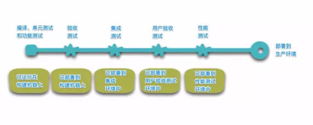

# SpringBoot


软实力：聊天+举止+谈吐+见解


网站结构演进：


#### 单一应用架构

当网站流量很小时，只需一个应用，将所有功能都部署在一起，以减少部署节点和成本。此时，用于简化增删改查工作量的数据访问框架(ORM，Object Relational Mapping，对象关系映射)是关键。

#### 垂直应用架构

当访问量逐渐增大，单一应用增加机器带来的加速度越来越小，提升效率的方法之一是将应用拆成互不相干的几个应用，以提升效率。此时，用于加速前端页面开发的Web框架(MVC)是关键。

#### 分布式服务架构

当垂直应用越来越多，应用之间交互不可避免，将核心业务抽取出来，作为独立的服务，逐渐形成稳定的服务中心，使前端应用能更快速的响应多变的市场需求。此时，用于提高业务复用及整合的分布式服务框架(RPC)是关键。

#### 流动计算架构

当服务越来越多，容量的评估，小服务资源的浪费等问题逐渐显现，此时需增加一个调度中心基于访问压力实时管理集群容量，提高集群利用率。此时，用于提高机器利用率的资源调度和治理中心(SOA，Service-Oriented Architecture，面向服务的架构)是关键。


## 微服务

特点：

1、组件化

2、根据业务构建服务，组织团队

3、去中心化

4、容错设计

5、演进式设计


几个专业术语：“面向服务的架构”(Service Oriented Architecture, SOA)


（1）“微服务”原文链接：http://martinfowler.com/articles/microservices.html

（2）“微服务”译文链接：http://mp.weixin.qq.com/s?__biz=MjM5MjEwNTEzOQ==&mid=401500724&idx=1&sn=4e42fa2ffcd5732ae044fe6a387a1cc3#rd

### 定义

> 1、以开发一组小型服务的方式来构建一个应用。
>
> 2、每个服务运行在自己的进程中，并经常采用HTTP资源API这样轻量的机制来相互通信。
>
> 3、服务围绕业务功能进行构建，并能通过全自动的部署机制来独立部署。
>
> 4、服务可以使用不同的语言来编写，可以使用不同的数据存储技术。
>
> 5、对这些微服务我们仅做最低限度的集中管理。


简单点说：以若干组可独立部署的服务的方式进行软件应用系统的设计，服务能被独立地部署和扩展，每一个服务还能提供一个稳固的模块边界，甚至能允许使用不同的编程语言来编写不同的服务


对比：

单块（monolithic）风格：一个单块应用系统是以一个单个单元的方式来构建的。企业应用系统经常包含三个主要部分：客户端用户界面、数据库和服务端应用系统。客户端用户界面包括HTML页面和运行在用户机器的浏览器中的JavaScript。数据库中包括许多表，这些表被插入一个公共的且通常为关系型的数据库管理系统中。这个服务端的应用系统就是一个单块应用——一个单个可执行的逻辑程序。对于该系统的任何改变，都会涉及构建和部署上述服务端应用系统的一个新版本。

限制：

- 应用系统的一个很小的部分的一处变更，也需要将整个单块应用系统进行重新构建和部署。
- 随着时间的推移，单块应用开始变得经常难以保持一个良好的模块化结构，这使得它变得越来越难以将一个模块的变更的影响控制在该模块内。
- 当对系统进行扩展时，不得不扩展整个应用系统，而不能仅扩展该系统中需要更多资源的那些部分。


### 微服务架构的九大特性

1. 特性一：“组件化”与“多服务”

2. 特性二：围绕“业务功能”组织团队
   
- 即，根据**业务功能**（business capability）来将系统分解为若干服务
  
3. 特性三：“做产品”而不是“做项目”
   
- 一个开发团队对一个在生产环境下运行的软件负全责，就是说，开发之后不能不管了，运维也得你来
  
4. 特性四：“智能端点”与“傻瓜管道”

   - 使用微服务所构建的各个应用的目标，都是尽可能地实现“高内聚和低耦合”——他们拥有自己的领域逻辑，并且更多地是像经典Unix的“过滤器”(filter)那样来工作——即接收一个请求，酌情对其应用业务逻辑，并产生一个响应。这些应用通过使用一些简单的REST风格的协议来进行编制

   - 微服务最常用的两种协议是：带有资源API的HTTP“请求－响应”协议，和轻量级的消息发送协议（提供可靠的异步机制即可）

   - > 在一个单块系统中，各个组件在同一个进程中运行。它们相互之间的通信，要么通过方法调用，要么通过函数调用来进行。将一个单块系统改造为若干微服务的最大问题，在于对通信模式的改变。仅仅将内存中的方法调用转换为RPC调用这样天真的做法，会导致微服务之间产生繁琐的通信，使得系统表现变糟。取而代之的是，需要用更粗粒度的协议来替代细粒度的服务间通信。

5. 特性五：“去中心化”地治理技术
   
- 构建每个服务可以使用不同的技术栈，**多种编程语言，多种选择可能**，不像单块系统定死了
  
6. 特性六：“去中心化”地管理数据

   - 让每一个服务来管理其自有数据库。可以采用相同数据库技术的不同数据库实例，也可以采用完全不同的数据库系统

     

   - 将数据的职责进行“去中心化”的管理，会影响软件更新的管理。常用方法，是当更新多个资源的时候，使用事务来保证一致性。

   - 微服务架构更强调在各个服务之间进行“无事务”的协调。即数据一致性可能只要求数据在最终达到一致，并且一致性问题能够通过补偿操作来进行处理。

   - > 符合在商业上的实践做法。通常情况下，为了快速响应需求，商家们都会处理一定程度上的数据“非一致性”，来通过做某种反向过程进行错误处理。只要修复错误的成本，与在保持更大的数据一致性却导致丢了生意所产生的成本相比，前者更低，那么这种“非一致性”地管理数据的权衡就是值得的。

   

7. 特性七：“基础设施”自动化

   - 

     

8. 特性八：“容错”设计
   
   - 某个服务不可用时，调用者需要有容错机制
   - 用各个微服务来替代组件，其结果是各个应用程序需要设计成能够容忍这些服务所出现的故障。
9.  特性九：“演进式”设计
   
   - 组件可更换，可废弃，可再次使用（比如，碧蓝航线的活动复刻）


## 静态资源导入

总结：

1. 可以使用以下方式处理静态资源
   - webjars  `localhost:8080/webjars/...`
   - public，resources，static   `localhost:8080/...`
2. 优先级
   - resources>static（默认）>public


创建工程后删除的文件


## springboot原理初探

### pom.xml

-   核心依赖在父工程中

    ```xml
    <parent>
        <groupId>org.springframework.boot</groupId>
        <artifactId>spring-boot-starter-parent</artifactId>
        <version>2.4.1</version>
        <relativePath/> <!-- lookup parent from repository -->
    </parent>
    ```

-   引入依赖时不需要指定版本，因为有这些版本的仓库

**启动器**

```xml
<dependency>
    <groupId>org.springframework.boot</groupId>
    <artifactId>spring-boot-starter</artifactId>
</dependency>
```

-   如果需要使用什么功能，只需要找到对应的启动器`starter`

**注解**

```java
@SpringBootConfiguration	:spring配置
	@Configuration	:配置
		@Component	:组件
			@Indexed


@EnableAutoConfiguration	:自动配置
		@AutoConfigurationPackage	:自动配置包
    		@Import(AutoConfigurationPackages.Registrar.class)
		@Import(AutoConfigurationImportSelector.class)
```


**结论**：springboot的所有的自动配置都是在启动的时候配置并加载，都在`spring.factories`，但是不一定生效，要判断条件是否成立：只有导入了相应的`starter`，有个启动器，我们的自动装配就会生效


