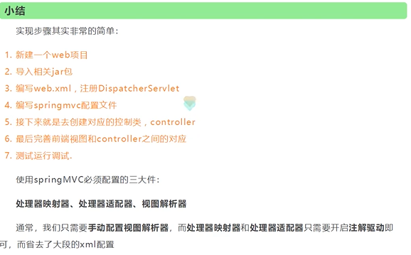
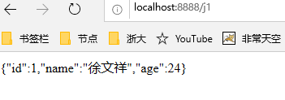
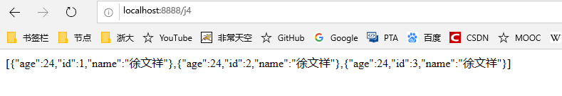

# SpringMVC


## 什么是SpirngMVC？

### 简单定义

- Spring MVC是SpringFrameWork的一部分，是基于Java实现的MVC的轻量级web框架。

- 基于Servlet API构建的原始Web框架，从一开始就已包含在Spring框架中
- 围绕一个中心的DispatcherServlet设计的，它将请求发送给处理程序，具有可配置的处理程序映射、视图解析、区域设置、时区和主题解析以及对上载文件的支持。
- 默认处理程序基于@Controller和@RequestMapping注解
- 将请求发送给控制器，并提供其他有助于web应用程序开发的功能。然而，Spring的DispatcherServlet所做的不仅仅是这些。它与Spring IoC容器完全集成，因此允许您使用Spring的所有其他特性。


> 通过策略接口，Spring 框架是高度可配置的，而且包含多种视图技术，例如 [JavaServer Pages](https://baike.baidu.com/item/JavaServer Pages)（JSP）技术、[Velocity](https://baike.baidu.com/item/Velocity)、[Tiles](https://baike.baidu.com/item/Tiles)、[iText](https://baike.baidu.com/item/iText)和POI。Spring MVC 框架并不知道使用的视图，所以不会强迫开发者只使用 JSP 技术。Spring MVC 分离了控制器、模型对象、过滤器以及处理程序对象的角色，这种分离让它们更容易进行定制。
>
> ——百度百科

官方文档：https://docs.spring.io/spring/docs/4.3.27.RELEASE/spring-framework-reference/htmlsingle/#spring-web（打开快）

最新版文档（截止20200618）：https://docs.spring.io/spring/docs/5.2.7.RELEASE/spring-framework-reference/web.html#spring-web

### 为什么要学SpringMVC?

- 轻量级，简单易学
- 高效，基于请求响应的MVC框架
- 无缝结合Spring
- 约定大于配置
- 功能强大：RESTful、数据验证、格式化、本地化、主题
- 简单灵活


### SpringWebMVC中Dispatcherservlet的请求处理工作流


## Servlet

### HelloSpringMVC

1、新建一个模块，添加web支持

放在项目上，右键增加模块


2、确定导入了SpringMVC的依赖

3、配置web.xml，注册DispatchServlet

tomcat7 web.xml头文件（版本号是3.0，tomcat 9版本号是4.0，tomcat 8版本号是3.1）

```xml
<?xml version="1.0" encoding="UTF-8"?>
<web-app xmlns="http://java.sun.com/xml/ns/javaee"
         xmlns:xsi="http://www.w3.org/2001/XMLSchema-instance"
         xsi:schemaLocation="http://java.sun.com/xml/ns/javaee
                      http://java.sun.com/xml/ns/javaee/web-app_3_0.xsd"
         version="3.0">

</web-app>
```


4、编写SpringMVC配置文件。名称：springmvc-servlet.xml：【servletname】-servlet.xml（官方规定的命名方式）

- 官方头如下：

```xml
<?xml version="1.0" encoding="UTF-8"?>
<beans xmlns="http://www.springframework.org/schema/beans"
       xmlns:xsi="http://www.w3.org/2001/XMLSchema-instance"
       xsi:schemaLocation="http://www.springframework.org/schema/beans 
       http://www.springframework.org/schema/beans/spring-beans.xsd">

</beans>
```


5、添加处理映射器

```xml
<bean class="org.springframework.web.servlet.handler.BeanNameUrlHandlerMapping"/>
```


6、添加处理适配器

```xml
<bean class="org.springframework.web.servlet.mvc.SimpleControllerHandlerAdapter"/>
```


7、添加视图解析器

```xml
<!--视图解析器-->
<bean class="org.springframework.web.servlet.view.InternalResourceViewResolver" id="internalResourceViewResolver">
    <!--前缀-->
    <property name="prefix" value="/WEB-INF/jsp/"/>
    <!--后缀-->
    <property name="suffix" value=".jsp"/>
</bean>
```


8、编写业务操作controller，要么实现Controller接口，要么增加注解；需要返回一个ModleAndView，装数据，封视图

```java
package com.tcmyxc.controller;


import org.springframework.web.servlet.ModelAndView;
import org.springframework.web.servlet.mvc.Controller;

import javax.servlet.http.HttpServletRequest;
import javax.servlet.http.HttpServletResponse;

public class HelloController implements Controller {

    @Override
    public ModelAndView handleRequest(HttpServletRequest httpServletRequest, HttpServletResponse httpServletResponse) throws Exception {
        // 模型和视图
        ModelAndView modelAndView = new ModelAndView();

        // 封装对象，放在 ModelAndView中
        modelAndView.addObject("msg", "HelloSpringMVC");

        // 封装要跳转的视图
        modelAndView.setViewName("hello");

        return modelAndView;
    }
}
```


9、将自己的类交给SpingIOC容器，注册bean

```xml
<!--handler-->
<bean id="/hello" class="com.tcmyxc.controller.HelloController"/>
```


10、写需要跳转的JSP页面，显示数据

```jsp
<%@ page contentType="text/html;charset=UTF-8" language="java" %>
<html>
<head>
    <title>Title</title>
</head>
<body>

<h1>${msg}</h1>
</body>
</html>
```


11、配置tomcat，测试


**可能出现的问题：访问404，排查步骤：**

1. 查看控制台输出是不是少了什么jar包

2. 如果不缺jar包，在IEDA的项目发布中，添加lib依赖

   

3. 重启tomcat

### 简要分析执行流程


1. DispatcherServlet表示前置控制器，是整个SpringMVC的控制中心。用户发出请求，DispatcherServlet接收请求并拦截


### 小结



1、新建一个WEB项目

2、导入相关的jar包

3、编写web.xml，注册DispatcherServlet

4、编写springmvc配置文件

5、创建控制类，controller

6、完善前端视图和controller之间的对应

7、测试


## controller

### `springmvc-servlet.xml`一般配置：

```xml
<?xml version="1.0" encoding="UTF-8"?>
<beans xmlns="http://www.springframework.org/schema/beans"
       xmlns:xsi="http://www.w3.org/2001/XMLSchema-instance"
       xmlns:context="http://www.springframework.org/schema/context"
       xmlns:mvc="http://www.springframework.org/schema/mvc"
       xsi:schemaLocation="http://www.springframework.org/schema/beans
       http://www.springframework.org/schema/beans/spring-beans.xsd
       http://www.springframework.org/schema/context
       https://www.springframework.org/schema/context/spring-context.xsd
       http://www.springframework.org/schema/mvc
       https://www.springframework.org/schema/mvc/spring-mvc.xsd">

   <!--自动扫描包，让包下的注解生效，有IOC容器统一管理-->
   <context:component-scan base-package="com.tcmyxc.controller"/>

   <!--让springMVC不处理静态资源-->
   <mvc:default-servlet-handler/>

   <!--支持MVC注解驱动-->
   <mvc:annotation-driven/>

   <!--视图解析器-->
   <bean class="org.springframework.web.servlet.view.InternalResourceViewResolver" id="internalResourceViewResolver">
      <!--前缀-->
      <property name="prefix" value="/WEB-INF/jsp/"/>
      <!--后缀-->
      <property name="suffix" value=".jsp"/>
   </bean>

</beans>
```

### 实现Controller接口

- 不推荐使用，太麻烦，而且一个controller对应一个bean，太浪费


### 使用注解开发


## RESTful风格

RESTFUL特点包括：

1、每一个URI代表1种资源；

2、客户端使用GET、POST、PUT、DELETE4个表示操作方式的动词对服务端资源进行操作：GET用来获取资源，POST用来新建资源（也可以用于更新资源），PUT用来更新资源，DELETE用来删除资源；

3、通过操作资源的表现形式来操作资源；

4、资源的表现形式是XML或者HTML；

5、客户端与服务端之间的交互在请求之间是无状态的，从客户端到服务端的每个请求都必须包含理解请求所必需的信息。


可以达到URL复用的功能


一般的形式：

```java
// http://localhost:8888/springmvc_04_controller_war_exploded/add?a=1&b=2

@RequestMapping("/add")
public String test(int a, int b, Model model){
    int res = a + b;
    model.addAttribute("msg", "结果是：" + res);

    return "test";
}
```


RESTful形式：

```java
// RESTful风格
// http://localhost:8888/springmvc_04_controller_war_exploded/add2/a/b
// 比如：http://localhost:8888/springmvc_04_controller_war_exploded/add2/3/5

// @RequestMapping(value="/add2/{a}/{b}", method = RequestMethod.GET),这个可以用下面代替
@GetMapping("/add2/{a}/{b}")
public String test2(@PathVariable int a, @PathVariable int b, Model model){
    int res = a + b;
    model.addAttribute("msg", "结果是：" + res);

    return "test";
}

```


`@RequestMapping`的几种简单形式：`@GetMapping`，`@PostMapping`，`@PutMapping`，`@DeleteMapping`


## SpringMVC接收数据

### 前端后端参数名一样的情况

```java
// http://localhost:8888/springmvc_04_controller_war_exploded/user/t1?name=xwx
// 前端和后端参数名完全一样的情况：不用管了，直接可以拿到数据
@RequestMapping("/t1")
public String text(String name, Model model){
    // 1、接收前端参数
    System.out.println("前端参数为：" + name);

    // 2、将结果返回前端
    model.addAttribute("msg", name);

    // 3、跳转视图
    return "test";
}
```


### 前后端参数名不一样

- 加注解（如果错了会给错误信息）

```java
@RequestMapping("/t2")
public String test2(@RequestParam("name") String userName, Model model){
    // 1、接收前端参数
    System.out.println("前端参数为：" + userName);

    // 2、将结果返回前端
    model.addAttribute("msg", userName);

    // 3、跳转视图
    return "test";
}
```


【中文乱码问题】

在web.xml配置一下就好

```xml
<!--解决中文乱码问题-->
<filter>
    <filter-name>encoding</filter-name>
    <filter-class>org.springframework.web.filter.CharacterEncodingFilter</filter-class>
    <init-param>
        <param-name>encoding</param-name>
        <param-value>utf-8</param-value>
    </init-param>
</filter>
<filter-mapping>
    <filter-name>encoding</filter-name>
    <url-pattern>/</url-pattern>
</filter-mapping>
```


如果还不行，把tomcat的server.xml文件修改一下：

```xml
<Connector port="8888" protocol="HTTP/1.1"
               connectionTimeout="20000"
               redirectPort="8443"
               URIEncoding="UTF-8" />
```


但是，这种方式只对`get`方式提交有效，如果是`post`方式提交，你会发现，还是乱码！！！


终极解决方法：

自定义过滤器

```java
package com.tcmyxc.controller;

import java.util.Map;
import javax.servlet.*;
import javax.servlet.http.HttpServletRequest;
import javax.servlet.http.HttpServletRequestWrapper;
import javax.servlet.http.HttpServletResponse;
import java.io.IOException;
import java.io.UnsupportedEncodingException;

/**
 * 解决get和post请求 全部乱码的过滤器
 */

public class GenericEncodingFilter implements Filter {

    @Override
    public void destroy() {
    }

    @Override
    public void doFilter(ServletRequest request, ServletResponse response, FilterChain chain) throws IOException, ServletException {
        //处理response的字符编码
        HttpServletResponse myResponse=(HttpServletResponse) response;
        myResponse.setContentType("text/html;charset=UTF-8");

        // 转型为与协议相关对象
        HttpServletRequest httpServletRequest = (HttpServletRequest) request;
        // 对request包装增强
        HttpServletRequest myrequest = new MyRequest(httpServletRequest);
        chain.doFilter(myrequest, response);
    }

    @Override
    public void init(FilterConfig filterConfig) throws ServletException {
    }
}


//自定义request对象，HttpServletRequest的包装类
class MyRequest extends HttpServletRequestWrapper {

    private HttpServletRequest request;
    //是否编码的标记
    private boolean hasEncode;
    //定义一个可以传入HttpServletRequest对象的构造函数，以便对其进行装饰
    public MyRequest(HttpServletRequest request) {
        super(request);// super必须写
        this.request = request;
    }


    // 对需要增强方法 进行覆盖
    @Override
    public Map getParameterMap() {
        // 先获得请求方式
        String method = request.getMethod();
        if (method.equalsIgnoreCase("post")) {
            // post请求
            try {
                // 处理post乱码
                request.setCharacterEncoding("utf-8");
                return request.getParameterMap();
            } catch (UnsupportedEncodingException e) {
                e.printStackTrace();
            }
        } else if (method.equalsIgnoreCase("get")) {
            // get请求
            Map<String, String[]> parameterMap = request.getParameterMap();
            if (!hasEncode) { // 确保get手动编码逻辑只运行一次
                for (String parameterName : parameterMap.keySet()) {
                    String[] values = parameterMap.get(parameterName);
                    if (values != null) {
                        for (int i = 0; i < values.length; i++) {
                            try {
                                // 处理get乱码
                                values[i] = new String(values[i]
                                        .getBytes("ISO-8859-1"), "utf-8");
                            } catch (UnsupportedEncodingException e) {
                                e.printStackTrace();
                            }
                        }
                    }
                }
                hasEncode = true;
            }
            return parameterMap;
        }
        return super.getParameterMap();
    }


    //取一个值
    @Override
    public String getParameter(String name) {
        Map<String, String[]> parameterMap = getParameterMap();
        String[] values = parameterMap.get(name);
        if (values == null) {
            return null;
        }

        return values[0]; // 取回参数的第一个值
    }


    //取所有值
    @Override
    public String[] getParameterValues(String name) {

        Map<String, String[]> parameterMap = getParameterMap();
        String[] values = parameterMap.get(name);
        return values;
    }
}
```


在web.xml文件中配置过滤器

```xml
<filter>
    <filter-name>encoding</filter-name>
    <filter-class>com.tcmyxc.controller.GenericEncodingFilter</filter-class>
    <init-param>
        <param-name>encoding</param-name>
        <param-value>utf-8</param-value>
    </init-param>
</filter>
<filter-mapping>
    <filter-name>encoding</filter-name>
    <!--
  下面是 /* 代表处理所有的请求，
  / 代表处理部分请求

  /* 才是真正意义上的过滤所有请求
  / 过滤除jsp页面之外的请求，也就是不对jsp页面的代码进行处理
  -->
    <url-pattern>/*</url-pattern>
</filter-mapping>
```


### 前端接收的是一个对象

```java
// 前端传的是一个对象，会匹配user对象中的字段名，否则就匹配不到，该字段为null，前端给的顺序是无所谓的
/*
* 输入示例：http://localhost:8888/springmvc_04_controller_war_exploded/user/t3?id=1&age=90&name=user
* 输出：前端参数为：User{id=1, name='user', age=90}
*
* 输入：http://localhost:8888/springmvc_04_controller_war_exploded/user/t3?id=1&age=90&username=user
* 输出：前端参数为：User{id=1, name='null', age=90}
* */
@GetMapping("/t3")
public String test3(User user){
    System.out.println("前端参数为：" + user);

    return "test";
}
```


## 前后端分离

后端部署后端，提供接口

前端独立部署，负责渲染页面

### 后端返回json数据

- Jackson，阿里的fastjson等

#### Jackson

1、导入依赖

```xml
<!-- https://mvnrepository.com/artifact/com.fasterxml.jackson.core/jackson-databind -->
<dependency>
    <groupId>com.fasterxml.jackson.core</groupId>
    <artifactId>jackson-databind</artifactId>
    <version>2.11.0</version>
</dependency>
```


2、测试

```java
@Controller
public class UserController {

    @RequestMapping("/j1")
    @ResponseBody  // 加了这个注解，就不会走视图解析器，会直接返回一个字符串
    public String json1() throws JsonProcessingException {

        // 创建一个对象
        User user = new User(1, "徐文祥", 24);

        // jackson ObjectMapper
        ObjectMapper mapper = new ObjectMapper();
        String str = mapper.writeValueAsString(user);

        return str;
    }
}
```


测试截图：


【如果出现中文乱码】

1、原始思路

```java
@RequestMapping(path = "/j1", produces = "application/json;charset=utf-8")
```


2、SpringMVC的做法

在`spingmvc-servlet.xml`配置文件中添加Jackson的有关配置：

```xml
<!--JSON乱码问题-->
<mvc:annotation-driven>
    <mvc:message-converters register-defaults="true">
        <bean class="org.springframework.http.converter.StringHttpMessageConverter">
            <constructor-arg value="UTF-8"/>
        </bean>
        <bean class="org.springframework.http.converter.json.MappingJackson2HttpMessageConverter">
            <property name="objectMapper">
                <bean class="org.springframework.http.converter.json.Jackson2ObjectMapperFactoryBean">
                    <property name="failOnEmptyBeans" value="false"/>
                </bean>
            </property>
        </bean>
    </mvc:message-converters>
</mvc:annotation-driven>
```



一些技巧：

- `@RestController`注解如果加在类上，那么这个类返回的结果全部是字符串

- `@RestController`等于`@Controller`加`@ResponseBody`，两者不能同时用


### 显示时间

#### 原始方式——自定义时间格式

```java
@RequestMapping(path = "/j3")
public String json3() throws JsonProcessingException {

    // jackson ObjectMapper
    ObjectMapper mapper = new ObjectMapper();
    Date date = new Date();

    // 自定义时间格式
    SimpleDateFormat sdf = new SimpleDateFormat("yyyy-MM-dd HH:mm:ss");


    // 返回的是时间戳：Timestamp
    String str = mapper.writeValueAsString(sdf.format(date));

    return str;
}
```


#### Jackson方式

```java
@RequestMapping(path = "/j3")
public String json3() throws JsonProcessingException {

    // jackson ObjectMapper
    ObjectMapper mapper = new ObjectMapper();

    //不使用时间戳的格式
    mapper.configure(SerializationFeature.WRITE_DATE_KEYS_AS_TIMESTAMPS, false);
    Date date = new Date();

    // 自定义时间格式
    SimpleDateFormat sdf = new SimpleDateFormat("yyyy-MM-dd HH:mm:ss");
    mapper.setDateFormat(sdf);

    // 返回的是时间戳：Timestamp
    //        String str = mapper.writeValueAsString(sdf.format(date));

    String str = mapper.writeValueAsString(date);

    return str;
}
```


效果相同的


### 封装工具类

```java
package com.tcmyxc.util;

import com.fasterxml.jackson.core.JsonProcessingException;
import com.fasterxml.jackson.databind.ObjectMapper;
import com.fasterxml.jackson.databind.SerializationFeature;

import java.text.SimpleDateFormat;

public class JsonUtil {

    // 重载，如果传入的不是一个Date对象，那么设置时间格式对其没有影响，如果是Date对象，那就能起作用
    public static String getJson(Object object) throws JsonProcessingException {
        return getJson(object, "yyyy-MM-dd HH:mm:ss");
    }

    public static String getJson(Object object, String dateFormat) throws JsonProcessingException {
        ObjectMapper mapper = new ObjectMapper();
        mapper.configure(SerializationFeature.WRITE_DATE_KEYS_AS_TIMESTAMPS, false);// 禁用时间戳
        SimpleDateFormat sdf = new SimpleDateFormat(dateFormat);// 自定义时间格式
        mapper.setDateFormat(sdf);
        return mapper.writeValueAsString(object);
    }
}
```


调用：

```java
@RequestMapping(path = "/j2")
public String json2() throws JsonProcessingException {

    User user1 = new User(1, "徐文祥", 24);
    User user2 = new User(2, "徐文祥", 24);
    User user3 = new User(3, "徐文祥", 24);

    List<User> userList = new ArrayList<User>();
    userList.add(user1);
    userList.add(user2);
    userList.add(user3);

    return JsonUtil.getJson(userList);
}

@RequestMapping(path = "/j3")
public String json3() throws JsonProcessingException {
    return JsonUtil.getJson(new Date());
}
```


了解思想即可，注意方法重载是可以互相调用的。

### fastjson

- 一个 Java 库，可以将 Java 对象转换为 JSON 格式，也可以将 JSON 字符串转换为 Java 对象。
- toJSONString方法即可将对象转换成 JSON 字符串
- parseObject 方法则反过来将 JSON 字符串转换成对象


```xml
<!-- https://mvnrepository.com/artifact/com.alibaba/fastjson -->
<dependency>
    <groupId>com.alibaba</groupId>
    <artifactId>fastjson</artifactId>
    <version>1.2.68</version>
</dependency>
```


```java
@RequestMapping(path = "/j4")
public String json4() throws JsonProcessingException {

    User user1 = new User(1, "徐文祥", 24);
    User user2 = new User(2, "徐文祥", 24);
    User user3 = new User(3, "徐文祥", 24);

    List<User> userList = new ArrayList<User>();
    userList.add(user1);
    userList.add(user2);
    userList.add(user3);

    String string = JSON.toJSONString(userList);

    return string;
}
```




公司让用哪个就用那个

# SSM整合

## 前期准备

### 数据库

```mysql
CREATE DATABASE ssmbuild;
USE ssmbuild;
CREATE TABLE `books`(
`bookID` INT NOT NULL AUTO_INCREMENT COMMENT '书id',
`bookName` VARCHAR(100) NOT NULL COMMENT '书名',
`bookCounts` INT NOT NULL COMMENT '数量',
`detail` VARCHAR(200) NOT NULL COMMENT '描述',
KEY `bookID`(`bookID`)
)ENGINE=INNODB DEFAULT CHARSET=utf8;

INSERT INTO `books`(`bookID`,`bookName`,`bookCounts`,`detail`)VALUES
(1,'Java',1,'从入门到放弃'),
(2,'MySQL',10,'从删库到跑路'),
(3,'Linux',5,'从进门到进牢');
```


### 新建一个maven项目


【注意】c3p0连接池警告解决方法：

```xml
<bean id="dataSource" class="com.mchange.v2.c3p0.ComboPooledDataSource">
    <property name="driverClass" value="${jdbc.driver}"/>
    <property name="jdbcUrl" value="${jdbc.url}"/>
    <property name="user" value="${jdbc.username}"/>
    <property name="password" value="${jdbc.password}"/>

    <!--c3p0的私有属性-->
    <property name="maxPoolSize" value="30"/>
    <property name="minPoolSize" value="10"/>
    <!--下面这句话可以显式配置，如果不配置，也会默认帮我们做，
      因为c3p0默认是3个，但是我们最小配了10个，所有会覆盖默认配置，
      如果不配，会报一个警告：Bad pool size config, start 3 < min 10. Using 10 as start.
      其实没啥影响
      -->
    <property name="initialPoolSize" value="10"/>
    <!--关闭连接不自动commit-->
    <property name="autoCommitOnClose" value="false"/>
    <!--获取连接超时时间-->
    <property name="checkoutTimeout" value="10000"/>
    <!--连接失败后的重试次数-->
    <property name="acquireRetryAttempts" value="2"/>
</bean>
```


