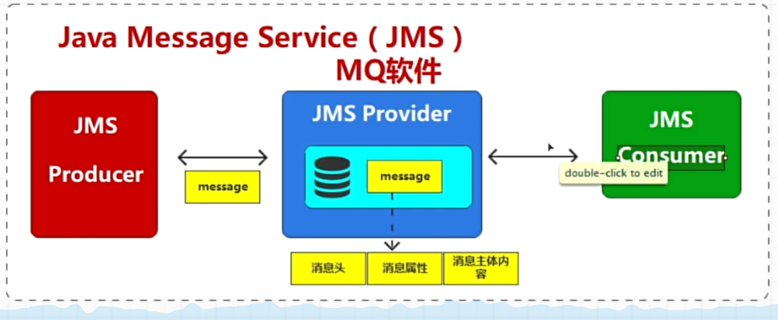

## Java Message Service

Java消息服务（Java Message Service），简称JMS，是一个面向消息中间件的API，用于在两个应用程序之间，或分布式系统中发送消息，进行异步通信。

JMS支持两种消息发送模型

1. 点对点模型（P2P模型）：消息只能被消费一次
2. 发布订阅模型（PS模型）：引入了topic的概念，生产者向指定的topic发布数据，消费者订阅自己感兴趣的topic

参考资料：

1. https://www.oracle.com/java/technologies/java-message-service.html
2. https://jcp.org/en/jsr/detail?id=343
3. https://baike.baidu.com/item/Java%E6%B6%88%E6%81%AF%E6%9C%8D%E5%8A%A1/9084827?fr=ge_ala