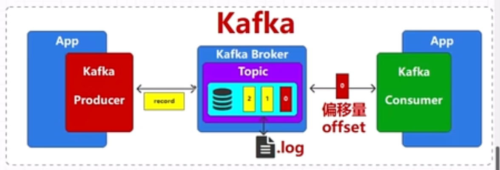
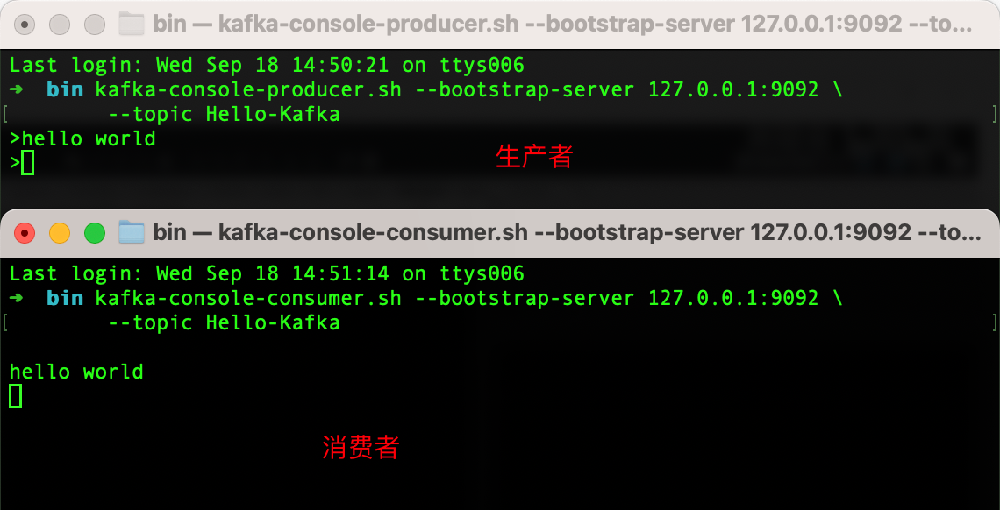
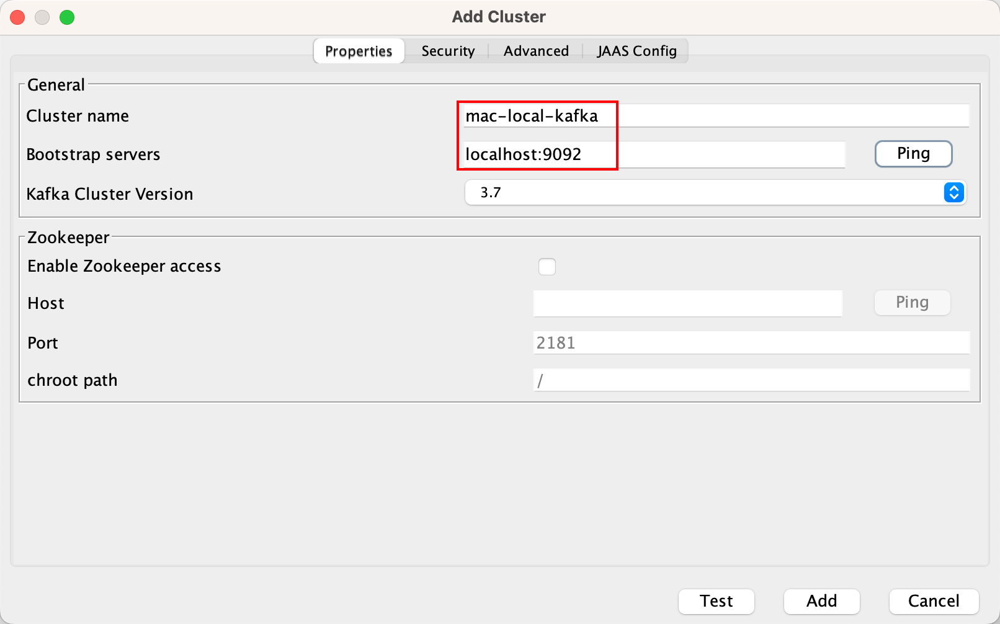
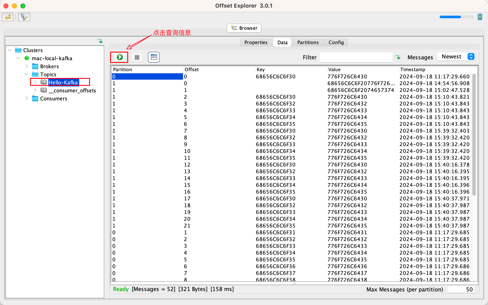
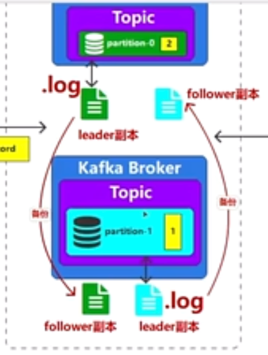

# Kfaka学习



## 1、简介

- 消息队列
- 一般是临时存储消息
- 数据存储是K，V键值对的形式


消息队列的应用场景：

1. 异步处理
2. 业务解耦


## 2、安装

下载地址：https://kafka.apache.org/downloads


文件目录

```tex
├── bin  # 各种脚本
├── config  # 配置文件目录
├── libs
├── licenses
└── site-docs
```

### 启动ZK

kafka 的启动依赖 zookeeper，需要预先启动，可以启动 Kafka 内置的 zookeeper，也可以启动自己安装的：

```bash
# 在自己zk的目录启动
bin/zkServer.sh start

# 启动内置zk，如果是windows环境，需要改`config/zookeeper.properties`里面的dataDir
bin/zookeeper-server-start.sh config/zookeeper.properties
```


### 启动kafka

启动单节点 kafka 用于测试：

```bash
bin/kafka-server-start.sh config/server.properties
```


### 验证

可以使用`JPS`查看进程

```tex
➜  ~ jps
43818 QuorumPeerMain  # zookeeper
16172 Kafka  # kafka
```


## 3、命令行使用

### 3.1 创建topic

使用bin目录下的kafka-topics.sh来创建topic

```bash
# 创建测试主题
bin/kafka-topics.sh --bootstrap-server 127.0.0.1:9092 \
                    --topic Hello-Kafka \
                    --create

# 查看所有主题
bin/kafka-topics.sh --bootstrap-server 127.0.0.1:9092 --list

# 查看具体的主题信息
bin/kafka-topics.sh --bootstrap-server 127.0.0.1:9092 \
	--topic Hello-Kafka \
	--describe 

# 修改分区数量
bin/kafka-topics.sh --bootstrap-server 127.0.0.1:9092 \
	--topic Hello-Kafka \
	--alter --partitions 2
```


### 3.2 生产、消费消息

`kafka-console-consumer.sh`和`kafka-console-producer.sh`

```bash
# 生产者客户端连接kafka
bin/kafka-console-producer.sh --bootstrap-server 127.0.0.1:9092 \
	--topic Hello-Kafka
	
# 消费者客户端连接kafka
bin/kafka-console-consumer.sh --bootstrap-server 127.0.0.1:9092 \
	--topic Hello-Kafka
```




### 3.3 图形化查看消息

> 查看消息的图像化工具：https://www.kafkatool.com/download.html

（1）配置



（2）查询




## 4、SpringBoot使用

### 4.1 依赖

```xml
<dependency>
    <groupId>org.apache.kafka</groupId>
    <artifactId>kafka-clients</artifactId>
    <version>3.8.0</version>
</dependency>
```


### 4.2 生产者

```java
public class SimpleProducer {

    public static void main(String[] args) throws ExecutionException, InterruptedException {

        String topicName = "Hello-Kafka";

        Properties props = new Properties();
        // props.put("bootstrap.servers", "127.0.0.1:9092");
        // props.put("key.serializer", "org.apache.kafka.common.serialization.StringSerializer");
        // props.put("value.serializer", "org.apache.kafka.common.serialization.StringSerializer");

        // 上面的k、v太难记，可以这么写
        props.put(ProducerConfig.BOOTSTRAP_SERVERS_CONFIG, "localhost:9092");// 可以配置多个地址，逗号分隔
        // 配置序列化
        props.put(ProducerConfig.KEY_SERIALIZER_CLASS_CONFIG, StringSerializer.class.getName());
        props.put(ProducerConfig.VALUE_SERIALIZER_CLASS_CONFIG, StringSerializer.class.getName());
        // 1、创建生产者
        Producer<String, String> producer = new KafkaProducer<>(props);


        for (int i = 0; i < 10; i++) {
            // 2、创建消息（K、V类型）
            // 参数1：主题；参数2：key；参数3：value
            ProducerRecord<String, String> record = new ProducerRecord<>(topicName, "hello" + i, "world" + i);

            // 3、发送数据
            producer.send(record);// 可以在同名的重载函数中设置回调函数
        }
        // 4、关闭生产者
        producer.close();
    }
}
```


异步发送消息

```java
producer.send(record, new Callback() {
                @Override
                public void onCompletion(RecordMetadata metadata, Exception exception) {
                    if(exception != null) {
                        exception.printStackTrace();
                    }
                    else {
                        System.out.println(metadata.topic() + ":" + metadata.partition() + ":" + metadata.offset());
                    }
                }
            });
```


### 4.3 消费者

```java
public class SimpleConsumer {
    public static void main(String[] args) {
        String topicName = "Hello-Kafka";

        Properties props = new Properties();
        // 上面的k、v太难记，可以这么写
        props.put(ConsumerConfig.BOOTSTRAP_SERVERS_CONFIG, "localhost:9092");
        // 配置反序列化
        props.put(ConsumerConfig.KEY_DESERIALIZER_CLASS_CONFIG, StringDeserializer.class.getName());
        props.put(ConsumerConfig.VALUE_DESERIALIZER_CLASS_CONFIG, StringDeserializer.class.getName());
        // 消费者需要额外配置 group id，指明自己属于哪个分组
        props.put(ConsumerConfig.GROUP_ID_CONFIG, "test-consumer");
        // 1、创建消费者
        Consumer<String, String> consumer = new KafkaConsumer<>(props);

        // 2、订阅主题
        consumer.subscribe(Collections.singleton(topicName));

        // 3、主动拉取数据
        while (true) {// 多次拉取数据
            // poll方法是批量拉取数据，更高效
            ConsumerRecords<String, String> records = consumer.poll(100);
            for (ConsumerRecord<String, String> record : records) {
                System.out.println(record);
            }
        }
        
        // 4、关闭消费者
        // consumer.close();

    }
}
```


## 5、特点

- 选举使用的是zk
- 元数据也在zk上存放
- broker本身是无状态的，它们通过zk来维护整个集群的状态
- 一个broker每秒可以处理十多万读写请求
- 每个broker可以处理TB级别的消息而不影响性能
- 一个主题可以有多个分区；每个分区的位置可以是随意的，不在一台机器上
- 为了数据的可靠性，需要对数据进行备份，kafka中将其称之为副本。
    - 多个副本只有一个可以读写（leader副本），其他的都是冗余备份（follower副本）
    - 副本一般放在其它broker

- 消费者组具有容错性、可拓展性
    - 一个组里面可以有多个消费者，但是具有唯一的消费者组ID（group id）
    - 组内的消费者共同消费一个topic下的所有数据

- 主题中的数据是不能修改的




## 分区

Kafka 有着默认的分区机制：

- 如果指定了分区，则用指定的
- 如果没指定
	- 如果键值为 null， 则使用轮询 (Round Robin) 算法将消息均衡地分布到各个分区上；
	- 如果键值不为 null，那么 Kafka 会使用内置的散列算法对键进行散列，然后分布到各个分区上（1.1.1版本的逻辑是这样的）；

