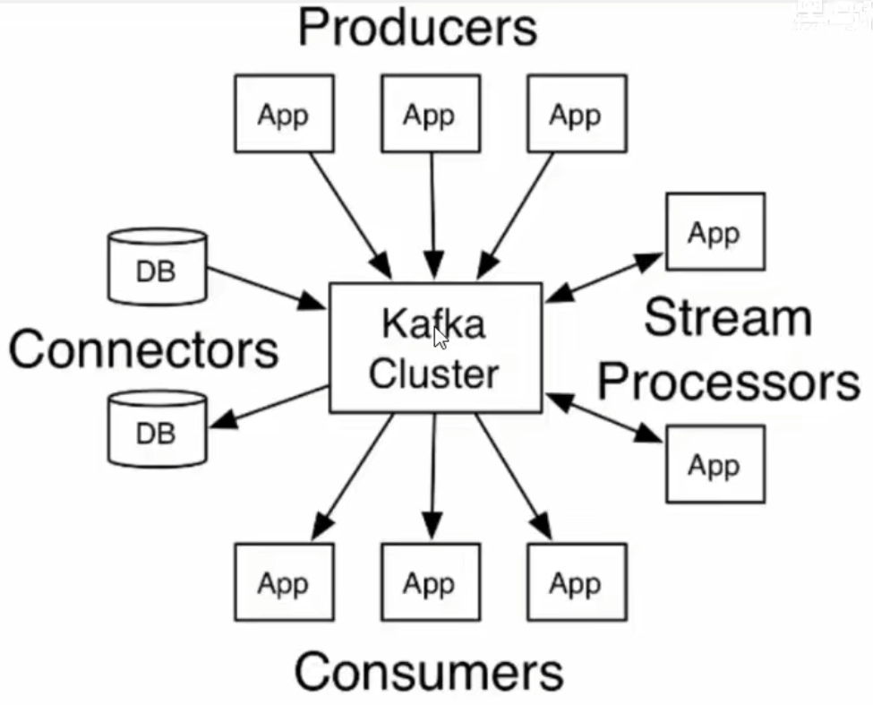

## 简介

Kafka最初是由Linkedln公司采用Scala语言开发的一个多分区、多副本并且基于ZooKeeper协调的分布式消息系统，现在已经捐献给了Apache基金会。目前Kafka已经定位为一个分布式流式处理平台，它以高吞吐、可持久化、可水平扩展、支持流处理等多种特性而被广泛应用。

Apache Kafka是一个分布式的发布-订阅消息系统，能够支撑海量数据的数据传递。在离线和实时的消息处理业务系统中，Kafka都有广泛的应用。Kafka将消息持久化到磁盘中，并对消息创建了备份保证了数据的安全。Kafka在保证了较高的处理速度的同时，又能保证数据处理的低延迟和数据的零丢失。

## 特性

- 高吞吐量、低延迟：kafka每秒可以处理几十万条消息，它的延迟最低只有几毫秒，每个主题可以分多个分区，消费组对分区进行消费操作
- 高并发：支持数千个客户端同时读写
- 高容错性：允许集群中节点失败（若副本数量为n,则允许n-1个节点失败)
- 高度可扩展性：kafka集群支持热扩展
- 持久性、可靠性：消息被持久化到本地磁盘，并且支持数据备份防止数据丢失

## 使用场景

1. 日志收集：一个公司可以用Kafka可以收集各种服务的log，通过kafka以统一接口服务的方式开放给各种consumer，例如Hadoop、 Hbase、Solr等;
2. 消息系统：解耦和生产者和消费者、缓存消息等;
3. 用户活动跟踪: Kafka经常被用来记录web用户或者app用户的各种活动，如浏览网页、搜索、点击等活动,这些活动信息被各个服务器发布到kafka的topic中，然后订阅者通过订阅这些topic来做实时的监控分析或者装载到Hadoop、数据仓库中做离线分析和挖掘;
4. 运营指标：Kafka也经常用来记录运营监控数据。包括收集各种分布式应用的数据，生产各种操作的集中反馈，比如报警和报告;
5. 流式处理:比如spark streaming和storm

## 技术优势

- 可伸缩性: （1）Kafka集群在运行期间可以轻松地扩展或收缩（可以添加或删除代理），而不会宕机。（2）可以扩展一个Kafka主题来包含更多的分区。由于一个分区无法扩展到多个代理，所以它的容量受到代理磁盘空间的限制。能够增加分区和代理的数量意味着单个主题可以存储的数据量是没有限制的。
- 容错性和可靠性：Kafka的设计方式使某个代理的故障能够被集群中的其他代理检测到。由于每个主题都可以在多个代理上复制，所以集群可以在不中断服务的情况下从此类故障中恢复并继续运行。
- 吞吐量：代理能够以超快的速度有效地存储和检索数据。

> 术语：
>
> - 代理：broker
> - 主题：topic
