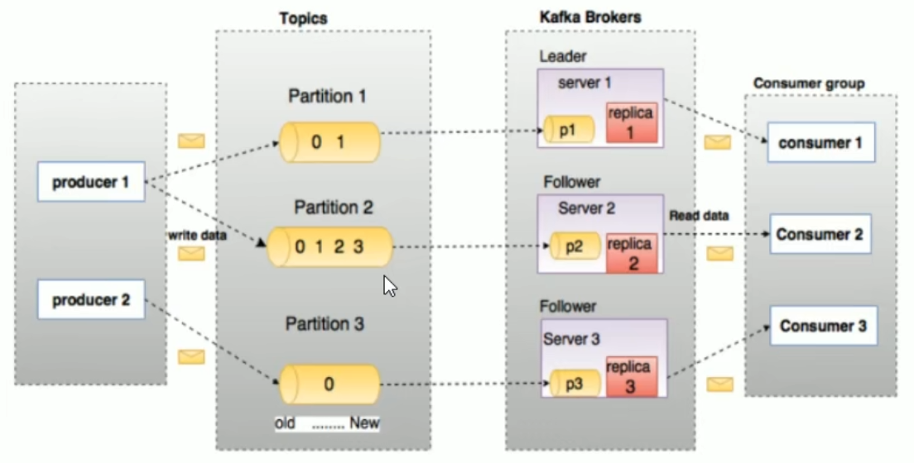

## 概念详解

### producer

消息生产者：该角色将消息发布到Kafka的topic中。broker接收到生产者发送的消息后，broker将该消息**追加**到当前用于追加数据的segment文件中。生产者发送的消息，存储到一个partition中，生产者也可以指定数据存储的partition。

### consumer

消费者，从broker中读取数据。消费者可以消费多个topic中的数据。

### topic

主题：在Kafka中，使用一个属性来划分数据的所属类别，划分数据的这个类别称为topic。如果把Kafka看做为一个数据库，topic可以理解为数据库中的一张表，topic的名字即为表名。

### partition

分区：topic中的数据分割为一个或多个partition。每个topic至少有一个partition。每个partition中的数据使用多个segment文件存储。partition中的数据是有序的，partition间的数据丢失了数据的顺序（分区内有序，分区间无序）。如果topic有多个partition，消费数据时就不能保证数据的顺序。在需要严格保证消息的消费顺序的场景下，需要将partition数目设为1。

#### Partition offset

每条消息都有一个当前Partition下唯一的64字节的offset，它指明了这条消息的起始位置。

#### Replicas of partition

分区副本：副本是一个分区的备份。副本不会被消费者消费，副本只用于防止数据丢失，即消费者不从为follower的partition中消费数据，而是从为leader的partition中读取数据。副本之间是一主多从的关系。

#### Leader

每个partition有多个副本，其中有且仅有一个作为Leader，Leader是当前负责数据的读写的partition。

#### Follower

Follower跟随Leader，所有写请求都通过Leader路由，数据变更会广播给所有Follower，Follower与Leader保持数据同步。如果Leader失效，则从Follower中选举出一个新的Leader。当Follower与Leader挂掉、卡住或者同步太慢，leader会把这个follower从"in sync replicas”(ISR）列表中删除，重新创建一个Follower。

#### AR(Assigned Replicas)

分区中所有的副本统称为AR。

#### ISR(In-Sync Replicas)

所有与Leader部分保持同步的副本(包括Leader副本在内）组成lSR。

#### OSR(Out-of-Sync-Replicas)

与Leader副本同步滞后过多的副本。

#### HW(High Watermark)

高水位，标识了一个特定的offset，消费者只能拉取到这个offset之前的消息。

#### LEO(Log End Offset)

日志末端位移(log end offset)，记录了该副本底层日志(log)中下一条消息的位移值。注意是下一条消息，也就是说，如果LEO=10，那么表示该副本保存了10条消息，位移值范围是[0,9]。

### broker

Kafka 集群包含一个或多个服务器，服务器节点称为broker。broker存储topic的数据。

- 如果某topic有N个partition，集群有N个broker，那么每个broker存储该topic的一个partition。
- 如果某topic有N个partition，集群有(N+M)个broker，那么其中有N个broker存储该topic的一个partition，剩下的M个broker不存储该topic的partition数据。
- 如果某topic有N个partition，集群中broker数目少于N个，那么一个broker存储该topic的一个或多个partition。在实际生产环境中，尽量避免这种情况的发生，这种情况容易导致Kafka集群数据不均衡

