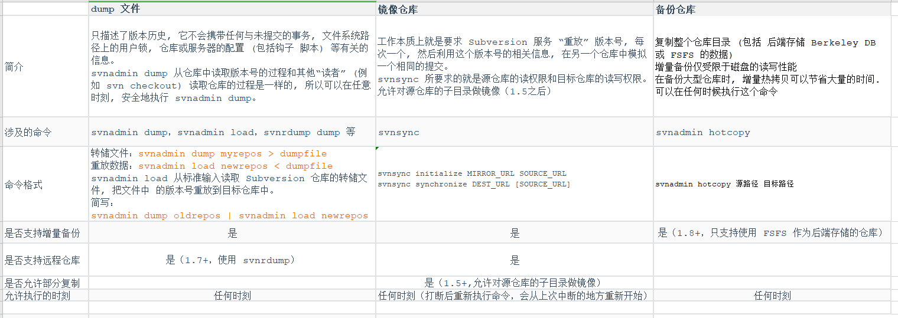
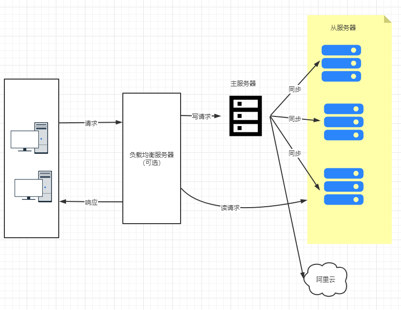

# SVN 集群方案

关于数据备份，官方给了三种方案

（1）dump 文件（ svnadmin dump等命令）

（2）镜像仓库（ svnsync 命令）

（3）备份仓库（ svnadmin hotcopy 命令）

比较

第一种 svnadmin dump 是官方推荐的备份方式；版本数比较小的情况下比较合适使用

优点：比较灵活，可以全量备份也可以增量备份，并提供了版本恢复机制。

缺点：如果版本比较大，如版本数增长到数万、数十万，那么dump的过程将非常慢；备份耗时，恢复更耗时；不利于快速进行灾难恢复。

第二种 svnadmin hotcopy

优点：备份过程较快，灾难恢复也很快；如果备份机上已经搭建了 svn 服务，甚至不需要恢复，只需要进行简单配置即可切换到备份库上工作。

缺点是：比较耗费硬盘，需要有较大的硬盘支持； 目标仓库的 UUID 和源仓库的 UUID 必须 完全相同 

第三种 svnsync 实际上是制作了个镜像库，当一个坏了的时候，可以迅速切换到另一个

特点： 只要求对源仓库具有读取权限, 不会试图去修改源仓库的任何数据 

优点：当制作成镜像库的时候起到双机实时备份的作用；当然也支持多个镜像库

 缺点：当作为镜像库使用时，没办法做到“想完全抛弃今天的修改恢复到昨晚的样子”；而当作为普通备份机制每日备份时，操作又较前2种方法麻烦。     

思路：

- 使用  svnsync 搭建集群，配置合理的话可以做到近乎实时同步
- 使用 svnadmin hotcopy 做灾难恢复，每天晚上备份一次

