# SVN学习笔记

[toc]

# 一、基本概念

## 1.1 概述

  

 开源的版本控制系統

官网：https://subversion.apache.org/


SVN 的一些概念

- **repository（源代码库）:**源代码统一存放的地方
- **Checkout（提取）:**当你手上没有源代码的时候，你需要从repository checkout一份
- **Commit（提交）:**当你已经修改了代码，你就需要Commit到repository
- **Update (更新):**当你已经Checkout了一份源代码， Update一下你就可以和Repository上的源代码同步，你手上的代码就会有最新的变更

 SVN管理源代码是以行为单位的，就是说两个程序员只要不是修改了同一行程序，SVN都会自动合并两种修改。如果是同一行，SVN 会提示文件 Conflict, 冲突，需要手动确认。 


## 架构

Subversion 的架构

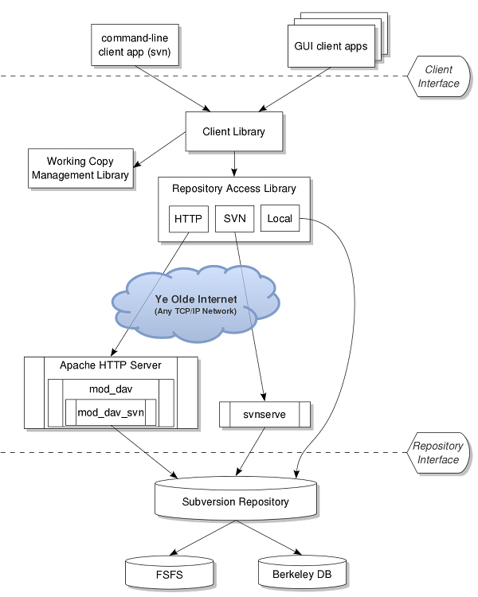

## 组件

svn：客户端命令行工具

svnversion：用于报告工作副本状态 (就项目的版本号而言) 的工具

svnlook：可以直接检查仓库的工具

svnadmin：用于创建, 调整或修复 Subversion 仓库的工具

mod_dav_svn：可插拔的 Apache HTTP 服务器模块, 该模块允许用户通过网络访问 仓库

svnserve：一个定制的, 可独立运行的服务器程序, 可以以守护进程方式运行, 也可以被 SSH 调用, 这是另一种允许用户通过网络访问仓库的方法

svndumpfilter：过滤 Subversion 仓库转储数据流的程序

svnsync：可以跨越网络对仓库进行增量镜像备份的程序

svnrdump：可以跨越网络对仓库历史进行转储和加载的程序

svnmucc：该工具支持在没有工作副本的情况下, 在一个单独的提交中对多个 仓库执行基于 URL 的操作

## 本地仓库结构推荐

推荐每个仓库下有三个目录：`branches`, `tags` 和 `trunk`. 

目录 `trunk` 应该 包含了项目的所有数据, 而 `branches` 和 `tags` 则是空目录 

## 1.2 选择 LTS 版本

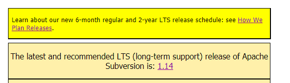


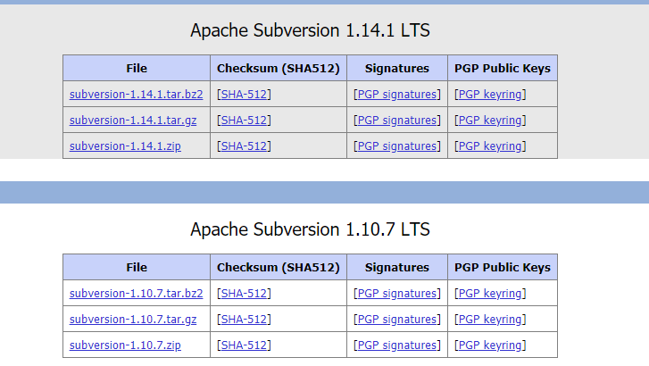

官方说推荐 1.14，咱们就用这个的最新版 1.14.1

# 二、从源代码编译安装SVN

> 查询所需要的包：https://packages.ubuntu.com/source/bionic/lz4
>
> 这个网站吧，不是特别好，如果软件官网有，就去官网下，实在不行，上这个找找


安装参考文章

- https://www.cnblogs.com/qingfengfumian/p/7986907.html


官方安装说明（这部分源码文件下的 `INSTALL` 里面有，我只是搬运工）：

- 必需的构建工具：
    - autoconf 2.59+
    - libtool 1.4+
    -  C 编译器
- 必须安装的第三方依赖：
	* libapr and libapr-util 1.4+
	* SQLite  3.8.2+
	* libz
	* utf8proc
- 可选依赖（客户端和服务端）
    - OpenSSL (必须装，不然不能使用 http 协议)
    - Netwide Assembler
    - libsasl
    - Apache httpd server（这个我认为是必须安装的，因为管理软件需要部署在这个服务器上）
    -  pkg-config

- 客户端可选依赖：
  - Apache Serf 1.3.4+（必须安装，不然无法处理 http 请求，很致命）
  - KDE Framework 5, libsecret, GNOME Keyring

## 2.1 详细安装过程

所有的命令，默认是 `root` 权限，大部分参考官方安装说明，参考文献如下：

- 源码文件下的 `INSTALL` 
- https://www.cnblogs.com/qingfengfumian/p/7986907.html（这篇文章是基于 CentOS7 的，但是基本上都对，除了授权部分）
- https://www.zsythink.net/archives/1318

```bash
# 下载 SVN
curl -O https://mirrors.tuna.tsinghua.edu.cn/apache/subversion/subversion-1.14.1.tar.gz

tar -xzf subversion-1.14.1.tar.gz
cd subversion-1.14.1

# 先删除以前安装的（非必要）
rm -f /usr/local/lib/libsvn*
rm -f /usr/local/lib/libapr*
rm -f /usr/local/lib/libserf*

# 可以执行脚本，作用是检查缺少的依赖
./autogen.sh

# 安装缺少的依赖，不同电脑可能不同，我这里只是列举了自己 Ubuntu 系统上缺的，不过我这个应该是最全的了，因为我最开始是在什么软件都没安装的 WSL 上尝试的
apt install g++ -y
apt install gcc
apt install autoconf -y # 2.59+
apt install libtool -y # 1.4+
apt install python -y
apt install python3 -y
apt install make
apt install liblz4-tool
apt install liblz4-dev
apt install libutf8proc-dev -y
apt install scons
apt install unzip
apt install libexpat1-dev
apt install rpm -y

# sudo apt install gcc g++ autoconf libtool python python3 make liblz4-tool liblz4-dev libutf8proc-dev scons unzip libexpat1-dev rpm -y

./configure # 确认配置，查看缺少的依赖

# get-deps.sh 这个官方脚本可以帮我们下载依赖，但是还需要手动安装。运行之后会产生'apr', 'apr-util', 'serf', 'zlib', 'sqlite-amalgamation' 目录，但是所有的软件都可能会下载失败，需要手动下载，我就不推荐使用了

# apr(使用脚本下载的可能会出错)
curl -O https://mirrors.bfsu.edu.cn/apache//apr/apr-1.7.0.tar.gz
tar -xzf apr-1.7.0.tar.gz
mv apr-1.7.0 apr
cd apr
./configure
make && make install # 安装在 /usr/local/apr 目录
cd ..

# apr-util
# 如果提示缺少库，就去网上百度下载
curl -O https://mirrors.bfsu.edu.cn/apache//apr/apr-util-1.6.1.tar.gz 
tar -xzf apr-util-1.6.1.tar.gz
mv apr-util-1.6.1 apr-util
cd apr-util
./configure --with-apr=/usr/local/apr # 指定 apr 目录
make && make install # 目录 /usr/local/apr/lib
cd ..

echo "/usr/local/apr/lib" >> /etc/ld.so.conf
sudo ldconfig -v

# zlib
wget http://www.zlib.net/zlib-1.2.11.tar.gz
tar -xzf zlib-1.2.11.tar.gz
mv zlib-1.2.11 zlib
cd zlib
./configure
make && make install
cd ..

# sqlite（这个看网速，可能下载不成功，我当时没下载成功，就手动下载的最新版）
# 下载巨慢，不成功就多试两次，编译也巨慢
# wget https://www.sqlite.org/2021/sqlite-autoconf-3340100.tar.gz
# tar -xzf sqlite-autoconf-3340100.tar.gz
# cd sqlite-autoconf-3340100
# ./configure
# make && make install
# cd ..
# 新方法，下载编译好的文件 https://www.sqlite.org/2021/sqlite-amalgamation-3340100.zip，然后重命名一下就行，重新看 INSTALL 文件时发现的
# To use an SQLite-provided amalgamation, just drop sqlite3.c into Subversion's sqlite-amalgamation/ directory
wget https://www.sqlite.org/2021/sqlite-amalgamation-3340100.zip
unzip -q sqlite-amalgamation-3340100.zip
mv sqlite-amalgamation-3340100 sqlite-amalgamation

# LZ4 >= r129（这个是安装的时候提示版本太低，手动升级的，具体看情况）
git clone https://codechina.csdn.net/mirrors/lz4/lz4.git
cd lz4
make && make install
cd ..

# openssl（必要，serf 依赖这个） 
wget https://www.openssl.org/source/old/1.0.1/openssl-1.0.1u.tar.gz
tar -zxf openssl-1.0.1u.tar.gz
cd openssl-1.0.1u
./config -fPIC no-gost
make depend
make install # /usr/local/ssl
cd ..

# serf(serf uses SCons 2.3 for its build system)
# 上面安装过 SCons 这个依赖，但是强迫症可以使用 2.3
# 下载链接：wget https://nchc.dl.sourceforge.net/project/scons/scons/2.3.0/scons-2.3.0.tar.gz
# wget https://downloads.apache.org/serf/serf-1.3.9.zip
# 这里建议是 serf-1.3.9.tar.bz2，zip 版本在我最后一次尝试的时候出现了问题
# 可参考：https://www.cnblogs.com/lj2007331/p/3273045.html
wget https://downloads.apache.org/serf/serf-1.3.9.tar.bz2
tar -xjf serf-1.3.9.tar.bz2
cd serf-1.3.9
# PREFIX=/usr/local/serf 是指定了安装路径，方便下文配置
scons APR=/usr/local/apr/bin/apr-1-config APU=/usr/local/apr/bin/apu-1-config OPENSSL=/usr/local/ssl PREFIX=/usr/local/serf
scons install
cd ..
```


这里可能出现的错误的解决方法

https://blog.csdn.net/yangyouchang/article/details/104675366?utm_medium=distribute.pc_relevant.none-task-blog-searchFromBaidu-11.control&dist_request_id=&depth_1-utm_source=distribute.pc_relevant.none-task-blog-searchFromBaidu-11.control

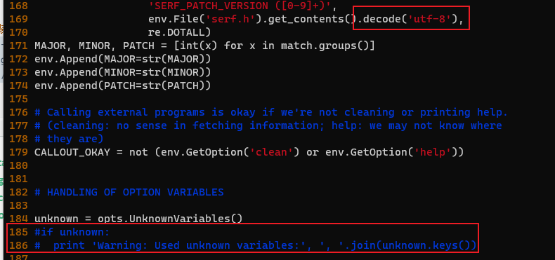


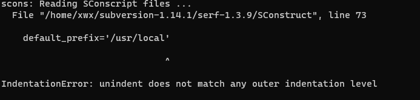

这个错误则是代码没对齐（python 语法问题，脚本本身的错误）

## 2.2 安装 Apache httpd 2.x

参考文献

- https://group.cnblogs.com/topic/91864.html

可选服务器：内置的 svnserve 和 Apache，具体优劣可以参见官网：http://svnbook.red-bean.com/nightly/zh/svn.serverconfig.overview.html

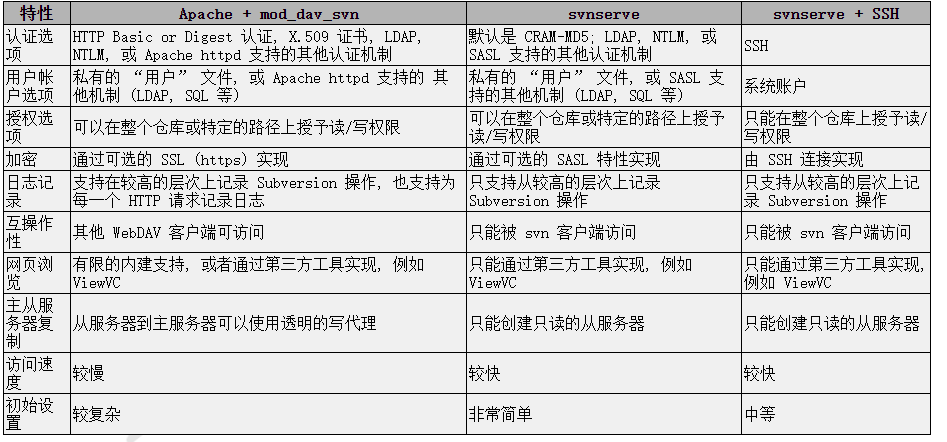

服务器选择：http://svnbook.red-bean.com/nightly/zh/svn.serverconfig.choosing.html

 使用 Apache 作为 Subversion 服务器的一大好处是它可以用来实现简单的 副本备份. 比如说, 你的团队分布在全球的四个办公室内, 而 Subversion 仓库只能放在其中一个办公室中, 这就意味着其他三个办公室将享受不到好 的访问体验—当他们更新和提交代码时, 看到的很可能是缓慢的响应 时间. 

对于这种问题, 最有效的解决方案是搭建一套系统, 该系统由一个 Apache *主* (*master*) 服务器与若干个 *从* (*slave*) 服务器组成. 如果在每一个办公室都放置 一个从服务器, 当用户检出工作副本时, 将从最近的服务器上检出—所 有的读操作都在本地的从服务器上完成, 写操作将被自动路由到主服务器. 当提交完成时, 主服务器自动地使用备份工具 *svnsync*, 把新版本号 “推送” 给其他所有的从服务器. 

副本策略不能抵抗服务器或网络崩溃的情况. 举例来说, 如果 其中一个 *svnsync* 由于某种原因失败了, 那么从 服务器就会悄无声息的失败, 即使有用户声称他们已经提交了版本号 100, 但是后面执行 *svn update* 时, 本地从服务器将告诉 他们版本号 100 并不存在! 当然, 如果又有新的提交发生, 并且随后的 *svnsync* 都执行成功了, 那么问题就会被自动地修复 —*svnsync* 会复制所以未复制的版本号. 

配置：http://svnbook.red-bean.com/nightly/zh/svn-book.html#svn.serverconfig（直写代理部分）


### 安装前置依赖

```bash
wget https://ftp.pcre.org/pub/pcre/pcre-8.44.tar.gz
tar -xzf pcre-8.44.tar.gz
cd pcre-8.44
./configure
make && make install # 请用 root 权限执行
cd ..
```


安装成功的提示：


### 正式安装 httpd

```bash
wget https://mirrors.bfsu.edu.cn/apache//httpd/httpd-2.4.46.tar.gz
tar -xzf httpd-2.4.46.tar.gz
cd httpd-2.4.46
# --prefix=/usr/local/apache2 可不加，因为这是默认的
# --enable-dav 构建 mod_dav
# 这里我们开启 ssl 支持，如果后续有 https 的需求，可以直接用，不需要重新编译（我们最开始不使用 https，毕竟是内网管理，如果用了反而会降低性能）
./configure --enable-dav --enable-so --enable-maintainer-mode --prefix=/usr/local/apache2 --enable-ssl --with-ssl=/usr/local/ssl

make && make install
```


这里有个注意点，有时候找不到 apr 等库的路径（比如下图）

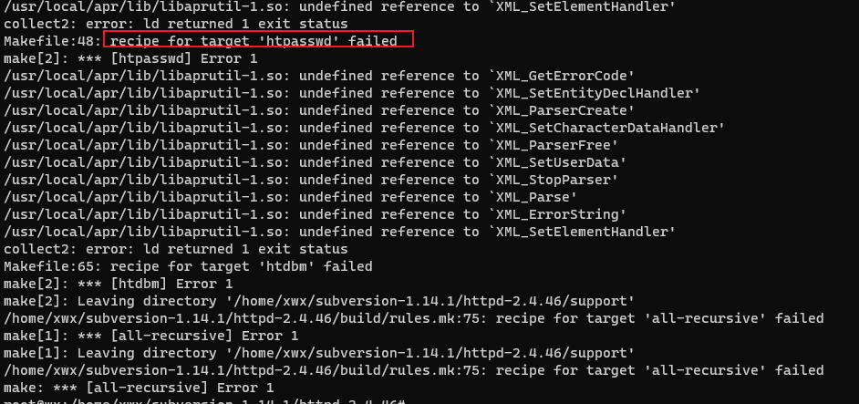


解决方法：把下载下来到 apr 和 apr-util 解压到 httpd 源码下的 srclib 目录下的 apr 和 apr-util 目录，注意目录名字要一致。类似下面


然后使用如下的指令

```bash
./configure --enable-dav --enable-so --enable-maintainer-mode --enable-ssl --with-ssl=/usr/local/ssl --with-included-apr
```

参考：https://www.cnblogs.com/many-object/p/7390162.html


正常的截图：

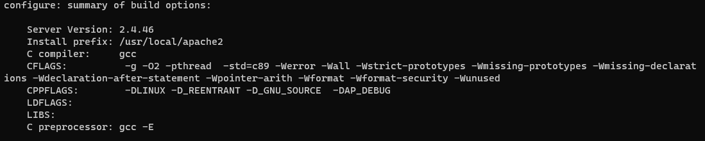


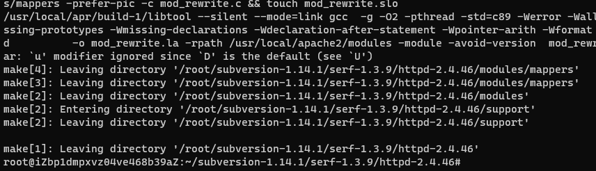


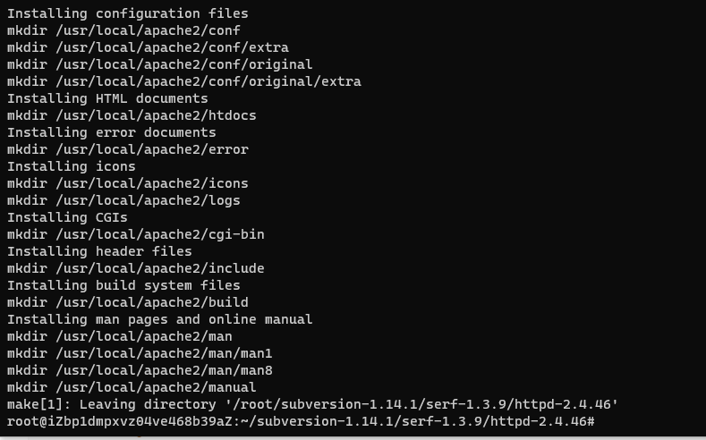


```bash
# 配置开机自启动
cp /usr/local/apache2/bin/apachectl /etc/init.d/httpd
# 利用 update-rc.d 命令可以实现启动项的管理
sudo update-rc.d httpd defaults 90 # 配置开机启动服务,90 是启动顺序
service httpd start
# 测试发现，开机虽然启动了 httpd 服务，但是服务器状态是不可用的，必须手动执行上面那句命令，问题暂时未解决
```

安装路径在`/usr/local/apache2`

默认文档路径 `/usr/local/apache2/htdocs`

### httpd 启动报错解决方法


 打开 `/usr/local/apache2/conf/httpd.conf`，在文件的最底部加上以下内容： 

```bash
AcceptFilter http none
AcceptFilter https none
```

重启

```bash
/etc/init.d/httpd restart 
```


### 其他要说明的问题

服务器根目录在


如果想在服务器中放网页等文件，目录看下面的截图：

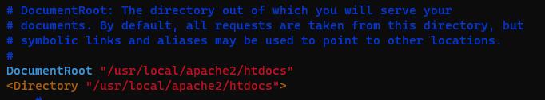


这个在配置文件里面有，多看配置文件

## 2.3 安装 SVN


```bash
/usr/local/apache2/bin/apachectl stop

# --with-apxs=/usr/local/apache2/bin/apxs 这个选项需要事先安装 apache2 服务器
# --enable-mod-activation 自动在 Apache 中安装模块
# --with-serf=/usr/local/serf，如果不加这一句，默认不会安装 http 协议模块
# 可以加 --enable-maintainer-mode  选项，这样可以 debug
# 如果安装了 Apache 服务器，需要先把服务器停掉，不然模块装不进去
./configure --with-apxs=/usr/local/apache2/bin/apxs --enable-mod-activation --with-serf=/usr/local/serf 

make && make install

#设置环境变量（可选，可以先测试是否可以正常显示版本）
vim /etc/profile
SVNPATH=$PATH:/usr/local/bin/svn
export SVNPATH
source /etc/profile

svn --version
###会提示某个模块找不到####
```

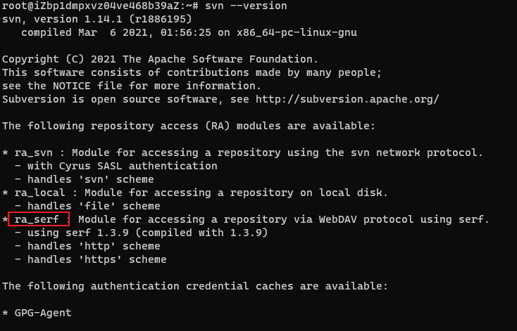


三个模块对应了几种协议，具体看上图

这里我们需要检查几个模块是否被加载到 httpd 的配置文件中

`mod_dav_svn.so`，`mod_authz_svn.so`

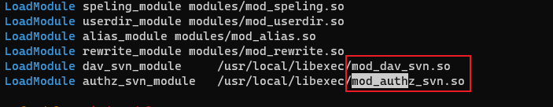


### 提示缺少库解决方法

如果查看版本提示某个库找不到


其实安装的时候有提示


加环境变量

```bash
vim ~/.bashrc
export LD_LIBRARY_PATH=/usr/local/lib
export LD_RUN_PATH=/usr/local/lib
source ~/.bashrc
```


如果执行其他的命令还提示找不到库，放大招


```bash
whereis libsvn_fs_fs-1.so.0 # 查看缺少的库的位置
# libsvn_fs_fs-1.so: /usr/lib/x86_64-linux-gnu/libsvn_fs_fs-1.so.1 /usr/local/lib/libsvn_fs_fs-1.so /usr/local/lib/libsvn_fs_fs-1.so.0

sudo vim /etc/ld.so.conf
# 加上下面
/usr/local/lib
/usr/local/serf/lib

# 其实也可以这么干
echo "/usr/local/serf/lib" >> /etc/ld.so.conf

sudo ldconfig -v
```


## 2.4 安装截图

下面是一些安装的截图（如果找不到库的路径，这些截图里面就能找到）

### apr

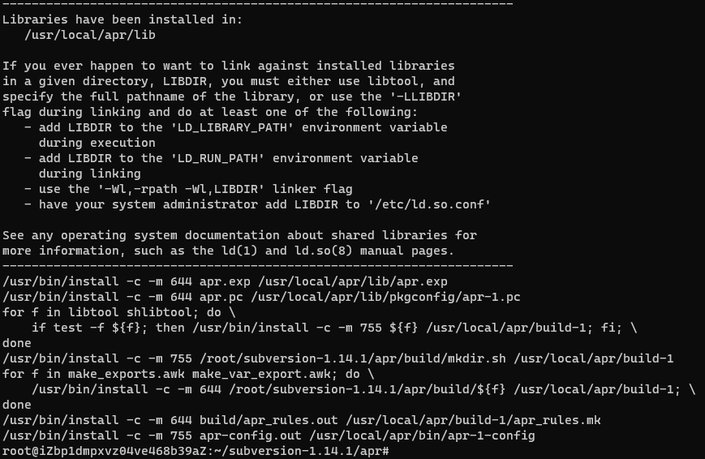


### apr-util

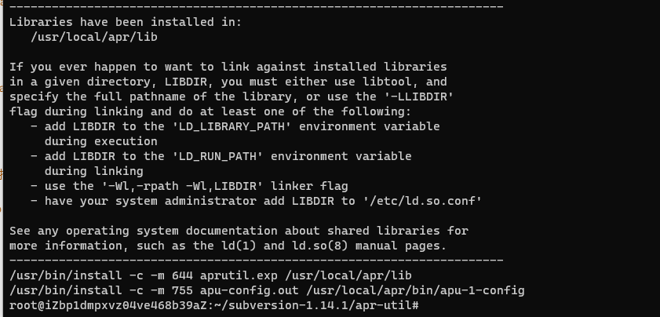


### zlib

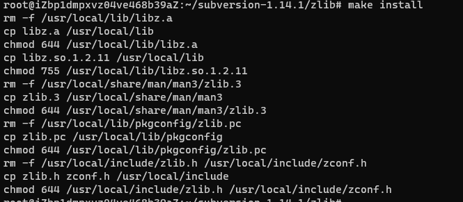


### sqlite

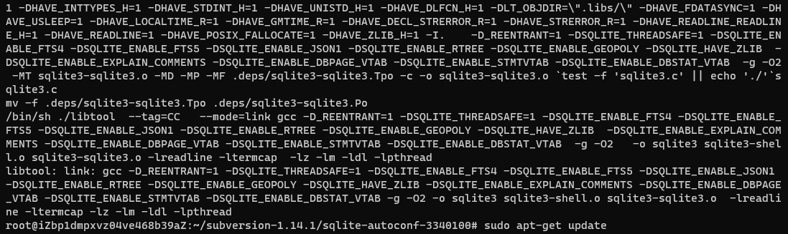


### lz4

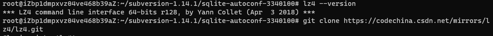


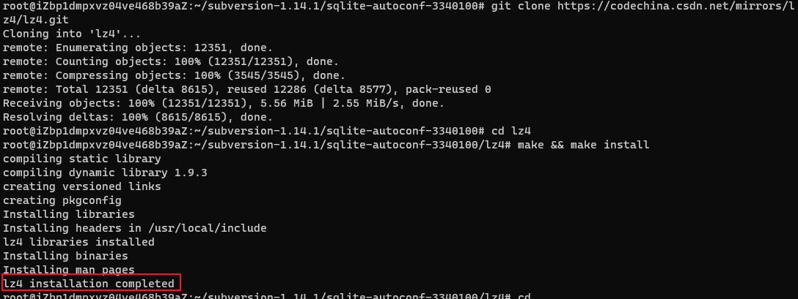


### openssl

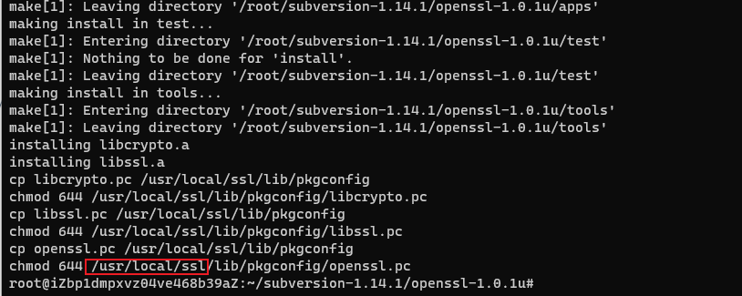


### serf

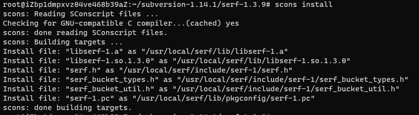


安装的位置：

- the Subversion shared libraries are in /usr/local/lib/

- mod_dav_svn.so should be installed in /usr/local/libexec/

## 2.5 测试使用并配置SVN

1、首先创建一个仓库

```bash
# 创建根目录
sudo mkdir /opt/svn
sudo chmod -R o+rw /opt/svn # 必须给权限，不能其他用户不能写数据
# 创建一个仓库
sudo svnadmin create /opt/svn/repo
```

2、修改配置文件（这里只是示例，后续我们会用可视化管理软件接管配置）

```bash
# 这些都是自动生成的配置文件，需要在 repo/conf 下配置
# 如果使用 svnadmin 下面的不用配置
vim svnserve.conf
anon-access = none # 匿名用户权限
auth-access = write # 授权用户权限
password-db = passwd # 密码路径，默认当前
authz-db = authz # 授权路径，默认当前

vim authz
[groups]
admin = admin

[/]
@admin = rw # 前面加上@符号，则表示这是个群组权限设置
* =

vim passwd
[users]
# harry = harryssecret
# sally = sallyssecret
admin = admin
user1 = 123456
user2 = 123456
```

3、开启服务

```bash
# 开启服务
svnserve -d -r /opt/svn
```

4、检出仓库等操作示例

```bash
# 检出一个仓库
cd 
svn checkout svn://127.0.0.1/repo --username=admin # 会提示输入密码
cd repo
# 新建一个文件
echo "test" > README.md
$ svn status
?       README.md

svn add README.md

# 提交
$ sudo svn ci -m "first commit" --username=admin

Authentication realm: <svn://127.0.0.1:3690> 96df4fa8-7bce-11eb-ad62-132cbc40ee0e
Password for 'admin': *****

Adding         README.md
Transmitting file data .done
Committing transaction...
Committed revision 1.
```

上面涉及的一些截图：

查看状态


查看自动生成的目录


## 2.6 在 apache 服务器中配置 SVN 仓库

参考文献：

- http://svnbook.red-bean.com/nightly/zh/svn.serverconfig.httpd.html

```bash
sudo vim /usr/local/apache2/conf/httpd.conf

# 配置用户名等，At a minimum you should look at the User, Group and ServerName directives
# 我这里直接使用默认，配置文件里面有

# SVN 配置（弃用，看下面的，但是注释务必看一下）
<Location /svn> # 多版本修改成/svn
DAV svn
SVNParentPath /opt/svn # 仓库根目录
SVNListParentPath on # 在浏览器上列出所有的仓库
SVNAutoversioning on # 来自 WebDAV 的写请求将自动生成提交
SVNReposName "repo" # 浏览器中显示的仓库名，自己随便设置
AuthzSVNAccessFile /opt/svn/repo/conf/authz # 为多个仓库指定同一个位于仓库内的访问配置文件，权限文件，可以位置可以自己定义，我用的是刚刚生成的那个，可以自己改
AuthType Basic # 认证类型
AuthName "svn repo auth" # 登录提示信息
AuthUserFile /opt/svn/repo/ApachePasswd.conf # 授权用户文件，就是登录 svnadmin 的账户密码保存文件
Require valid-user
</Location>

# SVN 配置
<Location /svn>
DAV svn
SVNParentPath /opt/svn
SVNListParentPath on
SVNAutoversioning on
SVNReposName "repo"
AuthzSVNAccessFile /opt/svnconfig/authz
AuthType Basic
AuthName "svn repo auth"
AuthUserFile /opt/svnconfig/passwd
Require valid-user
</Location>

sudo apt install apache2-utils

sudo /usr/local/apache2/bin/apachectl restart

# 输入网址：127.0.0.1/svn，可以看到可视化界面，不是管理界面
```

>  WebDAV （Web-based Distributed Authoring and Versioning） 一种基于 [HTTP](https://baike.baidu.com/item/HTTP) 1.1协议的[通信协议](https://baike.baidu.com/item/通信协议/3351624)。它[扩展](https://baike.baidu.com/item/扩展/2732987)了HTTP 1.1，在GET、POST、HEAD等几个HTTP标准方法以外添加了一些新的方法，使[应用程序](https://baike.baidu.com/item/应用程序/5985445)可对[Web Server](https://baike.baidu.com/item/Web Server/9306055)直接读写，并支持写文件锁定(Locking)及解锁(Unlock)，还可以支持文件的[版本控制](https://baike.baidu.com/item/版本控制/3311252)。
>
>  认证方式参考：http://svnbook.red-bean.com/nightly/zh/svn.serverconfig.httpd.html#svn.serverconfig.httpd.authn.digest 

浏览器中显示的仓库名如下：


红色框里面的就是配置文件里面写的那个。


日志查看

两种日志: `error_log` 和 `access_log`（`/usr/local/apache2/logs/`.)

文件 `error_log` 记录了 Apache 遇到的所有 内部错误, 文件 `access_log` 则记录了 Apache 收 到的每一个 HTTP 请求. 利用这些日志, 管理员就能很方便地看出 Subversion 客户端来自哪个 IP, 特定客户端访问服务器的频率高低, 哪些用户认证成功, 以及哪些请求成功或失败.


## 2.7 Apache2 开启虚拟主机（不建议，这样增加了运维成本，不如直接使用原来的配置）

如果访问的时候提示没权限

` /usr/local/apache2/conf/httpd.conf ` 配置文件中找下面这一行，把注释去掉


然后就去改上面这个被包含进来的文件


重启服务器 `/usr/local/apache2/bin/apachectl restart`，然后再次访问：http://127.0.0.1/，就不是显示 `it works` 那个页面了

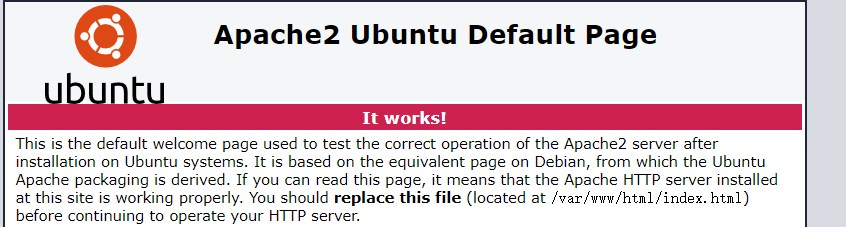


# 三、SVN 后台权限管理可视化工具

## iF.SVNAdmin

前置要求：php5.3

### 安装php5.3

参考：

- https://www.php.net/manual/en/install.unix.apache2.php（官方文档）
- https://blog.csdn.net/ccyours/article/details/41344971
- https://blog.csdn.net/zhq_zvik/article/details/80084783（这篇文章早点看到就好了，遇到好多坑）


```bash
# 先关闭 httpd
/usr/local/apache2/bin/apachectl stop

# 下面有说明
sudo apt-get install libxml2
sudo apt-get install libxml2-dev -y

wget https://www.php.net/distributions/php-5.3.29.tar.gz
tar -xzf php-5.3.29.tar.gz
cd php-5.3.29
./configure --with-apxs2=/usr/local/apache2/bin/apxs
```

如果提示 `configure: error: xml2-config not found. Please check your libxml2 installation` 错误，就安装这个模块，其他模块类似

```bash
sudo apt-get install libxml2
sudo apt-get install libxml2-dev
```

配置成功截图：


编译安装：`make && make install`

成功截图：


以后需要改配置，需要重新运行 `configure` 文件，重新编译安装，而且要先把 apache 关掉

### 配置 PHP

```bash
cp php.ini-development /usr/local/lib/php.ini
```

### 检查 apache 服务器是否加载了 php 模块

文件位置在 ` /usr/local/apache2/conf/httpd.conf `

```bash
vim /usr/local/apache2/conf/httpd.conf
```


### 配置 apache 解析 php 文件

还是上面那个文件 ` /usr/local/apache2/conf/httpd.conf `，添加

```bash
<FilesMatch "\.ph(p[2-6]?|tml)$">
    SetHandler application/x-httpd-php
</FilesMatch>
```

重启服务器 `/usr/local/apache2/bin/apachectl start`

在服务器根目录 `/usr/local/apache2/htdocs` 下新建一个测试文件`info.php`

```php
echo "<?php phpinfo();?>" > /usr/local/apache2/htdocs/info.php
```

在浏览器中输入 `http://localhost/info.php` 

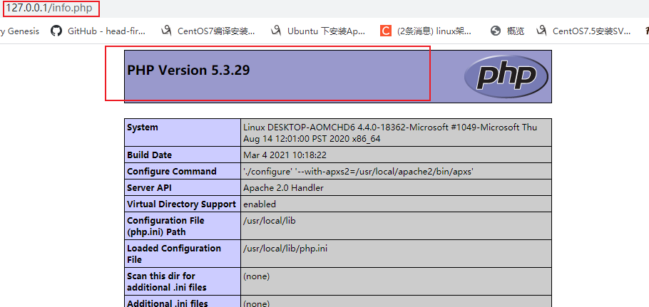


### svnadmin 安装

参考文献：

- http://svnadmin.insanefactory.com/documentation/
- http://svnbook.red-bean.com/nightly/zh/svn.serverconfig.httpd.html

```bash
# 安装iF.SVnAdmin
wget https://udomain.dl.sourceforge.net/project/ifsvnadmin/svnadmin-1.6.2.zip

unzip -q svnadmin-1.6.2.zip

cp -r iF.SVNAdmin-stable-1.6.2/ /usr/local/apache2/htdocs/svnadmin

# 更改data目录的读写模式
chmod -R 777 /usr/local/apache2/htdocs/svnadmin/data
# chown -R www-data:www-data /usr/local/apache2/htdocs/svnadmin # 这个用户和组是apache默认的，不同系统不同，坑之一，其实下面这句也行
sudo chown -R daemon:daemon /usr/local/apache2/htdocs/svnadmin

mkdir -p /opt/svnconfig
touch /opt/svnconfig/authz
# touch /opt/svnconfig/passwd

mkdir -p /opt/svn # 如果前面建过可不需重建
# 更改读写模式
chmod -R 777 /opt/svn

# 创建用户名和密码，需要手动确认密码，如果不设置，则 svnadmin 的用户和密码都是 admin
# 至于为什么，因为他读的是 svn 的配置
# 以后创建不需要 -c， -m 表示对密码进行加密， -p 明文密码
# 如果认证方式不同，加密方式也不一样，生成文件的指令也不一样，官网上面有说明
htpasswd -c -m /opt/svnconfig/passwd admin
# htpasswd -m /opt/svnconfig/passwd admin

# 更改下列两个文件的读写模式
# chmod 777 /opt/svn/repo/conf/authz
# chmod 777 /opt/svn/repo/ApachePasswd.conf
chmod 777 /opt/svnconfig/authz
chmod 777 /opt/svnconfig/passwd

sudo /usr/local/apache2/bin/apachectl restart
```


输入网址：127.0.0.1/svnadmin

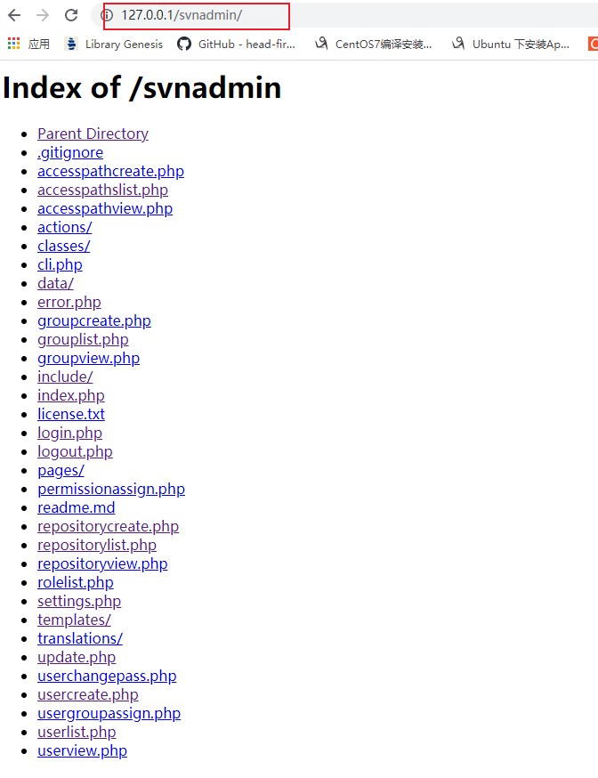


是不是不知道干啥！

不要慌，随便点击一个文件就行，因为是第一次启动，他会让你配置一下，或者输入 `127.0.0.1/svnadmin/index.php`

下面截图有个错误：URL 是127.0.0.1

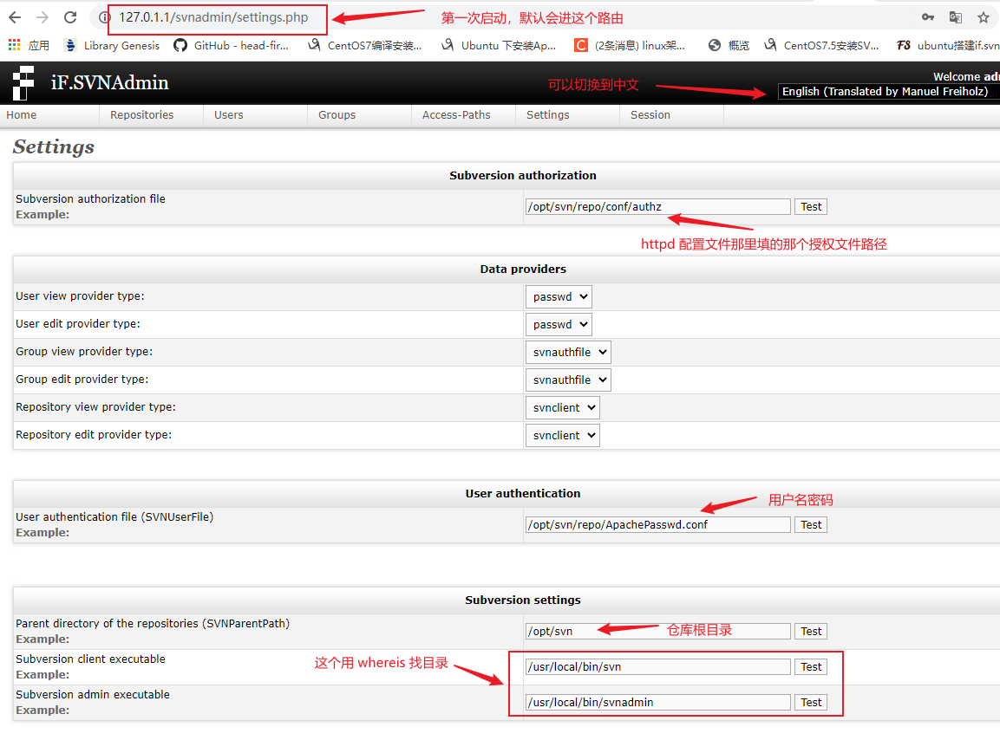


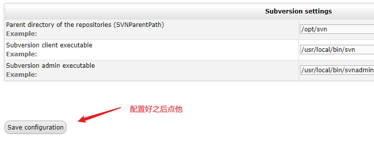


然后就会提示你有个默认账户和密码，你就可以登录了（或者使用你自己设置的那个），就是这个命令 `htpasswd -c -m /opt/svnconfig/passwd admin` 设置的账户密码


登录界面

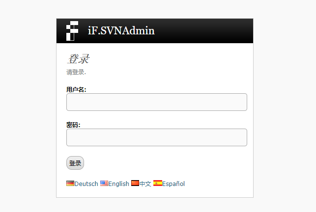


登录后界面


添加仓库

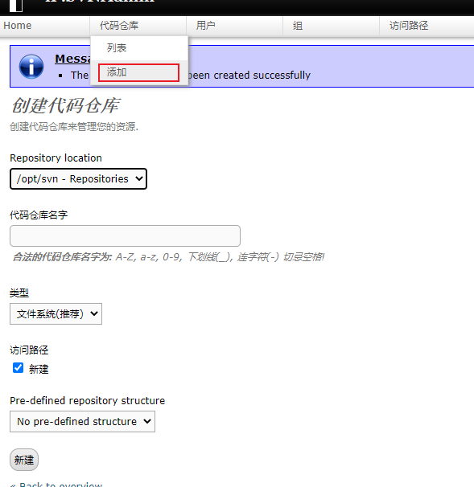


添加用户

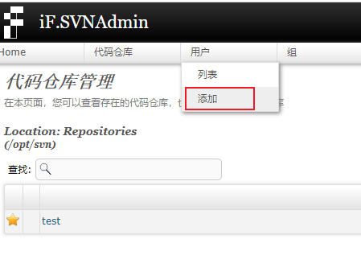

添加组

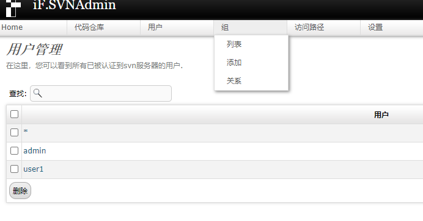

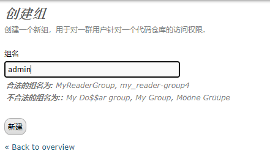


分组

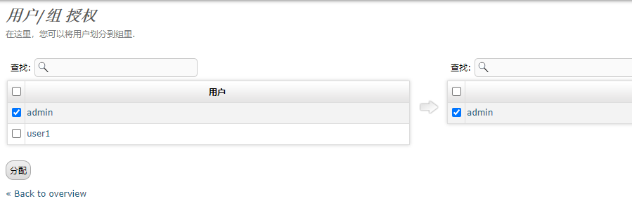


路径相关

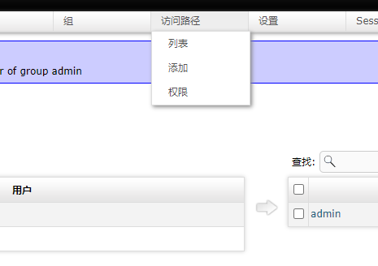


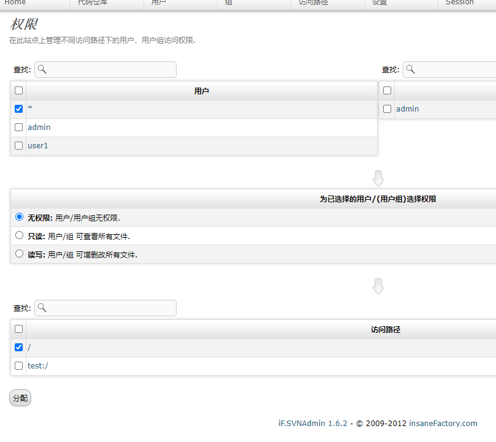


### 问题汇总

1、如果启动访问时提示：Wrong PHP version. The minimum required version is: 5.3

请在程序目录下 `include/config.inc.php` 文件中找到以下行并删除即可（但是建议还是 5.3，毕竟基于 5.3 写的）

除非你不是安装步骤安装的，不然不会出现这个问题

```php
// Check PHP version.if (!checkPHPVersion("5.3")) { echo "Wrong PHP version. The minimum required version is: 5.3"; exit(1);}
```

### 最开始的配置（可参考，不建议使用）


> 下面的不要看了，在虚拟主机里面配的，感觉不好，配置复杂
>
> 以前配的，可参考，但不建议用

需要重新配置 httpd

```bash
sudo vim /usr/local/apache2/conf/httpd.conf

# SVN 配置 管理界面
<Location /svn>
DAV svn
SVNParentPath /var/www/svn
AuthzSVNAccessFile /var/www/svnconfig/authz
AuthType Basic
AuthName "svn repo auth"
AuthUserFile /var/www/svnconfig/passwd
Require valid-user
</Location>

# 创建SVN 仓库目录和权限信息目录
sudo mkdir /var/www/svn -p
sudo mkdir /var/www/svnconfig -p

# 创建SVN权限文件和密码文件
sudo touch /var/www/svnconfig/authz
sudo touch /var/www/svnconfig/passwd

htpasswd -c -m /var/www/svnconfig/passwd admin

sudo /usr/local/apache2/bin/apachectl restart

# 安装iF.SVnAdmin
wget http://sourceforge.net/projects/ifsvnadmin/files/svnadmin-1.6.2.zip/download
unzip svnadmin-1.6.2.zip
sudo cp -r iF.SVNAdmin-stable-1.6.2/ /var/www/html/svnadmin

# 更改data目录的读写模式
chmod -R 777 /var/www/html/svnadmin/data/

# 更改 /var/www/html/svnadmin/ 权属
chown -R www-data:www-data /var/www/html/svnadmin/

# 更改 /var/www/svn 的读写模式
chmod -R 777 /var/www/svn

htpasswd -c -m /opt/svn/repo/ApachePasswd.conf admin

# 更改下列两个文件的读写模式
chmod 777 /var/www/svnconfig/authz
chmod 777 /var/www/svnconfig/passwd

sudo /usr/local/apache2/bin/apachectl restart
```


# 四、SVN 的一些客户端

viewvc：https://github.com/viewvc/viewvc/

小乌龟（推荐）

检出示例（协议不同，路由的写法不一样，仔细看截图的区别）

填好路由，输入账户密码，就能检出了

**http 协议**

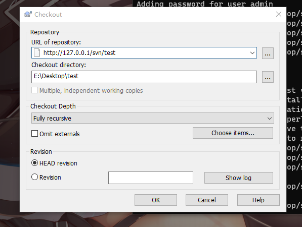


**svn 协议**

下面这种写法，需要手动在服务器使用命令监视仓库，不然会报错，命令为：`svnserve -d -r /opt/svn`，本质上是使用内建的服务器

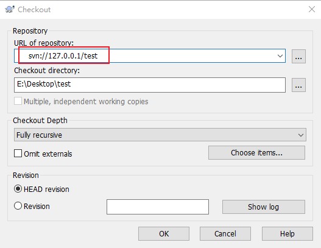


如果试图检出超出自己权限的仓库，会报下面的错误

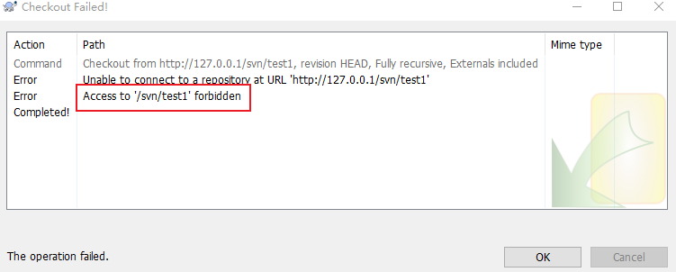


如果提示提交错误：

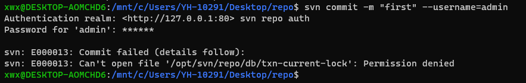

 

这个主要原因：在svnadmin create时是root身份，所以，mod_dav_svn就没有write权限等。 

```bash
sudo chown -R daemon /opt/svn
sudo chmod -R 755 /opt/svn
```


命令行：推荐这个博客查命令https://www.cnblogs.com/liushilin/p/6401017.html

# 五、SVN数据冗余

参考文献：

- http://www.blogjava.net/jasmine214--love/archive/2010/09/28/333223.html
- http://svnbook.red-bean.com/nightly/zh/svn-book.html#svn.reposadmin.maint.migrate


svn备份一般采用三种方式：

（1）svnadmin dump （dump 文件）

（2）svnadmin hotcopy （热备份）

（3）svnsync（镜像）

svn备份不宜采用普通的文件拷贝方式（除非你备份的时候将库暂停），如copy命令、rsync命令。

如果用其他工具，如 rsync 命令来做增量和全量备份，备份出来的库可能大部分都不可用，因此最好是用 svn 本身提供的功能来进行备份。

## 简介

*svnadmin dump* 从仓库中读取版本号的过程和其他 “读者”读取仓库的过程是一样的, 所以 可以在任意时刻, 安全地执行 *svnadmin dump*.  与 *svnadmin dump* 配对的命令 *svnadmin load* 从标准输入读取 Subversion 仓库的转储文件, 把文件中 的版本号重放到目标仓库中.  

 默认情况下, 转储文件会很大——比仓库要大得多, 这是因为每个 文件的每个版本在转储文件中都是全文本表示. 这是最快速和最简单的方式, 如果转储文件还会被其他程序 (例如压缩程序, 过滤程序等) 处理, 处理 起来也会非常方便. 但是如果管理员需要长时间保存转储文件, 向 *svnadmin* 添加选项 `--deltas` 可以 减小转储文件的大小, 从而节省存储空间. 添加选项 `--deltas` 后, 文件的连续版本号将会以压缩的二进制差 异格式输出—和仓库保存文件版本号的方式是一样的. 添加选项后命令 会执行得更慢一些, 但得到的转储文件大小会更接近仓库的大小. 

 使用选项 `--revision` (`-r`) 指定一个单独的, 或一段范围内的版本号进行转 储. 如果省略该选项, 仓库内所有的版本号都会被转储. 

 如果在转储时添加了选项 `--incremental`, *svnadmin* 会把 转储的第一个版本号与前一个版本号作比较, 跟转储范围中剩下的其他 版本号那样, 只输出在版本号中被修改了的内容. 这样做的好处是管理员 可以创建出几个较小的转储文件 

 Subversion 1.7 引入了一个新工具, *svnrdump*. 它提供了较为特殊的功能, 本质上就是 *svnadmin dump* 和 *svnadmin load* 的跨网络 版本. *svnrdump dump* 从一个远程仓库转储数据, 打印 到标准输出; *svnrdump load* 从标准输入读取转储数据, 加载到一个远程仓库上. *svnrdump* 可以像 *svnadmin dump* 那样生成增量转储, 甚至可以只转储 仓库的某个子目录 

 可以一起使用 *svnadmin* 和 *svnrdump*, 例如用 *svnrdump dump* 从远程仓库获取转储流, 然后再把结果通过管道输送给 *svnadmin load*, 把远程仓库历史复制到本地仓库, 或者反之, 把本地仓库 的历史复制到远程仓库. 


 *svnsync* 实现仓库的复制. 

*svnsync* 的工作本质上就是要求 Subversion 服务 “重放” 版本号, 每次一个, 然后利用这个版本号的相关信息, 在另一个仓库中模拟一个相同的提交. 仓库所在的主机和执行 *svnsync* 的主机不必是同一台—如果命令的参数 是仓库的 URL, *svnsync* 将通过 Subversion 的仓库访问 (Repository Access, RA) 接口完成工作. *svnsync* 所要求的就是源仓库的读权限和目标仓库的读写权限. 

 **不要用除了 *svnsync* 之外的其他方法修改镜像 仓库, 使得镜像仓库偏离源仓库的历史.**  

 *svnsync syncronize* 负责镜像操作的大 部分工作. 命令首先询问镜像仓库已经复制了哪些版本号, 然后再从源 仓库复制那些还未被同步的版本号. 

 执行 *svnsync synchronize*  复制仓库，允许被打断，之后再执行就行（再次执行时会从被打断的地方开始）

 能进行部分复制. 一个常见的例子是, 如果用户只对仓库的部分内容具有读取 权限, 那么 *svnsync* 也能优雅地对仓库进行镜像, 但是它只会复制它能读取到的仓库内容 

  *svnsync initialize* 添加选项 `--allow-non-empty`, 该选项允许用户在把仓库初始化成 另一个仓库的镜像时, 不去检查将被初始化的镜像仓库是否含有版本历史 

 这种方法的主要缺点是只有版本化 的仓库数据才会被同步—仓库的配置文件, 用户指定的仓库路径锁, 以 及其他存放在仓库目录中的项目, 只要它们不在仓库的版本化文件系统中, 就不会被 *svnsync* 处理. 

更好的做法是先复制出一个仓库副本 (例如使用命令 *svnadmin hotcopy*), 再用 *svnsync initialize --allow-non-empty* 把仓库副本 初始化成一个镜像仓库, 管理员将会看到后面这种做法会快得多. 


svnadmin hotcopy 仓库热拷贝

命令 *svnadmin hotcopy* 会处理好 仓库热拷贝涉及到的各种细枝末节, 它们调用方式就像 Unix 的 *cp* 或 Windows 的 *copy* 那样简单:

```bash
$ svnadmin hotcopy /var/svn/repos /var/svn/repos-backup
```

得到的备份是一个完整的 Subversion 仓库, 能够在原仓库出现故障时 顶替上去.

 Subversion 源代码目录 `tools/backup` 存放了一个脚本: *hot-backup.py*

*hot-backup.py* 在 *svnadmin hotcopy* 之上增加了一些备份管理策略, 允许用户只保留最近几次的仓库备份. *hot-backup.py* 自动管理通过备份得到的仓库目录的名字, 避免出现名字冲突, 而且会 “轮换” 旧备份, 只保留最近的几次备份. 即使管理员使用的是 增量备份策略, 也有使用 *hot-backup.py* 的需求. 例如 管理员可以在调度程序 (比如 Unix 系统中的 *cron*) 中执行 *hot-backup.py*, 从而实现每晚运行一次 (或 管理员认为合适的其他时间间隔) 脚本. 

 使用仓库转储数据的好处是这种备份信息的格式非常灵活—它与特定 的平台, 仓库文件系统类型, Subversion 的版本及其所使用的函数库都是 无关的. 但灵活性也带来了一定的开销, 就是需要较长的时间才能完全恢复 数据—每当有一个新的版本号提交时, 时间就会变得更长一点. 另外, 和其他备份方法相比, 如果修改了已经备份过的版本号的版本号属性, 这些 修改将不会体现在增量的转储数据中. 由于这些原因, 建议不要单独 依靠基于转储的备份策略. 

  与 *svnsync* 或 *svnadmin dump --incremental* 有所不同的是 *svnadmin hotcopy --incremental* 仅受限于磁盘的读写性能, 在备份大型仓库时, 增量热拷贝可以节省大量的时间. 

 不同的备份方式都有各自的优点和缺点。目前最简单的选择就 是全量的热拷贝, 它总能得到一份可用的仓库副本, 一旦主仓库出现故障, 只要简单地递归复制目录, 就能从备份仓库中恢复. 不幸的是, 如果同时存 在多个仓库副本, 这些全量拷贝所消耗的磁盘空间将会是很可观的. 与此相对, 生成增量副本更快, 消耗的磁盘空间也更少, 但是复原过程就比较痛苦了, 经常需要应用多个增量备份.   其他几种备份方法也有各自的特点. 管理员需要 在备份和复原的开销之间, 找到最适合的平衡点. 

##  比较

优缺点分析：

第一种 svnadmin dump 是官方推荐的备份方式

优点：比较灵活，可以全量备份也可以增量备份，并提供了版本恢复机制。

缺点：如果版本比较大，如版本数增长到数万、数十万，那么dump的过程将非常慢；备份耗时，恢复更耗时；不利于快速进行灾难恢复。

建议在版本数比较小的情况下使用这种备份方式。

第二种 svnadmin hotcopy

优点：备份过程较快，灾难 恢复也很快；如果备份机上已经搭建了 svn 服务，甚至不需要恢复，只需要进行简单配置即可切换到备份库上工作。

 缺点是：比较耗费硬盘，需要有较大的硬盘支持； 目标仓库的 UUID 和源仓库的 UUID 必须 完全相同 

第三种 svnsync 实际上是制作2个镜像库，当一个坏了的时候，可以迅速切换到另一个

特点： 只要求对源仓库具有读取权限, 不会试图去修改源仓库的任何数据 

优点：当制作成2个镜像库的时候起到双机实时备份的作用；当然也支持多个镜像库

 缺点：当作为2个镜像库使用时，没办法做到“想完全抛弃今天的修改恢复到昨晚的样子”；而当作为普通备份机制每日备份时，操作又较前2种方法麻烦。     

## 什么是集群？

单机处理到达瓶颈的时候，你就把单机复制几份，这样就构成了一个“集群”。集群中每台服务器就叫做这个集群的一个“节点”，所有节点构成了一个集群。每个节点都提供相同的服务，那么这样系统的处理能力就相当于提升了好几倍（有几个节点就相当于提升了这么多倍）。

但问题是用户的请求究竟由哪个节点来处理呢？最好能够让此时此刻负载较小的节点来处理，这样使得每个节点的压力都比较平均。要实现这个功能，就需要在所有节点之前增加一个“调度者”的角色，用户的所有请求都先交给它，然后它根据当前所有节点的负载情况，决定将这个请求交给哪个节点处理。这个“调度者”有个牛逼了名字——负载均衡服务器。


说白了就是一个个的**复制人**

# 六、搭建 SVN 集群

参考文献：

- http://www.blogjava.net/jasmine214--love/archive/2010/09/28/333223.html（十年前的文章，但是参考意义很大）
- http://svnbook.red-bean.com/nightly/zh/svn-book.html#svn.reposadmin.maint.migrate（搜索"直写代理"部分）


直写代理

方案一：一主多从

方案二：链式结构，一个接一个传递下去

方案三：从服务器定期从主服务器拉取请求

这里暂时选择方案一（参考官网）


目标仓库： 允许 *svnsync* 修改版本号属性，需要显式地实现钩子 pre-revprop-change, 在钩子脚本中允许设置和修改版本号 属性 


必须先了解钩子，不然不会配置

## Subversion 钩子

参考文献：http://svnbook.red-bean.com/nightly/zh/svn-book.html#svn.ref.reposhooks

Subversion 仓库提供了很多事件钩子, 利用这些钩子, 管理员可以在 特定操作的特定时间点扩展 Subversion 的功能. 仓库钩子被实现成由 Subversion 在特定时间点执行的程序, 这些时间点包括在提交之前或之后, 用户锁定文件之前或之后, 等等.

对于每一种钩子, Subversion 都会尝试去执行以钩子命名的程序, 这些 程序文件位于仓库目录的 `hooks/` 子目录内.

 start-commit — 开始一个新提交的通知. 

- `start-commit REPOS-PATH USER CAPABILITIES TXN-NAME`

常见用法

- 访问控制 (例如临时禁止向仓库提交修改).

- 只允许支持某些特性的客户端向仓库提交修改.

pre-commit — 提交即将完成的通知.

```
pre-commit REPOS-PATH TXN-NAME # 仓库路径  事务名
```

在提交事务即将生成一个新的版本号之前被调用. 它的典型用法是禁止内容不符合要求的提交 (例如你的公司可能要求所有的提交日志消息都要包含来自问题跟踪系统的单号, 或者要求日志消息不 能为空)

post-commit — 成功提交的通知. 

```bash
post-commit REPOS-PATH REVISION TXN-NAME
```

事务提交并且新的版本号生成后, Subversion 就会执行钩子 post-commit. 大多数管理员都会利用 post-commit 向团队成员发送关 于新提交的邮件, 或者通知其他工具 (例如一个问题跟踪系统) 有新的提交 生成. 有些管理员还会用 post-commit 触发备份操作.

如果钩子 post-commit 的退出值不为零, 提交过程将 *不会* 中止, 因为这时候提交已经完成了. 但是, 钩子打印到 `stderr` 的信息都会返回给客户端, 以 便分析钩子失败的原因.


pre-revprop-change — 版本号属性即将被修改的通知.

```bash
pre-revprop-change REPOS-PATH REVISION USER PROPNAME ACTION
```

说明：pre-revprop-change 的默认行为是禁止修改版本号属性. 为了允许修改 版本号属性, pre-revprop-change 必须显式地以零作为退出值.

如果 pre-revprop-change 没有退出, 或者不可执行, 或者退出值不 为零, Subversion 将禁止修改版本号属性, 钩子打印到 `stderr` 的信息都会返回给客户端.

输入参数：仓库路径、即将被修改的版本号的整数编号、试图修改版本号属性的已认证的用户名、即将被修改的版本号属性的名字、用于描述修改类型的字符: A (新增的), D (被删除的), 或 M (被修改的)


#### 使用 svnsync 复制仓库

注意点：

-  不要用除了 *svnsync* 之外的其他方法修改镜像 仓库, 使得镜像仓库偏离源仓库的历史
- 发生在镜像仓库的提交和版本号 属性修改只能由 *svnsync* 完成
-  对目标仓库的另一项要求是允许 *svnsync* 修改版 本号属性。 管理员需要 显式地实现钩子 pre-revprop-change, 在钩子脚本中允许设置和修改版本号 属性


（1）在目标机器上创建一个仓库 `svn-mirror`

（2）在 `svn-mirror` 仓库的 `hooks` 目录下建立 `pre-revprop-change` 钩子

```bash
sudo cp pre-revprop-change.tmpl pre-revprop-change
sudo vim pre-revprop-change
# 有用的部分在最好几行，其实只需要把返回值设为 0 就行，你也可以加提示性的操作。我的改动如下（其实发现也没有输出，就最后一行有用：
echo "$USER is changing the repository!" >1
exit 0
```

（3）做镜像

```bash
svnsync initialize http://10.10.12.43/svn/svn-mirror  http://10.10.13.12:8033/svn/repos --sync-username admin
```

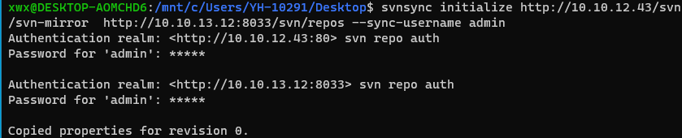


（4）修改源代码仓库

（5）同步 

```bash
svnsync synchronize http://10.10.12.43/svn/svn-mirror  http://10.10.13.12:8033/svn/repos
```


（6）完成了仓库复制

## 遇到的错误

1、做仓库镜像时提示没有钩子

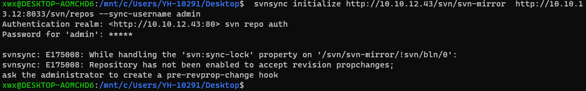

```bash
svnsync: E175008: While handling the 'svn:sync-lock' property on '/svn/svn-mirror/!svn/bln/0':
svnsync: E175008: Repository has not been enabled to accept revision propchanges;
ask the administrator to create a pre-revprop-change hook
```


# 其他可能的错误

1、无法使用官方脚本下载依赖

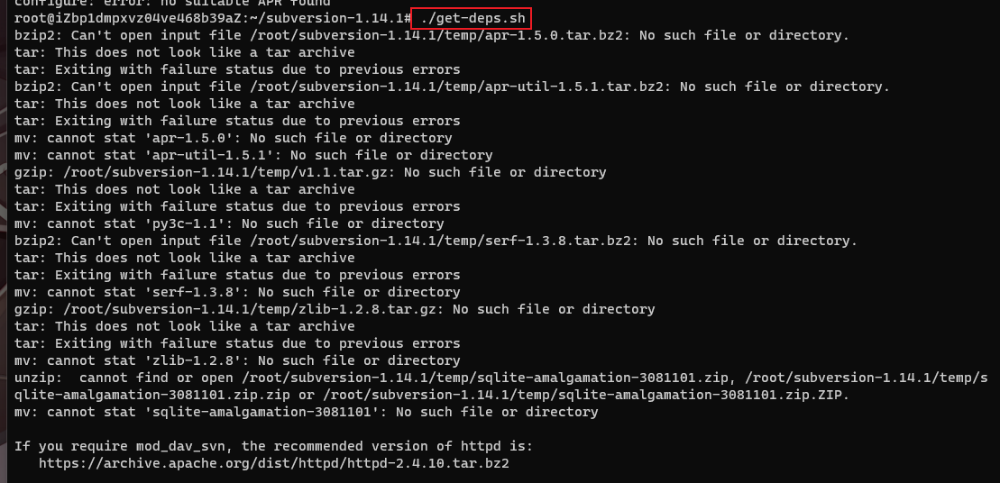


上图中都显示了版本号，可以自己去官网下载（我用的最新的）

2、下载软件说是不安全（这个阿里云的服务器会提示，WSL 不会）

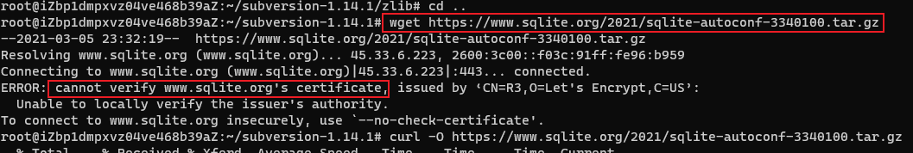


换个方式，不用 `wget`，用 `curl`

3、其他问题，请看上文以及参考的文章，同时合理度娘

