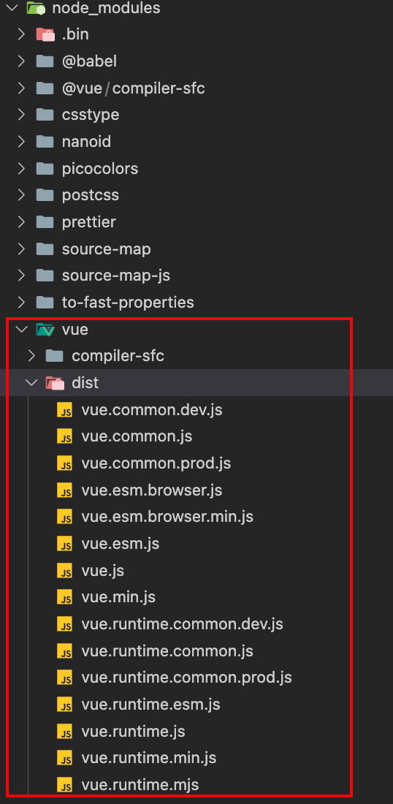

## Vue学习笔记

### 搭建Vue环境

1、使用CDN

```html
<script src="https://cdn.jsdelivr.net/npm/vue@2.7.16/dist/vue.js"></script>
```

2、使用npm安装

```bash
npm install vue@^2
```

在 NPM 包的 `dist/` 目录将会找到很多不同的 Vue.js 构建版本




### 初识Vue

```html
<!DOCTYPE html>
<html lang="en">
<head>
    <meta charset="UTF-8">
    <meta name="viewport" content="width=device-width, initial-scale=1.0">
    <!-- 引入vue -->
    <script type="text/javascript" src="../js/vue.js"></script>
    <title>初识Vue</title>
</head>
<body>
    <div id="app">
        Hello {{ msg }}
    </div>
    
    <script type="text/javascript">
        // 创建vue实例
        new Vue({
            el: "#app",// 指定当前vue实例为哪个容器服务，一般为CSS选择器字符串
            data: {// data用于存储数据，供el绑定的容器使用
                msg: "xwx"
            }
        })
    </script>
</body>
</html>
```


总结：

1. 想让vue工作，必须创建vue实例，同时传入一个配置对象
2. 容器中的代码依然符合html规范，只不过混入了一些vue的语法
3. 容器和vue实例一一对应
4. 真实开发中只有一个vue实例，并且配合组件一起使用
5. `{{}}` 中要写js表达式，而且`{{}}` 可以读取到data中的所有属性，也可以读取到vue实例的所有属性


### 模板语法

分为插值语法和指令语法

- 插值语法一般用于标签体里面的内容，如`<h1></h1>` 里面
- 指令语法管理标签属性


```html
<div id="app">
    <h1>插值语法</h1>
    <h3>你好，{{name}}</h3>
    <hr/>
    <h1>指令语法</h1>
    <a v-bind:href="url">点我去百度</a>
    <!-- 简写 -->
    <a :href="url">点我去百度（简写形式）</a>
</div>

<script type="text/javascript">
    // 创建vue实例
    new Vue({
        el: "#app",// 指定当前vue实例为哪个容器服务，一般为CSS选择器字符串
        data: {// data用于存储数据，供el绑定的容器使用
            name: "Jack",
            url: "http://www.baidu.com"
        }
    })
</script>
```


### 数据绑定

单向绑定`v-bind`：数据只能由data流向页面

双向绑定`v-model`：

- 数据在data和页面之间双向流转
- 只能应用于表单类（输入类）元素，默认收集value的值
- `v-model:value`可简写为`v-model`

```html
<div id="app">
    单向数据绑定：<input type="text" v-bind:value="name">
    <br/>
    双向数据绑定：<input type="text" v-model:value="name">
    
    <!-- 简写形式 -->
    单向数据绑定：<input type="text" :value="name">
    <br/>
    双向数据绑定：<input type="text" v-model="name">
</div>

<script type="text/javascript">
    new Vue({
        el: "#app",
        data: {
            name: "xwx"
        }
    })
</script>
```


### el和data的两种写法

容器定义

```html
<div id="app">
            你好，{{name}}
        </div>
```


#### el的两种写法

```html
<script type="text/javascript">
    // el的两种写法
    const v = new Vue({
        // el: "#app",// 第一种写法
        data: {
            name: "xwx"
        }
    })
    v.$mount("#app")// 第二种写法

    // 甚至可以一秒钟之后再绑定数据
    // setTimeout(()=>{
    //     v.$mount("#app")
    // }, 1000)
</script>
```


#### data的两种写法

```html
<script type="text/javascript">
// data的两种写法
new Vue({
    el: "#app",
    // data的第一种写法：对象式
    // data: {
    //     name: "xwx"
    // }

    // data的第二种写法：函数式
    // data: function(){// 必须是普通函数，不能是箭头函数，可简写为下一行
    data(){
        // console.log("@@@", this)// this是vue对象
        // 必须返回一个对象
        return {
            name: "xwx"
        }
    }
})
</script>
```


### MVVM模型

M：model，对应data中的数据

V：view，即模板

VM：视图模型（viewModel），即Vue实例对象


### 事件处理

- 使用`v-on:xxx`或者`@xxx`绑定事件，其中`xxx`是事件名
- 事件的回调需要写在`methods`对象中，最终会在vm上
- `methods`中的函数不要使用箭头函数，否则this对象不是vm
- `methods`中的函数会被Vue管理

```html
<div id="app">
    <h1>欢迎来{{school}}学习</h1>
    <!-- <button v-on:click="showInfo1">无参函数</button> -->
     <!-- 下面是简写形式 -->
    <button @click="showInfo1">无参函数</button>
    <button @click="showInfo2(666)">有参函数</button>
    <!-- $event参数的位置随意 -->
    <button @click="showInfo3(888, $event)">有参函数（同时传入event事件）</button>
</div>

<script type="text/javascript">
    const vm = new Vue({
        el: "#app",
        data: {
            school: "B站大学"
        },
        // 所有被vue管理的函数最好用普通函数，尽量别用箭头函数
        methods: {
            showInfo1(){
                // console.log(this === vm)// 此处的this是vm
                alert("欢迎学习!")
            },
            showInfo2(number){
                alert(number)
            },
            showInfo3(number, event){
                console.log(event)
                alert(number)
            },
        }
    })
</script>
```


### 事件修饰符

共有6个事件修饰符，常用的如下：

1. prevent：阻止事件的默认行为
2. stop：防止事件冒泡
3. once：事件仅会触发一次

>修饰符可以连续写，如`.stop.prevent`

```html
<div id="app">
    <h1>欢迎来{{school}}学习</h1>
    <!-- prevent：阻止事件的默认行为 -->
    <a href="http://www.baidu.com" @click.prevent="showInfo">点我去百度</a>

    <div @click="showInfo">
        <!-- stop：防止事件冒泡 -->
        <button @click.stop="showInfo">点我提示信息</button>
    </div>

    <div>
        <!-- once：事件仅触发一次 -->
        <button @click.once="showInfo">点我仅会提示一次信息</button>
    </div>
</div>

<script type="text/javascript">
    const vm = new Vue({
        el: "#app",
        data: {
            school: "B站大学"
        },
        methods: {
            showInfo(){
                alert("欢迎学习!")
            },

        }
    })
</script>
```


### 计算属性和监视

#### 计算属性

定义：需要的属性不存在，需要通过现有的属性计算出来

`get()`什么时候调用？

- 第一次读取fullName时
- 当依赖的数据发生变化时

优势：`get()`与`methods`里面的方法相比，`get()`有缓存，效率更高，方便调试

注意点：1、计算属性最终会出现在vm上；2、如果要修改计算属性的值，则要有`set()`方法，而且`set()`内部要改变计算属性所依赖属性的值


```html
<div id="app">
    姓：<input type="text" v-model="firstName"><br/>
    名：<input type="text" v-model="lastName"><br/>
    全名：<span>{{fullName}}</span>
</div>

<script type="text/javascript">
    const vm = new Vue({
        el: "#app",
        data: {
            firstName: "张",
            lastName: "三"
        },
        // 计算属性的数据放在computed里面
        computed: {
            fullName: {
                // get()什么时候调用？1、第一次读取fullName时；2、当依赖的数据发生变化时
                get(){
                    // console.log(this)// 此处的this是vm
                    console.log("get被调用...")
                    return this.firstName + this.lastName
                }
            }
        }
    })
</script>
```


如果计算属性是只读的，则可以简写

```javascript
fullName: function(){
    return this.firstName + this.lastName
}

// 进一步精简
fullName(){
    return this.firstName + this.lastName
}
```


#### 监视（watch）

1. 当被监视的属性变化时，回调函数自动调用，进行相关操作
2. 监视的属性必须存在，属性可以是计算属性
3. 可以在new Vue的时候传入watch配置，也可通过`vm.$watch`配置


深度监视：

1. watch默认不监视对象内部值的改变（Vue自身是可以的）
2. 配置`deep:true`可以监视对象内部值的改变

> 默认看一层，配置深度监视可以看多层


```html
<div id="app">
    <h1>今天天气很{{info}}</h1>
    <button @click="changeHotValue">点我改变天气</button>

    <h2>a的值是：{{number.a}}</h2>
    <button @click="number.a++">点我让a加一</button>

    <h2>b的值是：{{number.b}}</h2>
    <button @click="number.b++">点我让b加一</button>
</div>

<script type="text/javascript">
    const vm = new Vue({
        el: "#app",
        data: {
            isHot: true,
            number: {
                a: 1,
                b: 1
            }
        },
        computed: {
            info(){
                return this.isHot ? "炎热" : "凉爽"
            }
        },
        methods:{
            changeHotValue(){
                this.isHot = ! this.isHot
            },
        },
        watch: {
            isHot: {
                // handler方法会在isHot的值发生改变时被调用
                handler(newVal, oldVal){
                    console.log("isHot被修改了", newVal, oldVal)
                }
            },
            // 监视多级结构中某个具体属性的变化
            // "number.a": {
            //     handler(){
            //         console.log("a被修改了")
            //     }
            // },

            // 监视多级结构中所有属性的变化
            number: {
                deep: true,
                handler(){
                    console.log("number被修改了")
                }
            }

        }
    })
</script>
```


当watch的属性仅有handler的时候可以简写：

```javascript
watch: {
    // 仅有handler时可以简写
    isHot(newVal, oldVal){
        console.log("isHot被修改了", newVal, oldVal)
    }
}
```


计算属性和监听属性的区别：computed能完成的，watch都能；反之不能，如watch可以进行异步操作


### 条件渲染

使用`v-show`和`v-if`进行条件渲染

> show节点还在，只是不展示了；if节点直接没了

```html
<!-- 引号里面可以是布尔值，也可以是表达式 -->
<h1 v-show="false">欢迎来到B战大学</h1>

<h1 v-if="false">欢迎来到B战大学</h1>
```


如果和这个节点交互很频繁，建议使用`v-show`，因为`v-if`会频繁在dom上添加删除节点，`v-show`则是控制是否隐藏


### 列表渲染

`v-for`：基于原始数据多次渲染元素或模板块。

- **期望的绑定值类型：**`数组 | 对象 | number（指定次数） | string | Iterable`


```html
 <div id="app">
    <h2>人员列表：</h2>
    <ul>
        <!-- key值是唯一的，可以绑定数据的索引 -->
        <!-- < v-for="p in  personArr" :key="p.id"> -->
        <li v-for="(p, idx) in  personArr" :key="idx">
            姓名：{{p.name}}，年龄：{{p.age}}
        </li>
    </ul>
    <hr/>
    <!-- 遍历对象 -->
    <h2>汽车属性：</h2>
    <ul>
        <li v-for="(v, k) in  car" :key="k">
            {{k}}：{{v}}
        </li>
    </ul>
</div>

<script type="text/javascript">
    // 创建vue实例
    new Vue({
        el: "#app",// 指定当前vue实例为哪个容器服务，一般为CSS选择器字符串
        data: {// data用于存储数据，供el绑定的容器使用
            personArr: [
                {id: "001", name: "张三", age: 18},
                {id: "002", name: "张33", age: 35},
                {id: "003", name: "李四", age: 20},
            ],
            car: {
                name: "奥迪",
                type: "Q3",
            }
        }
    })
</script>
```


>遍历指定次数：`<li v-for="(number, idx) in 8">{{number}}</li>`


#### key的作用和原理

- key作为虚拟DOM对象的标识，当数据发生变化时，vue会根据【新数据】生成【新的虚拟DOM】。随后vue进行【新虚拟DOM】与【旧虚拟DOM】的差异比较，比较规则如下:
	- 旧虚拟DOM中找到了与新虚拟DOM相同的key：
		- 若虚拟DOM中内容没变，直接使用之前的真实DOM
		- 若虚拟DOM中内容变了，则生成新的真实DOM，随后替换掉页面中之前的真实DOM
	- 旧虚拟DOM中未找到与新虚拟DOM相同的key，创建新的真实DOM，随后渲染到到页面。


用index作为key可能会引发的问题：

- 若对数据进行：逆序添加、逆序删除等破坏顺序操作，会产生没有必要的真实DOM更新（界面效果没问题，但效率低）
- 如果结构中还包含输入类的DOM：会产生错误DOM更新（界面有问题）


```html
<div id="app">
    <h2>人员列表：</h2>
    <button @click.once="addPerson">添加一个老六</button>
    <ul>
        <!-- 不能用 -->
        <li v-for="(p, idx) in  personArr" :key="p.id">
            姓名：{{p.name}}，年龄：{{p.age}}
            <input type="text">
        </li>
    </ul>
</div>

<script type="text/javascript">
    // 创建vue实例
    new Vue({
        el: "#app",// 指定当前vue实例为哪个容器服务，一般为CSS选择器字符串
        data: {// data用于存储数据，供el绑定的容器使用
            personArr: [
                {id: "001", name: "张三", age: 18},
                {id: "002", name: "张33", age: 35},
                {id: "003", name: "李四", age: 20},
            ]
        },
        methods: {
            addPerson(){
                const p = {id: "004", name: "老六", age: 40}
                // this.personArr = [
                //     p,
                //     ...this.personArr
                // ]
                // 简写
                this.personArr.unshift(p)
            }
        }
    })
</script>
```


开发中如何选择key?

1. 最好使用每条数据的唯一标识作为key，比如id、手机号、身份证号、学号等唯一值
2. 如果不存在对数据的逆序添加、逆序删除等破坏顺序操作，仅用于渲染列表用于展示，使用index作为key是没有问题的


