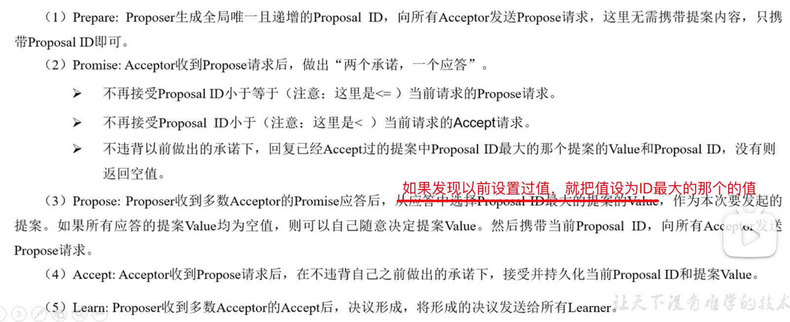
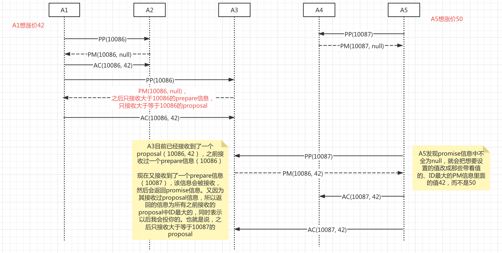

# ZooKeeper 学习笔记

## 命令行使用

```bash


# 进入bin目录
# 客户端连接
./zkCli.sh -server localhost:2181
```


## 配置文件讲解

```sh
# The number of milliseconds of each tick
# 心跳时间
tickTime=2000
# The number of ticks that the initial 
# synchronization phase can take
# 集群模式中，lead和follower 第一次建立通信最多尝试次数
# 总时间 = tickTime * initLimit = 2000 * 10 = 20000ms = 20s
initLimit=10
# The number of ticks that can pass between 
# sending a request and getting an acknowledgement
#  集群模式中，lead 和 follower 在正常情况下，发送请求之后最多尝试次数
syncLimit=5
# the directory where the snapshot is stored.
# do not use /tmp for storage, /tmp here is just 
# example sakes.
dataDir=../data
# the port at which the clients will connect
clientPort=2181
# the maximum number of client connections.
# increase this if you need to handle more clients
#maxClientCnxns=60
#
# Be sure to read the maintenance section of the 
# administrator guide before turning on autopurge.
#
# https://zookeeper.apache.org/doc/current/zookeeperAdmin.html#sc_maintenance
#
# The number of snapshots to retain in dataDir
#autopurge.snapRetainCount=3
# Purge task interval in hours
# Set to "0" to disable auto purge feature
#autopurge.purgeInterval=1

## Metrics Providers
#
# https://prometheus.io Metrics Exporter
#metricsProvider.className=org.apache.zookeeper.metrics.prometheus.PrometheusMetricsProvider
#metricsProvider.httpHost=0.0.0.0
#metricsProvider.httpPort=7000
#metricsProvider.exportJvmInfo=true
```

>参考文章：
>
>1. https://www.zhihu.com/question/35139415/answer/3246509977


## 集群安装

半数以上节点存活，就能正常提供服务。所以奇数台服务器比较合适，所以至少要 3 台以上的服务器


## Paxos 算法




举例说明：




## ZAB 协议

