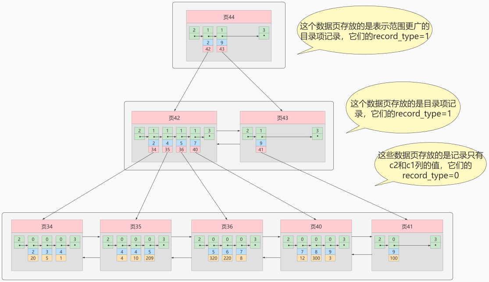
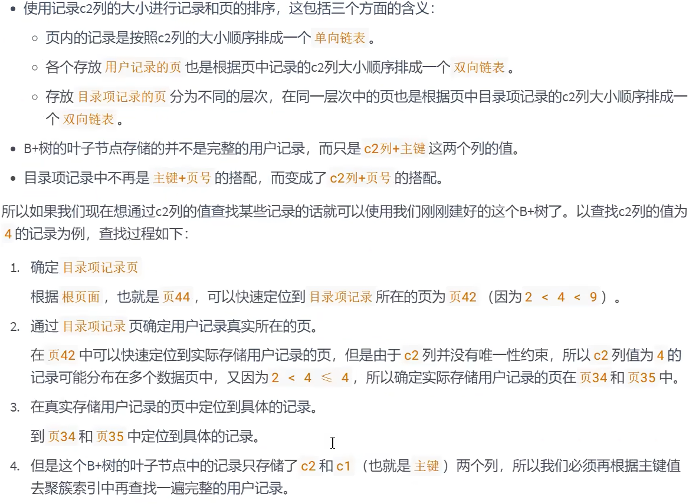
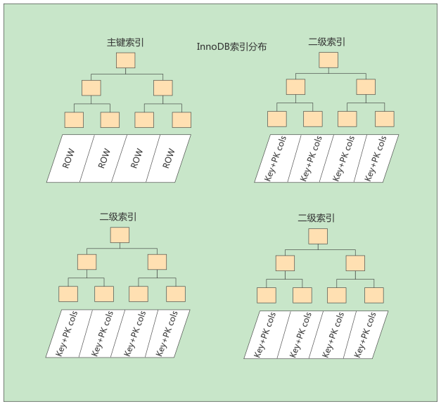

# 尚硅谷MySQL学习笔记

## 存储引擎

存储引擎就是指表的类型。

功能：接收上层传下来的指令，然后对表中的数据进行提取或者写入操作。

查看引擎：`show engines`

```tex
+--------------------+---------+----------------------------------------------------------------+--------------+------+------------+
| Engine             | Support | Comment                                                        | Transactions | XA   | Savepoints |
+--------------------+---------+----------------------------------------------------------------+--------------+------+------------+
| FEDERATED          | NO      | Federated MySQL storage engine                                 | NULL         | NULL | NULL       |
| MEMORY             | YES     | Hash based, stored in memory, useful for temporary tables      | NO           | NO   | NO         |
| InnoDB             | DEFAULT | Supports transactions, row-level locking, and foreign keys     | YES          | YES  | YES        |
| PERFORMANCE_SCHEMA | YES     | Performance Schema                                             | NO           | NO   | NO         |
| MyISAM             | YES     | MyISAM storage engine                                          | NO           | NO   | NO         |
| MRG_MYISAM         | YES     | Collection of identical MyISAM tables                          | NO           | NO   | NO         |
| BLACKHOLE          | YES     | /dev/null storage engine (anything you write to it disappears) | NO           | NO   | NO         |
| CSV                | YES     | CSV storage engine                                             | NO           | NO   | NO         |
| ARCHIVE            | YES     | Archive storage engine                                         | NO           | NO   | NO         |
+--------------------+---------+----------------------------------------------------------------+--------------+------+------------+
```

`XA`：是否支持分布式事务

创建表的时候可以指定存储引擎，如下：

```mysql
create table emp(id int) engine=InnoDB;
```

表创建好之后可以修改存储引擎（引擎名可以全部小写）：

```mysql
alter table emp engine=myisam;
```

### InnoDB：具备外键支持功能的事务存储引擎

- 5.5版本之后的默认存储引擎
- MySQL的默认`事务型引擎`，可以处理大量的短期（short-lived）事务，可以保证事务的完整提交和回滚
- 如果有大量的更新、删除操作，优先选择 InnoDB
- 数据文件结构：
	- `表名.frm` 存储表结构（8.0 时合并在`表名.ibd` 中）
	- `表名.ibd` 存储数据和索引
- 为处理巨大数据量的最大性能设计
- 相比 MyISAM，`InnoDB 写的效率差一些`，并且会占用更多的磁盘空间来保存数据和索引
- MyISAM 只缓存索引，不缓存真实数据；InnoDB 索引和真实数据都缓存，并且对内存要求较高，内存大小对性能有决定性的影响

### MyISAM：主要的非事务处理存储引擎

处理数据量比较小的

- `5.5版本之前的默认存储引擎`，提供大量特性，如全文索引、压缩、空间函数（GIS）等
- 不支持事务、行锁、外键，崩溃后无法安全恢复
- 优势是`访问的速度快`，适合对事务完整性没有要求或者以插入、查询为主的应用
- 针对数据统计有额外的常数存储。因此 `count(*)` 的查询的效率很高
- 数据文件结构
	- `表名.frm` 存储表结构
	- `表名.MYD` 存储数据（MYData）
	- `表名.MYI` 存储索引（MYIndex）
- 应用场景：只读应用或者以读为主的应用

<br/>

| 对比项 | MyISAM                                             | InnoDB                                           |
| ------ | -------------------------------------------------- | ------------------------------------------------ |
| 外键   | 不支持                                             | 支持                                             |
| 事务   | 不支持                                             | 支持                                             |
| 行表锁 | 表锁，即使操作一条记录也会锁住整个表，不适合高并发 | 行锁，操作时只锁某一行，不影响其他行，适合高并发 |
| 缓存   | 只缓存索引，不缓存真实数据                         | 索引和真实数据都缓存                             |
| 关注点 | 性能：节省资源、消耗少、简单事务                   | 事务：并发写、事务、更大资源                     |

## 索引

### 为什么使用索引

索引是存储引擎用于快速找到数据记录的一种**数据结构**，就好比一本教科书的目录部分，通过目录中找到对应文章的页码，便可快速定位到需要的文章。

【重点】MySQL进行数据查找时，首先查看查询条件是否命中某条索引，符合则`通过索引查找`相关数据，如果不符合则需要`全表扫描`，即需要一条一条地查找记录，直到找到与条件符合的记录。


如上图所示，数据库没有索引的情况下，数据`分布在硬盘不同的位置上面`，读取数据时，摆臂需要前后摆动查询数据，这样操作非常消耗时间。如果`数据顺序摆放`，那么也需要从1到6行按顺序读取，这样就相当于进行了6次IO操作，`依旧非常耗时`。如果我们不借助任何索引结构帮助我们快速定位数据的话，我们查找 Col 2 = 89 这条记录，就要逐行去查找、去比较。从Col 2 = 34 开始，进行比较，发现不是，继续下一行。我们当前的表只有不到10行数据，但如果表很大的话，有`上千万条数据`，就意味着要做`很多很多次硬盘I/0`才能找到。现在要查找 Col 2 = 89 这条记录。CPU必须先去磁盘查找这条记录，找到之后加载到内存，再对数据进行处理。这个过程最耗时间就是磁盘I/O（涉及到磁盘的旋转时间（速度较快），磁头的寻道时间(速度慢、费时)）

假如给数据使用 `二叉树` 这样的数据结构进行存储，如下图所示


对字段 Col 2 添加了索引，就相当于在硬盘上为 Col 2 维护了一个索引的数据结构，即这个 `二叉搜索树`。二叉搜索树的每个结点存储的是 `(K, V) 结构`，key 是 Col 2，value 是该 key 所在行的文件指针（地址）。比如：该二叉搜索树的根节点就是：`(34, 0x07)`。现在对 Col 2 添加了索引，这时再去查找 Col 2 = 89 这条记录的时候会先去查找该二叉搜索树（二叉树的遍历查找）。读 34 到内存，89 > 34; 继续右侧数据，读 89 到内存，89==89；找到数据返回。找到之后就根据当前结点的 value 快速定位到要查找的记录对应的地址。我们可以发现，只需要 `查找两次` 就可以定位到记录的地址，查询速度就提高了。

这就是我们为什么要建索引，**目的**就是为了 `减少磁盘I/O的次数`，加快查询速率。

### 索引及其优缺点

#### 索引概述

MySQL官方对索引的定义为：索引（Index）是帮助MySQL高效获取数据的数据结构。

**索引的本质**：索引是数据结构。你可以简单理解为“排好序的快速查找数据结构”，满足特定查找算法。 这些数据结构以某种方式指向数据， 这样就可以在这些数据结构的基础上实现 `高级查找算法` 。

`索引是在存储引擎中实现的`，因此每种存储引擎的索引不一定完全相同，并且每种存储引擎不一定支持所有索引类型。同时，存储引擎可以定义每个表的 `最大索引数`和 `最大索引长度`。所有存储引擎支持每个表至少16个索引，总索引长度至少为256字节。有些存储引擎支持更多的索引数和更大的索引长度。

#### 优点

（1）提高数据检索的效率，降低 **数据库的IO成本**，这也是创建索引最主要的原因。

（2）通过创建唯一索引，可以保证数据库表中每一行**数据的唯一性**。

（3）在实现数据的参考完整性方面，可以**加速表和表之间的连接**。换句话说，对于有依赖关系的子表和父表联合查询时，可以提高查询速度。

（4）在使用分组和排序子句进行数据查询时，可以显著**减少查询中分组和排序的时间**，降低了CPU的消耗。

#### 缺点

主要表现在如下几个方面：

（1）创建索引和维护索引要**耗费时间** ，并且随着数据量的增加，所耗费的时间也会增加。

（2）索引需要占**磁盘空间** ，除了数据表占数据空间之外，每一个索引还要占一定的物理空间， 存储在磁盘上 ，如果有大量的索引，索引文件就可能比数据文件更快达到最大文件尺寸。

（3）虽然索引大大提高了查询速度，同时却会**降低更新表的速度** 。当对表中的数据进行增加、删除和修改的时候，索引也要动态地维护，这样就降低了数据的维护速度。 

因此，选择使用索引时，需要综合考虑索引的优点和缺点。

> 提示：
>
> 索引可以提高查询的速度，但是会影响插入记录的速度。这种情况下，最好的办法是先删除表中的索引，然后插入数据，插入完成后再创建索引。

## InnoDB中索引的推演

### 索引之前的查找

先来看一个精确匹配的例子：

```mysql
SELECT [列名列表] FROM 表名 WHERE 列名 = xxx;
```

#### 1. 在一个页中的查找

假设目前表中的记录比较少，所有的记录都可以被存放到一个页中，在查找记录的时候可以根据搜索条件的不同分为两种情况：

* 以主键为搜索条件：可以在页目录中使用 `二分法` 快速定位到对应的槽，然后再遍历该槽对用分组中的记录即可快速找到指定记录。

* 以其他列作为搜索条件：因为在数据页中并没有对非主键列简历所谓的页目录，所以我们无法通过二分法快速定位相应的槽。这种情况下只能从 `最小记录` 开始 `依次遍历单链表中的每条记录`， 然后对比每条记录是不是符合搜索条件。很显然，这种查找的效率是非常低的。


#### 2. 在很多页中查找

在很多页中查找记录的活动可以分为两个步骤：

1. 定位到记录所在的页。
2. 从所在的页内中查找相应的记录。

在没有索引的情况下，不论是根据主键列或者其他列的值进行查找，由于我们并不能快速的定位到记录所在的页，所以只能 `从第一个页`沿着`双向链表` 一直往下找，在每一个页中根据我们上面的查找方式去查 找指定的记录。因为要遍历所有的数据页，所以这种方式显然是 `超级耗时` 的。如果一个表有一亿条记录呢？此时 `索引` 应运而生。

### 设计索引

建一个表：

```mysql
mysql> CREATE TABLE index_demo(
-> c1 INT,
-> c2 INT,
-> c3 CHAR(1),
-> PRIMARY KEY(c1)
-> ) ROW_FORMAT = Compact;
```

这个新建的 **index_demo** 表中有2个INT类型的列，1个CHAR(1)类型的列，而且我们规定了c1列为主键， 这个表使用 **Compact** 行格式来实际存储记录的。这里我们简化了index_demo表的行格式示意图：


我们只在示意图里展示记录的这几个部分：

* record_type ：表示记录的类型， 0 表示普通记录、 2 表示最小记 录、 3 表示最大记录、 1 暂时还没用过，下面讲。 
* next_record ：表示下一条地址相对于本条记录的地址偏移量，我们用 箭头来表明下一条记录是谁。 
* 各个列的值 ：这里只记录在 index_demo 表中的三个列，分别是 c1 、 c2 和 c3 。 
* 其他信息 ：除了上述3种信息以外的所有信息，包括其他隐藏列的值以及记录的额外信息。

将记录格式示意图的其他信息项暂时去掉并把它竖起来的效果就是这样：


把一些记录放到页里的示意图就是：


#### 1. 一个简单的索引设计方案

我们在根据某个搜索条件查找一些记录时为什么要遍历所有的数据页呢？因为各个页中的记录并没有规律，我们并不知道我们的搜索条件匹配哪些页中的记录，所以不得不依次遍历所有的数据页。所以如果我们 **想快速的定位到需要查找的记录在哪些数据页** 中该咋办？我们可以为快速定位记录所在的数据页而建立一个目录 ，建这个目录必须完成下边这些事：

* **下一个数据页中用户记录的主键值必须大于上一个页中用户记录的主键值。**

  假设：每个数据结构最多能存放3条记录（实际上一个数据页非常大，可以存放下好多记录）。

  ```mysql
  INSERT INTO index_demo VALUES(1, 4, 'u'), (3, 9, 'd'), (5, 3, 'y');
  ```

​       那么这些记录以及按照主键值的大小串联成一个单向链表了，如图所示：


从图中可以看出来，index_demo 表中的3条记录都被插入到了编号为10的数据页中了。此时我们再来插入一条记录

```mysql
INSERT INTO index_demo VALUES(4, 4, 'a');
```

因为 **页10** 最多只能放3条记录，所以我们不得不再分配一个新页：


注意：新分配的 **数据页编号可能并不是连续的**。它们只是通过维护者上一个页和下一个页的编号而建立了 **链表** 关系。另外，**页10**中用户记录最大的主键值是5，而**页28**中有一条记录的主键值是4，因为5>4，所以这就不符合下一个数据页中用户记录的主键值必须大于上一个页中用户记录的主键值的要求，所以在插入主键值为4的记录的时候需要伴随着一次 **记录移动**，也就是把主键值为5的记录移动到页28中，然后再把主键值为4的记录插入到页10中，这个过程的示意图如下：


这个过程表明了在对页中的记录进行增删改查操作的过程中，我们必须通过一些诸如 **记录移动** 的操作来始终保证这个状态一直成立：下一个数据页中用户记录的主键值必须大于上一个页中用户记录的主键值。这个过程称为 **页分裂**。

* **给所有的页建立一个目录项。**

由于数据页的 **编号可能是不连续** 的，所以在向 index_demo 表中插入许多条记录后，可能是这样的效果：


我们需要给它们做个 **目录**，每个页对应一个目录项，每个目录项包括下边两个部分：

1）页的用户记录中最小的主键值，我们用 **key** 来表示。

2）页号，我们用 **page_on** 表示。


以 页28 为例，它对应 目录项2 ，这个目录项中包含着该页的页号 28 以及该页中用户记录的最小主 键值 5 。我们只需要把几个目录项在物理存储器上连续存储（比如：数组），就可以实现根据主键 值快速查找某条记录的功能了。比如：查找主键值为 20 的记录，具体查找过程分两步：

1. 先从目录项中根据 二分法 快速确定出主键值为 20 的记录在 目录项3 中（因为 12 < 20 < 209 ），它对应的页是 页9 。 
2. 再根据前边说的在页中查找记录的方式去 页9 中定位具体的记录。

至此，针对数据页做的简易目录就搞定了。这个目录有一个别名，称为 **索引** 。

#### 2. InnoDB中的索引方案

##### ① 迭代1次：目录项纪录的页

InnoDB怎么区分一条记录是普通的 **用户记录** 还是 **目录项记录** 呢？使用记录头信息里的 **record_type** 属性，它的各自取值代表的意思如下：

* 0：普通的用户记录
* 1：目录项记录
* 2：最小记录
* 3：最大记录

我们把前边使用到的目录项放到数据页中的样子就是这样：


从图中可以看出来，我们新分配了一个编号为30的页来专门存储目录项记录。这里再次强调 **目录项记录** 和普通的 **用户记录** 的不同点：

* **目录项记录** 的 record_type 值是1，而 **普通用户记录** 的 record_type 值是0。 
* 目录项记录只有 **主键值和页的编号** 两个列，而普通的用户记录的列是用户自己定义的，可能包含 **很多列** ，另外还有InnoDB自己添加的隐藏列。 
* 了解：记录头信息里还有一个叫 **min_rec_mask** 的属性，只有在存储 **目录项记录** 的页中的主键值最小的 **目录项记录** 的 **min_rec_mask** 值为 **1** ，其他别的记录的 **min_rec_mask** 值都是 **0** 。

**相同点**：两者用的是一样的数据页，都会为主键值生成 **Page Directory （页目录）**，从而在按照主键值进行查找时可以使用 **二分法** 来加快查询速度。

现在以查找主键为 20 的记录为例，根据某个主键值去查找记录的步骤就可以大致拆分成下边两步：

1. 先到存储 目录项记录 的页，也就是页30中通过 二分法 快速定位到对应目录项，因为 12 < 20 < 209 ，所以定位到对应的记录所在的页就是页9。 
2. 再到存储用户记录的页9中根据 二分法 快速定位到主键值为 20 的用户记录。

##### ② 迭代2次：多个目录项纪录的页


从图中可以看出，我们插入了一条主键值为320的用户记录之后需要两个新的数据页：

* 为存储该用户记录而新生成了 页31 。 
* 因为原先存储目录项记录的 页30的容量已满 （我们前边假设只能存储4条目录项记录），所以不得 不需要一个新的 页32 来存放 页31 对应的目录项。

现在因为存储目录项记录的页不止一个，所以如果我们想根据主键值查找一条用户记录大致需要3个步骤，以查找主键值为 20 的记录为例：

1. 确定 目录项记录页 我们现在的存储目录项记录的页有两个，即 页30 和 页32 ，又因为页30表示的目录项的主键值的 范围是 [1, 320) ，页32表示的目录项的主键值不小于 320 ，所以主键值为 20 的记录对应的目 录项记录在 页30 中。 
2. 通过目录项记录页 确定用户记录真实所在的页 。 在一个存储 目录项记录 的页中通过主键值定位一条目录项记录的方式说过了。 
3. 在真实存储用户记录的页中定位到具体的记录。

##### ③ 迭代3次：目录项记录页的目录页

如果我们表中的数据非常多则会`产生很多存储目录项记录的页`，那我们怎么根据主键值快速定位一个存储目录项记录的页呢？那就为这些存储目录项记录的页再生成一个`更高级的目录`，就像是一个多级目录一样，`大目录里嵌套小目录`，小目录里才是实际的数据，所以现在各个页的示意图就是这样子：


如图，我们生成了一个存储更高级目录项的 页33 ，这个页中的两条记录分别代表页30和页32，如果用 户记录的主键值在 [1, 320) 之间，则到页30中查找更详细的目录项记录，如果主键值 不小于320 的 话，就到页32中查找更详细的目录项记录。

我们可以用下边这个图来描述它：


这个数据结构，它的名称是 B+树 。

##### ④ B+Tree

一个B+树的节点其实可以分成好多层，规定最下边的那层，也就是存放我们用户记录的那层为第 0 层， 之后依次往上加。之前我们做了一个非常极端的假设：存放用户记录的页 最多存放3条记录 ，存放目录项 记录的页 最多存放4条记录 。其实真实环境中一个页存放的记录数量是非常大的，假设所有存放用户记录 的叶子节点代表的数据页可以存放 100条用户记录 ，所有存放目录项记录的内节点代表的数据页可以存 放 1000条目录项记录 ，那么：

* 如果B+树只有1层，也就是只有1个用于存放用户记录的节点，最多能存放 100 条记录。
* 如果B+树有2层，最多能存放 1000×100=10,0000 条记录。 
* 如果B+树有3层，最多能存放 1000×1000×100=1,0000,0000 条记录。 
* 如果B+树有4层，最多能存放 1000×1000×1000×100=1000,0000,0000 条记录。相当多的记录！

你的表里能存放 **100000000000** 条记录吗？所以一般情况下，我们用到的 **B+树都不会超过4层** ，那我们通过主键值去查找某条记录最多只需要做4个页面内的查找（查找3个目录项页和一个用户记录页），又因为在每个页面内有所谓的 **Page Directory** （页目录），所以在页面内也可以通过 **二分法** 实现快速 定位记录。

### 常见索引概念

索引按照物理实现方式，索引可以分为 2 种：聚簇（聚集）和非聚簇（非聚集）索引。我们也把非聚集 索引称为二级索引或者辅助索引。

#### 1. 聚簇索引

聚簇索引并不是一种单独的索引类型，而是**一种数据存储方式**（所有的用户记录都存储在了叶子结点），也就是所谓的 `索引即数据，数据即索引`。

> 术语"聚簇"表示当前数据行和相邻的键值聚簇的存储在一起

**特点：**

* 使用记录主键值的大小进行记录和页的排序，这包括三个方面的含义： 

  * `页内` 的记录是按照主键的大小顺序排成一个 `单向链表` 。 
  * 各个存放 `用户记录的页` 也是根据页中用户记录的主键大小顺序排成一个 `双向链表` 。 
  * 存放 `目录项记录的页` 分为不同的层次，在同一层次中的页也是根据页中目录项记录的主键大小顺序排成一个 `双向链表` 。 

* B+树的 叶子节点 存储的是完整的用户记录。 

  所谓完整的用户记录，就是指这个记录中存储了所有列的值（包括隐藏列）。

我们把具有这两种特性的B+树称为聚簇索引，所有完整的用户记录都存放在这个`聚簇索引`的叶子节点处。这种聚簇索引并不需要我们在MySQL语句中显式的使用INDEX 语句去创建， `InnDB` 存储引擎会 `自动` 的为我们创建聚簇索引。

**优点：**

* `数据访问更快` ，因为聚簇索引将索引和数据保存在同一个B+树中，因此从聚簇索引中获取数据比非聚簇索引更快 
* 聚簇索引对于主键的 `排序查找` 和 `范围查找` 速度非常快 
* 按照聚簇索引排列顺序，查询显示一定范围数据的时候，由于数据都是紧密相连，数据库不用从多 个数据块中提取数据，所以 `节省了大量的io操作` 。

**缺点：**

* `插入速度严重依赖于插入顺序` ，按照主键的顺序插入是最快的方式，否则将会出现页分裂，严重影响性能。因此，对于InnoDB表，我们一般都会定义一个`自增的ID列为主键`
* `更新主键的代价很高` ，因为将会导致被更新的行移动。因此，对于InnoDB表，我们一般定义**主键为不可更新**
* `二级索引访问需要两次索引查找` ，第一次找到主键值，第二次根据主键值找到行数据

#### 2. 二级索引（辅助索引、非聚簇索引）

如果我们想以别的列作为搜索条件该怎么办？肯定不能是从头到尾沿着链表依次遍历记录一遍。

答案：我们可以`多建几颗B+树`，不同的B+树中的数据采用不同的排列规则。比方说我们用`c2`列的大小作为数据页、页中记录的排序规则，再建一课B+树，效果如下图所示：



这个B+树与上边介绍的聚簇索引有几处不同：



**概念：回表 **

我们根据这个以c2列大小排序的B+树只能确定我们要查找记录的主键值，所以如果我们想根 据c2列的值查找到完整的用户记录的话，仍然需要到 聚簇索引 中再查一遍，这个过程称为 回表 。也就 是根据c2列的值查询一条完整的用户记录需要使用到 2 棵B+树！

**问题**：为什么我们还需要一次 回表 操作呢？直接把完整的用户记录放到叶子节点不OK吗？

**回答**：

如果把完整的用户记录放到叶子结点是可以不用回表。但是`太占地方`了，相当于每建立一课B+树都需要把所有的用户记录再都拷贝一遍，这就有点太浪费存储空间了。

因为这种按照`非主键列`建立的B+树需要一次回表操作才可以定位到完整的用户记录，所以这种B+树也被称为`二级索引`，或者辅助索引。由于使用的是c2列的大小作为B+树的排序规则，所以我们也称这个B+树为c2列简历的索引。

非聚簇索引的存在不影响数据在聚簇索引中的组织，所以一张表可以有多个非聚簇索引。



小结：聚簇索引与非聚簇索引的原理不同，在使用上也有一些区别：

1. 聚簇索引的`叶子节点`存储的就是我们的`数据记录`, 非聚簇索引的叶子节点存储的是`数据位置`。非聚簇索引不会影响数据表的物理存储顺序。
2. 一个表`只能有一个聚簇索引`，因为只能有一种排序存储的方式，但可以有`多个非聚簇索引`，也就是多个索引目录提供数据检索。
3. 使用聚簇索引的时候，数据的`查询效率高`，但如果对数据进行插入，删除，更新等操作，效率会比非聚簇索引低。

#### 3.联合索引

我们也可以同时以多个列的大小作为排序规则，也就是同时为多个列建立索引，比方说我们想让B+树按 照 c2和c3列 的大小进行排序，这个包含两层含义： 

* 先把各个记录和页按照c2列进行排序。 
* 在记录的c2列相同的情况下，采用c3列进行排序 

为c2和c3建立的索引的示意图如下：


如图所示，我们需要注意以下几点：

* 每条目录项都有c2、c3、页号这三个部分组成，各条记录先按照c2列的值进行排序，如果记录的c2列相同，则按照c3列的值进行排序
* B+树叶子节点处的用户记录由c2、c3和主键c1列组成

注意一点，以c2和c3列的大小为排序规则建立的B+树称为 联合索引 ，本质上也是一个二级索引。它的意 思与分别为c2和c3列分别建立索引的表述是不同的，不同点如下： 

* 建立 联合索引 只会建立如上图一样的1棵B+树。 
* 为c2和c3列分别建立索引会分别以c2和c3列的大小为排序规则建立2棵B+树。

### InnoDB的B+树索引的注意事项

#### 1. 根页面位置万年不动

实际上B+树的形成过程是这样的：

* 每当为某个表创建一个B+树索引（聚簇索引不是人为创建的，默认就有）的时候，都会为这个索引创建一个 `根结点` 页面。最开始表中没有数据的时候，每个B+树索引对应的 `根结点` 中即没有用户记录，也没有目录项记录。
* 随后向表中插入用户记录时，先把用户记录存储到这个`根节点` 中。
* 当根节点中的可用 `空间用完时` 继续插入记录，此时会将根节点中的所有记录复制到一个新分配的页，比如 `页a` 中，然后对这个新页进行 `页分裂` 的操作，得到另一个新页，比如`页b` 。这时新插入的记录根据键值（也就是聚簇索引中的主键值，二级索引中对应的索引列的值）的大小就会被分配到 `页a` 或者 `页b` 中，而 `根节点` 便升级为存储目录项记录的页。

这个过程特别注意的是：一个B+树索引的根节点自诞生之日起，便不会再移动。这样只要我们对某个表建议一个索引，那么它的根节点的页号便会被记录到某个地方。然后凡是 `InnoDB` 存储引擎需要用到这个索引的时候，都会从哪个固定的地方取出根节点的页号，从而来访问这个索引。

#### 2. 内节点中目录项记录的唯一性

我们知道B+树索引的内节点中目录项记录的内容是 `索引列 + 页号` 的搭配，但是这个搭配对于二级索引来说有点不严谨。还拿 index_demo 表为例，假设这个表中的数据是这样的：


如果二级索引中目录项记录的内容只是 `索引列 + 页号` 的搭配的话，那么为 `c2` 列简历索引后的B+树应该长这样：


如果我们想新插入一行记录，其中 `c1` 、`c2` 、`c3` 的值分别是: `9`、`1`、`c`, 那么在修改这个为 c2 列建立的二级索引对应的 B+ 树时便碰到了个大问题：由于 `页3` 中存储的目录项记录是由 `c2列 + 页号` 的值构成的，`页3` 中的两条目录项记录对应的 c2 列的值都是1，而我们 `新插入的这条记录` 的 c2 列的值也是 `1`，那我们这条新插入的记录到底应该放在 `页4` 中，还是应该放在 `页5` 中？答案：对不起，懵了

为了让新插入记录找到自己在那个页面，我们需要**保证在B+树的同一层页节点的目录项记录除页号这个字段以外是唯一的**。所以对于二级索引的内节点的目录项记录的内容实际上是由三个部分构成的：

* 索引列的值
* 主键值
* 页号

也就是我们把`主键值`也添加到二级索引内节点中的目录项记录，这样就能保住 B+ 树每一层节点中各条目录项记录除页号这个字段外是唯一的，所以我们为c2建立二级索引后的示意图实际上应该是这样子的：


这样我们再插入记录`(9, 1, 'c')` 时，由于 `页3` 中存储的目录项记录是由 `c2列 + 主键 + 页号` 的值构成的，可以先把新纪录的 `c2` 列的值和 `页3` 中各目录项记录的 `c2` 列的值作比较，如果 `c2` 列的值相同的话，可以接着比较主键值，因为B+树同一层中不同目录项记录的 `c2列 + 主键`的值肯定是不一样的，所以最后肯定能定位唯一的一条目录项记录，在本例中最后确定新纪录应该被插入到 `页5` 中。

#### 3. 一个页面最少存储 2 条记录

一个B+树只需要很少的层级就可以轻松存储数亿条记录，查询速度相当不错！这是因为B+树本质上就是一个大的多层级目录，每经过一个目录时都会过滤掉许多无效的子目录，直到最后访问到存储真实数据的目录。那如果一个大的目录中只存放一个子目录是个啥效果呢？那就是目录层级非常非常多，而且最后的那个存放真实数据的目录中只存放一条数据。所以 **InnoDB 的一个数据页至少可以存放两条记录**。
