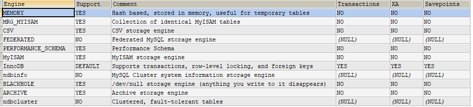

# 存储引擎

存储引擎就是指表的类型。

功能：接收上层传下来的指令，然后对表中的数据进行提取或者写入操作。

查看引擎：`show engines`



`XA`：是否支持分布式事务

创建表的时候可以指定存储引擎，如下：

```mysql
create table emp(id int) engine=InnoDB;
```

表创建好之后可以修改存储引擎（引擎名可以全部小写）：

```mysql
alter table emp engine=myisam;
```

## InnoDB：具备外键支持功能的事务存储引擎

- 5.5版本之后的默认存储引擎
- MySQL的默认`事务型引擎`，可以处理大量的短期（short-lived）事务，可以保证事务的完整提交和回滚
- 如果有大量的更新、删除操作，优先选择 InnoDB
- 数据文件结构：
	- `表名.frm` 存储表结构（8.0 时合并在`表名.ibd` 中）
	- `表名.ibd` 存储数据和索引
- 为处理巨大数据量的最大性能设计
- 相比 MyISAM，`InnoDB 写的效率差一些`，并且会占用更多的磁盘空间来保存数据和索引
- MyISAM 只缓存索引，不缓存真实数据；InnoDB 索引和真实数据都缓存，并且对内存要求较高，内存大小对性能有决定性的影响

## MyISAM：主要的非事务处理存储引擎

处理数据量比较小的

- `5.5版本之前的默认存储引擎`，提供大量特性，如全文索引、压缩、空间函数（GIS）等
- 不支持事务、行锁、外键，崩溃后无法安全恢复
- 优势是`访问的速度快`，适合对事务完整性没有要求或者以插入、查询为主的应用
- 针对数据统计有额外的常数存储。因此 `count(*)` 的查询的效率很高
- 数据文件结构
	- `表名.frm` 存储表结构
	- `表名.MYD` 存储数据（MYData）
	- `表名.MYI` 存储索引（MYIndex）
- 应用场景：只读应用或者以读为主的应用

<br/>

| 对比项 | MyISAM                                             | InnoDB                                           |
| ------ | -------------------------------------------------- | ------------------------------------------------ |
| 外键   | 不支持                                             | 支持                                             |
| 事务   | 不支持                                             | 支持                                             |
| 行表锁 | 表锁，即使操作一条记录也会锁住整个表，不适合高并发 | 行锁，操作时只锁某一行，不影响其他行，适合高并发 |
| 缓存   | 只缓存索引，不缓存真实数据                         | 索引和真实数据都缓存                             |
| 关注点 | 性能：节省资源、消耗少、简单事务                   | 事务：并发写、事务、更大资源                     |
