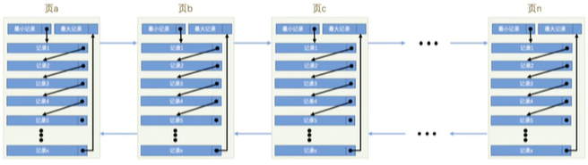
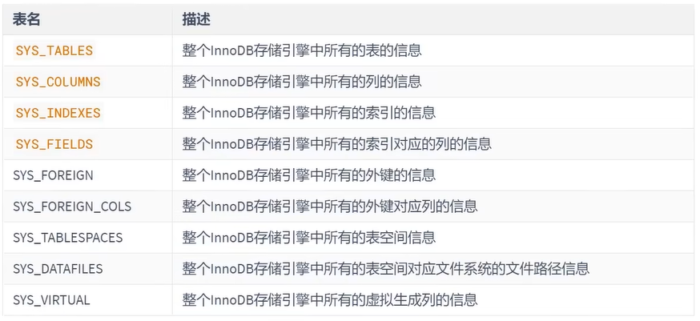
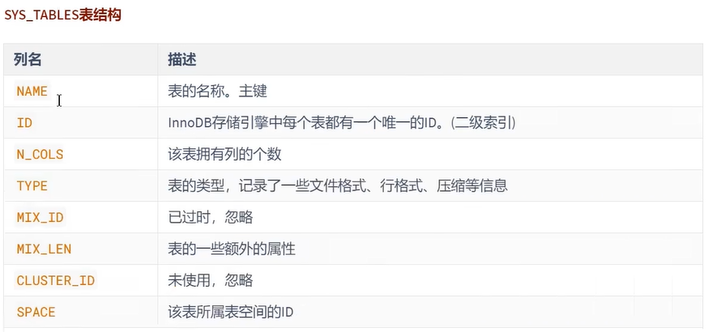
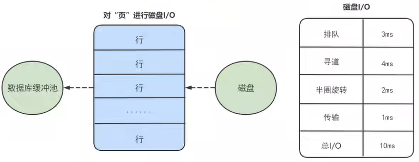

# InnoDB数据存储结构

## 1. 数据库的存储结构：页

索引结构给我们提供了高效的索引方式，不过索引信息以及数据记录都是保存在文件上的，确切说是存储在页结构中。另一方面，索引是在存储引擎中实现的，MySQL 服务器上的存储引擎负责对表中数据的读取和写入工作。不同存储引擎中存放的格式一般是不同的，甚至有的存储引擎比如 Memory 都不用磁盘来存储数据。

由于 InnoDB 是 MysQL 的默认存储引擎，所以本章剖析 InnoDB 存储引擎的数据存储结构。

### 1.1 磁盘与内存交互基本单位：页

lnnoDB 将数据划分为若干个页，InnoDB 中页的大小默认为**16KB**。

以**页**作为磁盘和内存之间交互的基本单位，也就是一次最少从磁盘中读取16KB的内容到内存中，一次最少把内存中的16KB内容刷新到磁盘中。也就是说，在数据库中，不论读一行，还是读多行，都是将这些行所在的页进行加载。也就是说，数据库管理存储空间的基本单位是页(Page)，数据 I/O 操作的最小单位是页。一个页中可以存储多个行记录。

> 记录是按照行来存储的，但是数据库的读取并不以行为单位，否则一次读取（也就是一次V/o操作）只能处理一行数据，效率会非常低。




### 1.2 页结构概述

页a、页b、页c...页n这些**页可以不在物理结构上相连**，只要通过**双向链表**相关联即可。每个数据页中的记录会按照**主键值从小到大**的顺序组成一个单向链表，每个数据页都会为存储在它里边的记录生成一个**页目录**，在通过主键查找某条记录的时候可以在页目录中使用**二分法**快速定位到对应的槽，然后再遍历该槽对应分组中的记录即可快速找到指定的记录。

### 1.3 页的大小

不同的数据库管理系统（简称 DBMS）的页大小不同。比如在 MySQL 的 InnoDB 存储引擎中，默认页的大小是 `16KB`，我们可以通过下面的命令来进行查看：

```mysql
show variables like '%innodb_page_size%'
```

SQL Server 中页的大小为 `8KB`，而在 Oracle 中我们用术语 "`块`" （Block）来表示 "页"，Oracle 支持的快大小为2KB, 4KB, 8KB, 16KB, 32KB 和 64KB。

### 1.4 页的上层结构

另外在数据库中，还存在着区（Extent）、段（Segment）和表空间（Tablespace）的概念。行、页、区、段、表空间的关系如下图所示：


区(Extent)是比页大一级的存储结构，在InnoDB存储引擎中，一个区会分配 64 个连续的页。因为InnoDB中的页大小默认是 16KB，所以一个区的大小是 64*16KB= 1MB。

段(Segment)由一个或多个区组成，区在文件系统是一个连续分配的空间(在 InnoDB 中是连续的 64 个页)，不过在段中不要求区与区之间是相邻的。**段是数据库中的分配单位**，**不同类型的数据库对象以不同的段形式存在**。当我们创建数据表、索引的时候，就会相应创建对应的段，比如创建一张表时会创建一个表段，创建一个索引时会创建一个索引段。

表空间(（Tablespace)是一个逻辑容器，表空间存储的对象是段，在一个表空间中可以有一个或多个段，但是一个段只能属于一个表空间。数据库由一个或多个表空间组成，表空间从管理上可以划分为**系统表空间、用户表空间、撤销表空间、临时表空间**等。

## 2. 页的内部结构

页如果按类型划分的话，常见的有 `数据页（保存B+树节点）、系统表、Undo 页 和 事物数据页` 等。数据页是我们最常使用的页。

数据页的 `16KB` 大小的存储空间被划分为七个部分，分别是文件头（File Header）、页头（Page Header）、最大最小记录（Infimum + supremum）、用户记录（User Records）、空闲空间（Free Space）、页目录（Page Directory）和文件尾（File Tailer）。

页结构的示意图如下所示：


如下表所示：


我们可以把这7个结构分为3个部分。

### 第一部分：File Header (文件头部) 和 File Trailer (文件尾部)

File Header：描述各种页的通用信息。（比如页的编号、其上一页、下一页是谁等）。38字节

- FIL_PAGE_OFFSET：页号。通过页号可以定位一个页，4 字节
- FIL_PAGE_TYPE：表示页的类型，2 字节
- FIL_PAGE_PREV 和 FIL_PAGE_NEXT：上一页，下一页，均 4 字节
- FIL_PAGE_SPACE_OR_CHKSUM：当前页面的校验和。通过比较复制后的页 B 的校验和和原来页面 A 的校验和，来判断页是否被修改。4 字节
- FIL_PAGE_LSN：页面被最后修改时对应的日志序列位置，4 字节

File Trailer：只有 FIL_PAGE_SPACE_OR_CHKSUM 和 FIL_PAGE_LSN

### 第二部分：User Records (用户记录)、最大最小记录、Free Space (空闲空间)


### 第三部分：Page Directory (页目录) 和 Page Header (页面头部)


### 2.3 从数据库页的角度看B+树如何查询

一颗B+树按照字节类型可以分为两部分：

1. 叶子节点，B+ 树最底层的节点，节点的高度为0，存储行记录。
2. 非叶子节点，节点的高度大于0，存储索引键和页面指针，并不存储行记录本身。


当我们从页结构来理解 B+ 树的结构的时候，可以帮我们理解一些通过索引进行检索的原理：


## 3. InnoDB行格式 (或记录格式)

见文件InnoDB数据库存储结构.mmap

## 4. 区、段与碎片区

### 4.1 为什么要有区？


### 4.2 为什么要有段？


### 4.3 为什么要有碎片区？


### 4.4 区的分类

区大体上可以分为4种类型：

* 空闲的区 (FREE) : 现在还没有用到这个区中的任何页面。
* 有剩余空间的碎片区 (FREE_FRAG)：表示碎片区中还有可用的页面。
* 没有剩余空间的碎片区 (FULL_FRAG)：表示碎片区中的所有页面都被使用，没有空闲页面。
* 附属于某个段的区 (FSEG)：每一个索引都可以分为叶子节点段和非叶子节点段。

处于FREE、FREE_FRAG 以及 FULL_FRAG 这三种状态的区都是独立的，直属于表空间。而处于 FSEG 状态的区是附属于某个段的。

> 如果把表空间比作是一个集团军，段就相当于师，区就相当于团。一般的团都是隶属于某个师的，就像是处于 FSEG 的区全部隶属于某个段，而处于 FREE、FREE_FRAG 以及 FULL_FRAG 这三种状态的区却直接隶属于表空间，就像独立团直接听命于军部一样。

## 5. 表空间


### 5.1 独立表空间

独立表空间，即每张表有一个独立的表空间，也就是数据和索引信息都会保存在自己的表空间中。独立的表空间 (即：单表) 可以在不同的数据库之间进行 `迁移`。

空间可以回收 (DROP TABLE 操作可自动回收表空间；其他情况，表空间不能自己回收) 。如果对于统计分析或是日志表，删除大量数据后可以通过：alter table TableName engine=innodb; 回收不用的空间。对于使用独立表空间的表，不管怎么删除，表空间的碎片不会太严重的影响性能，而且还有机会处理。

**独立表空间结构**

独立表空间由段、区、页组成。

**真实表空间对应的文件大小**

我们到数据目录里看，会发现一个新建的表对应的 .ibd 文件只占用了 96K，才6个页面大小 (MySQL5.7中)，这是因为一开始表空间占用的空间很小，因为表里边都没有数据。不过别忘了这些 .ibd 文件是自扩展的，随着表中数据的增多，表空间对应的文件也逐渐增大。

**查看 InnoDB 的表空间类型：**

```mysql
show variables like 'innodb_file_per_table'
```

你能看到 innodb_file_per_table=ON, 这就意味着每张表都会单词保存一个 .ibd 文件。

### 5.2 系统表空间

系统表空间的结构和独立表空间基本类似，只不过由于整个MySQL进程只有一个系统表空间，在系统表空间中会额外记录一些有关整个系统信息的页面，这部分是独立表空间中没有的。

**InnoDB数据字典**


删除这些数据并不是我们使用 INSERT 语句插入的用户数据，实际上是为了更好的管理我们这些用户数据而不得以引入的一些额外数据，这些数据页称为 元数据。InnoDB 存储引擎特意定义了一些列的 内部系统表 (internal system table) 来记录这些元数据：



这些系统表也称为 `数据字典`，它们都是以 B+ 树的形式保存在系统表空间的某个页面中。其中 `SYS_TABLES、SYS_COLUMNS、SYS_INDEXES、SYS_FIELDS` 这四个表尤其重要，称之为基本系统表 (basic system tables) ，我们先看看这4个表的结构：




注意：用户不能直接访问 InnoDB 的这些内部系统表，除非你直接去解析系统表空间对应文件系统上的文件。不过考虑到查看这些表的内容可能有助于大家分析问题，所以在系统数据库 `information_schema` 中提供了一些以 `innodb_sys` 开头的表:

```mysql
USE information_schema;
```

```mysql
SHOW TABLES LIKE 'innodb_sys%';
```

在 `information_scheme` 数据库中的这些以 `INNODB_SYS` 开头的表并不是真正的内部系统表 (内部系统表就是我们上边以 `SYS` 开头的那些表)，而是在存储引擎启动时读取这些以 `SYS` 开头的系统表，然后填充到这些以 `INNODB_SYS` 开头的表中。以 `INNODB_SYS` 开头的表和以 `SYS` 开头的表中的字段并不完全一样，但仅供大家参考已经足矣。

## 附录：数据页加载的三种方式

InnoDB从磁盘中读取数据 `最小单位` 是数据页。而你想得到的 id = xxx 的数据，就是这个数据页众多行中的一行。

对于MySQL存放的数据，逻辑概念上我们称之为表，在磁盘等物理层面而言是按 `数据页` 形式进行存放的，当其加载到 MySQL 中我们称之为 `缓存页`。

如果缓冲池没有该页数据，那么缓冲池有以下三种读取数据的方式，每种方式的读取速率是不同的：

**1. 内存读取**

如果该数据存在于内存中，基本上执行时间在 1ms 左右，效率还是很高的。


**2. 随机读取**




**3. 顺序读取**

