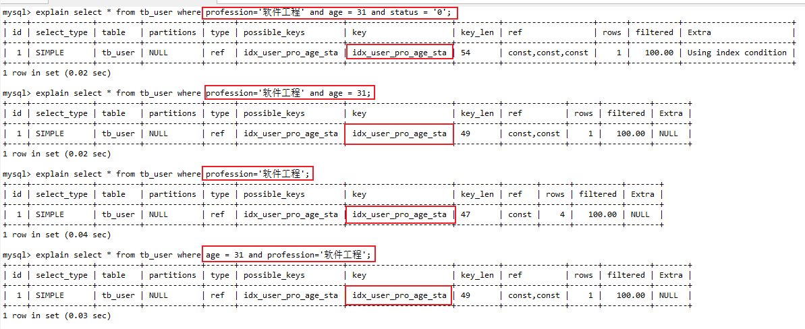
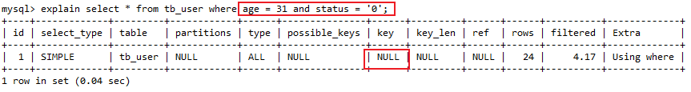
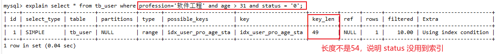
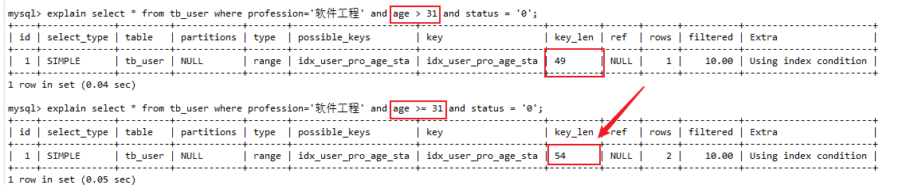
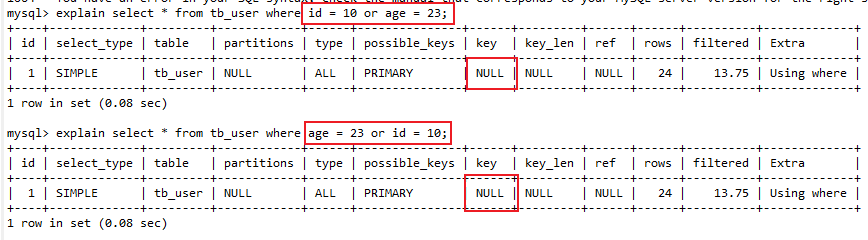
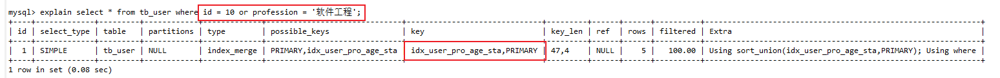

# 最左前缀法则

**联合索引**，要遵守最左前缀法则。最左前缀法则指的是查询从索引的最左列开始，并且不跳过索引中的列。如果跳跃某一列，索引将会部分失效(后面的字段索引失效)。

注意点：

- 索引列的顺序指的是创建索引时指定的顺序
- 必须包含最左边的索引列，不然失效
- 最左边的索引列存在就行，不需要管查询语句中的索引列的顺序
- 跳跃了某一列，该列及之后的索引字段都会失效
- 如果出现了范围查询，比如大于、小于这种，则右边的列索引失效
	- 解决方法：使用大于等于、小于等于

## 举例说明

### 建表语句

```mysql
CREATE TABLE `tb_user` (
  `id` int NOT NULL AUTO_INCREMENT COMMENT '主键',
  `name` varchar(50) NOT NULL COMMENT '用户名',
  `phone` varchar(11) NOT NULL COMMENT '手机号',
  `email` varchar(100) DEFAULT NULL COMMENT '邮箱',
  `profession` varchar(11) DEFAULT NULL COMMENT '专业',
  `age` tinyint unsigned DEFAULT NULL COMMENT '年龄',
  `gender` char(1) DEFAULT NULL COMMENT '性别 , 1: 男, 2: 女',
  `status` char(1) DEFAULT NULL COMMENT '状态',
  `createtime` datetime DEFAULT NULL COMMENT '创建时间',
  PRIMARY KEY (`id`),
  KEY `idx_user_pro_age_sta` (`profession`,`age`,`status`),
  KEY `idx_user_phone` (`phone`)
);

-- 然后随便插入几条数据即可
```

### 测试及截图

#### 符合规则的情况


```mysql
-- 以下语句都符合最左前缀法则
select * from tb_user where profession='软件工程' and age = 31 and status = '0';
select * from tb_user where profession='软件工程' and age = 31;
select * from tb_user where profession='软件工程';
-- 乱序也能走索引, 同样符合最左前缀法则
select * from tb_user where age = 31 and profession='软件工程';
```



#### 索引失效的情况

```mysql
select * from tb_user where age = 31 and status = '0';
```



#### 部分失效的情况

```mysql
-- status 部分的索引失效
select * from tb_user where profession='软件工程' and age > 31 and status = '0';
```



但是修改为大于等于就能用到全部的索引

```mysql
select * from tb_user where profession='软件工程' and age >= 31 and status = '0';
```



# 索引失效的情况

## 索引列运算

```mysql
select * from tb_user where substring(phone,10,2) = '15';
```

## 数据类型转换

比如，字符串类型的数据查询的时候查询条件不加引号

```mysql
-- status 数据类型是字符串
select * from tb_user where profession='软件工程' and age = 31 and status = 0;
```

## 头部模糊查询

尾部模糊匹配，索引不会失效。

**头部模糊匹配，索引失效**（前面加百分号）

## or 连接

用 or 分割开的条件， 如果 or 条件中的列一侧有索引，一侧没有索引，那么涉及的索引都不会被用到

```mysql
select * from tb_user where id = 10 or age = 23;
select * from tb_user where age = 23 or id = 10;
```



```mysql
select * from tb_user where id = 10 or profession = '软件工程';-- 这个会走索引, 因为两侧都有索引
```



## 数据分布影响

MySQL在查询时，会评估使用索引的效率与走全表扫描的效率，如果走全表扫描更快，则放弃索引，走全表扫描。

因为索引是用来索引少量数据的，如果通过索引查询返回大批量的数据，则还不如走全表扫描来的快，此时索引就会失效