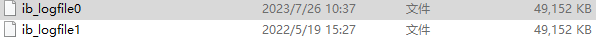
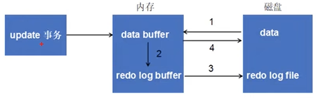
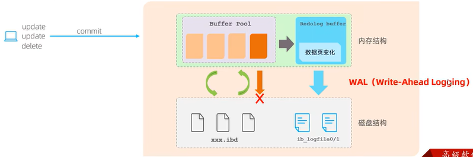
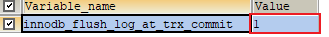
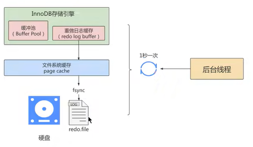
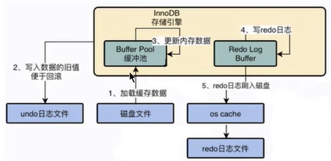

# undo日志和redo日志

事务有4种特性：原子性、一致性、隔离性和持久性。那么事务的四种特性到底是基于什么机制实现呢？

- 事务的隔离性由 锁机制 实现。

- 而事务的原子性、一致性和持久性由事务的 redo 日志和undo 日志来保证。
  - REDO LOG 称为 重做日志 ，提供再写入操作，恢复提交事务修改的页操作，用来保证事务的持久性。
  - UNDO LOG 称为 回滚日志 ，回滚行记录到某个特定版本，用来保证事务的原子性、一致性


redo log 记录的是物理级别上的页修改操作，比如页号xxx，偏移量yyy写入了`zzz`数据。主要是保证数据的可靠性

> 记录事务提交时数据页的物理修改，用来实现事务的持久性
>
> 如果发生错误，可以用来恢复数据

undo log 是逻辑操作日志，比如对某一行进行了插入操作、修改操作等。主要用于事务的回滚和一致性非锁定读（如MVCC）

## redo日志

> Windows 下数据文件夹`C:\ProgramData\MySQL\MySQL Server 8.0\Data`

InnoDB存储引擎是以页为单位来管理存储空间的。在真正访问页面之前，需要把在磁盘上的页缓存到内存中的Buffer Pool之后才可以访问。所有的变更都必须先更新缓冲池中的数据，然后缓冲池中的脏页会以一定的频率被刷入磁盘（ checkPoint机制)，通过缓冲池来优化CPu和磁盘之间的鸿沟，这样就可以保证整体的性能不会下降太快。

### 为什么需要redo日志

一方面，缓冲池可以帮助我们消除CPU和磁盘之间的鸿沟，checkpoint机制可以保证数据的最终落盘，然而由于checkpoint 并不是每次变更的时候就触发 的，而是master线程隔一段时间去处理的。所以最坏的情况就是事务提交后，刚写完缓冲池，数据库宕机了，那么这段数据就是丢失的，无法恢复。

另一方面，事务包含 **持久性** 的特性，就是说对于一个已经提交的事务，在事务提交后即使系统发生了崩溃，这个事务对数据库中所做的更改也不能丢失。

那么如何保证这个持久性呢？ 一个简单的做法 ：在事务提交完成之前把该事务所修改的所有页面都刷新到磁盘，但是这个简单粗暴的做法有些问题

- 每修改一次就刷新到磁盘，有点大题小做了，浪费资源
- 一条语句可能修改多个页，在物理磁盘上有可能不是连续的，产生随机 IO 现象，成本太高

另一个解决的思路 ：我们只是想让已经提交了的事务对数据库中数据所做的修改永久生效，即使后来系统崩溃，在重启后也能把这种修改恢复出来。所以我们其实没有必要在每次事务提交时就把该事务在内存中修改过的全部页面刷新到磁盘，只需要把 修改 了哪些东西 记录一下 就好。比如，某个事务将系统表空间中 第10号 页面中偏移量为 100 处的那个字节的值 1 改成 2 。我们只需要记录一下：将第0号表空间的10号页面的偏移量为100处的值更新为 2 。

InnoDB 存储引擎的事务采用 `Write-Ahead Logging（WAL）`，也就是先写日志，再写磁盘。只有日志写入成功，才算事务提交成功，这个日志就是 redo log。当发生宕机且数据未刷到磁盘的时候，可以通过 redo log 来恢复，保证 ACID 中的 D，这就是redo log 的作用。

### redo日志的好处、特点

好处：

1. 降低了刷盘频率
2. 日志文件占有空间很小（只存储表空间 ID，页号，偏移量以及需要更新的值）

特点：

1. redo log 是**顺序写入磁盘**的。在执行事务的过程中，每执行一条语句，就可能产生若干条 redo 日志，这些日志是按照产生的顺序写入磁盘的，也就是使用顺序 IO，效率比随机 IO 快。（日志是追加到文件的，是顺序 IO）
2. 事务执行过程中，redo log 不断记录页面修改操作。

> redo log 跟 bin log 的区别，redo log 是**存储引擎层**产生的，而 bin log 是**数据库层**产生的。假设一个事务，对表做10万行的记录插入，在这个过程中，一直不断的往 redo log 顺序记录，而 bin log 不会记录，直到这个事务提交，才会一次写入到 bin log 文件中。

### redo的组成

redo log 可以简单分为以下两个部分：

- 重做日志缓冲区 (redo log buffer) ，保存在内存中，是易失的。

redo log buffer 大小，默认 16M ，最大值是4096M，最小值为1M。

查看命令：

```sql
show variables like '%innodb_log_buffer_size%';
```

> 自己的win10电脑查出来是1M


- 重做日志文件（redo log file），保存在磁盘上



> 这两个文件是提前占好空间，用的时候再改，而且是循环使用的

### 整体流程



```
第1步：先将原始数据从磁盘中读入内存中来，修改数据的内存拷贝
第2步：生成一条重做日志并写入redo log buffer，记录的是数据被修改后的值
第3步：当事务commit时，将redo log buffer中的内容刷新到 redo log file，对 redo log file采用追加
写的方式
第4步：定期将内存中修改的数据刷新到磁盘中
```

另外一个示意图：



### redo log 刷盘策略

redo log 并不是直接写入磁盘的，而是先写 redo log buffer，之后**以一定的频率**刷入到真正的 redo log file。这里的频率就是刷盘策略。

注意,redo log buffer 刷盘到 redo log file 的过程并不是真正的刷到磁盘中去，只是刷入到文件系统缓存（page cache)中去(这是现代操作系统为了提高文件写入效率做的一个优化)，真正的写入会交给系统自己来决定(比如page cache足够大了)。那么对于 InnoDB 来说就存在一个问题，如果交给系统来同步，同样如果系统宕机，那么数据也丢失了（虽然整个系统宕机的概率还是比较小的)。

针对这种情况，InnoDB 给出 `innodb_flush_log_at_trx_commit` 参数，该参数控制 commit 提交事务时，如何将 redo log buffer 中的日志刷新到 redo log file 中。它支持三种策略:

- 0：表示每次事务提交时不进行刷盘操作。(系统默认 master thread 每隔 1s 进行一次重做日志的同步)
- 1：表示每次事务提交时都将进行同步，刷盘操作。**默认值**
- 2：表示每次事务提交时都只把 redo log buffer 内容写入 page cache，不进行同步。由 os 自己决定什么时候同步到磁盘文件

```sql
show variables like '%innodb_flush_log_at_trx_commit%';
```



此外，InnoDB 有一个后台线程，1秒同步一次数据



默认为1，保证只要提交了事务，redo log 就一定记录在磁盘中，不会出现数据丢失


## undo log




作用：

- 解决事务原子性
- 记录的是逻辑操作（不记录查询操作）
- 是更新数据之前的前置操作，记录的是旧数据
- 用来支持事务的回滚和 MVCC

<br/>

insert 的时候，InnoDB 会完成一个 delete；delete 的时候，InnoDB 会完成一个 insert；update 的时候，会记录修改之前的数据

此外，undo log 会产生 redo log，也就是undo log的产生会伴随着redo log的产生，这是因为undo log也需要持久性的保护。

## binlog

二进制日志，记录了DDL（数据定义语言）和DML（数据操纵语言），但是不包括查询语句

> 记录了数据库的表结构，以及对数据的修改操作

- 用于灾难时的数据恢复
- 用于主从复制


查看日志文件的语句：

```bash
mysqlbinlog [options] log-files1 log-files2 ...

选项 ：
-d, --database=name 指定数据库名称，只列出指定的数据库相关操作。
-o, --offset 忽略掉日志中的前n行命令。
-v 将行时间（数据变更）转变成 SQL 语句
-vv 将行时间（数据变更）转变成 SQL 语句, 同时输出注释信息
```


主从复制的过程：

1. Master 主库在事务提交时，会把数据变更记录在二进制日志文件 Binlog 中
2. 从库读取主库的二进制日志文件 Binlog ，写入到从库的中继日志 Relay Log 
3. slave重做中继日志中的事件，将改变反映它自己的数据。


