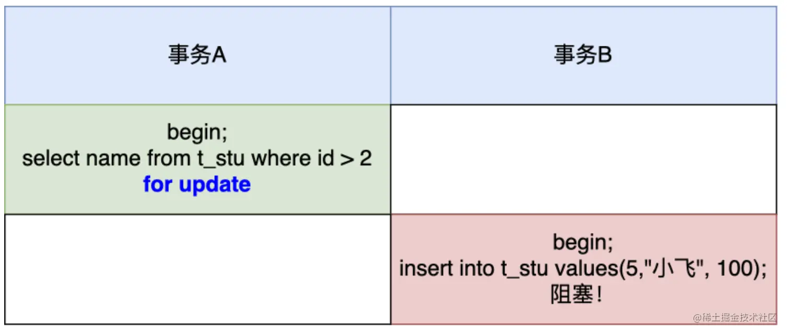

# 多版本并发控制

简称MVCC

## 什么是MVCC

通过数据行的多个版本管理（undo log）来实现数据库的并发控制。

使得在 InnoDB 的事务隔离级别下执行**一致性读**操作有了保证 。

MySQL 的其他存储引擎不支持MVCC

> 可以查询到正在被另一个事务更新的行，而且能看到更新之前的值。

## 快照读和当前读

MVCC 在MySQL InnoDB 中的实现主要是为了提高数据库并发性能，用更好的方式去**处理读-写冲突**，做到即使有读写冲突时，也能做到不加锁，非阻塞并发读，而这个读指的就是快照读，而非当前读。当前读实际上是一种加锁的操作，是悲观锁的实现。而 MVCC 本质是采用乐观锁思想的一种方式。

### 快照读（普通读）

快照读又叫一致性读，读取的是快照数据。不加锁的简单的 SELECT 都属于快照读。比如这样：

```sql
SELECT * FROM player WHERE ...
```

之所以出现快照读的情况，是基于提高并发性能的考虑，快照读的实现是基于MVCC，它在很多情况下，避免了加锁操作，降低了开销。

既然是基于多版本，那么快照读可能读到的并不一定是数据的最新版本，而有可能是之前的历史版本。

快照读的前提是隔离级别不是串行级别，串行级别下的快照读会退化成当前读。

### 当前读

当前读读取的是记录的最新版本，读取时还要保证其他并发事务不能修改当前记录，会对读取的记录进行加锁。

加锁的 SELECT，或者对数据进行增删改都会进行当前读。比如：

```sql
INSERT INTO student values ... # 排他锁

SELECT * FROM student LOCK IN SHARE MODE; # 共享锁
```


## 事务的隔离级别


在MySQL中，默认的隔离级别是可重复读，可以解决脏读和不可重复读的问题，如果仅从定义的角度来看，它并不能解决幻读问题。如果我们想要解决幻读问题，就需要采用串行化的方式，也就是将隔离级别提升到最高，但这样一来就会大幅降低数据库的事务并发能力。

MVCC可以不采用锁机制，而是通过乐观锁的方式来解决不可重复读和幻读问题。它可以在大多数情况下替代行级锁，降低系统的开销。


回顾一下undo日志的版本链，对于使用 InnoDB 存储引擎的表来说，它的聚簇索引记录中都包含两个必要的隐藏列：

`trx_id` ：每次一个事务对某条聚簇索引记录进行改动时，都会把该事务的 事务id 赋值给trx_id 隐藏列。

`roll_pointer` ：每次对某条聚簇索引记录进行改动时，都会把旧的版本写入到 undo日志 中，然后这个隐藏列就相当于一个指针，可以通过它来找到该记录修改前的信息。

## MVCC 实现原理之 ReadView

MVCC 的实现依赖于：隐藏字段、Undo Log、Read View

### 什么是ReadView

在MVCC机制中，多个事务对同一个行记录进行更新会产生多个历史快照，这些历史快照保存在Undo Log里。如果一个事务想要查询这个行记录，需要读取哪个版本的行记录呢？这时就需要用到ReadView了，它帮我们解决了行的可见性问题。

ReadView就是事务在使用MVCC机制进行快照读操作时产生的读视图。当事务启动时，会生成数据库系统当前的一个快照，InnoDB为每个事务构造了一个数组，用来记录并维护系统当前活跃事务的ID（“活跃"指的就是，启动了但还没提交）

> 一个事务对应一个ReadView

### 设计思路

使用 READ UNCOMMITTED 隔离级别的事务，由于可以读到未提交事务修改过的记录（脏读），所以直接读取记录的最新版本就好了。

使用 SERIALIZABLE 隔离级别的事务，InnoDB规定使用加锁的方式来访问记录。

使用 READ COMMITTED 和 REPEATABLE READ 隔离级别的事务，都必须保证读到 已经提交了的 事务修改过的记录。假如另一个事务已经修改了记录但是尚未提交，是不能直接读取最新版本的记录的，核心问题就是需要判断一下版本链中的哪个版本是当前事务可见的，这是ReadView要解决的主要问题。


这个ReadView中主要包含4个比较重要的内容，分别如下：
1. `creator_trx_id` ，创建这个 Read View 的事务 ID。

  > 说明：只有在对表中的记录做改动时（执行INSERT、DELETE、UPDATE这些语句时）才会为
  > 事务分配事务id，否则在一个只读事务中的事务id值都默认为0。

2. `trx_ids` ，表示在生成ReadView时当前系统中活跃的读写事务的 事务id列表 。

3. `up_limit_id` ，活跃的事务中最小的事务 ID。（局部最小值）

4. `low_limit_id` ，表示生成ReadView时系统中应该分配给下一个事务的 id 值。low_limit_id 是系
    统最大的事务id值，这里要注意是系统中的事务id，需要区别于正在活跃的事务ID。（生成ReadView时的全局最大值+1）

  > 注意：low_limit_id并不是trx_ids中的最大值，事务id是递增分配的。比如，现在有id为1，2，3这三个事务，之后id为3的事务提交了。那么一个新的读事务在生成ReadView时，trx_ids就包括1和2，up_limit_id的值就是1，low_limit_id的值就是4。


### ReadView 规则（面试常问）

> 不能访问后来的视图，不能访问除自己之外的活跃的事务

有了这个ReadView，这样在访问某条记录时，只需要按照下边的步骤判断记录的某个版本是否可见。

（1）如果被访问版本的 trx_id 属性值与ReadView中的 creator_trx_id 值相同，意味着当前事务在访问它自己修改过的记录，所以该版本可以被当前事务访问。

（2）如果被访问版本的trx_id属性值小于ReadView中的 up_limit_id 值，表明生成该版本的事务在当前事务生成ReadView前已经提交，所以该版本可以被当前事务访问。

（3）如果被访问版本的trx_id属性值大于或等于ReadView中的 low_limit_id 值，表明生成该版本的事务在当前事务生成ReadView后才开启，所以该版本不可以被当前事务访问。

（4）如果被访问版本的trx_id属性值在ReadView的 up_limit_id 和 low_limit_id 之间，那就需要判断一下trx_id属性值是不是在 trx_ids 列表中。

如果在，说明创建ReadView时生成该版本的事务还是活跃的，该版本不可以被访问。

如果不在，说明创建ReadView时生成该版本的事务已经被提交，该版本可以被访问

> 在活跃列表里面的不能用；大于生成ReadView时的全局最大事务ID的不能用


###  MVCC整体操作流程

了解了这些概念之后，我们来看下当查询一条记录的时候，系统如何通过MVCC找到它：

1. 首先获取事务自己的版本号，也就是事务 ID；

2. 获取 ReadView；

3. 查询得到的数据，然后与 ReadView 中的事务版本号进行比较；

4. 如果不符合 ReadView 规则，就需要从 Undo Log 中获取历史快照；

5. 最后返回符合规则的数据。


如果某个版本的数据对当前事务不可见的话，那就顺着版本链找到下一个版本的数据，继续按照上边的步骤判断可见性，依此类推，直到版本链中的最后一个版本。如果最后一个版本也不可见的话，那么就意味着该条记录对该事务完全不可见，查询结果就不包含该记录。

> InnoDB 中，MVCC是通过Undo Log + Read View进行数据读取，Undo Log保存了历史快照，而Read View规则帮我们判断当前版本的数据是否可见。


在隔离级别为读已提交（Read Committed）时，一个事务中的每一次 SELECT 查询都会重新获取一次Read View。

> 此时同样的查询语句都会重新获取一次 Read View，这时如果 Read View 不同，就可能产生
> 不可重复读或者幻读的情况。

当隔离级别为可重复读的时候，就避免了不可重复读，这是因为一个事务只在第一次 SELECT 的时候会获取一次 Read View，而后面所有的 SELECT 都会**复用这个 Read View**


## 幻读问题

### 定义

幻读：事务A根据某个SQL语句查询了一些记录，之后事务B**添加**了几条满足这个SQL条件的记录，A再次查询，会发现多了几条记录，好像产生了幻觉

> 不可重复读是同一个记录的数据内容被修改了，幻读是数据行记录变多了
>
> 幻读强调再次读取的时候读取到了以前没有的记录，如果记录变少了，不属于幻读

### 如何解决幻读问题？

（1）普通读的话使用MVCC，也就是设置隔离级别为可重复读。因为在可重复读的隔离级别下，因为MVCC机制，只会在第一次查询的时候产生一个ReadView，后面的全部复用这个ReadView

> 可能会出现事务A查询主键ID是1的记录，没有，然后A准备插入主键ID是1的记录。但是这时候，事务B先一步插入主键ID是1的记录。事务A再插入，会提示主键冲突。但是事务A是查不到这条记录的
>
> 解决方法：`next-key lock`

（2）当前读通过 `next-key lock`（行锁X+间隙锁GAP）方式解决了幻读

### 当前读是如何避免幻读的？

普通读（快照读）实际上读取的是历史版本中的数据，但一直用这种方式读取在某些场景下是有问题的。

假设你要 update 一个记录，但是另一个事务已经 delete 这条记录并且提交事务了，这样不是会产生冲突吗，所以 update 的时候肯定要知道最新的数据。也就是要做当前读。

那么针对当前读，MySQL在可重复读隔离级别下是如何避免幻读的呢？

MySQL InnoDB引擎为了解决可重复读隔离级别使用当前读而造成的幻读问题，引入了间隙锁。

> 在当前读的时候，对这段区间都加上锁，让别的事务阻塞，无法插入。

表中有一个范围 id 为（3，5）间隙锁，那么其他事务就无法插入 id = 4 这条记录了，这样就有效的防止幻读现象的发生。

举个例子：




- 事务A的for_update是属于当前读，它会对锁定 id 范围 (2, +∞)，相当于理解是间隙锁。

- 事务B插入了id=5的数据，(2, +∞) 范围被锁定了，所以无法插入，阻塞。

- 通过这种加锁阻塞的方式，也可以避免幻读。

小结： 针对当前读（select ... for update 等语句），是通过 `next-key lock`（记录锁+间隙锁）方式解决了幻读。

## 总结

MVCC 只在RC（读提交）和RR（可重复读）下才有效。

采用了乐观锁
