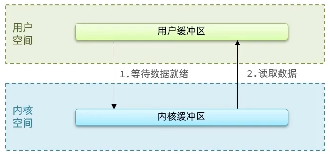
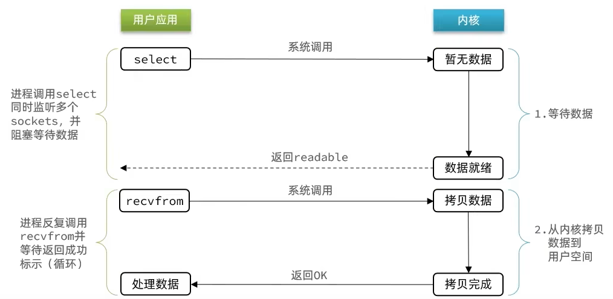
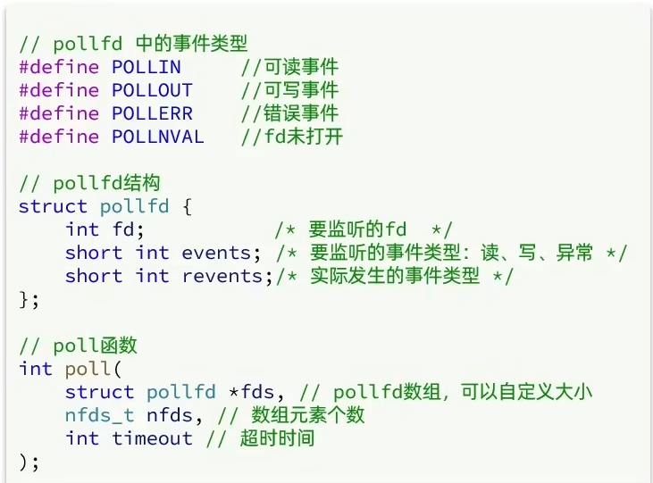
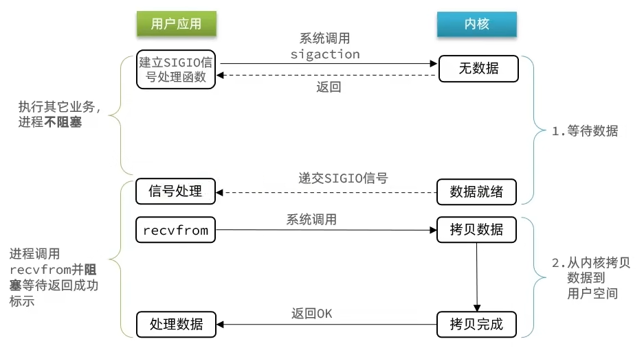
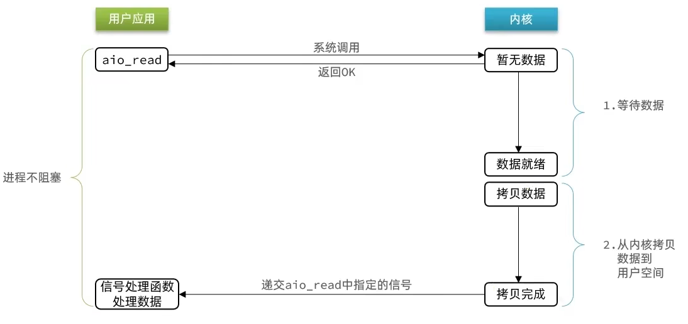

# IO网络模型

在《UNIX网络编程》一书中，总结归纳了5种IO模型：

* 阻塞IO（Blocking IO）
* 非阻塞IO（Nonblocking IO）
* IO多路复用（IO Multiplexing）
* 信号驱动IO（Signal Driven IO）
* 异步IO（Asynchronous IO）

应用程序想要去读取数据，他是无法直接去读取磁盘数据的，他需要先到内核里边去等待内核操作硬件拿到数据，这个过程就是1，是需要等待的，等到内核从磁盘上把数据加载出来之后，再把这个数据写给用户的缓存区，这个过程是2，如果是阻塞IO，那么整个过程中，用户从发起读请求开始，一直到读取到数据，都是一个阻塞状态。



## 阻塞IO


在内核的等待数据阶段和数据拷贝到用户空间这两个阶段，用户进程都是**阻塞**的

用户去读取数据时，会去先发起recvform一个命令，去尝试从内核上加载数据，如果内核没有数据，那么用户就会等待，此时内核会去从硬件上读取数据，内核读取数据之后，会把数据拷贝到用户态，并且返回ok，整个过程，都是阻塞等待的，这就是阻塞IO

**阶段一：**

- 用户进程尝试读取数据（比如网卡数据）
- 此时数据尚未到达，内核需要等待数据
- 此时用户进程也处于阻塞状态

**阶段二：**

* 数据到达并拷贝到内核缓冲区，代表已就绪
* 将内核数据拷贝到用户缓冲区
* 拷贝过程中，用户进程依然阻塞等待
* 拷贝完成，用户进程解除阻塞，处理数据

## 非阻塞IO


非阻塞IO的**recvfrom操作会立即返回结果**而不是阻塞用户进程

阶段一：

* 用户进程尝试读取数据（比如网卡数据）
* 此时数据尚未到达，内核需要等待数据
* 返回异常给用户进程
* 用户进程拿到error后，再次尝试读取
* 循环往复，直到数据就绪

阶段二：

* 将内核数据拷贝到用户缓冲区
* 拷贝过程中，用户进程依然阻塞等待
* 拷贝完成，用户进程解除阻塞，处理数据
* 可以看到，非阻塞IO模型中，用户进程在第一个阶段是非阻塞，第二个阶段是阻塞状态。虽然是非阻塞，但性能并没有得到提高。而且忙等机制会导致CPU空转，CPU使用率暴增。

> 阶段二仍然是阻塞的
>
> 阶段一的忙等待机制，可能会增大CPU利用率

## IO多路复用

无论是阻塞IO还是非阻塞IO，用户应用在一阶段都需要调用recvfrom来获取数据，差别在于无数据时的处理方案：

- 如果调用recvfrom时，恰好没有数据，阻塞IO会使CPU阻塞，非阻塞IO使CPU空转，都不能充分发挥CPU的作用。
- 如果调用recvfrom时，恰好有数据，则用户进程可以直接进入第二阶段，读取并处理数据

所以怎么看起来以上两种方式性能都不好

而在单线程情况下，只能依次处理IO事件，如果正在处理的IO事件恰好未就绪（数据不可读或不可写），线程就会被阻塞，所有IO事件都必须等待，性能自然会很差。

要提高效率有几种办法？

方案一：增加更多服务员（多线程）

方案二：不排队，谁想好了吃什么（数据就绪了），服务员就给谁点餐（用户应用就去读取数据）

那么问题来了：用户进程如何知道内核中数据是否就绪呢？

文件描述符（File Descriptor）：简称FD，是一个从0 开始的无符号整数，用来关联Linux中的一个文件。在Linux中，一切皆文件，例如常规文件、视频、硬件设备等，当然也包括网络套接字（Socket）。

IO多路复用：利用一个线程监听多个FD，并在某个FD可读、可写时得到通知，从而避免无效的等待，充分利用CPU资源。

以 select 函数举例：

当用户去读取数据的时候，不再去直接调用recvfrom了，而是调用select的函数，select函数会将需要监听的数据交给内核，由内核去检查这些数据是否就绪了，如果说这个数据就绪了，就会通知应用程序数据就绪，然后来读取数据，再从内核中把数据拷贝给用户态，完成数据处理，如果N多个FD一个都没处理完，此时就进行等待。




用IO复用模式，可以确保去读数据的时候，数据是一定存在的，他的效率比原来的阻塞IO和非阻塞IO性能都要高

三种模式：select、poll，epoll

select和poll只会通知用户进程有FD就绪，但不会告诉你是哪几个FD，需要用户进程逐个遍历来确定哪个FD就绪

而epoll，则相当于内核准备好了之后，会把具体哪几个FD就绪了告诉用户进程

### select


能监听1024个FD

具体流程：

- 创建` fd_set`，并把要监听的`fd`对应的比特位设为1
- 调用`select`函数，并把`fd_set`拷贝到内核空间
- 内核先遍历一次`fd_set`，查看被标记的`fd`是否就绪。如果都没有就绪，则等待（等待超时或者数据就绪被唤醒）；如果有就绪的，直接返回
- 内核监听这个`fd_set`（遍历`fd_set`），如果对应位置上的`fd`就绪，则置为1，没有就绪则置为0
- 把`fd_set`拷贝到用户空间，并告知用户进程有几个`fd`就绪
- 用户空间遍历`fd_set`，找到真正就绪的`fd`

### poll




监听的FD理论上无限，其余同select

IO流程：

* 创建pollfd数组，向其中添加关注的fd信息，数组大小自定义
* 调用poll函数，将pollfd数组拷贝到内核空间，转链表存储，无上限
* 内核遍历fd，判断是否就绪
* 数据就绪或超时后，拷贝pollfd数组到用户空间，返回就绪fd数量n
* 用户进程判断n是否大于0,大于0则遍历pollfd数组，找到就绪的fd

### epoll


> linux内核2.6.8引入
>
> 源码：https://elixir.bootlin.com/linux/v2.6.8/source/fs/eventpoll.c

epoll模式是对select和poll的改进，它提供了三个函数：

1、第一个是`epoll_create`，用来创建`eventpoll`结构体的实例，并返回对应的文件描述符`epfd`

`eventpoll`结构体，他内部主要包含两个东西：

（1）红黑树：记录要监听的FD

（2）一个是链表，记录就绪的FD

```c
struct eventpoll {
	// 省略其他代码

	/* List of ready file descriptors */
	struct list_head rdllist;// 已经就绪的FD

	/* RB-Tree root used to store monitored fd structs */
	struct rb_root rbr;// 所有要监听的FD
};
```


> 还有一个在调用过程中产生的链表（txlist，transfer  list），txlist 会收集就绪列表中那些准备好的FD，同时将FD从就绪列表中断开链接
>
> 当把就绪的FD拷贝到events数组之后，还会对这个txlist做一个判断，看看那些FD需要再次被放入就绪链表中
>
> 具体参考：[`ep_events_transfer`函数](https://elixir.bootlin.com/linux/v2.6.8/source/fs/eventpoll.c#L1435)

2、紧接着调用`epoll_ctl`操作，将要监听的`fd`添加到红黑树上去，并且给每个`fd`设置一个监听函数，这个函数会在`fd`数据就绪时触发（就是数据如果准备好了，就把`fd`把数据添加到`rdllist`中去）

3、调用`epoll_wait`函数

在用户态创建一个空的events数组，用来接收就绪的FD

内核态去检查`rdllist`，当然这个过程需要参考配置的等待时间，可以等一定时间，也可以一直等， 如果在此过程中，检查到了`rdllist`中有了就绪的FD，将就绪的FD放入到events数组中，并且返回就绪FD的数量，用户态收到响应后，从events中拿到对应准备好的数据的节点，再去调用方法去拿数据。

小总结：

select模式存在的三个问题：

* 能监听的FD最大不超过1024
* 每次select都需要把所有要监听的FD都拷贝到内核空间
* 每次都要遍历所有FD来判断就绪状态

poll模式的问题：

* poll利用链表解决了select中监听FD上限的问题，但依然要遍历所有FD，如果监听较多，性能会下降

epoll模式中如何解决这些问题的？

* 基于epoll实例中的红黑树保存要监听的FD，理论上无上限，而且增删改查效率都非常高
* 每个FD只需要执行一次`epoll_ctl`添加到红黑树，以后每次`epol_wait`无需传递任何参数，无需重复拷贝FD到内核空间
* 利用`ep_poll_callback`机制来监听FD状态，无需遍历所有FD，因此性能不会随监听的FD数量增多而下降

### epoll中的ET和LT

当FD有数据可读时，我们调用epoll_wait（或者select、poll）可以得到通知。但是事件通知的模式有两种：

* LevelTriggered：简称LT，也叫做水平触发。只要某个FD中有数据可读，每次调用epoll_wait都会得到通知。
* EdgeTriggered：简称ET，也叫做边沿触发。只有在某个FD有状态变化时，调用epoll_wait才会被通知。

举个栗子：

① 假设一个客户端socket对应的FD已经注册到了epoll实例中

② 客户端socket发送了2kb的数据

③ 服务端调用epoll_wait，得到通知说FD就绪

④ 服务端从FD读取了1kb数据

⑤ 回到步骤3（再次调用epoll_wait，形成循环）

结论：

如果我们采用LT模式，因为FD中仍有1kb数据，则第⑤步依然会返回结果，并且得到通知

如果我们采用ET模式，因为第③步已经消费了FD可读事件，第⑤步FD状态没有变化，因此epoll_wait不会返回，数据无法读取，客户端响应超时。

## 信号驱动




信号驱动IO是与内核建立SIGIO的信号关联并设置回调，当内核有FD就绪时，会发出SIGIO信号通知用户，期间用户应用可以执行其它业务，无需阻塞等待。

阶段一：

* 用户进程调用sigaction，注册信号处理函数
* 内核返回成功，开始监听FD
* 用户进程不阻塞等待，可以执行其它业务
* 当内核数据就绪后，回调用户进程的SIGIO处理函数

阶段二：

* 收到SIGIO回调信号
* 调用recvfrom，读取
* 内核将数据拷贝到用户空间
* 用户进程处理数据

当有大量IO操作时，信号较多，SIGIO处理函数不能及时处理可能导致信号队列溢出，而且内核空间与用户空间的频繁信号交互性能也较低。

## 异步IO




这种方式，不仅仅是用户态在试图读取数据后，不阻塞，而且当内核的数据准备完成后，也不会阻塞

他会由内核将所有数据处理完成后，由内核将数据写入到用户态中，然后才算完成，所以性能极高，不会有任何阻塞，全部都由内核完成，可以看到，异步IO模型中，用户进程在两个阶段都是非阻塞状态。

## 对比


