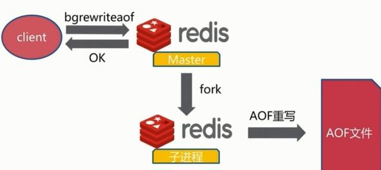

# Redis学习笔记

- [Redis学习笔记](#redis学习笔记)
- [参考文献](#参考文献)
- [NoSQL概述](#nosql概述)
  - [网站演进](#网站演进)
  - [为什么要用 NoSQL?](#为什么要用-nosql)
  - [什么是NoSQL?](#什么是nosql)
  - [四大分类](#四大分类)
  - [优点](#优点)
  - [阿里巴巴演进](#阿里巴巴演进)
- [Redis](#redis)
  - [概述](#概述)
  - [安装](#安装)
    - [windows安装](#windows安装)
    - [Linux 安装](#linux-安装)
  - [测试性能](#测试性能)
  - [一些命令](#一些命令)
- [五大数据类型](#五大数据类型)
  - [String字符串](#string字符串)
  - [List列表](#list列表)
  - [Set（集合）](#set集合)
  - [Hash（哈希表）](#hash哈希表)
  - [ZSet（有序集合）](#zset有序集合)
- [三大特殊数据类型](#三大特殊数据类型)
  - [Geospatial](#geospatial)
  - [Bitmaps](#bitmaps)
  - [Hyperloglogs](#hyperloglogs)
- [事务](#事务)
  - [基本概念](#基本概念)
  - [事务如何执行？](#事务如何执行)
  - [为什么 Redis 不支持回滚（roll back）](#为什么-redis-不支持回滚roll-back)
- [锁](#锁)
  - [Redis 可以实现乐观锁吗？](#redis-可以实现乐观锁吗)
- [Jedis](#jedis)
- [SpringBoot 整合](#springboot-整合)
  - [Spring Data Redis](#spring-data-redis)
  - [使用](#使用)
  - [自定义序列化](#自定义序列化)
- [redis.conf 详解](#redisconf-详解)
- [持久化](#持久化)
  - [为什么要持久化？](#为什么要持久化)
  - [RDB（Redis DataBase）](#rdbredis-database)
    - [RDB优点](#rdb优点)
    - [RDB缺点](#rdb缺点)
  - [AOF（Append Only File）](#aofappend-only-file)
- [发布订阅](#发布订阅)
  - [Redis 发布订阅命令](#redis-发布订阅命令)
- [主从复制](#主从复制)
  - [概述](#概述-1)
    - [主从复制的作用](#主从复制的作用)
    - [为什么要主从复制？](#为什么要主从复制)
  - [配置](#配置)
    - [如果主机断了会发生什么？](#如果主机断了会发生什么)
  - [哨兵模式](#哨兵模式)
    - [怎么投票的？](#怎么投票的)
  - [主从复制的模型](#主从复制的模型)

# 参考文献

>   -   [1] 狂神B站视频：https://www.bilibili.com/video/BV1S54y1R7SB
>   -   [2]菜鸟论坛

一定要逼着自己学习

# NoSQL概述

## 网站演进

>   1、单机 mysql 时代


网站访问量不会太大，单个数据库基本足够用。更多使用静态 html

思考：网站瓶颈是什么？

1、数据量太大，一个机器放不下

2、数据的索引，一个机器的内存也放不下

3、访问量过大，一个服务器承受不了

>   2、Memcached（缓存）+ MySQL + 垂直拆分（读写分离）

网站80%的情况都是在读，如果每次都从数据库读，太麻烦，不如放到缓存里面，可以减轻数据库的压力。

发展过程：

优化数据结构和索引 --> 文件缓存（IO）--> Memcached（当时的热门）


数据库读写分离

>   3、分库分表+水平拆分

每个集群放 ${ 1/3 }$ 的数据，查数据的时候通过一些技术定位数据在那个集群

分库分表减轻压力


>   4、如今

世界变化很快，技术革新也很快

数据量大，变化也很快。MySQL 存数据量比较大的文件，如图片、文件，效率比较低。

大数据的 IO 压力下，表结构基本没法更改。

>   目前基本的互联网项目架构

 

## 为什么要用 NoSQL?

用户个人信息，社交网络，地理位置。用户自己产生的数据，用户日志等等爆发式增长。

这个时候，NoSQL 可以很好处理这些数据。

## 什么是NoSQL?

>   NoSQL，泛指非关系型的数据库。随着互联网[web2.0](https://baike.baidu.com/item/web2.0/97695)网站的兴起，传统的关系数据库在处理web2.0网站，特别是超大规模和高并发的[SNS](https://baike.baidu.com/item/SNS/10242)类型的web2.0纯[动态网](https://baike.baidu.com/item/动态网)站已经显得力不从心，出现了很多难以克服的问题，而非关系型的数据库则由于其本身的特点得到了非常迅速的发展。NoSQL数据库的产生就是为了解决大规模数据集合多重数据种类带来的挑战，特别是大数据应用难题。
>
>   来源：百度百科

NoSQL最常见的解释是“non-relational”， “Not Only SQL”也被很多人接受。

## 四大分类

**Key-Value 型数据库**

这一类数据库主要会使用到一个**哈希表**，这个表中有一个特定的键和一个指针指向特定的数据。Key/value模型对于IT系统来说的优势在于简单、易部署。但是如果数据库管理员(DBA)只对部分值进行查询或更新的时候，Key/value就显得效率低下了。举例如：Tokyo Cabinet/Tyrant， **Redis**， Voldemort， Oracle BDB。

**列存储数据库**

这部分数据库通常是用来**应对分布式存储的海量数据**。键仍然存在，但是它们的特点是指向了多个列。这些列是由列家族来安排的。如：Cassandra， **HBase**， Riak.

**文档型数据库**

-   MongoDB
    -   基于分布式文件存储的数据库
    -   介于关系型数据库和非关系型数据库的产品，非关系型数据库中功能最丰富的

文档型数据库的灵感是来自于Lotus Notes办公软件的，而且它同第一种键值存储相类似。该类型的数据模型是版本化的文档，半结构化的文档以特定的格式存储，比如JSON。文档型数据库可以看作是键值数据库的升级版，允许之间嵌套键值，在处理网页等复杂数据时，文档型数据库比传统键值数据库的查询效率更高。如：CouchDB， MongoDb. 国内也有文档型数据库SequoiaDB，已经开源。

**图形(Graph)数据库**

-   放的是关系，比如社交网络

图形结构的数据库同其他行列以及刚性结构的SQL数据库不同，它是使用灵活的图形模型，并且能够扩展到多个服务器上。NoSQL数据库没有标准的查询语言(SQL)，因此进行数据库查询需要制定数据模型。许多NoSQL数据库都有REST式的数据接口或者查询API。如：Neo4J， InfoGrid， Infinite Graph。


## 优点

-   易扩展
-   大数据量，高性能
-   数据库结构简单。不需要事先设计数据库，随取随用

```
NoSQL
- 最终一致性
- CAP 定理 和 BASE （异地多活）
- 高性能、高可用、高可拓展
- 。。。
```

>   了解 3V + 3高

大数据时代的3V:主要是描述问题的

1.海量Volume

2.多样Variety

3.实时Velocity

大数据时代的3高:主要是对程序的要求

1.高并发

2高可扩

3.高性能

真正在公司中的实践:NoSQL + RDBMS

## 阿里巴巴演进


技术急不得，越是慢慢学，才能越扎实！

开源才是技术的王道。

没有什么是加一层解决不了的。

```bash
# 1、商品的基本信息
	名称、价格、商品信息。。。
	关系型数据库就可以了
	

# 2、商品的描述（文字比较多）
	文档型数据库，MongoDB

# 3、图片
	分布式文件系统 FastDFS
	- 淘宝自己的 TFS
	- Google 的 GFS
	- Hadoop HDFS
	- 阿里云 oss

# 4、商品的关键字（搜索）
	- 搜索引擎 solr es
	- iSearch ：多隆

# 5、商品热门的波段信息
	- 内存数据库
	- Redis Tair

# 6、商品的交易，外部的支付接口
	- 三方应用
```

王坚：阿里云的这群疯子

>   https://mp.weixin.qq.com/s?__biz=MzU0NDEwMTc1MA==&mid=2247490379&idx=1&sn=17857e09e980b41bc188e592422c3459&chksm=fb001f52cc7796444cb18e5a483d3ad26e44fc70d543fa03fb2f56ae74d4db7d65e8d5df7b4e&mpshare=1&scene=1&srcid=1016QBaRRz9JrroPgKJ8xXBp#rd


大型互联网应用问题：

-   数据类型太多了
-   数据源繁多，经常重构
-   数据要改造，大面积改造

解决方案：


# Redis

## 概述

>   是什么？

Redis（Remote Dictionary Server )，即远程字典服务，是一个开源的使用ANSI C语言编写、支持网络、可基于内存亦可持久化的日志型、Key-Value数据库，并提供多种语言的API。

免费、开源、也被称为结构化数据库。

redis会周期性的把更新的数据写入磁盘或者把修改操作写入追加的记录文件，并且在此基础上实现了master-slave(主从)同步。

>   redis是一个key-value[存储系统](https://baike.baidu.com/item/存储系统)。和Memcached类似，它支持存储的value类型相对更多，包括string(字符串)、list([链表](https://baike.baidu.com/item/链表))、set(集合)、zset(sorted set --有序集合)和hash（哈希类型）。这些[数据类型](https://baike.baidu.com/item/数据类型)都支持push/pop、add/remove及取交集并集和差集及更丰富的操作，而且这些操作都是原子性的。在此基础上，redis支持各种不同方式的排序。与memcached一样，为了保证效率，**数据都是缓存在内存中**。区别的是redis会周期性的把更新的数据写入磁盘或者把修改操作写入追加的记录文件，并且在此基础上实现了master-slave(主从)同步。
>
>   Redis 是一个高性能的key-value数据库。 redis的出现，很大程度补偿了[memcached](https://baike.baidu.com/item/memcached)这类key/value存储的不足，在部 分场合可以对关系数据库起到很好的补充作用。它提供了Java，C/C++，C#，PHP，JavaScript，Perl，Object-C，Python，Ruby，Erlang等客户端，使用很方便。 [1] 
>
>   Redis支持**主从同步**。数据可以从主服务器向任意数量的从服务器上同步，从服务器可以是关联其他从服务器的主服务器。这使得Redis可执行单层树复制。存盘可以有意无意的对数据进行写操作。由于完全实现了发布/订阅机制，使得从数据库在任何地方同步树时，可订阅一个频道并接收主服务器完整的消息发布记录。同步对读取操作的可扩展性和数据冗余很有帮助。


>   能干啥？

1、内存存储、持久化（rdb, aof）

2、效率高、可用于告诉缓存

3、发布订阅系统

4、地图信息分析

5、计时器、计数器（浏览量）

6、。。。

>   学习中用到的东西

1、官网：https://redis.io/

2、中文网：http://www.redis.cn/

## 安装

### windows安装

下载地址：https://github.com/tporadowski/redis/releases

下载解压即可

推荐在 Linux 下使用


### Linux 安装

下载解压

```bash
make 
make install

# 安装路径在 /usr/local/bin
```


后面我们使用单机多 Redis 启动集群测试

## 测试性能

>   参考文献;https://www.runoob.com/redis/redis-benchmarks.html

redis 性能测试的基本命令如下：

`redis-benchmark [option] [option value]`
注意：该命令是在 redis 的目录下执行的，而不是 redis 客户端的内部指令。


默认 16 个数据库，默认使用 0 号数据库，可以使用 select 选择数据库


## 一些命令

```bash
flushdb # 清空当前数据库
keys * # 查看所有 key
SET key value
exists keyname # 查看 key 是否存在
expire keyname 过期时间 # 设置过期时间
ttl keyname # 查看过期时间
MOVE key db # 移动一个key到另一个数据库
DECR key # 对key对应的数字做减1操作
DEL key [key ...] # 删除指定的key（一个或多个）
RENAME key newkey # 将key重命名为newkey，如果key与newkey相同，将返回一个错误。如果newkey已经存在，则值将被覆盖。
APPEND key value # 追加一个值到key上，如果不存在，就相当于 setkey

INCR key # 对存储在指定key的数值执行原子的加1操作。如果指定的key不存在，那么在执行incr操作之前，会先将它的值设定为0。如果指定的key中存储的值不是字符串类型（fix：）或者存储的字符串类型不能表示为一个整数，那么执行这个命令时服务器会返回一个错误
```

官网：http://www.redis.cn/commands.html#

>   Redis 是单线程的

Redis是很快的，官方表示，Redis是基于内存操作，CPU不是Redis性能瓶颈，Redis的瓶颈是机器的内存和网络带宽，既然可以使用单线程来实现，就使用单线程了!

>   那为什么Redis这么快？
>
>   **首先，采用了多路复用io阻塞机制**
>   **然后，数据结构简单，操作节省时间**
>   **最后，运行在内存中，自然速度快**

首先，高性能的服务器不一定是多线程的

其次，多线程不一定比单线程效率高（比如，单核 CPU，多线程反而有上下文切换的开销）

Redis 把数据都放到内存，单线程不存在上下文切换的开销，cpu利用率会比多线程高

# 五大数据类型

String、list、set、zset、hash

>   Redis 是一个开源（BSD许可）的，内存中的数据结构存储系统，它可以用作**数据库**、**缓存**和**消息中间件**。 它支持多种类型的数据结构，如 [字符串（strings）](http://www.redis.cn/topics/data-types-intro.html#strings)， [散列（hashes）](http://www.redis.cn/topics/data-types-intro.html#hashes)， [列表（lists）](http://www.redis.cn/topics/data-types-intro.html#lists)， [集合（sets）](http://www.redis.cn/topics/data-types-intro.html#sets)， [有序集合（sorted sets）](http://www.redis.cn/topics/data-types-intro.html#sorted-sets) 与范围查询， [bitmaps](http://www.redis.cn/topics/data-types-intro.html#bitmaps)， [hyperloglogs](http://www.redis.cn/topics/data-types-intro.html#hyperloglogs) 和 [地理空间（geospatial）](http://www.redis.cn/commands/geoadd.html) 索引半径查询。 Redis 内置了 [复制（replication）](http://www.redis.cn/topics/replication.html)，[LUA脚本（Lua scripting）](http://www.redis.cn/commands/eval.html)， [LRU驱动事件（LRU eviction）](http://www.redis.cn/topics/lru-cache.html)，[事务（transactions）](http://www.redis.cn/topics/transactions.html) 和不同级别的 [磁盘持久化（persistence）](http://www.redis.cn/topics/persistence.html)， 并通过 [Redis哨兵（Sentinel）](http://www.redis.cn/topics/sentinel.html)和自动 [分区（Cluster）](http://www.redis.cn/topics/cluster-tutorial.html)提供高可用性（high availability）。

## String字符串

-   set
-   get
-   exists
-   append
-   incr，incrby
-   decr，decrby
-   getrange：闭区间
-   setrange：替换
-   setex：如果存在，则设置过期时间 set with expire
-   setnx key value # 如果不存在，则设置值，如果存在，则啥也不干，SET if Not eXists
-   mset，mget：批量设置、批量获取
-   getset：先get后set，如果不存在值，则返回nil；如果存在值，返回原来的值，并设置新的值

```bash
127.0.0.1:6379> select 4
OK
127.0.0.1:6379[4]> select 0
OK
127.0.0.1:6379> set key1 v1
OK
127.0.0.1:6379> get key1
"v1"
127.0.0.1:6379> exists key1
(integer) 1
127.0.0.1:6379> append key1 12345
(integer) 7
127.0.0.1:6379> get key1
"v112345"
#####################################################
# i++
# 步长 i+=
127.0.0.1:6379> set views 0
OK
127.0.0.1:6379> incr views
(integer) 1
127.0.0.1:6379> incr views
(integer) 2
127.0.0.1:6379> decr views
(integer) 1
127.0.0.1:6379> incrby views 10
(integer) 11
127.0.0.1:6379> decrby views 10
(integer) 1
#######################################################
# 字符串范围
# GETRANGE key start end
# 这里都是闭区间的，处理超出范围的请求时，都把结果限制在string内
redis> SET mykey "This is a string"
OK
redis> GETRANGE mykey 0 3
"This"
redis> GETRANGE mykey -3 -1
"ing"
redis> GETRANGE mykey 0 -1
"This is a string"
redis> GETRANGE mykey 10 100
"string"
#####################################################
# 替换
# SETRANGE key offset value
redis> SET key1 "Hello World"
OK
redis> SETRANGE key1 6 "Redis"
(integer) 11
redis> GET key1
"Hello Redis"
################################
# SETEX key seconds value # 如果存在，则设置过期时间 set with expire
# SETNX key value # 如果不存在，则设置值，如果存在，则啥也不干，SET if Not eXists
redis> SETEX mykey 10 "Hello"
OK
redis> TTL mykey
(integer) 10
redis> GET mykey
"Hello"
redis> SETNX mykey "Hello"
(integer) 1
redis> SETNX mykey "World"
(integer) 0
redis> GET mykey
"Hello"
#################################
# 批量设置
# mset # MSET是原子的
# mget
redis> MSET key1 "Hello" key2 "World"	# 同时设置多个值
OK
redis> GET key1
"Hello"
redis> GET key2
"World"
redis> MGET key1 key2 nonexisting
1) "Hello"
2) "World"
3) (nil)
127.0.0.1:6379> MSET key1 "Hello" key2 "World"
OK
127.0.0.1:6379> get key1
"Hello"
127.0.0.1:6379> MSETNX key1 "Hello" key2 "World" # 原子性操作
(integer) 0
127.0.0.1:6379> MSETNX key1 "Hello" key3 "Redis"
(integer) 0
127.0.0.1:6379> get key3
(nil)
#####################
# 设置对象
set user:1{name:zhangsan,age:2}
127.0.0.1:6379> mset user:1:name zhangsan user:1:age 2
OK
127.0.0.1:6379> mget user:1:name user:1:age
1) "zhangsan"
2) "2"

##############################
getset # 先get后set
127.0.0.1:6379> getset db redis # 如果不存在值，则返回nil
(nil)
127.0.0.1:6379> get db
"redis"
127.0.0.1:6379> getset db mongodb # 如果存在值，返回原来的值，并设置新的值
"redis"
127.0.0.1:6379> get db
"mongodb"
```


使用场景：

value 可以是字符串，也可以是数字

-   计数器
-   统计多单位的数量：uid:2393040:follow 0
-   粉丝数
-   对象缓存存储

## List列表

可以当队列，可以当栈

可以存在重复的值

所有的 list 命令都是 l 开头的

-   lpush：头插法插入线性表中
-   rpush：尾插
-   lrange：获取索引范围内的值
-   lpop：弹出表头元素
-   rpop：弹出表尾元素
-   lindex：根据索引取值
-   llen：获取线性表长度
-   lrem：移除指定的值
-   ltrim：修剪
-   rpoplpush：移除表 1 的最后一个值，并把这个值放到表 2 头
-   lset key index value ：将列表 key 下标为 index 的元素的值设置为 value ，当 index 参数超出范围，或对一个空列表( key 不存在)进行 LSET 时，返回一个错误
-   linsert key BEFORE|AFTER pivot value ：将值 value 插入到列表 key 当中，位于值 pivot 之前或之后。

```bash
127.0.0.1:6379> lpush list one
(integer) 1
127.0.0.1:6379> lpush list two
(integer) 2
127.0.0.1:6379> lpush list 2
(integer) 3
127.0.0.1:6379> lrange list 0 -1 # 顺序和放入的顺序相反，也就是每次都放到队列头(头插)
1) "2"
2) "two"
3) "one"
127.0.0.1:6379> lrange list 0 1
1) "2"
2) "two"
########################################################
# 尾部添加值
127.0.0.1:6379> rpush list 5
(integer) 4
127.0.0.1:6379> lrange list 0 -1
1) "2"
2) "two"
3) "one"
4) "5"
####################################################
# lpop
# rpop
127.0.0.1:6379> lrange list 0 -1
1) "2"
2) "two"
3) "one"
4) "5"
127.0.0.1:6379> lpop list
"2"
127.0.0.1:6379> lrange list 0 -1
1) "two"
2) "one"
3) "5"
127.0.0.1:6379> rpop list
"5"
127.0.0.1:6379> lrange list 0 -1
1) "two"
2) "one"
######################################
# lindex 根据索引取值
127.0.0.1:6379> lindex list 0
"two"

# LLEN 获取队列的长度
127.0.0.1:6379> llen list
(integer) 2

```


应用场景：

-   消息队列

## Set（集合）

值不能重复

命令都以 S 开头

-   sadd key member [member ...] :将一个或多个 member 元素加入到集合 key 当中，已存在于的元素将被忽略。
-   srem：移除值
-   smembers key：查看所有成员
-   sismember key member ：判断 member 元素是否集合 key 的成员
-   scard key：返回集合 key 的数量
-   smove source destination member：将 member 元素从 source 集合移动到 destination 集合（原子性操作）
-   spop：随机移除一个元素
-   srandmember key [count]：返回集合中的一个随机元素
-   sinter key [key ...] ：取交集
-   sinterstore destination key [key ...]：把交集存到目标集合中
-   sunion key [key ...]：取并集
-   sunionstore destination key [key ...]：取并集，并放到目标集合
-   sdiff key [key ...] ：取差集
-   sdiffstore destination key [key ...]：取差集，并放到目标集合


应用场景：

-   抽奖
-   共同关注（交集）

## Hash（哈希表）

以 H 开头

-   hset key field value ：将哈希表 key 中的域 field 的值设为 value 
-   hsetnx key field value：不存在，设置值
-   hmset：批量设置值
-   hget key field：获取值
-   hmget：批量获取值
-   hgetall key：获取全部数据
-   hdel key field [field ...] ：删除哈希表 key 中的一个或多个指定域，不存在的域将被忽略
-   hlen
-   hexists key field
-   hincrby key field increment
-   hincrbyfloat key field increment：为哈希表 key 中的域 field 加上浮点数增量 increment
-   hkeys key：返回哈希表 key 中的所有字段
-   hvals key ：返回哈希表 key 中所有字段的值


应用场景：

-   存变更的数据（比如存一个对象）
-   

## ZSet（有序集合）

-   zadd
-   zrem
-   zcard
-   zcount key min max：统计一定范围内的成员数量
-   zscore key member ：返回有序集 key 中，成员 member 的 score 值
-   zincrby key increment member：为有序集 key 的成员 member 的 score 值加上增量 increment
-   zrange：从小到大
-   zrevrange：从大到小
-   zrangebyscore key min max [WITHSCORES] [LIMIT offset count]：返回有序集 key 中，所有 score 值介于 min 和 max 之间(包括等于 min 或 max )的成员。min 和 max 可以是 -inf 和 +inf
-   zrevrangebyscore
-   zrank key member ：返回有序集 key 中成员 member 的排名
-   zrevrank
-   ZREMRANGEBYRANK key start stop ：移除有序集 key 中，指定排名(rank)区间内的所有成员
-   zremrangebyscore key min max：移除有序集 key 中，所有 score 值介于 min 和 max 之间(闭区间)的成员
-   ZINTERSTORE
-   ZUNIONSTORE

应用场景：

-   排序
-   加权，如排行榜

# 三大特殊数据类型

## Geospatial

应用：定位、附近的人，打车距离计算

相关命令

-   GEOADD：将指定的地理空间位置（纬度、经度、名称）添加到指定的key中。
    -   这些数据将会存储到 **sorted set**。这样的目的是为了方便使用 GEORADIUS 或者 GEORADIUSBYMEMBER 命令对数据进行半径查询等操作。
    -   有效的经度从-180度到180度。
    -   有效的纬度从-85.05112878度到85.05112878度
-   GEODIST：返回两个给定位置之间的距离。
-   GEOHASH：返回一个或多个位置元素的 Geohash 表示
-   GEOPOS：从`key`里返回所有给定位置元素的位置（经度和纬度）。
-   GEORADIUS：以给定的经纬度为中心， 返回键包含的位置元素当中， 与中心的距离不超过给定最大距离的所有位置元素
-   GEORADIUSBYMEMBER：找出位于指定范围内的元素， 但是 `GEORADIUSBYMEMBER` 的中心点是由给定的位置元素决定的


【注意点】：由于是用 ZSET 实现的，所以，zset 的所有命令也适用

参考文档：http://www.redis.cn/commands/geoadd.html

##  Bitmaps

>   位存储


基本命令：

```bash
setbit key offset value：对 key 所储存的字符串值，设置或清除指定偏移量上的位(bit)。
getbit key offset：对 key 所储存的字符串值，获取指定偏移量上的位(bit)。
bitcount
```

应用场景：

-   统计用户信息，活跃不活跃
-   打卡分析
-   两种状态的场景都可以使用

## Hyperloglogs 

>   基数：集合的大小（不重复元素个数）

HyperLogLog是一种概率数据结构，用于对唯一事物进行计数（从技术上讲，这是指估计集合的基数）。通常，对唯一项目进行计数需要使用与要计数的项目数量成比例的内存量，因为您需要记住过去已经看到的元素，以避免多次对其进行计数。但是，有一组算法会以内存换取精度：在Redis实现的情况下，您得出的带有标准误差的估计度量最终会小于1％。该算法的神奇之处在于，您不再需要使用与所计数项目数量成比例的内存量，而可以使用恒定数量的内存！最坏情况下为12k字节，

Redis中的HLL尽管在技术上是不同的数据结构，但被编码为Redis字符串，因此您可以调用GET以序列化HLL，并将SET 其反序列化回服务器。

 HyperLogLog 只会根据输入元素来计算基数，而不会储存输入元素本身，所以 HyperLogLog 不能像集合那样，返回输入的各个元素

优点：占用内存是固定的，最坏情况下为12k字节

**UV（Unique visitor）**：一天内同个访客多次访问仅计算一个UV

传统方式，set 保存用户的 id，然后统计 set 中的元素数量作为判断标准

这种方式保存了大量的用户 id，比较麻烦！而且随着数据量的增长，占用的空间也会越来越大。

-   pfadd
-   pfcount
-   pfmerge

应用场景：

-   页面统计（允许 1% 左右的误差）

# 事务

官方文档：http://www.redis.cn/topics/transactions.html

https://www.redis.net.cn/tutorial/3515.html

## 基本概念

Redis 单条命令保证原子性，但是事务不保证原子性

事务可以理解为一个批量执行脚本，但批量指令并非原子化的操作，中间某条指令的失败不会导致前面已做指令的回滚，也不会造成后续的指令不做

Redis 事务可以一次执行多个命令， 并且带有以下三个重要的保证：

-   批量操作在发送 EXEC 命令前被放入队列缓存。
-   收到 EXEC 命令后进入事务执行，事务中任意命令执行失败，其余的命令依然被执行。
-   在事务执行过程，其他客户端提交的命令请求不会插入到事务执行命令序列中。

**这里的事务没有隔离级别的概念**

## 事务如何执行？

-   开始事务。 **multi**
-   命令入队。
-   执行事务。**exec**

放弃事务：**discard**（由于没有执行 exec 命令，所以命令都不会被执行）

## 为什么 Redis 不支持回滚（roll back）

-   Redis 命令只会因为错误的语法而失败（并且这些问题不能在入队时发现），或是命令用在了错误类型的键上面：这也就是说，从实用性的角度来说，失败的命令是由编程错误造成的，而这些错误应该在开发的过程中被发现，而不应该出现在生产环境中。
-   因为不需要对回滚进行支持，所以 Redis 的内部可以保持简单且快速。


如果命令本身有错误，那整个事务都不会被执行（类似于编译型异常）

如果命令没问题，但是逻辑有问题，那条错误逻辑的语句不会被执行（类似于运行时异常）

示例：

```bash
127.0.0.1:6379> multi
OK
127.0.0.1:6379> set k1 v1
QUEUED
127.0.0.1:6379> set k2 v2
QUEUED
127.0.0.1:6379> getset k2 # 这里命令是错的，少了一个参数
(error) ERR wrong number of arguments for 'getset' command
127.0.0.1:6379> exec
(error) EXECABORT Transaction discarded because of previous errors.
127.0.0.1:6379>     
```


逻辑有误示例：

```bash
127.0.0.1:6379> multi
OK
127.0.0.1:6379> set k1 v1
QUEUED
127.0.0.1:6379> set k2 "v2"
QUEUED
127.0.0.1:6379> incr k2 # 字符串不能加 1
QUEUED
127.0.0.1:6379> exec
1) OK
2) OK
3) (error) ERR value is not an integer or out of range
127.0.0.1:6379>         
```


其他示例代码：


```bash
127.0.0.1:6379> multi
OK
127.0.0.1:6379> set k1 v1
QUEUED
127.0.0.1:6379> set k2 v2
QUEUED
127.0.0.1:6379> set k3 v3
QUEUED
127.0.0.1:6379> discard # 放弃事务
OK
127.0.0.1:6379> get k1
(nil)
127.0.0.1:6379> get k2
(nil)
127.0.0.1:6379> get k3
(nil)
127.0.0.1:6379>
```


# 锁

悲观锁：认为什么时候都会有问题，无论做什么都会加锁

乐观锁：认为不会有问题。更新数据的时候判断一下是否有人修改过这个数据，MySQL 使用版本号来处理

## Redis 可以实现乐观锁吗？

Redis 可以实现乐观锁（watch)，使用 check-and-set 操作实现乐观锁

WATCH 命令可以为 Redis 事务提供 check-and-set （CAS）行为。

被 WATCH 的键会被监视，并会发觉这些键是否被改动过了。 如果有至少一个被监视的键在 EXEC 执行之前被修改了， 那么整个事务都会被取消， EXEC 返回nil-reply来表示事务已经失败。

当 EXEC 被调用时， 不管事务是否成功执行， 对所有键的监视都会被取消。

```bash
WATCH key [key ...]：监视一个(或多个) key ，如果在事务执行之前这个(或这些) key 被其他命令所改动，那么事务将被打断。
UNWATCH：取消 WATCH 命令对所有 key 的监视。
```


如果发现事务执行失败，就先解锁，然后重新获取锁即可。

# Jedis

1、导入依赖

```xml
<dependencies>
    <!-- https://mvnrepository.com/artifact/redis.clients/jedis -->
    <dependency>
        <groupId>redis.clients</groupId>
        <artifactId>jedis</artifactId>
        <version>3.5.1</version>
    </dependency>

    <!--fast-json-->
    <!-- https://mvnrepository.com/artifact/com.alibaba/fastjson -->
    <dependency>
        <groupId>com.alibaba</groupId>
        <artifactId>fastjson</artifactId>
        <version>1.2.75</version>
    </dependency>
</dependencies>
```

2、编码测试

-   连接数据库
-   数据库操作
-   断开连接

```java
import redis.clients.jedis.Jedis;

/**
 * @author 徐文祥
 * @date 2021/2/2 12:45
 */
public class TestPing {

    public static void main(String[] args) {
        // 1、new jedis 对象
        Jedis jedis = new Jedis();
        String ping = jedis.ping();
        System.out.println(ping);
        jedis.close();
    }
}

```


运行结果：


可以看到，各种操作都有。

没啥意思，以前讲过，跳过

# SpringBoot 整合

SpringBoot 操作数据：SpringData

## Spring Data Redis

https://spring.io/projects/spring-data-redis

-   连接包是跨多个Redis驱动程序（[Lettuce](https://github.com/lettuce-io/lettuce-core)和[Jedis](https://github.com/xetorthio/jedis)）的底层抽象。
-   将Redis驱动程序[异常](https://docs.spring.io/spring-data/data-redis/docs/current/reference/html/#redis:connectors)转换为Spring的可移植数据访问异常层次结构。
-   [RedisTemplate](https://docs.spring.io/spring-data/data-redis/docs/current/reference/html/#redis:template)提供了用于执行各种Redis操作，异常转换和序列化支持的高级抽象。
-   [Pubsub](https://docs.spring.io/spring-data/data-redis/docs/current/reference/html/#pubsub)支持（例如，消息驱动的POJO的MessageListenerContainer）。
-   [Redis Sentinel](https://docs.spring.io/spring-data/data-redis/docs/current/reference/html/#redis:sentinel)和[Redis Cluster](https://docs.spring.io/spring-data/data-redis/docs/current/reference/html/#cluster)支持。
-   使用Lettuce驱动程序的反应性API。
-   JDK，String，JSON和Spring Object / XML映射[序列化器](https://docs.spring.io/spring-data/data-redis/docs/current/reference/html/#redis:serializer)。
-   Redis之上的JDK [Collection](https://docs.spring.io/spring-data/data-redis/docs/current/reference/html/#redis:support)实现。
-   原子[计数器](https://docs.spring.io/spring-data/data-redis/docs/current/reference/html/#redis:support)支持类。
-   排序和流水线功能。
-   专门支持SORT，SORT / GET模式和返回的批量值。
-   Spring 3.1缓存抽象的Redis[实现](https://docs.spring.io/spring-data/data-redis/docs/current/reference/html/#redis:support:cache-abstraction)。
-   `Repository`接口的自动实现，包括使用的自定义查询方法的支持`@EnableRedisRepositories`。
-   CDI对存储库的支持。


Jedis：采用直连的问题，多个线程操作是不安全的，如果想要避免不安全，就要使用连接池，BIO

Lettuce（莱忒丝）：使用 netty ，实例可以在多个线程中共享，不存在不安全的情况


源码分析

```java
@Bean
@ConditionalOnMissingBean(name = "redisTemplate")// 这个注解说明我们可以自定义模板
public RedisTemplate<Object, Object> redisTemplate(RedisConnectionFactory redisConnectionFactory)
    throws UnknownHostException {
    // 默认的 RedisTemplate 没有过多的设置， redis 对象都是需要序列化的
    // 两个泛型都是 Object，我们使用需要强制转换
    RedisTemplate<Object, Object> template = new RedisTemplate<>();
    template.setConnectionFactory(redisConnectionFactory);
    return template;
}

@Bean
@ConditionalOnMissingBean
// 由于 String 类型最常用，所以这个被单独提取出来了
public StringRedisTemplate stringRedisTemplate(RedisConnectionFactory redisConnectionFactory)
    throws UnknownHostException {
    StringRedisTemplate template = new StringRedisTemplate();
    template.setConnectionFactory(redisConnectionFactory);
    return template;
}
```

## 使用

1、导入依赖

```xml
<dependency>
    <groupId>org.springframework.boot</groupId>
    <artifactId>spring-boot-starter-data-redis</artifactId>
</dependency>
```

2、配置连接

```properties
spring.redis.host=127.0.0.1
spring.redis.port=6379
```

3、测试

```java
@SpringBootTest
class Redis02SpringbootApplicationTests {

    @Autowired
    private RedisTemplate redisTemplate;

    @Test
    void contextLoads() {
        redisTemplate.opsForValue().set("k1", "v1");
        System.out.println(redisTemplate.opsForValue().get("k1"));

        // 常用的操作被单独提了出来，可以直接使用，比如事务和基本的CRUD
        // 获取连接对象
        // RedisConnection connection = redisTemplate.getConnectionFactory().getConnection();

    }

}
```


再观源码：


```java
if (defaultSerializer == null) {
    defaultSerializer = new JdkSerializationRedisSerializer(
        classLoader != null ? classLoader : this.getClass().getClassLoader());
}
```

默认是 JDK 序列化，这样会使字符串转义，我们可以使用 JSON 


如果对象没有序列化，那么对象就无法在 IO 流中传输，那么就会报错

【强制】：所有的 pojo 类必须序列化（声明实现序列化接口即可）


序列化之后


但是数据库里面还不是人看的:dog:


## 自定义序列化

先看 RedisTemplate 的 set 方法：


查看序列化方式


固定模板：

```java
@Configuration
public class RedisConfig {

    // 自定义 RedisTemplate
    @Bean
    public RedisTemplate<String, Object> redisTemplate(RedisConnectionFactory redisConnectionFactory) {
        
        RedisTemplate<String, Object> template = new RedisTemplate<>();
        template.setConnectionFactory(redisConnectionFactory);// 设置连接
        // 创建序列化器
        Jackson2JsonRedisSerializer<Object> jsonRedisSerializer = new Jackson2JsonRedisSerializer<>(Object.class);
        ObjectMapper mapper = new ObjectMapper();
        mapper.setVisibility(PropertyAccessor.ALL, JsonAutoDetect.Visibility.ANY);
        mapper.enableDefaultTyping(ObjectMapper.DefaultTyping.NON_FINAL);
        jsonRedisSerializer.setObjectMapper(mapper);
        StringRedisSerializer stringRedisSerializer = new StringRedisSerializer();
        // key 使用 String 的序列化方式
        template.setKeySerializer(stringRedisSerializer);
        // hash 的 key 同上
        template.setHashKeySerializer(stringRedisSerializer);
        // hash 的 value 使用 jackson 的
        template.setHashValueSerializer(jsonRedisSerializer);
        template.afterPropertiesSet();

        return template;
    }
}
```


# redis.conf 详解

[详细文件](./redis.conf)

```bash
bind 127.0.0.1 # 绑定的地址，注释掉就允许所有的主机连接
protected-mode no # 保护模式
loglevel notice # 日志级别
logfile "" # 这里可以自定义文件名
databases 16 # 数据库数量

# 多长时间保存一次快照（持久化）
# save <seconds> <changes>
save 900 1 # 900秒内，如果至少有一个 key 发生变动，则自动保存
save 300 10
save 60 10000

rdbcompression yes # rdb 文件压缩
rdbchecksum yes # 是否校验
dbfilename dump.rdb # rdb 文件名

maxclients 10000 # 允许连接的最大客户端数量

maxmemory <bytes> # 最大内存容量

maxmemory-policy noeviction # 内存达到上限之后的处理策略

noeviction: 不删除策略, 达到最大内存限制时, 如果需要更多内存, 直接返回错误信息。（默认值）
allkeys-lru: 所有key通用; 优先删除最近最少使用(less recently used ,LRU) 的 key。
volatile-lru: 只限于设置了 expire 的部分; 优先删除最近最少使用(less recently used ,LRU) 的 key。
allkeys-random: 所有key通用; 随机删除一部分 key。
volatile-random: 只限于设置了 expire 的部分; 随机删除一部分 key。
volatile-ttl: 只限于设置了 expire 的部分; 优先删除剩余时间(time to live,TTL) 短的key。
```

>   REPLICATION 复制

在 redis-cli 中设置密码

```bash
config get requirepass
config set requirepass
```

>APPEND ONLY MODE aof配置

```bash
appendonly no # 默认不开启
appendfilename "appendonly.aof" # aof 文件名

# 下面三行是同步策略
# appendfsync always
appendfsync everysec
# appendfsync no
```

# 持久化

RDB 和 AOF

## 为什么要持久化？

首先 redis 是内存型数据库，一旦断电数据就会消失。持久化功能有效地避免因进程退出造成的数据丢失问题，当下次重启时利用之前持久化的文件即可实现数 据恢复

## RDB（Redis DataBase）

默认文件名：dump.rdb

在主从复制中， RDB 是备用的

RDB持久化是把当前进程数据生成快照保存到硬盘的过程，触发RDB持久化过程分为手动触发和自动触发

手动触发分别对应save和bgsave命令

-   save 命令：阻塞当前 Redis 服务器，直到 RDB 过程完成为止，对于内存比较大的实例会造成长时间阻塞，线上环境不建议使用

-   bgsave 命令：执行 fork 操作创建子进程，持久化过程由子进程负责，完成后自动结束。阻塞只发生在 fork 阶段，一般时间很短

自动触发

-   配置文件中定义的策略
-   从节点执行全量复制操作，主节点自动执行 bgsave 生成 RDB 文件并发送给从节点
-   执行 flushall 命令
-   默认情况下执行 shutdown 命令时，如果没有开启 AOF 持久化功能则自动执行 bgsave


```bash
127.0.0.1:6379> save
OK
########## save 输出 #########
[11748] 03 Feb 14:05:30.333 * DB saved on disk

# 测试 bgsave
127.0.0.1:6379> bgsave
Background saving started
######### bgsave 输出 ###########
[11748] 03 Feb 14:06:37.973 * Background saving started by pid 11432
[11748] 03 Feb 14:06:38.109 # fork operation complete
[11748] 03 Feb 14:06:38.126 * Background saving terminated with success
```

如何恢复数据？

将 dump.rdb 文件放在 redis 启动目录即可，程序启动的时候会自动检测，自己恢复数据

那如何获取启动目录呢？

```bash
127.0.0.1:6379> config get dir
1) "dir"
2) "D:\\Environment\\Redis\\Redis-5.0.10"
```

### RDB优点

（1）RDB文件紧凑，全量备份，非常适合用于进行备份和灾难恢复。

（2）生成RDB文件的时候，redis主进程会fork()一个子进程来处理所有保存工作，主进程不需要进行任何磁盘IO操作。

（3）RDB 在恢复大数据集时的速度比 AOF 的恢复速度要快。

### RDB缺点

（1）在快照持久化期间修改的数据不会被保存，可能丢失数据

## AOF（Append Only File）

将每一个写操作都通过write函数追加到 `appendonly.aof` 文件中

默认文件名：`appendonly.aof`

默认不开启，可以自定义 AOF 的策略

如果 `appendonly.aof` 文件有错误，可以使用 `redis-check-aof`来修复

【问题来了】：持久化文件会变的越来越大。

为了压缩 aof 的持久化文件。redis 提供了 bgrewriteaof 命令。将内存中的数据以命令的方式保存到临时文件中，同时会 fork 出一条新进程来将文件重写。

重写 aof 文件的操作，并没有读取旧的 aof 文件，而是将整个内存中的数据库内容用命令的方式重写了一个新的 aof 文件



>   图片来源：https://baijiahao.baidu.com/s?id=1654694618189745916&wfr=spider&for=pc


同步策略：

```bash
# 下面三行是同步策略
# appendfsync always # 每次都同步，性能地
appendfsync everysec
# appendfsync no # 操作系统自己同步数据，效率高
```

（1）always：每次发生数据变更会被立即记录到磁盘，性能较差但数据完整性比较好

（2）everysec：异步操作，每秒记录 如果同步的这一秒机器宕机，这一秒的数据会丢失

（3）no：从不同步

缺点：

（1）文件会越来远大

（2）aof 消耗服务器性能

优点：

（1）可以更好的保护数据不丢失

（2）AOF日志文件没有任何磁盘寻址的开销，写入性能非常高，文件不容易破损。

（3）AOF日志文件即使过大的时候，出现后台重写操作，也不会影响客户端的读写。

（4）AOF日志文件的命令通过非常可读的方式进行记录，这个特性非常适合做灾难性的误删除的紧急恢复。比如某人不小心用flushall命令清空了所有数据，只要这个时候后台rewrite还没有发生，那么就可以立即拷贝AOF文件，将最后一条flushall命令给删了，然后再将该AOF文件放回去，就可以通过恢复机制，自动恢复所有数据


# 发布订阅

一种消息通信模式：发送者 (pub) 发送消息，订阅者 (sub) 接收消息。

Redis 客户端可以订阅任意数量的频道。

消息发布者、频道、消息接受者

下图展示了频道 channel1 ， 以及订阅这个频道的三个客户端 —— client2 、 client5 和 client1 之间的关系：


当有新消息通过 PUBLISH 命令发送给频道 channel1 时， 这个消息就会被发送给订阅它的三个客户端：


>   图片来源：菜鸟论坛

## Redis 发布订阅命令

redis 发布订阅常用命令：

| 序号 | 命令及描述                                                   |
| :--- | :----------------------------------------------------------- |
| 1    | [PSUBSCRIBE pattern [pattern ...\]](https://www.runoob.com/redis/pub-sub-psubscribe.html) 订阅一个或多个符合给定模式的频道。 |
| 2    | [PUBSUB subcommand [argument [argument ...\]]](https://www.runoob.com/redis/pub-sub-pubsub.html) 查看订阅与发布系统状态。 |
| 3    | [PUBLISH channel message](https://www.runoob.com/redis/pub-sub-publish.html) 将信息发送到指定的频道。 |
| 4    | [PUNSUBSCRIBE [pattern [pattern ...\]]](https://www.runoob.com/redis/pub-sub-punsubscribe.html) 退订所有给定模式的频道。 |
| 5    | [SUBSCRIBE channel [channel ...\]](https://www.runoob.com/redis/pub-sub-subscribe.html) 订阅给定的一个或多个频道的信息。 |
| 6    | [UNSUBSCRIBE [channel [channel ...\]]](https://www.runoob.com/redis/pub-sub-unsubscribe.html) 指退订给定的频道。 |

原理：

源码里的pubsub.c

Redis通过PUBLISH、SUBSCRIBE和PSUBSCRIBE等命令实现发布和订阅功能。

通过SUBSCRIBE 命令订阅某频道后，redis-server里维护了一个字典，字典的键就是一个个频道!，而字典的值则是一个链表，链表中保存了所有订阅这个channel的客户端。SUBSCRIBE命令的关键，就是将客户端添加到给定channel的订阅链表中。

通过PUBLISH命令向订阅者发送消息，redis-server会使用给定的频道作为键，在它所维护的channel字典中查找记录了订阅这个频道的所有客户端的链表，遍历这个链表，将消息发布给所有订阅者。

Pub/Sub从字面上理解就是发布( Publish )与订阅(Subscribe )，在Redis中，你可以设定对某一个key值进行消息发布及消息订阅，当一个key值上进行了消息发布后，所有订阅它的客户端都会收到相应的消息。这一功能最明显的用法就是用作实时消息系统，比如普通的即时聊天，群聊等功能。

使用场景：

（1）实时聊天系统

（2）实时消息系统

（3）订阅关注系统

稍微复杂的场景一般使用消息中间件

# 主从复制

## 概述

主从复制，是指将一台Redis服务器的数据，复制到其他的Redis服务器。前者称为主节点(master/leader)，后者称为从节点(slave/follower)。**数据的复制是单向的**，只能由主节点到从节点。Master 以写为主，Slave 以读为主。

默认情况下，每台Redis服务器都是主节点；且一个主节点可以有多个从节点(或没有从节点)，但一个从节点只能有一个主节点。

## 复制原理

Slave 启动成功连接到 master 后会发送一个 sync 同步命令

Master 接到命令，启动后台的存盘进程，同时收集所有接收到的用于修改数据集命令，在后台进程执行完毕之后，master 将传送整个数据文件到 slave，并完成一次完全同步。

全量复制︰slave 服务在接收到数据库文件数据后，将其存盘并加载到内存中。

增量复制：Master 继续将新的所有收集到的修改命令依次传给 slave，完成同步

如果 slave 断开之后重新连接 master，自动执行一次全量复制

## 主从复制的作用

1、**数据冗余**∶主从复制实现了数据的热备份，是持久化之外的一种数据冗余方式。

2、**故障恢复**∶当主节点出现问题时，可以由从节点提供服务，实现快速的故障恢复;实际上是一种服务的冗余。

3、**负载均衡**∶在主从复制的基础上，配合读写分离，可以由主节点提供写服务，由从节点提供读服务（即写Redis数据时应用连接主节点，读Redis数据时应用连接从节点），分担服务器负载;尤其是在写少读多的场景下，通过多个从节点分担读负载，可以大大提高Redis服务器的并发量。

4、**高可用基石**∶主从复制还是哨兵和集群能够实施的基础，因此说主从复制是Redis高可用的基础。

## 为什么要主从复制？

负载均衡、减缓服务器的压力、数据冗余

一般来说，要将 Redis 运用于工程项目中，只使用一台Redis是万万不能的（宕机)），原因如下:

1、从结构上，单个 Redis 服务器会发生单点故障，并且一台服务器需要处理所有的请求负载，压力较大;

2、从容量上，单个 Redis 服务器内存容量有限，就算一台 Redis 服务器内存容量为 256G，也不能将所有内存用作Redis 存储内存，一般来说，单台 Redis 最大使用内存不应该超过 20G。

电商网站上的商品，一般都是一次上传，无数次浏览的，说专业点也就是"多读少写"。

## 主从复制的模型

1、一主多从

```bash
Redis(master)
	|--- Redis(slave)
	|--- Redis(slave)
	|--- Redis(slave)
	|--- Redis(slave)
```

2、链式结构

```bash
Redis(master)
	|--- Redis(slave)
	|--- Redis(slave)# 这个依旧是从机，依旧是只读的
			|--- Redis(slave)
			...
			|--- Redis(slave)
	|--- Redis(slave)
			|--- Redis(slave)
			|--- Redis(slave)
					|--- Redis(slave)
					|--- Redis(slave)
							|--- Redis(slave)
			...
			|--- Redis(slave)
	|--- Redis(slave)
```


## 配置

只配置从库，不用配置主库

查看配置：

```bash
127.0.0.1:6379> info replication
# Replication
role:master
connected_slaves:0
master_replid:9dec5892ed6e147c01d2f70f6623358384a3082f
master_replid2:0000000000000000000000000000000000000000
master_repl_offset:0
second_repl_offset:-1
repl_backlog_active:0
repl_backlog_size:1048576
repl_backlog_first_byte_offset:0
repl_backlog_histlen:0
```


改配置：

1、修改端口

2、修改进程 PID

3、修改日志和转储文件

```bash
port 6380
pidfile /var/run/redis_6380.pid
logfile "redis-6380.log"
dbfilename dump-6380.rdb
```

4、测试

```bash
(redis-server redis-6.0.10/redis80.conf &)
(redis-server redis-6.0.10/redis81.conf &)
# ps -ef | grep redis
root     18846     1  0 Feb03 ?        00:04:12 redis-server *:6379
root     22738 22375  0 15:55 pts/1    00:00:00 redis-cli
root     25476     1  0 16:13 ?        00:00:00 redis-server *:6380
root     25579     1  0 16:14 ?        00:00:00 redis-server *:6381
root     25715 23162  0 16:15 pts/2    00:00:00 redis-cli -p 6379
root     25757 23417  0 16:16 pts/3    00:00:00 redis-cli -p 6380
root     25791 23647  0 16:16 pts/4    00:00:00 redis-cli -p 6381
root     26052 25846  0 16:16 pts/5    00:00:00 grep --color=auto redis
```

5、配置从机（找领导）

```bash
127.0.0.1:6380> slaveof 127.0.0.1 6379
OK
127.0.0.1:6380> info replication
# Replication
role:slave
master_host:127.0.0.1
master_port:6379
master_link_status:up
master_last_io_seconds_ago:1
master_sync_in_progress:0
slave_repl_offset:28
slave_priority:100
slave_read_only:1
connected_slaves:0
master_replid:bcb729b30c2165bbffe4f19b2a758559fade937e
master_replid2:0000000000000000000000000000000000000000
master_repl_offset:28
second_repl_offset:-1
repl_backlog_active:1
repl_backlog_size:1048576
repl_backlog_first_byte_offset:1
repl_backlog_histlen:28
```

```bash
root@iZbp1dmpxvz04ve468b39aZ:~# redis-cli -p 6381
127.0.0.1:6381> info replication
# Replication
role:master
connected_slaves:0
master_replid:fec89a907b5bfe0c58aaeb13bde8bbdca3670163
master_replid2:0000000000000000000000000000000000000000
master_repl_offset:0
second_repl_offset:-1
repl_backlog_active:0
repl_backlog_size:1048576
repl_backlog_first_byte_offset:0
repl_backlog_histlen:0
127.0.0.1:6381> slaveof 127.0.0.1 6379
OK
127.0.0.1:6381> info replication
# Replication
role:slave
master_host:127.0.0.1
master_port:6379
master_link_status:up
master_last_io_seconds_ago:2
master_sync_in_progress:0
slave_repl_offset:182
slave_priority:100
slave_read_only:1
connected_slaves:0
master_replid:bcb729b30c2165bbffe4f19b2a758559fade937e
master_replid2:0000000000000000000000000000000000000000
master_repl_offset:182
second_repl_offset:-1
repl_backlog_active:1
repl_backlog_size:1048576
repl_backlog_first_byte_offset:183
repl_backlog_histlen:0
127.0.0.1:6381> 
```

6、从主机查看

```bash
127.0.0.1:6379> info replication
# Replication
role:master
connected_slaves:2
slave0:ip=127.0.0.1,port=6380,state=online,offset=280,lag=0
slave1:ip=127.0.0.1,port=6381,state=online,offset=280,lag=0
master_replid:bcb729b30c2165bbffe4f19b2a758559fade937e
master_replid2:0000000000000000000000000000000000000000
master_repl_offset:280
second_repl_offset:-1
repl_backlog_active:1
repl_backlog_size:1048576
repl_backlog_first_byte_offset:1
repl_backlog_histlen:280
```


命令行配置的这种是临时的，一旦宕机就没了。

想要永久的，在配置文件中配置

```bash
replicaof <masterip> <masterport>
```

> 细节

主机负责写，从机负责读，不能写

示例：

```bash
127.0.0.1:6381> set k3 v3
(error) READONLY You can't write against a read only replica.
```


数据是自动同步的

## 如果主机断了会发生什么？

如果没配置哨兵，从机依旧是连接到主机的，但是还是不能写。

如果主机恢复了，从机还是能读主机的数据

但是，如果从机断了，并且我们只是命令行配置的，从机再次重启就不再是从机了（除非写到配置文件里面）


【注意】这就有问题，我们应该让那些没断的从机自己选举出来一个主机，不能让服务停！！

解决方案一：

使用 `slaveof no one` 让某一台成为主机

解决方案二：

哨兵模式

## 哨兵模式

Redis 从 2.8 开始正式提供了 Sentinel (哨兵， /ˈsentɪnl/  ）架构。

能够后台监控主机是否故障，如果故障了根据投票数自动将从库转换为主库。

哨兵模式是一种特殊的模式，首先 Redis 提供了哨兵的命令，哨兵是一个独立的进程，作为进程，它会独立运行。

原理：哨兵通过发送命令，等待 Redis 服务器响应，从而监控运行的多个 Redis 实例。


哨兵有两个作用

1、通过发送命令，让Redis服务器返回监控其运行状态，包括主服务器和从服务器。

2、当哨兵监测到master宕机，会自动将slave切换成master，然后通过发布订阅模式通知其他的从服务器，修改配置文件，让它们切换主机。

一个哨兵进程对Redis服务器进行监控，可能会出现问题，为此，我们可以使用多个哨兵进行监控。各个哨兵之间还会进行监控，这样就形成了多哨兵模式。


假设主服务器宕机，哨兵1先检测到这个结果，系统并不会马上进行 failover 过程，仅仅是哨兵1主观的认为主服务器不可用，这个现象成为**主观下线**。当后面的哨兵也检测到主服务器不可用，并且数量达到一定值时，那么哨兵之间就会进行一次投票，投票的结果由一个哨兵发起，进行 failove r操作。切换成功后，就会通过**发布订阅模式**，让各个哨兵把自己监控的从服务器实现切换主机，这个过程称为**客观下线**。


> 作者：秃头哥编程
> 链接：https://www.jianshu.com/p/06ab9daf921d

## 哨兵模式怎么投票的？

# 缓存穿透和雪崩

服务的高可用问题

## 什么是缓存穿透？

缓存穿透是指在缓存系统中**没有查询到**数据，而不得不将请求打到数据库上查询的情况


如果是一般查询，没有什么问题，但是遇到高并发状态，比如秒杀，这会给数据库带来极大的压力。

解决缓存穿透，目前一般有两种方案：缓存空值和使用布隆过滤器。

> 布隆过滤器：存在一定的误判，不支持删除；但是不存在就是真的不存在

其实就是加一层

> 1970年布隆提出了一种布隆过滤器的算法，用来判断一个元素是否在一个集合中。布隆过滤器底层是一个超级大的 bit 数组，默认值都是 0 ，一个元素通过多个hash函数映射到这个 bit 数组上，并且将 0 改成 1。

步骤：

**在服务启动的时候先把数据的查询条件，例如数据的 ID 映射到布隆过滤器上，当然如果新增数据时，除了写入到数据库中之外，也需要将数据的ID存入到布隆过滤器中**。

**我们在查询某条数据时，先判断这个查询的 ID 是否存在布隆过滤器中，如果不存在就直接返回空值，而不需要继续查询数据库和缓存，存在布隆过滤器中才继续查询数据库和缓存，这样就解决缓存穿透的问题。**


> 缓存空值

如果我们系统是遇到攻击的话，那么很有可能查询的值是伪造的，必然大概率不存在我们的系统中，这样无论查询多少次，在缓存中一直不存在，这样缓存穿透就一直存在。

在这种情况下，我们可以在缓存系统中缓存一个空值，防止穿透一直存在，但是因为空值并不是准确的业务数据，并且会占用缓存的空间，所以我们会给这个空值加一个比较短的过期时间，让空值在短时间之内能够快速过期淘汰

```java
Object nullValue = new Object();
try {
  Object valueFromDB = getFromDB(uid);// 从数据库中查询数据
  if (valueFromDB == null) {
    cache.set(uid, nullValue, 10);// 如果从数据库中查询到空值，就把空值写入缓存，设置较短的超时时间
  } 
  else {
    cache.set(uid, valueFromDB, 1000);
  }
} 
catch(Exception e) {
  cache.set(uid, nullValue, 10);
}
```

**弊端:**

1、因为在缓存系统中存了大量的空值，浪费缓存的存储空间，如果缓存空间被占满了，还会还会剔除掉一些已经被缓存的用户信息反而会造成缓存命中率的下降。

2、即使对空值设置了过期时间，还是会存在缓存层和存储层的数据会有一段时间窗口的不一致，这对于需要保持一致性的业务会有影响。

## 什么是缓存击穿？

缓存击穿，是指一个 key 非常热点，在不停的扛着大并发，大并发集中对这一个点进行访问，当这个 key 在失效的瞬间，持续的大并发就穿破缓存，直接请求数据库，就像在一个屏障上凿开了一个洞。

当某个 key 在过期的瞬间，有大量的请求并发访问，这类数据一般是热点数据，由于缓存过期，会同时访问数据库来查询最新数据，并且回写缓存，会导使数据库瞬间压力过大。

**解决方案**

1、设置热点数据永不过期

2、加互斥锁

分布式锁∶使用分布式锁，保证对于每个 key 同时只有一个线程去查询后端服务，其他线程没有获得分布式锁的权限，因此只需要等待即可。这种方式将高并发的压力转移到了分布式锁，因此对分布式锁的考验很大。

## 什么是缓存雪崩？

缓存雪崩是指缓存中数据大批量到过期时间，而查询数据量巨大，引起数据库压力过大

当然，服务器宕机重启之后也可能发生。

**解决方案**

1、**Redis 高可用**

既然redis有可能挂掉，那我多增设几台redis，这样一台挂掉之后其他的还可以继续工作，其实就是搭建的集群。（异地多活!)

2、**限流降级**

在缓存失效后，通过加锁或者队列来控制读数据库写缓存的线程数量。比如对某个key只允许一个线程查询数据和写缓存，其他线程等待。

3、**数据预热**

在正式部署之前，我先把可能的数据先预先访问一遍，这样部分可能大量访问的数据就会加载到缓存中。在即将发生大并发访问前手动触发加载缓存不同的key，设置不同的过期时间，让缓存失效的时间点尽量均匀。


>   下面的来自知乎：https://zhuanlan.zhihu.com/p/81195864

>   **String **
>   **Set 集合**
>   **Zset 有序集合**
>   **Hash 散列表**
>   **List 列表**

**请列举几个用得到Redis的常用使用场景?**

```text
缓存，毫无疑问这是Redis当今最为人熟知的使用场景。再提升服务器性能方面非常有效；

排行榜，在使用传统的关系型数据库（mysql oracle 等）来做这个事儿，非常的麻烦，而利用Redis的SortSet(有序集合)数据结构能够简单的搞定；

计算器/限速器，利用Redis中原子性的自增操作，我们可以统计类似用户点赞数、用户访问数等，这类操作如果用MySQL，频繁的读写会带来相当大的压力；限速器比较典型的使用场景是限制某个用户访问某个API的频率，常用的有抢购时，防止用户疯狂点击带来不必要的压力；

好友关系，利用集合的一些命令，比如求交集、并集、差集等。可以方便搞定一些共同好友、共同爱好之类的功能；

简单消息队列，除了Redis自身的发布/订阅模式，我们也可以利用List来实现一个队列机制，比如：到货通知、邮件发送之类的需求，不需要高可靠，但是会带来非常大的DB压力，完全可以用List来完成异步解耦；

Session共享，以PHP为例，默认Session是保存在服务器的文件中，如果是集群服务，同一个用户过来可能落在不同机器上，这就会导致用户频繁登陆；采用Redis保存Session后，无论用户落在那台机器上都能够获取到对应的Session信息。

一些频繁被访问的数据，经常被访问的数据如果放在关系型数据库，每次查询的开销都会很大，而放在redis中，因为redis 是放在内存中的可以很高效的访问
```

**简述Redis的数据淘汰机制**

>   volatile-lru 从已设置过期时间的数据集中挑选最近最少使用的数据淘汰
>   volatile-ttl 从已设置过期时间的数据集中挑选将要过期的数据淘汰
>   volatile-random从已设置过期时间的数据集中任意选择数据淘汰
>   allkeys-lru从所有数据集中挑选最近最少使用的数据淘汰
>   allkeys-random从所有数据集中任意选择数据进行淘汰
>   noeviction禁止驱逐数据

**Redis怎样防止异常数据不丢失？**

>   **RDB 持久化**
>   将某个时间点的所有数据都存放到硬盘上。
>   可以将快照复制到其它服务器从而创建具有相同数据的服务器副本。
>   如果系统发生故障，将会丢失最后一次创建快照之后的数据。
>   如果数据量很大，保存快照的时间会很长。
>   **AOF 持久化**
>   将写命令添加到 AOF 文件（Append Only File）的末尾。
>   使用 AOF 持久化需要设置同步选项，从而确保写命令同步到磁盘文件上的时机。这是因为对文件进行写入并不会马上将内容同步到磁盘上，而是先存储到缓冲区，然后由操作系统决定什么时候同步到磁盘。有以下同步选项：
>   选项同步频率always每个写命令都同步everysec每秒同步一次no让操作系统来决定何时同步
>   **always** 选项会严重减低服务器的性能；
>   **everysec** 选项比较合适，可以保证系统崩溃时只会丢失一秒左右的数据，并且 Redis 每秒执行一次同步对服务器性能几乎没有任何影响；
>   **no** 选项并不能给服务器性能带来多大的提升，而且也会增加系统崩溃时数据丢失的数量
>   随着服务器写请求的增多，AOF 文件会越来越大。Redis 提供了一种将 AOF 重写的特性，能够去除 AOF 文件中的冗余写命令。

**讲一讲缓存穿透，缓存雪崩以及缓存击穿吧**

>   **缓存穿透：就是客户持续向服务器发起对不存在服务器中数据的请求。客户先在Redis中查询，查询不到后去数据库中查询。**
>   **缓存击穿：就是一个很热门的数据，突然失效，大量请求到服务器数据库中**
>   **缓存雪崩：就是大量数据同一时间失效。**
>   **打个比方，你是个很有钱的人，开满了百度云，腾讯视频各种杂七杂八的会员，但是你就是没有netflix的会员，然后你把这些账号和密码发布到一个你自己做的网站上，然后你有一个朋友每过十秒钟就查询你的网站，发现你的网站没有Netflix的会员后打电话向你要。你就相当于是个数据库，网站就是Redis。这就是缓存穿透。**
>   **大家都喜欢看腾讯视频上的《水果传》，但是你的会员突然到期了，大家在你的网站上看不到腾讯视频的账号，纷纷打电话向你询问，这就是缓存击穿**
>   **你的各种会员突然同一时间都失效了，那这就是缓存雪崩了。**
>
>   **放心，肯定有办法解决的。**
>   **缓存穿透：**
>   **1.接口层增加校验，对传参进行个校验，比如说我们的id是从1开始的，那么id<=0的直接拦截；**
>   **2.缓存中取不到的数据，在数据库中也没有取到，这时可以将key-value对写为key-null，这样可以防止攻击用户反复用同一个id暴力攻击**
>   **缓存击穿：**
>   **最好的办法就是设置热点数据永不过期，拿到刚才的比方里，那就是你买腾讯一个永久会员**
>   **缓存雪崩：**
>   **1.缓存数据的过期时间设置随机，防止同一时间大量数据过期现象发生。**
>   **2.如果缓存数据库是分布式部署，将热点数据均匀分布在不同搞得缓存数据库中。**


**说一下Redis中的Master-Slave模式**

连接过程

1.  主服务器创建快照文件，发送给从服务器，并在发送期间使用缓冲区记录执行的写命令。快照文件发送完毕之后，开始向从服务器发送存储在缓冲区中的写命令；
2.  从服务器丢弃所有旧数据，载入主服务器发来的快照文件，之后从服务器开始接受主服务器发来的写命令；
3.  主服务器每执行一次写命令，就向从服务器发送相同的写命令。

主从链

随着负载不断上升，主服务器可能无法很快地更新所有从服务器，或者重新连接和重新同步从服务器将导致系统超载。为了解决这个问题，可以创建一个中间层来分担主服务器的复制工作。中间层的服务器是最上层服务器的从服务器，又是最下层服务器的主服务器。


**Sentinel**（哨兵）可以监听集群中的服务器，并在主服务器进入下线状态时，自动从从服务器中选举出新的主服务器。

分片

>   分片是将数据划分为多个部分的方法，可以将数据存储到多台机器里面，这种方法在解决某些问题时可以获得线性级别的性能提升。
>   假设有 4 个 Redis 实例 R0，R1，R2，R3，还有很多表示用户的键 user:1，user:2，... ，有不同的方式来选择一个指定的键存储在哪个实例中。
>
>   最简单的方式是范围分片，例如用户 id 从 0~1000 的存储到实例 R0 中，用户 id 从 1001~2000 的存储到实例 R1 中，等等。但是这样需要维护一张映射范围表，维护操作代价很高。
>   还有一种方式是哈希分片，使用 CRC32 哈希函数将键转换为一个数字，再对实例数量求模就能知道应该存储的实例。
>
>   根据执行分片的位置，可以分为三种分片方式：
>   客户端分片：客户端使用一致性哈希等算法决定键应当分布到哪个节点。
>   代理分片：将客户端请求发送到代理上，由代理转发请求到正确的节点上。
>   服务器分片：Redis Cluster


