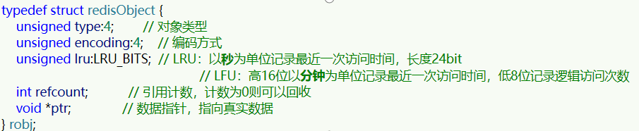

# 内存淘汰策略和内存过期

内存淘汰：当Redis内存使用达到设置的阈值，Redis主动挑选部分key删除，从而获得更多的可用内存

> 在任何命令执行之前，Redis都会尝试进行内存淘汰

## 淘汰策略

Redis支持8种不同策略来选择要删除的key：

* noeviction： 不淘汰任何key，但是内存满时不允许写入新数据，**默认**策略。
* volatile-ttl： 对设置了TTL的key，比较key的剩余TTL值，TTL越小越先被淘汰
* allkeys-random：对全体key ，随机进行淘汰。也就是直接从db->dict中随机挑选
* volatile-random：对设置了TTL的key ，随机进行淘汰。也就是从db->expires中随机挑选。
* allkeys-lru： 对全体key，基于LRU算法进行淘汰
* volatile-lru： 对设置了TTL的key，基于LRU算法进行淘汰
* allkeys-lfu： 对全体key，基于LFU算法进行淘汰
* volatile-lfu： 对设置了TTL的key，基于LFI算法进行淘汰

LFU的访问次数之所以叫做逻辑访问次数，是因为并不是每次key被访问都计数，而是通过运算：

* 生成0~1之间的随机数R
* 计算

$$
\frac{1}{(旧次数 * lfu\_log\_factor + 1)}
$$

记录为P，lfu_log_factor 默认为10

* 如果 R < P ，则计数器 + 1，且最大不超过255
* 访问次数会随时间衰减，距离上一次访问时间每隔 lfu_decay_time 分钟（默认1），计数器 -1

## 删除策略

RedisKey的TTL记录方式：在RedisDB中通过一个Dict记录每个Key的TTL时间

**惰性删除**：顾明思议并不是在TTL到期后就立刻删除，而是在访问一个key的时候，检查该key的存活时间，如果已经过期才执行删除。

**定期清理**：定期抽样部分key，判断是否过期，如果过期则删除。

> 逐个遍历db，逐个遍历db中的bucket，抽取20个key判断是否过期
>
> 如果没达到该模式的时间上限，并且过期key比例大于10%，再进行一次抽样，否则结束

- SLOW模式
	- Redis服务初始化函数`initServer()`中设置定时任务，按照server.hz的频率来执行过期key清理
	- 执行频率默认为每秒10次，每次不超过25ms
- FAST模式
	- Redis的每个事件循环前会调用beforeSleep()函数，执行过期key清理
	- 执行频率不固定，但两次间隔不低于2ms，每次耗时不超过1ms
	- 过期key比例小于10%则不执行

