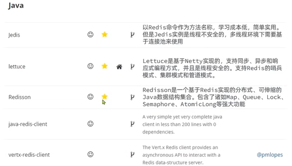
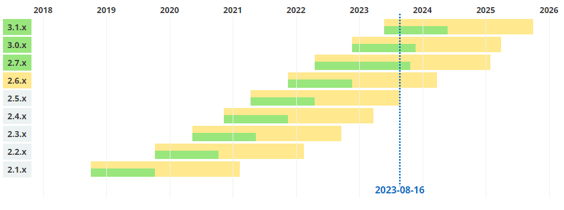
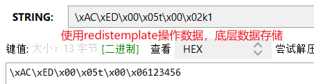
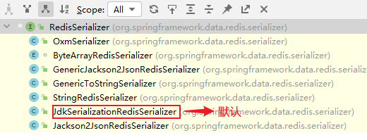
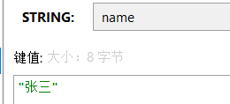
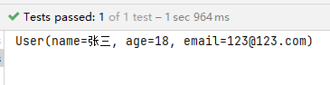
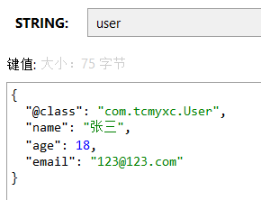
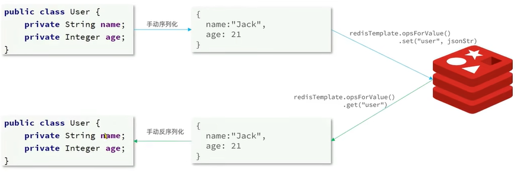
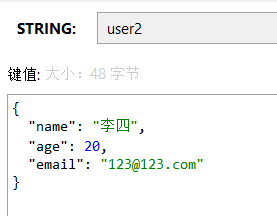
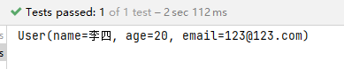

# 黑马Redis课程基础篇

> 课程链接：https://www.bilibili.com/video/BV1cr4y1671t/

## Redis的Java客户端



### Jedis客户端

#### 导入依赖

```xml
<!-- https://mvnrepository.com/artifact/redis.clients/jedis -->
<dependency>
    <groupId>redis.clients</groupId>
    <artifactId>jedis</artifactId>
    <version>4.4.3</version>
</dependency>
```

#### 建立连接

```java
private Jedis jedis;

@BeforeEach
void setUpJedis(){
    // ctrl + q 查看方法签名
    jedis = new Jedis("127.0.0.1", 6379);
    // 设置密码
    jedis.auth("tcmyxc");
    // 选择库
    jedis.select(0);
}
```

#### 相关操作

```java
@Test
void testString() {
    jedis.set("k1", "hello");
    System.out.println(jedis.get("k1"));
}
```

#### 释放资源

```java
@AfterEach
void closeJedis(){
    if(jedis != null) {
        jedis.close();
    }
}
```

### 线程池

Jedis 是线程不安全的，同时考虑到线程创建、销毁存在一定的资源消耗，推荐使用 Jedis 连接池

```java
public class JedisConnectFactory {

    private static final JedisPool jedisPool;

    static {
        JedisPoolConfig jedisPoolConfig = new JedisPoolConfig();
        // 最大连接数
        jedisPoolConfig.setMaxTotal(8);
        // 最大(最小)空闲连接
        jedisPoolConfig.setMaxIdle(8);
        jedisPoolConfig.setMinIdle(0);
        // 设置最长等待时间
        jedisPoolConfig.setMaxWaitMillis(200);

        jedisPool = new JedisPool(jedisPoolConfig, "127.0.0.1", 6379,
                1000, // 连接超时
                "tcmyxc");

    }

    /**
     * 从连接池获取连接
     */
    public static Jedis getJedis(){
        return jedisPool.getResource();
    }
}
```

### SpringDataRedis



SpringData是Spring中数据操作的模块，包含对各种数据库的集成，其中对Redis的集成模块就叫做SpringDataRedis

- 提供了对不同Redis客户端的整合( Lettuce和Jedis)
- 提供了RedisTemplate统一API来操作Redis（对redis底层操作进行了封装）
- 支持Redis的发布订阅模型
- 支持Redis哨兵和Redis集群
- 支持基于Lettuce的响应式编程
- 支持基于JDK、JSON、字符串、Spring对象的数据序列化及反序列化
- 支持基于Redis的JDKCollection实现

> 官网：https://spring.io/projects/spring-data-redis

### 快速使用

#### 引入依赖

```xml
<dependency>
    <groupId>org.springframework.boot</groupId>
    <artifactId>spring-boot-starter-data-redis</artifactId>
</dependency>

<!--连接池依赖-->
<dependency>
    <groupId>org.apache.commons</groupId>
    <artifactId>commons-pool2</artifactId>
</dependency>
```

#### 配置文件

```yaml
spring:
  redis:
    host: 127.0.0.1
    port: 6379
    password: tcmyxc
    lettuce:
      pool:
        max-active: 8
        max-idle: 8
        min-idle: 0
        max-wait: 100
```

#### 注入RedisTemplate

```java
@Autowired
private RedisTemplate redisTemplate;
```

#### 使用

```java
@Test
void testString() {
    redisTemplate.opsForValue().set("k1", "123456");
    System.out.println(redisTemplate.opsForValue().get("k1"));
}
```

### 序列化

#### 自定义序列化

默认会对 key 和 value 进行序列化，可读性较差，内存占用大





适用场景：

- `StringRedisSerializer`：key 和 hashKey 为字符串
- `GenericJackson2JsonRedisSerializer`：value 为对象

自定义序列化方式示例：

```java
@Configuration
public class RedisConfig {

    @Bean
    public RedisTemplate<String, Object> redisTemplate(RedisConnectionFactory redisConnectionFactory){
        // 创建 RedisTemplate
        RedisTemplate<String, Object> redisTemplate = new RedisTemplate<>();
        // 绑定连接工厂
        redisTemplate.setConnectionFactory(redisConnectionFactory);
        // 设置序列化工具
        GenericJackson2JsonRedisSerializer jsonSerializer = new GenericJackson2JsonRedisSerializer();
        // key 和 hashKey 使用 string 序列化
        redisTemplate.setKeySerializer(RedisSerializer.string());
        redisTemplate.setHashKeySerializer(RedisSerializer.string());
        // value 和 hashValue 使用 jsonSerializer
        redisTemplate.setValueSerializer(jsonSerializer);
        redisTemplate.setHashValueSerializer(jsonSerializer);
        
        return redisTemplate;
    }
}
```

再次测试：

```java
@SpringBootTest
public class RedisTest {

    @Autowired
    private RedisTemplate<String, Object> redisTemplate;

    @Test
    void testString() {
        redisTemplate.opsForValue().set("name", "张三");
        System.out.println(redisTemplate.opsForValue().get("name"));
    }
}
```



> 可能会报错，可能是缺少了 jackson 依赖
>
> ```xml
> <dependency>
>     <groupId>com.fasterxml.jackson.core</groupId>
>     <artifactId>jackson-databind</artifactId>
> </dependency>
> ```
>
> 然后记得刷新

测试存对象

```java
@Data
@AllArgsConstructor
@NoArgsConstructor// 必须提供无参构造
public class User {

    private String name;
    private Integer age;
    private String email;
}


// 测试代码
@Test
void testObj() {
    User user = new User("张三", 18, "123@123.com");
    redisTemplate.opsForValue().set("user", user);
    User user1 = (User) redisTemplate.opsForValue().get("user");
    System.out.println(user1);
}
```

测试结果：






【存在的问题】：存的时候夹带私货，存了 `@class`，表明这是哪个类。占用了存储空间

【解决方法】：不使用 JSON 序列化器处理 value，统一使用 String 序列化器。如果要存 Java 对象，自己手动完成序列化和反序列化



Spring 给我们提供了一个现成的 `StringRedisTemplate`，k 和 v 默认使用的就是String 序列化器，拿来使用即可

#### StringRedisTemplate手动序列化和反序列化（推荐使用）

```java
@Autowired
private StringRedisTemplate stringRedisTemplate;

// JSON 工具, jackson 自带
private static final ObjectMapper mapper = new ObjectMapper();

@Test
void testStringRedisTemplate() throws JsonProcessingException {
    User user = new User("李四", 20, "123@123.com");
    // 手动序列化
    String json = mapper.writeValueAsString(user);
    // 存数据
    stringRedisTemplate.opsForValue().set("user2", json);

    // 取数据
    String value = stringRedisTemplate.opsForValue().get("user2");
    // 反序列化
    User user1 = mapper.readValue(value, User.class);
    System.out.println(user1);

}
```






# 黑马Redis课程实战篇

以黑马点评为例

## 共享session

## 各种缓存问题

缓存穿透、缓存击穿、缓存雪崩

## 排行榜场景

## 秒杀功能

## 好友关注

## 附近商户

## 统计相关功能


