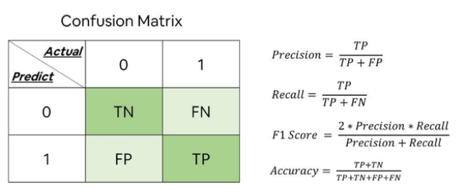
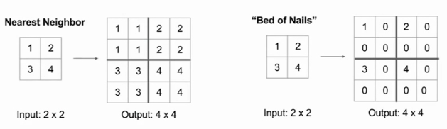

# 百面机器学习

## 特征工程

### 1、为什么需要对数值类型的特征做归一化？

1. 可以将所有的特征都统一到一个大致相同的数值区间内
1. 可以让使用SGD的模型更快收敛
> 在实际应用中，通过梯度下降法求解的模型通常是需要归一化的，包括线性回归、逻辑回归、支持向量机、神经网络等模型。但对于决策树模型则并不适用，以C4.5为例，决策树在进行节点分裂时主要依据数据集D关于特征x的信息增益比，而信息增益比跟特征是否经过归一化是无关的，因为归一化并不会改变样本在特征x上的信息增益。

### 2、归一化的方法有哪些？

1. 最大最小缩放
1. 映射到0-1正态分布
### 3、在对数据进行预处理时，应该怎样处理类别型特征？

1. **序号编码**。通常用于处理类别间具有大小关系的数据。例如成绩，可以分为低、中、高三档，并且存在“高>中>低”的排序关系。
1. **独热编码**。通常用于处理类别间不具有大小关系的特征。
1. **二进制编码**。主要分为两步，先用序号编码给每个类别赋予一个类别ID，然后将类别ID对应的二进制编码作为结果。本质上是利用二进制对ID进行哈希映射，最终得到0/1特征向量，且维数少于独热编码，节省了存储空间

### 4、对于类别取值较多的情况下使用独热编码需要注意什么问题？

1. **使用稀疏向量来节省空间**。
1. **配合特征选择来降低维度**。高维度特征会带来几方面的问题。一是在K近邻算法中，高维空间下两点之间的距离很难得到有效的衡量；二是在逻辑回归模型中，参数的数量会随着维度的增高而增加，容易引起过拟合问题；三是通常只有部分维度是对分类、预测有帮助，因此可以考虑配合特征选择来降低维度
### 5、什么是组合特征？如何处理高维组合特征？
为了提高复杂关系的拟合能力，在特征工程中经常会把一阶离散特征两两组合，构成高阶组合特征。
高维特征可以使用矩阵分解，分解为低维的稀疏向量
### 6、怎样有效地找到组合特征？
基于决策树。每一条从根节点到叶节点的路径都可以看成一种特征组合的方式
### 7、在图像分类任务中，训练数据不足会带来什么问题？如何缓解数据量不足带来的问题？
> 一个模型所能提供的信息一般来源于两个方面，一是训练数据中蕴含的信息；二是在模型的形成过程中（包括构造、学习、推理等），人们提供的先验信息。当训练数据不足时，说明模型从原始数据中获取的信息比较少，这种情况下要想保证模型的效果，就需要更多先验信息

可能会出现**过拟合问题**。模型在训练样本上的效果可能不错，但在测试集上的泛化效果不佳。
处理方法大致也可以分两类：

1. **基于模型**的方法，主要是采用降低过拟合风险的措施，包括简化模型（如将非线性模型简化为线性模型）、添加约束项以缩小假设空间（如L1/L2正则项）、集成学习、Dropout超参数等；
1. **基于数据**的方法，主要通过**数据扩充**（Data Augmentation），即根据一些先验知识，在保持特定信息的前提下，对原始数据进行适当变换以达到扩充数据集的效果。具体到图像分类任务中，在保持图像类别不变的前提下，可以对训练集中的每幅图像进行以下变换
   1. 一定程度内的随机旋转、平移、缩放、裁剪、填充、左右翻转等，这些变换对应着同一个目标在不同角度的观察结果。
   1. 对图像中的像素添加噪声扰动，比如椒盐噪声、高斯白噪声等。
   1. 颜色变换。例如，在图像的RGB颜色空间上进行主成分分析，得到3个主成分的特征向量p1，p2，p3及其对应的特征值 λ1，λ2，λ3，然后在每个像素的RGB值上添加增量[p1，p2，p3]·[α1λ1，α2λ2，α3λ3]T，其中 α1，α2，α3是均值为0、方差较小的高斯分布随机数。
   1. 改变图像的亮度、清晰度、对比度、锐度等。
   1. 先对图像进行特征提取，然后在图像的特征空间内进行变换，利用一些通用的数据扩充或上采样技术
   1. 使用生成模型也可以合成一些新样本
3. **迁移学习**
## 模型评估
> 分类问题、排序问题、回归问题往往需要使用不同的指标进行评估。在诸多的评估指标中，大部分指标只能片面地反映模型的一部分性能。如果不能合理地运用评估指标，不仅不能发现模型本身的问题，而且会得出错误的结论

### 8、准确率的局限性
准确率是指分类正确的样本占总样本个数的比例。
当负样本占99％时，分类器把所有样本都预测为负样本也可以获得99％的准确率。所以，当不同类别的样本比例非常不均衡时，占比大的类别往往成为影响准确率的最主要因素。可以使用更为有效的平均准确率（每个类别下的样本准确率的算术平均）作为模型评估的指标。
### 9、精确率与召回率的权衡
> 精确率是指分类正确的正样本个数占分类器判定为正样本的样本个数的比例。
> 召回率是指分类正确的正样本个数占真正的正样本个数的比例。
> 
> Precision值和Recall值是既矛盾又统一的两个指标，为了提高Precision值，分类器需要尽量在“更有把握”时才把样本预测为正样本，但此时往往会因为过于保守而漏掉很多“没有把握”的正样本，导致Recall值降低。

为了综合评估一个排序模型的好坏，不仅要看模型在不同Top N下的Precision@N和Recall@N，而且最好绘制出模型的P-R（Precision-Recall）曲线。
P-R曲线的横轴是召回率，纵轴是精确率。

> [https://baijiahao.baidu.com/s?id=1676784639267677225&wfr=spider&for=pc](https://baijiahao.baidu.com/s?id=1676784639267677225&wfr=spider&for=pc)

### 10、平方根误差会在什么时候失效？也就是模型效果不错，但是平方根误差比较大？
> 问题具体描述
> 构建一个回归模型来预测某部美剧的流量趋势，但无论采用哪种回归模型，得到的RMSE指标都非常高。然而事实是，模型在95％的时间区间内的预测误差都小于1％，取得了相当不错的预测结果。那么，造成RMSE指标居高不下的最可能的原因是什么？

在实际问题中，如果存在个别偏离程度非常大的离群点（Outlier）时，即使离群点数量非常少，也会让RMSE指标变得很差。
第一，如果我们认定这些离群点是“噪声点”的话，就需要在数据预处理的阶段把这些噪声点过滤掉。
第二，如果不认为这些离群点是“噪声点”的话，就需要进一步提高模型的预测能力，将离群点产生的机制建模进去（这是一个宏大的话题，这里就不展开讨论了）。
第三，可以找一个更合适的指标来评估该模型。关于评估指标，其实是存在比RMSE的鲁棒性更好的指标，比如平均绝对百分比误差（Mean Absolute Percent Error，MAPE），它定义为
相比RMSE，MAPE相当于把每个点的误差进行了归一化，降低了个别离群点带来的绝对误差的影响。
### 1、上采样的方法
反池化（如下图）、反卷积（转置卷积）

### 2、什么是ROC曲线？
ROC曲线的横坐标为假阳性率（False Positive Rate，FPR）；纵坐标为真阳性率（True Positive Rate，TPR）。
### 3、如何计算AUC？
AUC指的是ROC曲线下的面积大小，该值能够量化地反映基于ROC曲线衡量出的模型性能。计算AUC值只需要沿着ROC横轴做积分就可以了。由于**ROC曲线一般都处于y=x这条直线的上方**（如果不是的话，只要把模型预测的概率反转成1−p就可以得到一个更好的分类器），所以AUC的取值一般在0.5～1之间。**AUC越大，说明分类器越可能把真正的正样本排在前面，分类性能越好**。
### 4、ROC曲线相比P-R曲线有什么特点？
相比P-R曲线，ROC曲线有一个特点，当正负样本的分布发生变化时，ROC曲线的形状能够基本保持不变，而P-R曲线的形状一般会发生较剧烈的变化。
ROC曲线能够尽量降低不同测试集带来的干扰，更加客观地衡量模型本身的性能。
### 5、为什么在一些场景中要使用余弦相似度而不是欧氏距离？
> 当一对文本相似度的长度差距很大、但内容相近时，如果使用词频或词向量作为特征，它们在特征空间中的的欧氏距离通常很大；而如果使用余弦相似度的话，它们之间的夹角可能很小，因而相似度高。此外，在文本、图像、视频等领域，研究的对象的特征维度往往很高，余弦相似度在高维情况下依然保持“相同时为1，正交时为0，相反时为−1”的性质，而欧氏距离的数值则受维度的影响，范围不固定，并且含义也比较模糊。

欧氏距离体现数值上的绝对差异，而余弦距离体现方向上的相对差异
### 6、余弦距离是否是一个严格定义的距离?
> 距离的定义：在一个集合中，如果每一对元素均可唯一确定一个实数，使得三条距离公理（正定性，对称性，三角不等式）成立，则该实数可称为这对元素之间的距离。

余弦距离满足正定性和对称性，但是不满足三角不等式，因此它并不是严格定义的距离。
> 机器学习领域，被俗称为距离，却不满足三条距离公理的不仅仅有余弦距离，还有KL距离（Kullback-Leibler Divergence），也叫作相对熵，它常用于计算两个分布之间的差异，但不满足对称性和三角不等式

#### 7、在模型评估过程中，有哪些主要的验证方法，它们的优缺点是什么?
Holdout检验，交叉验证，自助法（Bootstrap）

1. **Holdout 检验**是最简单也是最直接的验证方法，它将原始的样本集合随机划分成训练集和验证集两部分。比方说，对于一个点击率预测模型，我们把样本按照 70％～30％ 的比例分成两部分，70％ 的样本用于模型训练；30％ 的样本用于模型验证，包括绘制ROC曲线、计算精确率和召回率等指标来评估模型性能。Holdout 检验的缺点很明显，即在验证集上计算出来的最后评估指标与原始分组有很大关系。
1. k-fold**交叉验证**：首先将全部样本划分成k个大小相等的样本子集；依次遍历这k个子集，每次把当前子集作为验证集，其余所有子集作为训练集，进行模型的训练和评估；最后把k次评估指标的平均值作为最终的评估指标。在实际实验中，k经常取10。**留一验证**：每次留下1个样本作为验证集，其余所有样本作为测试集。
1. 当样本规模比较小时，将样本集进行划分会让训练集进一步减小，这可能会影响模型训练效果。有没有能维持训练集样本规模的验证方法呢？自助法可以比较好地解决这个问题。**自助法**是基于自助采样法的检验方法。对于总数为n的样本集合，进行n次有放回的随机抽样，得到大小为n的训练集。n次采样过程中，有的样本会被重复采样，有的样本没有被抽出过，将这些没有被抽出的样本作为验证集，进行模型验证，这就是自助法的验证过程。
> 自助法：当样本数很大时，大约有36.8％的样本从未被选择过，可作为验证集

### 8、超参数有哪些调优方法？
网格搜索、随机搜索、贝叶斯优化等算法

### 9、过拟合和欠拟合具体是指什么现象？

**过拟合**是指模型对于训练数据拟合呈过当的情况，反映到评估指标上，就是模型在训练集上的表现很好，但在测试集和新数据上的表现较差。
**欠拟合**指的是模型在训练和预测时表现都不好的情况。
### 10、说出几种降低过拟合和欠拟合风险的方法？
降低“过拟合”风险的方法：
（1）获得更多的训练**数据**。
（2）**降低模型复杂度**。在数据较少时，模型过于复杂是产生过拟合的主要因素，适当降低模型复杂度可以避免模型拟合过多的采样噪声。例如，在神经网络模型中减少网络层数、神经元个数等；在决策树模型中降低树的深度、进行剪枝等。
（3）**正则化方法**。给模型的参数加上一定的正则约束，比如将权值的大小加入到损失函数中。
（4）**集成学习**方法。集成学习是把多个模型集成在一起，来降低单一模型的过拟合风险，如Bagging方法。

降低“欠拟合”风险的方法：
（1）**添加新特征**。当特征不足或者现有特征与样本标签的相关性不强时，模型容易出现欠拟合。通过挖掘“上下文特征”“ID类特征”“组合特征”等新的特征，往往能够取得更好的效果。在深度学习潮流中，有很多模型可以帮助完成特征工程，如因子分解机、梯度提升决策树、Deep-crossing等都可以成为丰富特征的方法。
（2）**增加模型复杂度**。简单模型的学习能力较差，通过增加模型的复杂度可以使模型拥有更强的拟合能力。例如，在线性模型中添加高次项，在神经网络模型中增加网络层数或神经元个数等。
（3）**减小正则化系数**。正则化是用来防止过拟合的，但当模型出现欠拟合现象时，则需要有针对性地减小正则化系数。
## 经典算法
### 1、逻辑回归相比于线性回归，有何异同？

