# RabbitMQ基础篇

## 同步和异步

同步：发送消息直到接收者接收，没人接收就一直等着

异步：发完不管了，接收者处理完了消息通知发送者

> 刷市民卡出地铁站，先让用户出站，之后再扣减余额，就是异步

异步的优势：

- 接触耦合，拓展性好
- 异步调用，无需等待，性能好
- 故障隔离，下游服务故障不影响上游服务
- 缓存消息，流量削峰填谷

异步不能解决的问题：

- 不能立即得到调用结果，时效性差
- 不能确定下游业务执行是否成功
- 业务安全依赖于Broker的可靠性

> broker：代理、经纪人

## MQ技术选型

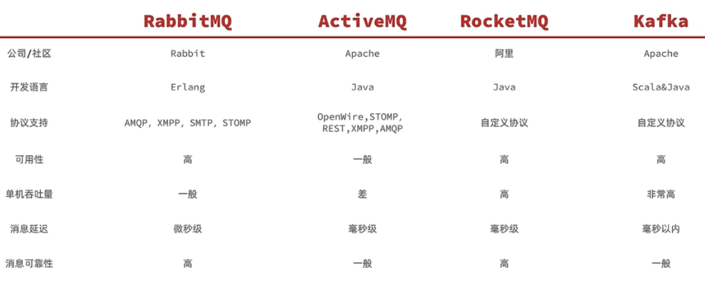

## RabbitMQ

### 安装

官网：https://www.rabbitmq.com/

### 基本介绍

发送者（publisher）、接收者（consumer）、队列（queue）、交换机（exchange）、虚拟主机（virtual-host）

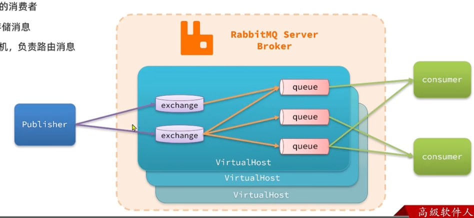

>虚拟主机用来隔离数据
>
>交换机用来路由消息，本身不存储消息

### 快速入门

版本：3.12.6

1、创建队列

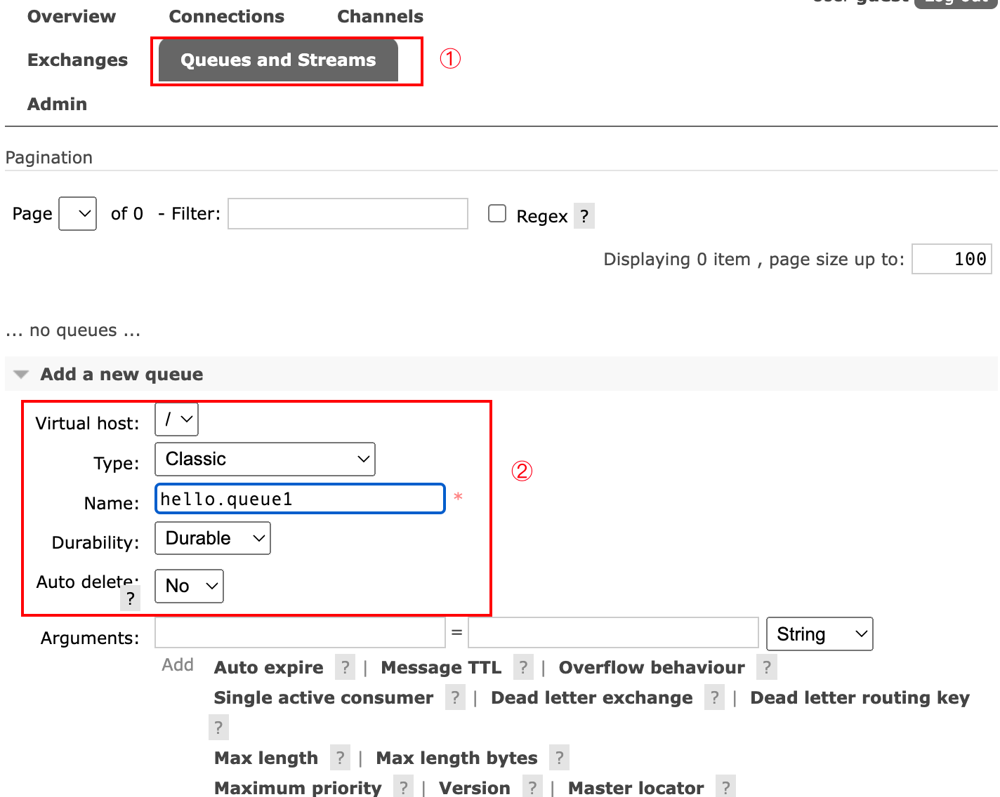

2、向`amp.fanout`交换机发送消息

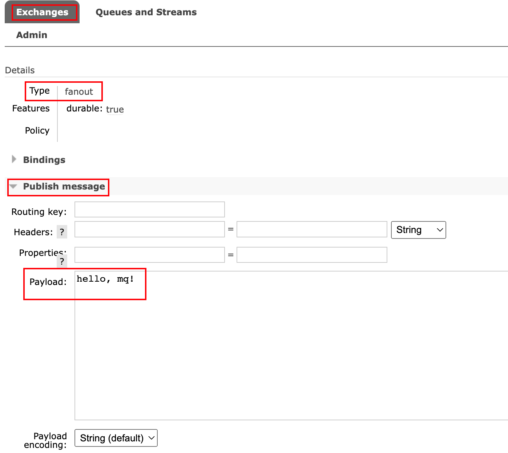

> 如果队列和交换机没有绑定，是收不到消息的

必要的绑定操作：

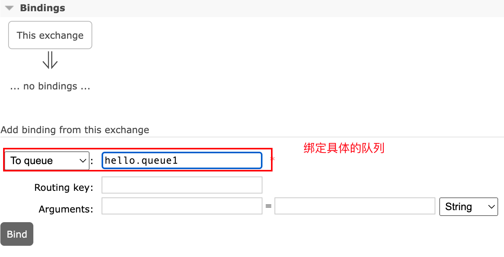

3、查看结果：

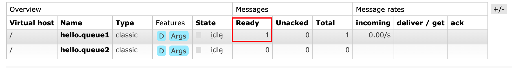

### 数据隔离

通过虚拟主机可以实现数据隔离

最佳实践：为不同的项目创建不同的用户，并绑定自己的虚拟主机

## Java客户端

https://spring.io/projects/spring-amqp

### 快速入门：生产者和消费者代码

1、配置（生产者和消费者都需要配置）

```yaml
spring:
  rabbitmq:
    host: localhost
    port: 5672
    virtual-host: /
    username: guest
    password: guest
```

2、测试代码

生产者：

```java
@Autowired
private RabbitTemplate rabbitTemplate;

@Test
void testSendMsg(){
    String queueName = "hello.queue2";// 队列名字要写对
    String msg = "Hello, spring amqp";
    rabbitTemplate.convertAndSend(queueName, msg);
}
```

消费者：

```java
@Component
@Slf4j
public class Consumer {

    @RabbitListener(queues = "hello.queue2")
    public void listenSimpleQueue(String msg){
        // msg 的类型是任意的，但是一般当初写什么类型，这里也是什么类型
        log.info("==> 接收到了来自消息hello.queue2: {}", msg);
    }
}
```

3、验证结果

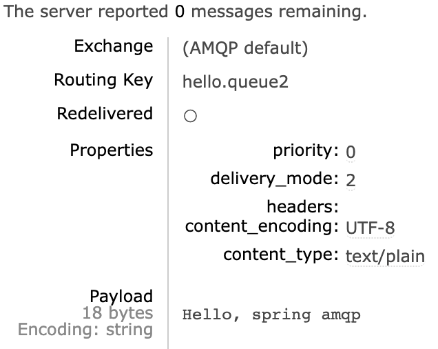

IDEA 控制台输出：

```tex
2023-10-04 23:38:14.974  INFO 14292 --- [ntContainer#0-1] com.tcmyxc.consumer.Consumer             : ==> 接收到了来自消息hello.queue2: Hello, spring amqp
2023-10-04 23:39:01.087  INFO 14292 --- [ntContainer#0-1] com.tcmyxc.consumer.Consumer             : ==> 接收到了来自消息hello.queue2: Hello, RabbbitMQ
```

### work模型

work模型：多个消费者绑定到同一个MQ，同时一条消息只会被一个消费者处理

默认情况下，MQ使用的轮询方式投递消息：假设有两个消费者A和B，MQ会按照ABABAB...的顺序分发消息，不考虑消费者的是否出现消息堆积以及消费者的消息处理能力

缺点：处理消息比较慢的消费者会导致消息的堆积

解决方法：设置`prefetch`的值为1，保证消费者处理完消息之后再去队列里面取数据，不会造成消息的堆积；可以使处理消息快的消费者多处理消息，处理慢的消费者少处理消息（充分利用不同机器的性能）

```yaml
spring:
  rabbitmq:
    listener:
      simple:
        prefetch: 1
```

如何结果消息堆积问题？

- 多个消费者绑定同一个队列
- 优化业务代码，使得消费者处理消息的速度加快

### Fanout交换机

交换机分为三种：广播（fanout）、直连（direct）、topic（主题）

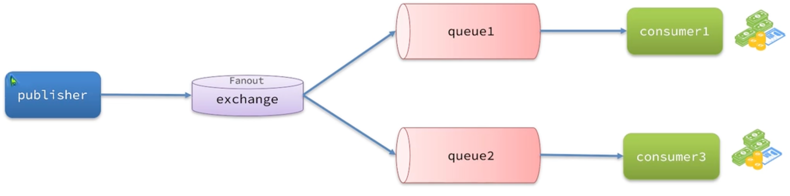

fanout交换机：所有与之绑定的队列都能收到消息

### Direct交换机

将接受到的消息按照预先定义的规则路由到指定队列

具体步骤：

- 队列和交换机约定好暗号BindingKey
- 发送者发送消息的时候指定消息的RoutingKey
- 交换机将消息路由到RoutingKey和BindingKey一致的队列

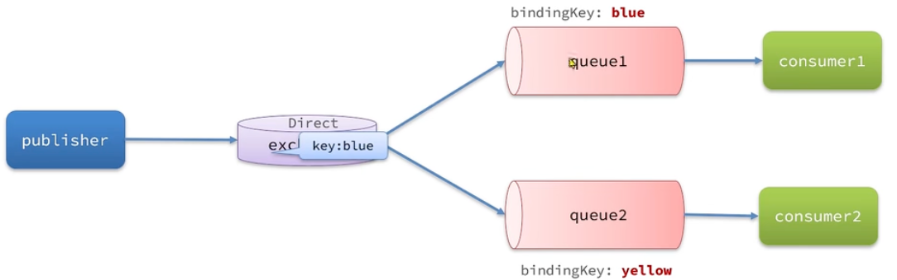

> 可以绑定多个BindingKey

### Topic交换机

和direct交换机类似，区别在于RoutingKey可以是多个单词的列表，以`.`号分隔

队列和交换机约定BindingKey时可以使用通配符

- `#` 代表0个或多个单词
- `*` 代表1个单词

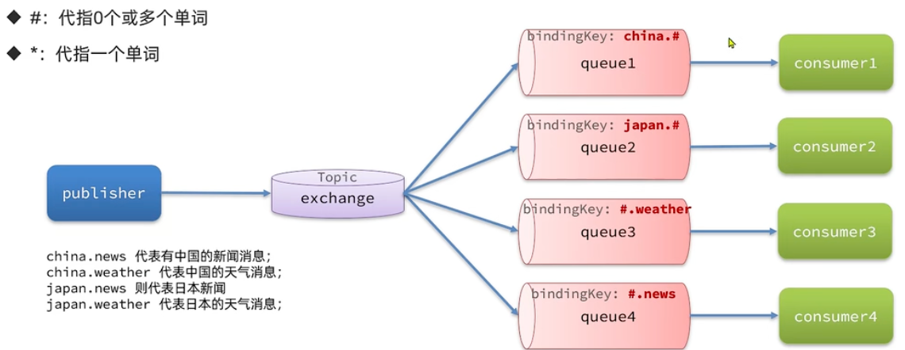

> 如果不确定使用哪个交换机，使用Toic

### 声明队列和交换机

> 不要使用控制台创建队列和交换机

#### 使用SpringAMQP

Queue：用于声明队列，可以用工厂类QueueBuilder构建

Exchange： 用于声明交换机，可以用工厂类ExchangeBuilder构建

Binding：用于声明队列和交换机的绑定关系，可以用工厂类BindingBuilder构建

示例代码：

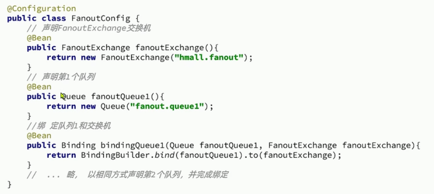

> 一般在消费者端声明（生产者不需要关心这些东西）

#### 基于注解

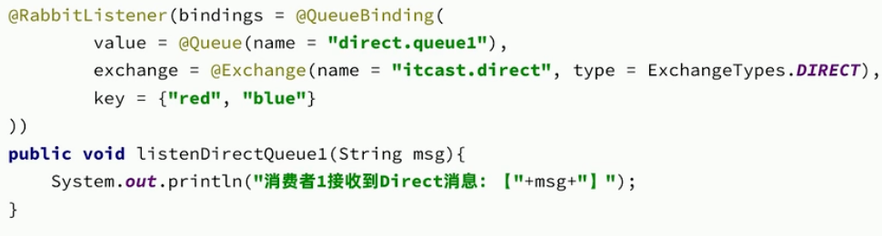

### 消息转换器

如果消息是一个对象的话，会进行序列化，默认使用JDK自带的序列化方式（不安全）

建议使用JSON序列化（如Jackson），此时生产者、消费者都需要引入相关依赖

```xml
<dependency>
    <groupId>com.fasterxml.jackson.core</groupId>
    <artifactId>jackson-databind</artifactId>
</dependency>
```

```java
@Bean
public MessageConverter jacksonMessageConverter(){
    return new Jackson2JsonMessageConverter();
}
```

