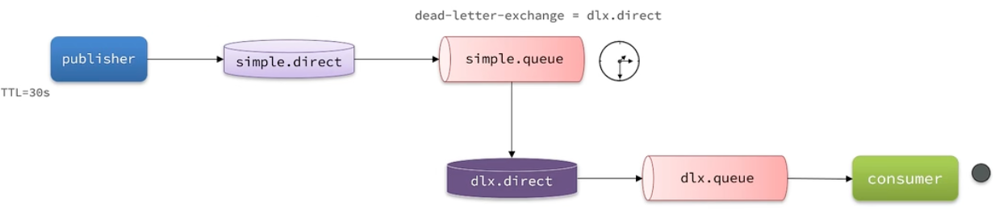
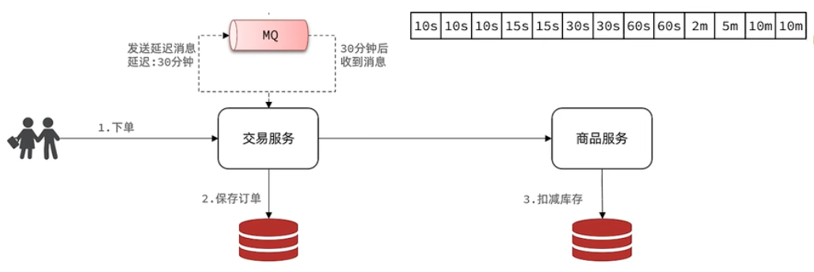

# RabbitMQ高级篇

## 消息的可靠性

### 生产者的可靠性

重连+确认

#### 生产者重连

配置文件

```yaml
spring:
  rabbitmq:
    connection-timeout: 1s  # 设置MQ的超时连接时间
    template:
      retry:
        enabled: true  # 开启超时重试机制
        initial-interval: 1000ms  # 失败后的初始等待时间
        multiplier: 2  # 失败后下次的等待时长倍数，下次等待时长=initial-interval * multiplier，这里的意思是第2次的等待时间是第一次的2倍，第3次是第2次的2倍
        max-attempts: 3  # 最大重试次数
```

当网络不稳定的时候，利用重试机制可以有效提高消息发送的成功率。不过SpringAMQP提供的重试机制是**阻塞式**的重试，也就是说多次重试等待的过程中，当前线程是被阻塞的，会影响业务性能。

如果对于业务性能有要求，建议**禁用**重试机制。如果一定要使用，请合理配置等待时长和重试次数，当然也可以考感使用**异步**线程来执行发送消息的代码。

#### 生产者确认

RabbitMQ提供了 PublisherConfirm和PublisherReturn两种确认机制。开启确机制认后，在MQ成功收到消息后会返回确认消息给生产者。

主要分为两大类：ACK和NACK，也就是投递成功和投递失败

ACK又分为路由成功和路由失败

- 路由失败说明代码写的有问题。通过PublisherReturn返回路由失败的原因
- 路由成功可以按照消息的类型分为临时消息和持久化消息

>详细说明：
>
>1. 消息投递到了MQ，但是路由失败。此时会通过PublisherReturn返回路由异常原因，然后返回ACK，告知投递成功
>2. 临时消息投递到了MQ，并且入队成功，返回ACK，告知投递成功
>3. 持久消息投递到了MQ，井且入队完成持久化，返回ACK，告知投递成功
>4. 其它情况都会返回NACK，告知投递失败

配置：

```yaml
spring:
  rabbitmq:
    publisher-confirm-type: correlated  # 开启publisher confirm并设置类型
    publisher-returns: true  # 开启publisher return
```

`publisher-confirm-type`：none关闭，simple同步阻塞，correlated异步回调

publisher-return机制生产者只能设置一个回调函数（一般在项目启动的时候设置，**不建议**使用）

> ```java
> @Slf4j
> @Configuration
> public class MqConfirmConfig implements ApplicationContextAware {
>     @Override
>     public void setApplicationContext(ApplicationContext applicationContext) throws BeansException {
>         RabbitTemplate rabbitTemplate = applicationContext.getBean(RabbitTemplate.class);
>         // 配置回调函数
>         rabbitTemplate.setReturnsCallback(new RabbitTemplate.ReturnsCallback() {
>             @Override
>             public void returnedMessage(ReturnedMessage returned) {
>                 log.debug("收到消息的return callback, exchange:{}, key:{}, msg:{}, code:{}, text:{}",
>                         returned.getExchange(), returned.getRoutingKey(), returned.getMessage(),
>                         returned.getReplyCode(), returned.getReplyText());
>             }
>         });
>     }
> }
> ```

publisher-confirm机制需要对每个消息都指定回调函数

```java
@Test
void testConfirmCallback() throws InterruptedException {
    CorrelationData cd = new CorrelationData(UUID.randomUUID().toString());
    // 添加回调函数
    cd.getFuture().addCallback(new ListenableFutureCallback<CorrelationData.Confirm>() {
        @Override
        public void onFailure(Throwable ex) {
            log.error("消息回调失败", ex);
        }

        @Override
        public void onSuccess(CorrelationData.Confirm result) {
            log.debug("收到confirm callback");
            if(result.isAck()){
                log.info("消息发送成功，收到ACK");
            }
            else{
                log.info("消息发送失败，NACK原因: {}", result.getReason());
            }
        }
    });

    rabbitTemplate.convertAndSend("hello.direct", "black", "hello", cd);

    Thread.sleep(2000);
}
```

如何处理生产者的确认消息？

- 确认机制需要额外的网络和系统资源开销，尽量不要使用
- 如果一定要用，无需开启publisher-returns，因为路由失败肯定是代码写的有问题
- 对于NACK的情况可以有限次数重试，依然失败则记录异常消息

【面试题】

如何保证消息发送的可靠性？

首先，可以配置生产者的重连机制，避免因为网络的原因导致的消息发送失败；其次，可以使用生产者的确认机制。消息如果发送成功，会收到ACK的回执；如果发送失败，则会收到NACK的回执。此时可以基于回执的情况判断消息的发送情况，并考虑是否失败重试。但是，这些操作都会增加网络和系统资源的开销，因此在大多数情况下都无需开启确认机制，除非对消息的可靠性有较高的要求。

### MQ的可靠性

MQ默认将消息保存到内存里面，重启MQ会导致消息丢失；如果消息过多，MQ容量满了，新来的消息就无法发送到MQ

#### 数据持久化

> 3.6之前的解决方案

三个角度实现持久化

- 交换机持久化
- 队列持久化
- 消息持久化。Delivery mode改为2

Spring帮我们创建的交换机和队列都是持久化的，发的消息也是持久的

#### LazyQueue

> 3.6之后的新功能，3.12之后所有的队列都是LazyQueue模式且无法更改
>
> Java代码使用低版本RabbitMQ需要在声明队列的时候指定`x-queue-mode`属性为lazy

特点：

- 接收到消息立即存储到磁盘，内存中只存储最近的2048条消息
- 消费者消费消息的时候才会从磁盘中加载数据到内存
- 支持百万级别的消息存储

当优先考虑保持较低的节点内存使用率并且可接受较高的磁盘 I/O 和磁盘利用率时，惰性队列是合适的

【面试题】

MQ如何保证消息的可靠性？

- 通过配置让交换机、队列以及发送的消息都是持久化的。这样队列中的消息会持久化到硬盘，MQ重启之后消息依然存在
- 使用LazyQueue。LazyQueue会将所有消息都持久化
- 开启持久化和生产者确认时，只有在消息持久化完成后才会给生产者返回ACK回执

### 消费者的可靠性

#### 消费者确认机制

为了确认消费者是否成功处理消息，RabbitMQ提供了消费者确认机制 ( Consumer Acknowledgement)。当消费者处理消息结束后，应该向RabbitMQ发送一个回执，告知RabbitMQ自己消息处理状态。回执有三种可选值：

- ack：成功处理消息，从队列中删除该消息
- nack：消息处理失败，需要再次投递该消息
- reject：消息处理失败并拒绝该消息，从队列中删除该消息

> reject的情况：消息的格式不对

SpringAMQP已经实现了消息确认功能。并允许我们通过配置文件选择ACK处理方式，有三种方式：

- none：不处理。即消息投递给消费者后立刻ack，消息会立刻从MQ删除。非常**不安全**，**不建议**使用
- manual：手动模式。需要自己在业务代码中调用api，发送ack或reject，存在业务入侵，但更灵活
- auto：自动模式。SpringAMQP利用AOP对我们的消息处理逻辑做了**环绕增强**，当业务正常执行时则自动返回ack。当业务出现异常时，根据异常类型判断返回不同结果：如果是业务异常，会自动返回nack，之后继续投递；如果是消息处理或校验异常，自动返回reject

```yaml
spring:
  rabbitmq:
    listener:
      simple:
        acknowledge-mode: auto
```

#### 消费失败处理

当消费者出现异常后，消息会不断requeue（重新入队），再重新发送给消费者，然后再次异常，再次requeue，无限循环，导致mq的消息处理飙升，带来不必要的压力。

可以利用Spring的失败重试机制在消费者出现异常时本地重试，而不是无限制重新入队

```yaml
spring:
  rabbitmq:
    listener:
      simple:
        retry:
          enabled: true  # 开启消费者的失败重试机制。下面四个参数都是默认值
          initial-interval: 1000ms
          multiplier: 1
          max-attempts: 3
          stateless: true  # 如果业务中包含事务，则为false
```

在开启重试模式后，重试次数耗尽，如果消息依然失败，则需要有MessageRecoverer接口来处理，它包含三种不同的实现：

- RejectAndDontRequeueRecoverer：直接reject，丟弃消息。默认策略
- ImmediateRequeueMessageRecoverer：返回nack，消息重新入队
- RepublishmessageRecoverer：将失收消息投递到指定的交換机。**推荐**

> 可以定义一个特殊的、接收失败消息的交换机和队列，如果队列里面有消息则给运维发邮件通知，之后分析消息失败的原因，修复业务代码的漏洞

步骤：

1. 定义接收失败消息的交换机、队列及绑定关系
2. 定义RepublishmessageRecoverer

```java
@Configuration
@ConditionalOnProperty(prefix = "spring.rabbitmq.listener.simple.retry", name = "enabled", havingValue = "true")
public class MqErrorConfig {

    /**
     * 处理投递失败消息的交换机
     */
    @Bean
    public DirectExchange errorExchange(){
        return new DirectExchange("error.direct");
    }

    /**
     * 存放投递失败消息的队列
     */
    @Bean
    public Queue errorQueue(){
        return new Queue("error.queue");
    }

    @Bean
    public Binding errorBinding(Queue errorQueue, DirectExchange errorExchange){
        return BindingBuilder.bind(errorQueue)
                .to(errorExchange)
                .with("error");
    }

    @Bean
    public MessageRecoverer messageRecoverer(RabbitTemplate rabbitTemplate){
        return new RepublishMessageRecoverer(rabbitTemplate, "error.direct", "error");
    }
}
```

【面试题】

消费者如何保证消息一定被消费？

- 开启消费者确认机制为auto，由spring确认消息处理成功后返回ack，异常时返回nack
- 开启消费者失败重试机制，并设置MessageRecoverer， 多次重试失败后将消息投递到异常交换机，交由人工处理

#### 业务幂等性

幂等是一个数学概念，用函数表达式來描述是这样的：f(x)=f(fx))。在程序开发中，则是指同一个业务，执行一次或多次对业务状态的影响是一致的。

幂等业务：根据ID查询商品、删除商品

非幂等业务：用户下单，需要扣减库存；用户退款，需要恢复余额

> 删除操作天生就是幂等的

【面试题】

如何保证业务的幂等性？

1. 结合业务逻辑，基于业务本身做判断。比如支付成功才能修改订单状态为已支付，应该在修改订单状态之前查询订单状态。如果是未支付，则需要修改，其他情况不需要修改。但是这种方式不具有通用性

2. 每个消息附加一个唯一的ID，利用ID区分是否是重复消息。业务处理成功之后将消息的ID存到数据库，如果下次再收到消息，先查数据库看看是否存在相同的ID，存在则不处理

	```java
	// 在生产者中配置
	@Bean
	public MessageConverter jacksonMessageConverter(){
	    // 定义消息转换器
	    Jackson2JsonMessageConverter jsonMessageConverter = new Jackson2JsonMessageConverter();
	    // 配置自动创建消息ID，用于识别不同消息
	    jsonMessageConverter.setCreateMessageIds(true);
	    return jsonMessageConverter;
	}
	```

	> 可以使用消息后置处理器，手动设置消息ID


如何保证支讨服务与交易服务之间的订单状态一致性？

首先，支付服务会正在用户支付成功以后利用MQ消息通知交易服务，完成订单状态同步。

其次，为了保证MQ消息的可靠性，我们采用了生产者确认机制、消费者确认、消费者失败重试等策略，确保消息投递和处理的可靠性。同时也开启了MQ的持久化，避免因服务宕机导致消息丢失。

最后，我们还在交易服务更新订单状态时做了业务幂等判断，避免因消息重复消费导致订单状态异常。

如果交易服务消息处理失败，有没有什么兜底方案？

可以在交易服务设置定时任务，定期查订单支付状态。这样即便MQ通知失败，还可以利用定时任务作为兜底方案，保证业务最终状态的一致性

## 延迟消息

延迟消息：生产者发送消息的时候设置一个时间，过了这个时间才给消费者发消息

延迟任务：设置在一定时间之后才执行的任务

### 死信交换机

当一个队列中的消息满足下列情况之一时，就会成为死信 (dead letter)：

- 消费者拒绝消费，并且该消息没有设置重新入队（消费者使用basic.reject或 basic.nack声明消费失败，井且消息的requeue参数设置为false）
- 消息超时无人消费（达到了队列或消息本身设置的过期时间）
- 要投递的消息队列已达到最大容量

如果队列过期，队列中的消息不会“死信”

如果队列通过dead-letter-exchange属性指定了一个交换机，那么该队列中的死信就会投递到这个交换机中。这个交换机称为死信交换机 (Dead Letter Exchange，简称DLX）。

可以使用死信交换机实现延迟消息，如下图：




### 延迟消息插件

RabbitMQ的官方推出了一个插件，原生支持延迟消息功能。

该插件的原理是设计了一种支持延迟消息功能的交换机。当消息投递到交换机后可以暂存一定时问，到期后再投递到队列。

本质上是设置消息头的`x-delay`属性

```java
// 消费者
@RabbitListener(bindings = @QueueBinding(
        value = @Queue(name = "delay.queue", durable = "true"),
        exchange = @Exchange(name = "delay.direct", delayed = "true"),
        key = "delay"
) )
public void listenDelayMessage (String msg) {
    log.info("接收到delay queue的延迟消息：{}", msg);
}

// 生产者
@Test
void testPublisherDelayMessage () {
    // 1.创建消息
    String message = "hello, delayed message";
    // 2.发送消息，利用消息后置处理器添加消息延迟
    rabbitTemplate.convertAndSend("delay.direct", "delay", message, new MessagePostProcessor(){
        @Override
        public Message postProcessMessage(Message message) throws AmqpException {
            message.getMessageProperties().setDelay(10_000);
            return message;
        }
    });
    log.info("消息发送成功");
}
```

> 插件需要自行安装，链接：https://github.com/rabbitmq/rabbitmq-delayed-message-exchange

### 取消超时订单

设置30分钟后检测订单支付状态实现起来非常简单，但是存在两个问题：

- 如果并发较高，30分钟可能堆积消息过多，对MQ压力很大
- 大多数订单在下单后1分钟内就会支付，但是却需要在MQ内等待30分钟，浪费资源

可以将一个长的延时消息变成多个延时消息，减少MQ的压力




