# 系统安全分析与设计

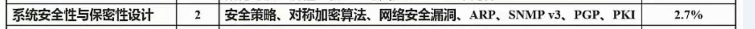

<!-- more -->

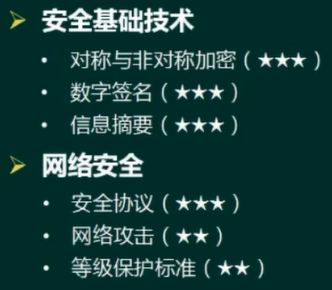

## 对称加密技术

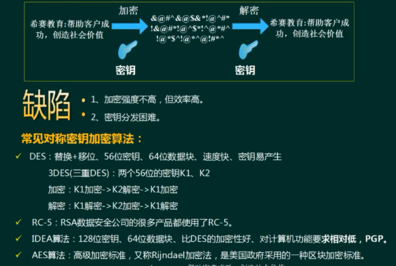

## 非对称加密

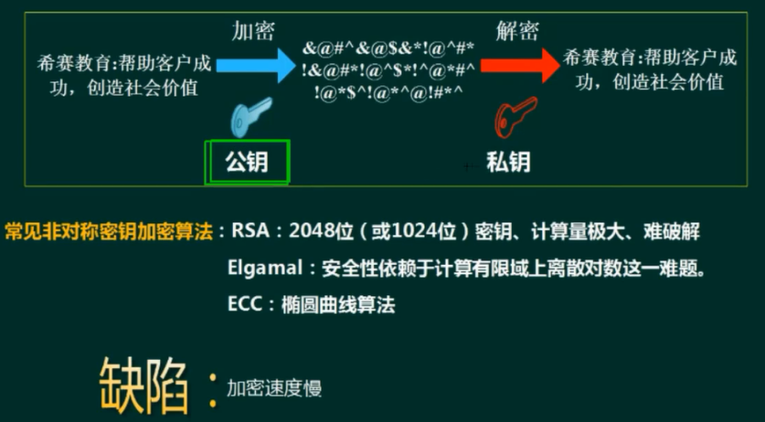

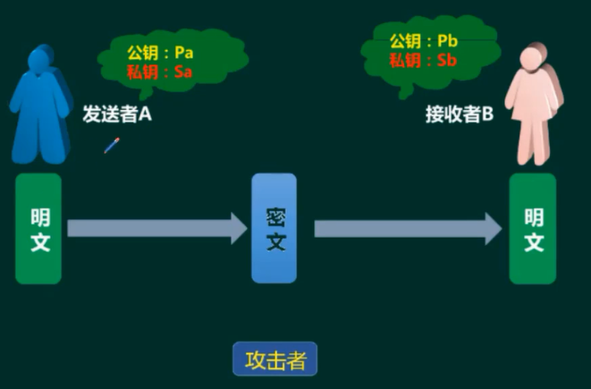

> 公钥私钥成对出现
>
> 用自己的私钥做签名，用对方的公钥加密
>
> 私钥用来签名、解密

## 信息摘要

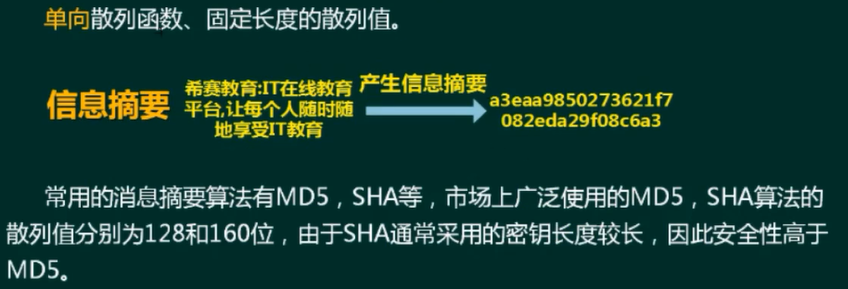

## 数字签名

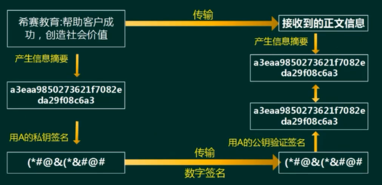

**练习题**

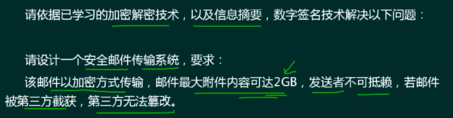

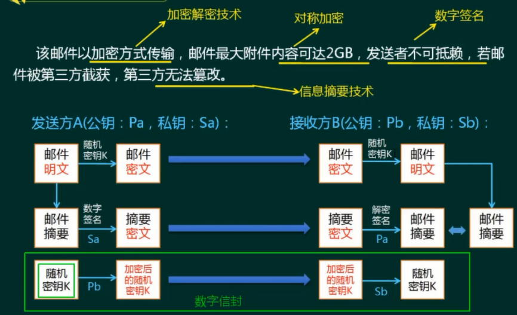

> 数字信封：使用非对称的加密体制加密对称密钥

## 数字证书

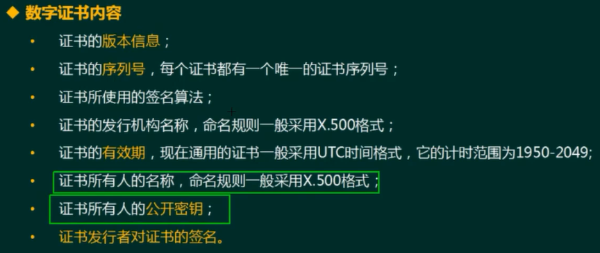

CA用自己的私钥对数字证书进行了签名

## PKI公钥体系

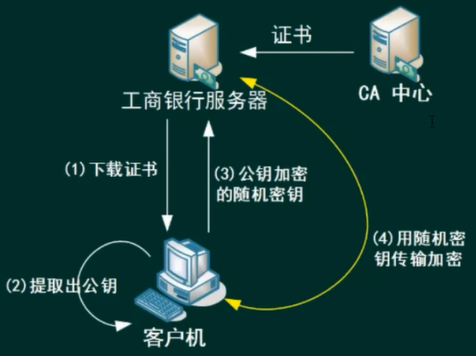

> 证书用来验证身份

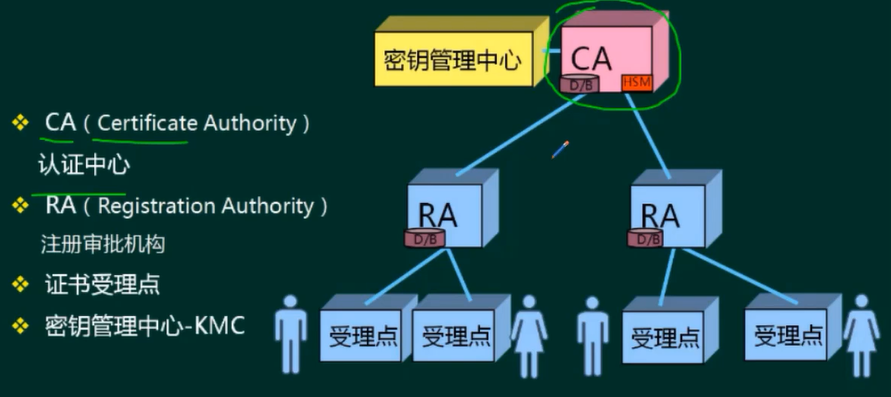

## 网络安全

各个层次的安全保障

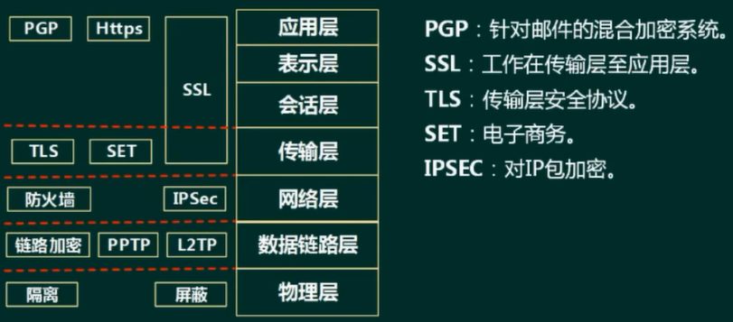

## 网络威胁与供给

被动攻击：收集信息为主，破坏保密性。

主动攻击：主动攻击的类别主要有∶中断（破坏可用性），篡改（破坏完整性），伪造（破坏真实性)。

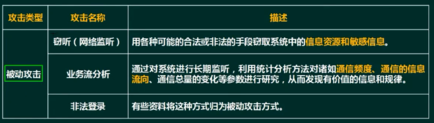

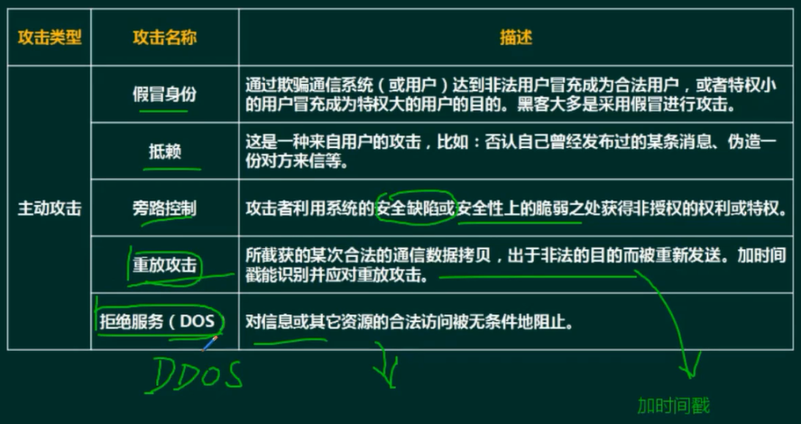

SQL注入

## 安全保护等级

计算机信息系统安全保护等级划分准则(GB17859-1999)

**用户自主**保护级：适用于普通内联网用户

- 系统被破坏后，**对公民、法人和其它组织权益**有损害，但不损害国家安全社会秩序和公共利益。

**系统审计**保护级：适用于通过内联网或国际网进行商务活动，需要保密的非重要单位。

- 系统被破坏后，**对公民、法人和其它组织权益有严重损害，或损害社会秩序和公共利益**，但不损害国家安全。

**安全标记保护级**：适用于地方各级国家机关、金融机构、邮电通信、能源与水源供给部门、交通运输、大型工商与信息技术企业、重点工程建设等单位

- 系统被破坏后，**对社会秩序和公共利益造成严重损害，或对国家安全造成损害**。

**结构化**保护级：适用于中央级国家机关、广播电视部门、重要物资储备单位、社会应急服务部门、尖端科技企业集团、国家重点科研机构和国防建设等部门

- 系统被破坏后，**对社会秩序和公共利益造成特别严重损害，或对国家安全造成严重损害。**

**访问验证**保护级：适用于国防关键部门和依法需要对计算机信息系统实施特殊隔离的单位

- 系统被破坏后，**对国家安全造成特别严重损害。**

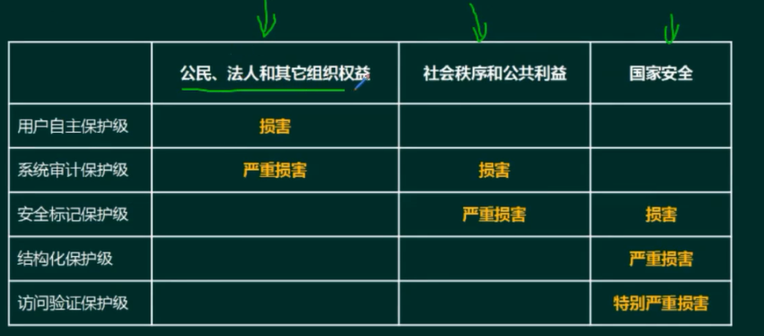

## 信息安全体系结构

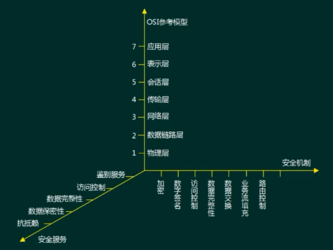

五大安全服务

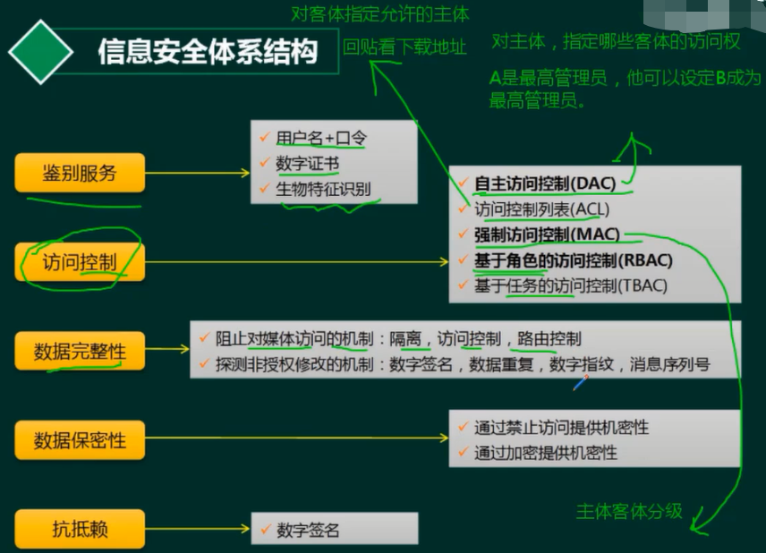

