# 操作系统概念

>   参考文献：
>
>   -   [1]操作系统概念（第九版） - 机械工业出版社
>   -   [2]OS 课件（感谢JJM老师）

- [操作系统概念](#操作系统概念)
- [第一章：简介](#第一章简介)
  - [1、特权指令和非特权指令](#1特权指令和非特权指令)
  - [2、用户态和内核态](#2用户态和内核态)
  - [3、分布式系统](#3分布式系统)
- [第二章：操作系统结构](#第二章操作系统结构)
  - [1、系统调用](#1系统调用)
  - [2、如何向操作系统提供参数？](#2如何向操作系统提供参数)
  - [几个Linux命令](#几个linux命令)
- [第三章：进程](#第三章进程)
  - [1、进程是什么？](#1进程是什么)
  - [2、进程组成](#2进程组成)
  - [3、进程状态（5个）](#3进程状态5个)
  - [4、进程和程序](#4进程和程序)
  - [5、进程调度](#5进程调度)
  - [6、进程操作](#6进程操作)
    - [6.1 创建进程](#61-创建进程)
    - [6.2 进程终止](#62-进程终止)
    - [6.3 进程通信(Interprocess Communication，IPC)](#63-进程通信interprocess-communicationipc)
  - [7、IPC](#7ipc)
    - [7.1 共享内存](#71-共享内存)
    - [7.2 消息传递](#72-消息传递)
  - [8、同步异步](#8同步异步)
  - [9、几个命令](#9几个命令)
- [第四章：线程和并发](#第四章线程和并发)
  - [1、概念](#1概念)
  - [2、线程的实现机制](#2线程的实现机制)
  - [3、线程池](#3线程池)
- [第五章：进程调度](#第五章进程调度)
  - [5.1 基本概念](#51-基本概念)
    - [5.1.1 CPU 调度程序](#511-cpu-调度程序)
    - [5.1.2 什么时候需要进程调度？](#512-什么时候需要进程调度)
    - [5.1.3 Dispatcher（调度程序）](#513-dispatcher调度程序)
  - [5.2 调度准则](#52-调度准则)
  - [5.3 调度算法](#53-调度算法)
    - [5.3.1 FCFS算法](#531-fcfs算法)
    - [5.3.2 SJF算法](#532-sjf算法)
    - [5.3.3 优先权调度](#533-优先权调度)
    - [5.3.4 时间片轮转](#534-时间片轮转)
    - [5.3.5 多级队列调度](#535-多级队列调度)
    - [5.3.6 多级反馈队列](#536-多级反馈队列)
  - [5.4 线程调度](#54-线程调度)
- [第六章：进程同步](#第六章进程同步)
  - [6.1 临界区问题](#61-临界区问题)
  - [6.2 锁](#62-锁)
    - [6.2.1 互斥锁](#621-互斥锁)
    - [6.2.2 自旋锁 spinlock](#622-自旋锁-spinlock)
  - [6.3 信号量](#63-信号量)
  - [6.4 经典同步问题](#64-经典同步问题)
  - [6.5 管程](#65-管程)
- [第七章：死锁](#第七章死锁)
  - [7.1 概念](#71-概念)
  - [7.2 处理策略](#72-处理策略)
  - [7.3 死锁避免算法](#73-死锁避免算法)
    - [7.3.1 资源分配图算法](#731-资源分配图算法)
    - [7.3.2 银行家算法](#732-银行家算法)
  - [7.4 死锁检测](#74-死锁检测)
- [第八章：内存管理](#第八章内存管理)
  - [8.1 背景](#81-背景)
    - [8.1.1 绝对地址和相对地址](#811-绝对地址和相对地址)
  - [8.1.2 动态加载和动态链接](#812-动态加载和动态链接)
  - [8.2 Swapping（交换技术）](#82-swapping交换技术)
  - [8.3 连续内存分配](#83-连续内存分配)
    - [8.3.1 内存保护](#831-内存保护)
    - [8.3.2 内存分配](#832-内存分配)
    - [8.3.3 碎片（Fragmentation）](#833-碎片fragmentation)
  - [8.4 分段](#84-分段)
  - [8.5 分页](#85-分页)
- [第九章：虚拟内存管理](#第九章虚拟内存管理)
  - [9.1 Demand paging （请求调页，按需调页，请求页式管理）](#91-demand-paging-请求调页按需调页请求页式管理)
  - [9.2 写时复制 (copy-on-write)](#92-写时复制-copy-on-write)
  - [9.3 页面置换](#93-页面置换)

# 第一章：简介

## 1、特权指令和非特权指令

特权指令：不允许用户程序中直接使用的指令。例如：I/O指令、设置时钟、 置控制寄存器等指令都是特权指令。 

非特权指令:用户程序中所使用的指令。

## 2、用户态和内核态

内核态 

-   能够访问所有系统资源，可以执行特权指令，可以直接操作和管理硬件设备。 
-   操作系统内核程序运行在内核态下 
-   使用内核栈 

用户态 

-   只能访问属于它的存储空间和普通寄存器，只能执行普通指令。 
-   用户程序以及操作系统核外服务程序运行在用户态下 
-   使用用户栈

## 3、分布式系统

定义：物理上分开的、可能异构的、通过网络相连的一组计算机系统。

# 第二章：操作系统结构

## 1、系统调用

系统调用：进程和内核之间的程序接口。

-   系统调用的实现是在内核完成的
-   系统调用是通过软中断向内核发出一个明确的请求，每个系统调用对应一个封装例程（wrapper routine，唯一目的就是发布系统调用）

分为六大类：

进程控制、文件管理、设备管理、信息维护、通信、保护

## 2、如何向操作系统提供参数？

-   通过寄存器
-   存在内存的块或表中，块地址再作为参数传给寄存器
-   放在栈里面，让操作系统弹出

后面两种方法不限制参数的数量和长度


## 几个Linux命令

`lsmod`：查看所有内核模块

`insmod 模块名`：加载内核模块

`rmmod 模块名（不需要.ko后缀`：卸载模块

`dmesg`：查看系统启动信息


# 第三章：进程

## 1、进程是什么？

- 一个具有一定独立功能的程序在一个数据集合上的一次动态执行过程。进程是操作系统进行资源分配和调度的一个独立单位。
- 正在执行中的程序 a program in execution

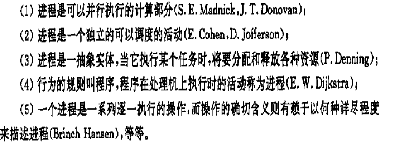

>   张尧学，计算机操作系统教程，清华大学出版社

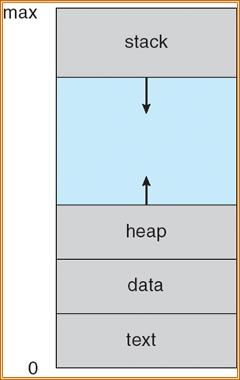

## 2、进程组成

- 代码段
- 数据段（全局变量）
- 堆（动态申请空间）
- 程序计数器（PC）
- 一组寄存器
- 栈（临时变量）

示意图：

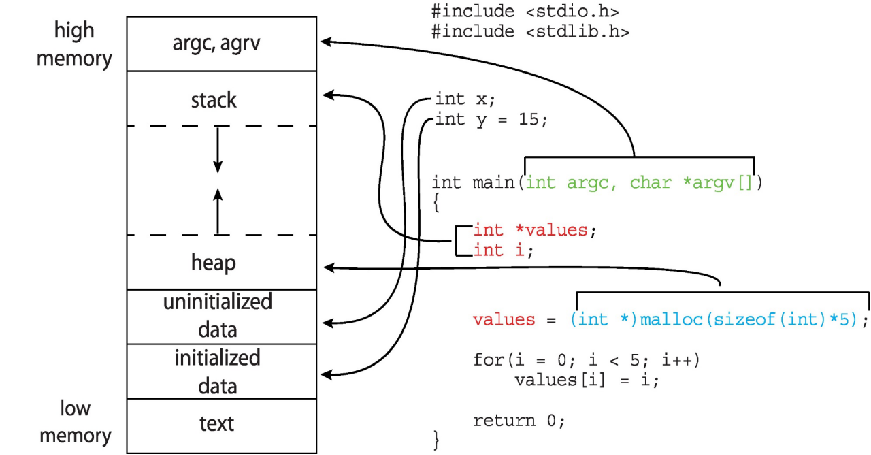


PCB（进程控制块）

- 进程状态
- 程序计数器
- CPU寄存器
- CPU调度信息
- 内存管理信息
- 记账信息
- IO状态信息

## 3、进程状态（5个）

new、running、ready、waiting、terminated


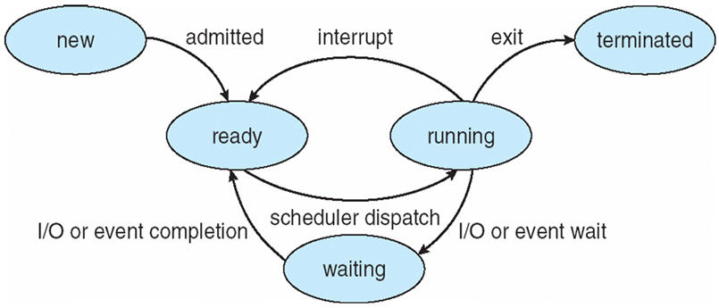


一个处理器一次只能运行一个进程

三个基本状态之间可能转换和转换原因如下：

-   就绪→运行：当处理器空闲时，进程调度程序必将处理机分配给一个处于就绪状态的进程 ，该进程便由就绪状态转换为运行状态。
-   运行→等待：处于运行状态的进程在运行过程中需要等待某一事件发生后（例如因I／O请求等待I／O完成后），才能继续运行，则该进程放弃处理器，从运行状态转换为等待状态。
-   等待→就绪：处于等待状态的进程，若其等待的事件已经发生，于是进程由等待状态转换为就绪状态。
-   运行→就绪：处于运行状态的进程在其运行过程中，因分给它的处理器时间片已用完，而不得不让出（被抢占）处理器，于是进程由运行态转换为就绪态。

等待→运行，就绪→等待这二种状态转换一般不可能发生。


处于运行状态进程：如系统有一个处理器，则在任何一时刻，最多只有一个进程处于运行状态。

处于就绪状态进程：一般处于就绪状态的进程按照一定的算法（如先来的进程排在前面，或采用优先权高的进程排在前面）排成一个就绪队列。

处于等待状态进程：处于等待状态的进程排在等待队列中。由于等待事件原因不同，等待队列也可以按事件分成几个队列。

## 4、进程和程序

- 进程是动态的，程序是静态的
- 进程是暂时的，程序是永久的
- 进程与程序的组成不同：进程的组成包括程序、数据和进程控制块（即进程状态信息）
- 通过多次执行，一个程序可对应多个进程；通过调用关系，一个进程可包括多个程序


## 5、进程调度

调度队列和调度程序

上下文切换：切换 CPU 到另外一个进程需要保存当前进程的状态，同时恢复另一个进程的状态

进程上下文用进程 PCB 表示

## 6、进程操作

### 6.1 创建进程

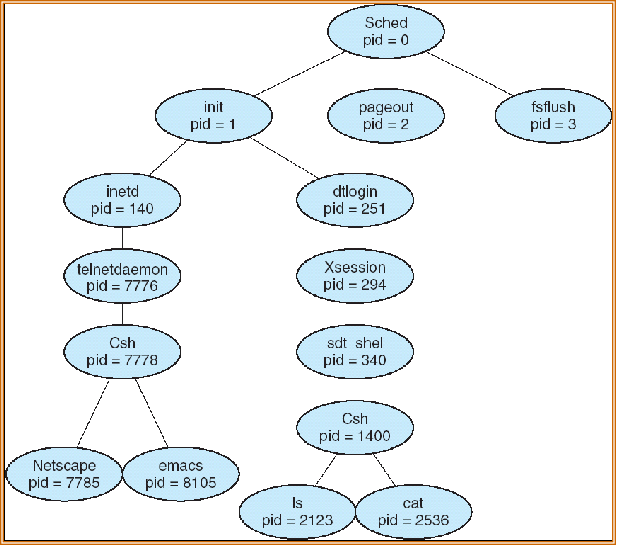


进程标识符（pid）唯一标识一个进程

子进程可能共享父进程的所有资源或者部分资源，或者直接不共享

创建新进程，可以使用 fork() 这个系统调用

-   子进程继承了父进程的地址空间
-   子进程 PID 是 0，父进程的 PID 值是子进程的 PID

### 6.2 进程终止

引起进程终止的事件：

-   正常结束
-   异常结束
-   外界干预

僵尸进程：进程已经中止，但父进程未调用wait()

孤儿进程：父进程未调用wait()就终止了，处理方式：将init进程（1号进程）作为孤儿进程的父进程

### 6.3 进程通信(Interprocess Communication，IPC)

IPC为进程提供了一种无需共享相同地址空间就可以进行通信和同步操作的机制

两种模型：共享内存、消息传递

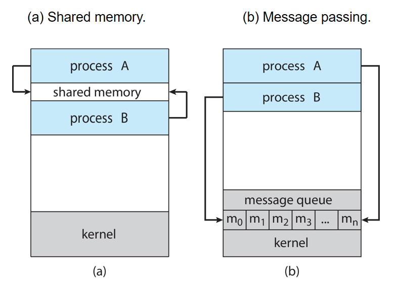

通信类型：直接通信、间接通信

常用通信机制：

- 信号(signal)
- 共享存储区(shared memory)
- 管道(pipe)
- 消息(message)
- 套接字(socket)

Linux实现进程间通信(IPC Inter Process Communication)：

- System V IPC机制:
  - 信号量、 消息队列、 共享内存

- 管道（pipe）、命名管道 

- 套接字（socket）

- 信号( signal )

- 文件锁(file lock)

- POSIX线程：
  - 互斥锁(互斥体、互斥量)（mutex）、条件变量(condition variables)

- POSIX：
  - 消息队列、信号量、共享内存

## 7、IPC

### 7.1 共享内存

-   希望通信的进程之间共享的一块内存区域
-   通信在用户进程的控制下，而不是操作系统的控制下。
-   主要问题是提供一种机制，允许用户进程在访问共享内存时同步它们的操作
-   协同进程的并发执行需要允许进程之间进行通信并同步它们的动作的机制
-   生产者-消费者问题
    -   有界缓冲区
    -   无界缓冲区

### 7.2 消息传递

进程之间的通信不需要依赖共享变量

如果 P 和 Q 要通信，需要两步：

1、建立连接

2、交换信息


**直接通信**

-   明确说明要发给谁或者从谁接收信息

```bash
send (P, message) – send a message to process P
receive(Q, message) – receive a message from process Q
```

通信连接的特性：

-   连接自动建立
-   一个链接只与一对通信进程相关联，换言之，一对通信之间只有一个链接
-   链接可能是单向的，但通常是双向的

**间接通信**

-   从邮箱(mailbox，也称为端口)定向和接收消息
-   每个邮箱都有一个唯一的id
-   进程只有在共享邮箱时才能通信

通信链路的特性

-   仅当进程共享一个公共邮箱时才建立链接
-   一个链接可能与许多进程相关联
-   每一对进程可以共享几个通信链路
-   链接可以是单向的，也可以是双向的

## 8、同步异步

消息传递可以是阻塞的，也可以是非阻塞的

**阻塞**被认为是**同步**的。

-   阻塞发送——发送方被阻塞，直到接收方接收到消息

-   阻塞接收——接收者被阻塞，直到有消息可用

**非阻塞**被视为**异步**的

-   非阻塞发送——发送者发送消息并继续

-   非阻塞接收——接收方接收到有效的消息，或空消息

**RPC**

如同调用本地过程一样调用远程主机的过程

**管道**

-   普通管道：单向（单工）通信，标准的生产者消费者方式进行通信——生产者向管道一端写入，消费者从管道另一端读出；进程通信时管道才存在
-   命名管道：可以双向通信，一个管道可以被多个进程使用

## 9、几个命令

查看所有活动进程的详细信息：`ps -el`

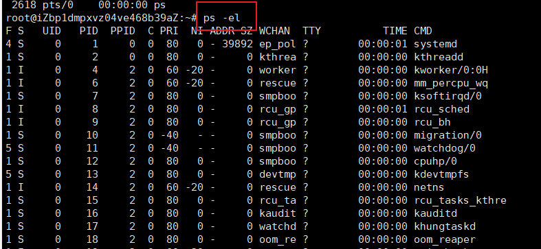

杀进程：`kill -9 进程号`

查看文件：`cat 文件名`

# 第四章：线程和并发

## 1、概念

线程定义为进程内一个执行单元或一个可调度实体。

线程只拥有一点在运行中必不可省的资源（程序计数器、一组寄存器和栈），但它可与同属一个进程的其它线程共享进程拥有的全部资源。

通常，使用一个包含读个线程的进程更加有效

延伸：

-   线程私有的：线程ID、程序计数器、一组寄存器和栈
-   线程共享的：代码段、数据段、其他操作系统资源

资源拥有单元称为进程，调度的单位称为线程。

线程：

-   有执行状态（状态转换）
-   不运行时保存上下文
-   有一个执行栈
-   有一些局部变量的静态存储
-   可存取所在进程的内存和其他资源
-   可以创建、撤消另一个线程

线程的特点：

-   不拥有系统资源（只拥有少量的资源，资源是分配给进程） 
-   一个进程中的多个线程可并发执行（进程可创建线程执行同一程序的不同部分） 
-   系统开销小、切换快。（进程的多个线程都在进程的地址空间活动）

优点：

-   **创建一个新线程花费时间少**（结束亦如此）
-   **两个线程的切换花费时间少**（如果机器设有“存储[恢复]所有寄存器”指令，则整个切换过程用几条指令即可完成）
-   **通信方便**：因为同一进程内的线程共享内存和文件，因此它们之间相互通信无须调用内核
-   **适合多处理机系统**

## 2、线程的实现机制

>   了解即可

**用户级线程**：不依赖于OS核心（内核不了解用户线程的存在），应用进程利用线程库提供创建、同步、调度和管理线程的函数来控制用户线程

调度由应用软件内部进行，通常采用非抢占式和更简单的规则，也无需用户态/核心态切换，所以速度特别快。

一个线程发起系统调用而阻塞，则整个进程在等待。 

特点：

-   用户线程的维护由应用进程完成；
-   内核不了解用户线程的存在；
-   用户线程切换不需要内核特权；
-   用户线程调度算法可针对应用优化；
-   一个线程发起系统调用而阻塞，则整个进程在等待。（一对多模型中）

**内核级线程**：依赖于OS核心，由内核的内部需求进行创建和撤销，用来执行一个指定的函数。一个线程发起系统调用而阻塞，不会影响其他线程。时间片分配给线程，所以多线程的进程获得更多CPU时间。

特点：

-   内核维护进程和线程的上下文信息；
-   线程切换由内核完成；
-   时间片分配给线程，所以多线程的进程获得更多CPU时间；
-   一个线程发起系统调用而阻塞，不会影响其他线程的运行。


并行：同时执行多个任务

并发：支持多个任务，并允许所有任务都有其进展


用户级线程和内核级线程的映射关系：

1、一对一：一个用户级线程对应一个内核级线程。一个线程阻塞，整个进程阻塞；不能用在多核处理器上

2、多对一：多个用户级线程对应一个内核级线程。内核级线程数量需要限制；允许多个线程并行运行在多处理器上；没有增加并发（内核一次只能调度一个线程）

3、多对多：多路复用多个用户级线程到同等数量或者数量更少的内核线程上。


多线程创建的策略：

1、同步线程：父线程创建子线程后，等到所有的子线程执行完毕，自己才继续执行（分叉-连接策略）。这里，由父线程创建的线程并发执行工作，但是父线程在这个工作完成之前无法继续。一旦每个线程完成了它的工作，它就会终止，并与父线程连接。只有在所有子线程都连接之后，父线程才恢复执行。通常，同步线程涉及线程之间的大量数据的共享。例如，父线程可以组合由子线程计算的结果。

2、异步线程：父线程创建子线程后，自己恢复自身的执行，这样父线程与子线程会并发执行。每个线程的运行独立于其他线程，父线程无需知道子线程何时终止。由于线程是独立的，所以线程之间通常很少有数据共享。

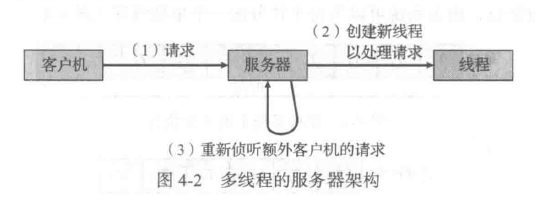

## 3、线程池

主要思想是:在进程开始时创建一定数量的线程，并加到池中以等待工作。当服务器收到请求时，它会唤醒池内的一个线程(如果有可用线程)，并将需要服务的请求传递给它。一旦线程完成了服务，它会返回到池中再等待工作。如果池内没有可用线程，那么服务器会等待,直到有空线程为止。

线程池具有以下优点:

-   用现有线程服务请求比等待创建一个线程更快。
-   线程池**限制了任何时候可用线程的数量**。这对那些不能支持大量并发线程的系统非常重要。
-   **每个线程的运行策略可定制**：将要执行任务从创建任务的机制中分离出来，允许我们采用不同策略运行任务。例如，任务可以被安排在某一个时间延迟后执行,或定期执行。
-   **可以提前估算线程池大小**：池内线程的数量可以通过一些因素来加以估算，如系统CPU的数量、物理内存的大小和并发客户请求数量的期望值等。更为高级的线程池架构可以根据使用模式动态调整池内线程数量。这类架构在系统负荷低时，提供了较小的池，从而减低内存消耗。

# 第五章：进程调度

## 5.1 基本概念

CPU 调度 = 处理器调度 = 进程调度

单处理器系统：同一时间只有一个进程可以运行

多处理器系统：多个进程同时处于内存。当一个进程等待时，操作系统就从该进程接管 CPU 控制权，并把 CPU 交给另外一个进程。

三层调度模型：

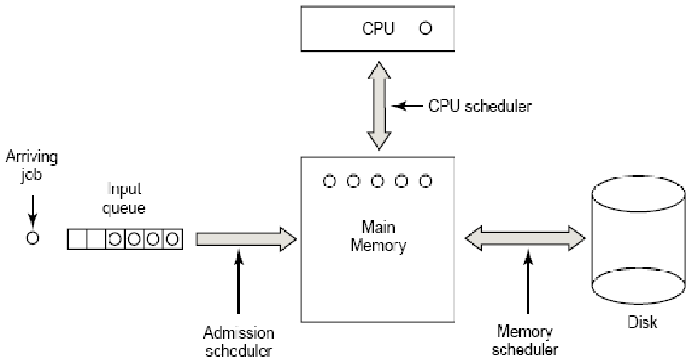

### 5.1.1 CPU 调度程序

每当 CPU 空闲的时候，操作系统就应该从就绪队列中选择一个进程来执行。干这个工作的叫做 **CPU 调度程序**。调度程序从内存里面选择一个可以执行的进程，并为其分配 CPU

队列里面放的是进程控制块（PCB）

### 5.1.2 什么时候需要进程调度？

1.  运行状态切换到等待状态（ IO 请求）
2.  运行状态切换到就绪状态（出现中断）
3.  等待切换到就绪（IO 请求完成）
4.  进程终止

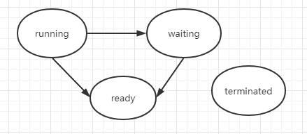

调度方式：

非抢占式（Nonpreemptive）调度:调度程序一旦把处理器分配给某进程后便让它一直运行下去，直到进程完成或发生某事件而阻塞时，才把处理器分配给另一个进程。如上1、4

抢占式（Preemptive）调度:当一个进程正在运行时，系统可以基于某种原则，剥夺已分配给它的处理机，将之分配给其它进程。剥夺原则有：优先权原则、短进程优先原则、时间片原则。如上2、3

### 5.1.3 Dispatcher（调度程序）

是个模块，把 CPU 的控制权交给**短期调度程序**选择的进程

功能：

-   切换上下文
-   切换到用户模式
-   跳转到用户程序的合适位置，以便重新启动程序

特点：尽可能快。因为每次进程切换都需要使用。

Dispatch latency（调度延迟） ：调度程序停止一个进程到启动一个进程所需要的时间

Linux命令：vmstat

## 5.2 调度准则

**最大化 CPU 利用率和吞吐量，最小化周转时间、等待时间和响应时间，公平！！**

周转时间Turnaround time ：进程从提交到完成所经历的时间。包括：在CPU上执行，就绪队列和阻塞队列中等待。

响应时间Response time ：从进程提出请求到首次被响应（而不是输出结果）的时间段（在分时系统环境下）

等待时间Waiting time  – 进程在就绪队列中等待的时间总和

公平性：不因作业或进程本身的特性而使上述指标过分恶化。如长进程等待很长时间。

优先级：可以使关键任务达到更好的指标

调度算法本身的调度性能准则

-   易于实现
-    执行开销比较小

## 5.3 调度算法

-   First-Come, First-Served (FCFS) Scheduling	 **先来先服务**调度
-   Shortest-Job-First (SJF) Scheduling  	               **短作业优先**调度
-   Priority Scheduling         	                                  **优先权**调度
-   Round Robin (RR)         	                                    **时间片轮转**调度
-   Multilevel Queue Scheduling                             **多级队列**调度
-   Multilevel Feedback Queue Scheduling           多级反馈队列调度
-   高响应比优先调度算法 Highest Response Ratio Next(HRRN)
    -   响应比R = (等待时间 + 要求执行时间) / 要求执行时间

### 5.3.1 FCFS算法

-   按照进程或作业提交顺序形成就绪状态的先后次序，分派CPU
-   当前进程或作业占用CPU，直到执行完或阻塞，才出让CPU（非抢占方式）
-   在进程或作业唤醒后（如I/O完成），并不立即恢复执行，通常等到当前作业或进程出让CPU
-   最简单的算法
-   用一个队列就可以实现

FCFS的特点

- 比较有利于长进程，而不利于短进程。
- 有利于CPU Bound的进程，而不利于I/O Bound的进程。

### 5.3.2 SJF算法

-   对预计执行时间短的作业（进程）优先分派处理器
-   最优的算法
-   平均等待时间最小
-   常用于长期调度

SJF的变型：

- 最短剩余时间优先**SRTF**(Shortest Remaining Time First)-基于抢占的SJF算法
    -   允许比当前进程剩余时间更短的进程来抢占
-   最高响应比优先HRRN(Highest Response Ratio Next)
    -   响应比R = (等待时间 + 要求执行时间) / 要求执行时间
        是FCFS和SJF的折衷

### 5.3.3 优先权调度

该算法总是把处理机分配给就绪队列中具有最高优先权的进程。

常用以下两种方法来确定进程的优先权： 

静态优先权: 静态优先权是在创建进程时确定的，在整个运行期间不再改变。依据有：进程类型、进程对资源的要求、用户要求的优先权。

动态优先权: 动态优先权是基于某种原则，使进程的优先权随时间改变而改变。

假定：最小的整数 = 最高的优先级.

SJF是以下一次CPU脉冲长度作为优先数的优先级调度


可以是抢占也可以非抢占

会产生饥饿：优先权低的进程可能永远不会被执行

-   解决方法：老化：随着时间推移，等待时间长的进程优先级会被提高

### 5.3.4 时间片轮转

特点：允许抢占，平均等待时间一般较长

基本思路：通过时间片轮转，提高进程并发性和响应时间特性，从而提高资源利用率。

RR算法：

-   将系统中所有的就绪进程按照FCFS原则，排成一个队列。
-   每次调度时将CPU分派给队首进程，让其执行一个时间片 (time slice) 。时间片的长度从几个ms到几百ms。
-   在一个时间片结束时，发生时钟中断。
-   调度程序据此暂停当前进程的执行，将其送到就绪队列的末尾，并通过上下文切换执行当前的队首进程。
-   进程可以未使用完一个时间片，就出让CPU（如阻塞）。

时间片长度的影响因素：

-   就绪进程的数目：数目越多，时间片越小（当响应时间一定时）
-   系统的处理能力：应当使用户输入通常在一个时间片内能处理完，否则使响应时间，平均周转时间和平均带权周转时间延长。

【其他】

在RR调度算法中，没有进程被连续分配超过一个时间片的CPU（除非它是唯一可运行的进程）。

如果进程的CPU执行超过一个时间片，那么该进程会被抢占，并被放回到就绪队列。

### 5.3.5 多级队列调度

特点：引入多个就绪队列，通过各队列的区别对待，达到一个综合的调度目标

根据进程的性质或类型的不同，将就绪队列再分为若干个子队列。

每个作业固定归入一个队列。

各队列的不同处理：不同队列可有不同的优先级、时间片长度、调度策略等。如：系统进程、用户交互进程、批处理进程等。

级队列算法调度须在队列间进行

-   固定优先级调度，即前台运行完后再运行后台。有可能产生饥饿

-   给定时间片调度，即每个队列得到一定的CPU时间，进程在给定时间内执行；如，80%的时间执行前台的RR调度，20%的时间执行后台的FCFS调度

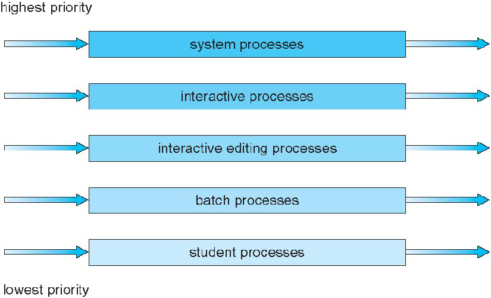

### 5.3.6 多级反馈队列

多级反馈队列算法是时间片轮转算法和优先级算法的综合和发展。

优点：

-   为提高系统吞吐量和缩短平均周转时间而照顾短进程
-   为获得较好的I/O设备利用率和缩短响应时间而照顾I/O型进程
-   不必估计进程的执行时间，动态调节


设置多个就绪队列，分别赋予不同的优先级，如逐级降低，队列1的优先级最高。每个队列执行时间片的长度也不同，规定优先级越低则时间片越长，如逐级加倍

新进程进入内存后，先投入队列1的末尾，按FCFS算法调度；若按队列1一个时间片未能执行完，则降低投入到队列2的末尾，同样按FCFS算法调度；如此下去，降低到最后的队列，则按"时间片轮转"算法调度直到完成。

仅当较高优先级的队列为空，才调度较低优先级的队列中的进程执行。如果进程执行时有新进程进入较高优先级的队列，则抢占执行新进程，并把被抢占的进程投入原队列的末尾。

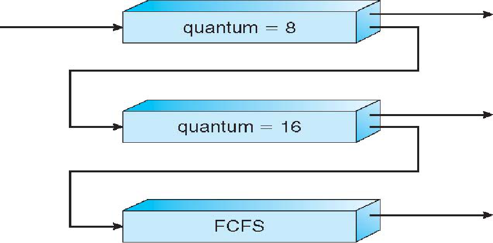

## 5.4 线程调度

在支待线程的操作系统上，内核级线程（而不是进程）才是操作系统所调度的。用户级线程是由线程库来管理的，而内核并不知道它们。用户级线程为了运行在CPU上，最终应映射到相关的内核级线程，但是这种映射可能不是直接的，可能采用轻量级进程(LWP)。

# 第六章：进程同步

进程之间竞争资源面临三个控制问题：

-   **互斥**（mutual exclusion )指多个进程不能同时使用同一个资源

-   **死锁**（deadlock )指多个进程互不相让，都得不到足够的资源。永远得不到资源

-   **饥饿**（starvation )指一个进程长时间得不到资源（其他进程可能轮流占用资源）。资源分配不公平

## 6.1 临界区问题

每个进程有一段代码，称为临界区(critical section) ，进程在执行该区时可能修改公共变量、更新一个表、写一个文件等。

当一个进程在临界区内执行时，其他进程不允许在它们的临界区内执行。也就是说，没有两个进程可以在它们的临界区内同时执行。

临界区问题(critical-section problem)是，设计一个协议以便协作进程。在进入临界区前，每个进程应请求许可。实现这一请求的代码区段称为进入区(entry section) 。临界区之后可以有退出区(exit section) ，其他代码为剩余区(remainder section) 。

临界资源：一次只允许一个进程使用(访问)的资源。如：硬件打印机、磁带机等，软件的消息缓冲队列、变量、数组、缓冲区等。

临界区：访问临界资源的那段代码

必须满足的要求：

-   互斥
-   空闲让进
-   有限等待

## 6.2 锁

### 6.2.1 互斥锁

一个进程在进入临界区时应得到锁；它在退出临界区时释放锁

当一个进程试图获取不可用的锁时，它会阻塞，直到锁被释放

### 6.2.2 自旋锁 spinlock

是一个与共用数据结构有关的锁定机制。特殊形式的互斥锁

储存在共用内存中。为了速度和使用任何在处理器体系下提供的锁定机构，获取和释放自旋锁的代码是用汇编语言写的。

当线程试图获得自旋锁时，在处理器上所有其它工作将终止。因此**拥有自旋锁的线程永远不会被抢占**，但允许它继续执行以便使它尽快把锁释放。内核对于使用自旋锁十分小心，当它拥有自旋锁时，它执行的指令数将减至最少。

【优点】：当进程在等待锁时，没有上下文切换（上下文切换可能需要相当长的时间） 。

因此，当使用锁的时间较短时，自旋锁还是有用的。自旋锁通常用于多处理器系统，一个线程可以在一个处理器上“旋转＂，而其他线程在其他处理器上执行临界区。

## 6.3 信号量

整形变量，只能 wait( ）和signal( ），原子性操作，当 S <= 0 的时候，进程必须等待

通常用信号量表示资源或临界区

信号量的物理含义  

-   `S.value >0` 表示有 `S.value` 个资源可用； 

-   `S.value=0`  表示无资源可用或表示不允许进程再进入临界区； 

-    `S.value<0`  则 `|S.value|` 表示在等待队列中进程的个数或表示等待进入临界区的进程个数。 

wait(S) ≡ P(S) ≡ down(S)  ： 表示申请一个资源

signal(S) ≡ V(S) ≡ up(S)   ： 表示释放一个资源

分类：

-   整型信号量
-   记录型信号量
-   AND型信号量
-   二值信号量


二值信号量类似互斥锁

```c
Semaphore mutex;    //  initialized to 1
do {
	wait (mutex);
         // Critical Section
     signal (mutex);
		// remainder section
} while (TRUE);
```


计数信号量可以用于控制访问具有多个实例的某种资源。

1、信号量的初值为可用资源数量。

2、当进程需要使用资源时，需要对该信号扯执行wait( ）操作。

3、当进程释放资源时，需要对该信号最执行signal( ）操作。

4、当信号量的计数为0 时，所有资源都在使用中。之后，需要使用资源的进程将会阻塞，直到计数大于0 。


【信号量的实现】

当一个进程执行 P 操作并且发现信号量不为正时，它必须等待。然而，该进程不是忙等待而是阻塞自己 block()。阻塞操作将一个进程放到与信号量相关的等待队列中，并且将该进程状态切换成等待状态。然后，控制转到CPU 调度程序，以便选择执行另一个进程。

等待信号量 S 而阻塞的进程，在其他进程执行操作signal( ）后，应被重新执行。进程的重新执行是通过操作 wakeup( ）来进行的，它将进程从等待状态改为就绪状态。然后，进程被添加到就绪队列


wait、signal操作必须成对出现，有一个wait操作就一定有一个signal操作。一般情况下：当为互斥操作时，它们同处于同一进程；当为同步操作时，则不在同一进程中出现。 

如果两个wait操作相邻，那么它们的顺序至关重要，而两个相邻的signal操作的顺序无关紧要。一个同步wait操作与一个互斥wait操作在一起时，同步wait操作在互斥wait操作前。 

wait、signal操作的优缺点 

优点：简单，而且表达能力强 

缺点：不够安全；wait、signal操作使用不当会出现死锁；实现复杂。 


## 6.4 经典同步问题

-   生产者消费者问题（有界缓冲区问题）
-   读者写者问题
-   哲学家就餐问题

生产者-消费者问题是最著名的同步问题，它描述一组生产者（P1  ……Pm）向一组消费者（C1……Cq）提供消息。它们共享一个有限缓冲池（bounded buffer pool）,生产者向其中投放消息，消费者从中取得消息。

生产者-消费者问题是许多相互合作进程的一种抽象。


读者写者

一个数据集（如文件）如果被几个并行进程所共享：

-   有些进程只要求读数据集内容，它称读者

-   一些进程则要求修改数据集内容，它称写者

-   几个读者可以同时读些数据集，而不需要互斥

-   一个写者不能和其它进程（不管是写者或读者）同时访问些数据集，它们之间必须互斥。

当写者写入数据时，独占数据库

【问题变种】

-   第一读者写者问题
    -   读者进程不应等待，除非数据库被另一个进程使用
-   第二读者写者问题
    -   一旦写者进程就绪，那么写者进程就必须尽可能快被执行


哲学家就餐问题

多个进程之间分配多个资源，并且不会产生饥饿和死锁。

为了避免死锁，把哲学家分为三种状态：思考、饥饿、吃饭，并且一次拿到两只筷子，否则不拿。（Dijkstra）

## 6.5 管程

管程的定义：管程是关于共享资源的数据结构及一组针对该资源的操作过程所构成的软件模块。

管程是管理进程间同步的机制，它保证进程互斥地访问共享变量，并方便地阻塞和唤醒进程。

管程可以函数库的形式实现。相比之下，管程比信号量好控制

主要特性：

-   模块化：一个管程是一个基本程序单位，可以单独编译；

-   抽象数据类型：管程是一种特殊的数据类型，其中不仅有数据，而且有对数据进行操作的代码

-   信息封装：管程是半透明的，管程中的外部过程（函数）实现了某些功能，至于这些功能是怎样实现的，在其外部则是不可见的；

实现要素：

-   管程中的共享变量在管程外部是不可见的，外部只能通过调用管程中所说明的外部过程（函数）来间接地访问管程中的共享变量；

-   为了保证管程共享变量的数据完整性，规定管程互斥进入；

-   管程通常是用来管理资源的，因而在管程中应当设有进程等待队列以及相应的等待及唤醒操作；

组成：

-   名称：为每个共享资源设立一个管程

-   数据结构说明：一组局部于管程的控制变量

-   操作原语：对控制变量和临界资源进行操作的一组原语过程（程序代码），是访问该管程的唯一途径。这些原语本身是互斥的，任一时刻只允许一个进程去调用，其余需要访问的进程就等待。

-   初始化代码：对控制变量进行初始化的代码


由于管程通常是用于管理资源的，因而在管程内部，应当存在某种等待机制。当进入管程的进程因资源被占用等原因不能继续运行时使其等待。为此在管程内部可以说明和使用一种特殊类型的变量----**条件变量**。

每个条件变量表示一种等待原因，并不取具体数值－－相当于每个原因对应一个队列。

# 第七章：死锁

## 7.1 概念

死锁：指多个进程因竞争共享资源而造成的一种僵局，若无外力作用，这些进程都将永远不能再向前推进

四个必要条件：

1、互斥：一个资源同一时间只能被一个进程使用

2、Hold and wait（占有并等待、请求和保持）：进程已经保持了至少一个资源，但又提出了新的资源要求，而该资源又已被其它进程占有，此时请求进程阻塞，但又对已经获得的其它资源保持不放

3、不可抢占、不剥夺：已有的资源不能被抢占

4、循环等待

## 7.2 处理策略

简单讲：预防、避免、检测、解除、装死看不到

大体分三种：

1、通过协议来预防或避免死锁，确保系统不会进入死锁状态。打破死锁的必要条件，一般是限制申请资源来解决，或者运行抢占资源，再比如就是进程有序申请资源

2、可以允许系统进入死锁状态，然后检测它，并加以恢复。

3、可以忽视这个问题，认为死锁不可能在系统内发生（如果发生了，程序员自己解决）

## 7.3 死锁避免算法

### 7.3.1 资源分配图算法

算法：假设进程Pi申请资源Rj。只有在需求边Pi --> Rj 变成分配边 Rj --> Pi 而不会导致资源分配图形成环时，才允许申请。

用算法循环检测，如果没有环存在，那么资源分配会使系统处于安全状态。如果存在环，资源分配会使系统不安全。进程Pi必须等待。

### 7.3.2 银行家算法

Dijkstra 提出的

## 7.4 死锁检测

死锁检测

死锁恢复

-   终止进程
    -   终止所有死锁的进程
    -   一次终止一个进程，直到消除死锁循环为止
-   允许资源抢占
    -   选择牺牲进程
    -   回滚牺牲的进程
    -   饥饿避免（不能总牺牲同一个）


# 第八章：内存管理

## 8.1 背景

操作系统的主要目的是执行程序，在执行时，这些程序及其访问的数据应该至少部分在内存中。

内存是现代计算机运行的核心 。 内存由一个很大的字节数组来组成， 每个字节都有各自的地址。 CPU 根据程序计数器的值从内存中提取指令，这些指令可能引 起对特定内存地址的额外加载与存储。 

CPU 可以直接访问的通用存储只有**内存**和处理器**内置的寄存器**。 机器指令可以用内存地址作为参数，而不能用磁盘地址作为参数。 因此，执行指令以及指令使用的数据，应处在这些可直接访问的存储设备上。 如果数据不在内存中，那么在 CPU 使用它们之前应先把数据移到内存。 

CPU 内置寄存器通常可以在一个 CPU 时钟周期内完成访问。对千寄存器的内容，大多数 CPU 可以在一个时钟周期内解释并执行一条或多条指令。而对于内存（它可通过内存总线的事务来访问），就不行了。完成内存的访问可能需要多个 CPU 时钟周期。在这种情况下，由于没有数据以便完成正在执行的指令，CPU 通常需要暂停(stall)。由于内存访问的频繁，这种情况是无法容忍的。补救措施是在 CPU 与内存之间，通常是在 CPU 芯片上，增加更快的内存；这称为高速缓存(cache)

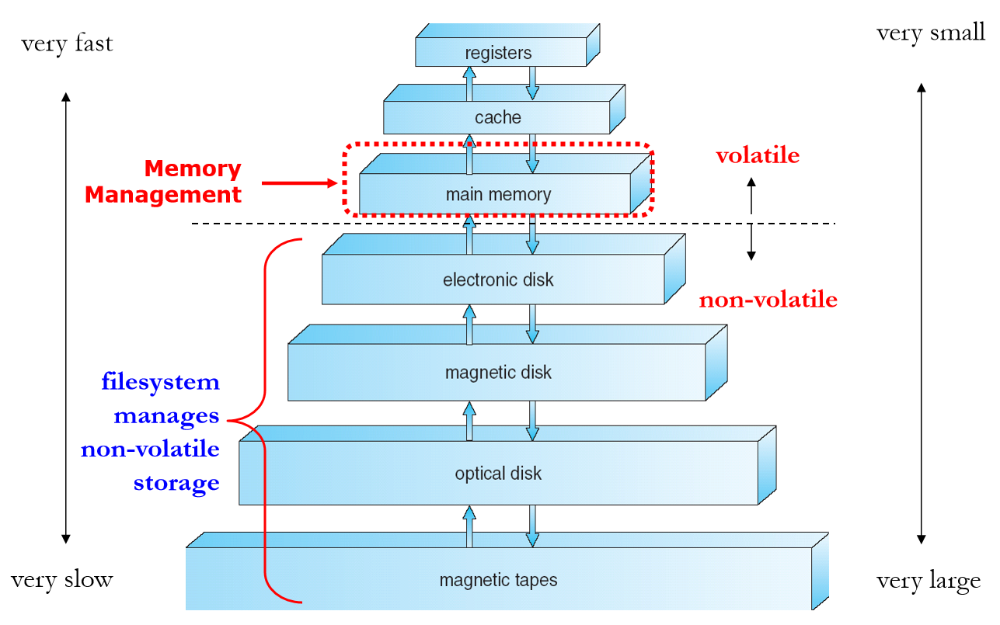


确保每个进程都有一个单独的内存空间。 单独的进程内存空间可以保护 进程而不互相影响

基地址寄存器(base register) 含有最小的合法的物理内存地址，而界限地址寄存器 (limit register) 指定了范围的大小。 

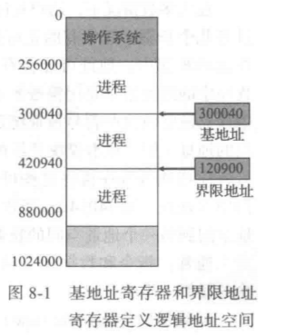


内存空间保护的实现是通过 CPU 硬件对在用户模式下产生的地址与寄存器的地址进行比较来完成的

只有操作系统可以通过特殊的特权指令，才能加载基地址寄存器和界限地址寄存器。

### 8.1.1 绝对地址和相对地址

Logical address（逻辑地址，相对地址，虚地址）

- 用户的程序经过汇编或编译后形成目标代码，目标代码通常采用相对地址的形式。

- 首地址为0，其余指令中的地址都相对于首地址来编址。

- 不能用逻辑地址在内存中读取信息。

Physical address （物理地址，绝对地址，实地址）

- 内存中存储单元的地址。
- 物理地址可直接寻址

从虚拟地址到物理地址的运行时映射是由内存管理单元 (Memory-Management Unit, MMU ) 的硬件设备来完成。

## 8.1.2 动态加载和动态链接

 采用动态加载时，一个程序只有在调用时才会加载。所有程序都以 可重定位加载格式保存在磁盘上。

程序执行步骤：

1、主程序被加载到内存，并执行。 

2、当一个程序需要调用另一 个程序时，调用程序首先检查另一个程序是否已加载。 如果没有，可重定位链接程序会加 载所需的程序到内存，并更新程序的地址表以反映这一变化。 

3、控制传递给新加载的 程序。

优点：只有一个程序被需要时，它才会被加载；


在内核模式下执行的操作系统可以无限制地访问操作系统及用户的内存。 

1、加载用户程序到用户内存

2、转储出现错误的程序

3、访问和修改系统调用的参数

4、执行用户内存的 IO

5、提供许多其他服务等

## 8.2 Swapping（交换技术）

进程必须在内存中以便执行。不过，进程可以暂时从内存交换(swap)到备份存储(backing store)，当再次执行时再调回到内存中。

交换有可能让所有进程的总的物理地址空间超过真实系统的物理地址空间，

如果我们想要换出一个进程，那么应确保该进程是完全处于空闲的。

一个常用的变种是(UNIX, Linux, and Windows)：

正常情况下，禁止交换；

当空闲内存（未被操作系统或进程使用的内存）低千某个阙值时，启用交换。

当空闲内存的数量增加了，就停止交换。

另一变种是交换进程的部分（而不是整个进程），以降低交换时间。

移动系统不支持交换，Flash memory based：

- 小空间

- 闪存写次数限制

- 在移动平台上闪存和 CPU 之间的吞吐量很低

iOS要求应用程序自愿放弃分配的内存

- 只读数据从系统中直接删除，已修改数据不会被删除

- OS可以终止任何未能释放足够空间的应用

Android如果空闲内存不足，会终止应用程序，但首先会将应用程序状态写入闪存，以便快速重启

## 8.3 连续内存分配

内存通常分为两个区域：一个用于驻留操作系统，另一个用于用户进程。

操作系统可以放在低内存，也可放在高内存。影响这一决定的主要因素是中断向量的位置。由于中断向量通常位于低内存，因此程序员通常将操作系统也放在低内存

在采用连续内存分配 (contiguous memory allocation) 时， 每个进程位于一个连续的内存区域，与包含下一个进程的内存相连

### 8.3.1 内存保护

重定位寄存器、界限寄存器

 MMU 通过动态地将逻辑地址加上重定位寄存器的值，来进行映射。 映射后的地址再发送到内存

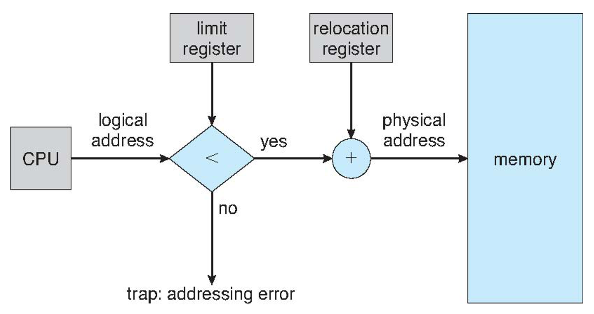

### 8.3.2 内存分配

多分区分配

分区式管理的基本思想是将内存划分成若干个连续区域，称为分区。每个分区只能存放一个进程。 

- fixed partitioning（固定分区）：分区大小固定

- Dynamic Partitions（动态分区）：在程序装入内存时把可用内存“切出”一个连续的区域分配给该进程，且分区大小正好适合进程的需要。操作系统维护已分配分区和空闲分区的信息


动态存储分区问题（Dynamic Storage-Allocation Problem）

1、首次适应（First-fit）：分配首个足够大的孔。查找可以从头开始，也可以从上次首次适应结束时开始。一旦找到足够大的空闲孔，就可以停止。 

2、最优适应（Best-fit）：分配最小的足够大的孔。 应查找整个列表

3、最差适应（Worst-fit）：分配最大的孔。 应查找整个列表

4、Next-fit：类似首次适应，每次分区时，查找都从上次结束的地方开始

首次适应和最优适应在执行时间和利用空间方面都好于最差适应。 

首次适应和最优适应在利用空间方面难分伯仲，但是首次适应要更快些。

### 8.3.3 碎片（Fragmentation）

首次适应和最优适应算法都有外部碎片 

外部碎片问题的一种解决方法是紧缩 ( compaction) 。 它的目的是移动内存内容，以便将所有空闲空间合并成一整块。 

外部碎片化问题的另一个可能的解决方案是：允许进程的逻辑地址空间是不连续的；这样，只要有物理内存可用，就允许为进程分配内存。 有两种互补的技术可以实现这个解决方 案：分段和分页

内部碎片 (internal fragmentation)，这部分内存在分区内部，但又不能用

## 8.4 分段

逻辑地址空间是由一组段构成。每个段都有名称和长度。

地址指定了段名称和段内偏移。因此用户通过两个量来指定地址：段名称和段偏移。

为了实现简单起见，段是编号的，是通过段号而不是段名称来引用。因此，逻辑地址由有序对组成：

`＜段号s，段偏移d＞`

通常，在编译用户程序时，编译器会根据输入程序来自动构造段。

 段表的每个条目都有段基地址 (segment base) 和段界限 (segment limit) 。 段基地址包含该段在内存中的开始物理地址，而 段界限指定该段的长度。

## 8.5 分页

物理内存分为固定大小的块，称为帧(size is power of 2, between 512 bytes and 8,192 bytes)

- Linux 、Windows for x86: 4K
- 查看命令 `getconf PAGESIZE`

逻辑内存也分为同样大小的块，称为页

跟踪所有的空闲帧

设置一个页表来将逻辑地址转换为物理地址

页码作为页表的索引 。 页表包含每页所在物理内存的基地址。 这个基地址与页偏移的组合就形成了物理内存地址，可发送到物理单元

有内碎片（可能用不完）

如果进程大小与页大小无关，那么每个进程的内部碎片的均值为半页 。 

分页允许我们使用的物理内存大于 CPU 地址指针可访问的空间 。

 

TLB 与页表一起使用的方法如下： 

TLB 只包含少数的页表条目 。 当 CPU 产生一个逻辑 地址后，它的页码就发送到 TLB。 如果找到这个页码，它的帧码也就立即可用，可用于访 问内存。 

如果页码不在 TLB 中（称为 TLB 未命中 (TLB miss ) ），那么就需访问页表。 取决于 CPU,，这可能由硬件自动处理或通过操作系统的中断来处理。

当得到帧码后，就可以用它们来访间内存。 另外，将页码和帧码添加到 TLB,，这样下次再用时就可很快查找到；如果 TLB 内的条目已满，那么会选择一个来替换

# 第九章：虚拟内存管理

## 9.1 Demand paging （请求调页，按需调页，请求页式管理）

仅在需要时才加载页面

有效-无效位方案：当该位被设置为“有效”时，相关联的 页面是合法的，并且在内存中 。 当该位被设置为“无效”时，页面无效（ 即不在进程的逻辑 地址空间中），或有效但只在磁盘上。 对千已调入内存的页面，它的页表条目是照常设置的； 但是对于不在内存的页面，它的页表条目可简单标记为无效，或者包含磁盘上的页面地址。 

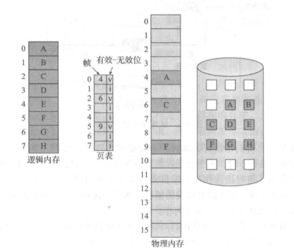


对标记为无效的页面访问会产生缺页错误(page fault)。

分页硬件在通过页表转换地址时会注意到无效位被设置，从而陷入操作系统。这种陷阱是由于操作系统未能将所需的页面调入内存引起的。处理这种缺页错误的程序很简单：

1．检查这个进程的内部表，以确定该引用是有效的还是无效的内存访问。

2．如果引用无效，那么终止进程。如果引用有效但是尚未调入页面，那么现在就应调入。

3．找到一个空闲帧（例如，从空闲帧链表上得到一个）。

4．调度一个磁盘操作，以将所需页面读到刚分配的帧。

5．当磁盘读取完成时，修改进程的内部表和页表，以指示该页现在处于内存中。

6．重新启动被陷阱中断的指令。

该进程现在能访问所需的页面，就好像它总是在内存中。

在任何情况下，缺页错误的处理时间有三个主要组成部分：

1、处理缺页错误中断。

2、读入页面。

3、重新启动进程

## 9.2 写时复制 (copy-on-write)

允许父进程和子进程最初共享相同的页面来工作。

 这些共享页面标记为写时复制，这意味着如果任何一个进程**写入共享页面**，那么就创建共享页面的副本

当使用写时复制技术时，仅复制任何一进程修改的页面，所有未修改的页面可以由父进程和子进程共享。

还要注意，只有可以修改的页面才需要标记为写时复制。不能修改的页面（包含可执行代码的页面）可以由父进程和子进程共享。

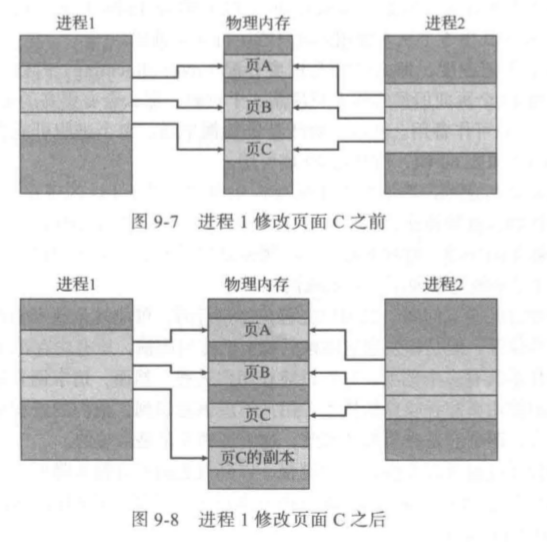

可以使用池化技术

## 9.3 页面置换

步骤：

1、找到所需页面的磁盘位置。

2、找到一个空闲帧：

​	a．如果有空闲帧，那么就使用它。

​	b．如果没有空闲帧，那么就使用页面置换算法来选择一个牺牲帧(victim frame)。

​	c. 	将牺牲帧的内容写到磁盘上，修改对应的页表和帧表。

3、将所需页面读入（新的）空闲帧，修改页表和帧表。

4、从发生缺页错误位置，继续用户进程。


**有关算法：**

- First-In-First-Out Algorithm (FIFO，先进先出算法) 

- Optimal Algorithm （OPT，最佳页面置换算法）：置换最长时间不会使用的页面

- Least Recently Used (LRU) Algorithm (最近最久使用算法) 

- LRU Approximation Algorithms （近似LRU算法） ：

  - Additional-Reference-Bits Algorithm

  - Second-Chance（clock） Algorithm

  - Enhanced Second-Chance  Algorithm

- Counting-Base Page Replacement：

  - Least Frequently Used Algorithm (LFU，最不经常使用算法）

  - Most Frequently Used Algorithm (MFU，最经常使用算法)

Page Buffering Algorithm（页面缓冲算法）