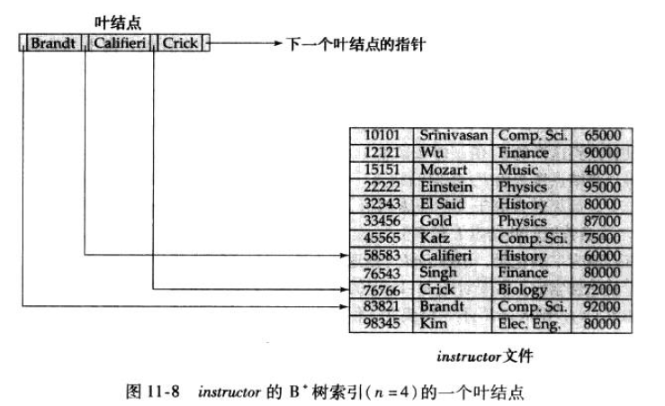

# 数据结构与算法分析

## 第一章

### 递归

设计准则：

- 基准情形
- 递推公式


## 第二章：算法分析

### 1、最大的子序列和的问题

给定一个序列，求一个最大的子序列和，如果所有整数均为负数，则子序列和为0


解法：线性时间运行，常量空间

```java
/**
 *
 * @param array:输入的数组
 * @param n:数组长度
 * @return 最大子序列和
 */
public static int maxSubsequenceSum(int[] array, int n){
    int thisSum, maxSum;
    thisSum = maxSum = 0;// 初始化
    for(int i=0; i<n; i++){
        thisSum += array[i];
        if(thisSum > maxSum){
            maxSum = thisSum;
        }
        if(thisSum < 0){
            thisSum = 0;// 相当于把负的那部分子序列去掉
        }
    }

    return maxSum;
}
```


### 2、运行时间上的对数

如果一个算法用常数时间将问题的大小削减为其一部分，则算法是O(logN)

## 第三章：抽象数据类型（ADT）

表、栈和队列

### 1、表（list）

#### 1.1 数组实现

- 浪费空间
- 插入删除很麻烦（因为是连续存储）

#### 1.2 链表

- 不连续存储
- 指向下一个元素的next指针
- 插入删除方便（修改几个指针就行）
- 删除的话需要找到待删除节点的前一个节点

#### 1.3 双向链表

- 多了一个指针（需要额外的空间）
- 可以倒序扫描链表
- 增加了插入和删除的开销
- 简化了删除操作

#### 1.4 循环链表

- 最后一个单元指向第一个单元
- 可单向，可双向

#### 1.5 应用

- 多项式
- 桶排序
- 多重表

### 2、栈（stack）

- 插入和删除只能在一个位置上（栈顶）进行
- 后进先出表
- push和pop操作
- 栈顶元素top

#### 2.1 数组实现

需要提前声明数组大小

#### 2.2 链表实现

- 单链表

#### 2.3 应用

- 平衡符号（括号检查等）
  - 做一个空栈。读入字符直到末尾。
  - 如果是一个开放的符号（左括号等），入栈
  - 如果是一个封闭的符号
    - 判断栈空不空，空的话报错，退出
    - 不空，出栈，但是如果出栈的那个符号不匹配，报错，退出
  - 操作完毕，如果栈不空，报错
- 后缀表达式
  - 数字的话入栈，符号的话弹出两个元素，操作完，将结果入栈
  - 复杂度O(N)
- 中缀转后缀
- 函数调用

### 3、队列（queue）

- 队列也是表
- 先进先出
- 入队排到队尾，出队是队头出去，就是排队
- 队尾rear，队头front

#### 3.1 数组实现

#### 3.2 链表实现

#### 3.3 应用

- 打印机

## 第四章：树

一般的树：第一儿子，下一兄弟

### 4.1 树的遍历

前序、后序、中序、层次

### 4.2 二叉树

- 最多两个儿子

应用：把后缀表达式转为表达式树

- 如果是数字，建一个单节点的树，然后入栈
- 如果是符号，弹出来两个树，让出栈的树作为符号的儿子，然后入栈
- 最后的那棵树就是结果

### 4.3 二叉搜索树

左<根<右

- 平均深度`O(logN)`
- 插入、删除、查找元素平均时间`O(logN)`
- 删除操作
  - 叶节点，直接删
  - 只有一个儿子，调整这个节点的父指针指向即可
  - 两个儿子，找左子树最大值（或者右子树最小值），用那个节点的数据代替删除节点的数据，然后把那个节点递归的删掉

### 4.4 AVL树

- 是二叉搜索树
- 树的深度保证是`O(logN)`
- 自带平衡条件
  - 左右子树的高度最多相差1
- 高为h，最少的节点数为S(h)=S(h-1)+S(h-2)+1
- 除插入（假设懒惰删除，就是仍然保留在树中，但是做个已删除的标记）外，所有的操作都是`O(logN)`
- 插入以后，需要判断还是不是AVL树

### 4.5 伸展树

- 是二叉搜索树
- 从空树开始，连续M次操作，最多Mlog(N)，也就是摊还时间是log(N)
- 一个节点被访问过，那么这个节点就要经过一系列的AVL树的旋转被放到根上
- 删除操作：先把删除的节点放到根上，删除该节点，找左子树的最大值，推到根上，让右子树成为这个新根的右子树即可

### 4.6 B树（重点）

M阶的B树：

- 也被称为B减树
- 根要么是树叶，要么儿子在2和M之间
- 除根外，所有非叶节点儿子数在0.5M（向上取整）到M之间
- 数据在叶子上，叶子的深度相同，叶中关键字的个数在0.5M（向上取整）到M之间，数据是有序的（一般递增）
- 每一个内部节点都有着指向儿子的指针（最多M个），以及子树中的最小关键字（最多M-1个关键字，第一个子树的最小值不放），关键字值递增，M个指针夹着M-1个关键字
- 插入可能会分裂节点，删除可能会合并节点
- **也存在着数据可以放在内部节点上的定义**（了解即可）

用途：数据库系统

### 4.7 数据库中索引中的B+树

- 叶节点也有指针，所有的叶节点构成一个有序链表
- 索引数据在叶子上



## 第五章：散列

每个关键字被映射到一个表里面，并放到合适的地方

- 这个映射，就是hash函数
- 都是整数，表大小是素数

解决映射冲突的方法：

- 分离链表法

- 开放定址法

	- 思想：位置=[hash(x)+f(i)]mod表大小，f(i)是冲突函数
	- 线性探测：发生冲突，放到下一个空闲地址
		- 冲突函数：f(i)=i
	- 平方探测：f(i)=i^2
		- 表大小为素数，并且一半为空，总能插入成功
	- 双散列：f(i)=i*hash2(X)

- 再散列

    - 表扩容一倍，使用新的散列函数，然后把原来的数据搬过来
    - 实现方式：
    	- 表装满一半就扩容
    	- 插入失败才扩容
    	- 客座率达到一定程度再扩容（好的方式）

    
    
    
    **性质：**插入，查找平均O(1)
    
    

## 第六章：优先队列（堆）

堆是一个被完全填满的二叉树（底层可能例外），底层元素从左到右排列

父亲节点的值小于儿子节点

一般指的都是最小堆，最小值在根上

可以用数组实现

插入：放在在下一个空闲位置，然后上滤，最多log(N)

删除：上滤，也可以懒惰删除，最多log(N)

##   第七章：图论算法

DFS

```c
void dfs(Vertex V){
    Visited[V] = True;
    for each w adjacent to V
        if(!Visited[w])
            dfs(w);
}
```

