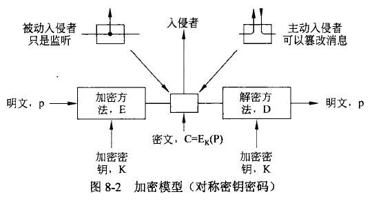
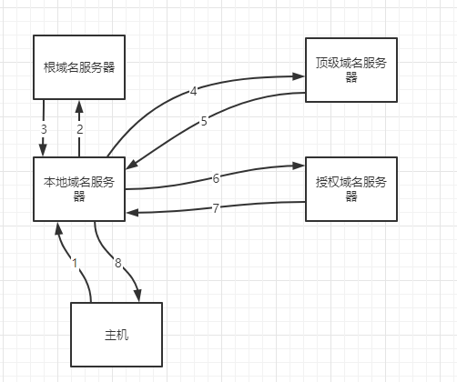
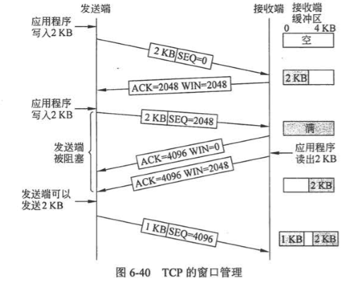

# 计算机网络

>   参考文献：
>
>   -   [1]王道计算机网络复习书
>   -   [2]计算机网络（第五版）- 潘爱民等译

- [计算机网络](#计算机网络)
  - [网络安全](#网络安全)
    - [对称秘钥算法](#对称秘钥算法)
      - [DES 数据加密标准](#des-数据加密标准)
      - [AES 高级加密标准](#aes-高级加密标准)
    - [公开秘钥算法](#公开秘钥算法)
    - [数字签名](#数字签名)
      - [对称秘钥签名](#对称秘钥签名)
      - [公开秘钥签名](#公开秘钥签名)
    - [证书](#证书)
    - [SSL 安全套接字层](#ssl-安全套接字层)
  - [应用层](#应用层)
    - [网络应用模型](#网络应用模型)
      - [C/S 模型](#cs-模型)
      - [P2P 模型](#p2p-模型)
    - [域名系统 DNS](#域名系统-dns)
      - [域名解析过程](#域名解析过程)
    - [文件传输协议 FTP](#文件传输协议-ftp)
    - [HTTP协议](#http协议)
      - [HTTP 报文结构](#http-报文结构)
  - [传输层](#传输层)
    - [功能](#功能)
    - [端口的作用](#端口的作用)
    - [套接字](#套接字)
      - [面向连接和无连接](#面向连接和无连接)
    - [TCP 和 UDP](#tcp-和-udp)
      - [UDP 协议](#udp-协议)
      - [TCP 协议](#tcp-协议)
      - [三次握手](#三次握手)
      - [四次挥手](#四次挥手)
      - [TCP 可靠传输](#tcp-可靠传输)
      - [TCP 流量控制](#tcp-流量控制)
      - [TCP 拥塞控制](#tcp-拥塞控制)

## 网络安全

### 对称秘钥算法

**使用相同的秘钥加解密**

#### DES 数据加密标准

三重 DES

1、使用秘钥 1 执行 DES 加密

2、使用秘钥 2 解密

3、使用秘钥 1 加密

#### AES 高级加密标准

### 公开秘钥算法

加密算法 E，解密算法 D

1、$\ D(E(P))=P$

2、从 E 很难推出 D

3、加密算法不可能被选择明文攻击破解

使用公钥加密信息，私钥解密信息 

### 数字签名

1、接收方可以验证发送方的身份

2、发送方不能说我没发过

3、接收方不可能伪造发送的信息

#### 对称秘钥签名

**使用同一秘钥**

找一个权威机构，自己的私钥自己知道，机构也知道

发送消息：

1、Alice 使用私钥加密，并标识要发送给 Bob

2、机构看到消息，解密该消息，然后发给 Bob

3、Bob 接收消息

#### 公开秘钥签名

### 证书

认证中心 CA

证书：将一个公钥和一个实体绑定

### SSL 安全套接字层

HTTPS 443端口

## 应用层

### 网络应用模型

#### C/S 模型

服务器总是打开，总是处于接收请求的状态，如果收到请求，则解析请求，进行必要的处理，并将处理结果发送给客户端

特点：

-   客户机地位不均等，服务器可以通过用户权限控制管理客户机
-   客户机不直接通信
-   单个服务器支持的客户机有限

#### P2P 模型

各节点既是客户端又是服务器，都可以上传下载，相互之间直接通信

优点：

-   减轻了服务器的压力
-   消除对某个服务器的完全依赖，可以把任务放到多个节点上
-   可直接共享文档
-   拓展性好
-   网络健壮性强

缺点：

-   由于既获取服务也提供服务，内存占用较大，会影响整机速度

### 域名系统 DNS

C/S 模型，协议运行在 UDP 之上，53 号端口

域名是层次结构，级别高的在右边

域名系统：联机分布式的数据库系统

四种 DNS 服务器：根（13个）、顶级、授权、本地

每台主机都必须在授权域名服务器登记

#### 域名解析过程

两种方式：

-   递归查询（根 DNS 服务器是中继节点，压力大）
-   递归和迭代相结合

递归查询示意图：

递归和迭代结合：

主机向本地 DNS 服务器查询是递归，本地 DNS 向其他 DNS 查询是迭代

域名解析过程如下：

1、客户机发送 DNS 请求报文，以 UDP 数据报的形式发送到本地 DNS 服务器

2、本地 DNS 收到后，先查缓存，如果没有，自己扮演 DNS 客户，向根域名服务器发送解析请求

3、根 DNS 服务器收到后，判断一下属于哪个顶级域名服务器，将对应的 IP 地址发来，说，你去找他，他知道

4、本地 DNS 服务器向顶级域名服务器发送解析请求

5、顶级收到后，判断一下属于哪个授权域名服务器，将对应的 IP 地址发来，说，你去找他，他知道

6、本地向授权发送请解析请求

7、授权收到之后会将解析结果发回本地域名服务器

8、本地把查询结果存到缓存，并发给客户端

### 文件传输协议 FTP

21 端口，C/S 模型，使用 TCP，有两个并行的 TCP 连接，一个控制连接进程（21），一个数据连接进程（20）

客户端有传输请求的时候才会创建数据连接进程 

功能：

1、在不同种类操作系统之家传输文件（屏蔽了操作系统的细节）

2、通过用户权限控制管理用户行为

3、可以用匿名 FTP 方式提供公用文件的共享能力

### HTTP协议

80 端口、无状态

使用 TCP进行可靠的传输

输入 URL 之后发生的事情：

1、浏览器分析 URL ，然后请求域名解析获得 IP 地址

2、与服务器建立 TCP 连接，然后发送 HTTP 请求

3、服务器对浏览请求进行处理，通过 HTTP 响应返回信息给浏览器

4、关闭连接

5、浏览器渲染页面

HTTP/1.1 支持长连接，分两种：

1、非流水线。收到前一个的响应之后才能发请求

2、流水线。发现对象引用就发请求

#### HTTP 报文结构

-   请求报文
-   响应报文

组成：开始行、首部行、实体主体

请求报文和响应报文仅开始行不同

-   开始行：有三个字段，请求行是请求的方法、URL 以及 HTTP 版本号；响应行是版本、状态码、短语

## 传输层

### 功能

为运行在不同主机上的进程之间提供逻辑通信，屏蔽了低层网络核心的细节，让两个进程认为咱们两个是直接在通信

### 端口的作用

让各种应用层的进程把要传输的数据通过端口号向下交付给传输层，以及让传输层（一般指另外一个主机）知道把要传输的数据通过端口号向上交付给应用层的有关进程。

其实就是一个标识作用，让应用层知道该把数据通过哪个端口给传输层，传输层根据这个端口号把数据给应用层的相关进程。

端口号有 16 位，所以最大是 65536 - 1 = 65535

### 套接字

实际上是一个通信端点，即 套接字 = (主机 IP 地址, 端口号)，它可以唯一标识一台主机的一个应用（进程）

通常用C/S架构

只允许交换无结构的字节流

#### 面向连接和无连接

面向连接：就是要求通信双方在通信之前必须要建立连接，也就是 `建立连接 -> 开始通信 -> 通信结束，关闭连接`

无连接：通信双方不需要事先建立连接，如果需要通信，直接将信息发送到网络，让该信息的传递在网上尽力而为地往目的地传送。

TCP

-   面向连接（传送数据前需要建立连接）
-   全双工
-   没有广播和组播
-   用于可靠性更重要的场合，如 FTP，HTTP，Telnet远程登录

UDP

-   无连接，不可靠
-   收到 UDP 数据报之后不需要给出确认报文
-   执行速度快，实时性好，如 DNS，RTP（实时传输协议）

### TCP 和 UDP

#### UDP 协议

**优点：**

1、无需建立连接，不会引入建立连接的时延

2、无连接。不需要维护连接状态，一般可以支持更多的活动客户机

3、分组首部开销小。仅有 8B 的开销（TCP 有 20B）

4、可以更好地控制发送的数据和发送时间。没有拥塞控制，网络中的拥塞不会影响主机的发送效率。

**常用场景**

-   一次性传输较少数据的网络应用，如 DNS，SNMP
-   多媒体应用（IP 电话，实时视频会议，流媒体等）

不保证可靠交换，所以维护传输可靠性的工作需要用户在**应用层**完成

面向报文。发送方 UDP 对应用层传下来的报文，仅仅是添加一个首部就交给 IP 层，别的啥也不干

**首部格式**

UDP 数据报包括：UDP 首部和用户数据

首部有四个字段：源端口、目的端口、数据报长度（包含首部和数据）、校验和

#### TCP 协议

在不可靠的 IP 层之上实现的可靠的数据传输协议

解决的问题：传输的可靠、有序、无重复和不丢失问题

**特点**

1、面向连接的

2、一个 TCP 连接只能有两个端点，每条 TCP 连接只能是点对点的

3、提供可靠的交付，保证数据无差错、不丢失、不重复、有序

4、全双工通信。TCP 两端都有缓存，用来临时存放通信数据

-   发送缓存：发送应用程序传送给发送放 TCP要发送的数据、TCP 已发送但是未收到确认的数据
-   接收缓存：按序到达但未被接收方应用程序读取的数据、不按序到达的数据

5、面向字节的。

**首部格式**

一个 TCP 报文段分为 TCP 首部和 TCP 数据两部分，整个报文段被封装在 IP 数据报的数据部分

TCP 报文段用途：

-   运载数据
-   建立连接
-   释放连接
-   应答

**结构示意图**

>   图片来源：http://c.biancheng.net/view/6441.html
>
>   https://blog.csdn.net/lqglqglqg/article/details/48850029

#### 三次握手

每个 TCP 连接都有三个阶段：建立连接、数据传送、连接释放

TCP 连接需要解决三个问题：

1、要使发送双方都知道对方的存在

2、要允许双方协议一些参数（如最大窗口值，是否使用窗口扩大选项，时间戳服务及服务质量）

3、能够对运输实体资源进行分配

TCP 连接的端口是套接字（IP 地址 + 端口）

每条 TCP 连接可以由通信两端的两个端点确定。

TCP 连接的建立采用 C/S 模式

服务端的资源是在第二次握手时分配的（容易遭到 SYN 泛红攻击）

客户端的资源是在第三次握手的时候建立的

#### 四次挥手

当 FIN 段被另 一方确认后，这个方向上的连接就被关闭，不再发送任何数据。然而，另一个方向上或许还在继续着无限的数据流。当两个方向都关闭后，连接才算被彻底释放

为了避免两军对垒问题，需要使用计时器。如果在两倍于最大数据包生存期内，针对 FIN 的响应没有出现，那么 FIN 的发送端直接释放连接

TCP 有限状态机的状态：

#### TCP 可靠传输

保证接收方进程从缓存区读出的字节流与发送方发出的字节流完全一致

使用的机制：校验、序号、确认、重传

1、序号

TCP 首部的序号字段保证数据能有序提交给应用层，序号值是本报文要发送的第一个字节的序号

2、确认

确认号是希望收到对方的下一个报文段的数据的第一个字节的序号。

3、重传

重传条件：超时和冗余 ACK

（1）超时

每发送一个报文段，就对这个报文设置一次计时器。如果计时器设置的重传时间到期但还没有收到确认，就必须重传。（RTT：报文往返一趟的时间）

（2）冗余确认

当收到三个 ACK 的时候，必须重传该报文。

比如，1、2、3、4、5，五个报文发出去，但是2号丢了。**TCP 规定每当比期望序号大的失序报文到达时，就要发送一个冗余 ACK，指明期待收到的下一个报文序号。**所以会发送3个1号报文的冗余ACK，必须重传。

#### TCP 流量控制

避免发送方发送的数据大于接收方缓存，从而导致数据丢失。

滑动窗口协议

>例如，假设接收端有一个 4096 字节的缓冲区，如图 6-40 所示。如果发送端传送了一个2048字节的数据段，并且该数据段已被正确地接收，那么接收方将确认该数据段；然而，由于接收端现在只剩下2048字节的缓冲区空间（在应用程序从缓存区取走数据之前），所以它将宣告下一个期望字节开始窗口为 2048。

接收方根据自己接收缓存的大小，动态调整发送方的发送窗口大小，这是接收窗口 rwnd

发送方根据自己对当前网络拥塞程度估计而确定的窗口值，这是拥塞窗口 cwnd。

#### TCP 拥塞控制

防止过多的数据注入网络，保证网络中的路由器或者链路不至于过载。

4种算法：慢开始、拥塞避免、快重传、快恢复

1、慢开始算法

拥塞窗口指数级别增长，最开始是1，然后是2、4、8......

达到规定的慢开始阈值之后，改用拥塞避免算法

2、拥塞避免算法

每次增加1，线性增长

如果出现拥塞，把慢开始的阈值设置为发生拥塞时的发送方的 cwnd 的一半，然后把拥塞窗口设置成1，重新慢开始（这样做是为了迅速减少主机发送到网络中的分组数，使发生拥塞的路由器把积压的分组处理完）

3、快重传

收到三个冗余 ACK 就必须重传

4、快恢复（因为跳过了慢开始阶段）

收到三个冗余 ACK，把慢开始的阈值设置为发生拥塞时的发送方的 cwnd 的一半，然后把拥塞窗口设置成这个阈值，然后执行拥塞避免算法

在流量控制中，发送方发送数据的量由接收方决定，而在拥塞控制中，则由发送方自己通过检测网络状况来决定。

实际上，慢开始、拥塞避免、快重传和快恢复几种算法应是同时应用在拥塞控制机制之中的，当发送方检测到超时的时候，就采用慢开始和拥塞避免，当发送方按收到冗余 ACK 时,就采用快重传和快恢复。

发送方发送窗口的实际大小由流量控制和拥塞控制共同决定。因此，当同时出现接收端窗口（rwnd）和拥塞窗口(cwnd）时，发送方实际的发送窗口大小是由 rwnd 和 cwnd 中较小的那一个确定的。

