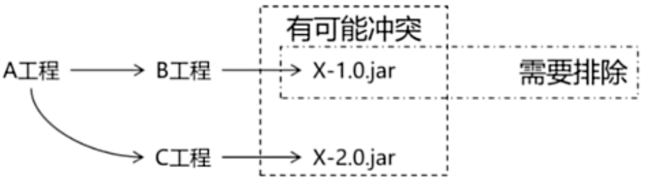

## Maven问题及解决方案

### 1、依赖冲突

定义：直接引用或者间接引用出现了相同的 jar 包，会导致整个 maven 工程出现相同的 jar 包，这就叫做依赖冲突




解决方案：

1、自动选择原则

- 最短路径优先（第一原则）：A->B->C->X (version 0.1)，D->X (version 0.2)，则X的版本为0.2
- 先声明的优先（第二原则）：A->X (version 0.1)，D->X (version 0.2)，X的路径长度相同，如果A先声明，则X的版本为0.1

2、手动排除

```xml
<dependency>
    <groupId>mysql</groupId>
    <artifactId>mysql-connector-java</artifactId>
    <version>8.0.30</version>
    <exclusions>
        <exclusion>
            <groupId>ch.qos.logback</groupId>
            <artifactId>logback-classic</artifactId>
        </exclusion>
    </exclusions>
</dependency>
```

