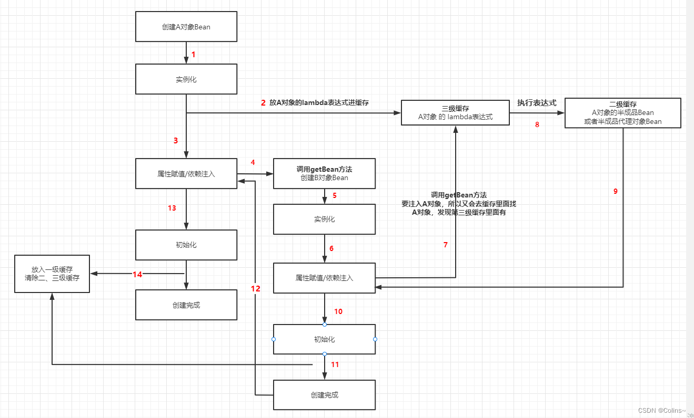

# Spring面试题

## 如何解决循环依赖

三级缓存

三级缓存的三个级别分别是：

1. **singletonObjects：** 这个缓存存储已经完全初始化的单例Bean对象。当一个Bean创建完成后，它会被放入这个缓存中，供其他Bean进行引用。如果其他Bean需要这个已初始化的Bean，Spring会直接从这个缓存中获取。
2. **earlySingletonObjects：** 这个缓存存储正在创建中的Bean实例，但是这些实例可能还没有完全初始化完成。当一个Bean开始创建时，它会被放入这个缓存中。其他需要引用该Bean的Bean在创建过程中可以使用这个尚未完全初始化的实例，从而避免循环依赖。
3. **singletonFactories：** 这个缓存存储Bean的工厂（Factory）对象。当一个Bean开始创建时，它的工厂对象会被放入这个缓存中。其他需要引用该Bean的Bean可以通过工厂来获取实例。

三级缓存的工作流程大致如下：

1. 当需要创建一个Bean时，Spring首先会检查singletonObjects缓存中是否已经存在该Bean的实例。如果存在，则直接返回。
2. 如果singletonObjects缓存中不存在该Bean的实例，Spring会检查earlySingletonObjects缓存，看是否有正在创建中的实例。如果有，它会直接返回这个尚未初始化完成的实例。
3. 如果既没有在singletonObjects缓存中找到实例，也没有在earlySingletonObjects缓存中找到正在创建中的实例，那么Spring会尝试从singletonFactories缓存中获取工厂对象，然后使用工厂来创建Bean的实例。同时，这个新创建的实例会被放入earlySingletonObjects缓存中，供其他需要引用的Bean使用。

```java
// DefaultSingletonBeanRegistry类
protected Object getSingleton(String beanName, boolean allowEarlyReference) {
    // Quick check for existing instance without full singleton lock
    // 查一级缓存
    Object singletonObject = this.singletonObjects.get(beanName);
    if (singletonObject == null && isSingletonCurrentlyInCreation(beanName)) {
        // 查二级缓存
        singletonObject = this.earlySingletonObjects.get(beanName);
        if (singletonObject == null && allowEarlyReference) {
            // 加锁之后需要再次判断
            synchronized (this.singletonObjects) {
                // Consistent creation of early reference within full singleton lock
                singletonObject = this.singletonObjects.get(beanName);
                if (singletonObject == null) {
                    singletonObject = this.earlySingletonObjects.get(beanName);
                    if (singletonObject == null) {
                        // 查三级缓存
                        ObjectFactory<?> singletonFactory = this.singletonFactories.get(beanName);
                        if (singletonFactory != null) {
                            singletonObject = singletonFactory.getObject();
                            // 放入二级缓存
                            this.earlySingletonObjects.put(beanName, singletonObject);
                            // 清除三级缓存
                            this.singletonFactories.remove(beanName);
                        }
                    }
                }
            }
        }
    }
    return singletonObject;
}
```

```java
// AbstractAutowireCapableBeanFactory

// Spring 5.2.15
// 587行
addSingletonFactory(beanName, () -> getEarlyBeanReference(beanName, mbd, bean));
```


Bean 实例化之前会先从缓存中查是否实例化过(getSingleton)

如果缓存里面没有，则会进行实例化操作，在属性注入前，会向三级缓存中放一个创建对象的 lambda 表达式

当初始化完成之后，会把这个 Bean 放到一级缓存，同时清空这个对象的二三级缓存



> 参考文献
>
> 1. https://blog.csdn.net/weixin_44102992/article/details/128106055

