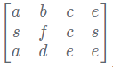
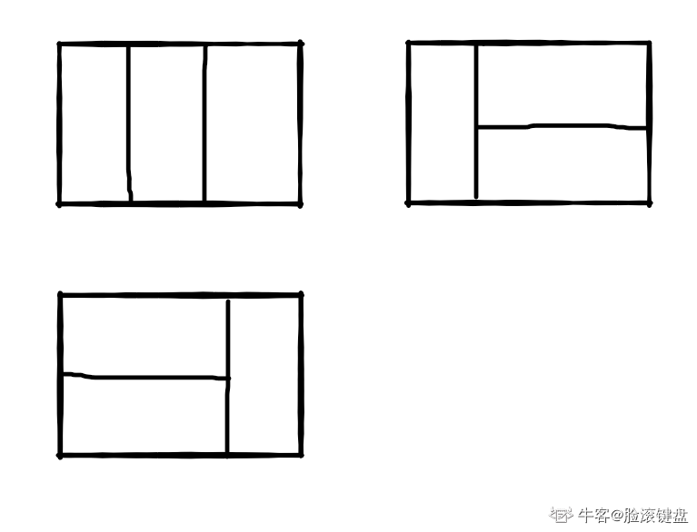
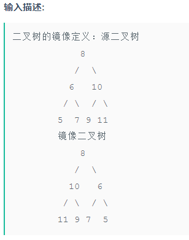
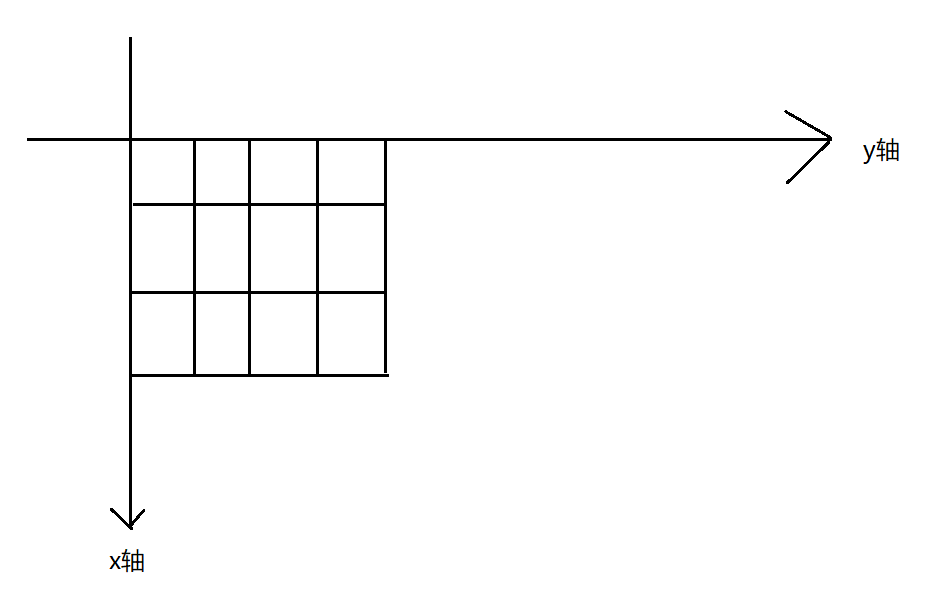
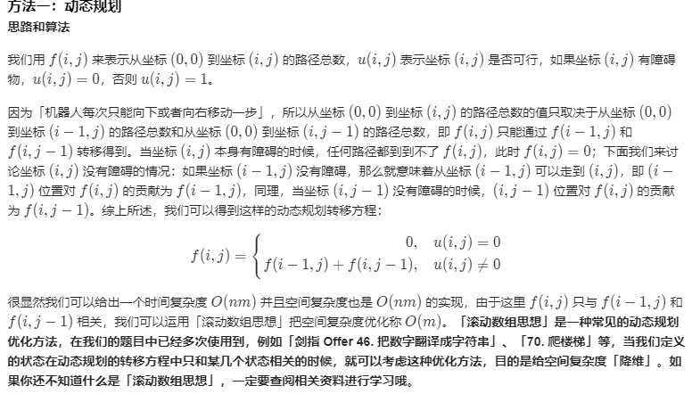

# 剑指offer

[toc]

# 1、剪绳子（6.19）

给你一根长度为n的绳子，请把绳子剪成整数长的m段（m、n都是整数，n>1并且m>1），每段绳子的长度记为k[0],k[1],...,k[m]。请问k[0]xk[1]x...xk[m]可能的最大乘积是多少？例如，当绳子的长度是8时，我们把它剪成长度分别为2、3、3的三段，此时得到的最大乘积是18。

输入描述:

```
输入一个数n，意义见题面。（2 <= n <= 60）
```

输出描述:

```
输出答案。
```

示例1

输入

```
8
```

输出

```
18
```


动态规划：

dp[i] = max(dp[i], dp[j]*dp[i-j])，（0<j<i）

```java
package jzoffer;

import java.util.Scanner;

/*
给你一根长度为n的绳子，请把绳子剪成整数长的m段（m、n都是整数，n>1并且m>1），
每段绳子的长度记为k[0],k[1],...,k[m]。请问k[0]xk[1]x...xk[m]可能的最大乘积是多少？
例如，当绳子的长度是8时，我们把它剪成长度分别为2、3、3的三段，此时得到的最大乘积是18。
 */
public class JZ67 {

    public static void main(String[] args) {
        Scanner input = new Scanner(System.in);
        int n = input.nextInt();
        int res = JZ67.cutRope(n);
        System.out.println(res);

    }

    public static int cutRope(int target) {
        int[] dp = new int[target+1];
        dp[0] = 0;
        dp[1] = 1;

        for(int i=2; i<=target; i++){
            if(i != target){
                dp[i] = i;// 当i!=target时，长度为i的段也可以不分割！
            }

            for(int j=1; j<i; j++){
                dp[i] = Math.max(dp[i], dp[j]*dp[i-j]);
            }
        }

        return dp[target];
    }
}
```


# 2、机器人的运动范围（6.19）

地上有一个m行和n列的方格。一个机器人从坐标0,0的格子开始移动，每一次只能向左，右，上，下四个方向移动一格，但是不能进入行坐标和列坐标的数位之和大于k的格子。 例如，当k为18时，机器人能够进入方格（35,37），因为3+5+3+7 = 18。但是，它不能进入方格（35,38），因为3+5+3+8 = 19。请问该机器人能够达到多少个格子？


递归算法，类似于DFS

```java
public class JZ66 {

    public static void main(String[] args) {
        Scanner input = new Scanner(System.in);
        int threshold = input.nextInt();
        int rows = input.nextInt();
        int cols = input.nextInt();
        System.out.println(movingCount(threshold, rows, cols));
    }

    public static int movingCount(int threshold, int rows, int cols) {
        boolean[][] flag = new boolean[cols][rows];// 默认都是false，没有访问过
        int res = moving(threshold, rows, cols, 0, 0, flag);
        return res;
    }

    // 计算最大移动位置，或者说是移动路线，这个方法会从原点开始，计算所有可能的路线，递归访问所有的方格点
    public static int moving(int threshold, int rows, int cols, int xStartIndex, int yStartIndex, boolean[][] flag){
        int count = 0;
        // 检查当前位置是否可以访问，如果没有访问过，那么可以进行下一步操作
        if(canAccess(threshold, rows, cols, xStartIndex, yStartIndex, flag)){
            flag[xStartIndex][yStartIndex] = true;

            // 递归访问，能够遍历所有的节点
            count = 1 + moving(threshold, rows, cols, xStartIndex, yStartIndex+1, flag)
                      + moving(threshold, rows, cols, xStartIndex, yStartIndex-1, flag)
                      + moving(threshold, rows, cols, xStartIndex-1, yStartIndex, flag)
                      + moving(threshold, rows, cols, xStartIndex+1, yStartIndex, flag);
        }

        return count;
    }

    // 检测当前位置是否可以访问
    public static boolean canAccess(int threshold, int rows, int cols, int xIndex, int yIndex, boolean[][] flag){
        if(xIndex>=0 && xIndex<cols &&
                yIndex>=0 && yIndex<rows &&
                getNumber(xIndex, yIndex)<=threshold &&
                flag[xIndex][yIndex]== false){
            return true;
        }
        else{
            return false;
        }
    }

    // 获取当前坐标数字之和
    public static int getNumber(int xIndex, int yIndex) {
        int tmp = 0;
        while(xIndex != 0){
            tmp += xIndex%10;
            xIndex /= 10;
        }
        while(yIndex != 0){
            tmp += yIndex%10;
            yIndex /= 10;
        }

        return tmp;
    }
}
```


# 3、矩阵中的路径（未解决）

请设计一个函数，用来判断在一个矩阵中是否存在一条包含某字符串所有字符的路径。路径可以从矩阵中的任意一个格子开始，每一步可以在矩阵中向左，向右，向上，向下移动一个格子。如果一条路径经过了矩阵中的某一个格子，则该路径不能再进入该格子。 例如 



矩阵中包含一条字符串"bcced"的路径，但是矩阵中不包含"abcb"路径，因为字符串的第一个字符b占据了矩阵中的第一行第二个格子之后，路径不能再次进入该格子。


```c++

```


```java

```


# 4、滑动窗口的最大值

给定一个数组和滑动窗口的大小，找出所有滑动窗口里数值的最大值。

例如，如果输入数组{2,3,4,2,6,2,5,1}及滑动窗口的大小3，那么一共存在6个滑动窗口，他们的最大值分别为{4,4,6,6,6,5}；

 针对数组{2,3,4,2,6,2,5,1}的滑动窗口有以下6个：

 {[2,3,4],2,6,2,5,1}， 

{2,[3,4,2],6,2,5,1}，

 {2,3,[4,2,6],2,5,1}， 

{2,3,4,[2,6,2],5,1}， 

{2,3,4,2,[6,2,5],1}， 

{2,3,4,2,6,[2,5,1]}。


解答：

```java
package jzoffer;

import com.sun.xml.internal.ws.api.model.wsdl.WSDLOutput;

import java.util.ArrayList;
import java.util.PriorityQueue;

// 给定一个数组和滑动窗口的大小，找出所有滑动窗口里数值的最大值。
// 例如，如果输入数组{2,3,4,2,6,2,5,1}及滑动窗口的大小3，
// 那么一共存在6个滑动窗口，他们的最大值分别为{4,4,6,6,6,5}；
// 针对数组{2,3,4,2,6,2,5,1}的滑动窗口有以下6个：
// {[2,3,4],2,6,2,5,1}， {2,[3,4,2],6,2,5,1}，
// {2,3,[4,2,6],2,5,1}， {2,3,4,[2,6,2],5,1}，
// {2,3,4,2,[6,2,5],1}， {2,3,4,2,6,[2,5,1]}。
public class JZ64 {

    public static void main(String[] args) {
        int[] input = {2,3,4,2,6,2,5,1};
        ArrayList<Integer> res = maxInWindows(input, 3);
        for (Integer item : res) {
            System.out.println(item);
        }
    }

    public static ArrayList<Integer> maxInWindows(int [] num, int size) {
        ArrayList<Integer> res = new ArrayList<>();// 返回结果
        int length = num.length;// 数组长度

        if(length==0 || size<=0 || size>length){
            return res;
        }

        // 构建一个最大堆
        PriorityQueue<Integer> maxHeap = new PriorityQueue<>((o1, o2) -> o2 - o1);
        // 先放第一个窗口
        for(int i=0; i<size; i++){
            maxHeap.add(num[i]);
        }

        res.add(maxHeap.peek());// 取出最大值
        for(int i=1; i+size-1<length; i++){
            maxHeap.remove(num[i-1]);// 删除步骤窗口的元素
            maxHeap.add(num[i+size-1]);// 添加进入窗口的元素
            res.add(maxHeap.peek());
        }

        return res;
    }
}
```


# 5、二维数组中的查找

在一个二维数组中（每个一维数组的长度相同），每一行都按照从左到右递增的顺序排序，每一列都按照从上到下递增的顺序排序。请完成一个函数，输入这样的一个二维数组和一个整数，判断数组中是否含有该整数。

```c++
class Solution {
public:
    bool Find(int target, vector<vector<int> > array) {
        if(array.size() == 0) return false;
        if(array[0].size() == 0) return false;
        if(array[0][0] > target) return false;//第一个元素就比目标大，不用比了，木有
        if(array[0][0] == target) return true;
        int i, row, col;
        row = array.size();
        col = array[0].size() - 1;
        i = 0;
        while(i<row && col>=0){
            if(array[i][col] == target){
                return true;
            }
            else if(array[i][col] < target){
                i++;
            }
            else{
                col--;
            }
        }
        return false;
        
    }
};
```


# 6、替换空格

请实现一个函数，将一个字符串中的每个空格替换成“%20”。例如，当字符串为We Are Happy.则经过替换之后的字符串为We%20Are%20Happy。

```c++
class Solution {
public:
	void replaceSpace(char *str,int length) {
        int count = 0;
        for(int i=0; i<length; i++){
            if(str[i] == ' '){
                count++;
            }
        }
        for(int i=length-1; i>=0; i--){
            if(str[i] != ' '){
                str[i+2*count] = str[i];
            }
            else{
                count--;
                str[i+2*count] = '%';
                str[i+2*count+1] = '2';
                str[i+2*count+2] = '0';
            }
        }
        
	}
};
```


# 7、从尾到头打印链表

输入一个链表，按链表从尾到头的顺序返回一个ArrayList。

```c++
/**
*  struct ListNode {
*        int val;
*        struct ListNode *next;
*        ListNode(int x) :
*              val(x), next(NULL) {
*        }
*  };
*/
class Solution {
public:
    vector<int> printListFromTailToHead(ListNode* head) {
        vector<int> a;
        while(head){
            a.insert(a.begin(), head->val);
            head = head->next;
        }
        return a;
    }
};
```


# 8、用两个栈实现队列

用两个栈来实现一个队列，完成队列的Push和Pop操作。 队列中的元素为int类型。

```c++
class Solution
{
public:
    void push(int node) {
        stack1.push(node);
    }

    int pop() {
        if(stack1.size()==0){
            return -1;
        }
        else{
            while(stack1.size()!=1){
                stack2.push(stack1.top());
                stack1.pop();
            }
            int tmp = stack1.top();
            stack1.pop();
            while(stack2.size()!=0){
                stack1.push(stack2.top());
                stack2.pop();
            }
            
            return tmp;
        }
    }

private:
    stack<int> stack1;
    stack<int> stack2;
};
```


# 9、旋转数组的最小数字

把一个数组最开始的若干个元素搬到数组的末尾，我们称之为数组的旋转。
输入一个非递减排序的数组的一个旋转，输出旋转数组的最小元素。
例如数组{3,4,5,1,2}为{1,2,3,4,5}的一个旋转，该数组的最小值为1。
NOTE：给出的所有元素都大于0，若数组大小为0，请返回0。

```c++
class Solution {
public:
    int minNumberInRotateArray(vector<int> rotateArray) {
        if(rotateArray.size() == 0){
             return 0;
        } 
        else if(rotateArray.size() == 1){
            return rotateArray[0];
        }
        else if(rotateArray.size() == 2){
            return (rotateArray[0]>rotateArray[1])?rotateArray[1]:rotateArray[0];// 注意要的是最小值
        }
        else{
            int pos=0;
            while((pos<rotateArray.size()-1) && rotateArray[pos]<=rotateArray[pos+1]){
                pos++;
            }
            if(pos == rotateArray.size()-2){
                return rotateArray[0];
            }
            else{
                return rotateArray[pos+1];
            }
            
        }
    }
};
```


# 10、菲波那切数列

大家都知道斐波那契数列，现在要求输入一个整数n，请你输出斐波那契数列的第n项（从0开始，第0项为0，第1项是1）。

n<=39

```c++
class Solution {
public:
    int Fibonacci(int n) {
        if(n==0)  return 0;
        if(n==1)  return 1;
        
        int res=0, n1=1, n2=0;
        for(int i=2; i<=n; i++){
            res = n1 + n2;
            n2 = n1;
            n1 = res;
            
        }
        
        return res;
    }
};
```


# 11、跳台阶

一只青蛙一次可以跳上1级台阶，也可以跳上2级。求该青蛙跳上一个n级的台阶总共有多少种跳法（先后次序不同算不同的结果）。

```c++
class Solution {
public:
    int jumpFloor(int number) {
        if(number == 1)  return 1;
        if(number == 2)  return 2;
        
        int res=0, n1=2, n2=1;
        for(int i=3; i<=number; i++){
            res = n1 + n2;
            n2 = n1;
            n1 = res;
            
        }
        
        return res;
    }
};
```


# 12、变态跳台阶

一只青蛙一次可以跳上1级台阶，也可以跳上2级……它也可以跳上n级。求该青蛙跳上一个n级的台阶总共有多少种跳法。

```c++
public class Solution {
    public int JumpFloorII(int target) {
        if(target == 0)  return 0;
        if(target == 1)  return 1;
        return 2*JumpFloorII(target-1);
    }
}
```


# 13、矩形覆盖

我们可以用2*1的小矩形横着或者竖着去覆盖更大的矩形。请问用n个2*1的小矩形无重叠地覆盖一个2*n的大矩形，总共有多少种方法？

比如n=3时，2*3的矩形块有3种覆盖方法：



```c++
class Solution {
public:
    int rectCover(int number) {
        if(number == 0)  return 0;
        if(number == 1)  return 1;
        if(number == 2)  return 2;
        
        return rectCover(number-1)+rectCover(number-2);
    }
};
```


# 14、二进制中1的个数

输入一个整数，输出该数二进制表示中1的个数。其中负数用补码表示。

```c++
class Solution {
public:
     int  NumberOf1(int n) {
         int count = 0;
         unsigned int flag = 1;
         while(flag != 0){
             if(n&flag){
                 count++;
             }
             flag <<= 1;
         }
         
         return count;
     }
};
```


# 15、数值的整数次方

给定一个double类型的浮点数base和int类型的整数exponent。求base的exponent次方。

保证base和exponent不同时为0

```c++
class Solution {
public:
    double Power(double base, int exponent) {
        if(exponent == 0)  return 1;
        // 要考虑exponent为负的情况
        if(exponent < 0){
            base = 1.0/base;
            exponent = -exponent;
        }
        
        double res = 1.0;
        for(int i=1; i<=exponent; i++){
            res = res * base;
        }
        return res;
    }
};
```


# 16、调整数组顺序使奇数位于偶数前面（6.20）

输入一个整数数组，实现一个函数来调整该数组中数字的顺序，使得所有的奇数位于数组的前半部分，所有的偶数位于数组的后半部分，并保证奇数和奇数，偶数和偶数之间的相对位置不变。

我的解法：

```java
package jzoffer;

import java.util.ArrayList;
import java.util.List;
import java.util.Scanner;

public class JZ13 {

    public static void main(String[] args) {
        Scanner input = new Scanner(System.in);

        int[] array = {1,2,3,4,5,6,7};

        Solution.reOrderArray(array);

        for (int item : array) {
            System.out.print(item + " ");
        }

    }


    static class Solution{

        public static void reOrderArray(int [] array) {
            // 临时数组
            List<Integer> odd = new ArrayList<>();
            List<Integer> even = new ArrayList<>();

            // 判断奇数偶数并放到
            for (int item : array) {
                if(item % 2 == 0){
                    even.add(item);
                }
                else{
                    odd.add(item);
                }
            }

            int i = 0;
            for( ; i<odd.size(); i++){
                array[i] = odd.get(i);
            }

            for(int j=0 ; j<even.size(); j++){
                array[i] = even.get(j);
                i++;
            }
        }
    }
}
```


```c++
class Solution {
public:
    void reOrderArray(vector<int> &array) {
        vector<int> even, odd;
        for(int i=0; i<array.size(); i++){
            if(array[i] % 2 == 0){
                even.push_back(array[i]);
            }
            else{
                odd.push_back(array[i]);
            }
        }
        
        int index = 0;
        for(int i=0; i<odd.size(); i++){
            array[index] = odd[i];
            index++;
        }
        for(int i=0; i<even.size(); i++){
            array[index] = even[i];
            index++;
        }
    }
};
```


# 17、链表中倒数第K个节点

输入一个链表，输出该链表中倒数第k个结点。

```java
/*
public class ListNode {
    int val;
    ListNode next = null;

    ListNode(int val) {
        this.val = val;
    }
}*/
public class Solution {
    public ListNode FindKthToTail(ListNode head,int k) {
        // 双指针
        ListNode res = head;
        ListNode tmp = head;
        for(int i=1; i<=k; i++){
            if(tmp == null){
                return null;
            }
            else{
                tmp = tmp.next;
            }
        }
        while(tmp != null){
            tmp = tmp.next;
            res = res.next;
        }
        return res;
    }
}
```


```c++
/*
struct ListNode {
	int val;
	struct ListNode *next;
	ListNode(int x) :
			val(x), next(NULL) {
	}
};*/
class Solution {
public:
    ListNode* FindKthToTail(ListNode* pListHead, unsigned int k) {
        // 双指针
        ListNode* res = pListHead;
        ListNode* tmp = pListHead;
        for(int i=1; i<=k; i++){
            // 要考虑k比链表长度大的情况
            if(!tmp){
                return nullptr;
            }
            else{
                 tmp = tmp->next;
            }
           
        }
        while(tmp){
            tmp = tmp->next;
            res = res->next;
        }
        return res;
    }
};
```


# 18、反转链表

输入一个链表，反转链表后，输出新链表的表头。

```c++
/*
struct ListNode {
	int val;
	struct ListNode *next;
	ListNode(int x) :
			val(x), next(NULL) {
	}
};*/
class Solution {
public:
    ListNode* ReverseList(ListNode* pHead) {
        if(pHead == NULL){
            return NULL;
        }
        
        ListNode* head = NULL;
        ListNode* cur = NULL;
        while(pHead){
            cur = pHead;
            pHead = pHead->next;// 放到这里是对的
            cur->next = head;
            head = cur;
            // pHead = pHead->next; 这句话放到这里就phead已经不是原来的链表了
        }
        return head;
    }
};
```


```java
/*
public class ListNode {
    int val;
    ListNode next = null;

    ListNode(int val) {
        this.val = val;
    }
}*/
public class Solution {
    public ListNode ReverseList(ListNode head) {
        if(head == null){
            return null;
        }
        
        ListNode res = null;
        ListNode cur = null;
        while(head != null){
            cur = head;
            head = head.next;
            cur.next = res;
            res = cur;
        }
        return res;
    }
}
```


# 19、合并两个排序的链表

输入两个单调递增的链表，输出两个链表合成后的链表，当然我们需要合成后的链表满足单调不减规则。

```java
/*
public class ListNode {
    int val;
    ListNode next = null;

    ListNode(int val) {
        this.val = val;
    }
}*/
public class Solution {
    public ListNode Merge(ListNode list1,ListNode list2) {
        if(list1 == null){
            return list2;
        }
        if(list2 == null){
            return list1;
        }
        
        if(list1.val <= list2.val){
            list1.next = Merge(list1.next, list2);
            return list1;
        }
        else{
            list2.next = Merge(list2.next, list1);
            return list2;
        }
    }
}
```


```c++
/*
struct ListNode {
	int val;
	struct ListNode *next;
	ListNode(int x) :
			val(x), next(NULL) {
	}
};*/
class Solution {
public:
    ListNode* Merge(ListNode* pHead1, ListNode* pHead2)
    {
        if(pHead1 == NULL)  return pHead2;
        if(pHead2 == NULL)  return pHead1;
        
        ListNode* head = NULL;
        ListNode* cur = NULL;
        while(pHead1 && pHead2){
            if(pHead1->val <= pHead2->val){
                // 首先考虑初始情况,head和cur都是NULL，这时候直接等于第一个节点即可
                if(head == NULL){
                    head = pHead1;
                    cur = pHead1;
                    pHead1 = pHead1->next;
                }
                else{
                    cur->next = pHead1;
                    pHead1 = pHead1->next;
                    cur = cur->next;
                }
            }
            else{
                if(head == NULL){
                    head = pHead2;
                    cur = pHead2;
                    pHead2 = pHead2->next;
                }
                else{
                    cur->next = pHead2;
                    pHead2 = pHead2->next;
                    cur = cur->next;
                }
            }
        }
        
        if(pHead1){
            cur->next = pHead1;
        }
        else{
            cur->next = pHead2;
        }
        
        return head;
    }
};
```


# 20、树的子结构（6.20）

输入两棵二叉树A，B，判断B是不是A的子结构。（ps：我们约定空树不是任意一个树的子结构）


```java
package jzoffer;

/**
 * 输入两棵二叉树A，B，判断B是不是A的子结构。
 * （ps：我们约定空树不是任意一个树的子结构）
 */

class TreeNode {
    int val = 0;
    TreeNode left = null;
    TreeNode right = null;

    public TreeNode(int val) {
        this.val = val;
    }
}

public class JZ17 {

    public boolean HasSubtree(TreeNode root1,TreeNode root2) {
        if(root2 == null || root1 == null){
            return false;
        }

        boolean res = false;
        // 如果根的值相同，那就以根为起点，比较左右子树
        if(root1.val == root2.val){
            res = IsTree1HasTree2(root1, root2);
        }
        // 如果从根开始匹配发现不对，去左子树试试
        if(res == false){
            // 递归
            res = HasSubtree(root1.left, root2);
        }
        // 如果左子树不行，再去右子树试试
        if(res == false){
            // 递归
            res = HasSubtree(root1.right, root2);
        }

        return res;
    }

    private boolean IsTree1HasTree2(TreeNode root1, TreeNode root2) {
        // 如果B树为空，说明是A的子树
        if(root2 == null)  return true;
        // 如果A树为空，说明不对
        if(root1 == null)  return false;
        // 节点值不同，不对
        if(root1.val != root2.val){
            return false;
        }
        // 如果相同，则比较左右子树是否满足条件
        return IsTree1HasTree2(root1.left, root2.left) && IsTree1HasTree2(root1.right, root2.right);
    }
}
```


# 21、数字在排序数组中出现的次数

统计一个数字在排序数组中出现的次数。

```c++
class Solution {
public:
    int GetNumberOfK(vector<int> data ,int k) {
        int count = 0;
        for(int i:data){
            if(i == k){
                count++;
            }
        }
        return count;
    }
};
```


```java
public class Solution {
    public int GetNumberOfK(int [] array , int k) {
       int count = 0;
        for(int i:array){
            if(i == k){
                count++;
            }
        }
        return count;
    }
}
```


# 22、二叉树的镜像（6.20）

操作给定的二叉树，将其变换为源二叉树的镜像。



```java
/**
public class TreeNode {
    int val = 0;
    TreeNode left = null;
    TreeNode right = null;

    public TreeNode(int val) {
        this.val = val;
    }
}
*/
public class Solution {
    public void Mirror(TreeNode root) {
        if(root == null)  return;// 注意空树的情况

        TreeNode tmp = null;
        // 如果是个叶节点，那就直接返回
        if(root.left == null && root.right == null){
            return;
        }
        // 如果左为空，右不为空，先把右边给左边，然后递归
        else if(root.left == null && root.right != null){
            root.left = root.right;
            root.right = null;
            Mirror(root.left);
        }
        else if(root.left != null && root.right == null){
            root.right = root.left;
            root.left = null;
            Mirror(root.right);
        }
        else{
            tmp = root.left;
            root.left = root.right;
            root.right = tmp;
            Mirror(root.left);
            Mirror(root.right);
        }
    }
}
```


# 23、顺时针打印矩阵（6.20）

输入一个矩阵，按照从外向里以顺时针的顺序依次打印出每一个数字，例如，如果输入如下4 X 4矩阵： 1 2 3 4 5 6 7 8 9 10 11 12 13 14 15 16 则依次打印出数字1,2,3,4,8,12,16,15,14,13,9,5,6,7,11,10.





```java
import java.util.ArrayList;
public class Solution {
    public ArrayList<Integer> printMatrix(int [][] matrix) {
       // 顺着走，即向右->向下->向左->向上，一共要走（长*宽）步。
       // 遇到边界就改变方向，当向上碰到顶的时候，四个边界都缩小。
        int left = 0;
        int right = matrix[0].length - 1;
        int top = 0;
        int bottom = matrix.length - 1;
        int x = 0, y = 0;
        ArrayList<Integer> res = new ArrayList<Integer>();
        for(int i=1; i<=matrix[0].length*matrix.length; i++){
            res.add(matrix[x][y]);
            // 往右走
            if(x == top){
                if(y < right){
                    y++;
                }
                // 在边界上走
                else{
                    x++;
                }
                continue;// 精髓就在else上，走完一格，然后就跳出，不执行下面的语句了
            }
            // 往下走
            if(y == right){
                if(x < bottom){
                    x++;
                }
                else{
                    y--;
                }
                continue;
            }
            // 往左走
            if(x == bottom){
                if(y > left){
                    y--;
                }
                else{
                    x--;
                }
                continue;
            }
            // 往上走，遇到上边界，四个边界都需要缩小
            if(y == left){
                if(x > top + 1){
                    x--;
                }
                else{
                    top++;
                    bottom--;
                    left++;
                    right--;
                    y++;
                }
                continue;
            }
        }
        
        return res;
    }
}
```


# 24、包含min函数的栈（6.20）

定义栈的数据结构，请在该类型中实现一个能够得到栈中所含最小元素的min函数（时间复杂度应为O（1））。

注意：保证测试中不会当栈为空的时候，对栈调用pop()或者min()或者top()方法。


clone方法，如果只是调Object父类的clone方法，自己没有重写，那么是浅拷贝，因为对于一个对象类型的数据域，那么只是复制的引用。要想实现深拷贝，必须要加上自定义的克隆操作来覆盖clone方法


```java
package jzoffer;

import java.util.Stack;

// ["PSH3","MIN",
// "PSH4","MIN",
// "PSH2","MIN",
// "PSH3","MIN",
// "POP","MIN",
// "POP","MIN",
// "POP","MIN",
// "PSH0","MIN"]
public class JZ20 {

    public static void main(String[] args) {
        JZ20 jz20 = new JZ20();

        jz20.push(3);System.out.println(jz20.min());
        jz20.push(4);System.out.println(jz20.min());
        jz20.push(2);System.out.println(jz20.min());
        jz20.push(3);System.out.println(jz20.min());
        jz20.pop();System.out.println(jz20.min());
        jz20.pop();System.out.println(jz20.min());
        jz20.pop();System.out.println(jz20.min());
        jz20.push(0);System.out.println(jz20.min());
    }

    private Stack<Integer> stack = new Stack<Integer>();
    private int minValue = Integer.MAX_VALUE;

    public void push(int node) {
        stack.push(node);
        if(node < minValue){
            minValue = node;
        }
    }

    public void pop() {
        int tmp = stack.peek();
        stack.pop();
        if(tmp == minValue){
            // 如果最小值被pop了出去，则需要重新找最小值，用个临时栈来找
            // Stack<Integer> tmpStack = stack; 这样写传的是引用
            
            // 我们应该新建一个栈，然后把原有栈的元素加进去,或者使用clone方法

            // 方法一：新建一个栈，然后把原有栈的元素加进去
//            Stack<Integer> tmpStack = new Stack<Integer>();
//            tmpStack.addAll(stack);

            // 方法二：clone方法
            Stack<Integer> tmpStack = (Stack<Integer>) stack.clone();
            minValue = tmpStack.peek();
            while(tmpStack.size() > 0){
                if(minValue > tmpStack.peek()){
                    minValue = tmpStack.peek();
                }
                tmpStack.pop();
            }
        }

    }

    public int top() {
        return stack.peek();
    }

    public int min() {
        return minValue;
    }
}
```


```c++
class Solution {
    stack<int> s;
    int minValue = INT_MAX;
public:
    void push(int value) {
        s.push(value);
        if(value < minValue){
            minValue = value;
        }
    }
    void pop() {
        int tmp = s.top();
        s.pop();
        
        if(tmp == minValue){
            // 在C++中，stack重载了运算符=
            stack<int> tmpStack = s;
            minValue = tmpStack.top();
            while(tmpStack.size() > 0){
                if(tmpStack.top() < minValue){
                    minValue = tmpStack.top();
                }
                tmpStack.pop();
            }
        }
    }
    int top() {
        return s.top();
    }
    int min() {
        return minValue;
    }
};
```


# 25、从上到下打印二叉树（6.21）

从上往下打印出二叉树的每个节点，同层节点从左至右打印。

解题思路：典型的宽度遍历

```c++
/*
struct TreeNode {
	int val;
	struct TreeNode *left;
	struct TreeNode *right;
	TreeNode(int x) :
			val(x), left(NULL), right(NULL) {
	}
};*/
class Solution {
public:
    vector<int> PrintFromTopToBottom(TreeNode* root) {
        // 广度优先，依赖于队列
        vector<int> res;
        queue<TreeNode*> q;
        if(root == NULL)  return res;// 必须判断初始节点是否为空
        // 初始节点入队
        q.push(root);
        // 当队列不为空
        while(q.size() > 0){
            int sz = q.size();// 获取当前这一层的节点个数
            // 当前这一层挨个出队
            for(int i=0; i<sz; i++){
                TreeNode* cur = q.front();
                res.push_back(cur->val);
                // 如果当前节点有左右儿子
                if(cur->left)  q.push(cur->left);
                if(cur->right)  q.push(cur->right);
                q.pop();
            }
        }
        
        return res;
    }
};
```


在java中，使用LinkedList充当单向队列的时候，入队是add或者`offer`，出队pop，`poll`，remove

```java
import java.util.*;
/**
public class TreeNode {
    int val = 0;
    TreeNode left = null;
    TreeNode right = null;

    public TreeNode(int val) {
        this.val = val;

    }

}
*/
public class Solution {
    public ArrayList<Integer> PrintFromTopToBottom(TreeNode root) {
        ArrayList<Integer> res = new ArrayList<Integer>();
        if(root == null)  return res;
        LinkedList<TreeNode> queue = new  LinkedList<TreeNode>();
        queue.add(root);
        while(queue.size() > 0){
            int sz = queue.size();
            for(int i=0; i<sz; i++){
                TreeNode cur = queue.poll();
                res.add(cur.val);
                if(cur.left != null)  queue.add(cur.left);
                if(cur.right != null)  queue.add(cur.right);
            }
        }
        return res;
    }
}
```


# 26、坐旋转字符串（6.22）

汇编语言中有一种移位指令叫做循环左移（ROL），现在有个简单的任务，就是用字符串模拟这个指令的运算结果。对于一个给定的字符序列S，请你把其循环左移K位后的序列输出。例如，字符序列S=”abcXYZdef”,要求输出循环左移3位后的结果，即“XYZdefabc”。是不是很简单？OK，搞定它！


```java
public class Solution {
    public String LeftRotateString(String str,int n) {
        String res = "";
        String tmp1 = "";
        for(int i=0; i<str.length(); i++){
            if(i < n){
                tmp1 += str.charAt(i);//保存前n个字符
            }
            else{
                res += str.charAt(i);//保存后面的字符
            }
        }
        
        return res+tmp1;
    }
}
```


# 27、反转单词顺序列（6.22）

牛客最近来了一个新员工Fish，每天早晨总是会拿着一本英文杂志，写些句子在本子上。同事Cat对Fish写的内容颇感兴趣，有一天他向Fish借来翻看，但却读不懂它的意思。例如，“student. a am I”。后来才意识到，这家伙原来把句子单词的顺序翻转了，正确的句子应该是“I am a student.”。Cat对一一的翻转这些单词顺序可不在行，你能帮助他么？


```java
import java.util.*;

public class Solution {
    public String ReverseSentence(String str) {
        String tmp = "";
        String result = "";
        Stack<String> res = new Stack<>();
        for(int i=0; i<str.length(); i++){
            if(str.charAt(i) != ' '){
                tmp += str.charAt(i);
            }
            else{
                res.push(tmp);
                res.push(" ");
                tmp = "";
            }
        }
        res.push(tmp);
        while(res.size() > 0){
            result += res.pop();
        }
        
        return result;
    }
}
```


# 28、之字形打印二叉树（6.22）

请实现一个函数按照之字形打印二叉树，即第一行按照从左到右的顺序打印，第二层按照从右至左的顺序打印，第三行按照从左到右的顺序打印，其他行以此类推。

解题思路：

- 思路很简单，还是层次遍历树，但是放置元素的时候使用双向链表，如果是奇数层，正常放置，偶数层就倒着放
- 个人觉得C++写的更好，Java太烦人了

```java
import java.util.*;

/*
public class TreeNode {
    int val = 0;
    TreeNode left = null;
    TreeNode right = null;

    public TreeNode(int val) {
        this.val = val;

    }

}
*/
public class Solution {
    public ArrayList<ArrayList<Integer> > Print(TreeNode pRoot) {
        
        // 思路很简单，还是层次遍历树，但是放置元素的时候使用双向链表，如果是奇数层，正常放置，偶数层就倒着放
        ArrayList<ArrayList<Integer> > res = new ArrayList<ArrayList<Integer> >();
        if(pRoot == null)  return res;
        
        boolean flag = true;//奇数层从左到右
        LinkedList<TreeNode> queue = new LinkedList<>();
        // 根节点先入队
        queue.offer(pRoot);
        while(queue.size() > 0){
            int sz = queue.size();
            LinkedList<Integer> level = new LinkedList<>();// 当双向链表用
            // 遍历当前层
            for(int i=0; i<sz; i++){
                // 出队
                TreeNode tmp = queue.poll();
                // 如果是奇数层，正常放置
                if(flag)  level.add(tmp.val);
                // 如果是偶数层，放到头部
                else  level.addFirst(tmp.val);
                
                // 正常层次遍历即可
                if(tmp.left != null)  queue.offer(tmp.left);
                if(tmp.right != null)  queue.offer(tmp.right);
            }
            // 当前层加入结果集
            res.add(new ArrayList(level));
            // 反转
            flag = !flag;
        }
        
        return res;
    }

}
```


```c++
/**
 * Definition for a binary tree node.
 * struct TreeNode {
 *     int val;
 *     TreeNode *left;
 *     TreeNode *right;
 *     TreeNode(int x) : val(x), left(NULL), right(NULL) {}
 * };
 */
class Solution {
public:
    vector<vector<int>> levelOrder(TreeNode* root) {
        if(root == NULL){
            return {};
        }
        else{
            vector<vector<int> > res;//返回结果
            queue<TreeNode*> path;//遍历路径
            path.push(root);//先把根丢进去
            int flag = 1;
            while(path.size() > 0){
                vector<int> level;//每一层的数据
                int levelLength = path.size();
                for(int i=0; i<levelLength; i++){
                    TreeNode* cur = path.front();//获取队列头
                    //如果是奇数层，正常放进数组里面，不然的话反向放置即可
                    if(flag ==1){
                        level.push_back(cur->val);
                    }
                    else{
                        level.insert(level.begin(), cur->val);
                    }
                    
                    path.pop();//出队
                    if(cur->left){
                            path.push(cur->left);
                        }
                    if(cur->right){
                        path.push(cur->right);
                    }
                }

                res.push_back(level);
                flag = -flag;
            }

            return res;
        }
    }
};
```


# 29、数据流中的中位数（6.24）

如何得到一个数据流中的中位数？如果从数据流中读出奇数个数值，那么中位数就是所有数值排序之后位于中间的数值。如果从数据流中读出偶数个数值，那么中位数就是所有数值排序之后中间两个数的平均值。我们使用Insert()方法读取数据流，使用GetMedian()方法获取当前读取数据的中位数。


解题思路：https://www.nowcoder.com/questionTerminal/9be0172896bd43948f8a32fb954e1be1

- 先用java集合PriorityQueue来设置一个小顶堆和大顶堆  
-    主要的思想是：因为要求的是中位数，那么这两个堆，**大顶堆用来存较小的数，从大到小排列**；  
- **小顶堆存较大的数，从小到大的顺序排序**，显然中位数就是大顶堆的根节点与小顶堆的根节点和的平均数。
- 保证：小顶堆中的元素都大于等于大顶堆中的元素，所以每次塞值，并不是直接塞进去，而是从另一个堆中poll出一个最大（最小）的塞值  
- 当数目为偶数的时候，将这个值插入大顶堆中，再将大顶堆中根节点（即最大值）插入到小顶堆中；  
- 当数目为奇数的时候，将这个值插入小顶堆中，再讲小顶堆中根节点（即最小值）插入到大顶堆中；  
- 取中位数的时候，如果当前个数为偶数，显然是取小顶堆和大顶堆根结点的平均值；如果当前个数为奇数，显然是取小顶堆的根节点  

  理解了上面所述的主体思想，下面举个例子辅助验证一下。 

  例如，传入的数据为：[5,2,3,4,1,6,7,0,8],那么按照要求，输出是"5.00 3.50 3.00 3.50 3.00 3.50 4.00 3.50 4.00 " 

  那么整个程序的执行流程应该是（用min表示小顶堆，max表示大顶堆）： 

-    5先进入大顶堆，然后将大顶堆中最大值放入小顶堆中，此时min=[5],max=[无]，avg=[5.00]  
-    2先进入小顶堆，然后将小顶堆中最小值放入大顶堆中，此时min=[5],max=[2],avg=[(5+2)/2]=[3.50]  
-    3先进入大顶堆，然后将大顶堆中最大值放入小顶堆中，此时min=[3,5],max=[2],avg=[3.00]  
-    4先进入小顶堆，然后将小顶堆中最小值放入大顶堆中，此时min=[4,5],max=[3,2],avg=[(4+3)/2]=[3.50]  
-    1先进入大顶堆，然后将大顶堆中最大值放入小顶堆中，此时min=[3,4,5],max=[2,1]，avg=[3/00]  
-    6先进入小顶堆，然后将小顶堆中最小值放入大顶堆中，此时min=[4,5,6],max=[3,2,1],avg=[(4+3)/2]=[3.50]  
-    7先进入大顶堆，然后将大顶堆中最大值放入小顶堆中，此时min=[4,5,6,7],max=[3,2,1],avg=[4]=[4.00]  
-    0先进入小顶堆，然后将小顶堆中最大值放入小顶堆中，此时min=[4,5,6,7],max=[3,2,1,0],avg=[(4+3)/2]=[3.50]  
-    8先进入大顶堆，然后将大顶堆中最小值放入大顶堆中，此时min=[4,5,6,7,8],max=[3,2,1,0],avg=[4.00]

```java
import java.util.*;

public class Solution {
    // 大顶堆，放前面一半的元素
    PriorityQueue<Integer> maxHeap = new PriorityQueue<>((o1, o2) -> o2 - o1);
    
    // 小顶堆，放后面一半的元素，偶数个元素那么两个堆大小相同，奇数个元素，小顶堆多一个元素出来
    PriorityQueue<Integer> minHeap = new PriorityQueue<>();
    
    int count = 0;//计数器，计算从数据流中读取了几个元素

    public void Insert(Integer num) {
        // 如果是已经放置了偶数个元素，先放大顶堆，然后poll一个元素出来，放小定堆
        if(count % 2 == 0){
            maxHeap.offer(num);
            //int tmp = maxHeap.poll();
            minHeap.offer(maxHeap.poll());
        }
        else{
            minHeap.offer(num);
            maxHeap.offer(minHeap.poll());
        }
        count++;
    }

    public Double GetMedian() {
        if(count % 2 == 0){
            return new Double(0.5 * (maxHeap.peek()+minHeap.peek()));
        }
       else{
           return new Double(minHeap.peek());
       }
    }


}
```


# 30、二叉搜索树的第K个节点（6.24）

给定一棵二叉搜索树，请找出其中的第k小的结点。例如， （5，3，7，2，4，6，8）  中，按结点数值大小顺序第三小结点的值为4。

解题思路：

中序遍历二叉树，把节点放进数组中，然后直接取即可

注意几种不成立的特殊情况

```java
/*
public class TreeNode {
    int val = 0;
    TreeNode left = null;
    TreeNode right = null;

    public TreeNode(int val) {
        this.val = val;

    }

}
*/
import java.util.*;
public class Solution {
    private ArrayList<TreeNode> res = new ArrayList<>();
    
    TreeNode KthNode(TreeNode pRoot, int k)
    {
        if(k == 0)  return null;
        
        getMinHeap(pRoot);
        if(k > res.size())  return null;
        else return res.get(k-1);
    }
    
    // 中序遍历二叉树
    public void getMinHeap(TreeNode root){
        if(root == null) return;
        if(root.left != null) getMinHeap(root.left);
        res.add(root);
        if(root.right != null) getMinHeap(root.right);
    }
}
```


# 31、二叉树的层次遍历（6.24）

从上到下按层打印二叉树，同一层结点从左至右输出。每一层输出一行。

```java
import java.util.*;


/*
public class TreeNode {
    int val = 0;
    TreeNode left = null;
    TreeNode right = null;

    public TreeNode(int val) {
        this.val = val;

    }

}
*/
public class Solution {
    ArrayList<ArrayList<Integer> > Print(TreeNode pRoot) {
        //层次遍历，宽度搜索
        ArrayList<ArrayList<Integer> > res = new ArrayList<ArrayList<Integer> >();
        if(pRoot == null)  return res;
        
        // 节点先入队
        Queue<TreeNode> queue = new LinkedList<>();
        queue.offer(pRoot);
        while(queue.size() > 0){
            int sz = queue.size();//当前层节点数
            ArrayList<Integer> level = new ArrayList<Integer>();//当前层节点的值
            for(int i=0; i<sz; i++){
                // 出队
                TreeNode cur = queue.poll();
                level.add(cur.val);
                if(cur.left != null)  queue.offer(cur.left);
                if(cur.right != null)  queue.offer(cur.right);
            }
            // 当前层已经遍历完毕
            res.add(level);
        }
        return res;
    }
    
}
```


# 32、二叉树的下一个节点（6.26）

给定一个二叉树和其中的一个结点，请找出中序遍历顺序的下一个结点并且返回。注意，树中的结点不仅包含左右子结点，同时包含指向父结点的指针。

```java
/*
public class TreeLinkNode {
    int val;
    TreeLinkNode left = null;
    TreeLinkNode right = null;
    TreeLinkNode next = null;

    TreeLinkNode(int val) {
        this.val = val;
    }
}
*/
public class Solution {
    public TreeLinkNode GetNext(TreeLinkNode pNode){
        // 特殊情况
        if(pNode == null)  return null;
        
        // 如果有右儿子，则下一个节点是右子树的最左边那个
        if(pNode.right != null){
            TreeLinkNode tmp = pNode.right;
            while(tmp.left != null)  tmp = tmp.left;
            return tmp;
        }
        // 如果没有右儿子
        else{
            // 如果父节点不为空，也就是自己不是根节点
            if(pNode.next != null){
                // 1、是父节点的左儿子，那父节点就是结果
                if(pNode.next.left == pNode){
                    return pNode.next;
                }
                // 2、是父节点的右儿子，那就往上找，找拐点（因为这一路上不是拐点的全被遍历过）
                else{
                    while(pNode.next != null){
                        if(pNode.next.left == pNode){
                            return pNode = pNode.next;
                        }
                        pNode = pNode.next;
                    }
                    // 循环结束都没找到，说明没有
                    return null;
                } 
            }
            // 如果自己是根节点
            else{
                return null;
            }
        }
    }   
}
```


# LeetCode

# 1、最接近的三数之和（6.24）

[题目链接](https://leetcode-cn.com/problems/3sum-closest/)

给定一个包括 n 个整数的数组 nums 和 一个目标值 target。找出 nums 中的三个整数，使得它们的和与 target 最接近。返回这三个数的和。假定每组输入只存在唯一答案。

示例：

```tex
输入：nums = [-1,2,1,-4], target = 1
输出：2
解释：与 target 最接近的和是 2 (-1 + 2 + 1 = 2) 。
```


提示：

3 <= nums.length <= 10^3
-10^3 <= nums[i] <= 10^3
-10^4 <= target <= 10^4


推荐解法：

```java
import java.util.*;

class Solution {
    public int threeSumClosest(int[] nums, int target) {
        Arrays.sort(nums);
        int res = Integer.MAX_VALUE/2;//防止溢出
        int sum;
        for(int i=0; i<nums.length-2; i++){
            int j=i+1, k=nums.length-1;
            while(j < k){
                sum = nums[i]+nums[j]+nums[k];
                // 如果相等，直接返回目标值即可
                if(sum == target){
                    return target;
                }
                else{
                    // 如果不相等，比较一下和现有的，哪个更接近，也就是和目标值距离越小，距离小，则替换
                    if(Math.abs(sum-target) <= Math.abs(res -target)) {
                        res = sum;
                    }
                    // 如果和小于目标值，左指针移动，大于目标值，右指针移动
                    if(sum < target){
                        j++;
                    }
                    if(sum > target){
                        k--;
                    }
                }
            }
        }
        return res;
    }
}
```


暴力解法（不推荐）

```java
import java.util.*;

class Solution {
    public int threeSumClosest(int[] nums, int target) {
        //Arrays.sort(nums);
        int res = Integer.MAX_VALUE/2;//防止溢出
        for(int i=0; i<nums.length-2; i++){
            for(int j=i+1; j<nums.length-1; j++){
                for(int k=j+1; k<nums.length; k++){
                    // 距离小，则替换
                    if(Math.abs(nums[i]+nums[j]+nums[k]-target) <= Math.abs(res -target)) {
                        res = nums[i] + nums[j] + nums[k];
                    }
                }
            }
        }
        return res;
    }
}
```


# 2、移除重复节点（6.26）

编写代码，移除未排序链表中的重复节点。保留最开始出现的节点。

示例1:

 输入：[1, 2, 3, 3, 2, 1]
 输出：[1, 2, 3]

示例2:

 输入：[1, 1, 1, 1, 2]
 输出：[1, 2]
提示：

链表长度在[0, 20000]范围内。
链表元素在[0, 20000]范围内。

```java
public ListNode removeDuplicateNodes(ListNode head) {
    if(head == null)  return null;
    HashSet<Integer> mySet = new HashSet<Integer>();
    mySet.add(head.val);

    ListNode pos = head;//指针指向头结点
    // 这里我们把pos.next作为当前节点，这样前一个节点就是pos，后一个就是pos.next.next
    while(pos.next != null){
        ListNode cur = pos.next;//这里传递的是引用
        // 如果当前节点的值已经在集合里面，那就跳过，不在就加入
        if(!mySet.contains(cur.val)){
            // 集合里面没这个元素，加入集合
            mySet.add(cur.val);
            pos = pos.next;//指针往后移
        }
        else{
            pos.next = pos.next.next;//跳过当前元素
        }
    }

    return head;
}
```


# 3、盛水最多的容器（6.26）

[题目链接](https://leetcode-cn.com/problems/container-with-most-water/)

给你 n 个非负整数 a1，a2，...，an，每个数代表坐标中的一个点 (i, ai) 。在坐标内画 n 条垂直线，垂直线 i 的两个端点分别为 (i, ai) 和 (i, 0)。找出其中的两条线，使得它们与 x 轴共同构成的容器可以容纳最多的水。

说明：你不能倾斜容器，且 n 的值至少为 2。

 

图中垂直线代表输入数组 [1,8,6,2,5,4,8,3,7]。在此情况下，容器能够容纳水（表示为蓝色部分）的最大值为 49。

 

示例：

输入：[1,8,6,2,5,4,8,3,7]
输出：49


解题思路：

> 在初始时，左右指针分别指向数组的左右两端，它们可以容纳的水量为 \min(1, 7) * 8 = 8min(1,7)∗8=8。
>
> 此时我们需要移动一个指针。移动哪一个呢？直觉告诉我们，应该移动对应数字较小的那个指针（即此时的左指针）。这是因为，由于容纳的水量是由
>
> 两个指针指向的数字中较小值 * 指针之间的距离
> 两个指针指向的数字中较小值∗指针之间的距离
>
> 决定的。如果我们移动数字较大的那个指针，那么前者「两个指针指向的数字中较小值」不会增加，后者「指针之间的距离」会减小，那么这个乘积会减小。因此，我们移动数字较大的那个指针是不合理的。因此，我们移动 数字较小的那个指针。
>
> 有读者可能会产生疑问：我们可不可以同时移动两个指针？ 先别急，我们先假设 总是移动数字较小的那个指针 的思路是正确的，在走完流程之后，我们再去进行证明。
>
> 所以，我们将左指针向右移动：
>
>
> [1, 8, 6, 2, 5, 4, 8, 3, 7]
>     ^                    ^
> 此时可以容纳的水量为 \min(8, 7) * 7 = 49min(8,7)∗7=49。由于右指针对应的数字较小，我们移动右指针：
>
>
> [1, 8, 6, 2, 5, 4, 8, 3, 7]
>     ^                 ^
> 此时可以容纳的水量为 \min(8, 3) * 6 = 18min(8,3)∗6=18。由于右指针对应的数字较小，我们移动右指针：
>
>
> [1, 8, 6, 2, 5, 4, 8, 3, 7]
>     ^              ^
> 此时可以容纳的水量为 \min(8, 8) * 5 = 40min(8,8)∗5=40。两指针对应的数字相同，我们可以任意移动一个，例如左指针：
>
>
> [1, 8, 6, 2, 5, 4, 8, 3, 7]
>        ^           ^
> 此时可以容纳的水量为 \min(6, 8) * 4 = 24min(6,8)∗4=24。由于左指针对应的数字较小，我们移动左指针，并且可以发现，在这之后左指针对应的数字总是较小，因此我们会一直移动左指针，直到两个指针重合。在这期间，对应的可以容纳的水量为：\min(2, 8) * 3 = 6min(2,8)∗3=6，\min(5, 8) * 2 = 10min(5,8)∗2=10，\min(4, 8) * 1 = 4min(4,8)∗1=4。
>
> 在我们移动指针的过程中，计算到的最多可以容纳的数量为 4949，即为最终的答案。
>


```java
public class LC11 {

    public int maxArea(int[] height) {
        int left, right, res;
        left = 0;
        right = height.length - 1;
        res = 0;
        while(left < right){
            int tmp = Math.min(height[left], height[right]) * (right - left);
            res = Math.max(res, tmp);
            if(height[left] < height[right]){
                left++;
            }
            else{
                right--;
            }
        }

        return res;
    }

    @Test
    public void test(){
        int[] array = {1,8,6,2,5,4,8,3,7};
        System.out.println(maxArea(array));
    }
}
```


# 4、子集（7.3）

[题目链接](https://leetcode-cn.com/problems/subsets/)

给定一组**不含重复元素**的整数数组 *nums*，返回该数组所有可能的子集（幂集）。

**说明：**解集不能包含重复的子集。

**示例:**

```
输入: nums = [1,2,3]
输出:
[
  [3],
  [1],
  [2],
  [1,2,3],
  [1,3],
  [2,3],
  [1,2],
  []
]
```


回溯框架：

```python
result = []
def backtrack(路径, 选择列表):
    if 满足结束条件:
        result.add(路径)
        return

    for 选择 in 选择列表:
        做选择
        backtrack(路径, 选择列表)
        撤销选择
```


```java
class Solution {
    // 最终结果
    List<List<Integer> > res = new ArrayList<>();
    int k;
    public List<List<Integer>> subsets(int[] nums) {
        // 路径
        List<Integer> track = new ArrayList<>();
        // 回溯(路径，选择列表,  结果集长度, 初始位置)
        for(k=0; k<=nums.length; k++){
             backtrack(track, nums, k, 0);
        }
       
        return res;
    }

    void backtrack(List<Integer> track, int[] nums, int length, int startIndex){
        // 满足结束条件，将路径添加至结果集，然后返回
        if(track.size() == length){
            res.add(new ArrayList(track));
            return;
        }

        for(int i=startIndex; i<nums.length; i++){
            // // 排除不合法的选择
            if(track.contains(nums[i])){
                continue;
             }
            // 做选择
            track.add(nums[i]);
            // 进入下一层决策树
            backtrack(track, nums, length, i+1);
            track.remove(track.size() - 1);
        }
    }
    
}
```


```java
class Solution {
    public List<List<Integer>> subsets(int[] nums) {
         // 最终结果
        List<List<Integer> > res = new ArrayList<>();
        // 路径
        List<Integer> track = new ArrayList<>();
        // 回溯(路径，选择列表,  结果集, 初始位置)
        backtrack(track, nums, res, 0);
       
        return res;
    }

    void backtrack(List<Integer> track, int[] nums, List<List<Integer> > res, int startIndex){
        // 满足结束条件，将路径添加至结果集，然后返回
        res.add(new ArrayList(track));

        for(int i=startIndex; i<nums.length; i++){
            // 做选择
            track.add(nums[i]);
            // 进入下一层决策树
            backtrack(track, nums, res, i+1);
            // 撤销选择
            track.remove(track.size() - 1);
        }
    }
    
}
```


# 5、全排列（7.3）

[题目链接](https://leetcode-cn.com/problems/permutations/)

给定一个 没有重复 数字的序列，返回其所有可能的全排列。

示例:

输入: [1,2,3]
输出:

```
[
  [1,2,3],
  [1,3,2],
  [2,1,3],
  [2,3,1],
  [3,1,2],
  [3,2,1]
]
```


```java
class Solution {
    public List<List<Integer>> permute(int[] nums) {
        List<List<Integer>> res = new ArrayList<>();
        List<Integer> track = new ArrayList<>();
        // 回溯（路径，选择列表，结果集）
        backtrack(track, nums, res);
        return res;
    }

    void backtrack(List<Integer> track, int[] nums, List<List<Integer>> res){
        // 如果满足结束条件，将路径加入结果集，返回
        if(track.size() == nums.length){
            res.add(new ArrayList(track));
            return;
        }

        for(int i=0; i<nums.length; i++){
            // 排除使用过的元素
            if(track.contains(nums[i])){
                continue;
            }
            // 做选择
            track.add(nums[i]);
            // 进入下一层决策树
            backtrack(track, nums, res);
            // 撤销选择
            track.remove(track.size() - 1);
        }
    }
}
```


# 6、全排列II（7.3）

[题目链接](https://leetcode-cn.com/problems/permutations-ii/)

给定一个可包含重复数字的序列，返回所有不重复的全排列。

**示例:**

```
输入: [1,1,2]
输出:
[
  [1,1,2],
  [1,2,1],
  [2,1,1]
]
```


```java
class Solution {
    public List<List<Integer>> permuteUnique(int[] nums) {
        // 回溯算法
        List<List<Integer>> res = new ArrayList<>();//结果集
        List<Integer> track = new ArrayList<>();// 路径
        boolean[] used = new boolean[nums.length];// 标记元素是否被使用过
        Arrays.sort(nums);
        // 回溯（路径，选择列表，结果集）
        backtrack(track, nums, res, used);
        return res;
    }

    void backtrack(List<Integer> track, int[] nums, List<List<Integer>> res, boolean[] used){
        // 如果满足结束条件，将路径加入结果集，返回
        if(track.size() == nums.length){
            res.add(new ArrayList(track));
            return;
        }

        for(int i=0; i<nums.length; i++){
            // 排除不合法的选择
            if(used[i])  continue;
            // 剪枝i > 0 是为了保证 nums[i - 1] 有意义
            // 写 !used[i - 1] 是因为 nums[i - 1] 在深度优先遍历的过程中刚刚被撤销选择
            if(i>0 && nums[i] == nums[i-1] && used[i-1] == false)  continue;
            
            // 把元素添加进路径
            used[i] = true;
            track.add(nums[i]);
            // 进入下一层决策树
            backtrack(track, nums, res, used);
            // 撤销选择
            used[i] = false;
            track.remove(track.size() - 1);
        }
    }
}
```


# 7、最长有效括号（7.4）

[题目链接](https://leetcode-cn.com/problems/longest-valid-parentheses/)

给定一个只包含 `'('` 和 `')'` 的字符串，找出最长的包含有效括号的子串的长度。

**示例 1:**

```
输入: "(()"
输出: 2
解释: 最长有效括号子串为 "()"
```

**示例 2:**

```
输入: ")()())"
输出: 4
解释: 最长有效括号子串为 "()()"
```


解题思路参照官方题解：

```java
class Solution {
    public int longestValidParentheses(String s) {
        int sLength = s.length();
        int res = 0;
        Stack<Integer> stack = new Stack<>();
        stack.push(-1);//假想-1下标出是一个右括号
        for(int i=0; i<sLength; i++){
            // 如果是左括号，入栈
            if(s.charAt(i) == '('){
                stack.push(i);
            }
            // 如果是右括号，先弹出栈顶元素
            // 栈顶元素只存在两种情况，左括号的下标和不满足要求的右括号最大下标
            else{
                stack.pop();
                // 如果栈为空，说明那个垫底的右括号出来了，自己成了不满足要求的,自己入栈
                if(stack.size() == 0){
                    stack.push(i);
                }
                // 如果不为空，说明那个不满足要求的括号还在，或者是个左括号的下标
                // 这个时候计算一下长度，和原先的比，取最大值
                int tmp = stack.peek();
                res = Math.max(res, i-tmp);
            }
        }

        return res;
    }
}
```


# 8、有效的括号（7.4）

[题目链接](https://leetcode-cn.com/problems/valid-parentheses/)

给定一个只包括 `'('`，`')'`，`'{'`，`'}'`，`'['`，`']'` 的字符串，判断字符串是否有效。

有效字符串需满足：

1. 左括号必须用相同类型的右括号闭合。
2. 左括号必须以正确的顺序闭合。

注意空字符串可被认为是有效字符串。

**示例 1:**

```
输入: "()"
输出: true
```

**示例 2:**

```
输入: "()[]{}"
输出: true
```

**示例 3:**

```
输入: "(]"
输出: false
```

**示例 4:**

```
输入: "([)]"
输出: false
```

**示例 5:**

```
输入: "{[]}"
输出: true
```


```java
class Solution {
    public boolean isValid(String s) {
        boolean res = true;
        Stack<Character> stack = new Stack<>();
        for(int i=0; i<s.length(); i++){
            if(s.charAt(i) == '('){
                stack.push('(');
                continue;
            }
            if(s.charAt(i) == ')'){
                if(stack.empty()){
                    res = false;
                    break;
                }
                else{
                    if(stack.peek() == '('){
                        stack.pop();
                        continue;
                    }
                    else{
                        res = false;
                        break;
                    }
                }
            }

            if(s.charAt(i) == '['){
                stack.push('[');
                continue;
            }
            if(s.charAt(i) == ']'){
                if(stack.empty()){
                    res = false;
                    break;
                }
                else{
                    if(stack.peek() == '['){
                        stack.pop();
                        continue;
                    }
                    else{
                        res = false;
                        break;
                    }
                }
            }
            if(s.charAt(i) == '{'){
                stack.push('{');
                continue;
            }
            if(s.charAt(i) == '}'){
                if(stack.empty()){
                    res = false;
                    break;
                }
                else{
                    if(stack.peek() == '{'){
                        stack.pop();
                        continue;
                    }
                    else{
                        res = false;
                        break;
                    }
                }
            }
        }
		// 最后要判断是不是空栈
        if(!stack.empty()){
            res = false;
        }
        return res;
    }

}
```


# 9、不同的路径II（7.6）

[题目链接](https://leetcode-cn.com/problems/unique-paths-ii/)

一个机器人位于一个 *m x n* 网格的左上角 （起始点在下图中标记为“Start” ）。

机器人每次只能向下或者向右移动一步。机器人试图达到网格的右下角（在下图中标记为“Finish”）。

现在考虑网格中有障碍物。那么从左上角到右下角将会有多少条不同的路径？


网格中的障碍物和空位置分别用 `1` 和 `0` 来表示。

**说明：***m* 和 *n* 的值均不超过 100。

**示例 1:**

```
输入:
[
  [0,0,0],
  [0,1,0],
  [0,0,0]
]
输出: 2
解释:
3x3 网格的正中间有一个障碍物。
从左上角到右下角一共有 2 条不同的路径：
1. 向右 -> 向右 -> 向下 -> 向下
2. 向下 -> 向下 -> 向右 -> 向右
```





```java
class Solution {
    public int uniquePathsWithObstacles(int[][] obstacleGrid) {
        if(obstacleGrid[0][0] == 1)  return 0;

        int row = obstacleGrid.length;// 行数
        int col = obstacleGrid[0].length;// 列数

        int[][] dp = new int[row][col];
        dp[0][0] = 1;

        // 第一行，如果有障碍就是0，注意取值范围，这里是col
        for(int i=1; i<col; i++){
            if(obstacleGrid[0][i] == 0){
                dp[0][i] = dp[0][i-1];
            }
        }

        // 第一列,如果有障碍就是0
        for(int j=1; j<row; j++){
            if(obstacleGrid[j][0] == 0){
                dp[j][0] = dp[j-1][0];
            }
        }

        for(int i=1; i<row; i++){
            for(int j=1; j<col; j++){
                if(obstacleGrid[i][j] == 1){
                    dp[i][j] = 0;
                }
                else{
                    dp[i][j] = dp[i-1][j] + dp[i][j-1];
                }
            }
        }

        return dp[row-1][col-1];
    }
}
```


```python
class Solution:
    def uniquePathsWithObstacles(self, obstacleGrid: List[List[int]]) -> int:
        row, col = len(obstacleGrid), len(obstacleGrid[0])
        if(obstacleGrid[0][0] == 1):
            return 0
        
        dp = [[0]*col for i in range(row)]
        dp[0][0] = 1

        for i in range(1, col):
            if obstacleGrid[0][i] == 0:
                dp[0][i] = dp[0][i-1]

        for i in range(1, row):
            if obstacleGrid[i][0] == 0:
                dp[i][0] = dp[i-1][0]

        for i in range(1, row):
            for j in range(1, col):
                if obstacleGrid[i][j] == 1:
                    dp[i][j] = 0
                else:
                    dp[i][j] = dp[i-1][j] + dp[i][j-1]
        
        return dp[row-1][col-1]
```


# 10、路径总和（7.7）

[题目链接](https://leetcode-cn.com/problems/path-sum/)

给定一个二叉树和一个目标和，判断该树中是否存在根节点到叶子节点的路径，这条路径上所有节点值相加等于目标和。

**说明:** 叶子节点是指没有子节点的节点。

**示例:** 
给定如下二叉树，以及目标和 `sum = 22`，

```
              5
             / \
            4   8
           /   / \
          11  13  4
         /  \      \
        7    2      1
```

返回 `true`, 因为存在目标和为 22 的根节点到叶子节点的路径 `5->4->11->2`。


```java
/**
 * Definition for a binary tree node.
 * public class TreeNode {
 *     int val;
 *     TreeNode left;
 *     TreeNode right;
 *     TreeNode(int x) { val = x; }
 * }
 */
class Solution {

    public boolean hasPathSum(TreeNode root, int sum) {
        if(root == null)  return false;
        // 如果是个叶节点
        if(root.left == null && root.right == null){
            return sum == root.val;
        }

        return hasPathSum(root.left, sum - root.val) || hasPathSum(root.right, sum -root.val);
    }
}
```


```python
# Definition for a binary tree node.
# class TreeNode:
#     def __init__(self, x):
#         self.val = x
#         self.left = None
#         self.right = None

class Solution:
    def hasPathSum(self, root: TreeNode, sum: int) -> bool:
        # 判空语句，学习一下
        if not root:
            return False
        
        if not root.left and not root.right:
            return sum == root.val
		
        # 递归调用本身，需要加self
        return self.hasPathSum(root.left, sum-root.val) or self.hasPathSum(root.right, sum-root.val)
```


# 11、路径总和 II(7.7)

[题目链接](https://leetcode-cn.com/problems/path-sum-ii/)

给定一个二叉树和一个目标和，找到所有从根节点到叶子节点路径总和等于给定目标和的路径。

**说明:** 叶子节点是指没有子节点的节点。

**示例:**
给定如下二叉树，以及目标和 `sum = 22`，

```
              5
             / \
            4   8
           /   / \
          11  13  4
         /  \    / \
        7    2  5   1
```

返回:

```
[
   [5,4,11,2],
   [5,8,4,5]
]
```


思路：回溯算法，深度优先遍历

```java
/**
 * Definition for a binary tree node.
 * public class TreeNode {
 *     int val;
 *     TreeNode left;
 *     TreeNode right;
 *     TreeNode(int x) { val = x; }
 * }
 */
class Solution {
    public List<List<Integer>> pathSum(TreeNode root, int sum) {
        List<List<Integer>> res = new ArrayList<>();// 结果集
        List<Integer> track = new ArrayList<>();// 路径
        backtrack(track, root, res, sum);
        return res;
    }

    public void backtrack(List<Integer> track, TreeNode root,  List<List<Integer>> res, int sum){
        if(root == null)  return;

        // 如果到达了叶节点
        if(root.left == null && root.right ==null){
            // 如果满足条件，那就添加进结果集
            if(sum == root.val){
                 track.add(root.val);
                res.add(new ArrayList(track));// 这里记得要new一个ArrayList
                track.remove(track.size()-1);
            }

           // 不满足条件，也要返回
            return;
        }

        track.add(root.val);
        backtrack(track, root.left, res, sum-root.val);
        backtrack(track, root.right, res, sum-root.val);
        track.remove(track.size() - 1);
    }
}
```

