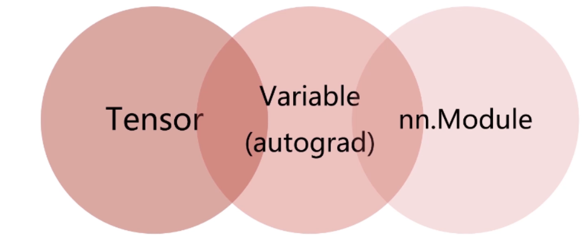
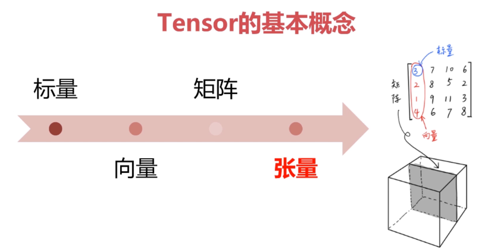
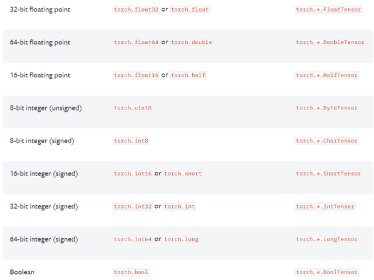
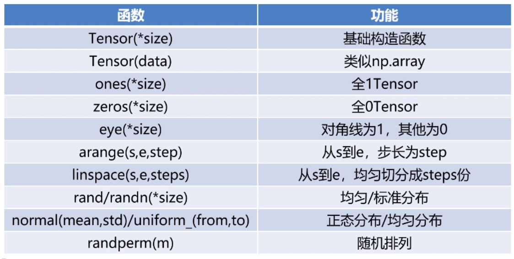
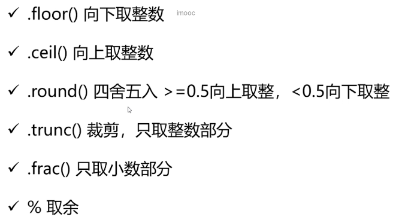
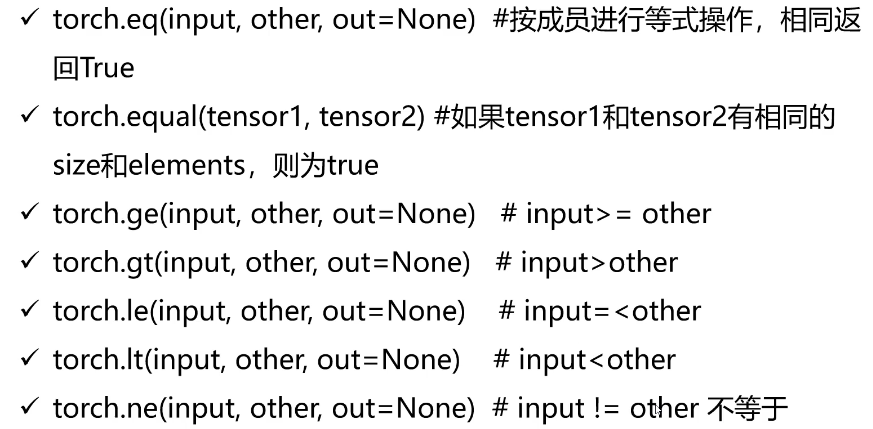
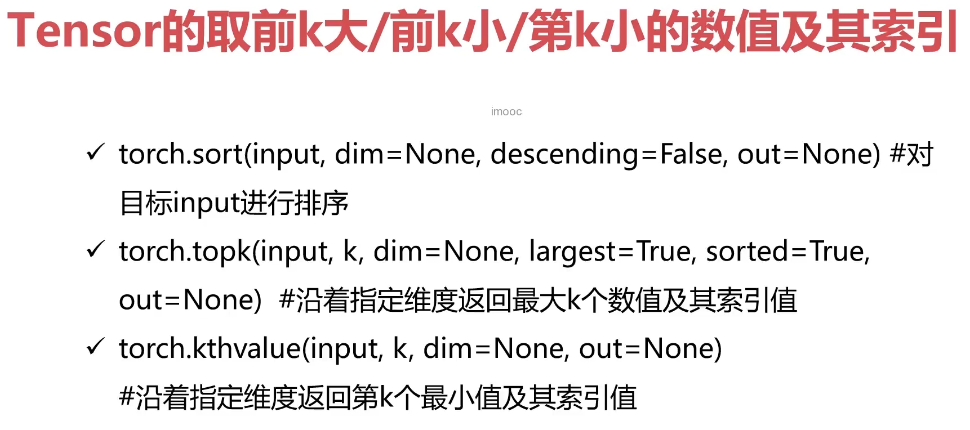
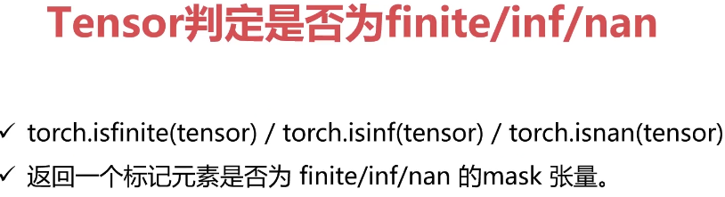
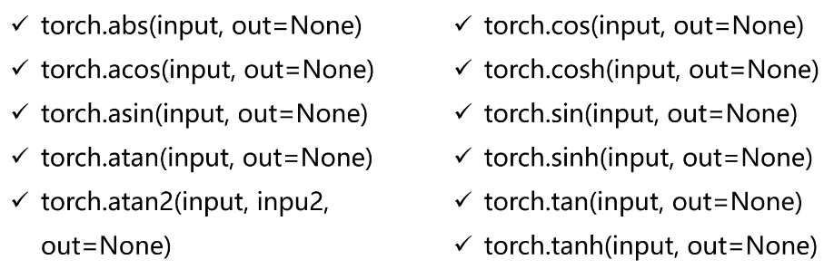
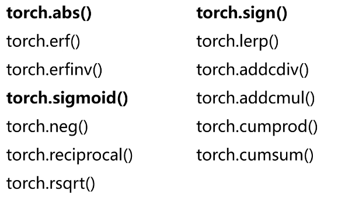

# pytorch基本概念



## tensor的基本概念





标量是零维的张量，向量是一维的，矩阵是二维的


### 类型




### 创建




```python
import torch

a = torch.Tensor([[1, 2], [3, 4]])# 根据给定数据构造张量
print(a)
print(a.type())
```

    tensor([[1., 2.],
            [3., 4.]])
    torch.FloatTensor


```python
# 指定张量的维度，值是垃圾值
a = torch.Tensor(2, 3)
print(a)
print(a.type())
```

    tensor([[0.0000e+00, 0.0000e+00, 0.0000e+00],
            [0.0000e+00, 0.0000e+00, 1.0653e-38]])
    torch.FloatTensor


```python
# 全 1
a = torch.ones(2, 3)
print(a)
print(a.type())
```

    tensor([[1., 1., 1.],
            [1., 1., 1.]])
    torch.FloatTensor


```python
# 全 0
a = torch.zeros(2, 3)
print(a)
print(a.type())
```

    tensor([[0., 0., 0.],
            [0., 0., 0.]])
    torch.FloatTensor


```python
# 定义一个跟已知张量维度一样的全 0 或者全 1 的矩阵
b = torch.ones(4, 3)
a = torch.zeros_like(b)
print(a)
print(a.type())

a = torch.ones_like(b)
print(a)
print(a.type())
```

    tensor([[0., 0., 0.],
            [0., 0., 0.],
            [0., 0., 0.],
            [0., 0., 0.]])
    torch.FloatTensor
    tensor([[1., 1., 1.],
            [1., 1., 1.],
            [1., 1., 1.],
            [1., 1., 1.]])
    torch.FloatTensor


```python
# 随机数
a = torch.rand(4, 4)
print(a)
print(a.type())
```

    tensor([[0.9516, 0.7403, 0.0163, 0.8043],
            [0.9939, 0.4710, 0.5547, 0.6772],
            [0.2314, 0.5702, 0.1214, 0.9924],
            [0.9759, 0.7620, 0.0166, 0.7742]])
    torch.FloatTensor


```python
# 正态分布
a = torch.normal(mean = 0.0, std = torch.rand(5))
print(a)
print(a.type())
```

    tensor([-0.2196, -0.0325,  1.2296, -0.5201,  0.0494])
    torch.FloatTensor


```python
a = torch.normal(mean = torch.rand(5), std = torch.rand(5))
print(a)
print(a.type())
```

    tensor([1.0124, 1.4174, 0.2408, 0.7970, 0.8646])
    torch.FloatTensor


```python
a = torch.rand(5)
print(a)
print(a.type())
```

    tensor([0.3745, 0.9211, 0.1315, 0.5543, 0.7972])
    torch.FloatTensor


```python
# 均匀分布
a = torch.Tensor(2, 2).uniform_(-1, 1)
print(a)
print(a.type())
```

    tensor([[-0.6897,  0.8237],
            [ 0.9463,  0.7699]])
    torch.FloatTensor


```python
# 序列，左闭右开区间
a = torch.arange(0, 4, 1)
print(a)
print(a.type())
```

    tensor([0, 1, 2, 3])
    torch.LongTensor


```python
# 等间隔切分
a = torch.linspace(0, 10, 3)# 拿到等间隔的 n 个数字
print(a)
print(a.type())
```

    tensor([ 0.,  5., 10.])
    torch.FloatTensor


```python
# 随机打乱
a = torch.randperm(10)# 打乱的是索引值
print(a)
print(a.type())
```

    tensor([2, 6, 8, 7, 4, 9, 1, 5, 0, 3])
    torch.LongTensor


### tensor的属性

每个Tensor有三个属性
- torch.dtype 是数据类型
- torch.device 是对象所在的设备名称
- torch.layout 是内存布局对象


```python
# 稀疏张量
dev = torch.device("cuda")
indices = torch.tensor([[0, 1, 2], [2, 0, 2]])# 定义了非零元素的坐标，分别是（0,2）（1,0）（2,2）
values = torch.tensor([3, 4, 5])
x = torch.sparse_coo_tensor(indices,# 索引
                            values,# 具体值
                            (3, 4),# 维度
                            dtype = torch.float32,
                            device = dev
                           )
print(x)
print(x.to_dense())
```

    tensor(indices=tensor([[0, 1, 2],
                           [2, 0, 2]]),
           values=tensor([3., 4., 5.]),
           device='cuda:0', size=(3, 4), nnz=3, layout=torch.sparse_coo)
    tensor([[0., 0., 3., 0.],
            [4., 0., 0., 0.],
            [0., 0., 5., 0.]], device='cuda:0')

## 算数运算

加减乘除都是对应元素进行运算


```python
c = a + b
c = torch.add(a, b)
a.add(b)
a.add_(b)# 相当于 a = a + b
```

### 乘法

tensor 的乘法是对应元素相乘（哈达玛积）


```python
a = torch.Tensor([[1, 2], [2, 3]])
b = torch.Tensor([[1, 2], [2, 3]])
print(torch.mul(a, b))
```

```
tensor([[1., 4.],
        [4., 9.]])
```


### 矩阵运算

```python
a = torch.Tensor([[1, 2], [2, 3]])
b = torch.Tensor([[1, 2], [2, 3]])
print(a)
print(b)
print(torch.mm(a, b))
print(torch.matmul(a, b))
print(a @ b)
```

```
tensor([[1., 2.],
        [2., 3.]])
tensor([[1., 2.],
        [2., 3.]])
tensor([[ 5.,  8.],
        [ 8., 13.]])
tensor([[ 5.,  8.],
        [ 8., 13.]])
tensor([[ 5.,  8.],
        [ 8., 13.]])
```


高维的 tensor，矩阵运算（大于二维）

矩阵乘法仅仅作用在最后两个维度，同时要求前面的维度保持一致，后面的两个维度满足矩阵乘法的定义，此时运算的操作只有 `torch.matmul`

```python
a = torch.ones(1, 2, 3, 4)
b = torch.ones(1, 2, 4, 4)
print(a)
print(b)
print(torch.matmul(a, b))
print(a @ b)
```


### 其他运算

- pow
- sqrt
- exp
- log（底数为 e)，log10，log2

### in-place操作

就地操作，不允许使用临时变量

### 广播机制

张量参数可以自动拓展为相同大小

必须满足的条件：

- 每个张量至少有一个维度
- 满足右对齐（就是说，维度要么一样，要么其中一个是 1）

```python
a = torch.rand(2, 3)
b = torch.rand(3)# 相当于 1， 3

print(a)
print(b)
print(a.add(b))
```

```
tensor([[0.1451, 0.5545, 0.4950],
        [0.9743, 0.7801, 0.8118]])
tensor([0.1435, 0.4124, 0.1536])
tensor([[0.2887, 0.9669, 0.6486],
        [1.1178, 1.1925, 0.9653]])
```

### 取整取余



比较运算










### 三角函数



余弦相似度

### 其他数学函数




