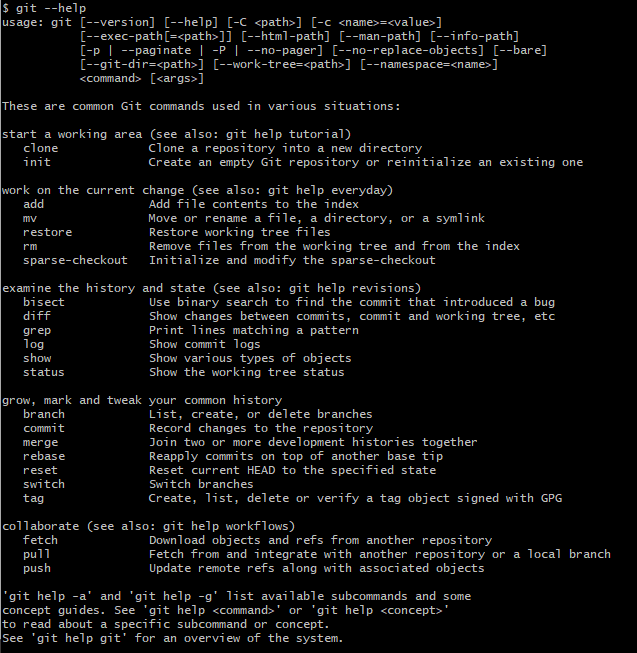
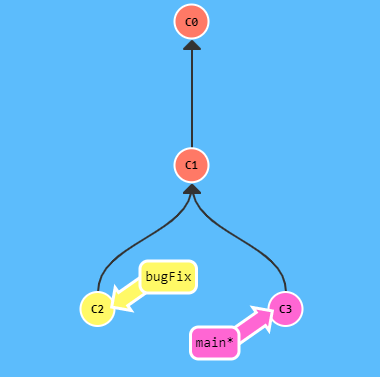
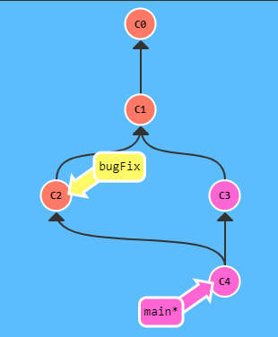
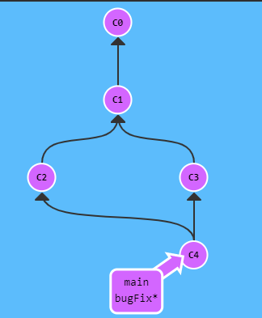
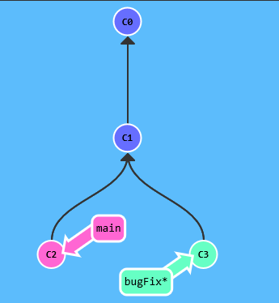
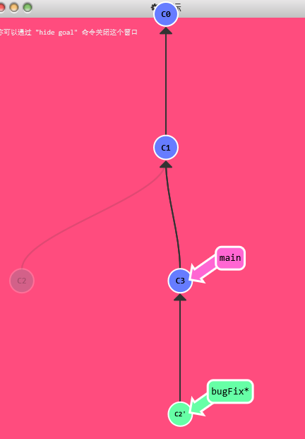

# Git 命令学习

## 2021年1月17日

查看官方的 help



### Git 命令

-   提交：`git commit` 
-   创建分支：`git branch 新分支名` 
-   切换分支：`git checkout 分支名` 
-   创建新分支的同时切换到新分支：`git checkout -b 新分支名` 
-   合并分支：`git merge 要合并的分支名`
-   复制当前分支到目标分支下方：`git rebase 目标分支`

#### Git merge

合并分支：



```bash
git merge bugFix
```



问题来了，现在 main 分支有两个父节点，这是有问题的，需要把指向 bugFix 的指针也指向 C4



```bash
git checkout bugFix
git merge main // 合并 main 分支，但是因为 bugFix 是 main 的父节点，所以其实什么也没干，只是移动了一下指针
```

#### git rebase

复制当前分支到目标分支：`git rebase 目标分支`

Rebase 实际上就是取出一系列的提交记录，“复制”它们，然后在另外一个地方逐个的放下去。

Rebase 的优势就是可以创造更线性的提交历史



目标：




将 bugFix 分支直接移动到 main 分支上

-   在bugFix 分支上执行`git rebase main`

然后

```bash
git checkout main
git rebase bugFix
```


