# 每日必学

[TOC]

Git 学习网站：https://learngitbranching.js.org/

Linux 命令：Linux 命令行大全-郭光伟译-人民邮电出版社

>   Git 命令
>
>   Linux 命令
>
>   MySQL
>
>   LeetCode
>
>   PAT
>
>   面试题
>
>   分页 <div style="page-break-after:always"></div>

# 2021-02-17

## Linux 命令

### head/tail：打印开头/结尾

- 默认查看 10 行
- 使用 `-n` 选项调整打印行数
- `tail` 使用 `-f` 选项可以实时查看改动

### tee：从 stdin 读取数据并打印到 stdout 和文件

### echo：显示一行文本

算数拓展：`$((算数表达式))`，只支持正数

| 运算符 | 描述 |
| :----: | ---- |
|   +    |      |
|   ？   | 减   |
|   *    |      |
|   /    |      |
|   %    |      |
|   **   | 取幂 |

花括号拓展：

```shell
$ echo number_{1..5}
number_1 number_2 number_3 number_4 number_5
```

可以创建一系列的文件和目录

```bash
$ mkdir 2021-0{1..9} 2021-1{0..2}
$ ll
drwxr-xr-x 1 xwx xwx 4096 Feb 17 20:41 2021-01/
drwxr-xr-x 1 xwx xwx 4096 Feb 17 20:41 2021-02/
drwxr-xr-x 1 xwx xwx 4096 Feb 17 20:41 2021-03/
drwxr-xr-x 1 xwx xwx 4096 Feb 17 20:41 2021-04/
drwxr-xr-x 1 xwx xwx 4096 Feb 17 20:41 2021-05/
drwxr-xr-x 1 xwx xwx 4096 Feb 17 20:41 2021-06/
drwxr-xr-x 1 xwx xwx 4096 Feb 17 20:41 2021-07/
drwxr-xr-x 1 xwx xwx 4096 Feb 17 20:41 2021-08/
drwxr-xr-x 1 xwx xwx 4096 Feb 17 20:41 2021-09/
drwxr-xr-x 1 xwx xwx 4096 Feb 17 20:41 2021-10/
drwxr-xr-x 1 xwx xwx 4096 Feb 17 20:41 2021-11/
drwxr-xr-x 1 xwx xwx 4096 Feb 17 20:41 2021-12/
```

### history：显示历史命令

```bash
$ history | grep /usr/bin # 找 /usr/bin 目录下得命令
  104  ls /bin/usr/bin
  169  history | grep /usr/bin
```

### id：显示用户身份标识

```bash
$ id
uid=1000(xwx) gid=1000(xwx) groups=1000(xwx),4(adm),20(dialout),24(cdrom),25(floppy),27(sudo),29(audio),30(dip),44(video),46(plugdev),114(netdev)
```


 <div style="page-break-after:always"></div>

# 2021-02-15

## Linux 命令

重定向操作符：`>`，可以把输出重定向到文件，如果文件已存在，会覆盖原内容

重定向符：`>>`，不会覆盖，只是追加

### cat：合并文件

- 读取一个或者多个文件，并打印到命令行
- 一般用来查看短的文本文件
- 结合通配符和重定向符可以用来合并文件

### sort：对文本行排序

```bash
ls /bin | sort
```

### uniq：报告或删除文件中的重复行

### wc：字数统计

- word count
- 输出从左到右分别是：行数、字数、字节数
- `-l`，只报告行数
- 与管道符一起食用更佳

```bash
 ls /bin | wc
 # 输出 171     171    1393
```

### grep：打印匹配行

- 在文件中查找匹配的文本
- `-i`忽略大小写；`-v`输出不匹配的

```bash
xwx@DESKTOP-4R5NDL6:~$ ls /bin | sort | uniq | grep zip
bunzip2
bzip2
bzip2recover
gunzip
gzip
```

## 面试题

### 1、CAP理论

分布式环境下（数据分布）要任何时刻保证数据一致性是不可能的，只能采取妥协的方案来保证数据最终一致性。这个也就是著名的CAP定理。

CAP定理是2000年，由 Eric Brewer 提出来的。Brewer认为在分布式的环境下设计和部署系统时，有3个核心的需求，以一种特殊的关系存在。这里的分布式系统说的是在物理上分布的系统，比如我们常见的web系统。

这3个核心的需求是：Consistency，Availability和Partition Tolerance，赋予了该理论另外一个名字 － CAP。

Consistency：**一致性**，这个和数据库ACID的一致性类似，但这里关注的所有数据节点上的数据一致性和正确性，而数据库的ACID关注的是在在一个事务内，对数据的一些约束。

Availability：**可用性**，关注的在某个结点的数据是否可用，可以认为某一个节点的系统是否可用，通信故障除外。

Partition Tolerance：**分区容忍性**，是否可以对数据进行分区。这是考虑到性能和可伸缩性。

CAP 原则指的是，这三个要素最多只能同时实现两点，不可能三者兼顾。

### 2、Reactor（反应器）模式

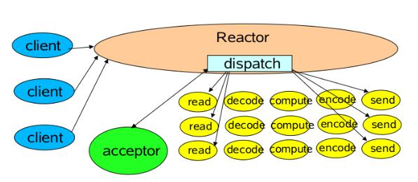

基于事件驱动的设计，当有事件触发时，才会调用处理器进行数据处理。使用Reactor模式，对线程的数量进行控制，一个线程处理大量的事件。

### 3、分布式如何保证一致性

互联网系统大多将强一致性需求转换成最终一致性的需求，并通过系统执行幂等性的保证，保证数据的最终一致性。

### 4、死锁和饥饿，死锁的解决方法

死锁：互斥、不可剥夺、占用并等待、循环等待

饥饿：指一个进程长时间得不到资源

### 5、AVL树（平衡树）、红黑树、B树

#### 二叉搜索树

左<根<右

- 平均深度`O(logN)`
- 插入、删除、查找元素平均时间`O(logN)`
- 删除操作
  - 叶节点，直接删
  - 只有一个儿子，调整这个节点的父指针指向即可
  - 两个儿子，找左子树最大值（或者右子树最小值），用那个节点的数据代替删除节点的数据，然后把那个节点递归的删掉

#### AVL树

- 是二叉搜索树
- 树的深度保证是`O(logN)`
- 自带平衡条件
  - 左右子树的高度最多相差1
- 高为h，最少的节点数为S(h)=S(h-1)+S(h-2)+1
- 除插入（假设懒惰删除，就是仍然保留在树中，但是做个已删除的标记）外，所有的操作都是`O(logN)`
- 插入以后，需要判断还是不是AVL树

#### B树

M阶的B树：

- 根要么是树叶，要么儿子在2和M之间
- 除根外，所有非叶节点儿子数在0.5M（向上取整）到M之间
- 数据在叶子上，叶子的深度相同
- 每一个内部节点都有着指向儿子的指针（最多M个），以及子树中的最小关键字（第一个子树的最小值不放），关键字值递增
- 插入可能会分裂节点，删除可能会合并节点

用途：数据库系统

#### 红黑树

也是二叉搜索树，插入的节点是红的

- 节点或黑或红
- 根是黑的
- 叶子是黑的（叶子是NIL节点）
- 红节点必有两个黑儿子
- 从根开始到任意叶子节点，路径上黑节点数目相同

最差 `O(logN)`

### 6、进程、线程的理解，进程通信，线程通信，线程不安全如何解决

进程间的通信方式：共享内存、信号、信号量、管道、消息队列、套接字

线程通信：锁（互斥锁、条件变量、读写锁）、信号、信号量

多个线程同一时刻对同一个全局变量(同一份资源)做写操作(读操作不会涉及线程安全)时，如果跟我们预期的结果一样，我们就称之为线程安全，反之，线程不安全。

加锁保证安全

### 7、各种排序算法

冒泡、插入、希尔、选择、归并、桶、堆排、快排

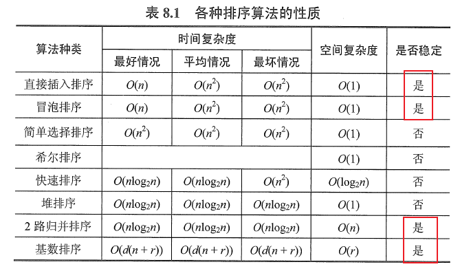

稳定的排序算法：冒泡、插入、归并、桶

### 8、final的使用

修饰类表示类不不能被继承

修饰方法代表方法不能被子类重写

修饰变量代表是常量

### 9、String StringBuffer StringBuilder

String的值是不可变的，这就导致每次对String的操作都会生成新的String对象

StringBuffer 和 StringBuilder 类的对象能够被多次的修改，并且不产生新的未使用对象。

StringBuilder 的方法不是线程安全的

（1）如果要操作少量的数据用 String；

（2）多线程操作字符串缓冲区下操作大量数据 StringBuffer；

（3）单线程操作字符串缓冲区下操作大量数据 StringBuilder。

### 10、HashMap  HashTable 1.7  1.8

（1）HashMap线程不安全,HashTable线程安全

（2）HashMap是没有contains方法的，而包括containsValue和containsKey方法；hashtable则保留了contains方法

（3）Hashmap是允许key和value为null值的；HashTable键值对都不能为空

（4）计算hash值方式不同，map 有专门的计算 hash 值的方法，table 直接就是 key 的 hashCode()

（5）HashMap 哈希扩容必须要求为原容量的2倍；Hashtable扩容为原容量2倍加1；

（6）解决hash冲突方式不同：

Java8，HashMap中，当出现冲突时可以：

- 如果冲突数量小于8，则是以链表方式解决冲突。

- 而当冲突大于等于8时，就会将冲突的Entry转换为**红黑树进行存储。**

- 而又当数量小于6时，则又转化为链表存储。

HashTable中， 都是以链表方式存储。

## LeetCode

### 题目

[题目链接](https://leetcode-cn.com/problems/lru-cache/)

难度中等

运用你所掌握的数据结构，设计和实现一个 [LRU (最近最少使用) 缓存机制](https://baike.baidu.com/item/LRU) 。

实现 `LRUCache` 类：

- `LRUCache(int capacity)` 以正整数作为容量 `capacity` 初始化 LRU 缓存
- `int get(int key)` 如果关键字 `key` 存在于缓存中，则返回关键字的值，否则返回 `-1` 。
- `void put(int key, int value)` 如果关键字已经存在，则变更其数据值；如果关键字不存在，则插入该组「关键字-值」。当缓存容量达到上限时，它应该在写入新数据之前删除最久未使用的数据值，从而为新的数据值留出空间。

 

**进阶**：你是否可以在 `O(1)` 时间复杂度内完成这两种操作？

 

**示例：**

```
输入
["LRUCache", "put", "put", "get", "put", "get", "put", "get", "get", "get"]
[[2], [1, 1], [2, 2], [1], [3, 3], [2], [4, 4], [1], [3], [4]]
输出
[null, null, null, 1, null, -1, null, -1, 3, 4]

解释
LRUCache lRUCache = new LRUCache(2);
lRUCache.put(1, 1); // 缓存是 {1=1}
lRUCache.put(2, 2); // 缓存是 {1=1, 2=2}
lRUCache.get(1);    // 返回 1
lRUCache.put(3, 3); // 该操作会使得关键字 2 作废，缓存是 {1=1, 3=3}
lRUCache.get(2);    // 返回 -1 (未找到)
lRUCache.put(4, 4); // 该操作会使得关键字 1 作废，缓存是 {4=4, 3=3}
lRUCache.get(1);    // 返回 -1 (未找到)
lRUCache.get(3);    // 返回 3
lRUCache.get(4);    // 返回 4
```

### 题解

#### Java

```java
class LRUCache {

    // hash 表，快速确定是否包含 key
    private Map<Integer, DLinkNode> cache = new HashMap<>();
    private int size;
    private int capacity;
    // 使用冗余的头尾节点
    DLinkNode head = new DLinkNode();
    DLinkNode tail = new DLinkNode();

    private class DLinkNode{
        int key;
        int val;
        DLinkNode pre;
        DLinkNode next;

        public DLinkNode() {
        }

        public DLinkNode(int key, int val) {
            this.key = key;
            this.val = val;
        }
    }


    public LRUCache(int capacity) {
        // 头尾节点联系起来
        head.next = tail;
        tail.pre = head;
        size = 0;
        this.capacity = capacity;
    }

    public int get(int key) {
        DLinkNode node = cache.get(key);
        if(node == null){// 不存在
            return -1;
        }
        else{
            // 被操作了，应该放在链表头部
            delNode(node);
            move2Head(node);
            return node.val;
        }
    }

    private void delNode(DLinkNode node) {
        node.pre.next = node.next;
        node.next.pre = node.pre;
    }

    private void move2Head(DLinkNode node) {
        // 插到头部
        node.next = head.next;
        head.next.pre = node;
        head.next = node;
        node.pre = head;
    }

    public void put(int key, int value) {
        // 如果存在这个节点，应该更新值
        DLinkNode node = cache.get(key);
        if(node != null){
            updateNodeValue(node, value);
            delNode(node);
            move2Head(node);
        }
        else{
            // 把节点插入链表的头部，放入 hash 表
            DLinkNode tmp = new DLinkNode(key, value);
            move2Head(tmp);
            cache.put(key, tmp);
            size++;
            // 如果超容量，应该删除链表尾部的节点
            if(size > capacity){
                int delKey = delNodeOfTail();
                cache.remove(delKey);
                size--;
            }
        }
    }

    private Integer delNodeOfTail() {
        Integer oldKey = tail.pre.key;
        DLinkNode node = tail.pre.pre;
        node.next = tail;
        tail.pre = node;
        return oldKey;
    }

    private void updateNodeValue(DLinkNode node, int value) {
        node.val = value;
    }
}
```

#### Java（函数再封装一下）

```java
class LRUCache {

    // hash 表，快速确定是否包含 key
    private Map<Integer, DLinkNode> cache = new HashMap<>();
    private int size;
    private int capacity;
    // 使用冗余的头尾节点
    DLinkNode head = new DLinkNode();
    DLinkNode tail = new DLinkNode();

    private class DLinkNode{
        int key;
        int val;
        DLinkNode pre;
        DLinkNode next;

        public DLinkNode() {
        }

        public DLinkNode(int key, int val) {
            this.key = key;
            this.val = val;
        }
    }


    public LRUCache(int capacity) {
        // 头尾节点联系起来
        head.next = tail;
        tail.pre = head;
        size = 0;
        this.capacity = capacity;
    }

    public int get(int key) {
        DLinkNode node = cache.get(key);
        if(node == null){// 不存在
            return -1;
        }
        else{
            // 被操作了，应该放在链表头部
            move2Head(node);
            return node.val;
        }
    }

    private void add2Head(DLinkNode node) {
        // 插到头部
        node.next = head.next;
        head.next.pre = node;
        head.next = node;
        node.pre = head;
    }

    private void delNode(DLinkNode node) {
        node.pre.next = node.next;
        node.next.pre = node.pre;
    }

    private void move2Head(DLinkNode node) {
        delNode(node);
        add2Head(node);
    }

    public void put(int key, int value) {
        // 如果存在这个节点，应该更新值，同时移到链表头
        DLinkNode node = cache.get(key);
        if(node != null){
            updateNodeValue(node, value);
            move2Head(node);
        }
        else{
            // 把节点插入链表的头部，放入 hash 表
            DLinkNode tmp = new DLinkNode(key, value);
            add2Head(tmp);
            cache.put(key, tmp);
            size++;
            // 如果超容量，应该删除链表尾部的节点
            if(size > capacity){
                DLinkNode delNode = delNodeOfTail();
                cache.remove(delNode.key);
                size--;
            }
        }
    }

    private DLinkNode delNodeOfTail() {
        DLinkNode res = tail.pre;
        delNode(res);
        return res;
    }

    private void updateNodeValue(DLinkNode node, int value) {
        node.val = value;
    }
}
```


<div style="page-break-after:always"></div>

# 2021-02-14

## 面试题

### 1、Java的基本变量有哪些？各占几个字节？

8种：int,short,long,byte,char,double,float,bool

int，float 4字节

short，char 2字节

long，double 8字节

byte 1字节

boolean 1bit

### 2、构造函数能被重写吗？能被重载吗？

可以重载，但是不能被重写（构造函数与类名相同，不能被继承，所以不能重载）

### 3、子类的super是重写吗？

不是，只是调用父类的构造函数，并且只能放在第一行。

### 4、接口和抽象类的区别有哪些？能被实例化吗？里面变量有什么不同吗？方法有什么不同？

不同点：表示内容不同、性质不同、成员变量不同

一、表示内容不同

1、抽象类：抽象类表zhuan示该类中可能已经有一些方法的具体定义。

2、接口：接口就仅仅只能定义各个方法的界面（方法名，参数列表，返回类型），并不关心具体细节。

二、性质不同

1、抽象类：抽象类是对象的抽象。

2、接口：接口是一种行为规范。

三、成员变量不同

1、抽象类：抽象类中的成员变量可以被不同的修饰符修饰。

2、接口：接口中的成员变量默认的都是静态常量（static final）。

共同点如下：

1、都是上层的抽象层。

2、都不能被实例化

3、都能包含抽象的方法，这些抽象的方法用于描述类具备的功能，但是不比提供具体的实现。

### 5、线程的创建方式有哪几种？创建方法说下？内存模型中线程私有的有哪些？

3种：

1、实现 Runnable 接口，重写 run 方法，创建实现类的实例，并把实例作为 Thread 的构造器参数来创建 Thread 对象

2、通过实现 Callable 接口和 FutureTask 来创建 Thread 线程，

3、通过继承 Thread 类，重写 run 方法，创建Thread子类的实例，调用 start 方法来启动该线程

4、通过线程池来创建线程

线程私有的：虚拟机栈、本地方法栈、程序计数器

### 6、String abc = new Stirng("abc")，新建了几个对象？abc指向哪？

两个或一个

首先要看常量池里是否有“abc”这个字符串，如果有，则创建一个，如果没有，则创建两个。

### 7、TCP/IP有几层？每一层的作用？MAC地址在哪层？

四层

应用层决定了向用户提供应用服务时通信的活动。TCP/IP 协议族内预存了各类通用的应用服务。

传输层对上层应用层， 提供处于网络连接中的两台计算机之间的数据传输。

网络层用来处理在网络上流动的数据包。

网络接口层用来处理连接网络的硬件部分。

mac 在数据链路层

### 8、List和Set区别是什么？Set为什么能去重？

list 是线性表，有序，可以重复

set 是集合，无序，不能有重复的元素

以 hashset 为例，

```java
// Dummy value to associate with an Object in the backing Map
private static final Object PRESENT = new Object();

public boolean add(E e) {
  return map.put(e, PRESENT)==null;
}
```

调用了 hashmap 的 put 方法

```java
public V put(K key, V value) {
  return putVal(hash(key), key, value, false, true);
}

/**
     * Implements Map.put and related methods.
     *
     * @param hash hash for key
     * @param key the key
     * @param value the value to put
     * @param onlyIfAbsent if true, don't change existing value
     * @param evict if false, the table is in creation mode.
     * @return previous value, or null if none
     */
final V putVal(int hash, K key, V value, 
               boolean onlyIfAbsent,
               boolean evict) {
  Node<K,V>[] tab; 
  Node<K,V> p; 
  int n, i;
  if ((tab = table) == null || (n = tab.length) == 0)
    n = (tab = resize()).length;
  if ((p = tab[i = (n - 1) & hash]) == null)
    tab[i] = newNode(hash, key, value, null);
  else {
    Node<K,V> e; 
    K k;
    // 如果 key 相同
    if (p.hash == hash &&
        ((k = p.key) == key || (key != null && key.equals(k))))
      e = p;
    else if (p instanceof TreeNode)
      e = ((TreeNode<K,V>)p).putTreeVal(this, tab, hash, key, value);
    else {
      for (int binCount = 0; ; ++binCount) {
        // 如果走到链表尾部，还是没有找到，就尾插
        if ((e = p.next) == null) {
          p.next = newNode(hash, key, value, null);
          if (binCount >= TREEIFY_THRESHOLD - 1) // -1 for 1st
            treeifyBin(tab, hash);
          break;
        }
        // 如果 key 相同
        if (e.hash == hash &&
            ((k = e.key) == key || (key != null && key.equals(k))))
          break;
        p = e;// 配合 e 对链表实现遍历
      }
    }
    // 如果 key 相同，用新值覆盖老值
    if (e != null) { // existing mapping for key
      V oldValue = e.value;
      if (!onlyIfAbsent || oldValue == null)
        e.value = value;
      afterNodeAccess(e);// HashMap 这里只是空方法
      return oldValue;
    }
  }
  ++modCount;
  if (++size > threshold)
    resize();
  afterNodeInsertion(evict);
  return null;
}
```


第二次

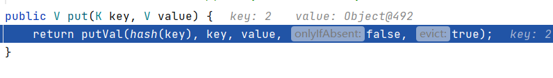

因为两次 put 的 k，v完全相同，运行到

```java
if (p.hash == hash &&
        ((k = p.key) == key || (key != null && key.equals(k))))
      e = p;
```

就会直接到

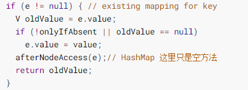

等于什么也没有干

### 9、A继承exception，B又继承A，然后在C中的方法抛出B，问我这样写对吗？

对的

### 10、HashMap底层原理：bucket扩容？k冲突了怎么办？

桶中元素大于阈值就触发扩容。

jdk8中put方法：先计算key的哈希值，然后调用putVal方法==>先判断哈希表是否为空，为空就扩容，不为空计算出key在哈希表中的位置i，看table[i]是否为空，为空就直接新建一个节点放进去，不为空判断当前位置的hash值，key和要插入的是否相同，相同则覆盖val，不相同就查看table[i]是否是红黑树节点，如果是的话就用红黑树直接插入键值对，如果不是开始遍历链表，如果遇到key相同的，覆盖val，否则直接尾插法插入，如果链表长度大于8，转为红黑树结构，执行完成后看size是否大于阈值threshold，大于就扩容，否则直接结束

### 11、Volatile有什么作用？

（1）保证该变量对所有线程的可见性；

（2）禁止指令重排序优化。

### 12、内网中服务器ip地址怎么确定？

### 13、URL为什么有时候获取的是网页有时候直接下载图片

返回的HTTP报文中的Content-Type控制，Content-Type如果为image/jpeg（或其他图片格式）则展示图片，若application/octet-stream这种或者其他的则是下载

### 14、互斥锁和自旋锁、读写锁

读写锁实际是一种特殊的自旋锁。一次只有一个线程可以占有写模式的读写锁, 但是可以有多个线程同时占有读模式的读写锁。如果读写锁当前没有读者，也没有写者，那么写者可以立刻获得读写锁，否则它必须自旋在那里，直到没有任何写者或读者。如果读写锁没有写者，那么读者可以立即获得该读写锁，否则读者必须自旋在那里，直到写者释放该读写锁。

### 15、Redis用过吗，单线程还是多线程

在业务处理的时候，Redis是单线程的。但是有些事情是其他线程来做的，它也会clone或者fork一个线程来处理。

## LeetCode

### 题目

[142. 环形链表 II](https://leetcode-cn.com/problems/linked-list-cycle-ii/)

难度中等

给定一个链表，返回链表开始入环的第一个节点。 如果链表无环，则返回 `null`。

为了表示给定链表中的环，我们使用整数 `pos` 来表示链表尾连接到链表中的位置（索引从 0 开始）。 如果 `pos` 是 `-1`，则在该链表中没有环。**注意，`pos` 仅仅是用于标识环的情况，并不会作为参数传递到函数中。**

**说明：**不允许修改给定的链表。

**进阶：**

- 你是否可以使用 `O(1)` 空间解决此题？

 

**示例 1：**


```
输入：head = [3,2,0,-4], pos = 1
输出：返回索引为 1 的链表节点
解释：链表中有一个环，其尾部连接到第二个节点。
```

**示例 2：**


```
输入：head = [1,2], pos = 0
输出：返回索引为 0 的链表节点
解释：链表中有一个环，其尾部连接到第一个节点。
```

**示例 3：**


```
输入：head = [1], pos = -1
输出：返回 null
解释：链表中没有环。
```

### 题解

我们遍历链表中的每个节点，并将它记录下来；一旦遇到了此前遍历过的节点，就可以判定链表中存在环。借助哈希表可以很方便地实现。

```java
/**
 * Definition for singly-linked list.
 * class ListNode {
 *     int val;
 *     ListNode next;
 *     ListNode(int x) {
 *         val = x;
 *         next = null;
 *     }
 * }
 */
public class Solution {
    public ListNode detectCycle(ListNode head) {
        Set<ListNode> hash = new HashSet<>();
        ListNode p = head;
        while(p != null){
            if(hash.contains(p)){
                return p;
            }
            else{
                hash.add(p);
            }
            p = p.next;
        }
        return null;
    }
}
```

<div style="page-break-after:always"></div>

# 2021-02-01

## Linux 命令

### help：获取帮助文档

`help 命令`

### man：显示程序手册

`man 命令`

### apropos：通过关键词搜索命令

`apropos 关键字`

### whatis：显示命令概述

### info：显示程序信息条目

### alias：创建别名

使用：`alias 别名=字符串（单引号括起来）`

等号前后不能有空格

## LeetCode

### 122. 买卖股票的最佳时机 II

[题目链接]((https://leetcode-cn.com/problems/best-time-to-buy-and-sell-stock-ii/))

难度简单

给定一个数组，它的第 *i* 个元素是一支给定股票第 *i* 天的价格。

设计一个算法来计算你所能获取的最大利润。你可以尽可能地完成更多的交易（多次买卖一支股票）。

**注意：**你不能同时参与多笔交易（你必须在再次购买前出售掉之前的股票）。

**示例 1:**

```
输入: [7,1,5,3,6,4]
输出: 7
解释: 在第 2 天（股票价格 = 1）的时候买入，在第 3 天（股票价格 = 5）的时候卖出, 这笔交易所能获得利润 = 5-1 = 4 。
     随后，在第 4 天（股票价格 = 3）的时候买入，在第 5 天（股票价格 = 6）的时候卖出, 这笔交易所能获得利润 = 6-3 = 3 。
```

**示例 2:**

```
输入: [1,2,3,4,5]
输出: 4
解释: 在第 1 天（股票价格 = 1）的时候买入，在第 5 天 （股票价格 = 5）的时候卖出, 这笔交易所能获得利润 = 5-1 = 4 。
     注意你不能在第 1 天和第 2 天接连购买股票，之后再将它们卖出。
     因为这样属于同时参与了多笔交易，你必须在再次购买前出售掉之前的股票。
```

**示例 3:**

```
输入: [7,6,4,3,1]
输出: 0
解释: 在这种情况下, 没有交易完成, 所以最大利润为 0。
```


#### 解题思路

交易次数不限制，也就是说可以认为 K 和 K - 1 是一样的，

```tex
dp[i][k][0] = max(dp[i-1][k][0], dp[i-1][k][1] + price[i])
dp[i][k][1] = max(dp[i-1][k][1], dp[i-1][k-1][0] - price[i])
            = max(dp[i-1][k][1], dp[i-1][k][0] - price[i])
```

 可以发现，与 K 无关，化简方程：

```tex
dp[i][0] = max(dp[i-1][0], dp[i-1][1] + price[i])
dp[i][1] = max(dp[i-1][1], dp[i-1][0] - price[i])
```

#### 代码

C++ 代码：

```c
class Solution {
public:
    int maxProfit(vector<int>& prices) {
        int len = prices.size();
        if(len <= 0){
            return 0;
        }
        int dp_i_0 = 0;
        int dp_i_1 = INT_MIN;
        for(int i=0; i<len; i++){
            int tmp = dp_i_0;// 前一天未交易
            dp_i_0 = max(tmp, dp_i_1 + prices[i]);
            dp_i_1 = max(dp_i_1, tmp - prices[i]);
        }
        return dp_i_0;
    }
};
```

Java 代码：

```java
class Solution {
    public int maxProfit(int[] prices) {
        int len = prices.length;
        if(len <= 0)  return 0;
        int dp_i_0 = 0;
        int dp_i_1 = Integer.MIN_VALUE;
        for(int i=0; i<len; i++){
            int tmp = dp_i_0;// 前一天未交易
            dp_i_0 = Math.max(tmp, dp_i_1 + prices[i]);
            dp_i_1 = Math.max(dp_i_1, tmp - prices[i]);
        }
        return dp_i_0;
    }
}
```

### 123. 买卖股票的最佳时机 III

[题目链接](https://leetcode-cn.com/problems/best-time-to-buy-and-sell-stock-iii/)

难度困难

给定一个数组，它的第 `i` 个元素是一支给定的股票在第 `i` 天的价格。

设计一个算法来计算你所能获取的最大利润。你最多可以完成 **两笔** 交易。

**注意：**你不能同时参与多笔交易（你必须在再次购买前出售掉之前的股票）。

**示例 1:**

```
输入：prices = [3,3,5,0,0,3,1,4]
输出：6
解释：在第 4 天（股票价格 = 0）的时候买入，在第 6 天（股票价格 = 3）的时候卖出，这笔交易所能获得利润 = 3-0 = 3 。
     随后，在第 7 天（股票价格 = 1）的时候买入，在第 8 天 （股票价格 = 4）的时候卖出，这笔交易所能获得利润 = 4-1 = 3 。
```

**示例 2：**

```
输入：prices = [1,2,3,4,5]
输出：4
解释：在第 1 天（股票价格 = 1）的时候买入，在第 5 天 （股票价格 = 5）的时候卖出, 这笔交易所能获得利润 = 5-1 = 4 。   
     注意你不能在第 1 天和第 2 天接连购买股票，之后再将它们卖出。   
     因为这样属于同时参与了多笔交易，你必须在再次购买前出售掉之前的股票。
```

**示例 3：**

```
输入：prices = [7,6,4,3,1] 
输出：0 
解释：在这个情况下, 没有交易完成, 所以最大利润为 0。
```

**示例 4：**

```
输入：prices = [1]
输出：0
```

#### 解题思路

```tex
dp[i][k][0] = max(dp[i-1][k][0], dp[i-1][k][1] + price[i])
dp[i][k][1] = max(dp[i-1][k][1], dp[i-1][k-1][0] - price[i])
```

#### 代码

Java 代码：

```java
class Solution {
    public int maxProfit(int[] prices) {
        int len = prices.length;
        if(len <= 0)  return 0;
        final int MAX_K = 2;
        int[][][] dp = new int[len][MAX_K + 1][2];
        for(int i=0; i<len; i++){
            for(int k=MAX_K; k>=1; k--){
                // 处理 i-1=-1 的情况
                if(i == 0){
                    dp[i][k][0] = 0;
                    dp[i][k][1] = -prices[0];
                    continue;
                }
                dp[i][k][0] = Math.max(dp[i-1][k][0], dp[i-1][k][1] + prices[i]);
                dp[i][k][1] = Math.max(dp[i-1][k][1], dp[i-1][k-1][0] - prices[i]);
            }
        }
        return dp[len-1][MAX_K][0];
    }
}
```

C++ 代码：

```c
class Solution {
public:
    int dp[100000][3][2] = {0};// 三维数组需要在函数外部定义
    int maxProfit(vector<int>& prices) {
        int len = prices.size();
        if(len <= 0)  return 0;
        const int MAX_K = 2;
        for(int i=0; i<len; i++){
            for(int k=MAX_K; k>=1; k--){
                // 处理 i-1=-1 的情况
                if(i == 0){
                    dp[i][k][0] = 0;
                    dp[i][k][1] = -prices[0];
                    continue;
                }
                dp[i][k][0] = max(dp[i-1][k][0], dp[i-1][k][1] + prices[i]);
                dp[i][k][1] = max(dp[i-1][k][1], dp[i-1][k-1][0] - prices[i]);
            }
        }
        return dp[len-1][MAX_K][0];
    }
};
```

### 188. 买卖股票的最佳时机 IV

[题目链接](https://leetcode-cn.com/problems/best-time-to-buy-and-sell-stock-iv/)

难度困难

给定一个整数数组 `prices` ，它的第 `i` 个元素 `prices[i]` 是一支给定的股票在第 `i` 天的价格。

设计一个算法来计算你所能获取的最大利润。你最多可以完成 **k** 笔交易。

**注意：**你不能同时参与多笔交易（你必须在再次购买前出售掉之前的股票）。

**示例 1：**

```
输入：k = 2, prices = [2,4,1]
输出：2
解释：在第 1 天 (股票价格 = 2) 的时候买入，在第 2 天 (股票价格 = 4) 的时候卖出，这笔交易所能获得利润 = 4-2 = 2 。
```

**示例 2：**

```
输入：k = 2, prices = [3,2,6,5,0,3]
输出：7
解释：在第 2 天 (股票价格 = 2) 的时候买入，在第 3 天 (股票价格 = 6) 的时候卖出, 这笔交易所能获得利润 = 6-2 = 4 。
     随后，在第 5 天 (股票价格 = 0) 的时候买入，在第 6 天 (股票价格 = 3) 的时候卖出, 这笔交易所能获得利润 = 3-0 = 3 。
```

#### 解题思路

转移方程不变：

```
dp[i][k][0] = max(dp[i-1][k][0], dp[i-1][k][1] + price[i])
dp[i][k][1] = max(dp[i-1][k][1], dp[i-1][k-1][0] - price[i])
```

确实还是 Java 好写。

#### 代码

C++ 代码：

```c
class Solution {
public:
    int dp[1005][105][2] = {0};
    int maxProfit(int k, vector<int>& prices) {
        int len = prices.size();
        if(len <= 0)  return 0;
         // 由于是最多交易 k 次，所以要包含 0,1， 。。。 k
        for(int i=0; i<=k; i++){
            dp[0][i][0] = 0;
            dp[0][i][1] = -prices[0];
        }
        for(int i=1; i<len; i++){
            for(int j=k; j>0; j--){
               dp[i][j][0] = max(dp[i-1][j][0], dp[i-1][j][1] + prices[i]);
               dp[i][j][1] = max(dp[i-1][j][1], dp[i-1][j-1][0] - prices[i]);
            }
        }

        return dp[len-1][k][0];
    }
};
```

Java代码：

```java
class Solution {
    public int maxProfit(int k, int[] prices) {
        int len = prices.length;
        if(len <=0 )  return 0;
        int[][][] dp = new int[len][k+1][2];
        for(int i=0; i<=k; i++){
            dp[0][i][0] = 0;
            dp[0][i][1] = -prices[0];
        }
        for(int i=1; i<len; i++){
            for(int j=k; j>0; j--){
                dp[i][j][0] = Math.max(dp[i-1][j][0], dp[i-1][j][1] + prices[i]);
                dp[i][j][1] = Math.max(dp[i-1][j][1], dp[i-1][j-1][0] - prices[i]);
            }
        }
        return dp[len-1][k][0];
    }
}
```

### 888. 公平的糖果棒交换

[题目链接](https://leetcode-cn.com/problems/fair-candy-swap/)

难度简单

爱丽丝和鲍勃有不同大小的糖果棒：`A[i]` 是爱丽丝拥有的第 `i` 根糖果棒的大小，`B[j]` 是鲍勃拥有的第 `j` 根糖果棒的大小。

因为他们是朋友，所以他们想交换一根糖果棒，这样交换后，他们都有相同的糖果总量。*（一个人拥有的糖果总量是他们拥有的糖果棒大小的总和。）*

返回一个整数数组 `ans`，其中 `ans[0]` 是爱丽丝必须交换的糖果棒的大小，`ans[1]` 是 Bob 必须交换的糖果棒的大小。

如果有多个答案，你可以返回其中任何一个。保证答案存在。

**示例 1：**

```
输入：A = [1,1], B = [2,2]
输出：[1,2]
```

**示例 2：**

```
输入：A = [1,2], B = [2,3]
输出：[1,2]
```

**示例 3：**

```
输入：A = [2], B = [1,3]
输出：[2,3]
```

**示例 4：**

```
输入：A = [1,2,5], B = [2,4]
输出：[5,4]
```

#### 解题思路

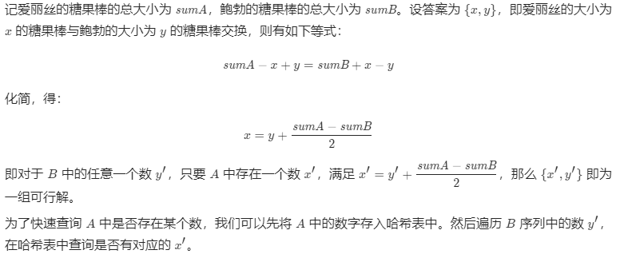

#### 代码

Java代码

```java
class Solution {
    public int[] fairCandySwap(int[] A, int[] B) {
        int sumA, sumB;
        sumA = sumB = 0;
        for(int i=0; i<A.length; i++){
            sumA += A[i];
        }
         for(int i=0; i<B.length; i++){
            sumB += B[i];
        }
        int c = (sumA - sumB) / 2;
        Set<Integer> myset = new HashSet();
        for(int num : A){
            myset.add(num);
        }
        int tmp;
        int[] res = new int[2];
        for(int i=0; i<B.length; i++){
            tmp = B[i] + c;
            if(myset.contains(tmp)){
                res[0] = tmp;
                res[1] = B[i];
                break;
            }
        }
        return res;
    }
}
```

# 2021-01-27

## 剑指 Offer 63. 股票的最大利润

[题目链接](https://leetcode-cn.com/problems/gu-piao-de-zui-da-li-run-lcof/)

难度中等

假设把某股票的价格按照时间先后顺序存储在数组中，请问买卖该股票一次可能获得的最大利润是多少？

**示例 1:**

```
输入: [7,1,5,3,6,4]
输出: 5
解释: 在第 2 天（股票价格 = 1）的时候买入，在第 5 天（股票价格 = 6）的时候卖出，最大利润 = 6-1 = 5 。
     注意利润不能是 7-1 = 6, 因为卖出价格需要大于买入价格。
```

**示例 2:**

```
输入: [7,6,4,3,1]
输出: 0
解释: 在这种情况下, 没有交易完成, 所以最大利润为 0。
```

### 解题思路

>   参考 labuladong 算法小抄

动态规划，状态主要有两个：一是`天数`，另外一个是`股票持有状态`（0 代表未持有， 1 代表持有）

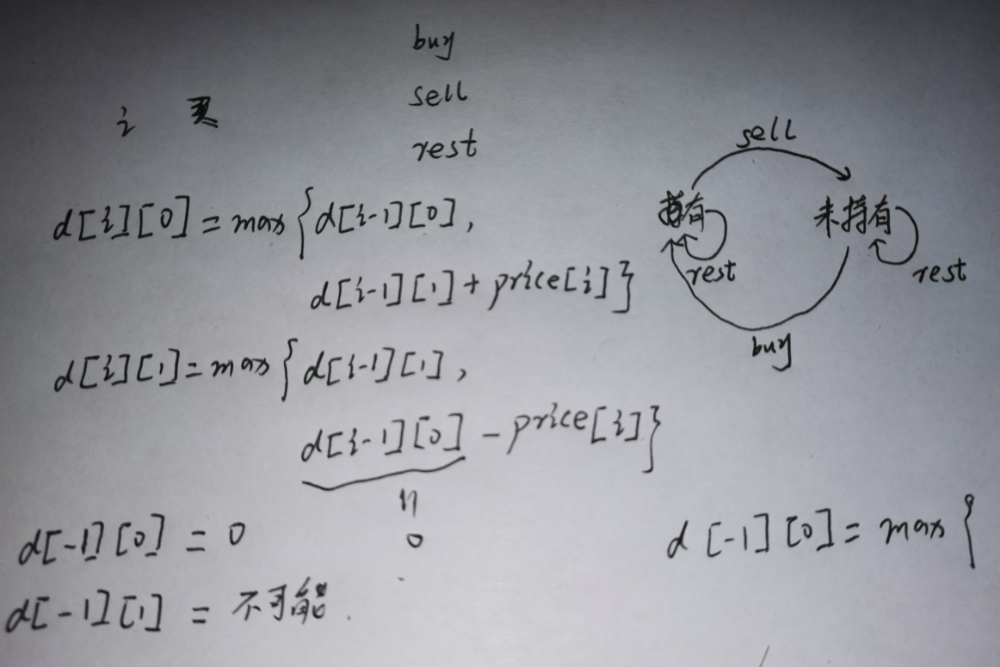

### 具体代码

### C++ 代码：

```c
class Solution {
public:
    //int d[100000][2];
    int maxProfit(vector<int>& prices) {
        if(prices.size() <= 0){
            return 0;
        }
        int len = prices.size();
        // 自底向上
        // d[0][0] = 0;
        // d[0][1] = -prices[0];
        int dp_i_0 = 0;
        int dp_i_1 = -prices[0];
        for(int i=1; i<len; i++){
            // d[i][0] = max(d[i-1][0], d[i-1][1] + prices[i]);
            dp_i_0 = max(dp_i_0, dp_i_1 + prices[i]);
            // d[i][1] = max(d[i-1][1], -prices[i]);
            dp_i_1 = max(dp_i_1, - prices[i]);
        }

        //return d[len-1][0];
        return dp_i_0;
    }
};
```


### Java 代码：

```java
class Solution {
    public int maxProfit(int[] prices) {
        int len = prices.length;
        if(len == 0){
            return 0;
        }
        // 自底向上
        // d[0][0] = 0;
        // d[0][1] = -prices[0];
        int dp_i_0 = 0;
        int dp_i_1 = -prices[0];
        for(int i=1; i<len; i++){
            // d[i][0] = max(d[i-1][0], d[i-1][1] + prices[i]);
            dp_i_0 = Math.max(dp_i_0, dp_i_1 + prices[i]);
            // d[i][1] = max(d[i-1][1], -prices[i]);
            dp_i_1 = Math.max(dp_i_1, - prices[i]);
        }

        //return d[len-1][0];
        return dp_i_0;
    }
}

// 再改一改
class Solution {
    public int maxProfit(int[] prices) {
        int len = prices.length;
        // 自底向上
        // d[0][0] = 0;
        // d[0][1] = -prices[0];
        int dp_i_0 = 0;
        int dp_i_1 = Integer.MIN_VALUE;
        for(int i=0; i<len; i++){
            // d[i][0] = max(d[i-1][0], d[i-1][1] + prices[i]);
            dp_i_0 = Math.max(dp_i_0, dp_i_1 + prices[i]);
            // d[i][1] = max(d[i-1][1], -prices[i]);
            dp_i_1 = Math.max(dp_i_1, - prices[i]);
        }

        //return d[len-1][0];
        return dp_i_0;
    }
}
```


# 2021-01-24

只要使用 new 方法，便需要创建新的对象

常量池中存的是引用

## JVM问题

#### 1、介绍下 Java 内存区域（运行时数据区）

线程私有的：虚拟机栈、本地方法栈、程序计数器

线程共享的：堆、方法区、直接内存

为什么要将永久代 (PermGen) 替换为元空间 (MetaSpace) 呢?

整个永久代有一个 JVM 本身设置固定大小上限，无法进行调整，而元空间使用的是直接内存，受本机可用内存的限制，虽然元空间仍旧可能溢出，但是比原来出现的几率会更小。

#### 2、Java 对象的创建过程

一共五步：

-   **类加载检查**
    -   遇到 new 指令，先去常量池看是否能定位到这个类的符号引用，并且检查这个符号引用代表的类是否已被加载过、解析和初始化过。如果没有，那必须先执行相应的类加载过程
-   **分配内存**
    -   在类加载检查通过后，接下来虚拟机将为新生对象分配内存
-   **初始化零值**
    -   将分配到的内存空间都初始化为零值（不包括对象头），保证了对象的实例字段在 Java 代码中可以不赋初始值就直接使用
-   **设置对象头**
    -   对对象进行必要的设置，例如这个对象是哪个类的实例、如何才能找到类的元数据信息、对象的哈希码、对象的 GC 分代年龄等信息。 这些信息存放在对象头中
-   **执行 init 方法**
    -   执行 `<init>` 方法，把对象按照程序员的意愿进行初始化


#### 3、对象的访问定位的两种方式

**句柄**和**直接指针**


句柄来访问的最大好处是 reference 中存储的是稳定的句柄地址，在对象被移动时只会改变句柄中的实例数据指针，而 reference 本身不需要修改。使用直接指针访问方式最大的好处就是速度快，它节省了一次指针定位的时间开销。

#### 4、如何判断对象是否死亡（两种方法）

**引用计数法**、**可达性分析法**（图论的知识，看这个节点到 GC Roots 是否有路径，有的话就未死亡）

即使在可达性分析法中不可达的对象，也并非是“非死不可”的，这时候它们暂时处于“缓刑阶段”，要真正宣告一个对象死亡，至少要经历两次标记过程；可达性分析法中不可达的对象被第一次标记并且进行一次筛选，筛选的条件是此对象是否有必要执行 finalize 方法。当对象没有覆盖 finalize 方法，或 finalize 方法已经被虚拟机调用过时，虚拟机将这两种情况视为没有必要执行。

被判定为需要执行的对象将会被放在一个队列中进行第二次标记，除非这个对象与引用链上的任何一个对象建立关联，否则就会被真的回收。

#### 5、四种引用

强引用：必不可少，绝不回收

软引用：可有可无，如果内存不够，就回收，如果内存够，就不回收

弱引用：可有可无，但是生命周期更短，不管内存够不够，垃圾收集器一旦发现，就回收他

虚引用：形同虚设，任何时候都可能被垃圾回收

#### 6、垃圾收集有哪些算法，各自的特点

**标记-清除**（MARK-SWEEP）

-   先标记需要清除的对象，标记完成后统一回收
-   效率不稳定（如果堆里面对象很多并且大部分需要回收，那效率就会很低）
-   产生内存碎片

**标记-复制**

-   把内存分成大小相同的两块，每次只用其中的一块，如果这一块用完了，就把这一块上面还存活的对象复制到另一块上，然后把这一块清除
-   空间浪费严重
-   主要用于新生代（因为新生代98%熬不过第一轮收集，这样我们只需要复制很少的对象）

**标记-整理**

-   还是一样的标记，但是标记完之后把还存活的对象移动到内存的一端，然后直接清除边界之外的内存

**分代收集算法**

一般将 java 堆分为新生代和老年代，这样我们就可以根据各个年代的特点选择合适的垃圾收集算法。

**比如在新生代中，每次收集都会有大量对象死去，所以可以选择复制算法，只需要付出少量对象的复制成本就可以完成每次垃圾收集。而老年代的对象存活几率是比较高的，而且没有额外的空间对它进行分配担保，所以我们必须选择“标记-清除”或“标记-整理”算法进行垃圾收集。**

#### 7、如何判断一个常量是废弃常量

该常量没有被任何对象引用，这时候如果内存回收发生了，而且有必要，就会把常量移出常量池

#### 8、如何判断一个类是无用的类

-   该类所有的实例都已经被回收，也就是 Java 堆中不存在该类的任何实例。
-   加载该类的 `ClassLoader` 已经被回收。
-   该类对应的 `java.lang.Class` 对象没有在任何地方被引用，无法在任何地方通过反射访问该类的方法。

#### 9、HotSpot 为什么要分为新生代和老年代

样我们就可以根据各个年代的特点选择合适的垃圾收集算法。

**比如在新生代中，每次收集都会有大量对象死去，所以可以选择复制算法，只需要付出少量对象的复制成本就可以完成每次垃圾收集。而老年代的对象存活几率是比较高的，而且没有额外的空间对它进行分配担保，所以我们必须选择“标记-清除”或“标记-整理”算法进行垃圾收集。**

#### 10、常见的垃圾回收器有哪些

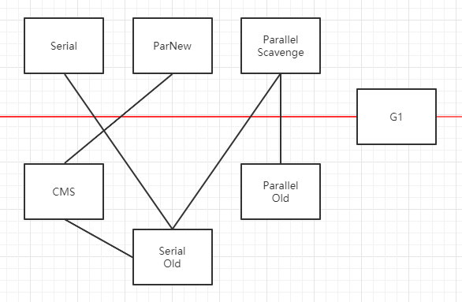

**Serial 收集器**

-   有新生代收集器，也有老年代的
-   单线程收集器，在进行垃圾收集工作的时候必须暂停其他所有的工作线程，直到它收集结束。
-   新生代采用复制算法，老年代采用标记-整理算法
-   客户端模式下默认的新生代收集器

**ParNew 收集器**

-    Serial 收集器的多线程版本
-   激活 CMS 后的默认新生代收集器

**Parallel Scavenge 收集器**

-   新生代收集器， JDK1.8 默认收集器
-   标记-复制算法
-   并行收集的多线程收集器
-   用来控制吞吐量的收集器，吞吐量就是 CPU 中用于运行用户代码的时间与 CPU 总消耗时间的比值

**CMS 收集器**

-   CMS（Concurrent Mark Sweep）收集器是一种以获取最短回收停顿时间为目标的收集器。它非常符合在注重用户体验的应用上使用。
-   HotSpot 虚拟机第一款真正意义上的并发收集器，第一次实现了让垃圾收集线程与用户线程（基本上）同时工作。

**G1 收集器**

面向服务器的垃圾收集器,主要针对配备多颗处理器及大容量内存的机器，以极高概率满足 GC 停顿时间要求的同时,还具备高吞吐量性能特征

 可以不需要其他收集器配合就能独立管理整个 GC 堆，但是还是保留了分代的概念

从整体来看是基于“标记整理”算法实现的收集器；从局部上来看是基于“复制”算法实现的

## LeetCode

#### 674. 最长连续递增序列

(https://leetcode-cn.com/problems/longest-continuous-increasing-subsequence/)

难度：**简单**

给定一个未经排序的整数数组，找到最长且 **连续递增的子序列**，并返回该序列的长度。

**连续递增的子序列** 可以由两个下标 `l` 和 `r`（`l < r`）确定，如果对于每个 `l <= i < r`，都有 `nums[i] < nums[i + 1]` ，那么子序列 `[nums[l], nums[l + 1], ..., nums[r - 1], nums[r]]` 就是连续递增子序列。

**示例 1：**

```
输入：nums = [1,3,5,4,7]
输出：3
解释：最长连续递增序列是 [1,3,5], 长度为3。
尽管 [1,3,5,7] 也是升序的子序列, 但它不是连续的，因为 5 和 7 在原数组里被 4 隔开。 
```

**示例 2：**

```
输入：nums = [2,2,2,2,2]
输出：1
解释：最长连续递增序列是 [2], 长度为1。
```

#### 题解

```c
class Solution {
public:
    int findLengthOfLCIS(vector<int>& nums) {
        // 如果数组中只有一个元素，返回1;如果是空数组，后面的代码会判定
        if(nums.size() == 1){
            return 1;
        }
        int max = 0;
        int curMax = 1;
        int len = nums.size();
        for(int i=1; i<len; i++){
            if(nums[i] > nums[i-1]){
                curMax++;
            }
            else{
                curMax = 1;
            }
            if(curMax > max){
                max = curMax;
            }
        }
        return max;
    }
};
```


# 2021-01-23

## Git命令

`git checkout HEAD~步长`：默认把头指针往前移动一次，指定数字就是往前移动 N 次

`git branch -f main HEAD~3`：强制移动 main 分支

`git add `：添加文件到暂存区，后接文件名或者文件夹名

`git status`： 查看在上次提交之后是否有对文件进行再次修改

`git diff` ：比较文件在暂存区和工作区的差异。

主要的应用场景。

-   尚未缓存的改动：**git diff**
-   查看已缓存的改动： **git diff --cached**
-   查看已缓存的与未缓存的所有改动：**git diff HEAD**
-   显示摘要而非整个 diff：**git diff --stat**

git status 显示你上次提交更新后的更改或者写入缓存的改动， 而 git diff 一行一行地显示这些改动具体是啥。

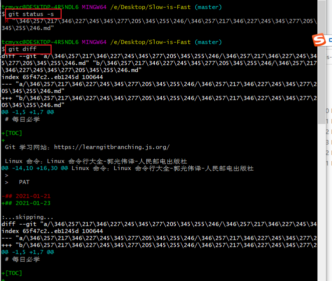

## Linux命令

#### mv：移除和重命名文件

-   重命名：`mv file1 file2`
-   移动文件到某个文件夹：`mv 多个文件名 目标目录`
-   将目录1移到目录2下：`mv dir1 dir2`

#### rm：删除文件

-r 递归删除；-f 强制删除；-v(--verbose，信息，冗长的)删除时显示消息行信息；-i（interactive） 提示用户确认

也可以跟多个文件名用来同时删除多个

#### ln：创建链接

硬链接：不能引用目录，不能引用其他磁盘分区的文件

符号链接：一个特殊类型的文件，该文件包含指向引用文件（或者目录）的文本指针，删除符号链接不会删除原文件，但是删除原文件会产生一个坏的链接（很像Windows 的快捷方式）

`ln 文件名 链接名`：创建硬链接，加 -s 就是创建符号链接，即`ln -s 文件名 链接名`

#### type：显示命令类型

`type 命令`：查看命令类型

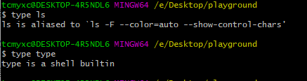

#### which：显示可执行程序的位置

`which 命令`：不适用于内置命令和命令别名

## LeetCode

#### 1319. 连通网络的操作次数

(https://leetcode-cn.com/problems/number-of-operations-to-make-network-connected/)

难度：中等

用以太网线缆将 `n` 台计算机连接成一个网络，计算机的编号从 `0` 到 `n-1`。线缆用 `connections` 表示，其中 `connections[i] = [a, b]` 连接了计算机 `a` 和 `b`。

网络中的任何一台计算机都可以通过网络直接或者间接访问同一个网络中其他任意一台计算机。

给你这个计算机网络的初始布线 `connections`，你可以拔开任意两台直连计算机之间的线缆，并用它连接一对未直连的计算机。请你计算并返回使所有计算机都连通所需的最少操作次数。如果不可能，则返回 -1 。 

**示例 1：**

****

```
输入：n = 4, connections = [[0,1],[0,2],[1,2]]
输出：1
解释：拔下计算机 1 和 2 之间的线缆，并将它插到计算机 1 和 3 上。
```

**示例 2：**

****

```
输入：n = 6, connections = [[0,1],[0,2],[0,3],[1,2],[1,3]]
输出：2
```

**示例 3：**

```
输入：n = 6, connections = [[0,1],[0,2],[0,3],[1,2]]
输出：-1
解释：线缆数量不足。
```

**示例 4：**

```
输入：n = 5, connections = [[0,1],[0,2],[3,4],[2,3]]
输出：0
```


#### 题解

```c
class Solution {
    vector<int> visited;
    vector<vector<int> > edge;
public:
    void dfs(int v, const vector<vector<int>>& egde){
        if(visited[v] == 0){
            visited[v] = 1;// 标记为已访问
        }
        // 对于 v 的每个邻接点，如果未被访问，dfs
        for(int i=0; i<edge[v].size(); i++){
            int u = edge[v][i];
            if(visited[u] == 0){
                dfs(u, edge);
            }
        }
    }
    int makeConnected(int n, vector<vector<int>>& connections) {
        // 首先检查有没有 n-1 条边，没有的话直接返回
        if(connections.size() < n - 1){
            return -1;
        }

        // 初始化边，使用邻接表
        edge.resize(n);
        for(int i=0; i<connections.size(); i++){
            // 注意这里是无向图，每条边 (u, v) 要出现在两个表中
            // 如果是有向图，每条边只出现在一个表中
            edge[connections[i][0]].push_back(connections[i][1]);
            edge[connections[i][1]].push_back(connections[i][0]);
        }

        // 默认每个节点都没有访问
        visited.resize(n);
        fill(visited.begin(), visited.end(), 0);
        int res = 0;
        for(int i=0; i<n; i++){
            if(visited[i] == 0){
                dfs(i, edge);
                // 每次DFS都能形成一个连通分量
                res++;// 连通分量加一
            }
        }

        return res - 1;// 返回的是连通分量个数减一
    }
};
```


# 2021-01-17

## Git 命令

-   提交：`git commit` 
-   创建分支：`git branch 新分支名` 
-   切换分支：`git checkout 分支名` 
-   创建新分支的同时切换到新分支：`git checkout -b 新分支名` 
-   合并分支：`git merge 要合并的分支名`
-   复制当前分支到目标分支下方：`git rebase 目标分支`


**git merge**

合并分支：

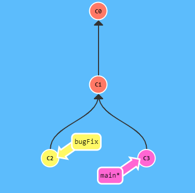

```bash
git merge bugFix
```

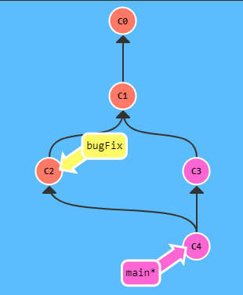

问题来了，现在 main 分支有两个父节点，这是有问题的，需要把指向 bugFix 的指针也指向 C4

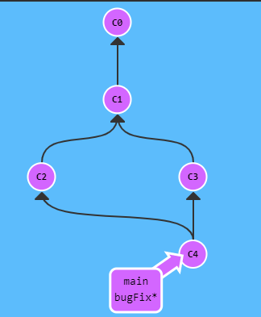

```bash
git checkout bugFix
git merge main // 合并 main 分支，但是因为 bugFix 是 main 的父节点，所以其实什么也没干，只是移动了一下指针
```


**git rebase**

复制当前分支到目标分支：`git rebase 目标分支`

Rebase 实际上就是取出一系列的提交记录，“复制”它们，然后在另外一个地方逐个的放下去。

Rebase 的优势就是可以创造更线性的提交历史

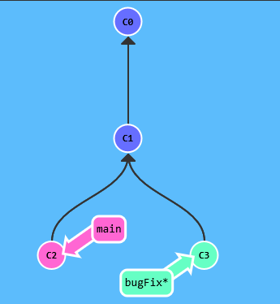

目标：

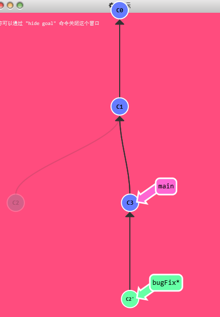


将 bugFix 分支直接移动到 main 分支上

-   在bugFix 分支上执行`git rebase main`

然后

```bash
git checkout main
git rebase bugFix
```

## Linux 命令

#### **ls**：列出目录内容

#### **file**：确定文件类型

-   `file 文件名`

#### **less**：查看文件内容

-   `less 文件名`

#### **mkdir**：创建目录

-   `mkdir 目录名`
-   可以同时创建多个目录

#### **cp**：复制文件和目录

-   复制目录时需要加 -r
-   -u（--update）：更新
-   -i (--interactive 交互的)：如果有同名文件，提示用户进行确认

-   ```bash
    cp item1 item2 // 复制文件或者目录 1 到 2
    cp 多个文件或目录 目标目录 // 复制多个文件或者目录到目标目录，目标目录必须存在
    ```

ls 命令

-   可以指定目录，也可以指定多个目录
-   常用选项：
    -   -a：显示全部文件
    -   -l：使用长格式查看结果
    -   -r：反序（默认升序）
    -   -t：按修改时间排序
    -   -S：按文件大小排序


常见目录：

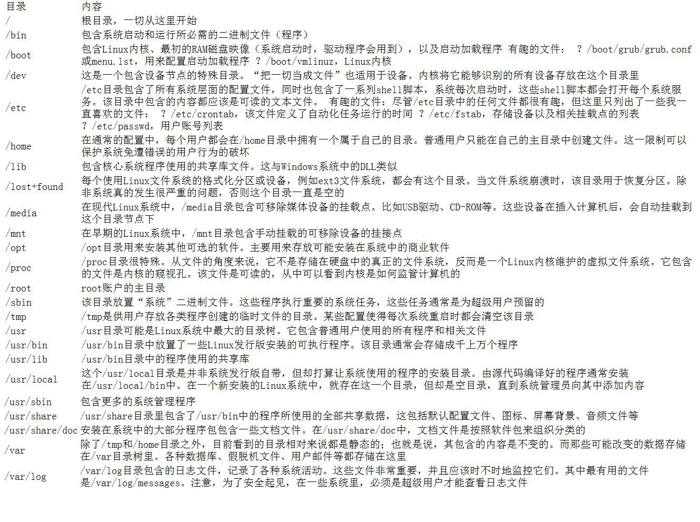


通配符：

`*`：匹配任意多个字符

`?`：匹配任意一个字符

`[字符集]`：匹配任意一个属于字符集中的字符

`[! 字符集]`：匹配任意一个不属于字符集中的字符

`[[: class: ]]`：匹配任意一个属于指定字符类中的字符

## MySQL

[177. 第N高的薪水](https://leetcode-cn.com/problems/nth-highest-salary/)

编写一个 SQL 查询，获取 `Employee` 表中第 *n* 高的薪水（Salary）。

```
+----+--------+
| Id | Salary |
+----+--------+
| 1  | 100    |
| 2  | 200    |
| 3  | 300    |
+----+--------+
```

例如上述 `Employee` 表，*n = 2* 时，应返回第二高的薪水 `200`。如果不存在第 *n* 高的薪水，那么查询应返回 `null`。

```
+------------------------+
| getNthHighestSalary(2) |
+------------------------+
| 200                    |
+------------------------+
```


答案：

```mysql
CREATE FUNCTION getNthHighestSalary(N INT) RETURNS INT
BEGIN
  SET N := N-1;# 因为 limit 子句中不能用 N-1，所以提前在这里减掉
  RETURN (
      # Write your MySQL query statement below.
      
          select distinct Salary
          from Employee
          order by Salary desc
          limit N, 1
  );
END
```


## LeetCode

#### 1232. 缀点成线

(https://leetcode-cn.com/problems/check-if-it-is-a-straight-line/)

在一个 XY 坐标系中有一些点，我们用数组 `coordinates` 来分别记录它们的坐标，其中 `coordinates[i] = [x, y]` 表示横坐标为 `x`、纵坐标为 `y` 的点。

请你来判断，这些点是否在该坐标系中属于同一条直线上，是则返回 `true`，否则请返回 `false`。

 

**示例 1：**


```
输入：coordinates = [[1,2],[2,3],[3,4],[4,5],[5,6],[6,7]]
输出：true
```

**示例 2：**

****

```
输入：coordinates = [[1,1],[2,2],[3,4],[4,5],[5,6],[7,7]]
输出：false
```


#### 解答

求斜率可能遇到分母为 0 的情况，所以不用 $\ y=kx+b $ 的形式，用$\ \frac{y-y1}{x-x1} = \frac{y-y2}{x-x2} $   的变体 $\ (y-y1)(x-x2)=(y-y2)(x-x1) $

```java
class Solution {
    public boolean checkStraightLine(int[][] coordinates) {
        if(coordinates.length <= 2){
            return true;
        }

        int x1 = coordinates[0][0];
        int y1 = coordinates[0][1];

        int x2 = coordinates[1][0];
        int y2 = coordinates[1][1];

        for(int i=2; i<coordinates.length; i++){
            int x = coordinates[i][0];
            int y = coordinates[i][1];
            if((y-y1)*(x-x2) != (y-y2)*(x-x1)){
                return false;
            }
        }
        return true;
    }
}
```


## PAT1003

1003 Emergency (25分)

>   https://pintia.cn/problem-sets/994805342720868352/problems/994805523835109376

As an emergency rescue team leader of a city, you are given a special map of your country. The map shows several scattered cities connected by some roads. Amount of rescue teams in each city and the length of each road between any pair of cities are marked on the map. When there is an emergency call to you from some other city, your job is to lead your men to the place as quickly as possible, and at the mean time, call up as many hands on the way as possible.

Input Specification:

Each input file contains one test case. For each test case, the first line contains 4 positive integers: *N* (≤500) - the number of cities (and the cities are numbered from 0 to *N*−1), *M* - the number of roads, *C*1 and *C*2 - the cities that you are currently in and that you must save, respectively. The next line contains *N* integers, where the *i*-th integer is the number of rescue teams in the *i*-th city. Then *M* lines follow, each describes a road with three integers *c*1, *c*2 and *L*, which are the pair of cities connected by a road and the length of that road, respectively. It is guaranteed that there exists at least one path from *C*1 to *C*2.

Output Specification:

For each test case, print in one line two numbers: the number of different shortest paths between *C*1 and *C*2, and the maximum amount of rescue teams you can possibly gather. All the numbers in a line must be separated by exactly one space, and there is no extra space allowed at the end of a line.

Sample Input:

```in
5 6 0 2
1 2 1 5 3
0 1 1
0 2 2
0 3 1
1 2 1
2 4 1
3 4 1
```

Sample Output:

```out
2 4
```


#### 题解


```c
/**
	PAT1003
*/

#include <iostream>
#include <vector>
#include <algorithm>
using namespace std;
const int MAXV = 500;
const int INF = 1e9;
int dis[MAXV][MAXV];
int d[MAXV];
vector<int> resuce;
vector<int> sumOfResuce;
int path[MAXV] = {0};
bool visited[MAXV] = {false};
//int sumOfResuce = 0;
void floyd(int n);
void backtrace(int source, int target, vector<int>& path, vector<vector<int> >& res, int n, vector<int>& resuce);
void dijkstra(int source, int n);
int main(int argc, char** argv){
	fill(dis[0], dis[0]+MAXV*MAXV, INF);// 初始化距离 
	fill(d, d+MAXV, INF); 
	int n, m, source, target;
	scanf("%d %d %d %d", &n, &m, &source, &target);
	// 每个城市有多少救援车 
	resuce.resize(n);
	sumOfResuce.resize(n);
	for(int i=0; i<n; i++){
		int tmp;
		scanf("%d", &tmp);
		resuce[i] = tmp;
	}
	// 记录每个城市之间的距离 
	for(int i=0; i<m; i++){
		int x, y, tmp;
		scanf("%d %d %d", &x, &y, &tmp);
		dis[x][y] = dis[y][x] = tmp;
		 
	}
	// 使用 dijkstra 算法
	d[source] = 0;
	dijkstra(source, n);
	printf("%d %d\n", path[target], sumOfResuce[target]);
	//floyd(n);
//	vector<int> path;
//	vector<vector<int> > res;
//	path.push_back(source);
	//backtrace(source, target, path, res, n, resuce);//回溯法找所有的路径
//	int minDis = dis[source][target];
//	int sumOfResuce = resuce[target];
//	//printf("%d\n", minDis); 
//	for(int i=0; i<n; i++){
//		if(i != target && dis[i][target] <= minDis){
//			sumOfResuce += resuce[i];
//		}
//	}
	//printf("%d %d\n", res.size(), sumOfResuce); 
	return 0;
}

//void floyd(int n){
//	for(int k=0; k<n; k++){
//		for(int i=0; i<n; i++){
//			for(int j=0; j<n; j++){
//				if(dis[i][k] + dis[k][j] < dis[i][j]){
//					dis[i][j] = dis[i][k] + dis[k][j];
//				}
//			}
//		}
//	}
//}

//void backtrace(int source, int target, vector<int>& path, vector<vector<int> >& res, int n, vector<int>& resuce){
//	if(source == target){
//		vector<int> tmp = path;
//		int sumResuce = 0;
//		for(int i=0; i<tmp.size(); i++){
//			printf("->%d", tmp[i]);
//			sumResuce += resuce[tmp[i]];
//		}
//		printf("\n");
//		sumOfResuce = sumResuce > sumOfResuce ? sumResuce : sumOfResuce;
//		res.push_back(tmp);
//		return;
//	}
//	visited[source] = true;
//	for(int i=0; i<n; i++){
//		// 邻接的点没有被访问过 
//		if(dis[source][i] != INF && visited[i] == false){
//			visited[i] = true;
//			// 做选择 
//			path.push_back(i);
//			// 去下一层
//			backtrace(i, target, path, res, n, resuce);
//			// 撤销选择
//			path.pop_back(); 
//			visited[i] = false;
//		}
//	}
//}

void dijkstra(int source, int n){
	// 从所有节点中找一个没有被访问过的，离起点距离最小的 
	sumOfResuce[source] = resuce[source];
	path[source] = 1;
	for(int i=0; i<n; i++){// 这个过程需要循环 N 次 
		int u = -1, minLen = INF;
		// 找未访问过的里面找当前最小的 
		for(int j=0; j<n; j++){
			if(visited[j] == false && d[j] < minLen){
				u = j;
				minLen = d[j];
			}
		}
		if(u == -1){
			return;
		}
		// 标记该点为已访问
		visited[u] = true;
		// 拿着这个点更新邻接的点 
		for(int v=0; v<n; v++){
			if(dis[u][v] != INF && visited[v] == false){
				if(d[u] + dis[u][v] < d[v]){
					d[v] = d[u] + dis[u][v];
					path[v] = path[u];
					sumOfResuce[v] = sumOfResuce[u] + resuce[v];// 救护车数量为前面的加上本地的 
				}
				else if(d[u] + dis[u][v] == d[v]){
					path[v] = path[u] + path[v];
					if(sumOfResuce[u] + resuce[v] > sumOfResuce[v]){
						sumOfResuce[v] = sumOfResuce[u] + resuce[v];
					}
				}
			}
		} 	
	} 
}
```


# 2021-01-16

## Linux命令

-   date 查看时间
-   cal 查看月历
-   df 查看磁盘可用空间
-   free 查看可用内存
-   pwd 查看当前路径
-   cd 进入目录
-   ls 查看目录