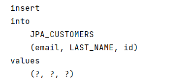
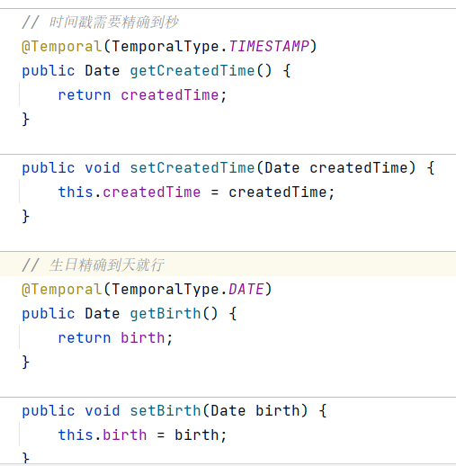
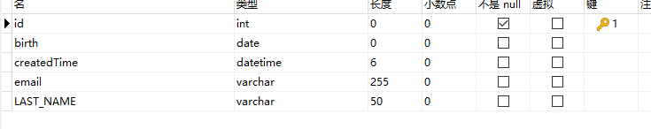
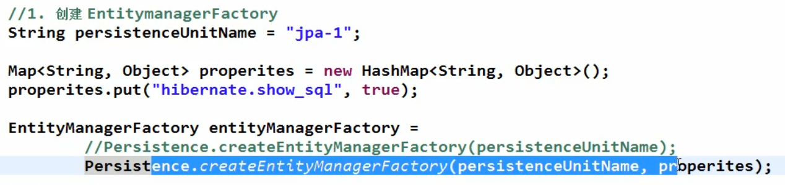

# JPA学习笔记

## 1、定义

JPA是Java Persistence API的简称，中文名Java持久层API，是JDK 5.0注解或XML描述对象－关系表的映射关系，并将运行期的实体[对象持久化](https://baike.baidu.com/item/对象持久化/7316192)到数据库中。 

Sun引入新的JPA ORM规范出于两个原因：其一，简化现有Java EE和Java SE应用开发工作；其二，Sun希望整合ORM技术，实现天下归一。

JPA包括以下3方面的技术：

**ORM映射元数据**

JPA支持XML和[JDK](https://baike.baidu.com/item/JDK)5.0注解两种元数据的形式，元数据描述对象和表之间的映射关系，框架据此将实体[对象持久化](https://baike.baidu.com/item/对象持久化)到数据库表中；

**API**

用来操作实体对象，执行CRUD操作，框架在后台替代我们完成所有的事情，开发者从繁琐的JDBC和SQL代码中解脱出来。

**查询语言**

这是持久化操作中很重要的一个方面，通过[面向对象](https://baike.baidu.com/item/面向对象)而非面向数据库的查询语言查询数据，避免程序的SQL语句紧密耦合。

JPA是需要Provider来实现其功能的，Hibernate就是JPA Provider中很强的一个，应该说无人能出其右。从功能上来说，JPA就是Hibernate功能的一个子集。

> JPA 是规范

## 2、HelloWorld

（1）创建 persistence.xml, 在这个文件中配置持久化单元

JPA 规范要求在类路径的 META-INF 目录下放置persistence.xml

```xml
<build>
    <!--默认打包资源文件-->
    <resources>
        <resource>
            <directory>src/main/java</directory>
            <includes>
                <include>**/*.xml</include>
            </includes>
        </resource>
    </resources>
</build>
```


- 需要指定跟哪个数据库进行交互;

- 需要指定 JPA 使用哪个持久化的框架以及配置该框架的基本属性

```xml
<?xml version="1.0" encoding="UTF-8"?>
<persistence xmlns="http://java.sun.com/xml/ns/persistence" version="2.0">
    <!--需要配置persistence-unit节点
    持久化单元:
        name:持久化单元名称
        transaction-type:事务管理的方式
                JTA: 分布式事先管理
                RESOURCE_LOCAL:本地事务管理
    -->
    <persistence-unit name="myJPA" transaction-type="RESOURCE_LOCAL">
        <!--        jpa的实现方式-->
        <provider>org.hibernate.jpa.HibernatePersistenceProvider</provider>

        <!-- 添加持久化类 -->
        <class>com.tcmyxc.helloworld.Customer</class>

        <properties>
            <!--        数据库信息
              用户名, javax.persistence.jdbc.user
              密码, javax.persistence.jdbc.password
              驱动, javax.persistence.jdbc.driver
              数据库地址 javax.persistence.jdbc.url
      -->
            <property name="javax.persistence.jdbc.user" value="root"/>
            <property name="javax.persistence.jdbc.password" value="123456"/>
            <property name="javax.persistence.jdbc.driver" value="com.mysql.cj.jdbc.Driver"/>
            <!--            三个/  ///表示本地路径,端口为3306 jdbc:mysql://localhost:3306/test?serverTimezone=UTC-->
            <property name="javax.persistence.jdbc.url" value="jdbc:mysql:///jpa_test?serverTimezone=UTC"/>
            <!--        可选配置:配置jpa实现方的配置信息
                    显示sql执行语句
                    自动创建数据库表  hibernate.hbm2ddl.auto
                                        create,程序运行时创建数据库表(如果有表,先删除表再创建表)
                                        update,程序运行时创建表(如果表存在,则不会创建)
                                        none 不会创建表
            -->
            <property name="hibernate.show_sql" value="true"/>
            <property name="hibernate.hbm2ddl.auto" value="update"/>
            <property name="hibernate.format_sql" value="true"/>

        </properties>

    </persistence-unit>
</persistence>
```


（2）创建实体类, 使用 annotation 来描述实体类跟数据库表之间的映射关系.

```java
/**
 * 持久化类
 */
@Table(name = "JPA_CUSTOMERS")
@Entity
public class Customer {

    private Integer id;
    private String lastName;
    private String email;

    @GeneratedValue(strategy = GenerationType.AUTO)
    @Id
    public Integer getId() {
        return id;
    }

    public void setId(Integer id) {
        this.id = id;
    }

    @Column(name = "LAST_NAME")
    public String getLastName() {
        return lastName;
    }

    public void setLastName(String lastName) {
        this.lastName = lastName;
    }

    public String getEmail() {
        return email;
    }

    public void setEmail(String email) {
        this.email = email;
    }
}
```


（3）使用 JPA API 完成数据增加、删除、修改和查询操作

- 创建 EntityManagerFactory (对应 Hibernate 中的 SessionFactory);

- 创建 EntityManager (对应 Hibernate 中的Session);

```java
public static void main(String[] args) {

    // 1、创建 EntityManagerFactory
    String persistenceUnitName = "myJPA";
    EntityManagerFactory entityManagerFactory = Persistence.createEntityManagerFactory(persistenceUnitName);

    // 2、创建 EntityManager
    EntityManager entityManager = entityManagerFactory.createEntityManager();

    // 3、开启事务
    EntityTransaction transaction = entityManager.getTransaction();
    transaction.begin();

    // 4、CRUD 操作
    Customer customer = new Customer();
    customer.setLastName("xwx");
    customer.setEmail("1282494272@qq.com");

    entityManager.persist(customer);

    // 5、提交事务
    transaction.commit();

    // 6、关闭 EntityManager
    entityManager.close();

    // 7、关闭 EntityManagerFactory
    entityManagerFactory.close();
}
```

运行截图：




## 3、注解

### @Entity

@Entity 标注用于实体类声明语句之前，指出该Java 类为实体类，将映射到指定的数据库表。


### @Table

当实体类与其映射的数据库表名不同名时需要使用 @Table 标注说明，该标注与 @Entity 标注并列使用，置于实体类声明语句之前，可写于单独语句行，也可与声明语句同行。

@Table 标注的常用选项是 name，用于指明数据库的表名

@Table标注还有一个两个选项 catalog 和 schema 用于设置表所属的数据库目录或模式，通常为数据库名。

uniqueConstraints 选项用于设置约束条件，通常不须设置。


### @Id

@Id 标注用于声明一个实体类的属性映射为数据库的主键列。该属性通常置于属性声明语句之前，可与声明语句同行，也可写在单独行上。

@Id标注也可置于属性的getter方法之前。


### @GeneratedValue

@GeneratedValue  用于标注主键的生成策略，通过 strategy 属性指定。默认情况下，JPA 自动选择一个最适合底层数据库的主键生成策略：SqlServer 对应 identity，MySQL 对应 auto increment。

在 javax.persistence.GenerationType 中定义了以下几种可供选择的策略：

- IDENTITY：采用数据库 ID自增长的方式来自增主键字段，Oracle 不支持这种方式；

- **AUTO**： JPA自动选择合适的策略，是默认选项；

- SEQUENCE：通过序列产生主键，通过 @SequenceGenerator 注解指定序列名，MySql 不支持这种方式

- TABLE：通过表产生主键，框架借由表模拟序列产生主键，使用该策略可以使应用更易于数据库移植。


### @Basic

@Basic 表示一个简单的属性到数据库表的字段的映射,对于没有任何标注的 getXxxx() 方法,默认即为@Basic

fetch: 表示该属性的读取策略,有 EAGER 和 LAZY 两种,分别表示主支抓取和延迟加载,默认为 EAGER.

optional:表示该属性是否允许为null, 默认为true


### @Column

当实体的属性与其映射的数据库表的列不同名时需要使用@Column 标注说明，该属性通常置于实体的属性声明语句之前，还可与 @Id 标注一起使用。

@Column 标注的常用属性是 name，用于设置映射数据库表的列名。此外，该标注还包含其它多个属性，如：unique 、nullable、length 等。

@Column 标注的 columnDefinition 属性: 表示该字段在数据库中的实际类型.通常 ORM 框架可以根据属性类型自动判断数据库中字段的类型,但是对于Date类型仍无法确定数据库中字段类型究竟是DATE,TIME还是TIMESTAMP.此外,String的默认映射类型为VARCHAR, 如果要将 String 类型映射到特定数据库的 BLOB 或TEXT 字段类型.

@Column标注也可置于属性的getter方法之前


### @Transient

表示该属性并非一个到数据库表的字段的映射,ORM框架将忽略该属性.

如果一个属性并非数据库表的字段映射,就务必将其标示为@Transient,否则,ORM框架默认其注解为@Basic


### @Temporal

在核心的 Java API 中并没有定义 Date 类型的精度(temporal precision).  而在数据库中,表示 Date 类型的数据有 DATE, TIME, 和 TIMESTAMP 三种精度(即单纯的日期,时间,或者两者 兼备). 在进行属性映射时可使用@Temporal注解来调整精度



对应数据库：



```mysql
show create table jpa_customers;

CREATE TABLE `jpa_customers` (
  `id` int NOT NULL,
  `birth` date DEFAULT NULL,
  `createdTime` datetime(6) DEFAULT NULL,
  `email` varchar(255) DEFAULT NULL,
  `LAST_NAME` varchar(50) DEFAULT NULL,
  PRIMARY KEY (`id`)
) ENGINE=InnoDB DEFAULT CHARSET=utf8
```

## 4、JPA API

### Persistence

用于获取 EntityManagerFactory 实例。该类包含一个名为 createEntityManagerFactory 的 静态方法 。

createEntityManagerFactory 方法有如下两个重载版本。

- 带有一个参数的方法以 JPA 配置文件 persistence.xml 中的持久化单元名为参数
- 带有两个参数的方法：前一个参数含义相同，后一个参数 Map类型，用于设置 JPA 的相关属性，这时将忽略其它地方设置的属性。Map 对象的属性名必须是 JPA 实现库提供商的名字空间约定的属性名。



### EntityManagerFactory

EntityManagerFactory 接口主要用来创建 EntityManager 实例。该接口约定了如下4个方法：

- createEntityManager()：用于创建实体管理器对象实例。

- createEntityManager(Map map)：用于创建实体管理器对象实例的重载方法，Map 参数用于提供 EntityManager 的属性。

- isOpen()：检查 EntityManagerFactory 是否处于打开状态。实体管理器工厂创建后一直处于打开状态，除非调用close()方法将其关闭。

- close()：关闭 EntityManagerFactory 。 EntityManagerFactory 关闭后将释放所有资源，isOpen()方法测试将返回 false，其它方法将不能调用，否则将导致IllegalStateException异常。


### EntityManager 

是完成持久化操作的核心对象。实体作为普通 Java 对象，只有在调用 EntityManager 将其持久化后才会变成持久化对象。EntityManager 对象在一组实体类与底层数据源之间进行 O/R 映射的管理。它可以用来管理和更新 Entity Bean, 根椐主键查找 Entity Bean, 还可以通过JPQL语句查询实体。

 实体的状态:

新建状态:   新创建的对象，尚未拥有持久性主键。

持久化状态：已经拥有持久性主键并和持久化建立了上下文环境

游离状态：拥有持久化主键，但是没有与持久化建立上下文环境

删除状态:  拥有持久化主键，已经和持久化建立上下文环境，但是从数据库中删除。

```tex
// 返回指定的 OID 对应的实体类对象
find (Class<T> entityClass,Object primaryKey)


getReference (Class<T> entityClass,Object primaryKey)

// 用于将新创建的 Entity 纳入到 EntityManager 的管理
persist (Object entity)

remove (Object entity)

// 用于处理 Entity 的同步。即数据库的插入和更新操作
merge (T entity)

// 同步持久上下文环境
flush ()

// 设置持久上下文环境的Flush模式，自动更新或者提交事务才刷新
setFlushMode (FlushModeType flushMode)

// 获取持久上下文环境的Flush模式
getFlushMode ()
```

### EntityTransaction

`begin(), commit(), rollback()` 等


## 5、映射关系

### 单向多对一

例如：多个订单属于一个客户

只需从n的一端可以访问1的一端

1、订单实体类

```java
@Table(name = "jpa_order")
@Entity
public class Order {

    private Integer id;
    private String orderName;
    private Customer customer;

    public Order() {
    }

    @GeneratedValue
    @Id
    public Integer getId() {
        return id;
    }

    public void setId(Integer id) {
        this.id = id;
    }

    @Column(name = "order_name")
    public String getOrderName() {
        return orderName;
    }

    public void setOrderName(String orderName) {
        this.orderName = orderName;
    }

    // 映射单向多对一关系,，多个订单属于一个客户
    @JoinColumn(name = "customer_id")// 映射外键，同时声明列名
    @ManyToOne// 这里可以设置懒加载
    public Customer getCustomer() {
        return customer;
    }

    public void setCustomer(Customer customer) {
        this.customer = customer;
    }

    @Override
    public String toString() {
        return "Order{" +
                "id=" + id +
                ", orderName='" + orderName + '\'' +
                ", customer=" + customer +
                '}';
    }
}
```

2、测试

```java
@Test
public void testManyToOne(){

    Customer customer = new Customer();
    customer.setLastName("小华");
    customer.setEmail("ff@163.com");
    customer.setCreatedTime(new Date());
    customer.setBirth(new Date());

    Order order1 = new Order();
    order1.setOrderName("O-FF-1");

    Order order2 = new Order();
    order2.setOrderName("O-FF-2");

    Order order3 = new Order();
    order3.setOrderName("O-FF-3");

    // 设置关联关系
    order1.setCustomer(customer);
    order2.setCustomer(customer);
    order3.setCustomer(customer);

    // 保存
    entityManager.persist(customer);
    entityManager.persist(order1);
    entityManager.persist(order2);
    entityManager.persist(order3);
}
```

如果先保存订单，实际上会把订单的`customer_id`设为`null`，之后再进行更新操作，开销变大了

【建议】

先保存 1 的一端，再保存多的一端

删除的时候因为有外键关联，不能直接删除 1 的一端


### 单向一对多

一个客户有多个订单

1、修改订单类，去掉 Customer 属性

```java
@Table(name = "jpa_order")
@Entity
public class Order {

    private Integer id;
    private String orderName;

    public Order() {
    }

    @GeneratedValue
    @Id
    public Integer getId() {
        return id;
    }

    public void setId(Integer id) {
        this.id = id;
    }

    @Column(name = "order_name")
    public String getOrderName() {
        return orderName;
    }

    public void setOrderName(String orderName) {
        this.orderName = orderName;
    }
    
}
```


2、在用户里添加订单属性（是个集合或者列表）

```java
private Set<Order> orders = new HashSet<>();

// 映射单向一对多
@JoinColumn(name = "customer_id")
@OneToMany// 默认懒加载
public Set<Order> getOrders() {
    return orders;
}

public void setOrders(Set<Order> orders) {
    this.orders = orders;
}
```

3、测试

```java
@Test
public void testOneToMany(){

    Customer customer = new Customer();
    customer.setLastName("小华");
    customer.setEmail("gg@163.com");
    customer.setCreatedTime(new Date());
    customer.setBirth(new Date());

    Order order1 = new Order();
    order1.setOrderName("O-GG-1");

    Order order2 = new Order();
    order2.setOrderName("O-GG-2");

    Order order3 = new Order();
    order3.setOrderName("O-GG-3");
    customer.getOrders().add(order1);
    customer.getOrders().add(order2);
    customer.getOrders().add(order3);


    // 保存
    entityManager.persist(customer);
    entityManager.persist(order1);
    entityManager.persist(order2);
    entityManager.persist(order3);
}
```

【注意】：单向一对多保存时一定会有更新语句发生，与保存顺序无关。因为多的一端再插入时不会同时插入外键列

删除一的一端，会把关联的多的一端外键置空，然后删除，可以在`@OneToMany`设置级联删除

### 双向多对一

订单属性里面有客户，客户里面有订单

```java
public class Customer {

    private Integer id;
    private String lastName;
    private String email;
    private Date createdTime;
    private Date birth;
    private Set<Order> orders = new HashSet<>();
    
    
    @JoinColumn(name = "customer_id")
    @OneToMany
    public Set<Order> getOrders() {
        return orders;
    }
}
```

```java
public class Order {

    private Integer id;
    private String orderName;
    private Customer customer;
    
    @JoinColumn(name = "customer_id")// 映射外键
    @ManyToOne
    public Customer getCustomer() {
        return customer;
    }
}
```

映射的外键名要一样


```java
@Test
public void testManyToOne(){

    Customer customer = new Customer();
    customer.setLastName("小华");
    customer.setEmail("ww@163.com");
    customer.setCreatedTime(new Date());
    customer.setBirth(new Date());

    Order order1 = new Order();
    order1.setOrderName("O-ww-1");

    Order order2 = new Order();
    order2.setOrderName("O-ww-2");


    // 设置关联关系
    order1.setCustomer(customer);
    order2.setCustomer(customer);

    customer.getOrders().add(order1);
    customer.getOrders().add(order2);

    // 保存
    entityManager.persist(customer);// n条update，写后面就是 2n 条
    entityManager.persist(order1);
    entityManager.persist(order2);
}
```

如果先保存多的一端，会有多余的更新语句

让多的一方来维护关联关系，在 @OneToMany 中设置 mapperBy（值为多的一方的 customer 属性）

【注意】

如果在 1 的一端 @OneToMany 中使用 mapperBy，就不能再使用 @JoinColumn

### 双向一对一

基于外键的 1-1 关联关系：在双向的一对一关联中，需要在关系被维护端(inverse side)中的 @OneToOne 注释中指定 mappedBy，以指定是这一关联中的被维护端。同时需要在关系维护端(owner side)建立外键列指向关系被维护端的主键列。

设计：一个部门只能有一个经理，一个经理也只能管一个部门

```java
@Table(name = "jpa_manager")
@Entity
public class Manager {

    private Integer id;
    private String mgrName;
    private Department dept;

    @OneToOne(mappedBy = "mgr")// 不维护关联关系（等于说是我这张表里面没有这个字段，虽然属性里面有），需要设置 mappedBy
    public Department getDept() {
        return dept;
    }

    ...
}

```


```java
@Table(name = "jpa_department")
@Entity
public class Department {
    private Integer id;
    private String deptName;
    private Manager mgr;

    @OneToOne // 映射一对一关联关系，维护关联关系
    @JoinColumn(name = "mgr_id", unique = true)// 一对一需要添加 unique=true
    public Manager getMgr() {
        return mgr;
    }
    
    ...
}

```


测试：

```java
@Test
public void testOneToOne(){
    Manager manager = new Manager();
    manager.setMgrName("M-1");

    Department department = new Department();
    department.setDeptName("D-1");

    // 设置关联关系
    manager.setDept(department);
    department.setMgr(manager);

    // 执行
    entityManager.persist(manager);// 先保存不维护关联关系的（即没有外键的一方）
    entityManager.persist(department);
}
```


测试查找：

```java
// 默认情况下，若获取维护关联关系的一方，则会通过左外连接获取其关联的对象
// 但是可以设置维护关联关系的一方的 @OneToOne 的 fetch 属性来修改加载策略来实现懒加载
@Test
public void testOneToOneFind() {
    Department dept = entityManager.find(Department.class, 1);
    System.out.println(dept.getDeptName());
    System.out.println(dept.getMgr().getClass().getName());
}
```

```tex
Hibernate: 
    select
        department0_.id as id1_1_0_,
        department0_.deptName as deptname2_1_0_,
        department0_.mgr_id as mgr_id3_1_0_,
        manager1_.id as id1_2_1_,
        manager1_.mgr_name as mgr_name2_2_1_ 
    from
        jpa_department department0_ 
    left outer join
        jpa_manager manager1_ 
            on department0_.mgr_id=manager1_.id 
    where
        department0_.id=?
D-1
com.tcmyxc.helloworld.Manager
```


【注意】：默认情况下，若获取不维护关联关系的一方，则也会通过左外连接获取其关联的对象，虽然可以改为懒加载，但是会多发 SQL 语句，得不偿失

### 双向多对多

在双向多对多关系中，我们必须指定一个关系维护端(owner side),可以通过 @ManyToMany 注释中指定 mappedBy 属性来标识其为关系维护端

```java
@Entity
@Table(name = "jpa_item")
public class Item {
    private Integer id;
    private String itemName;
    private Set<Category> categories = new HashSet<>();// 不写会报空指针，因为不能直接使用接口，接口变量必须引用实现了接口的类

    // 设置多对多的关系
    @ManyToMany
    // 设置中间表
    // 1、joinColumns 映射当前类
    // 2、inverseJoinColumns 映射关联的类
    @JoinTable(joinColumns = {
            @JoinColumn(name = "item_id", // 中间表的外键名
                    referencedColumnName = "id")// 外键指向当前表的那个字段
            },
            inverseJoinColumns = {
            @JoinColumn(name = "category_id",// 中间表的外键名
                    referencedColumnName = "id")
            }
    )
    public Set<Category> getCategories() {
        return categories;
    }
   ...
}
```


```java
@Entity
@Table(name = "jpa_category")
public class Category {
    private Integer id;
    private String categoryName;
    private Set<Item> items;

    @ManyToMany(mappedBy = "categories")
    public Set<Item> getItems() {
        return items;
    }

    ...
}
```


初始化表，可以发现建立了三张表

```tex
Hibernate: 
    
    create table jpa_category (
       id integer not null auto_increment,
        category_name varchar(255),
        primary key (id)
    ) engine=InnoDB
Hibernate: 
    
    create table jpa_item (
       id integer not null auto_increment,
        item_name varchar(255),
        primary key (id)
    ) engine=InnoDB
Hibernate: 
    
    create table jpa_item_jpa_category (
       item_id integer not null,
        category_id integer not null,
        primary key (item_id, category_id)
    ) engine=InnoDB
Hibernate: 
    
    alter table jpa_item_jpa_category 
       add constraint FKedbrfsg4dplyysrucevm258pk 
       foreign key (category_id) 
       references jpa_category (id)
Hibernate: 
    
    alter table jpa_item_jpa_category 
       add constraint FK7vk3csx9i2cq3etibrkouumid 
       foreign key (item_id) 
       references jpa_item (id)
```


测试

```java
@Test
public void testManyToMany(){
    Item i1 = new Item();
    Item i2 = new Item();

    i1.setItemName("item1");
    i2.setItemName("item2");

    Category c1 = new Category();
    Category c2 = new Category();
    Category c3 = new Category();

    c1.setCategoryName("C-1");
    c2.setCategoryName("C-2");
    c3.setCategoryName("C-3");

    // 设置关联关系
    i1.getCategories().add(c1);
    i1.getCategories().add(c2);
    i1.getCategories().add(c3);

    i2.getCategories().add(c1);
    i2.getCategories().add(c3);

    // 执行
    entityManager.persist(i1);
    entityManager.persist(i2);
    entityManager.persist(c1);
    entityManager.persist(c2);
    entityManager.persist(c3);
}
```


很尴尬地失败了


错误原因：不能直接使用接口变量，接口变量必须引用实现了接口的类的实例。

解决方法：在类定义那里把接口变量改为正确的引用。


查询

```java
@Test
public void testManyToManyFind(){
    Item item = entityManager.find(Item.class, 1);
    System.out.println(item.getItemName());

    System.out.println(item.getCategories().size());
}
```


```tex
Hibernate: 
    select
        item0_.id as id1_4_0_,
        item0_.item_name as item_nam2_4_0_ 
    from
        jpa_item item0_ 
    where
        item0_.id=?
I-1
Hibernate: 
    select
        categories0_.item_id as item_id1_0_0_,
        categories0_.category_id as category2_0_0_,
        category1_.id as id1_1_1_,
        category1_.category_name as category2_1_1_ 
    from
        item_category categories0_ 
    inner join
        jpa_category category1_ 
            on categories0_.category_id=category1_.id 
    where
        categories0_.item_id=?
2
```


可以看出来，这里默认用的是懒加载。其实从分类里面查标签也是懒加载。


## 6、JQPL

Java Persistence Query Language 的简称。JPQL 是一种和 SQL 非常类似的中间性和对象化查询语言，它最终会被编译成针对不同底层数据库的 SQL 查询，从而屏蔽不同数据库的差异。

JPQL语言的语句可以是 select 语句、update 语句或delete语句，它们都通过 Query 接口封装执行

### Query 接口

Query接口封装了执行数据库查询的相关方法。调用 EntityManager 的 createQuery、create NamedQuery 及 createNativeQuery 方法可以获得查询对象，进而可调用 Query 接口的相关方法来执行查询操作。

### select 语句

用于执行查询。其语法可表示为：

```sql
select_clause 
form_clause 
[where_clause] 
[groupby_clause] 
[having_clause]
[orderby_clause]
```

select、from 都是 JPQL 的关键字，通常全大写或全小写，建议不要大小写混用。

**查询所有**实体的 JPQL 查询字串很简单，例如：

​	select o from Order o 或  select o from Order as o

关键字 as 可以省去。

标识符变量的命名规范与 Java 标识符相同，且区分大小写。

调用 EntityManager 的 createQuery() 方法可创建查询对象，接着调用 Query 接口的 getResultList() 方法就可获得查询结果集。例如：

```java
Query query = entityManager.createQuery( "select o from Order o"); 
List orders = query.getResultList();
Iterator iterator = orders.iterator();
while( iterator.hasNext() ) {
	// 处理Order
}
```

JPQL也支持**包含参数的查询**，例如：

​	select o from Orders o where o.id = :myId

​	select o from Orders o where o.id = :myId and o.customer = :customerName

注意：参数名前必须冠以冒号(:)，执行查询前须使用Query.setParameter(name, value)方法给参数赋值。

可以**不使用参数名而使用参数的序号**，例如：

select o from Order o where o.id = ?1 and o.customer = ?2

其中 ?1 代表第一个参数，?2 代表第一个参数。在执行查询之前需要使用重载方法Query.setParameter(pos, value) 提供参数值。

```java
Query query = entityManager.createQuery( "select o from Orders o where o.id = ?1 and o.customer = ?2");

// 占位符的索引是从 1 开始的
query.setParameter( 1, 2 );
query.setParameter( 2, "John" );
List orders = query.getResultList();
...
```

JPQL也支持子查询，在 where 或 having 子句中可以包含另一个查询。

**查询部分属性**

```java
// 查询部分属性
@Test
public void testPartlyProperties(){
    String jpql = "select c.email, c.lastName from Customer c where c.id > ?1";
    Query query = entityManager.createQuery(jpql);

    // 占位符的索引是从 1 开始的
    query.setParameter(1, 1);
    List resultList = query.getResultList();
    System.out.println(resultList);
}
```

```tex
[[Ljava.lang.Object;@c6b2dd9, [Ljava.lang.Object;@73437222]
```

可以看到是个 Object 数组

如果想返回对应类的对象，需要有对应参数的构造器，同时修改查询语句

```java
// Customer 类
public Customer(String lastName, String email) {
    this.lastName = lastName;
    this.email = email;
}

// 测试语句
String jpql = "select new Customer(c.email, c.lastName) from Customer c where c.id > ?1";
```

```tex
[Customer{id=null, lastName='ww@163.com', email='小华', createdTime=null, birth=null}, Customer{id=null, lastName='ww@163.com', email='小华', createdTime=null, birth=null}]
```

这里 JQPL 帮我们做了底层的转换，所以数组里面放的是 Customer 对象

```java
System.out.println(resultList.get(0).getClass().getName());
```

```tex
com.tcmyxc.helloworld.Customer
```

**查询语句也可以放在实体类头上**

```java
@NamedQuery(name = "testNamedQuery", query = "SELECT c FROM Customer c where c.id = ?1")
@Table(name = "JPA_CUSTOMERS")
@Entity
public class Customer {
    。。。
}

// 测试方法
@Test
public void testNamedQuery(){
    // 指定 name，同时设置参数
    Query query = entityManager.createNamedQuery("testNamedQuerySQL").setParameter(1, 1);
    Customer customer = (Customer) query.getSingleResult();
    System.out.println(customer);
}
```

```tex
Customer{id=1, lastName='小华', email='ww@163.com', createdTime=2021-06-13 17:07:17.677, birth=2021-06-13}
```


**Native SQL**

指原生的 SQL 语句，不再是 JQPL 的语法

```java
 @Test
public void testNativedQuery(){
    String sql = "select birth from JPA_CUSTOMERS c where c.id = 1";
    Query query = entityManager.createNativeQuery(sql);
    System.out.println(query.getSingleResult());
}
```

```tex
Hibernate: 
    select
        birth 
    from
        JPA_CUSTOMERS c 
    where
        c.id = 1
2021-06-13
```


JQPL 也支持 order by、group by、having、关联查询、子查询等

### update 和 delete

更新操作

```java
@Test
public void testUpdate(){
    String sql = "update Customer c set c.lastName = ?1 where c.id = ?2";
    Query query = entityManager.createQuery(sql);
    query.setParameter(1, "YYY").setParameter(2, 1);
    query.executeUpdate();
}
```


删除操作

```java
@Test
public void testDel(){
    String sql = "delete from Order o where o.id = ?1";
    Query query = entityManager.createQuery(sql);
    query.setParameter(1, 3);
    query.executeUpdate();
}
```


