# Hibernate学习

## 是什么？

hibernate框架应用在javaee三层结构中 dao层框架

hibernate底层代码就是jdbc，hibernate对jdbc进行封装，使用hibernate好处，不需要写复杂jdbc代码了，
不需要写sql语句实现

开源的轻量级的框架

## ORM思想

orm：object relational mapping，对象关系映射
文字描述：
（1）让实体类和数据库表进行一一对应关系
让实体类首先和数据库表对应
让实体类属性 和 表里面字段对应
（2）不需要直接操作数据库表，而操作表对应实体类对象

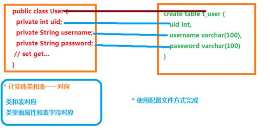**


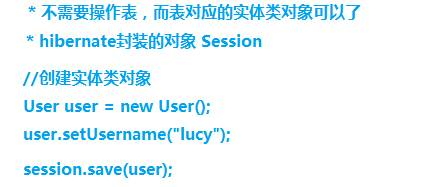**

## 入门

### 搭建一个demo

#### 1、使用IDEA创建一个Maven工程

添加依赖

```xml
<!-- https://mvnrepository.com/artifact/org.hibernate/hibernate-core -->
<dependency>
    <groupId>org.hibernate</groupId>
    <artifactId>hibernate-core</artifactId>
    <version>5.5.0.Final</version>
</dependency>

<dependency>
    <groupId>mysql</groupId>
    <artifactId>mysql-connector-java</artifactId>
    <version>8.0.16</version>
</dependency>

<dependency>
    <groupId>log4j</groupId>
    <artifactId>log4j</artifactId>
    <version>1.2.17</version>
</dependency>

<!-- https://mvnrepository.com/artifact/junit/junit -->
<dependency>
    <groupId>junit</groupId>
    <artifactId>junit</artifactId>
    <version>4.13.1</version>
    <scope>test</scope>
</dependency>
```


解决编译时资源文件不生效的问题：

```xml
<build>
    <!--默认打包资源文件-->
    <resources>
        <resource>
            <directory>src/main/java</directory>
            <includes>
                <include>**/*.xml</include>
            </includes>
        </resource>
    </resources>
</build>
```

#### 2、写个实体类

```java
public class User {
    private int uid;
    private String username;
    private String password;

    public User(int uid, String username, String password) {
        this.uid = uid;
        this.username = username;
        this.password = password;
    }

    public User() {
    }

    public int getUid() {
        return uid;
    }

    public void setUid(int uid) {
        this.uid = uid;
    }

    public String getUsername() {
        return username;
    }

    public void setUsername(String username) {
        this.username = username;
    }

    public String getPassword() {
        return password;
    }

    public void setPassword(String password) {
        this.password = password;
    }
}
```

#### 3、写实体类对应的配置文件

建议：在实体类所在包里面创建，`实体类名称.hbm.xml`

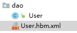


```xml
<?xml version="1.0"?>

<!--
  ~ Hibernate, Relational Persistence for Idiomatic Java
  ~
  ~ License: GNU Lesser General Public License (LGPL), version 2.1 or later.
  ~ See the lgpl.txt file in the root directory or <http://www.gnu.org/licenses/lgpl-2.1.html>.
  -->
<!DOCTYPE hibernate-mapping PUBLIC
        "-//Hibernate/Hibernate Mapping DTD 3.0//EN"
        "http://www.hibernate.org/dtd/hibernate-mapping-3.0.dtd">

<hibernate-mapping package="com.tcmyxc.dao">
    <!-- 配置类名和表名的映射关系-->
    <class name="User" table="t_user">
        <id name="uid" column="uid">
            <!--配置主键自增长-->
            <generator class="native"/>
        </id>
        <!--配置类属性和表结构中列名的对应关系，不填就一模一样-->
        <property name="username"/>
        <property name="password"/>
    </class>

</hibernate-mapping>
```

#### 4、创建hibernate的核心配置文件

名字是固定的：`hibernate.cfg.xml`

```xml
<?xml version='1.0' encoding='utf-8'?>
<!--
  ~ Hibernate, Relational Persistence for Idiomatic Java
  ~
  ~ License: GNU Lesser General Public License (LGPL), version 2.1 or later.
  ~ See the lgpl.txt file in the root directory or <http://www.gnu.org/licenses/lgpl-2.1.html>.
  -->
<!DOCTYPE hibernate-configuration PUBLIC
        "-//Hibernate/Hibernate Configuration DTD 3.0//EN"
        "http://www.hibernate.org/dtd/hibernate-configuration-3.0.dtd">

<hibernate-configuration>

    <session-factory>

        <!-- Database connection settings -->
        <property name="connection.driver_class">com.mysql.cj.jdbc.Driver</property>
        <property name="connection.url">jdbc:mysql:///mytest?serverTimezone=UTC</property>
        <property name="connection.username">root</property>
        <property name="connection.password">123456</property>

        <!--可选配置-->
        <!-- JDBC connection pool (use the built-in) -->
        <property name="connection.pool_size">1</property>

        <!-- SQL dialect -->
        <property name="dialect">org.hibernate.dialect.MySQL8Dialect</property>

        <!-- 输出 sql 语句 -->
        <property name="show_sql">true</property>
        <!--sql 语句格式化-->
        <property name="format_sql">true</property>
        <!-- 自动创建表
            update: 没有则创建，有则更新
        -->
        <property name="hbm2ddl.auto">update</property>

        <!--引入映射文件-->
        <mapping resource="com/tcmyxc/dao/User.hbm.xml"/>

    </session-factory>

</hibernate-configuration>
```

#### 5、测试

第一步 加载hibernate核心配置文件

第二步 创建SessionFactory对象

第三步 使用SessionFactory创建session对象

第四步 开启事务

第五步 写具体逻辑 crud操作

第六步 提交事务

第七步 关闭资源

```java
@Test
public void testAdd(){

    Configuration cfg = new Configuration();
    cfg.configure();

    SessionFactory sessionFactory = cfg.buildSessionFactory();
    Session session = sessionFactory.openSession();

    Transaction transaction = session.beginTransaction();

    User user = new User();
    user.setUsername("xwx");
    user.setPassword("123456");

    session.save(user);

    transaction.commit();
    session.close();
}
```

### Hibernate核心api

#### Configuration

找到名称hibernate.cfg.xml配置文件，创建对象，把配置文件放到对象里面（加载核心配置文件）

#### SessionFactory

1 使用configuration对象创建sessionFactory对象
（1）创建sessionfactory过程中做事情：

- 根据核心配置文件中，有数据库配置，有映射文件部分，到数据库里面根据映射关系把表创建


2 创建sessionFactory过程中，这个过程特别耗资源的
（1）在hibernate操作中，建议一个项目一般创建一个sessionFactory对象

3 具体实现
（1）写工具类，写静态代码块实现

* 静态代码块在类加载时候执行，执行一次

```java
public class SessionFactoryUtil {

    private static Configuration cfg = null;
    private static SessionFactory sessionFactory = null;
    
    // 静态代码块保证只被加载一次
    static {
        cfg = new Configuration();
        cfg.configure();
        sessionFactory = cfg.buildSessionFactory();
    }

    // 提供一个静态方法
    public static SessionFactory getSessionFactory(){
        return sessionFactory;
    }
}
```

#### Session

1 session类似于jdbc中connection

2 调用session里面不同的方法实现crud操作
（1）添加 save方法
（2）修改 update方法
（3）删除 delete方法
（4）根据id查询 get方法

3 session对象单线程对象
（1）session对象不能共用，只能自己使用

## 增删改查那些事

#### Hibernate实体类编写规则

1 实体类里面属性私有的

2 私有属性使用公开的set和get方法操作

3 要求实体类有属性作为唯一值（一般使用id值）

4 实体类属性建议不使用基本数据类型，使用基本数据类型对应的包装类
（1）八个基本数据类型对应的包装类

- int – Integer
- char—Character、
- 其他的都是首字母大写 比如 double – Double
  （2）比如 表示学生的分数，假如 int score;
- 比如学生得了0分 ，int score = 0;
- 如果表示学生没有参加考试，int score = 0;不能准确表示学生是否参加考试
  - 解决：使用包装类可以了， Integer score = 0，表示学生得了0分，表示学生没有参加考试，Integer score = null;


#### 主键生成策略


```xml
<!--配置主键自增长-->
<generator class="native"/>
```


#### 查询操作

根据 id 查询

```java
User user = session.get(User.class, 2);System.out.println(user);
```


#### 修改操作

```java
User user = session.get(User.class, 2);System.out.println(user);user.setPassword("nihao");session.update(user);User user2 = session.get(User.class, 2);System.out.println(user2);
```


#### 删除操作

```java
User user = session.get(User.class, 2);System.out.println(user);// 测试删除操作session.delete(user);User user2 = session.get(User.class, 2);System.out.println(user2);
```

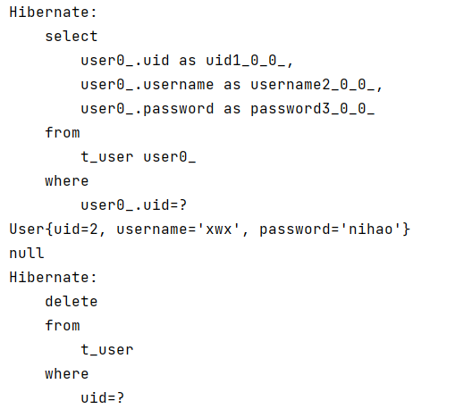

## 其他的概念

### 实体类对象状态

实体类状态有三种

（1）瞬时态：对象里面没有id值，对象与session没有关联


（2）持久态：对象里面有id值，对象与session关联


 

（3）托管态：对象有id值，对象与session没有关联

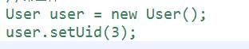


saveOrUpdate方法：实现添加、实现修改


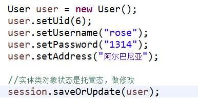

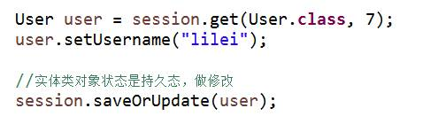


### 缓存

hibernate缓存特点：

第一类 hibernate的一级缓存

（1）hibernate的一级缓存默认打开的

（2）hibernate的一级缓存使用范围，是session范围，从session创建到session关闭范围

（3）hibernate的一级缓存中，存储数据必须 持久态数据

 

第二类 hibernate的二级缓存

（1）目前已经不使用了，替代技术 redis

（2）二级缓存默认不是打开的，需要配置

（3）二级缓存使用范围，是sessionFactory范围


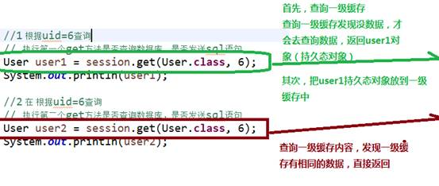**

### 事务代码规范写法

代码结构

```java
try { 开启事务 提交事务}
catch() { 回滚事务}
finally { 关闭}

@Test
public void testTx() {    
    SessionFactory sessionFactory = null;    
    Session session = null;    
    Transaction tx = null;    
    try {        
        sessionFactory = HibernateUtils.getSessionFactory();        
        session = sessionFactory.openSession();        
        //开启事务        
        tx = session.beginTransaction();        
        //添加        
        User user = new User();        
        user.setUsername("小马");        
        user.setPassword("250");        
        user.setAddress("美国");        
        session.save(user);        
        int i = 10/0;        
        //提交事务        
        tx.commit();    
    }catch(Exception e) {        
    	e.printStackTrace();        
        //回滚事务        
        tx.rollback();    
    }finally {        
        //关闭操作        
        session.close();        
        sessionFactory.close();    
    }
}
```

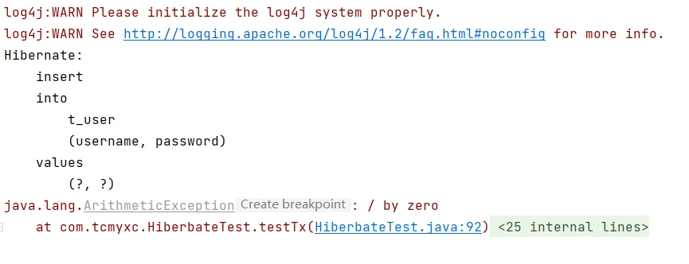

## 回顾表和表之间的关系

一对多：分类和商品关系，一个分类里面有多个商品，一个商品只能属于一个分类

多对多：订单和商品关系，一个订单里面有多个商品，一个商品属于多个订单

多对多建表：创建第三张表维护关系

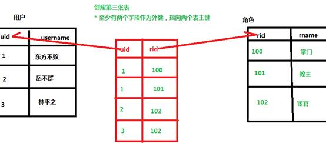

## 查询方式介绍

### 对象导航查询

（1）根据id查询某个客户，再查询这个客户里面所有的联系人

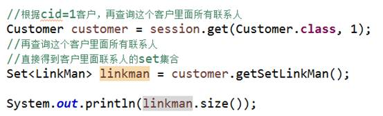


### OID查询

（1）根据id查询某一条记录，返回对象

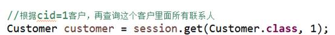


### HQL查询

HQL，即hibernate query language，hibernate提供一种查询语言，hql语言和普通sql很相似

区别：普通sql操作数据库表和字段，hql操作实体类和属性


常用的hql语句

（1）查询所有： from 实体类名称

（2）条件查询： from 实体类名称 where 属性名称=? 

（3）排序查询： from 实体类名称 order by 实体类属性名称 asc/desc


使用hql查询操作时候，使用Query对象

（1）创建Query对象，写hql语句

（2）调用query对象里面的方法得到结果


#### 查询所有


#### 条件查询


#### 分页查询

在hql操作中，在语句里面不能写limit，hibernate的Query对象封装两个方法实现分页操作

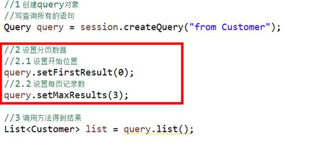

#### 投影查询

 投影查询：查询不是所有字段值，而是部分字段的值

投影查询hql语句写法：

（1）select 实体类属性名称1, 实体类属性名称2  from 实体类名称

（2）select 后面不能写 `* `，不支持的

具体实现：


### QBC查询

1、使用hql查询需要写hql语句实现，但是使用qbc时候，不需要写语句了，使用方法实现

2、使用qbc时候，操作实体类和属性

3、使用qbc，使用Criteria对象实现

#### 查询所有


#### 条件查询

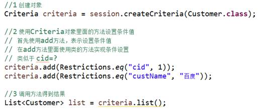

#### 分页查询

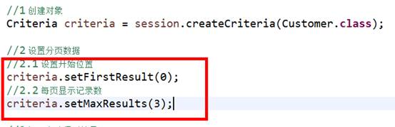


#### 统计查询

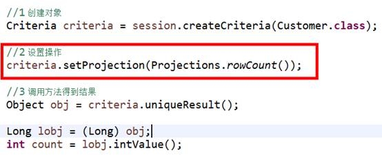


###  本地sql查询

SQLQuery对象，使用普通sql实现查询

servlet调用service，service调用dao

（1）在dao里面对数据库crud操作

（2）在dao里面使用hibernate框架，使用hibernate框架时候，调用session里面的方法实现功能


## 多表查询

迫切内连接

（1）迫切内连接和内连接底层实现一样的

（2）区别：使用内连接返回list中每部分是数组，迫切内连接返回list每部分是对象

（3）hql语句写法：from  Customer  c  inner  join  fetch  c.setLinkMan

## 检索策略

检索策略分为两类：

（1）立即查询：根据id查询，调用get方法，一调用get方法马上发送语句查询数据库

（2）延迟查询：根据id查询，还有load方法，调用load方法不会马上发送语句查询数据，只有得到对象里面的值时候才会发送语句查询数据库


延迟查询分成两类：

（1）类级别延迟：根据id查询返回实体类对象，调用load方法不会马上发送语句

（2）关联级别延迟：查询某个客户，再查询这个客户的所有联系人，查询客户的所有联系人的过程是否需要延迟，这个过程称为关联级别延迟


批量抓取

查询所有的客户，返回list集合，遍历list集合，得到每个客户，得到每个客户的所有联系人


在客户的映射文件中，set标签配置 batch-size值，值越大发送语句越少


