# 秒杀实战


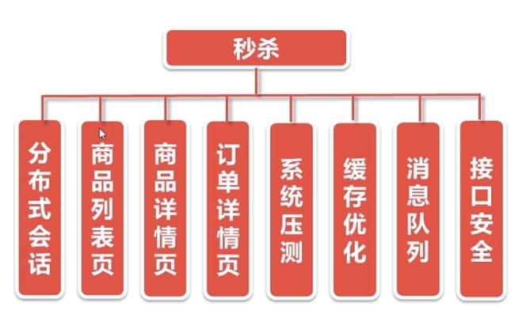


如何应对高并发？

削峰、限流

如何利用缓存？

如何使用异步？

>   java的(PO,VO,TO,BO,DAO,POJO)解释
>
>   PO(persistant object) 持久对象
>   对应数据模型(数据库),本身还有部分业务逻辑的处理。可以看成是与数据库中的表相映射的java对象。最简单的PO就是对应数据库中某个表中的一条记录，多个记录可以用PO的集合。PO中应该不包含任何对数据库的操作。
>
>   VO(value object) 值对象
>   通常用于业务层之间的数据传递，和PO一样也是仅仅包含数据而已。但应是抽象出的**业务对象**,可以和表对应,也可以不,这根据业务的需要.个人觉得同DTO(数据传输对象),在web上传递。
>
>   TO(Transfer Object)，数据传输对象
>   在应用程序不同tie(关系)之间传输的对象
>
>   BO(business object) 业务对象
>   从业务模型的角度看,见UML元件领域模型中的领域对象。封装业务逻辑的java对象,通过调用DAO方法,结合PO,VO进行业务操作。
>
>   POJO(plain ordinary java object) 简单无规则java对象
>   纯的传统意义的java对象。就是说在一些Object/Relation Mapping工具中，能够做到维护数据库表记录的persisent object完全是一个符合Java Bean规范的纯Java对象，没有增加别的属性和方法。我的理解就是最基本的Java Bean，只有属性字段及setter和getter方法！。
>
>   DAO(data access object) 数据访问对象
>   是一个sun的一个标准j2ee设计模式，这个模式中有个接口就是DAO，它负持久层的操作。为业务层提供接口。此对象用于访问数据库。通常和PO结合使用，DAO中包含了各种数据库的操作方法。通过它的方法,结合PO对数据库进行相关的操作。夹在业务逻辑与数据库资源中间。配合VO, 提供数据库的CRUD操作...
>
>   O/R Mapper 对象/关系 映射 
>   定义好所有的mapping之后，这个O/R Mapper可以帮我们做很多的工作。通过这些mappings,这个O/R Mapper可以生成所有的关于对象保存，删除，读取的SQL语句，我们不再需要写那么多行的DAL代码了。
>
>   参考：https://www.cnblogs.com/yxnchinahlj/archive/2012/02/24/2366110.html

## JSR303 参数校验

```xml
<!--JSR303参数校验-->
<dependency>
    <groupId>org.springframework.boot</groupId>
    <artifactId>spring-boot-starter-validation</artifactId>
</dependency>
```

>   Starter for using Java Bean Validation（校验） with Hibernate Validator
>
>   Hibernate Validator, declare and validate application constraints（约束，限制）

说明： 

>   Target classes with such annotated methods need to be annotated with the `@Validated` annotation at the type level for their methods to be searched for inline constraint annotations
>
>   参考文献：https://docs.spring.io/spring-boot/docs/2.3.7.RELEASE/reference/htmlsingle/#boot-features-validation

在类上需要加`@Validated`注解，这样才能让类里面的限制性注解生效。

### 具体使用

1、在需要验证的地方加 `@Valid`

```java
// 使用 JSR303 参数校验
public Result<Boolean> doLogin(HttpServletResponse response, @Valid LoginVo loginVo)
```

2、在类内部标注各种需要的注解


```java
public class LoginVo {

    @NotNull
    @IsMobile
    private String mobile;
    @NotNull
    @Length(min = 6)
    private String password;

    ...
}
```


### 自定义验证器

1、从已经实现的注解里面复制粘贴一些基本信息

`IsMobile` 注解

```java
// 这几个注解从 @Length 注解里面复制粘贴的
@Documented
@Constraint(validatedBy = { IsMobileValidator.class })// 说明这个注解是调用哪个类校验的
@Target({ METHOD, FIELD, ANNOTATION_TYPE, CONSTRUCTOR, PARAMETER, TYPE_USE })
@Retention(RUNTIME)
public @interface IsMobile {

    boolean required() default true;// 默认必须要有

    String message() default "{手机号码格式有误}";

    Class<?>[] groups() default { };

    Class<? extends Payload>[] payload() default { };
}
```

2、`IsMobileValidator` 判断类

```java
public class IsMobileValidator implements ConstraintValidator<IsMobile, String> {

    private boolean required = false;// 默认不需要

    @Override
    public void initialize(IsMobile constraintAnnotation) {
        // 初始化方法可以拿到注解
        required = constraintAnnotation.required();
    }

    @Override
    public boolean isValid(String value, ConstraintValidatorContext context) {
        // 判断值是否是必须的
        if(required){
            // 判断手机号的格式
            return ValidatorUtil.isMobile(value);
        }
        else {
            // 判断值是否合法
            if (StringUtils.isEmpty(value)){
                return true;
            }
            else {
                // 判断手机号的格式
                return ValidatorUtil.isMobile(value);
            }
        }
    }
}
```

3、注释掉以前写的验证语句

```java
@PostMapping("/login/do_login")
@ResponseBody
// 使用 JSR303 参数校验
public Result<Boolean> doLogin(@Valid LoginVo loginVo) {
    log.info(loginVo.toString());
    // 参数校验
    //        String password = loginVo.getPassword();
    //        String mobile = loginVo.getMobile();
    //        if(StringUtils.isEmpty(password)){
    //            return Result.error(CodeMsg.PASSWORD_EMPTY);
    //        }
    //        if(StringUtils.isEmpty(mobile)){
    //            return Result.error(CodeMsg.MOBILE_EMPTY);
    //        }
    //        if(!ValidatorUtil.isMobile(mobile)){
    //            return Result.error(CodeMsg.MOBILE_ERROR);
    //        }

    // 执行登录请求
    CodeMsg codeMsg = userService.login(loginVo);
    if(codeMsg.getCode() == 0){
        return Result.success(true);
    } else {
        return Result.error(codeMsg);
    }
}
```


可以发现，现在登录的功能比较清爽，参数校验由别的模块操作，高内聚。


4、在登录页面登录

5、运行结果：

>   Field error in object 'loginVo' on field 'mobile': rejected value [23456789045]; codes [IsMobile.loginVo.mobile,IsMobile.mobile,IsMobile.java.lang.String,IsMobile]; arguments [org.springframework.context.support.DefaultMessageSourceResolvable: codes [loginVo.mobile,mobile]; arguments []; default message [mobile],true]; default message [{手机号码格式有误}]]


## 自定义全局异常拦截器

上面一节，运行结果有错误信息，但是客户端没有展示给客户，我们把信息拿出来展示给客户。

1、新建一个 exception 包

2、自定义全局异常处理类

```java
@ControllerAdvice
@ResponseBody
public class GlobalExceptionHandlder {
    
    @ExceptionHandler(value = Exception.class)// 拦截所有异常
    public Result<String> exceptionHandler(HttpServletRequest request, Exception e){
        // 绑定异常
        if(e instanceof BindException){
            // BindException 导包要正确
            // import org.springframework.validation.BindException;
            BindException bindException = (BindException) e;
            // 获取异常信息
            List<ObjectError> errors = bindException.getAllErrors();
            String message = errors.get(0).getDefaultMessage();// 获取第一个参数的的信息
            return Result.error(CodeMsg.BIND_EXCEPTION.fillArgs(message));
        }
        // 其他异常
        else{
            return Result.error(CodeMsg.SERVER_ERROR);
        }
    }
}
```

3、再次运行

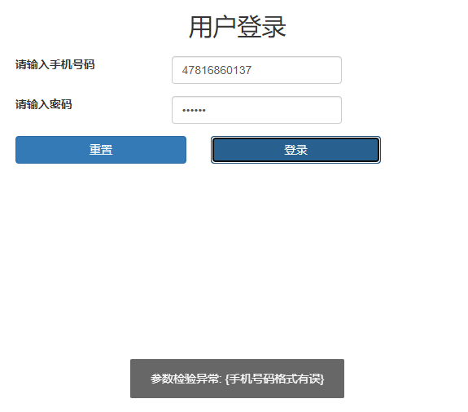


业务代码里面出现异常直接往外抛

1、定义一个全局异常

```java
public class GlobalException extends RuntimeException{

    private static final long serialVersionUID = 1L;
    
    private CodeMsg cm;

    public GlobalException(CodeMsg cm) {
        super(cm.toString());
        this.cm = cm;
    }

    public CodeMsg getCm() {
        return cm;
    }
}
```

2、改造，在 `GlobalExceptionHandlder` 中添加分支

```java
else if(e instanceof GlobalException){
    GlobalException globalException = (GlobalException)e;
    // 返回错误信息
    return Result.error(globalException.getcodeMsg());
}
```

3、如果有异常，在登录功能里面抛异常

`MiaoshaUserService`类

```java
public CodeMsg login(LoginVo loginVo) {
    if(loginVo == null){
        throw new GlobalException(CodeMsg.SERVER_ERROR);
    ...
    return CodeMsg.SUCCESS;
}
```

`LoginController`类

```java
// 执行登录请求前
CodeMsg codeMsg = userService.login(loginVo);
if(codeMsg.getCode() == 0){
    return Result.success(true);
} else {
    return Result.error(codeMsg);
}

//改造后

// 执行登录请求
userService.login(loginVo);
return Result.success(true);
```


代码很清爽，就很淦。

## 分布式 Session

>   1，session 在服务器端，cookie 在客户端（浏览器）
>    2，session 默认被存在在服务器的一个文件里（不是内存）
>    3，session 的运行依赖 session id，而 session id 是存在 cookie 中的，也就是说，如果浏览器禁用了 cookie ，同时 session 也会失效（但是可以通过其它方式实现，比如在 url 中传递 session_id）
>    4，session 可以放在 文件、数据库、或内存中都可以。
>    5，用户验证这种场合一般会用 session
>
>   作者：冯特罗
>   链接：https://www.zhihu.com/question/19786827/answer/21643186

>   分布式 session 的几种实现方式：https://www.cnblogs.com/daofaziran/p/10933221.html

用户登录之后就生成一个 token，把 token 放到 cookie，把这个 cookie 放到响应里面返回给客户端，

`MiaoshaUserService` 的 login 方法：

```java
// 生成 cookie
String token = UUIDUtil.uuid();// 生成一个令牌
redisService.set(MiaoshaUserKey.token, token, user);// 将 token 写进 redis
Cookie cookie = new Cookie(COOKIE_NAME_TOKEN, token);// 将 token 存进 cookie
cookie.setMaxAge(MiaoshaUserKey.token.expireSeconds());// cookie 有效期和 token 一致
cookie.setPath("/");// 设置存放目录
response.addCookie(cookie);// 把 cookie 放进响应里面
```


登录的 Controller

```java
@Controller
public class GoodsController {

    @Autowired
    MiaoshaUserService userService;

    @GetMapping("/goods/to_list")
    public String toGoodsList(Model model,
                              @CookieValue(value = MiaoshaUserService.COOKIE_NAME_TOKEN, required = false) String cookieToken,
                              @RequestParam(value = MiaoshaUserService.COOKIE_NAME_TOKEN, required = false) String paramToken){

        // 参数判断，如果 cookie 已过期，返回登录页面
        if(StringUtils.isEmpty(cookieToken) && StringUtils.isEmpty(paramToken)){
            return "login";
        }
        String token = StringUtils.isEmpty(paramToken) ? cookieToken : paramToken;
        MiaoshaUser user = userService.getByToken(token);// 获取用户信息
        model.addAttribute("user", user);
        return "goods_list";
    }
}
```


`MiaoshaUserService` 新增方法：

```java
// 根据用户的 token 获取用户信息
public MiaoshaUser getByToken(String token) {
    // 参数校验
    if(StringUtils.isEmpty(token)){
        return null;
    }
    // 从 redis 缓存中取用户
    return redisService.get(MiaoshaUserKey.token, token, MiaoshaUser.class);
}
```


session 不直接存到服务器，存到一个单独的缓存中，这里使用 redis 实现。

用户每次登录之后都要重新设置 cookie，我们可以把这部分封装起来

```java
// 封装成函数
private void addCookie(HttpServletResponse response, MiaoshaUser user){
    // 生成 cookie
    String token = UUIDUtil.uuid();// 生成一个令牌
    redisService.set(MiaoshaUserKey.token, token, user);// 将 token 写进 redis
    Cookie cookie = new Cookie(COOKIE_NAME_TOKEN, token);// 将 token 存进 cookie
    cookie.setMaxAge(MiaoshaUserKey.token.expireSeconds());// cookie 有效期和 token 一致
    cookie.setPath("/");// 设置存放目录
    response.addCookie(cookie);// 把 cookie 放进响应里面
}
```


我们现在再看一下商品列表路由函数：

```java
@GetMapping("/goods/to_list")
public String goodsList(HttpServletResponse response, Model model,
                          @CookieValue(value = MiaoshaUserService.COOKIE_NAME_TOKEN, required = false) String cookieToken,
                          @RequestParam(value = MiaoshaUserService.COOKIE_NAME_TOKEN, required = false) String paramToken){

    // 参数判断，如果 cookie 已过期，返回登录页面
    if(StringUtils.isEmpty(cookieToken) && StringUtils.isEmpty(paramToken)){
        return "login";
    }
    String token = StringUtils.isEmpty(paramToken) ? cookieToken : paramToken;
    MiaoshaUser user = userService.getByToken(response, token);// 获取用户信息
    model.addAttribute("user", user);
    return "goods_list";
}
```

可以看到，每次都要参数判断，参数列表要带一大堆的附加参数，比较烦

时间很宝贵！！

改他！！！

因为每次都要获取 user 对象，不如把这个对象注入到方法中来，这样就很方便了：

```java
@GetMapping("/goods/to_list")
    public String goodsList(//HttpServletResponse response, 
        Model model,
//                              @CookieValue(value = MiaoshaUserService.COOKIE_NAME_TOKEN, required = false) String cookieToken,
//                              @RequestParam(value = MiaoshaUserService.COOKIE_NAME_TOKEN, required = false) String paramToken,
                            MiaoshaUser user){

//        // 参数判断，如果 cookie 已过期，返回登录页面
//        if(StringUtils.isEmpty(cookieToken) && StringUtils.isEmpty(paramToken)){
//            return "login";
//        }
//        String token = StringUtils.isEmpty(paramToken) ? cookieToken : paramToken;
//        MiaoshaUser user = userService.getByToken(response, token);// 获取用户信息
        model.addAttribute("user", user);
        return "goods_list";
    }
```


实现：

```java
@Configuration
public class WebConfig implements WebMvcConfigurer {

    @Autowired
    UserArgumentResolver userArgumentResolver;

    @Override
    public void addArgumentResolvers(List<HandlerMethodArgumentResolver> resolvers) {
        resolvers.add(userArgumentResolver);
    }
}
```

```java
@Service
public class UserArgumentResolver implements HandlerMethodArgumentResolver {

    @Autowired
    MiaoshaUserService userService;

    @Override
    public boolean supportsParameter(MethodParameter parameter) {
        Class<?> clazz = parameter.getParameterType();// 获取参数的类型
        return clazz == MiaoshaUser.class;// 如果是秒杀的用户才做处理
    }

    @Override
    public Object resolveArgument(MethodParameter parameter,
                                  ModelAndViewContainer mavContainer,
                                  NativeWebRequest webRequest,
                                  WebDataBinderFactory binderFactory) throws Exception {
        // 就是把原来处理的方法拿过来即可
        HttpServletRequest request= webRequest.getNativeRequest(HttpServletRequest.class);
        HttpServletResponse response = webRequest.getNativeResponse(HttpServletResponse.class);

        String cookieToken = request.getParameter(MiaoshaUserService.COOKIE_NAME_TOKEN);
        String paramToken = getCookieValue(request, MiaoshaUserService.COOKIE_NAME_TOKEN);
        // 参数判断，如果 cookie 已过期，返回 null
        if(StringUtils.isEmpty(cookieToken) && StringUtils.isEmpty(paramToken)){
            return null;
        }
        String token = StringUtils.isEmpty(paramToken) ? cookieToken : paramToken;
        return userService.getByToken(response, token);// 获取用户信息
    }

    private String getCookieValue(HttpServletRequest request, String cookieName) {
        // 从请求里面遍历所有的 cookie
        Cookie[] cookies = request.getCookies();
        for(Cookie cookie : cookies){
            if(cookie.getName().equals(cookieName)){
                return cookie.getValue();
            }
        }
        return null;
    }
}
```

还有一个问题，不要每次都生成 token，使用老的 token就行了

```java
// 生成 cookie
String token = UUIDUtil.uuid();// 生成一个令牌
addCookie(response, token, user);
```


## 秒杀功能

商品表、订单表、秒杀商品表、秒杀订单表

在做项目的过程中，发现图片无法正常显示，查阅资料后发现实资源导出问题，解决如下：

```xml
<!--配置资源导出-->
<resources>
    <resource>
        <directory>src/main/resources</directory>
        <includes>
            <include>**/*.properties</include>
            <include>**/*.yaml</include>
            <include>**/*.yml</include>
            <include>**/*.xml</include>
            <include>**/*.css</include>
            <include>**/*.js</include>
            <include>**/*.jpg</include>
            <include>**/*.png</include>
            <include>**/*.html</include>
        </includes>
        <filtering>true</filtering>
    </resource>
</resources>
```

>   参考：https://www.it610.com/article/1295710068662149120.htm


数据库中的 ID 很少用自增，会被笑话，而且很容易让别人把你从 1到 Long 的最大值遍历一遍。

可以用 snowflake（雪花算法）

自己的 service 调用自己的 dao，如果实在要用其他的，使用其对应的 service

## JMeter 压测

1、新建一个线程组

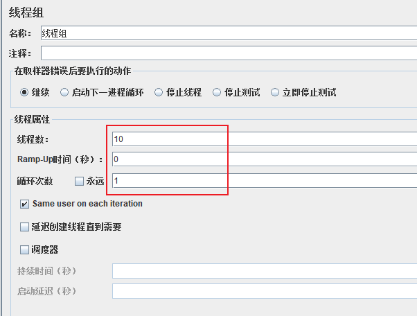

2、线程组下面新建一个 HTTP 请求默认值

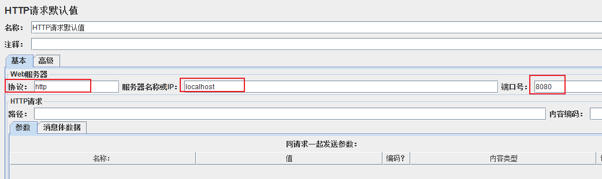

3、新建一个 HTTP 请求

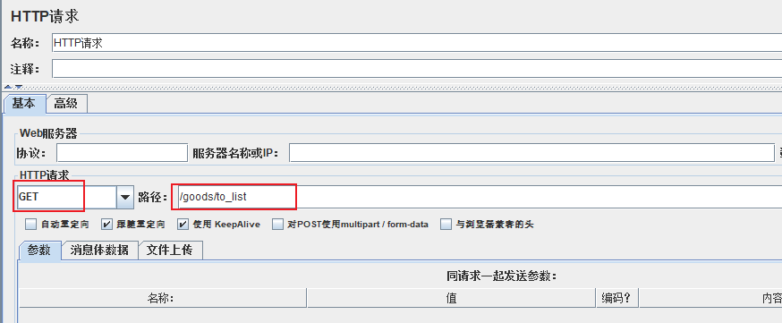

4、添加查看聚合报告、图形结果等

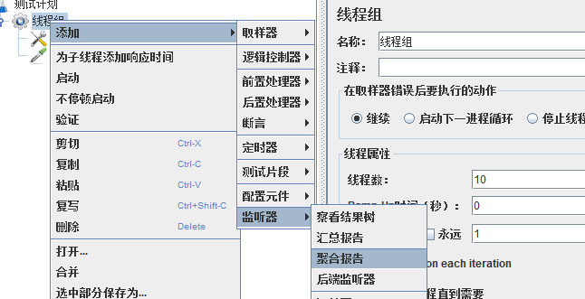


**在自己的笔记本上跑的**

第一次：

10 个线程热热身

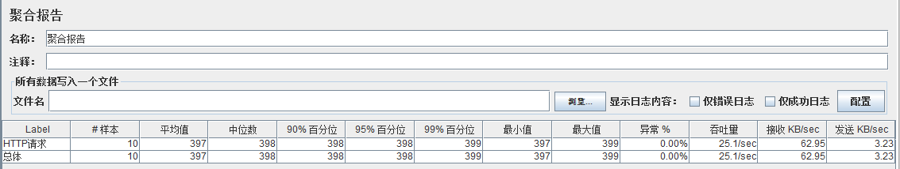


调成 1000

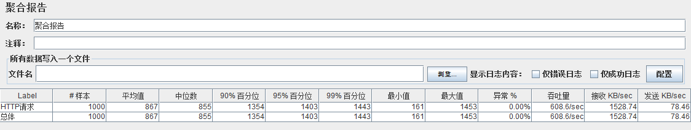


完全部署在阿里云服务器：

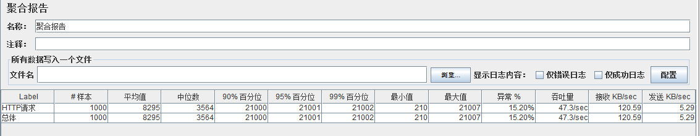


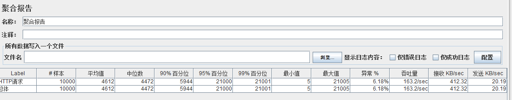


挺差劲的


修改 Linux 启动：

`/etc/motd` 文件

```tex
                      .::::.                                    
                     .::::::::.                                 
                    :::::::::::                                 
                 ..:::::::::::'                                 
               '::::::::::::'                                    
                .::::::::::                                    
           '::::::::::::::..                                     
                ..::::::::::::.                                
              ``::::::::::::::::                                
               ::::``:::::::::'        .:::.                    
              ::::'   ':::::'       .::::::::.                  
            .::::'      ::::     .:::::::'::::.                 
           .:::'       :::::  .:::::::::' ':::::.              
          .::'        :::::.:::::::::'      ':::::.             
         .::'         ::::::::::::::'         ``::::.          
     ...:::           ::::::::::::'              ``::.         
    ```` ':.          ':::::::::'                  ::::..      
                       '.:::::'                    ':'````..   
     码中自有颜如玉                  码中自有黄金屋
```


`top` 命令查看系统负载，压测前后对比

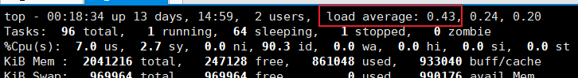

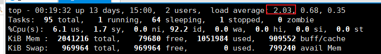

最高有 2.4


带参数压测

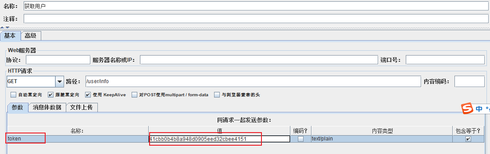


以下都在本机跑，

1000 * 10

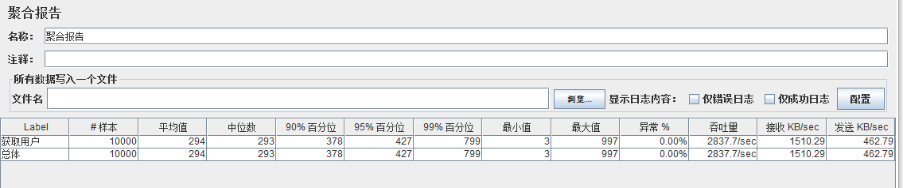


>   这个页面只是从 redis 里面（缓存）读了一次数据，上一个页面是从数据库和 redis 中读的数据，比较慢

主要耗时的部分

```java
// 从 redis 缓存中取用户
MiaoshaUser user = redisService.get(MiaoshaUserKey.token, token, MiaoshaUser.class);
if(user != null){
    // 延长 cookie 有效期
    addCookie(response, token, user);
}
```


测试多用户：

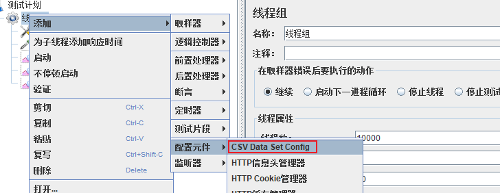

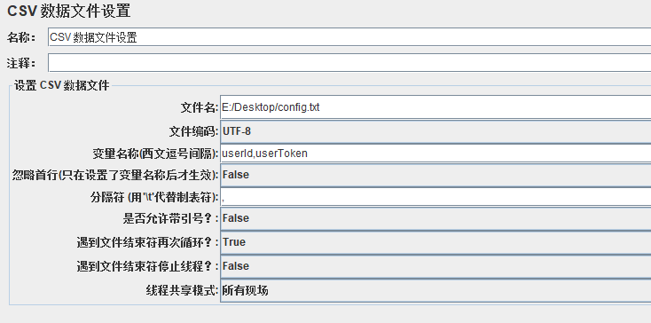


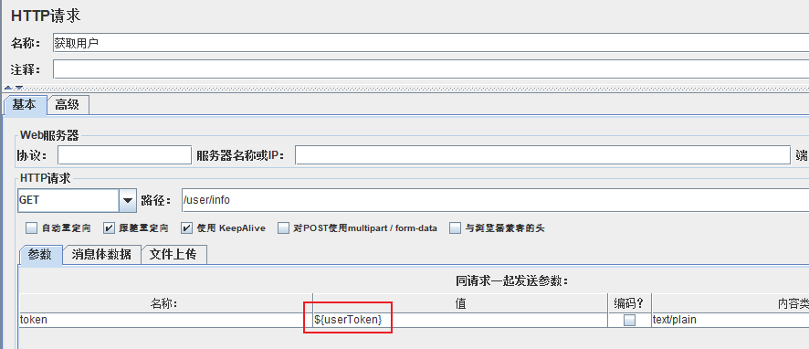

**结果：**

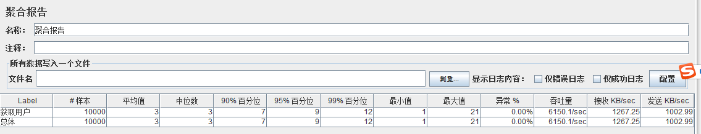


### Jmeter 命令行压测

1、在 Windows 下录个脚本 jmx

2、`sh jmeter.sh -n -t XXX.jmx -l result.jtl`

3、将 `result.jtl` 导入 Jmeter


redis 压测

`redis-benchmark -h 127.0.0.1 -p 6379 -c 100 -n 100000`

模拟 100 个并发 100000 个请求

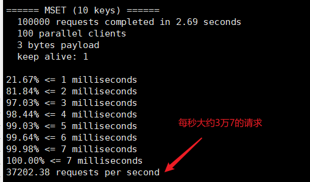


`redis-benchmark -h 127.0.0.1 -p 6379 -q -d 100`

测试 100 个字节

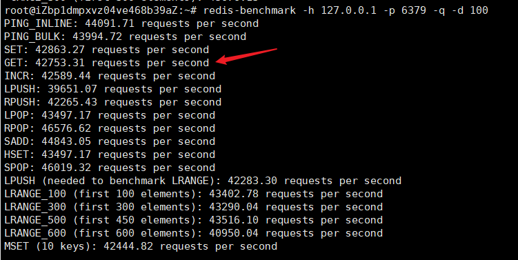


只测试部分命令

`redis-benchmark -t set,lpush -n 100000 -q`

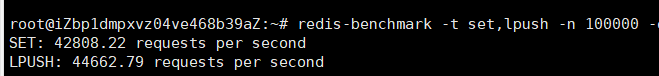


只测某一个操作：

`redis-benchmark -n 100000 -q script load "redis.call('set', 'foo', 'bar')"`

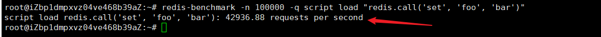


### 打 war 包方法

```xml
<!--打 war 依赖-->
<dependency>
    <groupId>org.springframework.boot</groupId>
    <artifactId>spring-boot-starter-tomcat</artifactId>
    <!--编译时依赖-->
    <scope>provided</scope>
</dependency>

<!--打 war 包插件-->
<plugin>
    <groupId>org.apache.maven.plugins</groupId>
    <artifactId>maven-war-plugin</artifactId>
    <configuration>
        <failOnMissingWebXml>false</failOnMissingWebXml>
    </configuration>
</plugin>
```


重写一个方法：

```java
@SpringBootApplication
public class MiaoshaApplication extends SpringBootServletInitializer{

    public static void main(String[] args) {
        SpringApplication.run(MiaoshaApplication.class, args);
    }

    @Override
    protected SpringApplicationBuilder configure(SpringApplicationBuilder builder) {
        return builder.sources(MiaoshaApplication.class);
    }
}
```


但其实现在微服务都是 jar 包


把 jar 包上传到到服务器，后台运行

```bash
nohup java -jar miaosha.jar --server.port=8090 &

nohup // 不挂断地运行命令
& // 后台运行
```


把压测脚本也上传上去

压力测试

```bash
./apache-jmeter-5.3/bin/jmeter.sh -n -t goods_list.jmx -l result.jtl
```


出现了问题：

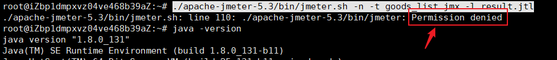

解决方法：

使用了 jmeter4.0 的版本，没有提示权限不够

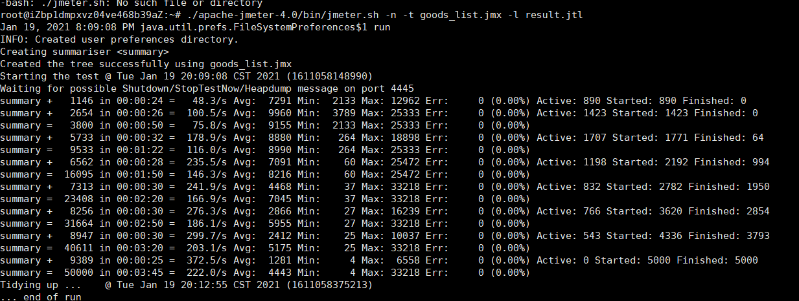


**vim 显示行号**：退出编辑，输入 `:set number`

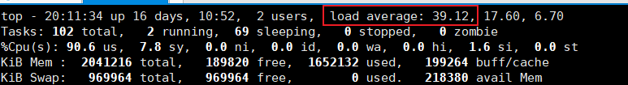

阿里云服务器

查看商品列表压测结果：

热身：

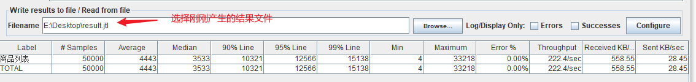

本机：

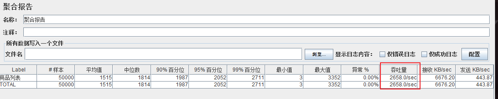


第二次：

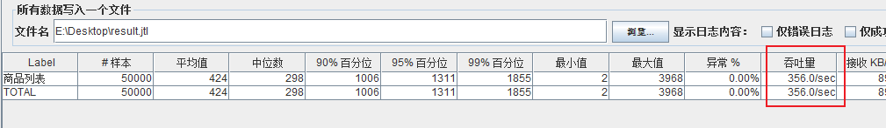

大约 350 的吞吐量

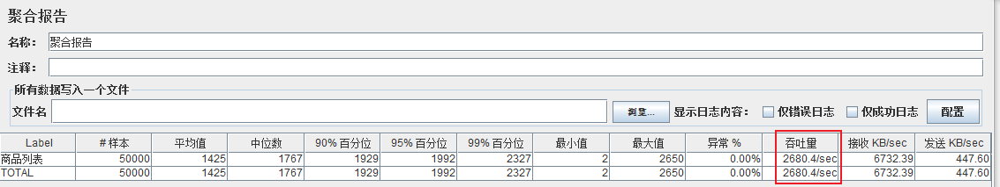

笔记本大约 2700


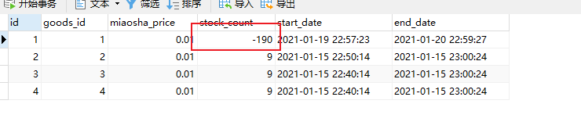

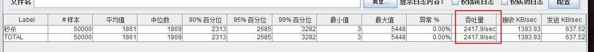

吞吐量大约2500（5000 * 10）

超卖了 190 多个

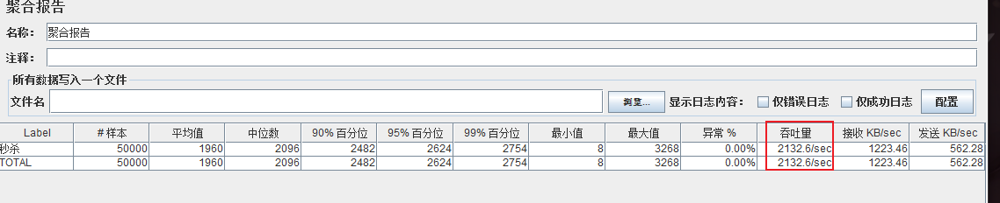

2100 吞吐量

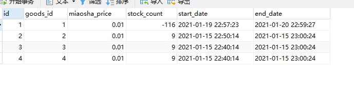

还是存在超卖

## 超卖问题

1、数据库加唯一索引：防止用户重复买卖

2、SQL 加库存数量判断：防止库存变成负数

这样解决：

```java
@Update("update miaosha_goods set stock_count = stock_count - 1 where goods_id = #{goodsId} and stock_count > 0")
```

只有库存大于 0 的时候才减库存

>   其实还是超卖了


一个用户同时发两个请求，买到两个商品：

```java
秒杀订单表创建一个唯一的索引
```

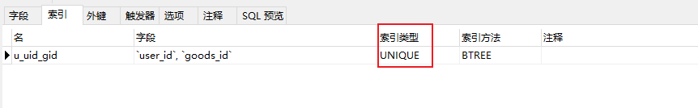


秒杀下单性能：

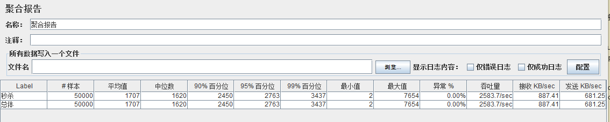


## 页面优化技术

### 页面缓存

访问页面的时候先从缓存里面取，没有的话再去请求服务器，请求到之后存到缓存里面，然后再去渲染

**实现**

```java
@GetMapping(value = "/to_list", produces = "text/html")
@ResponseBody
public String goodsList(HttpServletRequest request, HttpServletResponse response, Model model, MiaoshaUser user){
    model.addAttribute("user", user);
    // 查询商品列表
    List<GoodsVo> goodsList = goodsService.listGoodsVo();
    model.addAttribute("goodsList", goodsList);
    //return "goods_list";
    // 如果缓存里面有数据，直接返回 html 源代码
    String html = redisService.get(GoodsKey.getGoodsList, "", String.class);
    if(!StringUtils.isEmpty(html)){
        return html;
    }
    // 缓存里没有，手动渲染
    IWebContext context =new WebContext(request, response,
            request.getServletContext(), request.getLocale(), model.asMap());
    html = thymeleafViewResolver.getTemplateEngine().process("goods_list", context);
    if(!StringUtils.isEmpty(html)){
        // 存到缓存中去
        redisService.set(GoodsKey.getGoodsList, "", html);
    }
    return html;
}
```

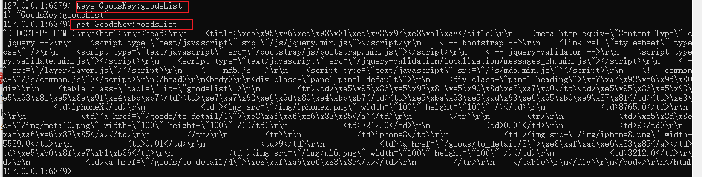

### URL缓存

粒度更小，具体到了一个商品

```java
/* URL 缓存 */
@GetMapping(value = "/to_detail/{goodsId}", produces = "text/html")
@ResponseBody
public String goodsDetail(HttpServletRequest request,
                          HttpServletResponse response,
                          Model model,
                          @PathVariable("goodsId") long goodsId,
                          MiaoshaUser user){
    // 如果缓存里面有数据，直接返回 html 源代码
    String html = redisService.get(GoodsKey.getGoodsDetail, "" + goodsId, String.class);
    if(!StringUtils.isEmpty(html)){
        return html;
    }

    // 手动渲染
    GoodsVo goods = goodsService.getGoodsVoByGoodsId(goodsId);

    long startTime = goods.getStartDate().getTime();
    long endTime = goods.getEndDate().getTime();
    long currentTime = System.currentTimeMillis();

    int miaoshaStatus = 0;// 秒杀状态
    int remainSeconds = 0;// 距离开始还有多少时间
    // 秒杀还没开始
    if(currentTime < startTime){
        miaoshaStatus = 0;
        remainSeconds = (int) (startTime - currentTime) / 1000;// 转换成秒
    }
    // 秒杀已结束
    else if(currentTime > endTime){
        miaoshaStatus = 2;
        remainSeconds = -1;
    }
    // 秒杀进行时
    else{
        miaoshaStatus = 1;
        remainSeconds = 0;
    }

    model.addAttribute("goods", goods);
    model.addAttribute("miaoshaStatus", miaoshaStatus);
    model.addAttribute("remainSeconds", remainSeconds);
    model.addAttribute("user", user);

    //return "goods_detail";
    // 缓存里没有，手动渲染
    IWebContext context =new WebContext(request, response,
                                        request.getServletContext(), request.getLocale(), model.asMap());
    html = thymeleafViewResolver.getTemplateEngine().process("goods_detail", context);
    if(!StringUtils.isEmpty(html)){
        // 存到缓存中去
        redisService.set(GoodsKey.getGoodsDetail, "" + goodsId, html);
    }
    return html;
}
```


### 对象缓存

```java
public boolean updatePassword(String token, long id, String newPassword){
    // 取user
    MiaoshaUser user = getById(id);
    if (user == null){
        throw new GlobalException(CodeMsg.MOBILE_NOT_EXITS);
    }
    // 更新密码
    MiaoshaUser toBeUpdateUser = new MiaoshaUser();
    toBeUpdateUser.setId(id);
    toBeUpdateUser.setPassword(MD5Util.formPassToDBPass(newPassword, user.getSalt()));
    miaoshaUserDao.update(toBeUpdateUser);
    // 处理有关缓存，和这个对象有关的缓存都需要修改，不然会出现数据不一致
    redisService.delete(MiaoshaUserKey.getById, "" + id);
    user.setPassword(toBeUpdateUser.getPassword());
    redisService.set(MiaoshaUserKey.token, token, user);
    return true;
}
```


查看商品列表

优化前

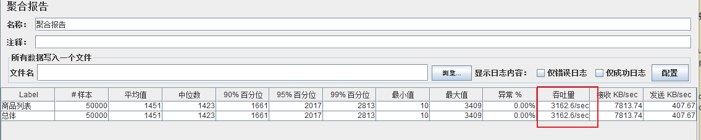

优化后


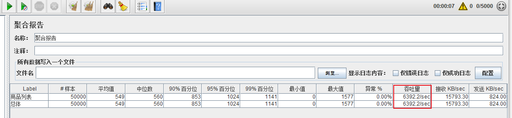


### 页面静态化、前后端分离（说白了就是html + ajax，不要被唬住）

页面静态化：页面存在html中，动态数据通过接口从服务端获取，所以说，服务端只需要写接口就行

### 静态资源优化

1、JS/CSS 压缩，减少流量

2、多个 JS/CSS 组合，减少连接数

>   http://tengine.taobao.org/

3、CDN 加速（就近访问）


通过一级一级的缓存来减少数据库的压力

## 接口优化

分库分表的中间件：mycat

思路：减少数据库访问

1、系统初始化，把商品库存数量加载到 Redis

2、收到请求，Redis 预减库存，库存不足，直接返回，否则进入3

3、请求入队，立即返回排队中

4、请求出队，生成订单，减少库存

5、客户端轮询，是否秒杀成功

### 安装RabbitMQ

需要提前安装 erlang 

>   https://www.erlang.org/downloads


### 简单使用

1、引入依赖

```xml
<!--rabbitmq-->
<dependency>
    <groupId>org.springframework.boot</groupId>
    <artifactId>spring-boot-starter-amqp</artifactId>
</dependency>
```


2、做配置

```properties
#rabbitmq
spring.rabbitmq.host=47.111.17.95
spring.rabbitmq.port=5672
spring.rabbitmq.username=guest
spring.rabbitmq.password=guest
spring.rabbitmq.virtual-host=/
#\u6D88\u8D39\u8005\u6570\u91CF
# 消费者数量
spring.rabbitmq.listener.simple.concurrency= 10
spring.rabbitmq.listener.simple.max-concurrency= 10
#\u6D88\u8D39\u8005\u6BCF\u6B21\u4ECE\u961F\u5217\u83B7\u53D6\u7684\u6D88\u606F\u6570\u91CF
# 从队列中取的消息数量
spring.rabbitmq.listener.simple.prefetch= 1
#\u6D88\u8D39\u8005\u81EA\u52A8\u542F\u52A8
spring.rabbitmq.listener.simple.auto-startup=true
#\u6D88\u8D39\u5931\u8D25\uFF0C\u81EA\u52A8\u91CD\u65B0\u5165\u961F
# 消息消费失败重新放入队列
spring.rabbitmq.listener.simple.default-requeue-rejected= true
#\u542F\u7528\u53D1\u9001\u91CD\u8BD5
spring.rabbitmq.template.retry.enabled=true
spring.rabbitmq.template.retry.initial-interval=1000
spring.rabbitmq.template.retry.max-attempts=3
spring.rabbitmq.template.retry.max-interval=10000
spring.rabbitmq.template.retry.multiplier=1.0
```


3、写生产者消费者代码

配置类:

```java
package com.tcmyxc.rabbitmq;

import org.springframework.amqp.core.Queue;
import org.springframework.context.annotation.Bean;
import org.springframework.context.annotation.Configuration;


/**
 * @author 徐文祥
 * @date 2021/1/27 23:35
 */

@Configuration
public class MQConfig {

    public static final String QUEUE = "queue";

    @Bean
    public Queue queue(){
        return new Queue(QUEUE, true);
    }
}
```


生产者：

```java
package com.tcmyxc.rabbitmq;

import com.tcmyxc.redis.RedisService;
import org.slf4j.Logger;
import org.slf4j.LoggerFactory;
import org.springframework.amqp.core.AmqpTemplate;
import org.springframework.beans.factory.annotation.Autowired;
import org.springframework.stereotype.Service;

/**
 * @author 徐文祥
 * @date 2021/1/27 23:34
 */

@Service
public class MQSender {

    private static Logger log = LoggerFactory.getLogger(MQSender.class);

    @Autowired
    AmqpTemplate amqpTemplate;

    public void send(Object message){
        // 将对象转字符串
        String msg = RedisService.beanToString(message);
        // 打印日志
        log.info("send message:" + msg);
        // 指定发送到那个队列
        amqpTemplate.convertAndSend(MQConfig.QUEUE, msg);
    }
}
```


消费者：

```java
package com.tcmyxc.rabbitmq;

import org.slf4j.Logger;
import org.slf4j.LoggerFactory;
import org.springframework.amqp.rabbit.annotation.RabbitListener;
import org.springframework.stereotype.Service;

/**
 * @author 徐文祥
 * @date 2021/1/27 23:35
 */

@Service
public class MQReceiver {

    private static Logger log = LoggerFactory.getLogger(MQReceiver.class);

    // 声明监听的队列
    @RabbitListener(queues = MQConfig.QUEUE)
    public void receive(String message){
        log.info("receive message:" + message);
    }
}
```


测试：

```java
@GetMapping("/mq")
@ResponseBody
public Result<String> mq() {
    mqSender.send("hello tcmyxc");
    return Result.success("恭喜，成功");
}
```


会报错：

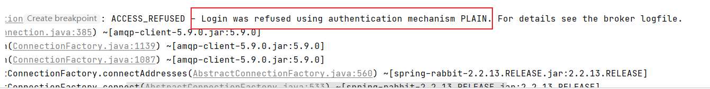


因为 guest 用户不能远程连接 RabbitMQ


解决方法：

>  ["guest" user can only connect from localhost](https://www.rabbitmq.com/access-control.html#loopback-users)
>
>   By default, the guest user is prohibited from connecting from remote hosts; it can only connect over a loopback interface (i.e. localhost). This applies to [connections regardless of the protocol](https://www.rabbitmq.com/connections.html). Any other users will not (by default) be restricted in this way.
>
>   The recommended way to address this in production systems is to create a new user or set of users with the permissions to access the necessary virtual hosts. This can be done using [CLI tools](https://www.rabbitmq.com/cli.html), [HTTP API or definitions import](https://www.rabbitmq.com/management.html).
>
>   This is configured via the loopback_users item in the [configuration file](https://www.rabbitmq.com/configure.html#configuration-file).
>
>   It is possible to allow the guest user to connect from a remote host by setting the loopback_users configuration to none.
>
>   A minimalistic [RabbitMQ config file](https://www.rabbitmq.com/configure.html) which allows remote connections for guest looks like so:
>
>   ```ini
>   # DANGER ZONE!
>   #
>   # allowing remote connections for default user is highly discouraged
>   # as it dramatically decreases the security of the system. Delete the user
>   # instead and create a new one with generated secure credentials.
>   loopback_users = none
>   ```


```bash
 cd /etc/rabbitmq/
 vim rabbitmq.conf
 
 cd /usr/lib/rabbitmq/bin
 rabbitmqctl stop
 rabbitmq-server &
```

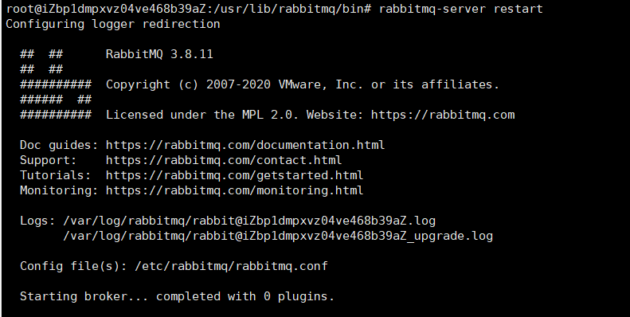


```bash
ps -ef | grep rabbit
```

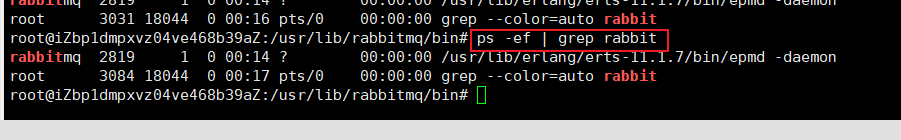


>   输入网址：http://127.0.0.1:8090/mq


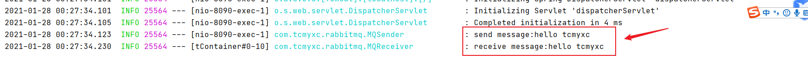


上面的是 direct 模式

### topic 模式

```java
// 创建队列
// MQConfig.java

public static final String TOPIC_QUEUE1 = "topic.queue1";
public static final String TOPIC_QUEUE2 = "topic.queue2";
public static final String TOPIC_EXCHANGE = "topicExchange";

// 交换机模式：Topic 模式
@Bean
public Queue topicQueue1(){
    return new Queue(TOPIC_QUEUE1, true);
}

@Bean
public Queue topicQueue2(){
    return new Queue(TOPIC_QUEUE2, true);
}

// 创建 topic exchange
@Bean
public TopicExchange topicExchange(){
    return new TopicExchange(TOPIC_EXCHANGE);
}

// 1、把消息放到 exchange 里面
// 2、queue 从 exchange 里面取

@Bean
public Binding topicBinding1() {
    return BindingBuilder.bind(topicQueue1()).to(topicExchange()).with("topic.key1");// 精确匹配
}
@Bean
public Binding topicBinding2() {
    return BindingBuilder.bind(topicQueue2()).to(topicExchange()).with("topic.#");// topic.开头的都行
}
```

【注意】

这里有个坑，要是最开始偷懒复制粘贴，但是第二个绑定的是 `topicQueue1()` 的话，得不到想要的结果，然后修改成 `topicQueue2()`，需要去网页的 RabbitMQ 页面删除原先的绑定（因为把队列1也设置成模糊匹配了，不删除会生效的，真是日了:dog:)

```bash
rabbitmq-plugins enable rabbitmq_management
端口是 15672
```


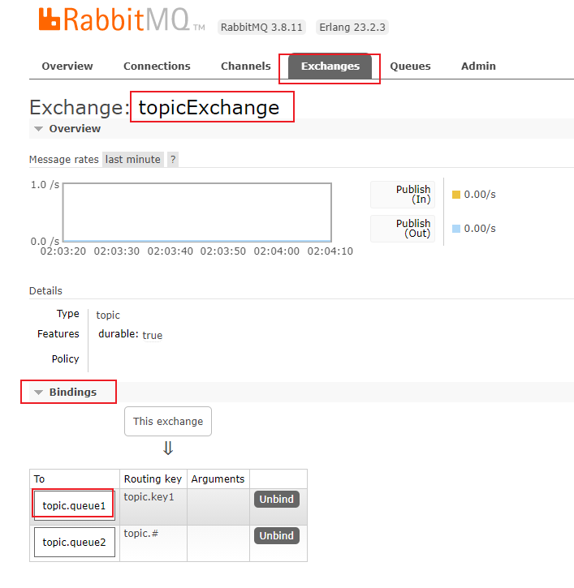


```java
// 消费者
// 声明监听的队列
    @RabbitListener(queues = MQConfig.TOPIC_QUEUE1)
    public void topicReceive1(String message){
    log.info("topic queue1 message:" + message);
}

// 声明监听的队列
@RabbitListener(queues = MQConfig.TOPIC_QUEUE2)
public void topicReceive2(String message){
    log.info("topic queue2 message:" + message);
}
```


```java
// 生产者
public void sendTopic(Object message){
    // 将对象转字符串
    String msg = RedisService.beanToString(message);
    // 打印日志
    log.info("send topic message:" + msg);
    // 指定发送到那个队列
    // void convertAndSend(String exchange, String routingKey, Object message)
    amqpTemplate.convertAndSend(MQConfig.TOPIC_EXCHANGE, "topic.key1", msg + "1");// 两个队列都会收到 
    amqpTemplate.convertAndSend(MQConfig.TOPIC_EXCHANGE, "topic.key2", msg + "2");// 只会被队列 2 收到
}
```


运行结果：


### fanout 广播模式

1、新建一个交换机

2、绑定队列

```java
// MQConfig.java
// fanout 模式：广播模式
@Bean
public FanoutExchange fanoutExchange(){
    return new FanoutExchange(FANOUT_EXCHANGE);
}

@Bean
public Binding fanoutBinding1() {
    return BindingBuilder.bind(topicQueue1())
        .to(fanoutExchange());
}

@Bean
public Binding fanoutBinding2() {
    return BindingBuilder.bind(topicQueue2())
        .to(fanoutExchange());
}

@Bean
public Binding fanoutBinding3() {
    return BindingBuilder.bind(queue())
        .to(fanoutExchange());
}
```

3、生产者代码

```java
// MQSender
public void sendFanout(Object message){
    // 将对象转字符串
    String msg = RedisService.beanToString(message);
    // 打印日志
    log.info("send fanout message: " + msg);
    // 指定发送到那个队列
    // void convertAndSend(String exchange, String routingKey, Object message)
    amqpTemplate.convertAndSend(MQConfig.FANOUT_EXCHANGE , "", msg);
}
```

4、由于是广播，所以这里不需要再写消费者的代码

5、运行结果：

```java
2021-01-28 13:04:27.592  INFO 22936 --- [nio-8090-exec-1] com.tcmyxc.rabbitmq.MQSender             : send fanout message: hello tcmyxc
2021-01-28 13:04:27.603  INFO 22936 --- [ntContainer#1-1] com.tcmyxc.rabbitmq.MQReceiver           : topic queue1 message:hello tcmyxc
2021-01-28 13:04:27.603  INFO 22936 --- [ntContainer#2-1] com.tcmyxc.rabbitmq.MQReceiver           : topic queue2 message:hello tcmyxc
2021-01-28 13:04:27.606  INFO 22936 --- [ntContainer#0-9] com.tcmyxc.rabbitmq.MQReceiver           : receive message:hello tcmyxc
```

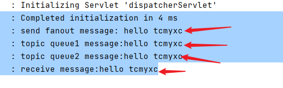


swagger 工具可以了解一下


### header 模式

没有 routingKey，用 header 中的 K/V 来匹配队列

```java
// header 模式：
@Bean
public HeadersExchange headerExchange(){
    return new HeadersExchange(HEADER_EXCHANGE);
}

// header 的队列
@Bean
public Queue headerQueue(){
    return new Queue(HEADER_QUEUE, true);
}

// 绑定队列
@Bean
public Binding headerBinding() {
    Map<String, Object> map = new HashMap<>();
    map.put("header1", "value1");
    map.put("header2", "value2");
    return BindingBuilder.bind(headerQueue())
        .to(headerExchange())
        .whereAll(map)
        .match();
}
```

生产者代码：

```java
public void sendHeader(Object message){
    // 将对象转字符串
    String msg = RedisService.beanToString(message);
    // 打印日志
    log.info("send header message: " + msg);
    // 指定发送到那个队列
    // public Message(byte[] body, MessageProperties messageProperties)
    // body 传的是消息，messageProperties 传的是 header 交换机
    MessageProperties messageProperties = new MessageProperties();
    messageProperties.setHeader("header1", "value1");
    messageProperties.setHeader("header2", "value2");
    Message obj = new Message(msg.getBytes(), messageProperties);
    amqpTemplate.convertAndSend(MQConfig.HEADER_EXCHANGE , "", obj);
}
```

消费者代码：

```java
// 声明监听的队列
@RabbitListener(queues = MQConfig.HEADER_QUEUE)
public void headerReceive(byte[] message){
    log.info("header queue message:" + message);
}
```

测试结果：

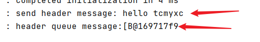

【有点问题】

消费者忘记把 message 数组转字符串了

```java
// 声明监听的队列
@RabbitListener(queues = MQConfig.HEADER_QUEUE)
public void headerReceive(byte[] message){
    log.info("header queue message:" + new String(message));
}
```

重新运行：

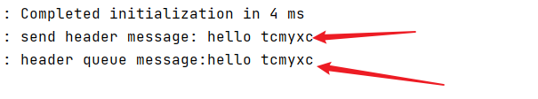

成功！

以后用到查文档就行。

## 接口优化2

分析原有的业务代码

```java
@PostMapping("/do_miaosha")
@ResponseBody
public Result<OrderInfo> doMiaosha(Model model, MiaoshaUser user, @RequestParam("goodsId") long goodsId){
    model.addAttribute("user", user);
    if(user == null){
        return Result.error(CodeMsg.SESSION_ERROR);
    }
    // 判断商品是否还有库存，第一次访问数据库
    GoodsVo goods = goodsService.getGoodsVoByGoodsId(goodsId);
    int stock = goods.getStockCount();
    // 秒杀失败
    if(stock <= 0){
        return Result.error(CodeMsg.MIAOSHA_OVER);
    }

    // 判断是否已经秒杀过了，这里访问了缓存
    MiaoshaOrder order = orderService.getMiaoshaOrderByUserIdAndGoodsId(user.getId(), goodsId);
    if(order != null){
        return Result.error(CodeMsg.REPEATE_MIAOSHA_ORDER);
    }

    // 减库存、下订单、生成订单信息（这三步应该当成一个事务处理）
    // 减库存：第二次访问数据库
    // 创建订单访问了两次数据库
    OrderInfo orderInfo = miaoshaService.doMiaosha(user, goods);
    return Result.success(orderInfo);
}
```


思路：

1、系统初始化，把商品库存数量加载到 Redis

2、收到请求，Redis 预减库存，库存不足，直接返回，否则进入3

3、请求入队，立即返回排队中（异步下单）

4、请求出队，生成订单，减少库存

5、客户端轮询，是否秒杀成功


测试结果：


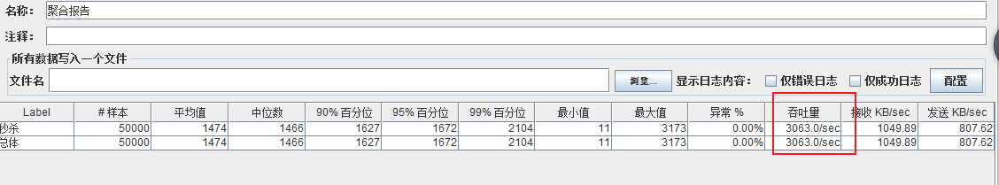

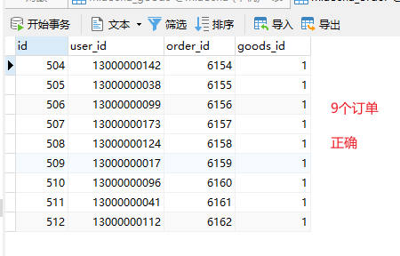


## 横向拓展 nginx

下载：http://nginx.org/en/download.html

别人的配置：

```conf
########### 每个指令必须有分号结束。#################
#user administrator administrators;  #配置用户或者组，默认为nobody nobody。
#worker_processes 2;  #允许生成的进程数，默认为1
#pid /nginx/pid/nginx.pid;   #指定nginx进程运行文件存放地址
error_log log/error.log debug;  #制定日志路径，级别。这个设置可以放入全局块，http块，server块，级别以此为：debug|info|notice|warn|error|crit|alert|emerg
events {
    accept_mutex on;   #设置网路连接序列化，防止惊群现象发生，默认为on
    multi_accept on;  #设置一个进程是否同时接受多个网络连接，默认为off
    #use epoll;      #事件驱动模型，select|poll|kqueue|epoll|resig|/dev/poll|eventport
    worker_connections  1024;    #最大连接数，默认为512
}
http {
    include       mime.types;   #文件扩展名与文件类型映射表
    default_type  application/octet-stream; #默认文件类型，默认为text/plain
    #access_log off; #取消服务日志    
    log_format myFormat '$remote_addr–$remote_user [$time_local] $request $status $body_bytes_sent $http_referer $http_user_agent $http_x_forwarded_for'; #自定义格式
    access_log log/access.log myFormat;  #combined为日志格式的默认值
    sendfile on;   #允许sendfile方式传输文件，默认为off，可以在http块，server块，location块。
    sendfile_max_chunk 100k;  #每个进程每次调用传输数量不能大于设定的值，默认为0，即不设上限。
    keepalive_timeout 65;  #连接超时时间，默认为75s，可以在http，server，location块。

    upstream mysvr {   
      server 127.0.0.1:7878;
      server 192.168.10.121:3333 backup;  #热备
    }
    error_page 404 https://www.baidu.com; #错误页
    server {
        keepalive_requests 120; #单连接请求上限次数。
        listen       4545;   #监听端口
        server_name  127.0.0.1;   #监听地址       
        location  ~*^.+$ {       #请求的url过滤，正则匹配，~为区分大小写，~*为不区分大小写。
           #root path;  #根目录
           #index vv.txt;  #设置默认页
           proxy_pass  http://mysvr;  #请求转向mysvr 定义的服务器列表
           deny 127.0.0.1;  #拒绝的ip
           allow 172.18.5.54; #允许的ip           
        } 
    }
}
```


```conf
# 可以配置多个服务器，当集群用
upstream server_pool_miaosha {   
      server 127.0.0.1:8090 weight=1 max_fails=2 fail_timeout=30s;# 权重实现负载均衡
      server ip地址加端口 weight=1 max_fails=2 fail_timeout=30s;
}

# 虚拟服务器配置
server {
        listen       80;
        server_name  localhost 127.0.0.1;

        location / {
            proxy_pass http://server_pool_miaosha;# 反向代理
        }
}
```


## 安全优化

1、接口秒杀地址隐藏

2、数学公式验证码（防止机器人、刷票软件刷单，同时可以缓解服务器的压力，分散并发量）

3、接口限流防刷

### 接口秒杀地址隐藏

秒杀开始之前，先去请求接口获取秒杀地址

1.  接口改造，带上 PathVariable 参数
2.  添加生成地址的接口
3.  收到秒杀请求，后端先验证 PathVariable 参数

### 数学公式验证码

缓解服务器压力

### 接口防刷限流

思路：对接口做限流

把用户访问的次数放到缓存里面，并设置有效期

通用代码提取：

使用拦截器减少对业务的侵入

1、定义注解

```java
@Target(ElementType.METHOD)
@Retention(RetentionPolicy.RUNTIME)
public @interface AccessLimit {
    int seconds();
    int maxCount();
    boolean needLogin() default false;
}
```

2、定义拦截器

```java
@Service
public class AccessInterceptor extends HandlerInterceptorAdapter {

    @Autowired
    MiaoshaUserService userService;

    @Autowired
    RedisService redisService;

    @Override
    public boolean preHandle(HttpServletRequest request, HttpServletResponse response, Object handler)
            throws Exception {
        // 如果是 HandlerMethod
        if(handler instanceof HandlerMethod){
            // 取用户
            MiaoshaUser user = getUser(request, response);
            UserContext.setUser(user);// 在线程本地变量里设置用户
            HandlerMethod handlerMethod = (HandlerMethod) handler;
            // 获取方法上的注解
            AccessLimit accessLimit = handlerMethod.getMethodAnnotation(AccessLimit.class);
            if(accessLimit == null){// 如果方法上没有注解，那就什么就不用做
                return true;
            }
            int seconds = accessLimit.seconds();
            int maxCount = accessLimit.maxCount();
            boolean needLogin = accessLimit.needLogin();
            String key = request.getRequestURI();
            if (needLogin){
                // 如果需要登录，则需要验证用户是否已登录
                if(user == null){
                    render(response, CodeMsg.SESSION_ERROR);
                    return false;
                }
                key += "_" + user.getId();
            }
            else{
                // 啥也不干
            }

            // 接口防刷限流
            MiaoshaKey accessKey = MiaoshaKey.withExpire(seconds);

            Integer cnt = redisService.get(accessKey, key, Integer.class);
            if(cnt == null){
                redisService.set(accessKey, key, 1);
            }
            else if(cnt < maxCount){
                redisService.incr(accessKey, key);
            }
            else{
                render(response, CodeMsg.ACCESS_LIMITED);
                return false;
            }
        }

        return true;
    }

    private void render(HttpServletResponse response, CodeMsg codeMsg) throws Exception{
        response.setContentType("application/json;charset=UTF-8");// 不加这一句前端会乱码
        ServletOutputStream out = response.getOutputStream();
        String str = JSON.toJSONString(Result.error(codeMsg));
        out.write(str.getBytes("UTF-8"));
        out.flush();
        out.close();
    }

    private MiaoshaUser getUser(HttpServletRequest request, HttpServletResponse response){
        String paramToken = request.getParameter(MiaoshaUserService.COOKIE_NAME_TOKEN);
        String cookieToken = getCookieValue(request, MiaoshaUserService.COOKIE_NAME_TOKEN);
        // 参数判断，如果 cookie 已过期，返回登录页面
        if(StringUtils.isEmpty(cookieToken) && StringUtils.isEmpty(paramToken)){
            return null;
        }
        String token = StringUtils.isEmpty(paramToken) ? cookieToken : paramToken;
        return userService.getByToken(response, token);// 获取用户信息
    }

    private String getCookieValue(HttpServletRequest request, String cookieName) {
        // 从请求里面遍历所有的 cookie
        Cookie[] cookies = request.getCookies();
        if(cookies == null || cookies.length <= 0){
            return null;
        }
        for(Cookie cookie : cookies){
            if(cookie.getName().equals(cookieName)){
                return cookie.getValue();
            }
        }
        return null;
    }
}
```

3、注册拦截器

```java
@Configuration
public class WebConfig implements WebMvcConfigurer {

    @Autowired
    UserArgumentResolver userArgumentResolver;

    @Autowired
    AccessInterceptor accessInterceptor;

    // 注册自定义的参数解析器
    @Override
    public void addArgumentResolvers(List<HandlerMethodArgumentResolver> resolvers) {
        resolvers.add(userArgumentResolver);
    }

    // 注册拦截器
    @Override
    public void addInterceptors(InterceptorRegistry registry) {
        registry.addInterceptor(accessInterceptor);
    }
}
```


写代码是前人种树，后人乘凉，不要挖坑。

# 总结

第一章

1.Spring Boot环境搭建
2.集成Thymeleaf , Result结果封装
3.集成Mybatis+ Druid
4.集成Jedis+ Redis安装+通用缓存Key封装


第二章

1.数据库设计
2.明文密码两次MD5处理
3.JSR303参数检验+全局异常处理器
4.分布式Session


第三章

1.数据库设计

2.商品列表页

3.商品详情页

4.订单详情页


第四章

压测相关


第五章

1.页面缓存+URL缓存+对象缓存

2.页面静态化，前后端分离

3.静态资源优化

4.CDN优化


第六章 接口优化

1.Redis预减库存减少数据库访问

2.内存标记减少Redis访问

3.RabbitMQ队列缓冲，异步下单，增强用户体验

4.RabbitMQ安装与Spring Boot集成

5.访问Nginx水平扩展

6、LVS


第七章 安全优化

1.秒杀接口地址隐藏

2.数学公式验证码

3.接口防刷


工具很重要，但是懂原理更重要


导入原有代码到 IDEA 

1、

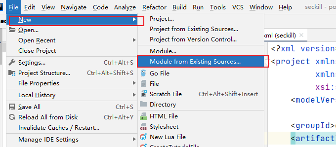

2、

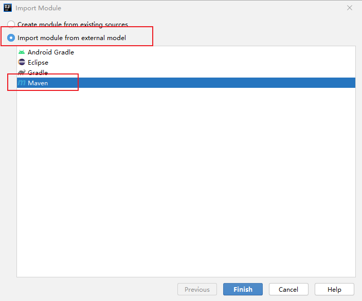


