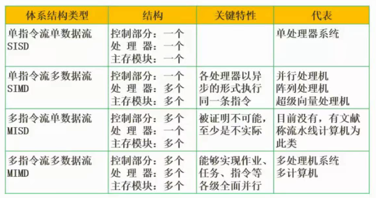
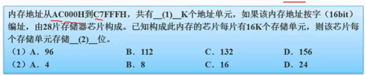
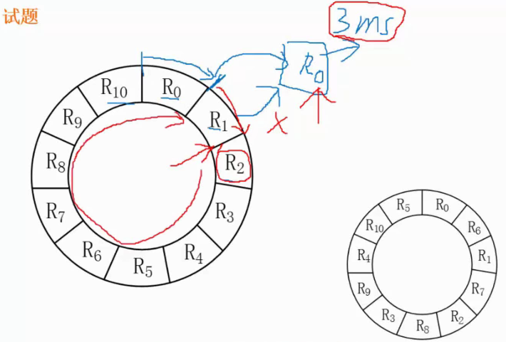

# 计组


<!-- more -->

## Flynn分类法



## CISC和RISC

考频高


CISC 在计算机尚未普及的时候提出的，一般都是定制的

## 层次化存储


最快的是寄存器，按个算的

设计理念：基于性价比

## Cache

可以拿掉

按内容存取

Cache的功能:提高CPU数据输入输出的速率，突破冯·诺依曼瓶颈，即CPU与存储系统间数据传送带宽限制。

在计算机的存储系统体系中，Cache是访问速度最快的层次。

使用Cache改善系统性能的依据是程序的局部性原理。


## 局部性原理

楼sir的话：

- 时间局部性：最近访问的一会儿可能还会访问
- 空间局部性：访问的这，那这附件的可能也会被访问

工作集理论：工作集指进程运行时被频繁访问的页面集合

## ROM和RAM

ROM：Read Only Memory，只读存储器

RAM：Random Access Memory，随机访问存储器，断电后数据丢失，比如内存


例题：



直接做减法，记得加一（因为0到9是十个数）：

```tex
 C7FFFH
-AC000H
 --------------
 1BFFFH + 1 = 1C000H
 
注意这里可以先+1，然后做减法，因为 C7FFFH + 1 = C8000H
```

然后除以 1024

1C000H = $ (1 * 2^{16} + 1 * 2^{15} + 1 * 2^{14}) / 2^{10} = 112k$

然后就是一个恒等问题

$ 112k * 16 = 28 * 16k * x $

则 $ x = 4 $

## 磁盘工作原理


试题


解析：

转一圈33ms，一圈11个物理块，则读一个块的时间：33 / 11 = 3ms

读完放到缓存区处理，处理一次3ms

1、单缓存就是最差的情况



前10个，一圈加读取一次=33+3=36

总共：$ 36 * 10 + 3 + 3= 366ms $

2、优化

$ 6 * 11 = 66ms$

## 计算机性能指标和阿姆达尔解决方案

性能指标


阿姆达尔解决方案


一般都是求加速比

**例题**


不需要记公式

## 性能评价方法


现在的瓶颈在 `I/O`

## 性能检测方法

软件监控：使用软件对系统性能数据进行采集分析，此方法会**消耗较多的系统资源**。

硬件监控：使用专用硬件设备对系统性能数据进行采集分析，**适用于高负载**的计算机系统。


