# 软件工程

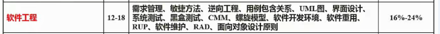

<!-- more -->

## 软件开发方法★★★

结构化法
- 用户至上
- 严格区分工作阶段，每阶段有任务与成果
- 强调系统开发过程的整体性和全局性
- 系统开发过程工程化，文档资料标准化
- 自顶向下，逐步分解(求精)

原型法
- 适用于**需求不明确**的开发
- 包括抛弃型原型和进化型原型

面向对象方法
- 更好的复用性
- 关键在于建立一个全面、合理、统一的模型
- 分析、设计、实现三个阶段，界限不明确

面向服务的方法
- SO方法有三个主要的抽象级别：操作、服务、业务流程
- SOAD分为三个层次：基础设计层（底层服务构件)、应用结构层（服务之间的接口和服务级协定）和业务组织层（业务流程建模和服务流程编排)
- 服务建模：分为服务发现、服务规约和服务实现三个阶段

## 软件开发模型★★★★


### 瀑布模型

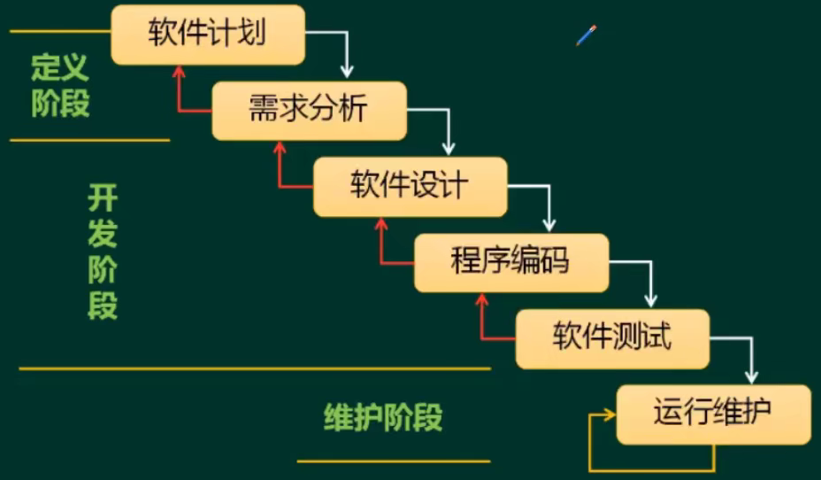

需求分析阶段会产生SRS需求说明书

每个阶段都需要评审

结构化方法的展现

适合需求明确的项目

### 其他经典模型


快速原型：原型被抛弃了

### 增量模型与螺旋模型


螺旋适合大型系统，有风险分析

### V模型


V模型：测试计划提前做

RAD（快速应用开发）：瀑布 + 基于构件的开发


强大的构件库，快、省成本、可靠性高

构件库的积累是很花时间的（可以直接用现成的）

### 统一过程


```tex
初始 -> 细化 -> 构建 -> 交付
```


### 敏捷方法

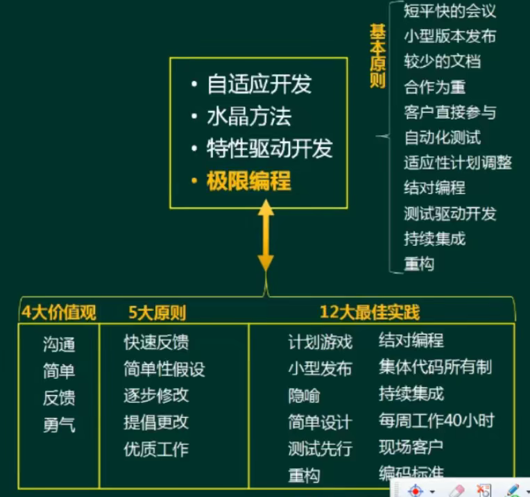

小步快跑的模式，适用小型项目开发

大项目拆成小项目，也就成了敏捷开发

勇气：应对变更的勇气

测试先行：先写测试计划、测试用例


XP (Extreme Programming，极限编程)在所有的敏捷型方法中，XP是最引人瞩目的。它源于Smalltalk圈子，特别是Kent Beck和Ward Cunningham在20世纪80年代末的密切合作。XP在一些对**费用控制严格的公司中的使用**，已经被证明是**非常有效**的。

Cockburn的水晶系列方法，水晶系列方法是由Alistair Cockburn提出的。它与XP方法一样，都有以人为中心的理念，但在实践上有所不同。Alistair考虑到人们一般很难严格遵循一个纪律约束很强的过程，因此，与XP的高度纪律性不同，Alistair探索了用**最少纪律约束而仍能成功的方法**，从而在产出效率与易于运作上达到一种平衡。也就是说，虽然水晶系列不如XP那样的产出效率，但会有更多的人能够接受并遵循它。

开放式源码，这里提到的开放式源码指的是开放源码界所用的一种运作方式。开放式源码项目有一个特别之处，就是**程序开发人员在地域上分布很广**，这使得它和其他敏捷方法不同，因为一般的敏捷方法都强调项目组成员在同一地点工作。开放源码的一个突出特点就是查错排障(debug)的高度并行性，任何人发现了错误都可将改正源码的“补丁”文件发给维护者。然后由维护者将这些“补丁”或是新增的代码并入源码库。

SCRUM。SCRUM己经出现很久了，像前面所论及的方法一样，该方法强调这样一个事实，即**明确定义了的可重复的方法过程**只限于在明确定义了的可重复的环境中，为明确定义了的可重复的人员所用，去解决明确定义了的可重复的问题。

Coad的功用驱动开发方法(FDD-Feature Driven Development)

- FDD是由Jeff De Luca和大师Peter Coad提出来的。像其他方法一样，它致力于短时的迭代阶段和可见可用的功能。在FDD中，一个迭代周期一般是两周。
- 在FDD中，编程开发人员分成两类：**首席程序员和“类”程序员**(class owner)。首席程序员是最富有经验的开发人员，他们是项目的协调者、设计者和指导者，而“类”程序员则主要做源码编写。

ASD方法，ASD (Adaptive Software Development)方法由Jim Highsmith提出，其核心是三个非线性的、重叠的开发阶段：**猜测、合作与学习**。

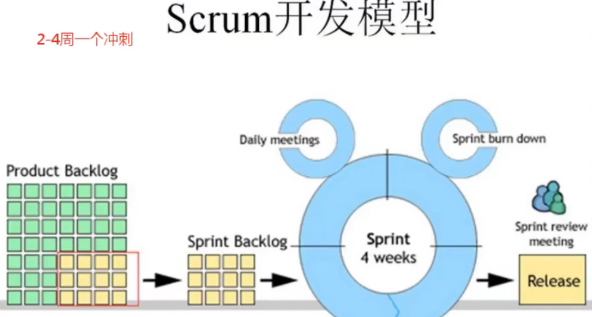

### 逆向工程★


### 净室软件工程★

净室即无尘室、洁净室。也就是一个受控污染级别的环境。

使用盒结构规约（或形式化方法）进行分析和设计建模，并且强调将正确性验证，而不是测试，作为发现和消除错误的主要机制。

使用统计的测试来获取认证被交付的软件的可靠性所必需的出错率信息。

## 需求工程

软件需求是指用户对系统在功能、行为、性能、设计约束等方面的期望。

软件需求是指用户解决问题或达到目标所需的条件或能力，是系统或系统部件要满足合同、标准、规范或其他正式规定文档所需具有的条件或能力，以及反映这些条件或能力的文档说明。


### 需求获取★★★


抽样调查可以节省成本

### 需求分析★★★

#### 结构化需求分析（SA）


数据流图：数据流、加工、数据存储、外部实体

#### 面向对象分析（OOA）


对象三要素：属性、方法、ID

边界类一般是接口


## UML

UML4+1视图★★★★

UML图★★★★★

UML关系★★★★


组成部分：


部署图：这时候系统已经开发出来了


逻辑：展现系统的功能

### 用例模型和分析模型

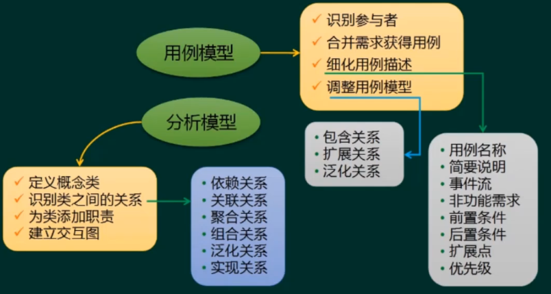

### 用例图

- 用例图描述一组用例、参与者及它们之间的关系。

- 用户角度描述系统功能；

- 参与者是外部触发因素(包括用户、组织、外部系统，时间)

- 用例是功能单元。


关系包括：包含关系、扩展关系、泛化关系

- 包含关系一定会被用到，拓展关系不然

- 泛化是一种父子关系

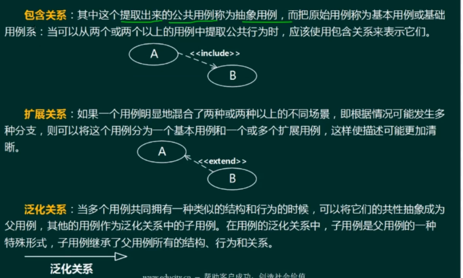


用例建模的流程：

- 识别参与者（必须)

- 合并需求获得用例（必须)

- 细化用例描述（必须)

- 参与者

- 调整用例模型（可选)


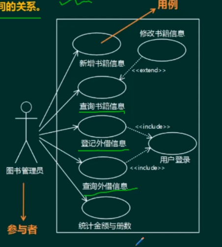

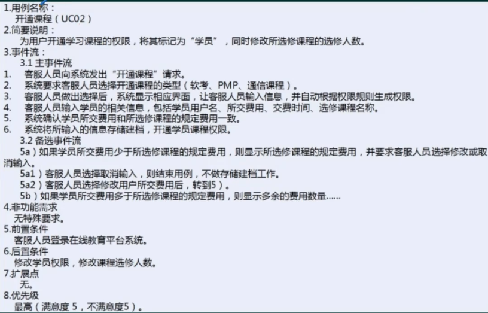

### 类图和对象图

#### 类图

类图( class diagram )：类图描述一组类、接口、协作和它们之间的关系。

- 类名、方法名、属性名


1：表示一个集合中的一个对象对应另一个集合中1个对象。
0..\*：表示一个集合中的一个对象对应另一个集合中的0个或多个对象。
(可以不对应)
1..\*：表示一个集合中的一个对象对应另一个集合中的一个或多个对象。
(至少对应一个)
\*：表示一个集合中的一个对象对应另一个集合中的多个的对象。

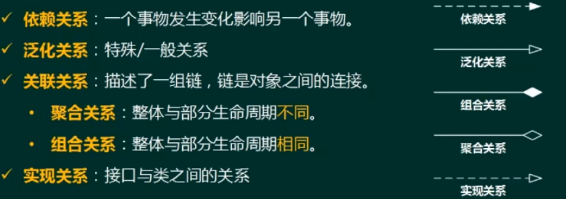

聚合：汽车和轮子

组合：公司和公司的部门

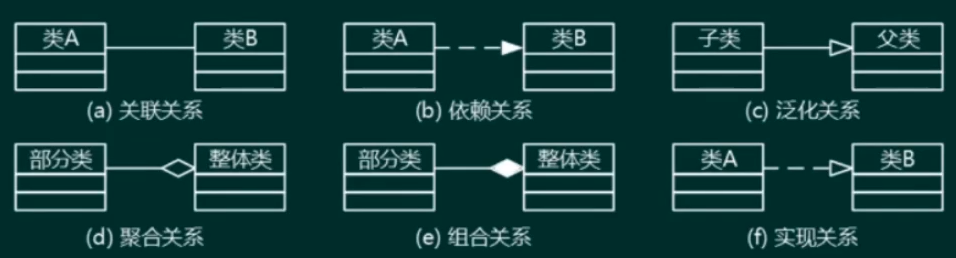

菱形在整体那

#### 对象图

对象图(object diagram ) ：对象图描述一组对象及它们之间的关系。对象图描述了在类图中所建立的事物实例的静态快照。

### 顺序图

顺序图( sequence diagram，序列图)。顺序图是一种交互图( interactiondiagram )，它强调对象之间消息发送的顺序，同时显示对象之间的交互。

（出现频率不高）


方框里面是一个对象

### 活动图

活动图( activity diagram )。活动图将进程或其他计算结构展示为计算内部一步步的控制流和数据流。活动图专注于系统的动态视图。它对系统的功能建模和业务流程建模特别重要，并强调对象间的控制流程。


每一个节点是动作

### 状态图

状态图(state diagram )。状态图描述一个状态机，它由状态、转移、事件和活动组成。状态图给出了对象的动态视图。它对于接口、类或协作的行为建模尤为重要，而且它强调事件导致的对象行为，这非常有助于对反应式系统建模。

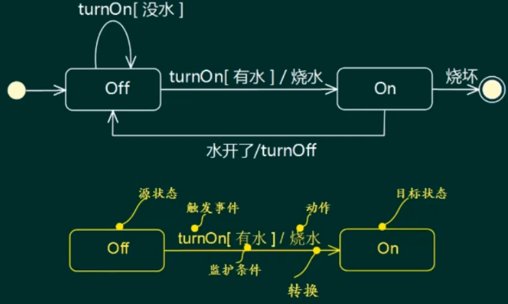


**实例**


### 通信图

通信图( communication diagram)。通信图也是一种交互图，它强调收发消息的对象或参与者的结构组织。顺序图和通信图表达了类似的基本概念，但它们所强调的概念不同，顺序图强调的是时序，通信图强调的是对象之间的组织结构(关系)。


系统与外界的交互：用例图、协作图

## 需求定义

SRS（需求规格说明书）

严格定义法：

- 所有需求都能够被预先定义（结构化的思想）
- 开发人员与用户之间能够准确而清晰地交流
- 采用图形/文字可以充分体现最终系统

原型法：

- 并非所有的需求都能在开发前被准确地说明
- 项目参加者之间通常都存在交流上的困难
- 需要实际的、可供用户参与的系统模型
- 有合适的系统开发环境
- 反复是完全需要和值得提倡的，需求一旦确定，就应遵从严格的方法

### 需求评审

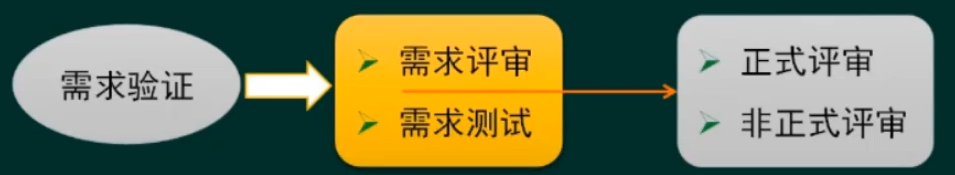

用户签字确认、验收标注之一

### 定义需求基线


（最多考一个选择题）

### 需求跟踪

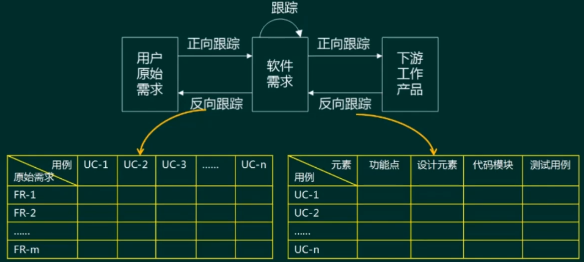

需求跟踪矩阵

左图：

- 用例做好一个打一个勾

- 如果整列都空，说明没有对应原始需求

- 整行都空，原始需求没实现，有漏洞

### 变更控制


基线之后，需求变了，就需要走变更控制流程

## 软件系统建模

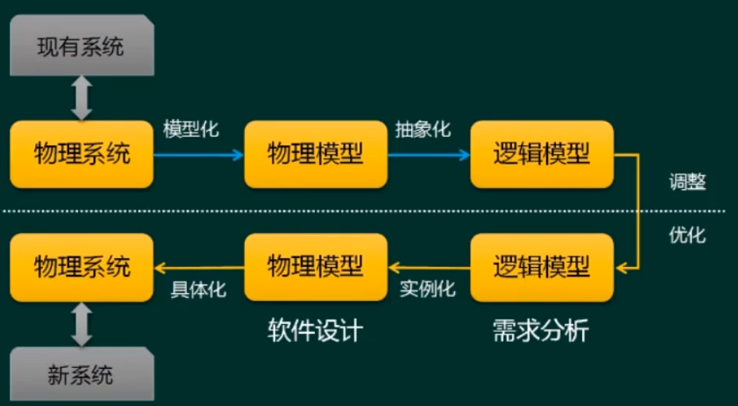


**论文示例**

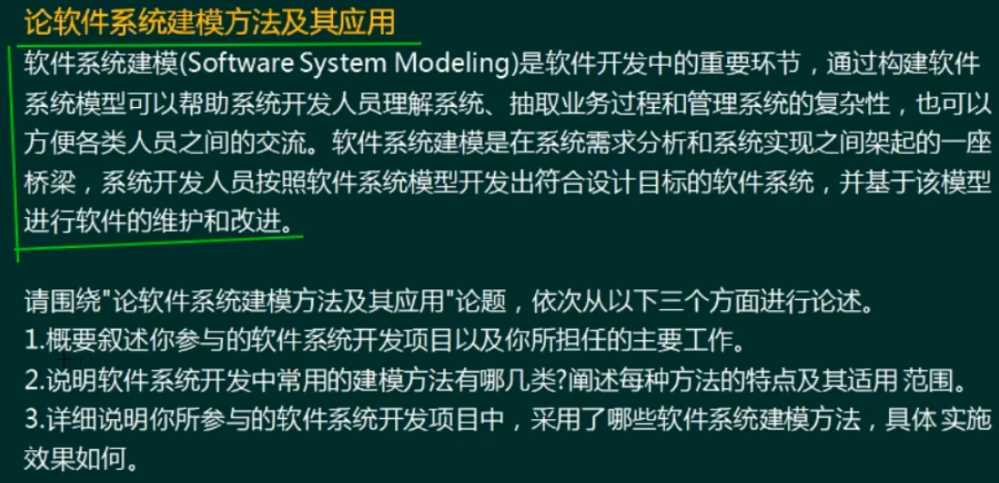


1、结构化建模方法
结构化建模方法是以过程为中心的技术，可用于分析一个现有的系统以及定义新系统的业务需求。结构化建模方法所绘制的模型称为数据流图（DFD )。对于流程较为稳定的系统可考虑结构化建模方法。

2、信息工程建模方法（或数据库建模方法)
信息工程建模方法是一种以数据为中心，但过程敏感的技术，它强调在分析和研究过程需求之前，首先研究和分析数据需求。信息工程建模方法所创建的模型被称为实体联系图(ERD )。主要用于数据建模。

3、面向对象建模方法
面向对象建模方法将“数据”和“过程”集成到被称为“对象”的结构中，消除了数据和过程的人为分离现象。面向对象建模方法所创建的模型被称为对象模型。随着面向对象技术的不断发展和应用，形成了面向对象的建模标准，即UML（统一建模语言)。UML定义了几种不同类型的模型图，这些模型图以对象的形式共建一个信息系统或应用系统。目前比较常用的建模方法。

## 系统设计

### 人机界面设计★★

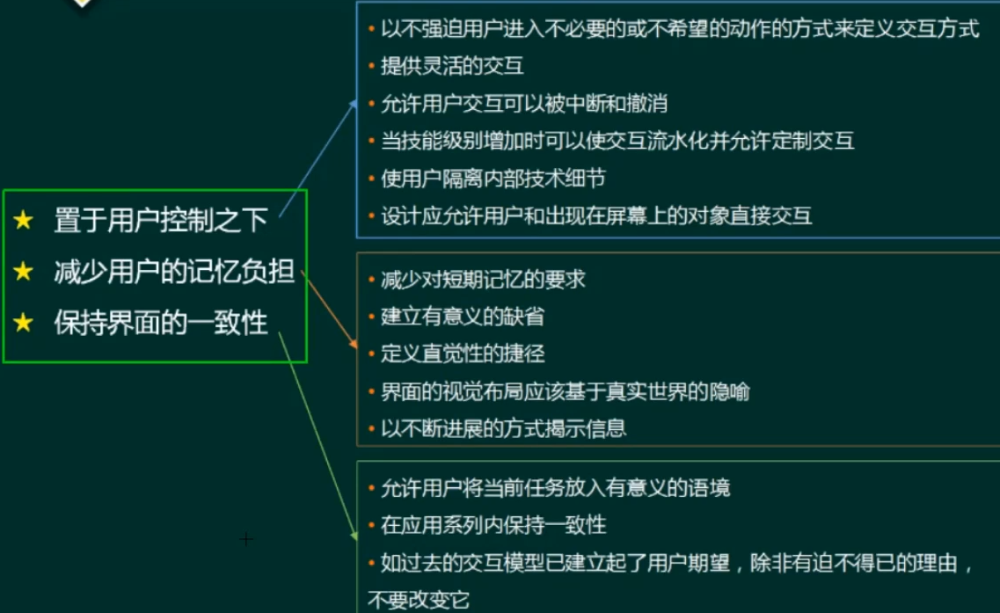


### 结构化设计★★


- 保持模块的大小适中

- 尽可能减少调用的深度

- 多扇入，少扇出

- 单入口，单出口
- 模块的作用域应该在模块之内

- 功能应该是可预测的


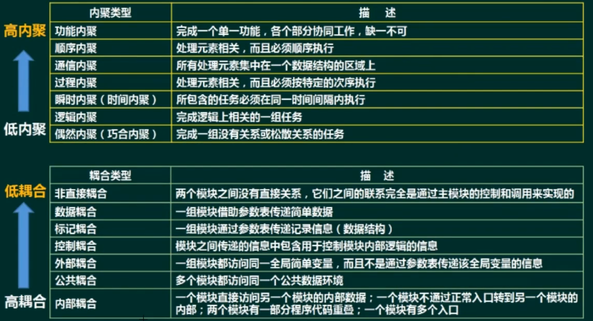

### 面向对象设计★★★★★

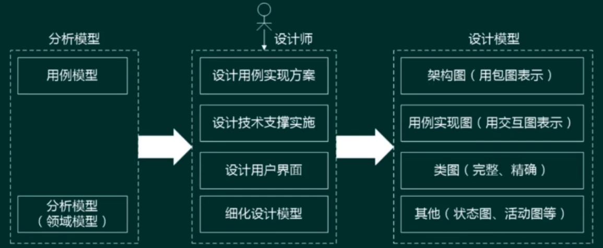


#### 原则

- 单一职责原则：设计目的单一的类

- 开放-封闭原则：对扩展开放，对修改封闭

- 李氏(Liskov)替换原则：子类可以替换父类

- 依赖倒置原则：要依赖于抽象，而不是具体实现;针对接口编程，不要针对实现编程

- 接口隔离原则：使用多个专门的接口比使用单一的总接口要好

- 组合重用原则：要尽量使用组合，而不是继承关系达到重用目的

- 迪米特(Demeter)原则(最少知识法则)：一个对象应当对其他对象有尽可能少的了解

#### 设计模式

##### 概念

架构模式：软件设计中的高层决策，例如C/S结构，架构模式反映了开发软件系统过程中所作的基本设计决策

设计模式：主要关注软件系统的设计，与具体的实现语言无关

惯用法∶是最低层的模式，关注软件系统的设计与实现，实现时通过某种特定的程序设计语言来描述构件与构件之间的关系。每种编程语言都有它自己特定的模式，即语言的惯用法。例如引用-计数就是C++语言中的一种惯用法

##### 分类


考察点：

- 设计模式三种类型的定位

- 设计模式分类

- 设计模式应用场景及特点（重点）

##### 创建型


##### 结构型


代理的目的是不直接接触

中介模式是把网状变星型

##### 行为型

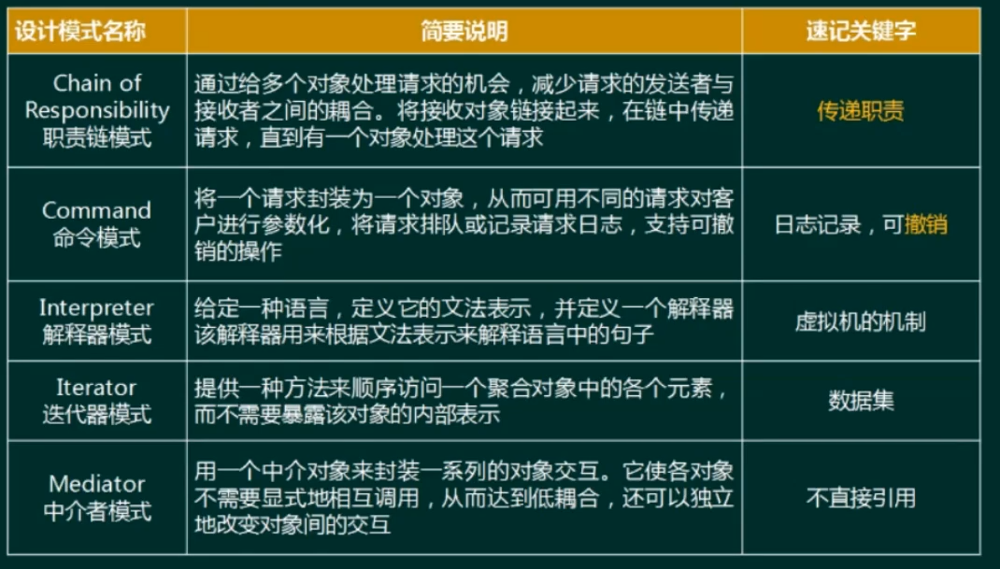


## 软件测试

### 方法

动态：计算机运行，有计算机运行

静态：纯手工，不依赖计算机


原则：

- 尽早、不断的进行测试

- 程序员避免测试自己设计的程序

- 既要选择有效、合理的数据，也要选择无效、不合理的数据
- 修改后应进行回归测试（修改1个BUG，很可能引入新的BUG）

- 尚未发现的错误数量与该程序已发现错误数成正比


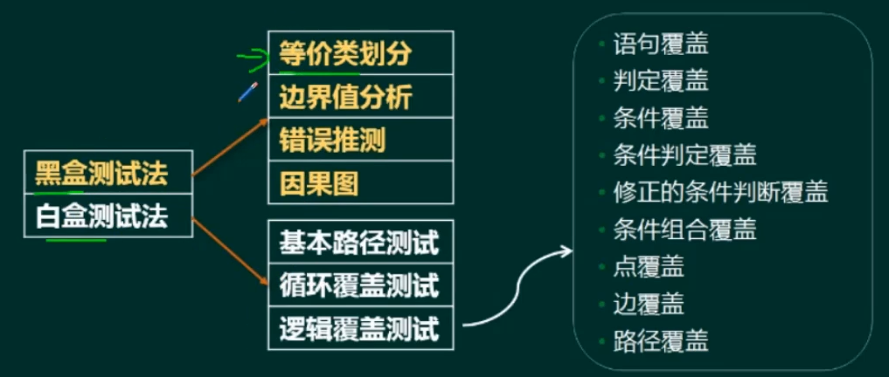


错误推测是依据经验进行的

语句覆盖最弱，路径最强

### 测试阶段


alpha测试是开发环境用户做的测试

beta测试是生产环境用户做的测试

### 面向对象的测试

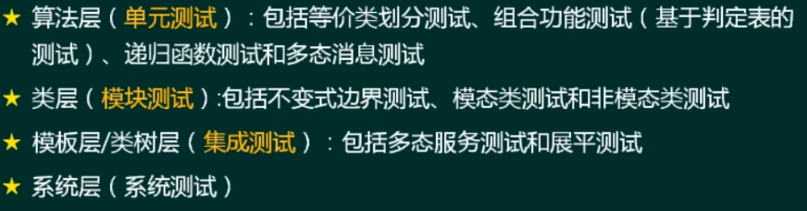

（不怎么考）

### 软件调试

★ 软件调试方法

- 蛮力法:主要思想是“通过计算机找错”，低效，耗时

- 回溯法∶从出错处人工沿控制流程往回追踪，直至发现出错的根源。复杂程序由于回溯路径多，难以实施

- 原因排除法:主要思想是演绎和归纳，用二分法实现


★ 软件调试与测试的区别

- 测试的目的是找出存在的错误，而调试的目的是定位错误并修改程序以修正错误

- 调试是测试之后的活动，测试和调试在目标、方法和思路上都有所不同

- 测试从一个已知的条件开始，使用预先定义的过程，有预知的结果;调试从一个未知的条件开始，结束的过程不可预计

- 测试过程可以事先设计，进度可以事先确定;调试不能描述过程或持续时间

## 系统转换计划和维护

（不咋考）

遗留系统演化策略


1、淘汰策略

遗留系统的技术含量较低，且具有较低的业务价值。对遗留系统的完全淘汰是企业资源的根本浪费，系统分析师应该善于“变废为宝”，通过对遗留系统功能的理解和借鉴，可以帮助新系统的设计，降低新系统开发的风险。

2、继承策略

遗留系统的技术含量较低，已经满足企业运作的功能或性能要求，但具有较高的商业价值，目前企业的业务尚紧密依赖该系统。对这种遗留系统的演化策略为继承。在开发新系统时，需要完全兼容遗留系统的功能模型和数据模型。为了保证业务的连续性，新老系统必须并行运行一段时间，再逐渐切换到新系统上运行。

3、改造策略

遗留系统具有较高的业务价值，基本上能够满足企业业务运作和决策支持的需要。这种系统可能建成的时间还很短，对这种遗留系统的演化策略为改造。改造包括系统功能的增强和数据模型的改造两个方面。系统功能的增强是指在原有系统的基础上增加新的应用要求，对遗留系统本身不做改变;数据模型的改造是指将遗留系统的旧的数据模型向新的数据模型的转化。

4、集成策略

遗留系统的技术含量较高，但其业务价值较低，可能只完成某个部门(或子公司)的业务管理。这种系统在各自的局部领域里工作良好，但对于整个企业来说，存在多个这样的系统，不同的系统基于不同的平台、不同的数据模型，形成了一个个信息孤岛，对这种遗留系统的演化策略为集成。


新老系统转换策略


数据转换与迁移


运行和维护

正确性（改正性）维护：指改正在系统开发阶段已发生而系统测试阶段尚未发现的错误。

适应性维护：指使应用软件适应信息技术变化和管理需求变化而进行的修改。企业的外部市场环境和管理需求的不断变化也使得各级管理人员个断是出别日信息需求。（操作系统变化、软件运行环境变化导致系统不能正常运行）

完善性维护：**扩充功能和改善性能**而进行的修改。对已有的软件系统增加一些在系统分析和设计阶段中没有规定的功能与性能特征。

预防性维护：为了改进应用软件的可靠性和可维护性，为了适应未来的软硬件环境的变化，应主动增加预防性的新的功能，以使用系统适应各类变化而不被淘汰。如将专用报表功能改成通用报表生成功能，以适应将来报表格式的变化。

### 软件过程改进


