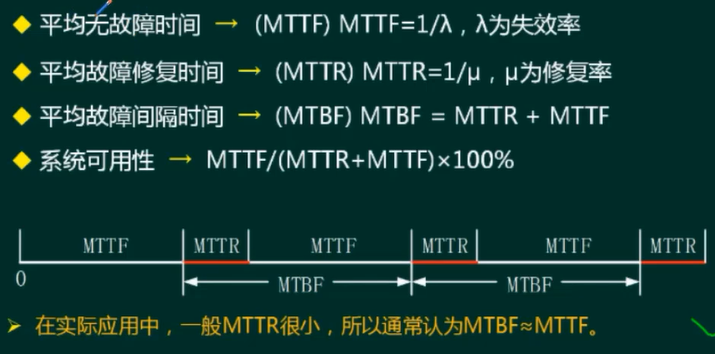
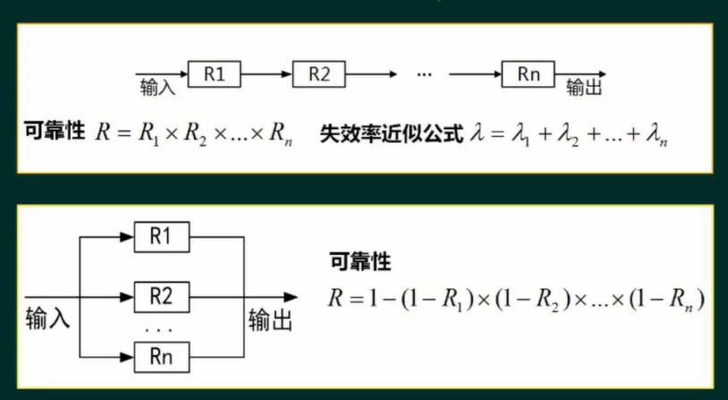
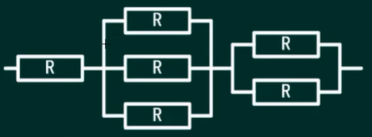
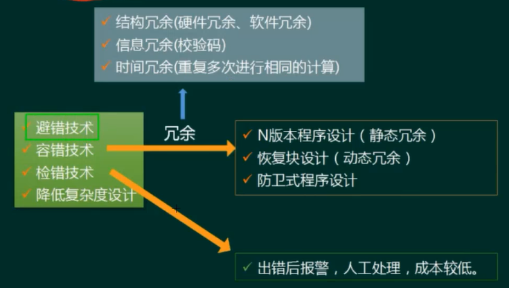
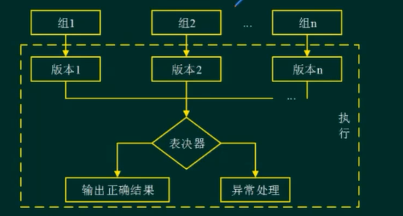
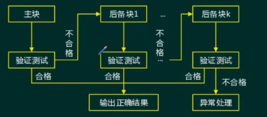
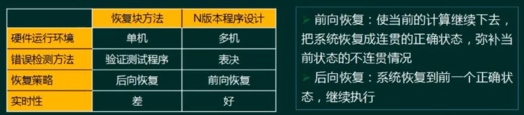
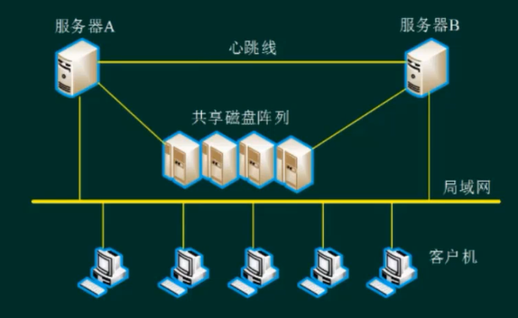

# 系统可靠性分析与设计

论文和案例考的多，综合考2分左右

<!-- more -->

## 可靠性相关基本概念（★★）

**系统可靠性**是系统在规定的时间内及规定的环境条件下，完成规定功能的能力，也就是系统无故障运行的概率。

**系统可用性**是指在某个给定时间点上系统能够按照需求执行的概率。

**软件可靠性≠硬件可靠性**

- 复杂性：软件复杂性比硬件高，大部分失效来自于软件失效。

- 物理退化：硬件失效主要是物理退化所致，软件不存在物理退化。

- 唯一性：软件是唯一的，每个COPY版本都一样，而两个硬件不可能完全一样。

- 版本更新周期：硬件较慢，软件较快。

## 系统可靠性分析（★★★★）

### 可靠性指标

### 串联系统和并联系统

### 混合系统

$R*(1-(1-R)^3)*(1-(1-R)^2)$

## 软件可靠性设计（★★★★）

- 避错技术
- 容错技术
  - 冗余
- 检错技术
  - 出错后报警，人工处理，成本较低
- 降低复杂度设计

### N版本程序设计

与通常软件开发过程不同的是，N版本程序设计增加了三个新的阶段：相异成份规范评审、相异性确认、背对背测试

N版本程序的同步、N版本程序之间的通信、表决算法（全等表决、非精确表决、Cosmetie表决）、一致比较问题、数据相异性

> 每一步都从不同的版本采集数据，然后表决

> 可以只针对一个功能用 N 版本

### 恢复快方法

设计时应保证实现主块和后备块之间的独立性，避免相关错误的产生，使主块和备份块之间的共性错误降到最低程度。

必须保证验证测试程序的正确性。

前向恢复：出了故障，系统继续运行，到某个时间点，系统自动恢复正常

后向恢复：出了故障，回退版本

### 防卫式程序设计

对于程序中存在的错误和不一致性，通过在程序中包含错误检查代码和错误恢复代码，使得一旦错误发生，程序能撤消错误状态，恢复到一个已知的正确状态中去

实现策略：错误检测、破坏估计、错误恢复

### 双机容错

- 双机热备模式（主系统、备用系统)：备份平时一般不开启服务

- 双机互备模式(同时提供不同的服务，心不跳则接管）

- 双机双工模式（同时提供相同的服务，集群的一种)

### 集群技术

可伸缩性、高可用性、可管理性、高性价比、高透明性

