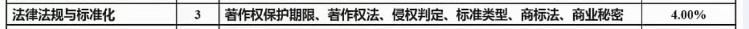
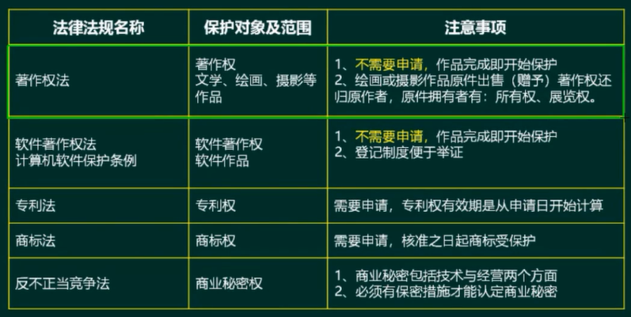
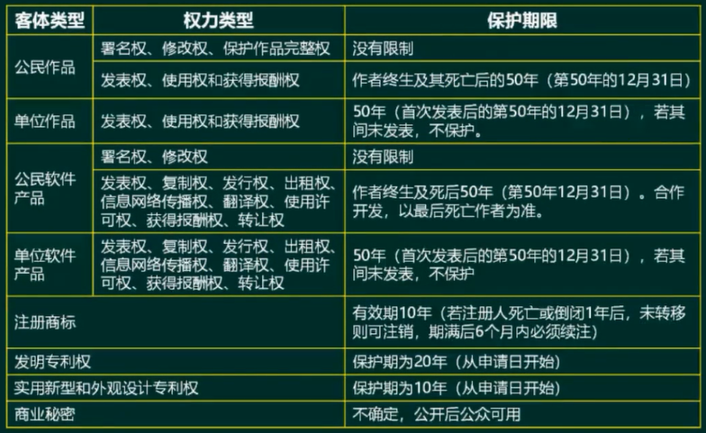
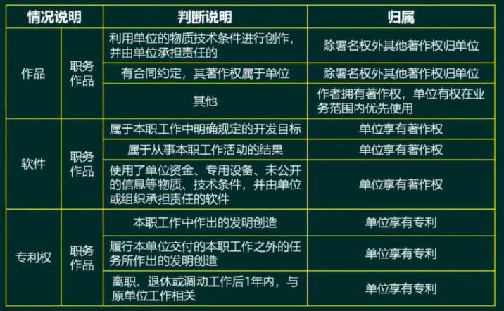
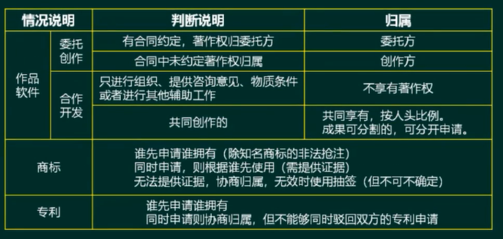
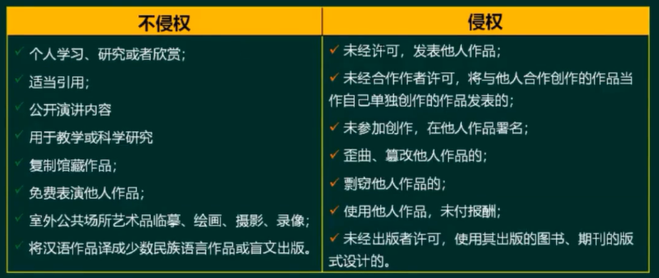

# 知识产权与标准化

必考

<!-- more -->

## 保护范围与对象（★★★）

## 保护期限（★★）

## 知识产权人确定（★★★）

## 侵权判断（★★★★）

中国公民、法人或者其他组织的作品，不论是否发表，都享有著作权。

开发软件（带有业务逻辑的程序+文档）所用的思想、处理过程、操作方法或者数学概念不受保护

著作权法不适用于下列情形：

- 法律、法规，国家机关的决议、决定、命令和其他具有立法、行政、司法性质的文件，及其
  官方正式译文
- 时事新闻
- 历法、通用数表、通用表格和公式

## 标准的分类（★）

国际标准：ISO、IEC等国际标准化组织

国家标准：GB—中国、ANSI—美国、BS—英国、JIS—日本

区域标准：又称为地区标准，如PASC—太平洋地区标准会议、CEN—欧洲标准委员会、ASAC—亚洲标准咨询委员会、ARSO—非洲地区标准化组织

行业标准：GJB一中国军用标准、MIT-S—美国军用标准、IEEE一美国电气电子工程师协会

地方标准：国家的地方一级行政机构制订的标准

企业标准

项目规范

## 标准代号的识别（★）

国际、国外标准代号：标准代号+专业类号+顺序号+年代号

我国国家标准代号：强制性标准代号为GB、推荐性标准代号为GB/指导性标准代号为GB/Z、实物标准代号GSB

行业标准代号：由汉语拼音大写字母组成（如电子行业为SJ）地方

标准代号：由DB加上省级行政区划代码的前两位

企业标准代号：由Q加上企业代号组成